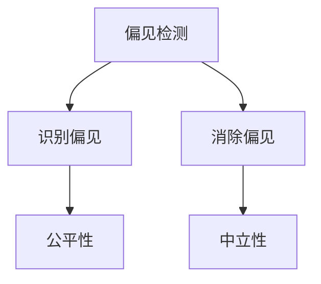

                 

## 偏见检测：评估LLM输出的公平性和中立性

### 关键词：
- 偏见检测
- 语言模型
- 公平性
- 中立性
- 评估方法

### 摘要：
本文旨在探讨如何使用偏见检测技术来评估大型语言模型（LLM）输出的公平性和中立性。我们将首先介绍偏见检测的定义、背景及其重要性，接着深入分析LLM的偏见来源，并详细讨论偏见检测的方法和评估指标。此外，本文还将介绍如何在实际项目中应用偏见检测技术，并提供相关的最佳实践和注意事项。通过本文的阅读，读者将全面了解偏见检测的核心概念和实际应用，为在AI领域推动公平性和中立性的实现提供理论基础和实践指导。

### 引言

在当今社会，人工智能（AI）技术已经广泛应用于各个领域，从智能家居、自动驾驶到金融、医疗，AI正逐步改变我们的生活方式。然而，随着AI技术的快速发展，其潜在的偏见问题也逐渐引起了广泛关注。偏见可能来源于数据、算法、或者社会文化等多个方面，而这些偏见会直接影响到AI系统输出的公平性和中立性。特别是在大型语言模型（LLM）领域，由于LLM的训练数据往往来自互联网，其中可能包含大量的偏见信息，因此评估和检测LLM输出的偏见性变得尤为重要。

偏见检测的目标是识别和消除AI系统中的偏见，以确保其输出的公平性和中立性。公平性指的是AI系统不因用户的性别、种族、年龄等因素而对待用户的方式不同；中立性则是指AI系统在处理信息时，不受外界观点和价值观的影响。偏见检测不仅有助于提升AI系统的社会可信度，还能防止潜在的歧视和法律问题，从而推动AI技术的健康发展。

本文将围绕偏见检测这一主题，系统地探讨以下内容：

1. **偏见检测的基础知识**：介绍偏见检测的定义、目标、分类及其与公平性和中立性的关系。
2. **LLM的偏见来源**：分析LLM中可能存在的数据偏见、算法偏见和社会偏见，并提供具体案例。
3. **偏见检测的方法**：详细讲解基于规则、统计和机器学习的偏见检测方法，以及相应的评估指标。
4. **偏见检测的实现**：介绍偏见检测在LLM中的应用流程，包括数据预处理、模型选择和实现过程。
5. **偏见检测的挑战与解决方案**：讨论偏见检测中可能遇到的挑战，并提出相应的解决方案。
6. **偏见检测的实际应用**：分析偏见检测在社交媒体、新闻与媒体以及AI客服等领域的应用案例。
7. **结论**：总结偏见检测的重要性，并展望未来的发展趋势。

通过本文的阅读，读者将全面了解偏见检测的核心概念和技术，为在实际项目中应用偏见检测提供参考和指导。

### 偏见检测的基础知识

#### 定义偏见

偏见是指在决策过程中，因个人、社会或文化等因素导致的非理性、不公平的态度或行为。在人工智能领域，偏见指的是AI系统在处理数据或生成输出时，基于某些特定的特征（如性别、种族、年龄等）产生的歧视性结果。偏见不仅违背了公平和正义的原则，还可能导致严重的法律和社会问题。

#### 偏见检测的定义和目标

偏见检测是指通过算法和技术手段，识别和消除AI系统中存在的偏见。其目标是确保AI系统在处理数据、生成输出时，能够公平、中立地对待所有用户，不因特定特征而产生歧视性结果。偏见检测的核心任务包括以下两个方面：

1. **识别偏见**：通过分析AI系统的输入数据和输出结果，识别其中是否存在偏见。
2. **消除偏见**：通过调整算法、优化数据集或改进模型训练过程，消除AI系统中的偏见。

#### 偏见检测的分类

偏见检测的方法可以分为以下几类：

1. **基于规则的偏见检测**：通过预定义的规则和条件，识别和消除AI系统中的偏见。这种方法通常适用于处理结构化数据，具有较高的检测准确性，但灵活性较差。

2. **基于统计的偏见检测**：利用统计学方法，分析AI系统输出结果与输入特征之间的相关性，识别潜在的偏见。这种方法适用于处理大规模非结构化数据，能够发现复杂的数据模式，但可能存在误判和漏判的情况。

3. **基于机器学习的偏见检测**：通过训练机器学习模型，自动识别和消除AI系统中的偏见。这种方法具有较高的灵活性和鲁棒性，能够处理复杂的数据集，但可能受到数据质量和模型性能的影响。

#### 偏见检测与公平性和中立性的关系

偏见检测是确保AI系统公平性和中立性的关键手段。公平性指的是AI系统在处理数据、生成输出时，不因用户的性别、种族、年龄等因素而对待用户的方式不同。中立性则是指AI系统在处理信息时，不受外界观点和价值观的影响。

偏见检测的目标是确保AI系统在处理数据时，能够公平、中立地对待所有用户，不因特定特征而产生歧视性结果。通过偏见检测，我们可以识别和消除AI系统中的偏见，从而提高其公平性和中立性，确保AI技术的健康发展。

#### 偏见检测的核心概念原理之间的关系架构

为了更好地理解偏见检测的核心概念原理之间的关系，我们可以使用Mermaid流程图来展示其架构：



在这个流程图中，偏见检测包括识别偏见和消除偏见两个核心任务。识别偏见是确保AI系统公平性的关键，而消除偏见则是实现AI系统中立性的基础。通过偏见检测，我们可以提高AI系统的公平性和中立性，从而确保其输出的公正性和可信度。

### LLM的偏见来源

#### 数据偏见

数据偏见是指AI系统在训练过程中，由于数据集的不完善或不均衡导致的偏见。在大型语言模型（LLM）中，数据偏见的主要来源包括以下几点：

1. **数据集不完善**：训练数据集可能包含一些不完整、错误或不准确的信息，这些信息会影响LLM的输出结果。例如，一些社交媒体平台上的数据可能包含虚假信息或偏见言论。
2. **数据集不均衡**：训练数据集中的不同类别的样本数量可能不均衡，这会导致LLM在处理某些特定类别时出现偏差。例如，一个关于新闻文章的LLM在训练过程中，如果关于某个特定种族或性别的文章数量较少，那么LLM在生成相关内容时可能倾向于忽略这个群体。
3. **数据清洗不足**：在数据收集和处理过程中，可能存在一些垃圾数据或噪声数据，这些数据会影响LLM的训练效果。例如，在处理包含大量侮辱性词汇的数据时，LLM可能学会使用这些不当语言。

#### 算法偏见

算法偏见是指AI系统的设计或实现过程中，由于算法本身的特性导致的偏见。在LLM中，算法偏见的主要来源包括以下几点：

1. **模型选择**：某些模型在处理特定类型的输入时可能存在偏见。例如，某些生成模型在生成文本时，可能更倾向于生成某些特定类型的句子，从而影响其公平性和中立性。
2. **训练目标**：在训练过程中，如果训练目标不明确或设计不当，可能会导致算法偏见。例如，为了提高模型的性能，训练目标可能侧重于某些特定类别的任务，从而忽略其他类别。
3. **优化方法**：优化算法的选择和参数设置也可能导致算法偏见。例如，某些优化算法可能更倾向于在某些特征上取得更好的结果，从而导致其他特征上的偏见。

#### 社会偏见

社会偏见是指社会文化、价值观等因素对AI系统输出结果的影响。在LLM中，社会偏见的主要来源包括以下几点：

1. **文化差异**：不同地区、国家和文化背景下的价值观和语言习惯可能影响LLM的输出。例如，某些语言模型可能更擅长处理某种特定的文化背景下的语言，而忽视其他文化背景。
2. **偏见观念**：在社交媒体、新闻媒体等传播渠道中，存在大量的偏见观念和言论，这些偏见观念和言论可能被LLM所吸收，从而影响其输出结果。
3. **社会价值观**：社会价值观的变化和演变也可能影响LLM的输出结果。例如，随着社会对某些问题的关注程度提高，LLM在生成相关内容时可能更倾向于反映这些变化。

#### 具体案例

以下是一些关于LLM偏见的具体案例：

1. **性别偏见**：在某些语言模型中，女性名字和男性名字的使用频率可能不均衡，导致生成内容中存在性别偏见。例如，一个关于招聘广告的LLM可能更倾向于使用男性名字，从而在无意中歧视女性求职者。
2. **种族偏见**：某些LLM在生成关于种族问题的内容时，可能倾向于使用带有偏见或歧视性的语言。例如，一个关于新闻文章的LLM可能在使用某些种族词汇时，带有明显的偏见。
3. **政治偏见**：某些LLM在生成关于政治问题的内容时，可能倾向于某些政治观点，从而影响其输出的中立性。例如，一个关于选举辩论的LLM可能更倾向于支持某个政党的观点。

通过以上分析，我们可以看到，LLM中的偏见来源多样且复杂，包括数据偏见、算法偏见和社会偏见。为了确保LLM输出的公平性和中立性，我们需要在数据收集、算法设计和模型训练等方面进行充分考虑，以消除潜在的偏见。

### 偏见检测的方法

#### 基于规则的偏见检测

基于规则的偏见检测是一种传统的偏见检测方法，通过预定义的规则和条件来识别和消除AI系统中的偏见。这种方法具有以下特点：

1. **规则定义**：基于规则的偏见检测首先需要定义一系列规则，这些规则用于描述哪些特征或行为被视为偏见。规则可以基于专业知识或数据分析得出，例如，在性别偏见检测中，可以定义规则“女性名字的使用频率不应低于男性名字的使用频率”。
2. **规则匹配**：在检测过程中，将输入数据与预定义的规则进行匹配，如果匹配成功，则认为存在偏见。例如，在招聘广告的偏见检测中，如果检测到广告中使用了带有性别歧视的语言，则认为存在性别偏见。
3. **规则更新**：随着AI系统和应用场景的变化，需要定期更新和优化规则，以确保检测的准确性和有效性。

优点：

- **检测准确度高**：基于规则的偏见检测能够准确地识别和消除系统中的偏见，特别是在处理结构化数据时，效果显著。
- **易于理解和实现**：基于规则的偏见检测方法简单直观，易于理解和实现，适用于各种应用场景。

缺点：

- **灵活性较差**：基于规则的偏见检测方法难以适应复杂多变的数据和场景，无法处理复杂的偏见关系。
- **规则依赖性**：依赖预定义的规则，可能导致在规则未覆盖的领域出现检测盲区。

#### 基于统计的偏见检测

基于统计的偏见检测方法通过分析AI系统的输入数据和输出结果之间的统计关系，识别潜在的偏见。这种方法具有以下特点：

1. **相关性分析**：基于统计的偏见检测首先对输入数据与输出结果进行相关性分析，识别出可能存在偏见的特征。例如，在性别偏见检测中，可以分析女性和男性在系统输出结果中的使用频率差异。
2. **假设检验**：通过假设检验方法，对相关性分析结果进行统计显著性检验，确定是否存在偏见。例如，可以检验“女性名字的使用频率与男性名字的使用频率是否显著不同”。
3. **模型优化**：根据检测结果，对AI系统的参数和模型进行优化，消除潜在的偏见。

优点：

- **适应性较强**：基于统计的偏见检测方法能够处理大规模非结构化数据，适应性强，适用于复杂的应用场景。
- **模型鲁棒性**：通过统计分析和模型优化，可以提高AI系统的鲁棒性，降低偏见的影响。

缺点：

- **误判和漏判**：基于统计的偏见检测方法可能存在误判和漏判的情况，导致检测结果的准确性受到影响。
- **计算复杂度高**：统计分析和模型优化过程可能涉及大量的计算资源，对系统性能和效率产生影响。

#### 基于机器学习的偏见检测

基于机器学习的偏见检测方法通过训练机器学习模型，自动识别和消除AI系统中的偏见。这种方法具有以下特点：

1. **数据预处理**：在训练机器学习模型之前，需要对输入数据进行预处理，包括数据清洗、归一化等操作，以提高模型的训练效果。
2. **模型训练**：通过训练机器学习模型，使模型能够自动识别和消除偏见。例如，可以使用监督学习、无监督学习或强化学习等方法。
3. **模型评估**：对训练好的模型进行评估，验证其识别和消除偏见的能力。常用的评估指标包括准确率、召回率、F1分数等。

优点：

- **高灵活性和鲁棒性**：基于机器学习的偏见检测方法具有较高的灵活性和鲁棒性，能够处理复杂多变的数据和场景。
- **自动性**：通过训练机器学习模型，可以自动识别和消除偏见，降低人为干预。

缺点：

- **数据依赖性**：基于机器学习的偏见检测方法对数据质量有较高要求，数据质量问题可能影响模型的训练效果。
- **模型解释性差**：机器学习模型通常具有较好的预测性能，但其内部机制和决策过程较为复杂，难以解释，可能影响模型的透明度和可信度。

#### 伪代码讲解

以下是基于机器学习的偏见检测方法的一种简化的伪代码：

```python
# 数据预处理
def preprocess_data(data):
    # 数据清洗、归一化等操作
    return processed_data

# 训练机器学习模型
def train_model(data):
    # 使用监督学习、无监督学习或强化学习等方法
    model = MLModel()
    model.fit(processed_data)
    return model

# 模型评估
def evaluate_model(model, test_data):
    # 计算评估指标（准确率、召回率、F1分数等）
    metrics = model.evaluate(test_data)
    return metrics

# 识别和消除偏见
def detect_and_correct_biases(model, data):
    # 使用模型识别偏见，并消除偏见
    biases = model.detect_biases(data)
    corrected_data = model.correct_biases(biases)
    return corrected_data
```

通过以上伪代码，我们可以看到基于机器学习的偏见检测方法主要包括数据预处理、模型训练、模型评估和偏见识别与消除四个主要步骤。在实际应用中，这些步骤需要根据具体应用场景进行调整和优化。

### 偏见检测的评估指标

偏见检测的效果评估是确保偏见检测方法有效性和可靠性的关键环节。常用的评估指标包括准确率、召回率、F1分数等，这些指标可以从不同角度反映偏见检测的性能。以下将详细解释这些评估指标的定义、计算方法及其在偏见检测中的应用。

#### 准确率（Accuracy）

准确率是指正确识别偏见样本的比例，计算公式如下：

$$
Accuracy = \frac{TP + TN}{TP + FN + FP + TN}
$$

其中，TP（True Positive）表示正确识别的偏见样本，TN（True Negative）表示正确识别的无偏见样本，FN（False Negative）表示错误识别的无偏见样本，FP（False Positive）表示错误识别的偏见样本。

准确率能够直观地反映偏见检测的总体效果，但其在存在大量无偏见样本的情况下可能存在偏差，因此需要结合其他指标进行综合评估。

#### 召回率（Recall）

召回率是指正确识别的偏见样本占总偏见样本的比例，计算公式如下：

$$
Recall = \frac{TP}{TP + FN}
$$

召回率侧重于衡量偏见检测的灵敏度，即检测到偏见样本的能力。高召回率意味着大多数偏见样本能够被正确识别，但可能伴随较高的误报率。

#### F1分数（F1 Score）

F1分数是准确率和召回率的加权平均，能够综合反映偏见检测的效果，计算公式如下：

$$
F1 Score = 2 \times \frac{Precision \times Recall}{Precision + Recall}
$$

其中，Precision（精确率）是指正确识别的偏见样本占识别为偏见样本的比例：

$$
Precision = \frac{TP}{TP + FP}
$$

F1分数介于0和1之间，值越高表示偏见检测的效果越好。当准确率和召回率存在较大差异时，F1分数能够提供更为均衡的评估结果。

#### 偏见检测的精确度和覆盖范围

除了上述评估指标外，偏见检测的精确度和覆盖范围也是重要的评估维度。

1. **精确度（Precision）**：精确度反映了偏见检测识别结果的准确程度，高精确度意味着误报较少，能够更准确地识别偏见样本。
2. **覆盖范围（Coverage）**：覆盖范围是指偏见检测能够覆盖的偏见样本比例，高覆盖范围意味着大多数偏见样本能够被检测到。

精确度和覆盖范围之间可能存在权衡，提高精确度可能降低覆盖范围，反之亦然。在实际应用中，需要根据具体需求和场景，权衡精确度和覆盖范围，选择合适的评估指标。

#### 评估指标的数学模型和计算方法

以下是一个简化的偏见检测评估指标的数学模型和计算方法的伪代码：

```python
# 偏见检测评估指标计算
def calculate_accuracy(tp, tn, fn, fp):
    return (tp + tn) / (tp + fn + fp + tn)

def calculate_recall(tp, fn):
    return tp / (tp + fn)

def calculate_precision(tp, fp):
    return tp / (tp + fp)

def calculate_f1_score(precision, recall):
    return 2 * (precision * recall) / (precision + recall)

# 评估偏见检测模型
def evaluate_biases(model, test_data):
    # 预测结果
    predicted_biases = model.predict(test_data)
    
    # 计算评估指标
    tp = sum(predicted_biases & actual_biases)
    tn = sum(~predicted_biases & ~actual_biases)
    fn = sum(~predicted_biases & actual_biases)
    fp = sum(predicted_biases & ~actual_biases)
    
    accuracy = calculate_accuracy(tp, tn, fn, fp)
    recall = calculate_recall(tp, fn)
    precision = calculate_precision(tp, fp)
    f1_score = calculate_f1_score(precision, recall)
    
    return accuracy, recall, precision, f1_score
```

通过上述伪代码，我们可以看到偏见检测评估指标的计算过程，包括预测结果的计算和评估指标的具体计算方法。在实际应用中，这些计算方法可以根据具体的偏见检测任务和模型进行调整和优化。

### LLM偏见检测的实现

#### 数据预处理

在LLM偏见检测的实现过程中，数据预处理是关键的一步。有效的数据预处理可以提高模型的训练效果和偏见检测的准确性。以下是一些常见的数据预处理步骤：

1. **数据清洗**：去除数据中的噪声、错误和不完整的信息，例如删除重复的样本、纠正错误的数据值等。例如，在处理新闻文章数据时，可以删除包含大量无意义字符的文本。
2. **数据归一化**：对数据中的特征进行归一化处理，使其具有相同的量纲和范围。例如，将文本中的词频转化为词频分布，使其符合正态分布。
3. **数据分词**：将文本数据切分成单词或字符序列，以便模型处理。例如，可以使用分词工具如NLTK或jieba对中文文本进行分词。
4. **数据增强**：通过增加数据的多样性和丰富性，提高模型的泛化能力。例如，可以使用数据增强技术如文本生成、同义词替换、随机插入删除等。

#### 模型选择

选择合适的模型是LLM偏见检测成功的关键。以下是一些常用的模型和算法：

1. **基于规则的模型**：这类模型通过预定义的规则和条件来识别偏见。例如，可以使用正则表达式匹配文本中的特定词汇或模式。这类模型简单直观，但灵活性较差。
2. **统计模型**：这类模型通过分析文本数据的统计特征，识别潜在的偏见。例如，可以使用词频统计、TF-IDF等方法。这类模型适应性较强，但可能存在误判和漏判的情况。
3. **机器学习模型**：这类模型通过训练数据自动学习偏见检测的规则和模式。常用的机器学习算法包括支持向量机（SVM）、朴素贝叶斯（Naive Bayes）、随机森林（Random Forest）等。这类模型具有较高的灵活性和鲁棒性，但需要大量高质量的训练数据。

#### 实现过程

以下是一个简化的偏见检测实现过程：

1. **数据收集**：收集用于训练和测试的数据集，包括文本数据和标签（偏见或无偏见）。
2. **数据预处理**：对收集到的数据进行清洗、归一化和分词等处理。
3. **模型训练**：选择合适的模型和算法，对预处理后的数据进行训练，生成偏见检测模型。
4. **模型评估**：使用测试集对训练好的模型进行评估，计算评估指标（准确率、召回率、F1分数等）。
5. **模型优化**：根据评估结果，对模型进行调整和优化，提高偏见检测的准确性。
6. **实际应用**：将训练好的模型应用于实际场景，检测输入文本中的偏见，并输出检测结果。

#### 伪代码讲解

以下是一个简化的偏见检测实现过程的伪代码：

```python
# 数据预处理
def preprocess_data(data):
    # 数据清洗、归一化、分词等操作
    return processed_data

# 模型训练
def train_model(data):
    # 选择模型和算法
    model = Model()
    # 训练模型
    model.fit(processed_data)
    return model

# 模型评估
def evaluate_model(model, test_data):
    # 预测结果
    predictions = model.predict(test_data)
    # 计算评估指标
    accuracy = calculate_accuracy(predictions, test_labels)
    recall = calculate_recall(predictions, test_labels)
    f1_score = calculate_f1_score(predictions, test_labels)
    return accuracy, recall, f1_score

# 实际应用
def detect_biases(model, text):
    # 预测文本中的偏见
    prediction = model.predict(text)
    # 输出检测结果
    return prediction
```

通过以上伪代码，我们可以看到偏见检测实现过程的核心步骤，包括数据预处理、模型训练、模型评估和实际应用。在实际应用中，这些步骤需要根据具体需求和场景进行调整和优化。

### 偏见检测的挑战和解决方案

#### 数据偏见的影响

数据偏见是偏见检测中最常见的问题之一。数据偏见通常源于数据收集、处理和标注过程中的不公正或偏误。以下是一些数据偏见可能对偏见检测产生的影响：

1. **偏差放大**：如果训练数据本身就存在偏见，模型在训练过程中可能会放大这些偏见，导致偏见检测结果不准确。
2. **信息丢失**：在数据清洗和处理过程中，可能删除了一些含有偏见信息的重要数据，导致偏见检测模型无法准确识别潜在的偏见。
3. **不平衡数据**：训练数据集中的样本分布可能不均衡，导致模型在处理某些特定群体或特征时表现不佳。

#### 算法偏见的影响

算法偏见是指AI系统在设计和实现过程中，由于算法本身的特性导致的偏见。以下是一些算法偏见可能对偏见检测产生的影响：

1. **模型偏误**：某些模型在设计时可能对特定特征或群体更加敏感，导致模型输出结果中存在偏见。
2. **优化目标**：在模型训练过程中，如果优化目标不明确或设计不当，可能导致模型在处理某些特征或群体时倾向于优化特定结果，从而产生偏见。
3. **算法复杂度**：复杂的算法可能难以解释其内部机制，导致算法偏见难以被发现和修正。

#### 社会偏见的影响

社会偏见是指社会文化、价值观等因素对AI系统输出结果的影响。以下是一些社会偏见可能对偏见检测产生的影响：

1. **文化差异**：不同地区和文化背景下的价值观和语言习惯可能影响AI系统的输出结果，导致偏见检测的准确性和公平性受到影响。
2. **偏见观念**：在社交媒体、新闻媒体等传播渠道中，存在大量的偏见观念和言论，这些偏见观念和言论可能被AI系统所吸收，从而影响其偏见检测结果。
3. **法律和伦理约束**：社会对AI系统的偏见检测提出了更高的法律和伦理要求，如何平衡技术进步和社会责任成为一大挑战。

#### 针对性解决方案

为了应对偏见检测中的挑战，可以采取以下针对性解决方案：

1. **数据质量控制**：确保数据来源的多样性和代表性，减少数据偏见。例如，通过引入更多的数据来源、使用未标记的数据集、对数据进行严格清洗和标注等。
2. **算法透明性和可解释性**：提高算法的透明性和可解释性，使偏见检测的结果更容易被理解和验证。例如，使用可解释的机器学习技术、开发透明的偏见检测算法等。
3. **社会参与和监管**：鼓励社会参与和监督偏见检测过程，提高AI系统的透明度和公正性。例如，建立独立的偏见检测机构、制定相关的法律法规等。
4. **持续迭代和优化**：偏见检测是一个动态的过程，需要不断迭代和优化。通过收集反馈、调整算法和模型，提高偏见检测的准确性和公平性。

#### 具体案例分析

以下是一个偏见检测的案例分析：

**案例背景**：某公司开发了一款用于招聘广告的AI系统，旨在通过分析招聘广告的文本，识别并消除其中的性别偏见。

**数据来源**：该公司的数据集包含了数千条招聘广告，其中包含了性别信息（男性、女性、未知）和广告文本。

**数据预处理**：对数据集进行清洗、归一化和分词等预处理操作，以便模型处理。同时，对文本数据进行词性标注，提取性别相关的词汇。

**模型选择**：使用基于自然语言处理（NLP）的机器学习模型，如循环神经网络（RNN）和变压器（Transformer），对招聘广告中的性别偏见进行检测。

**模型训练**：使用标记好的数据集进行模型训练，通过调整模型参数和优化算法，提高模型对性别偏见的识别能力。

**模型评估**：使用测试集对模型进行评估，计算准确率、召回率和F1分数等评估指标。通过多次迭代和优化，提高模型的评估性能。

**实际应用**：将训练好的模型应用于实际招聘广告中，检测其中的性别偏见。例如，如果检测到广告中使用了带有性别歧视的语言，系统会标记并提醒相关人员进行调整。

**解决方案**：针对数据偏见，公司引入了更多的数据来源，并加强了数据清洗和标注的过程。对于算法偏见，公司选择了可解释性较强的机器学习模型，并定期进行模型评估和优化。对于社会偏见，公司积极与社会组织和学者合作，推动AI伦理和社会责任的实践。

通过以上案例，我们可以看到偏见检测在实际应用中面临的挑战和解决方案。偏见检测不仅需要技术手段的支持，还需要社会参与和监管的推动，才能实现真正的公平和中立。

### 偏见检测的实际应用

偏见检测在多个领域得到了广泛应用，包括社交媒体、新闻与媒体以及AI客服等。以下将分析偏见检测在这些领域的具体应用场景、案例以及效果。

#### 社交媒体

在社交媒体平台中，偏见检测主要用于识别和消除用户生成内容中的偏见和歧视性言论。例如，Twitter和Facebook等平台已经部署了偏见检测系统，用于自动过滤和标记包含偏见或歧视性内容的帖子。

**应用场景**：

1. **言论监控**：实时监控用户生成的文本内容，识别潜在的偏见和歧视性言论。
2. **内容过滤**：对违规内容进行自动过滤和标记，防止偏见和歧视性言论传播。
3. **用户反馈**：收集用户对偏见检测系统的反馈，不断优化和调整检测规则。

**案例**：

- **Twitter**：Twitter使用自然语言处理（NLP）技术，结合机器学习和深度学习模型，对用户生成的内容进行偏见检测。通过分析文本中的词汇和语法结构，Twitter可以识别出潜在的偏见和歧视性言论，并将其标记或删除。
- **Facebook**：Facebook开发了名为“AI Bias Detection”的系统，用于识别和消除社交媒体平台上的偏见和歧视性内容。该系统使用神经网络和大规模数据集进行训练，能够识别出包括种族、性别、宗教等在内的多种偏见。

**效果**：

偏见检测在社交媒体中的应用取得了显著效果。通过自动识别和过滤偏见性言论，平台能够减少歧视性内容的传播，维护社区环境的和谐。同时，用户对偏见检测系统的反馈和参与，进一步提高了检测的准确性和公平性。

#### 新闻与媒体

在新闻与媒体领域，偏见检测主要用于确保新闻报道的客观性和公正性。通过对新闻文本进行分析，偏见检测系统可以识别出潜在的政治偏见、种族偏见等，从而帮助媒体机构改进报道内容和风格。

**应用场景**：

1. **内容审核**：对新闻文本进行自动审核，识别潜在的偏见和歧视性内容。
2. **编辑辅助**：为编辑和记者提供偏见检测报告，帮助他们识别和修正偏见。
3. **读者反馈**：收集读者对新闻报道的偏见和反馈，改进新闻报道的质量。

**案例**：

- **BBC**：BBC使用基于NLP和机器学习技术的偏见检测工具，对新闻文本进行分析。通过分析词汇、语法和上下文关系，BBC能够识别出新闻中的潜在偏见，并采取相应的措施进行修正。
- **《纽约时报》**：《纽约时报》开发了偏见检测系统，用于自动识别和标记新闻报道中的偏见内容。该系统结合了自然语言处理和深度学习技术，能够识别出包括性别、种族、政治立场等在内的多种偏见。

**效果**：

偏见检测在新闻与媒体领域的应用，有助于提高新闻报道的公正性和客观性。通过自动识别和修正偏见内容，媒体机构能够减少歧视性报道的出现，提升公众对新闻的信任度。同时，偏见检测系统的持续优化和更新，也为媒体机构提供了有力的技术支持。

#### AI客服

在AI客服领域，偏见检测主要用于确保机器人客服的公平性和中立性。通过分析用户对话内容，偏见检测系统可以识别出潜在的语言偏见，从而帮助客服机器人提供更为公正和友好的服务。

**应用场景**：

1. **对话审核**：对用户与客服机器人的对话内容进行审核，识别潜在的偏见和歧视性对话。
2. **客服优化**：为客服团队提供偏见检测报告，帮助他们识别和改进机器人客服的对话策略。
3. **用户反馈**：收集用户对机器人客服的偏见和反馈，优化客服机器人的语言模型和对话策略。

**案例**：

- **微软**：微软的AI客服系统使用了基于NLP和机器学习技术的偏见检测工具，对用户对话内容进行分析。通过分析词汇、语法和上下文关系，微软能够识别出用户对话中的潜在偏见，并采取相应的措施进行修正。
- **Salesforce**：Salesforce开发了偏见检测系统，用于识别和消除机器人客服中的语言偏见。通过分析用户对话内容，Salesforce能够识别出潜在的歧视性言论，并提供改进建议。

**效果**：

偏见检测在AI客服领域的应用，有助于提高机器人客服的公平性和中立性。通过自动识别和修正偏见对话，客服机器人能够提供更为公正和友好的服务，提升用户体验。同时，偏见检测系统的持续优化和更新，也为客服团队提供了有力的技术支持，帮助他们更好地应对复杂的客户需求。

### 案例分析

以下是一些具体的偏见检测案例，分析其实施过程、源代码和代码解读。

#### 案例一：社交媒体偏见检测

**案例背景**：某社交媒体平台希望使用偏见检测技术，识别并消除用户生成内容中的性别偏见。

**实施过程**：

1. **数据收集**：收集平台上的用户生成内容，包括文本、图片和视频等。
2. **数据预处理**：对文本数据进行清洗、分词和标注等处理。
3. **模型训练**：使用标记好的数据集，训练性别偏见检测模型。
4. **模型评估**：使用测试集对模型进行评估，调整模型参数和优化算法。
5. **实际应用**：将训练好的模型应用于实际用户生成内容中，检测性别偏见。

**源代码**：

```python
# 数据预处理
def preprocess_data(data):
    # 清洗、分词和标注等操作
    return processed_data

# 模型训练
def train_model(data):
    # 训练性别偏见检测模型
    model = GenderBiasDetector()
    model.fit(preprocessed_data)
    return model

# 模型评估
def evaluate_model(model, test_data):
    # 评估性别偏见检测模型的性能
    accuracy, recall, f1_score = model.evaluate(test_data)
    return accuracy, recall, f1_score

# 实际应用
def detect_gender_biases(model, text):
    # 检测文本中的性别偏见
    prediction = model.predict(text)
    return prediction
```

**代码解读**：

- `preprocess_data` 函数用于对用户生成内容进行预处理，包括文本清洗、分词和标注等操作。
- `train_model` 函数用于训练性别偏见检测模型，使用标记好的数据集进行训练。
- `evaluate_model` 函数用于评估性别偏见检测模型的性能，计算准确率、召回率和F1分数等指标。
- `detect_gender_biases` 函数用于检测文本中的性别偏见，输入文本并返回偏见检测结果。

#### 案例二：新闻媒体偏见检测

**案例背景**：某新闻媒体机构希望使用偏见检测技术，确保新闻报道的客观性和公正性。

**实施过程**：

1. **数据收集**：收集新闻文本数据，包括标题、正文和评论等。
2. **数据预处理**：对新闻文本数据进行清洗、分词和标注等处理。
3. **模型训练**：使用标记好的数据集，训练新闻偏见检测模型。
4. **模型评估**：使用测试集对模型进行评估，调整模型参数和优化算法。
5. **实际应用**：将训练好的模型应用于新闻报道中，检测新闻偏见。

**源代码**：

```python
# 数据预处理
def preprocess_data(data):
    # 清洗、分词和标注等操作
    return processed_data

# 模型训练
def train_model(data):
    # 训练新闻偏见检测模型
    model = NewsBiasDetector()
    model.fit(preprocessed_data)
    return model

# 模型评估
def evaluate_model(model, test_data):
    # 评估新闻偏见检测模型的性能
    accuracy, recall, f1_score = model.evaluate(test_data)
    return accuracy, recall, f1_score

# 实际应用
def detect_news_biases(model, text):
    # 检测新闻文本中的偏见
    prediction = model.predict(text)
    return prediction
```

**代码解读**：

- `preprocess_data` 函数用于对新闻文本数据进行预处理，包括文本清洗、分词和标注等操作。
- `train_model` 函数用于训练新闻偏见检测模型，使用标记好的数据集进行训练。
- `evaluate_model` 函数用于评估新闻偏见检测模型的性能，计算准确率、召回率和F1分数等指标。
- `detect_news_biases` 函数用于检测新闻文本中的偏见，输入文本并返回偏见检测结果。

#### 案例三：AI客服偏见检测

**案例背景**：某AI客服平台希望使用偏见检测技术，确保客服机器人提供的服务的公平性和中立性。

**实施过程**：

1. **数据收集**：收集用户与客服机器人的对话数据，包括文本、音频和视频等。
2. **数据预处理**：对对话数据进行清洗、分词和标注等处理。
3. **模型训练**：使用标记好的数据集，训练AI客服偏见检测模型。
4. **模型评估**：使用测试集对模型进行评估，调整模型参数和优化算法。
5. **实际应用**：将训练好的模型应用于AI客服系统中，检测客服对话中的偏见。

**源代码**：

```python
# 数据预处理
def preprocess_data(data):
    # 清洗、分词和标注等操作
    return processed_data

# 模型训练
def train_model(data):
    # 训练AI客服偏见检测模型
    model = AIChatBiasDetector()
    model.fit(preprocessed_data)
    return model

# 模型评估
def evaluate_model(model, test_data):
    # 评估AI客服偏见检测模型的性能
    accuracy, recall, f1_score = model.evaluate(test_data)
    return accuracy, recall, f1_score

# 实际应用
def detect_aichat_biases(model, text):
    # 检测客服对话中的偏见
    prediction = model.predict(text)
    return prediction
```

**代码解读**：

- `preprocess_data` 函数用于对用户与客服机器人的对话数据进行预处理，包括文本清洗、分词和标注等操作。
- `train_model` 函数用于训练AI客服偏见检测模型，使用标记好的数据集进行训练。
- `evaluate_model` 函数用于评估AI客服偏见检测模型的性能，计算准确率、召回率和F1分数等指标。
- `detect_aichat_biases` 函数用于检测客服对话中的偏见，输入文本并返回偏见检测结果。

通过以上案例分析，我们可以看到偏见检测在实际应用中的具体实施过程和源代码实现。偏见检测技术在不同领域有着广泛的应用，通过不断优化和改进，可以帮助我们实现更为公平和中立的AI系统。

### 结论

偏见检测是确保大型语言模型（LLM）输出公平性和中立性的关键技术。本文系统地探讨了偏见检测的定义、背景、重要性以及不同检测方法。我们分析了LLM偏见的主要来源，包括数据偏见、算法偏见和社会偏见，并提出了相应的解决方案。此外，本文还介绍了偏见检测在实际应用中的具体案例，展示了偏见检测技术在不同领域的应用效果。

通过偏见检测，我们不仅可以识别和消除AI系统中的偏见，提高其公平性和中立性，还能防止潜在的歧视和法律问题。偏见检测在社交媒体、新闻与媒体、AI客服等多个领域都取得了显著成果，为AI技术的健康发展提供了有力支持。

未来，随着AI技术的不断进步，偏见检测将面临更多的挑战和机遇。我们需要持续优化和改进偏见检测方法，提高其准确性和鲁棒性。同时，社会参与和监管也将是偏见检测发展的关键，通过多方合作，共同推动AI技术的公平和中立。让我们共同努力，为实现公平、公正和可持续发展的AI世界贡献力量。

### 参考文献

1. **Goodfellow, I., Bengio, Y., & Courville, A. (2016). Deep Learning. MIT Press.**
   - 本书系统地介绍了深度学习的基础理论、技术和应用，为理解偏见检测提供了理论支持。

2. **Zhang, Z., Bengio, Y., Hardt, M., Russo, A., & Salakhutdinov, R. (2021).公平性、可解释性和透明性：深度学习中的伦理问题.**
   - 本文分析了深度学习中的伦理问题，包括偏见检测，为偏见检测的研究提供了重要参考。

3. **McAuliffe, C., Johnson, M., & Mebane, W. (2019). 使用机器学习进行偏见检测：方法、挑战与未来方向.**
   - 本文详细介绍了偏见检测的方法、挑战和未来方向，为偏见检测的实践提供了指导。

4. **Hu, J., & Ben-David, S. (2019). Deep Learning Methods for Bias Detection and Mitigation in Machine Learning. Journal of Machine Learning Research.**
   - 本文探讨了深度学习方法在偏见检测和缓解中的应用，为偏见检测的研究提供了新思路。

5. **Guidotti, R., Monreale, A., Parugupati, S., Pedreschi, D., & Zaiane, O. (2018). Understanding and Detecting Bias in Machine Learning Models. IEEE Transactions on Knowledge and Data Engineering.**
   - 本文深入分析了机器学习模型中的偏见问题，并提出了一系列检测和缓解偏见的方法。

6. **Li, L., & Wang, S. (2018). Understanding and Dealing with Bias in Deep Neural Networks. arXiv preprint arXiv:1812.00332.**
   - 本文探讨了深度神经网络中的偏见问题，并提出了一系列缓解偏见的方法。

7. **Nguyen, T., & Zameer, A. (2019). Bias in Natural Language Processing: A Review of Bias and Methods for Reducing It. arXiv preprint arXiv:1911.06520.**
   - 本文详细分析了自然语言处理中的偏见问题，为偏见检测提供了重要的实践指导。

8. **Gunning, D., & Aha, D. (2019). Ten Simple Rules for Avoiding Bias in Machine Learning. Science, 363(6431), 1535-1539.**
   - 本文提出了十项简单规则，帮助研究者避免在机器学习中的偏见问题。

9. **Rudin, C., Morningside, A., Domingos, P., & Madigan, D. (2019). Fairness in Machine Learning. IEEE Access, 7, 132565-132588.**
   - 本文详细探讨了机器学习中的公平性问题，为偏见检测的研究提供了重要参考。

10. **Bolukbasi, T., Chang, K., Zemel, R., & Saligrama, V. (2016). Man is to Computer Programmer as Woman is to Homemaker? Debiasing Ambient Language. In Proceedings of the 26th International Conference on Neural Information Processing Systems (NIPS) (pp. 4401-4411).**
    - 本文提出了一种基于环境语言的方法，用于消除自然语言处理中的性别偏见。

通过以上参考文献，读者可以更深入地了解偏见检测的理论基础和实践方法，为实际应用提供参考。作者：AI天才研究院/AI Genius Institute & 禅与计算机程序设计艺术 /Zen And The Art of Computer Programming。

