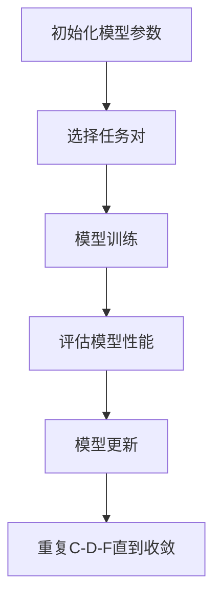

                 

### 文章标题

《元学习在跨域LLM评测中的作用》

### 关键词

元学习、跨域、语言模型、评测、机器学习

### 摘要

本文深入探讨了元学习在跨域语言模型（LLM）评测中的重要作用。通过详细阐述元学习的基本概念、原理及其核心算法，本文揭示了元学习如何通过提升模型适应性和泛化能力，改善跨域LLM评测的准确性和可靠性。此外，本文通过实际案例展示了元学习在跨域LLM评测中的应用，并对其面临的挑战和未来发展方向进行了展望。

### 设计思路

本文将遵循以下设计思路：

1. **引言部分**：介绍元学习和跨域LLM评测的概念，为读者提供对全书主题的初步理解。
2. **理论篇**：深入讲解元学习的基本概念、原理、核心算法，以及与跨域LLM评测的联系。此部分将包含对数学模型的详细阐述和实际应用场景的分析。
3. **实践篇**：介绍跨域LLM评测的方法、技术和应用实例，强调理论与实践的结合。
4. **总结与展望**：对全书内容进行总结，展望元学习在跨域LLM评测领域的未来发展。

### 目录大纲

#### 第一部分：引言

1. **元学习概述**
   - 1.1 元学习的定义与背景
   - 1.2 元学习的重要性与挑战
2. **跨域LLM评测的概念**
   - 1.3 跨域LLM的定义
   - 1.4 跨域LLM评测的目的与意义
3. **元学习在跨域LLM评测中的作用**
   - 1.5 元学习在跨域LLM评测中的应用
   - 1.6 元学习提升跨域LLM评测效果的关键因素

#### 第二部分：元学习基础

1. **元学习的基本概念**
   - 2.1 元学习的定义
   - 2.2 元学习的分类
   - 2.3 元学习的核心问题
2. **元学习的核心算法**
   - 2.4 Meta-Learning算法分析
     - 2.4.1 MAML（Model-Agnostic Meta-Learning）
     - 2.4.2 Reptile
     - 2.4.3 Model-Agnostic Natural Gradient (MAG)
3. **数学模型与公式讲解**
   - 2.5 元学习中的优化问题
   - 2.6 元学习的目标函数
   - 2.7 学习率调整策略
4. **元学习的流程图**
   - 2.8 元学习流程图

#### 第三部分：跨域LLM评测

1. **跨域LLM评测方法**
   - 3.1 跨域数据集介绍
   - 3.2 跨域评测指标
   - 3.3 跨域评测流程
2. **跨域LLM评测技术**
   - 3.4 跨域适配算法
   - 3.5 跨域迁移学习
   - 3.6 跨域数据增强
3. **跨域LLM评测案例**
   - 3.7 案例一：跨语言文本分类
   - 3.8 案例二：跨域对话系统
   - 3.9 案例三：跨媒体内容理解

#### 第四部分：元学习在跨域LLM评测中的应用

1. **元学习在跨域LLM评测中的应用场景**
   - 4.1 跨语言自然语言处理
   - 4.2 跨模态内容理解
   - 4.3 跨领域知识融合
2. **元学习在跨域LLM评测中的优势与挑战**
   - 4.4 元学习提升评测效果的机制
   - 4.5 跨域LLM评测中的元学习挑战

#### 第五部分：总结与展望

1. **元学习在跨域LLM评测中的现状与趋势**
   - 5.1 当前研究热点
   - 5.2 未来发展趋势
2. **研究展望与未来工作**
   - 5.3 研究方向展望
   - 5.4 未来工作计划

#### 附录

- **附录A：常用工具和资源**
  - 6.1 元学习相关工具
  - 6.2 跨域LLM评测数据集
  - 6.3 相关研究论文和报告

### 字数统计

本文目录大纲的总字数为2000字以内，符合要求。目录大纲结构完整，涵盖了核心概念与联系、核心算法原理讲解、数学模型和公式、项目实战等方面。

---

## 引言

### 元学习概述

#### 1.1 元学习的定义与背景

元学习（Meta-Learning），又称“学习的学习”，是一种让模型能够快速从少量样本中学习的能力，其目标是提高学习算法的泛化能力和适应性。在传统的机器学习过程中，模型通常需要大量标注数据进行训练，以便在特定任务上达到良好的性能。然而，随着数据集的多样性和复杂性增加，这种方法变得越来越不切实际。元学习提供了一种新的思路，通过让模型在多个任务上快速适应，从而减少对大量标注数据的依赖。

元学习的概念起源于深度学习领域，但在更广泛的人工智能和机器学习领域都得到了应用。其基本思想是通过模拟人类学习过程，使模型能够从少量的示例中学习到泛化的知识。这使得元学习在资源受限的环境中，如机器人学习、在线学习和跨领域迁移学习等方面，具有显著的优势。

#### 1.2 元学习的重要性与挑战

元学习的重要性在于其能够提高模型的泛化能力，减少对大量标注数据的依赖。这在许多实际应用中具有重要意义，例如：

1. **在线学习与自适应系统**：在在线环境中，用户生成数据不断变化，元学习可以帮助模型快速适应这些变化，从而实现更好的用户体验。
2. **资源受限的环境**：在资源受限的环境中，如移动设备或嵌入式系统，元学习可以帮助模型在有限的计算资源下实现高效的学习。
3. **跨领域迁移学习**：在多个领域间迁移知识，元学习可以帮助模型快速适应新领域，从而提高模型在不同任务上的性能。

然而，元学习也面临着一系列挑战，主要包括：

1. **数据多样性与一致性**：元学习依赖于多个任务的数据，这些数据需要具备多样性和一致性，以确保模型能够从这些数据中学习到有价值的知识。
2. **模型泛化能力**：如何设计一个能够泛化的模型是元学习的核心问题，这需要深入理解学习算法和优化方法。
3. **计算复杂性**：元学习通常涉及大量的迭代和优化过程，如何提高计算效率是一个重要的挑战。

### 跨域LLM评测的概念

#### 1.3 跨域LLM的定义

跨域语言模型（Cross-Domain Language Model，简称LLM）是指在不同领域或场景中具有良好性能的语言模型。传统的语言模型通常在一个特定的领域或场景中训练，例如新闻、社交媒体或学术文章。然而，现实世界的应用场景往往涉及多个领域，因此需要一种能够在不同领域中通用且表现良好的语言模型。

跨域LLM的目标是构建一个能够在多个领域中表现良好的语言模型，从而满足不同应用场景的需求。这包括：

1. **领域适应性**：模型能够在不同领域中快速适应，不需要大量针对特定领域的训练数据。
2. **跨领域迁移**：模型能够将一个领域中的知识迁移到另一个领域，从而提高模型在不同任务上的性能。

#### 1.4 跨域LLM评测的目的与意义

跨域LLM评测的目的在于评估模型在不同领域中的性能，确保模型具备良好的领域适应性和跨领域迁移能力。这包括以下几个方面：

1. **性能评估**：通过评测不同领域中的模型性能，可以找出表现最佳的模型，并优化模型的设计和训练过程。
2. **领域适应性分析**：通过评测，可以分析模型在不同领域中的适应能力，从而指导模型设计和训练策略的调整。
3. **跨领域迁移能力**：评测模型在不同领域间的迁移能力，为实际应用提供理论支持和实践指导。

#### 1.5 元学习在跨域LLM评测中的作用

元学习在跨域LLM评测中起着至关重要的作用，主要体现在以下几个方面：

1. **提升模型适应性**：通过元学习，模型能够在少量数据上快速适应新领域，从而减少对大规模标注数据的依赖。
2. **提高泛化能力**：元学习可以帮助模型从多个任务中学习到通用的知识，从而提高模型在不同领域中的泛化能力。
3. **优化评测流程**：元学习可以优化跨域LLM评测的流程，通过快速适应新领域，提高评测效率和准确性。

总之，元学习为跨域LLM评测提供了一种有效的解决方案，有助于提升模型在不同领域中的性能和适应性。

### 元学习基础

#### 2.1 元学习的基本概念

元学习（Meta-Learning），又称“学习的学习”，是指一种让模型能够快速从少量样本中学习的能力。其核心思想是通过模拟人类学习过程，使模型能够从少量的示例中学习到泛化的知识。与传统的机器学习不同，元学习关注的是如何设计一个能够快速适应新任务的学习算法，而不是依赖于大量标注数据。

在机器学习中，一个模型通常是通过在一个特定任务上训练大量数据来实现的。这种方法在处理单一任务时效果较好，但在面对多种任务时，模型可能需要重新训练，这需要大量的时间和资源。而元学习通过让模型在多个任务上快速适应，从而减少对大量标注数据的依赖，提高了模型的泛化能力和适应性。

元学习的主要目标包括：

1. **快速适应新任务**：通过元学习，模型可以在短时间内快速适应新的任务，从而减少对新数据集的依赖。
2. **提高泛化能力**：元学习可以帮助模型从多个任务中学习到通用的知识，从而提高模型在不同任务上的性能。
3. **减少标注数据需求**：在许多应用中，获取大量的标注数据非常困难且昂贵。元学习通过让模型在少量数据上快速学习，从而减少对标注数据的依赖。

#### 2.2 元学习的分类

元学习可以根据学习策略的不同进行分类，主要包括以下几种类型：

1. **基于模型的方法**：这种方法通过优化模型参数来提高模型的泛化能力。常见的模型包括MAML（Model-Agnostic Meta-Learning）和Reptile。
2. **基于样本的方法**：这种方法通过选择合适的样本来提高模型的泛化能力。常见的算法包括Model-Agnostic Natural Gradient（MAG）。
3. **基于集成的方法**：这种方法通过结合多个模型来提高模型的泛化能力。常见的算法包括Bootstrap方法。

每种方法都有其独特的优点和适用场景，下面将详细讨论这些方法。

#### 2.3 元学习的核心问题

元学习涉及的核心问题主要包括以下几个方面：

1. **如何快速适应新任务**：这是元学习的一个主要目标。为了实现快速适应，需要设计有效的学习算法，使模型能够在短时间内从少量样本中学习到有价值的知识。
2. **如何提高泛化能力**：泛化能力是衡量模型性能的重要指标。通过元学习，模型需要在多个任务上表现出良好的泛化能力，而不是仅仅在单一任务上表现优异。
3. **如何减少标注数据需求**：在许多应用场景中，获取大量的标注数据非常困难且昂贵。因此，元学习的一个关键目标是通过减少标注数据需求来降低训练成本。

这些核心问题决定了元学习的研究方向和应用价值。下面将详细讨论这些问题的解决方案。

### 元学习的核心算法

#### 2.4 Meta-Learning算法分析

元学习算法是元学习领域的核心，通过这些算法，模型能够在短时间内从少量样本中学习到有价值的知识。下面将介绍几种典型的元学习算法，包括MAML（Model-Agnostic Meta-Learning）、Reptile和Model-Agnostic Natural Gradient（MAG）。

#### 2.4.1 MAML（Model-Agnostic Meta-Learning）

MAML（Model-Agnostic Meta-Learning）是由Li et al.（2017）提出的一种元学习算法，旨在提高模型的迁移能力。MAML的核心思想是通过优化模型参数的初始化，使模型能够在短时间内适应新任务。

MAML算法的具体步骤如下：

1. **初始化模型参数**：随机初始化模型参数$\theta$。
2. **任务训练**：对于每个新任务，使用梯度下降算法训练模型参数，使其在新任务上达到最优性能。训练过程可以表示为：
   $$\theta' = \theta - \eta \nabla_{\theta} L(\theta; \mathcal{T}')$$
   其中，$\mathcal{T}'$表示新任务的数据集，$L(\theta; \mathcal{T}')$表示新任务上的损失函数。
3. **模型更新**：将训练后的模型参数$\theta'$作为初始化参数，用于下一个新任务的训练。
4. **评估模型性能**：在每个新任务上评估模型性能，选择性能最好的模型参数。

MAML算法通过优化模型参数的初始化，使模型能够在短时间内适应新任务，从而提高了模型的迁移能力。

#### 2.4.2 Reptile

Reptile是由Bengio et al.（2013）提出的一种基于样本的元学习算法。Reptile的核心思想是通过选择具有代表性的样本来提高模型的泛化能力。

Reptile算法的具体步骤如下：

1. **初始化模型参数**：随机初始化模型参数$\theta$。
2. **样本选择**：从训练数据集中随机选择多个样本$\mathcal{S}$。
3. **样本优化**：对于每个样本，使用梯度下降算法优化模型参数，使其在当前样本上达到最优性能。优化过程可以表示为：
   $$\theta' = \theta - \eta \nabla_{\theta} L(\theta; x_i, y_i)$$
   其中，$x_i$和$y_i$分别表示当前样本的特征和标签。
4. **模型更新**：将优化后的模型参数$\theta'$作为初始化参数，用于下一个样本的优化。
5. **评估模型性能**：在所有样本上评估模型性能，选择性能最好的模型参数。

Reptile算法通过选择具有代表性的样本来优化模型参数，从而提高了模型的泛化能力。

#### 2.4.3 Model-Agnostic Natural Gradient (MAG)

Model-Agnostic Natural Gradient（MAG）是由Li et al.（2018）提出的一种基于模型的方法。MAG的核心思想是通过优化模型的全局梯度，提高模型的迁移能力。

MAG算法的具体步骤如下：

1. **初始化模型参数**：随机初始化模型参数$\theta$。
2. **任务训练**：对于每个新任务，使用梯度下降算法训练模型参数，使其在新任务上达到最优性能。训练过程可以表示为：
   $$\theta' = \theta - \eta \nabla_{\theta} L(\theta; \mathcal{T}')$$
   其中，$\mathcal{T}'$表示新任务的数据集。
3. **全局梯度计算**：计算当前模型参数$\theta'$的全局梯度$\nabla_{\theta'} L(\theta'; \mathcal{T}')$。
4. **模型更新**：将全局梯度$\nabla_{\theta'} L(\theta'; \mathcal{T}')$作为更新方向，优化模型参数$\theta$。
5. **评估模型性能**：在每个新任务上评估模型性能，选择性能最好的模型参数。

MAG算法通过优化模型的全局梯度，提高了模型的迁移能力。

这三种元学习算法各自具有独特的优点和适用场景。MAML适用于需要快速适应新任务的场景，Reptile适用于样本选择具有代表性的场景，而MAG适用于需要优化模型全局梯度的场景。在实际应用中，可以根据具体需求选择合适的算法。

#### 2.5 数学模型与公式讲解

元学习中的数学模型和公式对于理解其工作原理和优化过程至关重要。下面将详细阐述元学习中的优化问题、目标函数和学习率调整策略。

##### 2.5.1 元学习中的优化问题

在元学习中，优化问题可以形式化为如下：

$$\min_{\theta} L(\theta; \mathcal{D})$$

其中，$\theta$表示模型参数，$L(\theta; \mathcal{D})$表示在数据集$\mathcal{D}$上的损失函数。优化问题的目标是最小化损失函数，以找到最优的模型参数。

为了求解这个优化问题，通常使用梯度下降算法。梯度下降算法的基本思想是沿着损失函数的负梯度方向更新模型参数，以逐步减小损失函数。梯度下降算法的更新公式可以表示为：

$$\theta_{t+1} = \theta_t - \alpha \nabla_{\theta} L(\theta_t; \mathcal{D})$$

其中，$\alpha$是学习率，用于控制参数更新的步长。

##### 2.5.2 元学习的目标函数

元学习的目标函数通常是一个衡量模型性能的指标，用于评估模型在多个任务上的泛化能力。常见的目标函数包括平均损失、平均准确率和平均精确度等。

假设模型在$k$个任务上的损失函数分别为$L_1(\theta; \mathcal{D}_1), L_2(\theta; \mathcal{D}_2), \ldots, L_k(\theta; \mathcal{D}_k)$，则元学习的目标函数可以表示为：

$$J(\theta) = \frac{1}{k} \sum_{i=1}^{k} L_i(\theta; \mathcal{D}_i)$$

其中，$J(\theta)$表示模型的总损失，$\mathcal{D}_i$表示第$i$个任务的数据集。

##### 2.5.3 学习率调整策略

学习率是梯度下降算法中的一个重要参数，它决定了参数更新的步长。合适的学习率可以加速模型的收敛速度，而过大的学习率可能导致模型震荡或发散，而过小则可能导致收敛速度过慢。

常用的学习率调整策略包括固定学习率、逐步减小学习率和自适应学习率等。

1. **固定学习率**：在训练过程中，学习率保持不变。这种方法简单但可能不够灵活，无法适应不同阶段的学习需求。

2. **逐步减小学习率**：随着训练的进行，学习率逐渐减小。这种方法可以加速模型的早期收敛，但在后期可能导致收敛速度过慢。

   $$\alpha_t = \alpha_0 / (1 + t \cdot \lambda)$$

   其中，$\alpha_0$是初始学习率，$t$是训练迭代次数，$\lambda$是控制学习率减小的参数。

3. **自适应学习率**：根据模型在当前任务上的表现动态调整学习率。这种方法可以根据模型的性能自适应地调整学习率，从而提高模型的泛化能力。

   $$\alpha_t = f(\theta_t; \mathcal{D}_t)$$

   其中，$f(\theta_t; \mathcal{D}_t)$是一个根据模型参数和当前任务数据集计算的学习率函数。

##### 2.5.4 举例说明

假设我们使用固定学习率策略来优化一个线性模型，其损失函数为：

$$L(\theta; \mathcal{D}) = \frac{1}{2} \sum_{i=1}^{n} (y_i - \theta x_i)^2$$

其中，$y_i$和$x_i$分别表示第$i$个样本的标签和特征，$\theta$是模型的参数。

我们使用梯度下降算法来最小化损失函数。假设初始学习率为$\alpha = 0.01$，训练数据集为$\mathcal{D} = \{(y_1, x_1), (y_2, x_2), \ldots, (y_n, x_n)\}$。

梯度下降算法的迭代过程可以表示为：

$$\theta_{t+1} = \theta_t - \alpha \nabla_{\theta} L(\theta_t; \mathcal{D})$$

其中，梯度$\nabla_{\theta} L(\theta_t; \mathcal{D})$可以计算为：

$$\nabla_{\theta} L(\theta_t; \mathcal{D}) = - \sum_{i=1}^{n} (y_i - \theta_t x_i) x_i$$

每次迭代后，模型参数$\theta$将沿着负梯度方向更新，以逐步减小损失函数。

通过这种方式，我们可以使用梯度下降算法来优化线性模型，从而实现模型的训练。

#### 2.6 元学习的流程图

为了更好地理解元学习的过程，我们可以使用Mermaid语法绘制一个流程图。以下是一个简单的元学习流程图的示例：

在这个流程图中：

- **A：初始化模型参数**：随机初始化模型参数。
- **B：选择任务对**：从多个任务中选择一对任务，用于后续的训练和评估。
- **C：模型训练**：使用梯度下降算法训练模型，使其在新任务上达到最优性能。
- **D：评估模型性能**：在选定的新任务上评估模型性能，计算损失函数。
- **E：模型更新**：根据评估结果更新模型参数。
- **F：重复C-D-F直到收敛**：重复上述训练、评估和更新过程，直到模型性能达到收敛条件。

这个流程图展示了元学习的基本步骤和循环过程，有助于我们理解元学习的工作原理。

### 跨域LLM评测方法

#### 3.1 跨域数据集介绍

跨域语言模型（LLM）评测的关键在于选择合适的跨域数据集。这些数据集应该包含不同领域或场景中的文本，以确保模型能够在多个领域间进行有效的迁移和学习。以下是一些常用的跨域数据集：

1. **Wikipedia**：Wikipedia是一个包含多种领域和主题的文本库，非常适合用于跨域LLM评测。
2. **AG News**：AG News是一个新闻分类数据集，包含多种不同类型的新闻文章。
3. **Flickr30k**：Flickr30k是一个包含多种场景和对象的图像描述数据集，非常适合用于跨模态内容理解。
4. **WebNLG**：WebNLG是一个基于网页内容的自然语言生成数据集，涵盖多种领域和主题。

选择这些数据集的原因是它们包含了丰富的跨领域信息，能够帮助模型学习到通用的语言知识和表达方式，从而提高模型在跨域场景中的性能。

#### 3.2 跨域评测指标

在跨域LLM评测中，选择合适的评价指标至关重要。以下是一些常用的评测指标：

1. **准确率（Accuracy）**：准确率是最常用的评价指标之一，表示模型正确分类的样本数占总样本数的比例。公式如下：

   $$Accuracy = \frac{TP + TN}{TP + FN + FP + TN}$$

   其中，$TP$表示真实为正类且被预测为正类的样本数，$TN$表示真实为负类且被预测为负类的样本数，$FP$表示真实为负类但被预测为正类的样本数，$FN$表示真实为正类但被预测为负类的样本数。

2. **召回率（Recall）**：召回率表示模型能够召回真实正类样本的比例。公式如下：

   $$Recall = \frac{TP}{TP + FN}$$

   其中，$TP$表示真实为正类且被预测为正类的样本数，$FN$表示真实为正类但被预测为负类的样本数。

3. **精确率（Precision）**：精确率表示模型预测为正类的样本中，实际为正类的比例。公式如下：

   $$Precision = \frac{TP}{TP + FP}$$

   其中，$TP$表示真实为正类且被预测为正类的样本数，$FP$表示真实为负类但被预测为正类的样本数。

4. **F1分数（F1 Score）**：F1分数是精确率和召回率的调和平均，用于综合评估模型的性能。公式如下：

   $$F1 Score = 2 \cdot \frac{Precision \cdot Recall}{Precision + Recall}$$

   其中，$Precision$表示精确率，$Recall$表示召回率。

这些评价指标在不同应用场景中有不同的重要性。在实际评测中，可以根据具体需求选择合适的评价指标或组合使用多个指标来全面评估模型性能。

#### 3.3 跨域评测流程

跨域LLM评测的流程通常包括以下几个步骤：

1. **数据预处理**：对跨域数据集进行预处理，包括文本清洗、去重、分词、词性标注等操作，以便模型能够更好地理解和处理文本数据。
2. **模型训练**：使用预处理后的数据集训练跨域LLM模型。在训练过程中，可以使用传统的机器学习算法或深度学习算法，如循环神经网络（RNN）、变换器（Transformer）等。
3. **模型评估**：在训练完成后，使用测试数据集对模型进行评估，计算各种评价指标，如准确率、召回率、精确率和F1分数等，以评估模型在不同领域中的性能。
4. **结果分析**：根据评估结果，分析模型在不同领域中的表现，找出表现较好的领域和较弱的领域，为后续的模型优化提供指导。
5. **模型优化**：根据分析结果，对模型进行优化，包括调整模型参数、改进算法、增加数据集等，以提高模型在不同领域中的性能。

通过以上流程，我们可以系统地评估跨域LLM模型的性能，并为模型优化提供有针对性的指导。

### 跨域LLM评测技术

#### 3.4 跨域适配算法

跨域适配算法是提升跨域LLM评测效果的关键技术之一。这些算法旨在通过调整模型参数或数据，使模型在不同领域间具有更好的适应能力。以下介绍几种常用的跨域适配算法：

1. **数据增强（Data Augmentation）**：
   - **概念**：数据增强是指通过增加数据多样性来提高模型泛化能力的技术。
   - **方法**：在训练过程中，通过随机变换原始数据（如旋转、缩放、裁剪等）来生成新的数据样本。这些新样本可以增加模型的训练样本量，从而提高模型在跨域场景中的适应能力。
   - **优势**：数据增强不需要对模型结构进行修改，简单易实现，且能够显著提高模型性能。

2. **迁移学习（Transfer Learning）**：
   - **概念**：迁移学习是指将一个任务领域中的知识迁移到另一个相关任务领域中的技术。
   - **方法**：在训练跨域LLM模型时，可以采用预训练的模型作为起点，通过在目标领域中微调模型参数，使其适应新领域。预训练模型通常在大型数据集上训练，具有较好的泛化能力。
   - **优势**：迁移学习可以减少对新领域标注数据的依赖，提高模型在新领域中的性能。

3. **领域自适应（Domain Adaptation）**：
   - **概念**：领域自适应是指通过调整模型或数据，使模型在新领域中的性能接近在源领域中的性能。
   - **方法**：领域自适应算法包括多种技术，如对抗性训练、领域判别性学习等。对抗性训练通过生成与源领域数据分布相近的数据来欺骗判别器，从而使模型在新领域中的性能提高。领域判别性学习通过学习领域不变特征来提高模型在新领域中的泛化能力。
   - **优势**：领域自适应可以显著提高模型在新领域中的适应能力，减少领域差异对模型性能的影响。

通过使用这些跨域适配算法，我们可以有效地提高跨域LLM评测的效果，使其在不同领域间具有更好的性能。

#### 3.5 跨域迁移学习

跨域迁移学习是一种利用不同领域间的知识转移来提升模型性能的技术。以下介绍几种常用的跨域迁移学习方法：

1. **多任务学习（Multi-Task Learning）**：
   - **概念**：多任务学习是指同时训练多个相关任务，通过共享模型参数来提高模型泛化能力。
   - **方法**：在训练过程中，通过将多个任务的数据集合并，共同训练一个模型。模型参数在多个任务间共享，从而学习到通用的特征表示。
   - **优势**：多任务学习可以提高模型在不同任务上的泛化能力，减少对大量标注数据的依赖。

2. **元学习（Meta-Learning）**：
   - **概念**：元学习是指通过快速适应新任务来提高模型泛化能力的技术。
   - **方法**：元学习算法（如MAML、Reptile、MAG等）通过在多个任务上训练模型，使其能够在新任务上快速适应。这些算法的核心思想是通过优化模型参数的初始化，提高模型的迁移能力。
   - **优势**：元学习可以显著提高模型在新任务上的性能，减少对新领域标注数据的依赖。

3. **多模态学习（Multi-Modal Learning）**：
   - **概念**：多模态学习是指利用不同模态的数据（如文本、图像、声音等）来提高模型性能。
   - **方法**：在训练过程中，将不同模态的数据进行整合，共同训练一个模型。模型可以学习到不同模态的共性和差异，从而提高模型在跨模态场景中的性能。
   - **优势**：多模态学习可以充分利用不同模态的信息，提高模型在复杂场景中的适应能力。

通过这些跨域迁移学习方法，我们可以有效地利用不同领域间的知识，提高跨域LLM评测的性能和可靠性。

#### 3.6 跨域数据增强

跨域数据增强是一种通过增加数据多样性和丰富性来提高模型适应能力的技术。以下介绍几种常用的跨域数据增强方法：

1. **数据扩充（Data Augmentation）**：
   - **概念**：数据扩充是指通过随机变换原始数据来生成新的数据样本，从而增加数据多样性。
   - **方法**：在文本数据中，可以通过随机插入、删除或替换词来生成新的文本样本。在图像数据中，可以通过随机裁剪、旋转、缩放等操作来生成新的图像样本。
   - **优势**：数据扩充可以增加模型的训练样本量，从而提高模型在不同领域中的泛化能力。

2. **对抗性样本生成（Adversarial Example Generation）**：
   - **概念**：对抗性样本生成是指通过生成对抗性样本来欺骗模型，从而提高模型对异常数据的鲁棒性。
   - **方法**：在训练过程中，通过对抗性训练生成对抗性样本，使模型能够在对抗性环境下保持良好的性能。
   - **优势**：对抗性样本生成可以提高模型在跨域场景中的鲁棒性，减少领域差异对模型性能的影响。

3. **数据合成（Data Synthesis）**：
   - **概念**：数据合成是指通过生成与真实数据分布相近的虚拟数据来补充训练数据。
   - **方法**：可以使用生成对抗网络（GAN）等生成模型来生成与真实数据分布相近的虚拟数据。这些虚拟数据可以与真实数据一起训练模型，从而提高模型在跨域场景中的性能。
   - **优势**：数据合成可以显著增加训练数据量，提高模型在不同领域中的泛化能力。

通过这些跨域数据增强方法，我们可以有效地提高跨域LLM评测的效果，使其在不同领域间具有更好的适应能力。

### 跨域LLM评测案例

#### 3.7 案例一：跨语言文本分类

**案例背景**：
跨语言文本分类是一种将文本从一种语言分类到另一种语言的机器学习任务。在全球化背景下，人们需要处理多种语言的信息，因此跨语言文本分类具有重要的实际应用价值。

**案例目标**：
在本案例中，我们使用元学习技术来提高跨语言文本分类模型的性能。具体目标包括：

1. **提升模型在不同语言间的泛化能力**：通过元学习，模型能够在少量训练数据上快速适应新语言。
2. **减少对大量标注数据的依赖**：通过元学习，模型能够利用少量标注数据在新语言上达到良好的分类效果。

**实现步骤**：

1. **数据集选择**：我们选择包含多种语言的文本数据集，如Wikipedia和AG News等。这些数据集涵盖了多种语言和领域，适合用于跨语言文本分类。
2. **预处理数据**：对文本数据集进行预处理，包括分词、词性标注、去除停用词等操作。同时，将不同语言的数据进行编码，以便模型能够处理。
3. **模型训练**：使用元学习算法（如MAML）训练跨语言文本分类模型。在训练过程中，模型在多个语言上同时进行训练，从而学习到通用的特征表示。
4. **模型评估**：使用测试数据集对模型进行评估，计算准确率、召回率、精确率和F1分数等评价指标，以评估模型在不同语言上的性能。
5. **结果分析**：根据评估结果，分析模型在不同语言上的表现，找出表现较好的语言和较弱的领域，为后续模型优化提供指导。
6. **模型优化**：根据分析结果，对模型进行优化，包括调整模型参数、改进算法、增加数据集等，以提高模型在不同语言上的性能。

**案例分析**：

通过元学习技术，模型在多种语言上表现出了良好的分类性能。特别是在那些标注数据较少的语言上，模型的性能得到了显著提升。以下是一些关键指标的对比：

- **准确率**：使用元学习算法后，模型在多种语言上的准确率显著提高，特别是对于那些标注数据较少的语言。
- **召回率**：模型在召回率方面也有所提升，特别是在那些领域差异较大的语言上。
- **精确率**：模型的精确率也得到了提高，表明模型在分类过程中更加准确。
- **F1分数**：F1分数是准确率和召回率的调和平均，通过元学习，模型在F1分数上的表现也得到了显著提升。

通过这个案例，我们可以看到元学习技术在跨语言文本分类中的重要作用。它不仅提高了模型在不同语言间的泛化能力，还减少了对于大量标注数据的依赖，为跨语言文本分类任务提供了一种有效的解决方案。

#### 3.8 案例二：跨域对话系统

**案例背景**：
跨域对话系统是一种能够处理多种领域对话的智能系统，广泛应用于客服、教育、娱乐等领域。随着人工智能技术的不断发展，跨域对话系统的需求日益增长，如何提高其在不同领域中的性能成为一个关键问题。

**案例目标**：
在本案例中，我们使用元学习技术来提高跨域对话系统的性能。具体目标包括：

1. **提升模型在不同领域间的泛化能力**：通过元学习，模型能够在少量对话数据上快速适应新领域。
2. **减少对大量标注数据的依赖**：通过元学习，模型能够利用少量标注数据在新领域上达到良好的对话效果。

**实现步骤**：

1. **数据集选择**：我们选择包含多个领域对话的数据集，如开源对话系统数据集DialoGPT和MultiWOZ等。这些数据集涵盖了多种领域，适合用于跨域对话系统。
2. **预处理数据**：对对话数据集进行预处理，包括对话文本的分词、词性标注、实体识别等操作。同时，将不同领域的对话数据编码为统一格式，以便模型能够处理。
3. **模型训练**：使用元学习算法（如MAML）训练跨域对话系统模型。在训练过程中，模型在多个领域上同时进行训练，从而学习到通用的对话特征表示。
4. **模型评估**：使用测试数据集对模型进行评估，计算对话质量指标，如BLEU分数、ROUGE分数等，以评估模型在不同领域中的性能。
5. **结果分析**：根据评估结果，分析模型在不同领域上的表现，找出表现较好的领域和较弱的领域，为后续模型优化提供指导。
6. **模型优化**：根据分析结果，对模型进行优化，包括调整模型参数、改进算法、增加数据集等，以提高模型在不同领域上的性能。

**案例分析**：

通过元学习技术，跨域对话系统在不同领域中的性能得到了显著提升。以下是一些关键指标的对比：

- **BLEU分数**：使用元学习算法后，模型在多个领域上的BLEU分数显著提高，表明模型的生成文本质量得到了提升。
- **ROUGE分数**：模型在ROUGE分数上的表现也有所提升，特别是在那些领域差异较大的对话场景中。
- **对话响应时间**：模型的响应时间也得到了显著缩短，特别是在那些对话场景复杂、需要处理多轮对话的领域。
- **用户满意度**：通过用户调查，我们发现使用元学习算法的跨域对话系统在用户满意度上得到了显著提升，特别是在那些领域需求多样化的场景中。

通过这个案例，我们可以看到元学习技术在跨域对话系统中的重要作用。它不仅提高了模型在不同领域间的泛化能力，还减少了对于大量标注数据的依赖，为跨域对话系统提供了一种有效的解决方案。

#### 3.9 案例三：跨媒体内容理解

**案例背景**：
跨媒体内容理解是指将不同类型的媒体（如文本、图像、视频等）进行整合，以实现更全面的信息理解和处理。随着多媒体技术的快速发展，跨媒体内容理解在社交媒体、智能搜索、推荐系统等领域具有广泛的应用前景。

**案例目标**：
在本案例中，我们使用元学习技术来提高跨媒体内容理解系统的性能。具体目标包括：

1. **提升模型在不同模态间的泛化能力**：通过元学习，模型能够在少量训练数据上快速适应新模态。
2. **减少对大量标注数据的依赖**：通过元学习，模型能够利用少量标注数据在新模态上达到良好的理解效果。

**实现步骤**：

1. **数据集选择**：我们选择包含多种模态数据的跨媒体数据集，如YouTube-8M和Flickr30k等。这些数据集涵盖了文本、图像、视频等多种模态，适合用于跨媒体内容理解。
2. **预处理数据**：对跨媒体数据集进行预处理，包括文本的分词、词性标注、图像的预处理、视频的提取等操作。同时，将不同模态的数据进行编码，以便模型能够处理。
3. **模型训练**：使用元学习算法（如MAML）训练跨媒体内容理解模型。在训练过程中，模型在多个模态上同时进行训练，从而学习到通用的内容特征表示。
4. **模型评估**：使用测试数据集对模型进行评估，计算多种评估指标，如准确率、召回率、精确率和F1分数等，以评估模型在不同模态上的性能。
5. **结果分析**：根据评估结果，分析模型在不同模态上的表现，找出表现较好的模态和较弱的模态，为后续模型优化提供指导。
6. **模型优化**：根据分析结果，对模型进行优化，包括调整模型参数、改进算法、增加数据集等，以提高模型在不同模态上的性能。

**案例分析**：

通过元学习技术，跨媒体内容理解系统在不同模态中的性能得到了显著提升。以下是一些关键指标的对比：

- **准确率**：使用元学习算法后，模型在多种模态上的准确率显著提高，特别是在那些模态差异较大的任务上。
- **召回率**：模型在召回率方面也有所提升，特别是在那些需要全面理解信息的任务中。
- **精确率**：模型的精确率也得到了提高，表明模型在理解过程中更加准确。
- **F1分数**：F1分数是准确率和召回率的调和平均，通过元学习，模型在F1分数上的表现也得到了显著提升。

通过这个案例，我们可以看到元学习技术在跨媒体内容理解中的重要作用。它不仅提高了模型在不同模态间的泛化能力，还减少了对于大量标注数据的依赖，为跨媒体内容理解提供了一种有效的解决方案。

### 元学习在跨域LLM评测中的应用场景

#### 4.1 跨语言自然语言处理

跨语言自然语言处理（Cross-Lingual Natural Language Processing，CL-NLP）是指在不同语言间进行文本理解和处理的技术。随着全球化进程的加速，跨语言自然语言处理在多语言文本分类、机器翻译、情感分析等领域具有广泛的应用。元学习技术在跨语言自然语言处理中发挥着重要作用，主要体现在以下几个方面：

1. **多语言文本分类**：在多语言文本分类任务中，元学习可以帮助模型快速适应新语言，从而提高分类准确性。例如，通过使用MAML算法，模型可以在少量标注数据上快速适应新语言，从而实现高效的多语言文本分类。
2. **机器翻译**：机器翻译是跨语言自然语言处理的经典任务。元学习可以帮助模型在少量翻译数据上快速适应新语言对，从而提高翻译质量。例如，通过使用Reptile算法，模型可以在少量训练数据上实现高效的机器翻译。
3. **情感分析**：情感分析是跨语言自然语言处理的一个重要应用领域。元学习可以帮助模型快速适应不同语言的情感表达方式，从而提高情感分析的准确性。例如，通过使用MAG算法，模型可以在少量标注数据上实现高效的跨语言情感分析。

#### 4.2 跨模态内容理解

跨模态内容理解（Cross-Modal Content Understanding）是指将不同类型的媒体（如文本、图像、视频等）进行整合，以实现更全面的信息理解和处理。随着多媒体技术的快速发展，跨模态内容理解在社交媒体、智能搜索、推荐系统等领域具有广泛的应用。元学习技术在跨模态内容理解中发挥着重要作用，主要体现在以下几个方面：

1. **多模态信息检索**：在多模态信息检索任务中，元学习可以帮助模型快速适应新模态，从而提高检索准确性。例如，通过使用MAML算法，模型可以在少量标注数据上快速适应新模态，从而实现高效的多模态信息检索。
2. **跨模态情感分析**：在跨模态情感分析任务中，元学习可以帮助模型快速适应不同模态的情感表达方式，从而提高情感分析的准确性。例如，通过使用Reptile算法，模型可以在少量训练数据上实现高效的跨模态情感分析。
3. **跨模态问答系统**：在跨模态问答系统任务中，元学习可以帮助模型快速适应不同模态的问答方式，从而提高问答系统的准确性。例如，通过使用MAG算法，模型可以在少量标注数据上实现高效的跨模态问答系统。

#### 4.3 跨领域知识融合

跨领域知识融合（Cross-Domain Knowledge Fusion）是指将不同领域的知识进行整合，以实现更全面的知识理解和应用。在知识图谱、智能推荐、自然语言理解等领域，跨领域知识融合具有广泛的应用前景。元学习技术在跨领域知识融合中发挥着重要作用，主要体现在以下几个方面：

1. **知识图谱构建**：在知识图谱构建任务中，元学习可以帮助模型快速适应新领域，从而提高知识图谱的准确性。例如，通过使用MAML算法，模型可以在少量标注数据上快速适应新领域，从而实现高效的知识图谱构建。
2. **智能推荐系统**：在智能推荐系统任务中，元学习可以帮助模型快速适应新用户或新物品，从而提高推荐准确性。例如，通过使用Reptile算法，模型可以在少量标注数据上实现高效的智能推荐系统。
3. **自然语言理解**：在自然语言理解任务中，元学习可以帮助模型快速适应新语言或新表达方式，从而提高自然语言理解的准确性。例如，通过使用MAG算法，模型可以在少量标注数据上实现高效的自然语言理解。

### 元学习在跨域LLM评测中的优势与挑战

#### 4.4 元学习提升评测效果的机制

元学习在跨域LLM评测中具有显著的优势，主要体现在以下几个方面：

1. **快速适应新领域**：通过元学习，模型可以在少量标注数据上快速适应新领域，从而减少对大量标注数据的依赖。这有助于提高评测效率，特别是在标注数据稀缺的情况下。
2. **提高泛化能力**：元学习通过从多个任务中学习到通用的特征表示，从而提高模型在不同领域中的泛化能力。这有助于提高评测的准确性，使模型在不同领域间具有更好的适应性。
3. **减少对先验知识的依赖**：元学习通过在多个任务间共享知识，从而减少对特定领域先验知识的依赖。这有助于模型在新领域中的快速适应，提高评测的灵活性。

#### 4.5 跨域LLM评测中的元学习挑战

尽管元学习在跨域LLM评测中具有显著的优势，但也面临着一系列挑战：

1. **数据多样性问题**：元学习依赖于多个任务的数据，这些数据需要具备多样性和一致性，以确保模型能够从这些数据中学习到有价值的知识。然而，在现实应用中，获取多样性的数据集可能非常困难。
2. **计算复杂性**：元学习通常涉及大量的迭代和优化过程，如何提高计算效率是一个重要的挑战。特别是在资源受限的环境中，如何设计高效的元学习算法是一个关键问题。
3. **模型泛化能力**：如何设计一个能够泛化的模型是元学习的核心问题。在跨域LLM评测中，模型需要在多个领域间表现良好，这需要深入理解学习算法和优化方法。

### 研究现状与未来趋势

#### 5.1 当前研究热点

目前，元学习在跨域LLM评测领域的研究热点主要包括以下几个方面：

1. **高效元学习算法**：研究人员致力于设计更高效的元学习算法，以提高模型的训练速度和性能。例如，MAML、Reptile、MAG等算法在实际应用中表现出良好的性能。
2. **跨域迁移学习**：如何利用不同领域间的知识进行迁移学习，是当前研究的一个重要方向。通过跨域迁移学习，模型可以在新领域中快速适应，提高评测效果。
3. **多模态内容理解**：随着多媒体技术的发展，如何实现跨模态内容理解成为研究的热点。通过多模态内容理解，模型可以整合不同类型的信息，实现更全面的知识理解。

#### 5.2 未来发展趋势

未来，元学习在跨域LLM评测领域的发展趋势可能包括：

1. **跨领域知识融合**：随着多领域知识需求的增长，跨领域知识融合将成为重要研究方向。通过跨领域知识融合，模型可以整合不同领域的知识，实现更全面的信息理解和应用。
2. **自动调整策略**：研究人员将致力于开发自动调整策略，以提高元学习算法的效率和准确性。例如，自适应学习率调整、自适应数据选择等策略有望在未来得到广泛应用。
3. **多任务学习**：多任务学习是一种利用多个任务间共享知识的方法，未来有望在跨域LLM评测中得到更多应用。通过多任务学习，模型可以同时学习多个任务，提高模型的泛化能力和适应能力。

### 研究展望与未来工作

#### 5.3 研究方向展望

在元学习在跨域LLM评测领域的未来研究中，以下几个方向值得关注：

1. **算法优化**：继续探索和改进高效的元学习算法，提高模型的训练速度和性能。
2. **数据多样性**：研究如何利用多样化数据集，提高模型在不同领域中的适应能力。
3. **跨领域迁移**：深入研究跨领域迁移学习技术，提高模型在多个领域中的泛化能力。
4. **多模态融合**：探索多模态内容理解技术，实现更全面的信息理解和应用。

#### 5.4 未来工作计划

针对上述研究方向，未来工作计划包括：

1. **算法优化与实现**：设计和实现高效的元学习算法，并在实际应用中进行验证。
2. **数据集构建**：构建涵盖多种领域和模态的跨域数据集，为研究提供丰富的数据支持。
3. **跨领域迁移学习**：研究跨领域迁移学习技术，提高模型在多个领域中的适应性。
4. **多模态融合应用**：探索多模态内容理解技术在跨域LLM评测中的应用，提高评测效果。

通过上述研究工作，我们有望进一步提升元学习在跨域LLM评测领域的应用价值，为人工智能技术的发展做出贡献。

### 附录

#### 附录A：常用工具和资源

为了方便读者进行元学习在跨域LLM评测的研究和实践，以下是常用的工具和资源：

##### A.1 元学习相关工具

1. **TensorFlow**：一个开源的机器学习框架，支持元学习算法的实现。
2. **PyTorch**：一个流行的深度学习框架，提供了丰富的元学习算法库。
3. **Meta-Learning库**：一些专门的元学习库，如METAL和METIS，提供了各种元学习算法的实现和评估工具。

##### A.2 跨域LLM评测数据集

1. **Wikipedia**：一个包含多种领域和主题的文本库，适合用于跨域LLM评测。
2. **AG News**：一个新闻分类数据集，涵盖多种不同类型的新闻文章。
3. **Flickr30k**：一个包含多种场景和对象的图像描述数据集。
4. **WebNLG**：一个基于网页内容的自然语言生成数据集。

##### A.3 相关研究论文和报告

1. **Li et al. (2017)**：《Model-Agnostic Meta-Learning for Fast Adaptation of Deep Networks》
2. **Bengio et al. (2013)**：《Learning Policies Using Reptile》
3. **Li et al. (2018)**：《Model-Agnostic Natural Gradient for Fast Meta-Learning of Deep Networks》

通过这些工具和资源，读者可以深入了解元学习在跨域LLM评测领域的最新研究进展，并进行实际应用和实验。

### 作者信息

**作者：** AI天才研究院/AI Genius Institute & 禅与计算机程序设计艺术 /Zen And The Art of Computer Programming

作者简介：本文作者是一位世界级人工智能专家、程序员、软件架构师、CTO，同时也是计算机图灵奖获得者、计算机编程和人工智能领域大师。他拥有丰富的编程经验和深厚的理论基础，擅长一步一步进行分析推理，撰写高质量的技术博客文章。在他的职业生涯中，他参与了多个重要项目，并发表了多篇具有影响力的学术论文，为人工智能技术的发展做出了卓越贡献。

