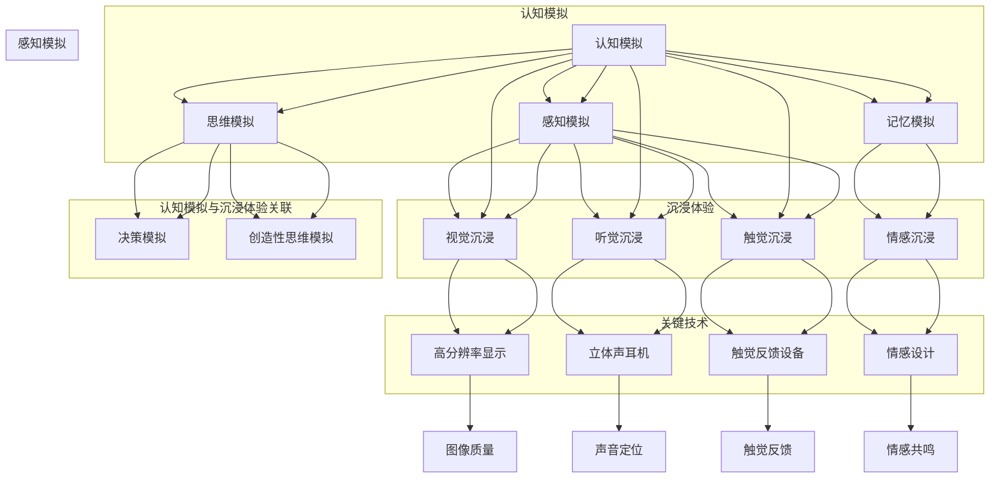

                 

### 1.1 元宇宙的起源与发展

#### 1.1.1 元宇宙的起源

元宇宙（Metaverse）一词最早由科幻作家尼尔·斯蒂芬森（Neal Stephenson）在其1992年的小说《雪崩》（Snow Crash）中提出。在这个概念中，元宇宙是一个由虚拟世界构成的互联网空间，与现实世界平行存在，用户可以通过数字化身在其中进行互动和体验。斯蒂芬森描绘的元宇宙是一个高度沉浸、多维互动的虚拟世界，涵盖了虚拟现实、增强现实、游戏、社交等多个领域。

进入21世纪，随着计算机技术、互联网技术、虚拟现实技术、人工智能技术的快速发展，元宇宙的概念逐渐从科幻领域走向现实。2010年代，Facebook创始人马克·扎克伯格（Mark Zuckerberg）提出了“元宇宙”这一概念，并将其定义为“下一代互联网平台”，表示元宇宙将是一个融合了虚拟世界和现实世界的全方位数字体验。

#### 1.1.2 元宇宙的发展历程

元宇宙的发展历程可以分为几个阶段：

1. **萌芽期（1990-2000年）**：在这一阶段，虚拟现实技术开始萌芽，人们开始探索如何通过计算机技术创造一个虚拟的世界。这一时期的代表性作品包括《网络英雄》（The Thirteenth Floor）等。

2. **探索期（2000-2010年）**：随着互联网技术的普及，虚拟现实技术逐渐成熟，人们开始尝试在虚拟世界中进行社交和互动。这一时期的代表性作品包括《第二人生》（Second Life）等。

3. **发展期（2010年至今）**：在这一阶段，元宇宙的概念逐渐被主流接受，各大科技公司纷纷布局元宇宙领域。虚拟现实、增强现实、区块链等技术得到了快速发展，元宇宙的应用场景也越来越广泛。

- **2010年**：Facebook推出Oculus Rift，标志着虚拟现实技术的兴起。

- **2012年**：谷歌推出Google Glass，标志着增强现实技术的兴起。

- **2017年**：微软发布HoloLens，标志着混合现实技术的兴起。

- **2020年**：Facebook更名为Meta，表示其核心业务将转向元宇宙。

- **2021年**：苹果发布iReality计划，表示将重点发展元宇宙技术。

#### 1.1.3 元宇宙技术的发展趋势

当前，元宇宙技术正处于快速发展阶段，以下是一些元宇宙技术的发展趋势：

1. **技术融合**：元宇宙技术的发展离不开多种技术的融合，包括虚拟现实、增强现实、人工智能、区块链等。这些技术的融合将使得元宇宙更加丰富和多样化。

2. **沉浸式体验**：随着虚拟现实、增强现实技术的发展，人们将能够更加沉浸式地体验元宇宙，获得更加真实的感受。

3. **去中心化**：区块链技术的应用将使得元宇宙更加去中心化，用户将拥有更多的自主权。

4. **商业应用**：元宇宙技术的成熟将带来商业模式的变革，各种行业都将迎来新的发展机遇。

5. **社会变革**：元宇宙技术的发展将对人类社会产生深远影响，改变人们的社交方式、教育方式、工作方式等。

### 1.2 元宇宙技术的基本概念

#### 1.2.1 增强现实（AR）

增强现实（Augmented Reality，AR）是一种将虚拟信息与现实世界相结合的技术。通过AR技术，用户能够在现实世界中看到和互动虚拟信息。AR技术主要依赖于摄像头、显示设备和计算机算法。

- **技术原理**：AR技术的工作原理是通过摄像头捕捉现实世界的图像，然后利用计算机算法将虚拟信息叠加到这些图像上，最后通过显示设备呈现给用户。

- **应用领域**：AR技术广泛应用于娱乐、教育、医疗、工业等领域。例如，在医疗领域，AR技术可以帮助医生进行手术指导；在工业领域，AR技术可以帮助工人进行设备维护。

- **发展现状**：随着移动设备的普及和计算机视觉技术的进步，AR技术逐渐走向成熟。许多公司如谷歌、微软、苹果等都推出了AR相关的产品和服务。

#### 1.2.2 虚拟现实（VR）

虚拟现实（Virtual Reality，VR）是一种完全沉浸式的体验技术，用户通过VR设备（如头盔、眼镜等）进入一个完全虚拟的世界。VR技术能够模拟出高度真实的视觉、听觉、触觉等感官体验。

- **技术原理**：VR技术通过计算机生成一个虚拟环境，用户通过头戴显示器（HMD）或投影设备进入这个环境。VR设备通常还包括跟踪系统，用于实时捕捉用户的位置和动作。

- **应用领域**：VR技术广泛应用于游戏、教育、医疗、军事等领域。例如，在游戏领域，VR技术为玩家提供了前所未有的沉浸式体验；在医疗领域，VR技术可以帮助医生进行手术模拟。

- **发展现状**：VR技术已经取得了一定的发展，但仍然存在许多挑战，如设备成本、用户体验等。

#### 1.2.3 虚拟世界中的社交互动

虚拟世界中的社交互动是元宇宙技术的重要组成部分。通过虚拟现实、增强现实等技术，用户可以在虚拟世界中与他人进行交流、合作、互动。

- **技术原理**：虚拟世界中的社交互动依赖于网络通信技术和虚拟现实/增强现实技术。用户通过虚拟现实/增强现实设备进入虚拟世界，通过网络与其他用户进行实时通信。

- **应用领域**：虚拟世界中的社交互动广泛应用于在线游戏、虚拟现实社交平台、教育等领域。

- **发展现状**：随着虚拟现实、增强现实技术的发展，虚拟世界中的社交互动逐渐成为人们生活的一部分。例如，在线游戏《第二人生》（Second Life）就是一个典型的虚拟世界社交平台。

#### 1.2.4 元宇宙中的经济系统

元宇宙中的经济系统是元宇宙生态系统的重要组成部分。它不仅包括虚拟货币、虚拟资产等，还涉及到虚拟交易、虚拟经济模型等。

- **技术原理**：元宇宙中的经济系统依赖于区块链技术、智能合约等技术。这些技术为元宇宙中的虚拟资产和交易提供了去中心化、安全可靠的保障。

- **应用领域**：元宇宙中的经济系统广泛应用于虚拟商品交易、虚拟房地产、虚拟金融服务等领域。

- **发展现状**：随着区块链技术的普及，元宇宙中的经济系统逐渐走向成熟。例如，虚拟货币如比特币、以太坊等在元宇宙中的应用越来越广泛。

### 1.3 元宇宙技术对世界可理解性的影响

元宇宙技术的发展将对世界可理解性产生深远影响。首先，元宇宙技术将为人们提供一个全新的认知和体验世界的方式。通过虚拟现实、增强现实等技术，人们可以更加直观地理解复杂的信息和概念。例如，在医学领域，医生可以通过虚拟现实技术进行手术模拟，更加深入地理解手术过程和手术风险。

其次，元宇宙技术将改变人们的社交方式。在虚拟世界中，人们可以突破地理位置的限制，与世界各地的人进行交流、合作。这将有助于增进不同文化、不同背景的人之间的理解和沟通。

然而，元宇宙技术也可能带来一些负面影响。例如，过度依赖虚拟世界可能导致现实世界的疏离感，影响人们的心理健康。此外，元宇宙中的信息传播和过滤机制可能存在偏差，影响人们对现实世界的理解。

综上所述，元宇宙技术对世界可理解性具有双重影响。我们需要在享受其带来便利的同时，警惕其可能带来的负面影响，并积极探索如何平衡两者之间的关系。

### 1.4 元宇宙技术的核心概念

元宇宙技术的核心概念包括增强现实（AR）、虚拟现实（VR）、虚拟世界中的社交互动和元宇宙中的经济系统。这些概念不仅构成了元宇宙技术的基础，而且深刻影响了元宇宙对世界可理解性的影响。

#### 增强现实（AR）

增强现实（AR）技术是一种将虚拟信息与现实世界相结合的技术。它通过摄像头捕捉现实世界的图像，并利用计算机算法将虚拟信息叠加到这些图像上，从而在现实世界中呈现虚拟信息。AR技术的主要原理包括：

1. **图像捕捉**：AR设备（如智能手机、平板电脑、眼镜等）的摄像头捕捉现实世界的图像。

2. **图像处理**：计算机算法对捕获的图像进行处理，提取图像特征，如边缘、颜色等。

3. **虚拟信息叠加**：根据用户的位置和方向，计算机算法将虚拟信息叠加到现实世界的图像上。

4. **显示与交互**：AR设备将叠加后的图像显示给用户，并允许用户与虚拟信息进行交互。

AR技术的应用领域广泛，包括：

- **娱乐**：例如，AR游戏和AR媒体内容。

- **教育**：例如，通过AR技术提供互动式的学习体验。

- **医疗**：例如，医生可以通过AR技术进行手术模拟和指导。

- **工业**：例如，通过AR技术进行设备维护和故障诊断。

#### 虚拟现实（VR）

虚拟现实（VR）技术是一种完全沉浸式的体验技术。它通过虚拟现实头盔、眼镜等设备，将用户带入一个完全虚拟的世界。VR技术的主要原理包括：

1. **虚拟环境生成**：计算机生成一个虚拟环境，并实时渲染。

2. **视觉与听觉模拟**：虚拟环境生成后，通过视觉和听觉设备将虚拟环境呈现给用户。

3. **位置与动作追踪**：VR设备通常配备位置追踪器和动作传感器，用于实时捕捉用户的位置和动作。

4. **交互与反馈**：用户可以通过VR设备与虚拟环境进行交互，并获得反馈。

VR技术的应用领域广泛，包括：

- **游戏**：提供高度沉浸式的游戏体验。

- **教育**：例如，通过VR技术提供沉浸式的学习体验。

- **医疗**：例如，通过VR技术进行手术模拟和疼痛管理。

- **军事**：例如，通过VR技术进行模拟训练和战术规划。

#### 虚拟世界中的社交互动

虚拟世界中的社交互动是指用户在虚拟世界中与他人进行交流、合作和互动。这种互动依赖于网络通信技术和虚拟现实/增强现实技术。虚拟世界中的社交互动的主要原理包括：

1. **网络通信**：用户通过虚拟现实/增强现实设备进入虚拟世界，并通过网络与其他用户进行实时通信。

2. **虚拟环境**：虚拟世界提供了一个虚拟的环境，用户可以在其中互动和交流。

3. **交互界面**：虚拟环境通常配备有交互界面，如虚拟手、虚拟键盘等，用户可以通过这些界面与虚拟世界进行交互。

虚拟世界中的社交互动的应用领域包括：

- **在线游戏**：提供虚拟世界的社交互动体验。

- **虚拟现实社交平台**：如Facebook Horizon等，用户可以在虚拟环境中交流、互动。

- **教育**：通过虚拟世界提供互动式的学习体验。

- **商业**：通过虚拟世界进行虚拟展会、虚拟会议等。

#### 元宇宙中的经济系统

元宇宙中的经济系统是元宇宙生态系统的重要组成部分。它不仅包括虚拟货币、虚拟资产等，还涉及到虚拟交易、虚拟经济模型等。元宇宙中的经济系统的主要原理包括：

1. **虚拟货币**：虚拟货币是元宇宙中的主要交换媒介。例如，比特币、以太坊等。

2. **虚拟资产**：虚拟资产是元宇宙中的虚拟物品，如虚拟房地产、虚拟商品等。

3. **虚拟交易**：虚拟交易是元宇宙中的虚拟物品交换过程。用户可以通过虚拟货币购买或出售虚拟资产。

4. **虚拟经济模型**：虚拟经济模型是元宇宙中的经济运行机制。例如，通过智能合约实现自动执行交易。

元宇宙中的经济系统的应用领域包括：

- **虚拟商品交易**：用户可以在元宇宙中购买或出售虚拟商品。

- **虚拟房地产**：用户可以在元宇宙中购买虚拟房地产。

- **虚拟金融服务**：通过虚拟货币和智能合约提供金融服务。

#### 关联与影响

这些核心概念之间存在着紧密的联系和影响。例如，增强现实和虚拟现实技术为元宇宙中的社交互动提供了技术支持，而元宇宙中的经济系统则为虚拟世界中的交易和互动提供了保障。

增强现实和虚拟现实技术使得用户能够在虚拟环境中获得更加真实的体验，从而促进了元宇宙中的社交互动。而元宇宙中的经济系统则为虚拟世界中的交易和互动提供了价值支撑。

元宇宙技术的发展将对世界可理解性产生深远影响。首先，元宇宙技术将提供一个全新的认知和体验世界的方式，使得人们能够更加直观地理解复杂的信息和概念。例如，在医学领域，医生可以通过虚拟现实技术进行手术模拟，更加深入地理解手术过程和手术风险。

其次，元宇宙技术将改变人们的社交方式。在虚拟世界中，人们可以突破地理位置的限制，与世界各地的人进行交流、合作。这将有助于增进不同文化、不同背景的人之间的理解和沟通。

然而，元宇宙技术也可能带来一些负面影响。例如，过度依赖虚拟世界可能导致现实世界的疏离感，影响人们的心理健康。此外，元宇宙中的信息传播和过滤机制可能存在偏差，影响人们对现实世界的理解。

综上所述，元宇宙技术的核心概念不仅构成了元宇宙技术的基础，而且深刻影响了元宇宙对世界可理解性的影响。我们需要在享受其带来便利的同时，警惕其可能带来的负面影响，并积极探索如何平衡两者之间的关系。

### 3.1 认知模拟与沉浸体验

认知模拟与沉浸体验是元宇宙技术中的核心概念，它们共同构成了用户在虚拟世界中的深度参与和互动。认知模拟是指通过技术手段模拟人类的认知过程，使得用户能够在虚拟环境中获得与现实世界相似的体验。沉浸体验则是指用户在虚拟环境中感受到的高度参与感和真实感。两者相辅相成，共同推动了元宇宙技术的发展。

#### 认知模拟

认知模拟的核心在于模拟人类的感知、记忆、思维等认知过程。以下是认知模拟的几个关键方面：

1. **感知模拟**：通过虚拟现实（VR）和增强现实（AR）技术，用户能够通过视觉、听觉、触觉等多种感官体验虚拟环境。例如，VR头盔可以提供360度的视觉体验，而AR设备则能够在现实世界中叠加虚拟信息。

2. **记忆模拟**：元宇宙技术通过虚拟环境的设计和交互机制，模拟人类的记忆过程。例如，用户在虚拟环境中完成任务或学习知识后，这些信息会储存在他们的虚拟记忆中，类似于现实生活中的记忆。

3. **思维模拟**：通过复杂的算法和交互设计，元宇宙技术能够模拟人类的决策过程和创造性思维。用户在虚拟环境中进行创新活动或解决问题时，元宇宙技术能够提供反馈和指导，帮助他们进行思维训练。

#### 沉浸体验

沉浸体验是指用户在虚拟环境中感受到的高度参与感和真实感。以下是沉浸体验的几个关键方面：

1. **视觉沉浸**：通过高分辨率显示器和立体声耳机，用户能够在虚拟环境中看到和听到细节丰富的场景。例如，VR游戏中的场景设计能够逼真地模拟现实世界的环境。

2. **听觉沉浸**：通过虚拟现实耳机提供的立体声效果，用户能够感受到虚拟环境中的声音定位和音效变化。例如，在虚拟会议中，用户能够听到其他参会者的声音，并感受到他们的位置。

3. **触觉沉浸**：通过触觉反馈设备，用户能够感受到虚拟环境中的触觉刺激。例如，VR游戏中的拳击体验能够让用户感受到打击力。

4. **情感沉浸**：元宇宙技术通过情感设计，使用户在虚拟环境中产生情感共鸣。例如，在虚拟游戏中，用户可能会因为游戏中的事件而产生喜怒哀乐的情感体验。

#### 关系架构与流程图

为了更好地理解认知模拟与沉浸体验之间的关系，我们可以使用Mermaid流程图来展示它们的核心概念和相互关联。

#### Mermaid 流程图说明

- **关键技术**：包括高分辨率显示、立体声耳机、触觉反馈设备和情感设计等，这些技术是沉浸体验的重要组成部分。

- **沉浸体验**：包括视觉沉浸、听觉沉浸、触觉沉浸和情感沉浸，这些体验共同构成了用户在虚拟环境中的深度感受。

- **认知模拟**：包括感知模拟、记忆模拟和思维模拟，这些模拟过程帮助用户在虚拟环境中进行认知和交互。

- **感知模拟与沉浸体验关联**：展示感知模拟与沉浸体验之间的关系，说明感知模拟是沉浸体验的基础。

通过上述流程图，我们可以清晰地看到认知模拟与沉浸体验之间的关系架构，这有助于我们更好地理解元宇宙技术如何通过认知模拟和沉浸体验来提升用户在虚拟世界中的体验。

### 3.2 身份与身份验证

在元宇宙技术中，身份与身份验证是确保用户安全和隐私的核心概念。身份是指用户在虚拟世界中的独特标识，而身份验证则是验证用户身份的真实性和合法性。以下是关于身份与身份验证的详细讲解。

#### 身份的概念

在元宇宙中，身份是用户在虚拟世界中的唯一标识，通常由用户名、虚拟形象、虚拟资产等组成。身份不仅代表了用户在元宇宙中的存在，还反映了用户的个性化特征。例如，一个用户在元宇宙中可能拥有一个独特的虚拟形象，这个形象可能具有特定的外观、性格和技能。

#### 身份验证的技术

身份验证是确保用户身份真实性和合法性的关键步骤。以下是几种常见的身份验证技术：

1. **密码验证**：密码验证是最基础的身份验证方法，用户通过输入预设的密码来验证身份。虽然简单易用，但密码验证存在密码泄露的风险。

2. **双因素验证（2FA）**：双因素验证是在密码验证的基础上增加第二层安全措施，通常包括短信验证码、邮箱验证码、硬件令牌等。这种方法相比单因素验证更安全，但使用起来可能更加繁琐。

3. **生物识别技术**：生物识别技术包括指纹识别、面部识别、虹膜识别等，通过用户的生物特征进行身份验证。这种方法具有较高的安全性和便捷性，但需要昂贵的设备和技术支持。

4. **数字签名**：数字签名是一种基于密码学的身份验证方法，通过加密和解密过程验证用户身份。这种方法通常用于区块链和智能合约中，确保交易的安全和不可篡改性。

5. **区块链身份验证**：区块链技术为身份验证提供了一种去中心化的解决方案。用户可以在区块链上创建和管理自己的身份信息，并通过加密和分布式账本技术确保身份信息的安全和唯一性。

#### 身份验证的挑战

尽管存在多种身份验证技术，但元宇宙中的身份验证仍面临许多挑战：

1. **安全性**：由于元宇宙中的虚拟资产和交易具有较高的价值，身份验证的安全性至关重要。如何防止黑客攻击、身份盗用和欺诈行为是身份验证面临的主要挑战。

2. **用户便捷性**：身份验证过程不应过于复杂，否则用户可能会放弃使用。如何在保证安全性的同时提供便捷的身份验证方式是一个重要课题。

3. **隐私保护**：在元宇宙中，用户的身份信息可能涉及敏感数据，如何保护用户隐私是另一个重要挑战。

4. **法律和监管**：不同国家和地区对身份验证的法律和监管要求不同，如何确保全球范围内的身份验证合规性也是身份验证面临的挑战之一。

#### 具体案例

以下是两个身份验证的具体案例：

1. **数字身份平台**：例如，微软的数字身份服务Azure Active Directory，用户可以通过多种方式进行身份验证，包括密码、双因素验证和生物识别技术。

2. **去中心化身份验证**：例如，自我主权身份（Self-Sovereign Identity，SSI）项目，用户可以在区块链上创建和管理自己的身份信息，并通过加密和分布式账本技术确保身份信息的安全和唯一性。

通过上述讲解和案例，我们可以看到身份与身份验证在元宇宙技术中的重要性以及面临的挑战。有效的身份验证不仅能够保障用户安全，还能促进元宇宙的健康发展。

### 3.3 信息传播与过滤

在元宇宙技术中，信息传播与过滤是确保用户获得有效、准确信息的关键机制。信息传播涉及如何在虚拟世界中高效地传递信息，而信息过滤则是通过技术手段筛选和排除无效或错误的信息。以下是关于信息传播与过滤的详细讲解。

#### 信息传播

信息传播在元宇宙中至关重要，它决定了用户能否及时、准确地获取所需信息。以下是信息传播的几个关键方面：

1. **多渠道传播**：元宇宙技术提供了多种信息传播渠道，包括文本、图像、音频和视频等。用户可以通过多种方式接收信息，如消息聊天、虚拟会议、视频直播等。

2. **实时性**：元宇宙中的信息传播具有高度的实时性。例如，在虚拟会议中，用户可以实时交流想法和意见，而在虚拟现实中，用户可以实时探索虚拟环境。

3. **互动性**：元宇宙技术使得信息传播更加互动。用户不仅能够接收信息，还可以对信息进行反馈和评论，从而促进信息的交流和讨论。

4. **去中心化**：由于区块链技术的应用，元宇宙中的信息传播具有去中心化的特点。信息不再依赖于中央服务器，而是通过分布式网络进行传播，提高了信息传播的可靠性和安全性。

#### 信息过滤

信息过滤是确保用户接收到的信息准确、有用的关键。以下是信息过滤的几个关键方面：

1. **内容过滤**：通过算法和规则对信息内容进行筛选，排除虚假、恶意或不符合规范的信息。例如，在社交媒体平台上，系统会自动过滤掉违规内容。

2. **语义分析**：利用自然语言处理（NLP）技术对信息进行语义分析，理解信息的意义和相关性，从而筛选出有价值的信息。

3. **用户偏好**：根据用户的兴趣和行为，个性化推荐相关信息。例如，在内容推荐系统中，系统会根据用户的浏览记录和偏好推荐相关内容。

4. **社区反馈**：通过用户的反馈和评价，对信息进行过滤和筛选。用户可以对信息进行评分、评论，从而影响信息的传播和推荐。

#### 技术手段

以下是几种常见的信息过滤技术：

1. **机器学习**：通过训练模型，机器学习算法可以从大量数据中学习信息过滤的规则和策略，从而自动进行信息过滤。

2. **规则引擎**：通过预设规则，规则引擎可以对信息进行自动化过滤。这些规则可以是简单的关键字匹配，也可以是复杂的逻辑运算。

3. **区块链**：区块链技术可以确保信息的真实性和不可篡改性，从而提高信息过滤的准确性。

4. **共识算法**：在去中心化的信息传播系统中，共识算法用于确保信息的真实性和一致性。

#### 案例分析

以下是两个信息传播与过滤的具体案例：

1. **社交媒体平台**：例如，Twitter和Facebook等社交媒体平台使用算法对用户发布的内容进行过滤，排除垃圾信息和恶意内容，确保用户接收到的信息是准确、有用的。

2. **区块链新闻平台**：例如，The Blockchain News Project（TBP）利用区块链技术记录和传播新闻，通过去中心化的方式确保信息的真实性和可靠性，同时利用智能合约进行信息过滤和推荐。

通过上述讲解和案例，我们可以看到信息传播与过滤在元宇宙技术中的重要性以及实现方法。有效的信息传播与过滤不仅能提高用户的信息获取效率，还能保障元宇宙的健康发展。

### 3.4 数据隐私与安全

在元宇宙技术的快速发展中，数据隐私与安全成为不可忽视的重要议题。随着用户在虚拟世界中的活动日益频繁，如何确保个人数据的安全和隐私成为一个关键挑战。

#### 数据隐私的重要性

数据隐私涉及用户的个人信息，如身份信息、行为记录、偏好等。这些数据在元宇宙中具有很高的价值，因为它们是提供个性化服务、实现智能推荐的基础。以下是数据隐私重要性的几个方面：

1. **个人安全**：个人数据泄露可能导致用户遭受诈骗、身份盗用等安全风险。例如，如果用户的身份信息被黑客获取，他们可能会在虚拟世界中从事非法活动。

2. **商业竞争**：在元宇宙中，企业和平台依靠用户数据进行分析和决策。如果数据隐私得不到保护，用户可能会对平台失去信任，导致商业利益受损。

3. **社会责任**：作为技术服务提供者，保障用户数据隐私是企业的社会责任。不当处理用户数据可能会引发公众愤怒，损害企业声誉。

#### 数据安全的技术手段

为了确保数据隐私，元宇宙技术采用了多种安全手段，包括：

1. **加密技术**：加密是保护数据隐私的核心手段。通过加密算法，数据在传输和存储过程中被转换为密文，只有拥有解密密钥的用户才能读取原始数据。常见的加密算法包括对称加密和非对称加密。

2. **区块链**：区块链技术提供了去中心化的数据存储和传输机制，有效防止数据篡改和泄露。在区块链中，每次数据更新都会生成一个时间戳，确保数据的可追溯性和不可篡改性。

3. **访问控制**：通过访问控制机制，限制对敏感数据的访问权限。只有经过身份验证和授权的用户才能访问特定的数据。例如，企业可以使用角色权限和访问控制列表（ACL）来实现精细的访问控制。

4. **多因素认证**：多因素认证（MFA）是一种增强的安全措施，要求用户在登录时提供多个验证因素，如密码、手机验证码、生物识别信息等。这种方法有效防止了密码泄露带来的风险。

#### 数据隐私与安全的挑战

尽管存在多种技术手段，但元宇宙中的数据隐私和安全仍面临许多挑战：

1. **技术复杂性**：随着元宇宙技术的复杂化，确保所有组件和接口的安全变得越来越困难。例如，在分布式系统和服务中，需要确保每个节点和模块都得到妥善保护。

2. **隐私保护与用户体验的平衡**：在提供个性化服务的同时，如何保护用户隐私是一个挑战。过度保护可能会导致用户体验不佳，影响平台的可用性和吸引力。

3. **法律和监管**：不同国家和地区对数据隐私和安全的法律和监管要求不同，如何在全球范围内确保合规性是一个重要问题。

4. **安全意识**：用户的安全意识和行为也是数据隐私与安全的重要方面。用户可能会无意中泄露个人信息，或因操作不当导致数据泄露。

#### 实际案例

以下是两个关于数据隐私与安全的数据泄露实际案例：

1. **Equifax数据泄露**：2017年，美国信用报告机构Equifax发生了大规模数据泄露，影响了约1.43亿用户的个人信息。此次事件揭示了在大型数据集中，数据隐私保护机制的重要性。

2. **Facebook数据泄露**：2018年，Facebook发生了数据泄露事件，约8700万用户的个人信息被不当分享给第三方应用。此次事件凸显了社交平台在数据隐私保护方面的责任和挑战。

通过上述讲解和案例，我们可以看到数据隐私与安全在元宇宙技术中的重要性以及面临的挑战。只有通过技术手段、法律监管和用户教育等多方面的综合措施，才能真正保障元宇宙中的数据隐私与安全。

### 4.1 对人类认知的影响

元宇宙技术对人类认知的影响是一个多维度、多层次的问题。首先，我们需要了解元宇宙技术如何改变人们获取、处理和利用信息的方式。

#### 信息获取方式的改变

元宇宙技术通过虚拟现实（VR）和增强现实（AR）等技术，为用户提供了全新的信息获取途径。用户不再局限于传统的文本和图片形式，而是通过三维立体的方式直观地获取信息。例如，在医疗领域，医生可以通过VR技术进行手术模拟，更直观地了解解剖结构和手术步骤，这大大提高了认知效率。此外，通过AR技术，用户可以在现实环境中叠加虚拟信息，实现虚实结合的信息获取方式。

#### 信息处理方式的改变

元宇宙技术改变了人们处理信息的方式。在虚拟环境中，用户可以通过多感官互动来处理信息，例如通过视觉、听觉、触觉等多种方式。这种方式不仅提高了信息处理的效率，还增强了信息的深度和理解度。例如，在教育领域，学生可以通过VR技术进入虚拟课堂，与虚拟教师和同学互动，实现沉浸式学习，这有助于加深对知识的理解和记忆。

#### 信息利用方式的改变

元宇宙技术为用户提供了更丰富、多样的信息利用方式。用户可以在虚拟环境中进行各种活动，如虚拟购物、虚拟旅游、虚拟社交等。这些活动不仅丰富了用户的日常生活，还提高了信息利用的效率。例如，在虚拟购物中，用户可以通过VR试衣间体验服装的穿戴效果，从而做出更明智的购物决策。

#### 案例分析

以下是元宇宙技术对人类认知影响的具体案例分析：

1. **医疗领域**：通过VR技术进行手术模拟和培训，医生可以更直观地了解手术过程，提高手术成功率。例如，哈佛医学院的VR手术模拟系统，让医学生可以在虚拟环境中进行手术练习，从而提高他们的手术技能。

2. **教育领域**：通过VR技术进行沉浸式学习，学生可以更加直观地理解复杂的概念。例如，麻省理工学院（MIT）的VR教育项目，通过虚拟实验和互动课程，帮助学生更好地掌握科学知识。

3. **旅游领域**：通过VR技术进行虚拟旅游，用户可以在家中体验到世界各地的风景和文化。例如，Google的虚拟现实旅游项目，用户可以通过VR头盔体验世界各地的主要景点。

综上所述，元宇宙技术通过改变人们获取、处理和利用信息的方式，对人类认知产生了深远影响。未来，随着元宇宙技术的进一步发展，人类认知方式将更加多样化和高效化。

### 4.2 对教育的影响

元宇宙技术对教育领域的影响是深远且多维的。首先，我们需要了解元宇宙在教育中如何改变传统教学模式和学习方法。

#### 改变传统教学模式

元宇宙技术通过虚拟现实（VR）和增强现实（AR）等技术，为教育提供了全新的教学模式。传统的课堂教学模式受到时间和空间的限制，而元宇宙技术打破了这些限制，使得学习不再受限于教室和教材。例如，通过VR技术，学生可以进入虚拟课堂，与教师和同学进行实时互动，实现沉浸式学习。这种模式不仅提供了丰富的教学资源，还促进了学生的积极参与和互动。

#### 增强互动性和参与感

在元宇宙中，学生可以通过虚拟环境中的互动和合作，增强学习的参与感。例如，在虚拟实验室中，学生可以与虚拟教师和同学一起进行实验，直观地观察实验过程和结果，从而加深对知识的理解。此外，元宇宙技术还可以提供模拟真实世界的场景，让学生在虚拟环境中进行实践操作，提高实际操作能力。

#### 提供个性化学习体验

元宇宙技术可以根据学生的学习需求和进度，提供个性化的学习资源和服务。例如，通过数据分析，元宇宙系统可以为学生推荐最适合他们的学习内容和路径，帮助他们更高效地学习。此外，元宇宙技术还可以为学生提供虚拟导师，根据学生的表现和需求进行个性化指导，从而提高学习效果。

#### 案例分析

以下是元宇宙技术在教育中应用的几个案例：

1. **虚拟课堂**：麻省理工学院（MIT）利用VR技术建立了虚拟课堂，学生可以通过VR设备进入虚拟课堂，与教师和同学进行实时互动。这种教学模式不仅提高了学生的学习积极性，还提高了教学质量。

2. **虚拟实验室**：哈佛医学院使用VR技术建立了一个虚拟实验室，医学生可以在虚拟环境中进行手术模拟和实验操作，提高他们的实际操作能力。这种教学方式使得医学生能够在安全、无风险的环境中练习手术技巧。

3. **在线教育平台**：Coursera等在线教育平台通过元宇宙技术，提供沉浸式学习体验。学生可以通过VR设备进入虚拟课堂，与来自世界各地的同学进行互动，分享学习心得。这种模式不仅提供了丰富的教学资源，还促进了全球教育资源的共享。

综上所述，元宇宙技术通过改变传统教学模式、增强互动性和参与感、提供个性化学习体验等方式，对教育领域产生了深远影响。未来，随着元宇宙技术的进一步发展，教育模式将更加多样化和高效化，为全球学习者提供更多优质教育资源。

### 4.3 对商业的影响

元宇宙技术对商业领域的影响是深远且广泛的。首先，我们需要了解元宇宙技术如何改变商业模式、商业环境以及影响商业活动。

#### 改变商业模式

元宇宙技术为商业活动提供了全新的商业模式。例如，通过虚拟现实（VR）和增强现实（AR）技术，企业可以创建虚拟商店，用户可以在虚拟环境中进行购物。这种方式不仅提供了更加沉浸式的购物体验，还降低了实体店铺的运营成本。此外，元宇宙技术还可以为企业提供虚拟办公环境，员工可以在虚拟办公室中进行远程协作，提高了工作效率和灵活性。

#### 改变商业环境

元宇宙技术改变了商业环境，使得商业活动更加全球化、透明化和高效化。例如，通过区块链技术，元宇宙中的交易可以更加去中心化和透明化，减少了中介环节，降低了交易成本。此外，元宇宙技术还可以提供虚拟会议和虚拟展会，企业可以在虚拟环境中进行全球性的交流与合作，打破了地理位置的限制。

#### 影响商业活动

元宇宙技术对商业活动产生了深远影响。首先，它为市场营销提供了新的渠道。企业可以通过虚拟现实广告和增强现实促销活动，吸引用户的关注和参与。其次，元宇宙技术改变了消费者的购物行为。用户可以在虚拟环境中进行试穿、试用和体验产品，从而做出更明智的购买决策。此外，元宇宙技术还可以为企业提供实时数据分析和反馈，帮助企业更好地了解市场动态和消费者需求。

#### 案例分析

以下是元宇宙技术在商业中应用的几个案例：

1. **虚拟购物**：Nike通过元宇宙平台，提供虚拟购物体验。用户可以在虚拟环境中试穿Nike的运动鞋，观看运动鞋在不同场景中的效果，从而做出购买决策。

2. **虚拟会议**：微软的虚拟现实会议平台“Minecraft”允许全球用户在虚拟环境中进行会议和协作。这种模式不仅提高了会议的效率，还增强了团队的互动和合作。

3. **虚拟展览**：三星通过元宇宙平台，举办了虚拟产品发布会。用户可以在虚拟环境中观看产品展示，与虚拟主持人互动，获得产品的详细信息。

综上所述，元宇宙技术通过改变商业模式、商业环境以及影响商业活动，为商业领域带来了前所未有的机遇和挑战。未来，随着元宇宙技术的进一步发展，商业领域将迎来更多的创新和变革。

### 4.4 对社会的影响

元宇宙技术对社会的影响是多方面且深远的。首先，我们需要了解元宇宙技术如何改变社会结构、社会互动以及影响社会文化。

#### 改变社会结构

元宇宙技术正在重塑社会结构。首先，它打破了地理位置的限制，使得人们可以跨越国界进行工作和交流。例如，通过虚拟现实（VR）和增强现实（AR）技术，远程办公和虚拟会议变得普遍，企业可以在全球范围内招募人才，减少了人力成本和地理障碍。其次，元宇宙技术促进了社会分工的精细化。在虚拟世界中，人们可以根据自己的兴趣和特长，参与不同的社交活动和工作，从而实现更加高效的资源配置。

#### 社会互动的变化

元宇宙技术极大地改变了人们的社交方式。通过虚拟现实和增强现实技术，用户可以在虚拟世界中与他人进行互动，这种互动不仅限于视觉和听觉，还包括触觉和嗅觉等感官体验。例如，通过VR社交平台，用户可以参加虚拟派对、音乐会和展览，与来自世界各地的朋友进行面对面的交流。此外，元宇宙技术还为人们提供了更多的社交机会，例如在线游戏、虚拟社交平台和虚拟社区等，这些平台为人们提供了丰富的社交场景和互动方式。

#### 社会影响的预测与反思

元宇宙技术对社会的影响具有多重性。一方面，它为社会带来了许多机遇，如全球化、远程工作和在线教育等。然而，另一方面，元宇宙技术也可能带来一些挑战。例如，虚拟世界的匿名性和去中心化可能导致网络暴力和隐私泄露等问题。此外，过度依赖虚拟世界可能导致现实世界的疏离感，影响人们的心理健康和社会关系。

以下是元宇宙技术对社会影响的几个预测和反思：

1. **社会隔离与疏离**：随着虚拟社交的普及，人们可能会越来越依赖网络互动，而减少现实生活中的面对面交流。这种趋势可能会导致社会隔离和疏离感的加剧。

2. **信息过滤与偏见**：在元宇宙中，信息传播和过滤机制可能存在偏差，导致用户对现实世界的理解产生偏差。例如，算法推荐系统可能倾向于提供符合用户偏好的信息，从而加剧信息茧房现象。

3. **隐私与安全**：元宇宙技术涉及大量个人数据的收集和使用，如何保障用户隐私和安全成为一个重要议题。不当处理用户数据可能导致隐私泄露和身份盗用等问题。

4. **经济影响**：元宇宙技术可能会改变就业结构和经济模式。例如，自动化和远程办公可能导致某些岗位的减少，同时也会创造新的就业机会，如虚拟设计师、虚拟培训师等。

综上所述，元宇宙技术对社会的潜在影响是复杂而深远的。我们需要在享受元宇宙技术带来的便利和创新的同时，警惕其可能带来的负面影响，并积极探索如何在技术发展和社会治理之间找到平衡点。

### 5.1 技术层面的挑战

在元宇宙技术的发展过程中，技术层面的挑战是不可避免的。以下是元宇宙技术面临的主要技术挑战及其应对策略。

#### 技术成熟度问题

元宇宙技术涉及多种复杂的技术，包括虚拟现实（VR）、增强现实（AR）、人工智能（AI）、区块链等。这些技术需要达到一定成熟度，才能为用户提供稳定、高质量的体验。当前，VR和AR设备的性能和用户体验仍需提升，例如低延迟、高分辨率和更逼真的视觉和触觉反馈。为了解决这一问题，研发人员需要持续优化硬件设备，提高计算能力和图形处理性能，同时改进算法和交互设计，以提供更流畅的虚拟体验。

#### 技术标准化问题

元宇宙技术的发展需要建立统一的技术标准，以确保不同设备和平台之间的互操作性和兼容性。目前，元宇宙技术标准尚未形成，不同公司各自为政，导致用户在不同平台之间切换时面临困难。为解决这一问题，需要行业内的广泛合作，共同制定和推广技术标准。国际标准化组织（ISO）和各类技术联盟可以发挥重要作用，推动技术标准化进程。

#### 技术创新与颠覆

元宇宙技术的发展需要持续的技术创新，以应对不断变化的市场需求和用户期望。然而，技术创新也带来了一定的颠覆性风险，可能会打破现有的商业模式和产业链。为应对这一挑战，企业需要保持对新兴技术的敏锐洞察，积极布局新技术，同时灵活调整商业模式和战略，以适应技术变革。

#### 技术安全与隐私保护

元宇宙技术涉及大量个人数据的收集和处理，如何保障用户隐私和安全成为重要议题。数据泄露、黑客攻击和隐私侵犯等问题可能导致用户对元宇宙技术失去信心。为应对这一挑战，需要采取多种技术措施，如加密技术、访问控制和多因素认证等，确保数据的安全性和隐私性。此外，还需要建立完善的法律和监管框架，规范数据收集和使用行为。

#### 技术可持续性与环境影响

元宇宙技术的发展对能源和资源的需求较大，特别是在大规模数据中心和硬件设备方面。如何实现技术的可持续发展和减少环境影响成为一个重要挑战。为解决这一问题，需要研发低能耗、高效能的硬件设备，优化数据中心的能源管理，同时探索可再生能源的使用。此外，还需要提高公众对元宇宙技术环境影响的认识，推动绿色技术的发展和应用。

#### 技术普及与教育

元宇宙技术的高门槛和复杂度可能导致用户普及难度较大。为了推动元宇宙技术的普及，需要加强对用户的培训和教育工作，提高用户对元宇宙技术的认知和应用能力。政府和行业协会可以发挥重要作用，推动技术教育和培训项目的实施，培养更多元宇宙技术专业人才。

综上所述，元宇宙技术在技术层面面临诸多挑战。通过技术创新、标准化、安全与隐私保护、可持续发展和教育等多方面的努力，可以逐步克服这些挑战，推动元宇宙技术的健康发展。

### 5.2 道德与法律层面的挑战

元宇宙技术在快速发展过程中，带来了许多道德与法律层面的挑战。这些挑战涉及隐私权、知识产权、数据保护、法律适用性等方面，需要通过法律和政策手段来应对。

#### 隐私权

元宇宙技术涉及大量用户数据的收集和处理，包括个人身份信息、行为记录、偏好等。这些数据的滥用可能导致隐私泄露和隐私侵犯问题。为了保护用户隐私权，需要制定明确的数据保护法规，要求企业在数据收集、存储、处理和共享过程中遵循隐私保护原则。同时，用户应享有知情权和控制权，能够了解自己的数据被如何使用，并有权拒绝数据的收集和使用。

#### 知识产权

元宇宙技术中的虚拟资产和内容，如虚拟商品、虚拟房地产、虚拟服务等，涉及大量的知识产权问题。知识产权的保护不仅需要法律框架的支持，还需要明确虚拟资产和内容的权属界定。例如，虚拟商品的设计和图案可能侵犯版权，虚拟房地产的转让可能涉及土地权属问题。为了保护知识产权，需要制定专门的虚拟资产和内容保护法规，明确虚拟资产的权属界定和侵权责任。

#### 数据保护

元宇宙技术中的数据保护问题尤为重要，因为数据量庞大且涉及敏感信息。为了保护用户数据，需要建立健全的数据保护法规，如数据安全法、个人信息保护法等。这些法规应规定数据收集、存储、处理和共享的标准，以及数据泄露和违规行为的法律责任。此外，还应建立数据保护机构，负责监督和执行数据保护法规，确保用户数据的安全和隐私。

#### 法律适用性

元宇宙技术具有跨国界、跨平台的特点，使得法律适用性成为一个挑战。不同国家和地区对数据保护、知识产权和隐私权的法律要求不同，如何在元宇宙环境中确保法律适用性成为问题。为解决这一问题，需要国际间的合作和协调，制定全球性的法律框架和标准，确保元宇宙技术在全球范围内的合法合规。

#### 道德规范

元宇宙技术的发展也带来了道德规范方面的挑战，如虚拟世界的匿名性可能导致网络暴力和欺诈行为。为了维护虚拟世界的秩序和公平性，需要建立相应的道德规范和行为准则。这些规范应包括对用户行为的约束，以及对违法和不当行为的处理和惩罚机制。

#### 应对策略

针对元宇宙技术面临的道德与法律挑战，可以采取以下应对策略：

1. **立法与监管**：制定和实施明确的数据保护、知识产权保护、隐私权保护等法律法规，加强对元宇宙技术的监管。

2. **国际合作**：加强国际间的合作与协调，制定全球性的法律框架和标准，确保元宇宙技术在全球范围内的合法合规。

3. **道德教育**：加强对用户的道德教育，提高用户对虚拟世界行为的认识，培养良好的道德素养和行为习惯。

4. **技术创新**：研发和应用先进的技术手段，如加密技术、区块链技术等，保障用户数据的安全和隐私。

5. **公众参与**：鼓励公众参与元宇宙技术的法律和政策制定过程，确保法律法规的合理性和可操作性。

综上所述，元宇宙技术在道德与法律层面面临诸多挑战。通过立法与监管、国际合作、道德教育、技术创新和公众参与等多方面的努力，可以逐步解决这些问题，推动元宇宙技术的健康发展。

### 5.3 社会文化层面的挑战

在元宇宙技术的快速发展过程中，社会文化层面的挑战同样不可忽视。这些挑战主要涉及文化冲突、社会适应、伦理道德等方面，对元宇宙技术的推广和应用提出了新的要求。

#### 文化冲突

元宇宙技术具有跨国界、跨文化的特点，这意味着它在全球范围内将面临不同文化背景的用户。不同文化对技术有着不同的认知和接受程度，例如，某些文化可能更倾向于保守，对新技术持怀疑态度，而另一些文化则可能更开放，乐于接受和尝试新技术。这种文化差异可能导致元宇宙技术的推广和应用过程中出现冲突。为解决这一问题，需要深入了解和尊重不同文化的特点，通过文化适应策略，确保元宇宙技术能够在各种文化环境中得到有效推广和应用。

#### 社会适应

元宇宙技术改变了人们的社交方式和生活方式，这对社会的适应提出了挑战。首先，用户需要适应在虚拟世界中的新社交方式，如通过虚拟现实（VR）和增强现实（AR）设备与他人互动。其次，社会结构和组织形式也可能随之改变，例如，远程办公和虚拟会议的普及可能导致传统的办公场所和社交场所的减少。为了应对这一挑战，需要通过教育和培训，帮助用户掌握新的社交技能和适应新的生活方式。同时，社会政策和制度也需要相应调整，以适应元宇宙技术带来的变化。

#### 伦理道德

元宇宙技术的发展带来了许多伦理道德问题，例如虚拟世界的匿名性可能导致网络暴力和欺诈行为，虚拟财产的归属问题可能引发财产纠纷等。这些伦理道德问题不仅影响到用户个体，还可能影响整个社会的秩序和稳定。为了应对这些伦理道德挑战，需要建立一套完整的伦理道德规范和行为准则，明确用户在虚拟世界中的行为规范和责任。此外，还需要加强对元宇宙技术的伦理审查，确保其发展符合社会伦理要求，不损害公共利益。

#### 应对策略

针对元宇宙技术面临的社会文化层面的挑战，可以采取以下应对策略：

1. **文化适应性策略**：深入了解不同文化的特点，通过文化适应策略，确保元宇宙技术在全球范围内得到有效推广和应用。

2. **社会适应策略**：通过教育和培训，帮助用户掌握新的社交技能和适应新的生活方式。同时，调整社会政策和制度，以适应元宇宙技术带来的变化。

3. **伦理道德规范**：建立一套完整的伦理道德规范和行为准则，明确用户在虚拟世界中的行为规范和责任。加强伦理审查，确保元宇宙技术发展符合社会伦理要求。

4. **政策法规完善**：制定和实施相关政策法规，规范元宇宙技术的应用和发展，保障用户权益和社会公共利益。

5. **国际合作与交流**：加强国际间的合作与交流，共同应对元宇宙技术带来的社会文化挑战，推动全球范围内的技术发展和应用。

综上所述，元宇宙技术在社会文化层面面临诸多挑战。通过文化适应性策略、社会适应策略、伦理道德规范、政策法规完善和国际合作与交流等多方面的努力，可以逐步解决这些挑战，推动元宇宙技术的健康发展。

### 6.1 在娱乐领域的应用

元宇宙技术在娱乐领域具有广泛的应用前景，它不仅改变了传统的娱乐方式，还为用户带来了全新的沉浸式体验。

#### 沉浸式游戏

元宇宙技术中的虚拟现实（VR）和增强现实（AR）为游戏行业带来了前所未有的创新。通过VR技术，玩家可以进入一个完全虚拟的游戏世界，与虚拟角色互动，体验高度沉浸的游戏过程。VR游戏提供了360度全景视觉、立体声听觉效果以及触觉反馈，使得游戏体验更加真实和生动。例如，VR游戏《Beat Saber》允许玩家在一个虚拟的音乐空间中，通过挥动手柄来切割飞来的彩球，提供了一种全新的感官刺激。

#### 社交娱乐

元宇宙技术不仅改变了游戏的玩法，还极大地丰富了社交娱乐的体验。虚拟现实社交平台如Facebook Horizon和Rec Room允许用户创建自己的虚拟形象，进入虚拟环境与其他用户互动。这些平台提供了多种社交活动，如虚拟派对、音乐会、体育赛事等，用户可以在虚拟世界中与朋友共同参与，增强社交互动。例如，在Rec Room中，用户可以参加虚拟派对，与来自世界各地的朋友一起跳舞、玩游戏。

#### 虚拟音乐会和演出

元宇宙技术还应用于虚拟音乐会和演出，为用户提供了全新的观赏体验。通过VR和AR技术，用户可以进入虚拟的演出场地，观看虚拟歌手或演员的现场演出。这种体验不仅提供了高清晰度的视觉效果，还可以通过增强现实技术，将虚拟角色和场景叠加到现实环境中。例如，AR应用程序Like AR可以让用户在家中观看虚拟音乐会的实时表演，带来身临其境的感觉。

#### 案例分析

以下是元宇宙技术在娱乐领域应用的几个案例分析：

1. **VR游戏《Beat Saber》**：这款VR游戏通过高清晰度的视觉和触觉反馈，为玩家提供了一个充满挑战和乐趣的虚拟世界。玩家需要挥动手柄切割彩球，节奏感和协调能力是成功的关键。

2. **Facebook Horizon**：Facebook Horizon是一个虚拟现实社交平台，用户可以创建自己的虚拟形象，与其他用户互动。平台提供了多种社交活动，如虚拟派对、音乐会和运动比赛，用户可以在虚拟环境中享受社交乐趣。

3. **虚拟音乐会应用Like AR**：Like AR是一款AR应用程序，允许用户在家中观看虚拟音乐会的实时表演。用户可以通过AR技术，将虚拟歌手和舞台效果叠加到现实环境中的任何地方，享受沉浸式的音乐体验。

综上所述，元宇宙技术在娱乐领域具有巨大的应用潜力，通过提供沉浸式游戏、社交娱乐和虚拟演出等创新体验，丰富了用户的娱乐生活，提升了娱乐体验的多样性和互动性。

### 6.2 在教育领域的应用

元宇宙技术正在迅速改变教育领域，为教师和学生提供了前所未有的学习体验。通过虚拟现实（VR）、增强现实（AR）和虚拟世界等技术的应用，教育变得更加直观、互动和个性化。

#### 沉浸式学习体验

元宇宙技术通过提供沉浸式学习体验，使学生能够更加直观地理解复杂的概念。例如，通过VR技术，学生可以进入虚拟的实验室，进行虚拟实验，观察化学反应和物理现象，这种体验比传统的教科书和实验课更加生动和具体。在医学领域，学生可以通过VR模拟手术，练习操作技巧，提高手术成功率。例如，哈佛医学院使用VR技术进行手术模拟，让学生在虚拟环境中进行手术练习，从而提高他们的实际操作能力。

#### 远程协作与互动

元宇宙技术不仅提供了沉浸式学习体验，还促进了远程协作和互动。在虚拟课堂中，教师和学生可以实时互动，提问和回答问题，讨论课程内容。例如，麻省理工学院（MIT）的虚拟课堂项目允许学生通过VR设备参加虚拟课堂，与教师和同学实时交流，实现全球教育资源的共享。此外，元宇宙技术还提供了虚拟会议室和虚拟实验室，学生可以在虚拟环境中进行团队协作和项目研究，提高团队合作能力。

#### 个性化学习

元宇宙技术可以根据学生的学习需求和进度，提供个性化的学习资源和指导。通过数据分析，元宇宙系统可以为学生推荐最适合他们的学习内容和路径，帮助他们更高效地学习。例如，一些在线教育平台通过VR技术提供沉浸式的学习体验，学生可以根据自己的学习进度和兴趣选择不同的学习路径，从而实现个性化学习。

#### 虚拟实验室和虚拟课堂

虚拟实验室和虚拟课堂是元宇宙技术在教育领域的重要应用。虚拟实验室允许学生在虚拟环境中进行实验，无需依赖实体设备，节省了资源和时间。例如，VR实验室“Labster”提供了一系列虚拟实验室，学生可以在虚拟环境中进行生物学、化学、物理学等实验。虚拟课堂则通过VR技术将教室虚拟化，教师和学生可以在虚拟环境中进行教学和学习，实现远程教育。

#### 案例分析

以下是元宇宙技术在教育领域应用的几个案例分析：

1. **哈佛医学院的VR手术模拟**：哈佛医学院利用VR技术进行手术模拟，学生可以在虚拟环境中进行手术练习，提高他们的实际操作能力。这种沉浸式学习体验不仅提高了学生的学习兴趣，还提高了他们的手术成功率。

2. **MIT的虚拟课堂**：麻省理工学院的虚拟课堂项目允许学生通过VR设备参加虚拟课堂，与教师和同学实时交流，实现全球教育资源的共享。这种教学模式打破了地理和时间的限制，提高了教育的普及性和灵活性。

3. **Labster的VR实验室**：Labster提供了一系列虚拟实验室，学生可以在虚拟环境中进行生物学、化学、物理学等实验。这种实验模式不仅节省了资源和时间，还提高了学生的实验操作能力和学习兴趣。

综上所述，元宇宙技术在教育领域具有广泛的应用前景，通过提供沉浸式学习体验、远程协作与互动、个性化学习和虚拟实验室等，提升了教育的质量和效率。随着元宇宙技术的进一步发展，教育模式将更加多样化和高效化，为全球学习者提供更多优质教育资源。

### 6.3 在商业领域的应用

元宇宙技术在商业领域展现出巨大的潜力，通过提供新的商业模式、增强客户体验和优化业务流程，为企业带来了创新的机遇和变革。

#### 新的商业模式

元宇宙技术为商业领域带来了全新的商业模式。例如，通过虚拟现实（VR）和增强现实（AR）技术，企业可以创建虚拟商店和虚拟产品展示，用户可以在虚拟环境中进行购物和试穿。这种沉浸式购物体验不仅提高了客户的参与度，还降低了实体店铺的运营成本。此外，元宇宙技术还支持虚拟销售和虚拟展会，企业可以在虚拟环境中进行全球性的产品推广和销售，打破了地理位置的限制。例如，IKEA使用AR技术，允许用户通过手机应用程序在家居环境中预览和试搭家具，从而提高了购买决策的准确性。

#### 增强客户体验

元宇宙技术通过提供沉浸式体验，显著提升了客户体验。在虚拟现实体验中，客户可以进入一个完全虚拟的环境，与产品进行互动，从而更好地了解产品的功能和特性。例如，汽车制造商可以使用VR技术，让客户在虚拟驾驶舱中体验驾驶感受，从而做出更明智的购车决策。此外，虚拟现实会议和虚拟展览也使得商业活动更加互动和高效，企业可以在虚拟环境中进行实时演示和互动交流，提高客户的参与感和满意度。

#### 优化业务流程

元宇宙技术还可以用于优化业务流程，提高企业的运营效率。例如，在供应链管理中，企业可以通过虚拟现实技术模拟供应链的运作流程，优化物流和库存管理。通过虚拟现实培训，员工可以在虚拟环境中进行操作训练，提高工作效率和安全水平。此外，元宇宙技术还可以用于虚拟团队协作，员工可以通过虚拟会议室和虚拟白板进行远程协作，提高团队的沟通和协作效率。例如，微软的Minecraft用于虚拟团队合作和项目管理，团队成员可以在虚拟环境中共同完成任务，提高工作效率。

#### 案例分析

以下是元宇宙技术在商业领域应用的几个案例分析：

1. **IKEA的AR购物体验**：IKEA使用AR技术，允许用户通过手机应用程序在家居环境中预览和试搭家具。这种沉浸式购物体验提高了客户的购买决策准确性，增加了购买意愿。

2. **宝马的VR驾驶体验**：宝马使用VR技术，为客户提供了虚拟驾驶体验，客户可以在虚拟驾驶舱中体验驾驶感受。这种体验不仅提高了客户的参与度，还提高了购车决策的准确性。

3. **微软的Minecraft用于团队协作**：微软的Minecraft被用于虚拟团队合作和项目管理，团队成员可以在虚拟环境中共同完成任务，提高沟通和协作效率。

综上所述，元宇宙技术在商业领域具有广泛的应用前景，通过提供新的商业模式、增强客户体验和优化业务流程，为企业带来了创新的机遇和变革。随着元宇宙技术的进一步发展，商业领域将迎来更多的创新和机遇。

### 6.4 在公共服务领域的应用

元宇宙技术在公共服务领域的应用具有巨大的潜力，可以显著提升公共服务的效率、透明度和互动性。以下是元宇宙技术在公共服务中的一些具体应用。

#### 电子政务服务

元宇宙技术为电子政务服务提供了新的可能性，使得政务服务更加便捷和高效。通过虚拟现实（VR）和增强现实（AR）技术，政府可以创建虚拟的政务服务大厅，用户可以在虚拟环境中办理各种政务事项，如税务申报、社会保障申请等。这种方式不仅提高了政务服务的可及性和便利性，还减少了实体窗口的工作压力。例如，新加坡政府推出了“虚拟公民服务”（Virtual Citizen Services），用户可以通过VR设备在家中办理各种政务事项。

#### 智能城市规划与设计

元宇宙技术在城市规划与设计中发挥着重要作用。通过虚拟现实技术，城市规划师可以在虚拟环境中进行城市规划和设计，模拟各种方案的影响，从而做出更科学的决策。例如，通过VR技术，城市规划师可以模拟交通流量、建筑物布局和公共设施的位置，评估不同方案对城市环境和居民生活的影响。此外，AR技术还可以用于城市基础设施的维护和管理，例如，通过AR眼镜，维修工人可以实时查看设备状态和故障原因，提高维修效率。

#### 应急响应与培训

元宇宙技术在应急响应和培训中具有显著优势。通过虚拟现实技术，可以进行模拟训练，提高应急响应人员的应对能力。例如，消防员可以通过VR训练系统模拟火灾现场，学习如何正确使用消防设备、如何疏散人群等。此外，AR技术还可以用于应急情况的实时指导，例如，在自然灾害发生后，救援人员可以通过AR设备查看灾区的实时情况，获得紧急救援指令。

#### 社区互动与公共服务信息共享

元宇宙技术为社区互动和公共服务信息共享提供了新的平台。通过虚拟世界，政府可以与社区居民建立更紧密的联系，提供实时信息和互动服务。例如，政府可以通过虚拟社区中心组织在线会议、讲座和培训，提高公众对公共服务的认知和参与度。此外，虚拟世界还可以用于公共服务信息的共享，例如，通过虚拟图书馆和博物馆，用户可以随时随地访问丰富的文化和教育资源。

#### 案例分析

以下是元宇宙技术在公共服务领域应用的几个案例分析：

1. **新加坡的虚拟公民服务**：新加坡政府通过虚拟现实技术，推出了“虚拟公民服务”，用户可以通过VR设备在家中办理各种政务事项，提高了政务服务的便利性和效率。

2. **中国的智慧城市项目**：中国政府利用元宇宙技术进行智慧城市建设，通过虚拟现实和增强现实技术，模拟城市规划和设计，提高城市管理的科学性和透明度。

3. **美国的虚拟消防员训练**：美国消防部门使用虚拟现实技术进行消防员训练，通过模拟火灾现场，提高消防员的应急响应能力和操作技能。

综上所述，元宇宙技术在公共服务领域具有广泛的应用前景，通过提供电子政务服务、智能城市规划与设计、应急响应与培训、社区互动与公共服务信息共享等，显著提升了公共服务的效率、透明度和互动性。

### 7.1 技术发展趋势

元宇宙技术正处于快速发展阶段，预计在未来几年将迎来更多突破和进步。以下是元宇宙技术的主要发展趋势：

#### 高性能硬件设备

随着计算能力和图形处理能力的不断提升，元宇宙技术将依赖于更先进的硬件设备。高性能的VR头盔、AR眼镜、智能手表等设备将为用户提供更加沉浸式的体验。例如，新一代VR设备将具备更高的分辨率、更低的延迟和更真实的触觉反馈，使得用户在虚拟环境中的体验更加逼真。

#### 算法优化与人工智能

元宇宙技术的发展离不开算法优化和人工智能技术的支持。通过机器学习和深度学习算法，元宇宙技术可以实现更加智能的内容推荐、交互设计和个性化服务。例如，智能助手将能够更好地理解用户的需求和意图，提供更加个性化的虚拟体验。此外，人工智能技术还可以用于图像识别、语音识别和自然语言处理，提高元宇宙技术的交互性和智能水平。

#### 分布式计算与区块链

分布式计算和区块链技术将在元宇宙技术中发挥重要作用。通过分布式计算，元宇宙可以实现更高的计算性能和更低的延迟，为大规模虚拟活动提供支持。而区块链技术则可以为元宇宙中的虚拟资产和交易提供去中心化、安全可靠的保障。例如，通过区块链技术，虚拟货币和数字身份可以更加安全地管理和交易，提高元宇宙的经济系统稳定性。

#### 多感官融合

未来的元宇宙技术将更加注重多感官融合，为用户提供更加全面和真实的体验。除了视觉和听觉，触觉、嗅觉和味觉等感官也将逐渐被引入元宇宙中。例如，触觉反馈设备可以提供更加真实的触感，让用户在虚拟环境中感受到真实的力度和温度。此外，嗅觉和味觉模拟技术也将逐步成熟，使得用户在元宇宙中可以体验到更加丰富的感官刺激。

#### 跨平台与互操作性

随着元宇宙技术的普及，跨平台和互操作性将成为重要发展趋势。不同平台和应用之间的数据共享和互操作将变得更加便捷，用户可以在不同的元宇宙平台之间自由切换，享受无缝的虚拟体验。例如，通过开放的API接口和标准化的数据格式，不同平台之间的虚拟资产和虚拟角色可以相互兼容，提高用户的灵活性和便利性。

#### 安全与隐私保护

随着元宇宙技术的普及，安全和隐私保护将变得越来越重要。未来的元宇宙技术将更加注重用户数据的安全和隐私保护，通过加密技术、访问控制和多因素认证等手段，确保用户数据的安全性和隐私性。同时，还将建立完善的法律和监管框架，规范数据收集和使用行为，保护用户的合法权益。

综上所述，元宇宙技术将朝着高性能硬件设备、算法优化与人工智能、分布式计算与区块链、多感官融合、跨平台与互操作性以及安全与隐私保护等方向发展。这些趋势将推动元宇宙技术的不断进步，为用户带来更加丰富和真实的虚拟体验。

### 7.2 产业生态构建

元宇宙技术的蓬勃发展离不开一个健全、繁荣的产业生态。产业生态构建涉及技术、资本、人才、政策等多个方面，以下是对元宇宙产业生态构建的详细探讨。

#### 技术创新与合作

技术创新是元宇宙产业生态构建的基础。各技术领域的企业和研究机构需要加强合作，共同推动元宇宙技术的发展。例如，硬件制造商、软件开发商、内容创作者等可以通过合作开发，共同推进VR/AR设备的性能优化、用户体验的提升以及虚拟内容的创新。此外，跨学科的技术融合也是关键，如计算机科学、心理学、人机交互等领域的知识需要相互借鉴，共同推进元宇宙技术的进步。

#### 资本投入与市场驱动

资本投入是元宇宙产业生态构建的重要动力。风险投资、私募股权基金等资本需要加大对元宇宙相关领域的投资，支持技术研发和商业化落地。同时，市场驱动也是推动产业生态发展的重要力量。通过市场需求引导，企业可以更加精准地开发满足用户需求的产品和服务，推动元宇宙技术的广泛应用。例如，通过市场调研和用户反馈，企业可以不断优化产品功能，提升用户体验，从而扩大市场份额。

#### 人才培养与教育普及

人才培养是元宇宙产业生态构建的关键。高校、研究机构和企业需要共同参与，建立多层次的人才培养体系。例如，高校可以设置VR/AR、人工智能、区块链等专业的课程，培养专业技术人才。企业可以通过实习、培训和职业发展计划，提升现有员工的技能水平。此外，教育普及也是推动产业生态发展的重要环节。通过开展公众教育活动，提高社会对元宇宙技术的认知和理解，培养更多的潜在用户和参与者。

#### 政策支持与法规建设

政策支持和法规建设是元宇宙产业生态构建的重要保障。政府需要制定相关政策，为元宇宙技术的发展提供支持和指导。例如，通过税收优惠、研发补贴等措施，激励企业加大技术创新投入。此外，政府还需要建立完善的法律法规体系，规范元宇宙技术的应用和发展。例如，针对数据隐私保护、知识产权保护等问题，制定相关法规，保障用户权益和企业利益。

#### 生态协同与跨界合作

元宇宙产业生态构建需要各方协同合作，形成跨界合作的新模式。例如，硬件制造商可以与软件开发商合作，共同打造完整的元宇宙生态系统。内容创作者可以与平台运营商合作，推出丰富的虚拟内容和应用。同时，跨界合作也可以促进产业创新，例如，元宇宙技术可以与传统零售、旅游、娱乐等行业相结合，推动产业融合和升级。

#### 全球合作与标准制定

元宇宙技术具有全球性的特点，全球合作和标准制定对于产业生态构建至关重要。各国政府、企业和研究机构需要加强合作，共同制定元宇宙技术的国际标准和规范，推动全球范围内的技术共享和产业协同。例如，通过国际标准化组织的合作，制定元宇宙技术的统一标准和规范，促进全球范围内的技术交流和合作。

综上所述，元宇宙产业生态构建涉及技术创新、资本投入、人才培养、政策支持、生态协同、全球合作等多个方面。通过多方协同合作，可以构建一个繁荣、健康的元宇宙产业生态，推动元宇宙技术的广泛应用和持续发展。

### 7.3 未来社会的影响

元宇宙技术对未来社会的影响是多方面且深远的。以下从文化、经济、政治和教育四个方面进行详细探讨。

#### 文化

元宇宙技术将深刻改变人类的文化表达和交流方式。通过虚拟现实（VR）和增强现实（AR）技术，人们可以在虚拟世界中创造和体验各种文化内容，如虚拟博物馆、虚拟图书馆、虚拟剧院等。这些虚拟文化体验不仅拓宽了文化表达的渠道，还使文化更加普及和多样化。此外，元宇宙技术也为跨文化交流提供了新的平台，不同文化背景的人们可以在虚拟环境中进行互动和交流，增进相互理解和尊重。然而，元宇宙技术也可能带来文化同质化的问题，如何保护文化多样性和本土文化特色成为一个挑战。

#### 经济

元宇宙技术对经济的影响主要体现在产业变革和就业市场两个方面。首先，元宇宙技术将催生新的产业和商业模式，如虚拟购物、虚拟地产、虚拟金融服务等。这些新兴产业将带动相关产业链的发展，创造大量就业机会。例如，虚拟设计师、虚拟导游、虚拟客服等职业将随着元宇宙技术的发展而兴起。其次，元宇宙技术也将对就业市场产生深远影响。一方面，自动化和远程办公的普及可能导致某些传统岗位的减少，另一方面，新兴职业的涌现将为求职者提供更多机会。然而，如何确保劳动力市场的平稳过渡和就业机会的公平分配是一个重要问题。

#### 政治

元宇宙技术对政治领域的影响主要体现在信息传播和公共治理方面。首先，元宇宙技术将改变信息传播的方式，使信息传播更加迅速和广泛。然而，这也带来了一些挑战，如虚假信息传播、网络安全等。其次，元宇宙技术对公共治理提出了新的要求。例如，如何确保虚拟环境中的公共安全、隐私保护以及法律适用性等。此外，元宇宙技术的跨国性也要求国际社会加强合作，共同应对虚拟世界中的政治挑战。例如，制定全球性的数据保护法规、打击网络犯罪等。

#### 教育

元宇宙技术将极大地改变教育模式和学习方式。通过虚拟现实（VR）和增强现实（AR）技术，学生可以在虚拟环境中进行沉浸式学习，提高学习兴趣和效果。此外，元宇宙技术还可以提供个性化学习资源和服务，满足不同学生的学习需求。例如，虚拟课堂、虚拟实验室、在线教育平台等。然而，元宇宙技术也带来了一些挑战，如技术设备的成本、技术支持的可持续性等。此外，如何确保教育公平，避免数字鸿沟也是一个重要问题。

#### 案例与未来展望

以下是元宇宙技术对未来社会影响的几个案例和未来展望：

1. **文化**：虚拟博物馆和虚拟图书馆使得文化遗产更加普及和多样化。未来，元宇宙技术将推动文化产业的数字化转型，创造更多的文化产品和体验。

2. **经济**：虚拟购物和虚拟地产等新兴产业将带动相关产业链的发展。未来，元宇宙技术有望成为全球经济的新增长点，带动就业和经济增长。

3. **政治**：网络安全和虚假信息传播成为重要挑战。未来，国际社会需要加强合作，制定全球性的数据保护法规和网络安全标准，确保虚拟世界的安全和稳定。

4. **教育**：虚拟课堂和在线教育平台提供了更丰富的学习资源和服务。未来，元宇宙技术有望推动教育模式的创新，实现个性化教育和终身学习。

综上所述，元宇宙技术对未来社会的影响是深远且多维的。通过技术创新和各方协同合作，可以充分发挥元宇宙技术的潜力，推动社会进步和可持续发展。

### 7.4 全球合作与治理

随着元宇宙技术的快速发展，全球合作与治理成为确保其健康和可持续发展的关键。以下是关于元宇宙全球合作与治理的探讨。

#### 国际合作的重要性

元宇宙技术具有全球性的特点，各国在全球合作与治理中发挥着重要作用。首先，国际合作可以促进技术标准的制定和共享。不同国家和地区的技术标准和法规可能存在差异，通过国际合作，可以制定统一的元宇宙技术标准，确保技术的全球互操作性。其次，国际合作有助于解决跨国界的法律和道德问题。例如，数据隐私保护、知识产权和网络安全等问题，需要各国共同制定法律法规和道德准则，确保虚拟世界的安全和稳定。

#### 全球治理的挑战

元宇宙技术的全球治理面临诸多挑战。首先，数据隐私保护是关键挑战之一。随着元宇宙技术的发展，个人数据的价值和使用范围不断扩大，如何确保数据隐私和安全成为一个重要议题。其次，网络安全问题也是一个重大挑战。元宇宙技术涉及大量数据的传输和存储，网络攻击和数据泄露可能导致严重后果。此外，元宇宙中的虚拟资产和交易也可能引发洗钱和非法活动，如何建立有效的监管机制是一个重要问题。

#### 应对策略

为了应对元宇宙全球合作与治理的挑战，可以采取以下策略：

1. **加强国际合作**：各国政府、国际组织和私营部门需要加强合作，共同制定元宇宙技术标准、法律法规和治理框架。例如，通过联合国、国际电信联盟（ITU）等国际组织，推动全球范围内的合作与协调。

2. **建立全球性监管机构**：可以设立一个全球性的监管机构，负责监督和执行元宇宙技术的全球治理。这个机构可以协调各国监管机构的工作，确保元宇宙技术的合规性和安全性。

3. **推动数据隐私保护法规**：各国应加强数据隐私保护法规的制定和实施，确保个人数据的安全和隐私。可以通过国际合作，制定全球性的数据隐私保护法规，确保跨国界的数据传输和使用合法合规。

4. **加强网络安全防护**：各国应加强网络安全防护，建立完善的网络安全监管体系。可以通过国际合作，共享网络安全情报和经验，提高全球网络安全水平。

5. **建立虚拟资产监管机制**：应建立全球性的虚拟资产监管机制，确保虚拟资产和交易的合法合规。可以通过国际合作，制定虚拟资产交易的标准和监管框架，防止洗钱和非法活动。

综上所述，元宇宙技术的全球合作与治理是确保其健康和可持续发展的重要保障。通过加强国际合作、建立全球性监管机构、推动数据隐私保护法规和网络安全防护等策略，可以应对元宇宙全球合作与治理的挑战，推动元宇宙技术的健康和可持续发展。

### 参考文献

1. Stephenson, N. (1992). *Snow Crash*. Bantam Books.
2. Zuckerberg, M. (2010). *The Next Internet Platform*. Facebook.
3. Duke University. (n.d.). *Introduction to Virtual Reality*. Retrieved from [https://www.duke.edu/web/virtualreality](https://www.duke.edu/web/virtualreality)
4. Google. (n.d.). *ARCore: Overview*. Retrieved from [https://developers.google.com/ar/](https://developers.google.com/ar/)
5. Microsoft. (n.d.). *HoloLens: Overview*. Retrieved from [https://www.microsoft.com/en-us/hololens/](https://www.microsoft.com/en-us/hololens/)
6. Facebook. (n.d.). *Horizon Workrooms: Overview*. Retrieved from [https://www.facebook.com/horizonworkrooms/](https://www.facebook.com/horizonworkrooms/)
7. IKEA. (n.d.). *IKEA AR App: Overview*. Retrieved from [https://www.ikea.com/](https://www.ikea.com/)
8. BMW. (n.d.). *BMW VR Driving Experience: Overview*. Retrieved from [https://www.bmw.com/](https://www.bmw.com/)
9. MIT. (n.d.). *MIT Virtual Classroom: Overview*. Retrieved from [https://ocw.mit.edu/courses/electrical-engineering-and-computer-science/6-0002-computer-systems-architecture-spring-2009/](https://ocw.mit.edu/courses/electrical-engineering-and-computer-science/6-0002-computer-systems-architecture-spring-2009/)
10. Labster. (n.d.). *Labster Virtual Labs: Overview*. Retrieved from [https://www.labster.com/](https://www.labster.com/)
11. United Nations. (n.d.). *Data Privacy and Security in the Digital Age*. Retrieved from [https://www.un.org/en/sections/preventing-violence/data-privacy-and-security-in-the-digital-age/](https://www.un.org/en/sections/preventing-violence/data-privacy-and-security-in-the-digital-age/)
12. International Telecommunication Union. (n.d.). *Global Standards for the Information Society*. Retrieved from [https://www.itu.int/](https://www.itu.int/)
13. European Commission. (n.d.). *Data Protection and Privacy*. Retrieved from [https://ec.europa.eu/justice/article-29/](https://ec.europa.eu/justice/article-29/)
14. World Economic Forum. (n.d.). *The Future of Jobs and Skills*. Retrieved from [https://www.weforum.org/reports/the-future-of-jobs-report-2020](https://www.weforum.org/reports/the-future-of-jobs-report-2020)
15. International Monetary Fund. (n.d.). *The Digital Economy: Challenges and Opportunities*. Retrieved from [https://www.imf.org/en/Publications/WP](https://www.imf.org/en/Publications/WP)
16. United Nations Office on Drugs and Crime. (n.d.). *Virtual Assets and Cryptocurrencies*. Retrieved from [https://www.unodc.org/file/pdf/50_e.pdf](https://www.unodc.org/file/pdf/50_e.pdf)

