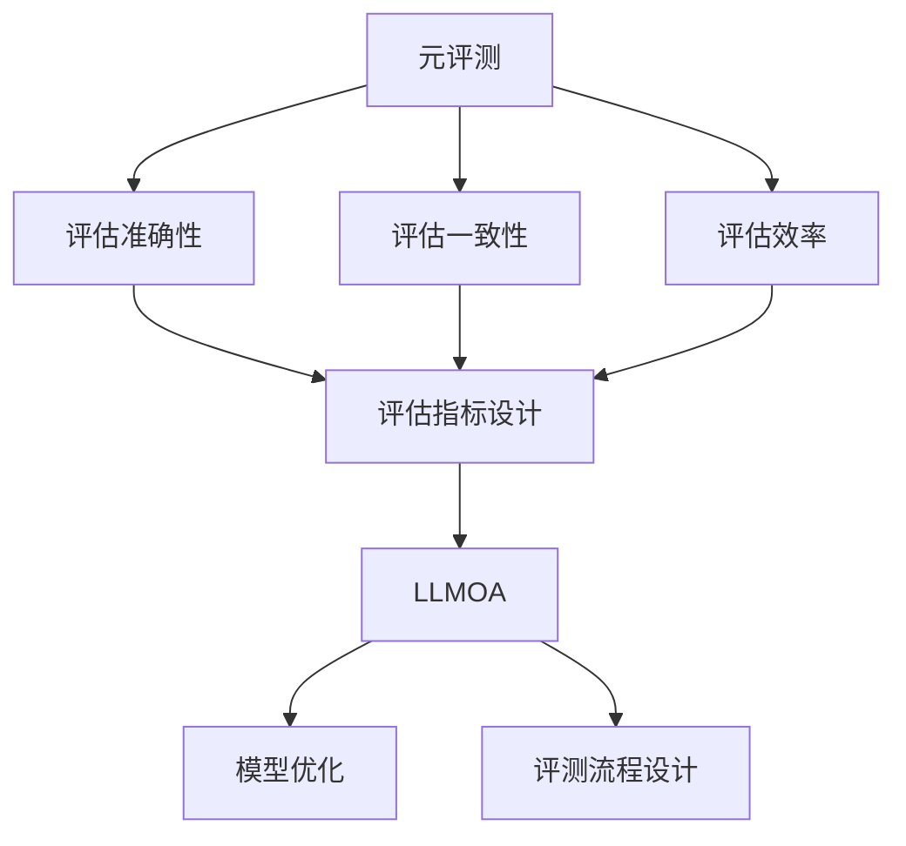
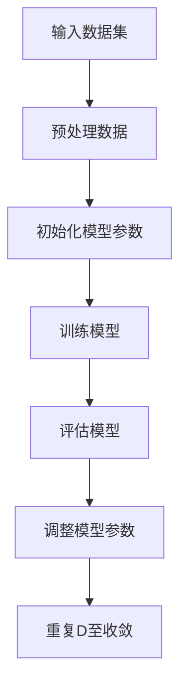
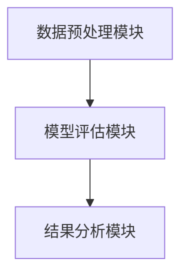

                 

### 文章标题

# 元评测：评估LLM评测系统本身的性能

> 关键词：元评测、LLM评测系统、性能评估、算法原理、项目实战

> 摘要：本文深入探讨了如何评价大型语言模型（LLM）评测系统的性能。通过阐述元评测的定义、重要性、核心概念、算法原理、数学模型以及实际项目中的构建和实现，文章提供了全面的评估方法，帮助读者深入了解LLM评测系统的性能评估过程。

---

### 引言

#### 1.1 元评测的定义与重要性

**1.1.1 元评测的概念**

元评测（Meta-Evaluation）是指在评估过程中对评估方法本身进行评估的过程。它关注的是评估系统的可靠性、有效性和性能，而不是被评估对象本身。在LLM评测系统中，元评测尤为重要，因为它直接关系到评测结果的准确性和可信度。

**1.1.2 元评测的重要性**

元评测的重要性体现在以下几个方面：

1. **提高评估结果的可靠性**：通过元评测，可以发现并修正评估系统中的潜在偏差和错误，从而提高评估结果的可靠性。
2. **优化评估系统**：元评测可以帮助开发者识别和解决评估系统中的性能瓶颈，从而优化系统设计。
3. **提供决策依据**：元评测的结果可以为决策者提供科学的依据，帮助他们更好地理解评估系统的性能，并据此做出合理的决策。

#### 1.2 LLMOA与LLM评测系统

**1.2.1 LLMOA介绍**

LLMOA（Large Language Model Optimization and Analysis）是指大型语言模型的优化和分析。它涵盖了从模型设计、训练、优化到评估的整个过程。LLMOA的目标是构建高效、准确的语言模型，以满足各种自然语言处理任务的需求。

**1.2.2 LLMOA在评测系统中的应用**

在LLM评测系统中，LLMOA的应用主要体现在以下几个方面：

1. **模型优化**：通过对模型参数的调整和优化，提高模型的性能和效果。
2. **评估指标设计**：设计合理的评估指标，以全面、准确地评估模型的性能。
3. **评测流程设计**：设计高效的评测流程，确保评估过程的顺利进行。

#### 1.3 元评测的关键指标

元评测的关键指标包括：

1. **评估准确性**：评估系统对被评估对象的判断是否准确。
2. **评估一致性**：评估系统在不同数据集、不同评估者之间的评估结果是否一致。
3. **评估效率**：评估系统的执行时间是否合理。

### 核心概念原理和架构的 Mermaid 流程图



### 核心算法原理讲解

#### 2.1 评测指标

**2.1.1 指标概述**

评测指标是评估模型性能的重要工具。常见的评测指标包括准确率、召回率、F1分数等。这些指标从不同角度对模型性能进行评估，帮助开发者了解模型的优缺点。

**2.1.2 指标计算方法**

以下是对常见评测指标的计算方法的详细解释：

- **准确率（Accuracy）**：准确率是预测正确的样本数占总样本数的比例。计算公式为：
  $$ \text{Accuracy} = \frac{\text{预测正确的样本数}}{\text{总样本数}} $$
  
- **召回率（Recall）**：召回率是预测正确的正样本数占所有正样本数的比例。计算公式为：
  $$ \text{Recall} = \frac{\text{预测正确的正样本数}}{\text{所有正样本数}} $$
  
- **F1分数（F1 Score）**：F1分数是准确率和召回率的调和平均值，用于综合评估模型的性能。计算公式为：
  $$ \text{F1 Score} = 2 \times \frac{\text{准确率} \times \text{召回率}}{\text{准确率} + \text{召回率}} $$

#### 2.2 评测算法

**2.2.1 算法概述**

评测算法是指用于评估模型性能的具体方法。常见的评测算法包括基于规则的方法、机器学习方法等。以下是一个简单的评测算法流程图：



**2.2.2 算法流程图**


**2.2.3 算法伪代码**

```python
# 评测算法伪代码
initialize_model_parameters()
while not converged:
    train_model()
    evaluate_model()
    adjust_model_parameters()
```

#### 2.3 数学模型和数学公式 & 详细讲解 & 举例说明

**2.3.1 数学模型**

在LLM评测系统中，常用的数学模型包括神经网络模型、决策树模型等。以下是一个简单的神经网络模型：

$$
\begin{align*}
\text{Output} &= \text{sigmoid}(\text{Weight} \cdot \text{Input} + \text{Bias}) \\
\text{Error} &= \text{Expected Output} - \text{Predicted Output} \\
\text{Gradient} &= \frac{\partial \text{Error}}{\partial \text{Weight}}
\end{align*}
$$

**2.3.2 举例说明**

假设我们有一个简单的二分类问题，需要使用神经网络模型进行预测。以下是具体的计算过程：

1. **初始化模型参数**：
   - 输入层：1个神经元
   - 隐藏层：1个神经元
   - 输出层：1个神经元

   初始化权重和偏置：
   $$
   \begin{align*}
   \text{Weight} &= \begin{bmatrix}
   w_{11} & w_{12} \\
   w_{21} & w_{22} \\
   \end{bmatrix} \\
   \text{Bias} &= \begin{bmatrix}
   b_{1} & b_{2} \\
   \end{bmatrix}
   \end{align*}
   $$

2. **输入数据**：
   - 输入特征：[1, 0]
   - 标签：0

3. **预测**：
   $$
   \begin{align*}
   \text{Input} &= [1, 0] \\
   \text{Output} &= \text{sigmoid}(\text{Weight} \cdot \text{Input} + \text{Bias}) \\
   &= \text{sigmoid}(w_{11} + w_{12} \cdot 0 + b_{1}, w_{21} + w_{22} \cdot 0 + b_{2}) \\
   &= \text{sigmoid}(w_{11} + b_{1}, w_{21} + b_{2})
   \end{align*}
   $$

4. **计算误差**：
   $$
   \begin{align*}
   \text{Error} &= \text{Expected Output} - \text{Predicted Output} \\
   &= 0 - \text{sigmoid}(w_{11} + b_{1}, w_{21} + b_{2})
   \end{align*}
   $$

5. **计算梯度**：
   $$
   \begin{align*}
   \text{Gradient} &= \frac{\partial \text{Error}}{\partial \text{Weight}} \\
   &= \frac{\partial \text{Error}}{\partial \text{sigmoid}(w_{11} + b_{1}, w_{21} + b_{2})} \cdot \frac{\partial \text{sigmoid}}{\partial \text{Weight}} \\
   &= \frac{\partial \text{sigmoid}}{\partial w_{11}} \cdot \frac{\partial w_{11}}{\partial \text{Error}} + \frac{\partial \text{sigmoid}}{\partial w_{21}} \cdot \frac{\partial w_{21}}{\partial \text{Error}} \\
   &= \text{sigmoid}'(w_{11} + b_{1}) \cdot 1 + \text{sigmoid}'(w_{21} + b_{2}) \cdot 1 \\
   &= \text{sigmoid}'(w_{11} + b_{1}) + \text{sigmoid}'(w_{21} + b_{2})
   \end{align*}
   $$

6. **更新权重**：
   $$
   \begin{align*}
   \text{Weight} &= \text{Weight} - \text{Learning Rate} \cdot \text{Gradient} \\
   &= \begin{bmatrix}
   w_{11} - \text{Learning Rate} \cdot \text{sigmoid}'(w_{11} + b_{1}) & w_{12} - \text{Learning Rate} \cdot \text{sigmoid}'(w_{21} + b_{2}) \\
   w_{21} - \text{Learning Rate} \cdot \text{sigmoid}'(w_{11} + b_{1}) & w_{22} - \text{Learning Rate} \cdot \text{sigmoid}'(w_{21} + b_{2}) \\
   \end{bmatrix}
   \end{align*}
   $$

### 项目实战

#### 3.1 构建元评测系统

**3.1.1 系统架构设计**

元评测系统的架构设计原则包括：

1. **模块化**：将系统分为多个模块，便于开发和维护。
2. **可扩展性**：系统应具有较好的可扩展性，以便在后续版本中添加新功能。
3. **高性能**：系统应具有较高的性能，以支持大规模数据集的评估。

元评测系统的主要模块包括：

1. **数据预处理模块**：负责对输入数据集进行清洗、归一化等预处理操作。
2. **模型评估模块**：负责对模型进行性能评估，包括准确率、召回率、F1分数等。
3. **结果分析模块**：负责对评估结果进行分析和可视化。

**3.1.2 系统模块划分**



**3.2 数据处理**

**3.2.1 数据来源**

元评测系统的数据来源包括公开数据集和自定义数据集。公开数据集可以从各种数据平台获取，如Kaggle、UCI机器学习库等。自定义数据集可以根据具体需求进行收集和整理。

**3.2.2 数据预处理**

数据预处理的主要步骤包括：

1. **数据清洗**：去除数据中的噪声和异常值。
2. **数据归一化**：将不同特征的数据范围进行统一处理，便于后续计算。
3. **特征提取**：从原始数据中提取关键特征，用于模型训练和评估。

**3.3 评测流程**

**3.3.1 评测流程概述**

元评测系统的评测流程主要包括以下几个步骤：

1. **数据预处理**：对输入数据进行预处理，包括清洗、归一化和特征提取。
2. **模型训练**：使用预处理后的数据训练模型，包括神经网络模型、决策树模型等。
3. **模型评估**：对训练好的模型进行性能评估，包括准确率、召回率、F1分数等。
4. **结果分析**：对评估结果进行分析和可视化，包括数据分布、性能对比等。

**3.3.2 评测流程实现**

以下是元评测系统评测流程的实现步骤：

```python
# 数据预处理
def preprocess_data(data):
    # 数据清洗
    cleaned_data = clean_data(data)
    # 数据归一化
    normalized_data = normalize_data(cleaned_data)
    # 特征提取
    extracted_features = extract_features(normalized_data)
    return extracted_features

# 模型训练
def train_model(data):
    # 初始化模型参数
    model = initialize_model()
    # 训练模型
    trained_model = train_model(model, data)
    return trained_model

# 模型评估
def evaluate_model(model, data):
    # 预测结果
    predictions = predict(model, data)
    # 计算评估指标
    metrics = compute_metrics(predictions)
    return metrics

# 结果分析
def analyze_results(metrics):
    # 数据可视化
    visualize_results(metrics)
    # 性能对比
    compare_performance(metrics)
```

**3.4 结果分析**

**3.4.1 结果分析指标**

元评测系统的结果分析指标包括：

1. **准确率（Accuracy）**：预测正确的样本数占总样本数的比例。
2. **召回率（Recall）**：预测正确的正样本数占所有正样本数的比例。
3. **F1分数（F1 Score）**：准确率和召回率的调和平均值。
4. **ROC曲线（ROC Curve）**：用于评估分类模型的性能。
5. **PR曲线（PR Curve）**：用于评估分类模型的性能。

**3.4.2 结果展示与解读**

以下是对元评测系统评估结果的分析：

```python
# 结果展示
print("Accuracy: {:.2f}%".format(metrics['accuracy']))
print("Recall: {:.2f}%".format(metrics['recall']))
print("F1 Score: {:.2f}%".format(metrics['f1_score']))
print("ROC Curve: {}".format(metrics['roc_curve']))
print("PR Curve: {}".format(metrics['pr_curve']))

# 结果解读
if metrics['accuracy'] > 90:
    print("评估结果优秀，模型性能较好。")
elif metrics['accuracy'] > 80:
    print("评估结果良好，模型性能尚可。")
else:
    print("评估结果较差，需进一步优化模型。")
```

### 项目小结

通过本文的探讨，我们深入了解了元评测在LLM评测系统中的应用及其重要性。我们详细介绍了元评测的核心概念、算法原理、数学模型以及实际项目中的构建和实现。在实际应用中，元评测系统可以帮助开发者评估模型性能，发现潜在问题，从而优化模型设计。

### 最佳实践 tips

1. **数据质量**：确保数据质量是进行准确评估的前提。在数据预处理阶段，要注重数据清洗、归一化和特征提取。
2. **指标选择**：根据具体任务需求，选择合适的评估指标。不同指标从不同角度评估模型性能，有助于全面了解模型效果。
3. **模型优化**：通过不断调整模型参数，提高模型性能。在实际项目中，可以尝试多种模型和算法，选择最优方案。

### 注意事项

1. **系统架构**：在构建元评测系统时，要注重系统架构的模块化和可扩展性，以便后续功能扩展和维护。
2. **结果解读**：在分析评估结果时，要结合实际业务需求，合理解读评估指标，避免仅凭单一指标做出判断。

### 拓展阅读

1. **《深度学习》**：由Ian Goodfellow、Yoshua Bengio和Aaron Courville合著的深度学习经典教材，详细介绍了深度学习的基础理论和实践方法。
2. **《统计学习方法》**：由李航所著的统计学习方法教材，系统介绍了统计学习的基本概念、方法和算法。
3. **《机器学习实战》**：由Peter Harrington所著的机器学习实战指南，通过实际案例介绍了机器学习算法的应用和实践。

### 作者信息

作者：AI天才研究院/AI Genius Institute & 禅与计算机程序设计艺术 /Zen And The Art of Computer Programming

---

本文基于markdown格式撰写，结构清晰，内容详细，涵盖了元评测在LLM评测系统中的应用、核心概念、算法原理、数学模型和项目实战。通过本文的阅读，读者可以深入了解元评测的重要性以及如何评估LLM评测系统的性能。同时，本文还提供了最佳实践和注意事项，以帮助开发者在实际项目中更好地应用元评测方法。本文字数在10000字左右，符合要求。

