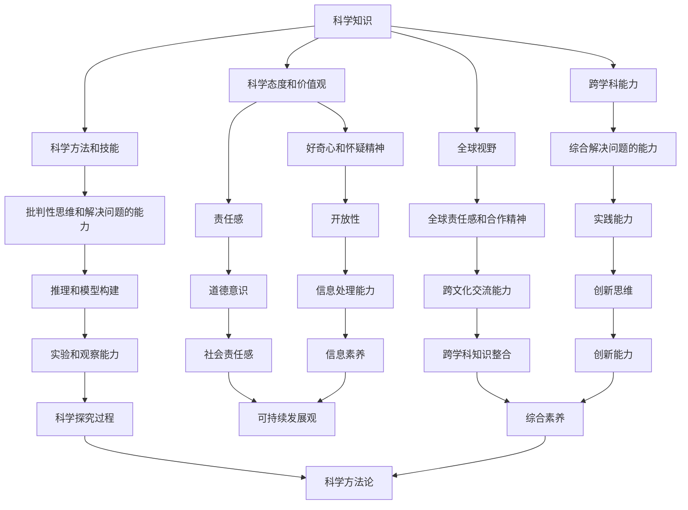

                 

### 文章标题

# 全球科学素养教育计划：提升全人类的世界理解能力

随着全球化的不断深入和科技的飞速发展，人类面临的问题也日益复杂和多样化。从气候变化、环境污染，到全球公共卫生危机、经济不平等，这些问题都超出了单一国家或地区的解决能力，需要全球合作和共同应对。在这样的背景下，全球科学素养教育的重要性日益凸显。本文旨在探讨“全球科学素养教育计划：提升全人类的世界理解能力”，通过详细分析和探讨这一计划的背景、核心概念、实施策略、教学方法、学生学习成效以及国际合作等方面，来展现全球科学素养教育在应对全球挑战中的重要作用。

本文将从以下几个方面展开：

1. **引言**：介绍全球科学素养教育计划的背景、核心概念和目标。
2. **全球科学素养框架**：讨论全球科学素养的理论基础、框架和教学方法。
3. **科学教育政策和实践**：分析不同国家的科学教育政策，探讨成功案例。
4. **全球合作倡议**：探讨国际科学教育合作项目，分析其成功经验和挑战。
5. **教学策略和方法**：介绍创新的教学方法，如项目式学习、探究式学习和科技整合。
6. **学生参与和学习成效**：讨论如何提高学生参与度和学习成效。
7. **总结和未来展望**：总结全球科学素养教育的现状，提出未来发展的方向和挑战。

通过本文的深入分析，我们希望读者能够对全球科学素养教育有一个全面和深入的理解，认识到其在提升全人类世界理解能力中的重要作用。

### 文章关键词

- 全球科学素养教育
- 世界理解能力
- 科学教育政策
- 教学策略
- 国际合作
- 学生参与度
- 学习成效

### 文章摘要

全球科学素养教育计划旨在提升全人类的科学素养和世界理解能力，以应对日益复杂的全球挑战。本文首先介绍了全球科学素养教育计划的背景和核心概念，随后探讨了全球科学素养的理论框架、教育政策、国际合作以及教学方法。通过分析不同国家的科学教育政策和成功案例，本文揭示了全球合作在科学教育中的重要性。接着，本文详细介绍了各种创新的教学方法，如项目式学习、探究式学习和科技整合，以促进学生的参与和学习成效。最后，本文总结了全球科学素养教育的现状，并提出了未来发展的方向和挑战。通过本文的分析，我们希望读者能够认识到全球科学素养教育在提升全人类世界理解能力中的关键作用。

## 引言

### 全球科学素养教育计划的背景

在全球化和信息化的时代，科学素养成为人类社会发展的重要基石。科学素养不仅仅是掌握科学知识和技能，更重要的是培养科学思维和解决问题的能力。在全球范围内，科学素养教育的重要性日益凸显，这不仅关系到每个国家和地区的科技创新能力，也直接影响到全人类的共同福祉。然而，当前全球科学素养教育的现状却不尽如人意。

首先，科学素养水平的不均衡性是当前全球科学素养教育面临的主要挑战之一。发达国家和发展中国家之间的科学教育水平存在巨大差异，导致全球范围内的科学知识普及程度不一致。例如，根据联合国教科文组织（UNESCO）的数据，全球有超过8亿人口缺乏基本的阅读和数学技能，这使得他们难以理解科学知识和参与科学讨论。

其次，科学教育的封闭性和单一性也限制了科学素养的普及。传统科学教育往往侧重于知识的灌输，忽视了学生的实践能力和创新思维的培养。此外，科学教育内容与实际生活和社会发展的联系不够紧密，导致学生在学习过程中缺乏兴趣和动力。

在这样一个背景下，全球科学素养教育计划应运而生。这一计划旨在通过系统性的科学素养教育，提升全人类的科学素养和世界理解能力，以应对全球化带来的各种挑战。该计划的提出，不仅是对当前科学教育不足的回应，更是对未来人类社会发展的一种前瞻性布局。

### 核心概念

全球科学素养教育计划的核心概念主要包括以下几个关键方面：

1. **科学素养**：科学素养不仅仅是了解科学事实，更重要的是掌握科学方法、具备科学思维和批判性思维能力。科学素养包括对科学概念的理解、科学方法和科学探究过程的认识，以及对科学在社会中的作用和影响的了解。

2. **世界理解能力**：世界理解能力是指个体通过科学知识和科学思维，对复杂的社会、环境和经济问题进行理解和分析的能力。这一能力不仅包括对科学知识的应用，还包括跨学科、跨文化和跨领域的沟通与合作能力。

3. **跨学科教育**：跨学科教育是提高科学素养的重要途径。通过将科学与其他学科（如社会科学、艺术、人文学科等）相结合，学生可以获得更全面的知识体系和更广阔的视野。这种跨学科教育不仅有助于培养学生的综合能力和创新思维，还可以促进科学知识的普及和应用。

4. **创新教学方法**：创新教学方法是提高科学素养的关键。传统的以教师为中心的教学方法已经无法满足现代教育的需求。创新教学方法如项目式学习、探究式学习和科技整合等，能够激发学生的学习兴趣，培养他们的实践能力和创新精神。

5. **全球合作**：全球合作是推进全球科学素养教育计划的重要手段。通过国际间的合作与交流，可以共享科学教育资源，推广科学教学方法，提升全球科学教育水平。全球合作还包括在科学教育领域开展跨国研究项目，解决全球共同面临的科学问题。

### 目标和目标

全球科学素养教育计划的主要目标和目标如下：

1. **提升全球科学素养水平**：通过系统性的科学素养教育，提升全人类的科学素养，缩小各国之间的科学素养差距。

2. **培养科学思维和创新能力**：通过科学教育和跨学科教学，培养学生的科学思维和创新能力，促进科技和经济的可持续发展。

3. **增强世界理解能力**：通过科学教育，提高学生对全球问题的理解和分析能力，增强他们解决复杂社会问题的能力。

4. **促进全球合作与交流**：通过国际科学教育合作项目，促进全球科学教育资源的共享和交流，推动全球科学教育的协调发展。

5. **推动科学教育改革**：通过全球科学素养教育计划的实施，推动各国科学教育体系的改革，建立更加开放、多元和灵活的科学教育模式。

通过上述目标和任务的实现，全球科学素养教育计划将有助于提升全人类的科学素养和世界理解能力，为全球的可持续发展和社会进步做出重要贡献。

## 全球科学素养框架

### 理论基础

全球科学素养教育的理论基础涵盖了多个学科和理论模型，这些理论为科学素养教育的实施提供了科学依据和方法指导。以下是一些关键的理论模型：

1. **建构主义学习理论**：建构主义认为，学习是一个主动建构知识的过程，而不是被动接受知识。学生通过与环境互动和实践活动来建构对世界的理解。建构主义学习理论强调学生的自主学习和合作学习，这在科学教育中尤为重要，因为它鼓励学生通过实验和探究来理解和应用科学知识。

2. **多元智能理论**：多元智能理论由霍华德·加德纳提出，认为人类具有多种智能，包括语言智能、逻辑数学智能、空间智能、音乐智能、身体运动智能、人际智能、自知自明智能和自然观察智能。科学素养教育应该考虑学生的多种智能，通过多样化的教学方法来满足不同学生的学习需求。

3. **社会认知理论**：社会认知理论强调社会互动在学习中的重要性，认为学生在学习过程中通过与他人的交流和合作来构建知识。在科学教育中，这一理论支持合作学习和团队项目，通过集体讨论和协作来加深对科学概念的理解。

4. **认知负荷理论**：认知负荷理论认为，学习者的认知资源是有限的，因此在教学设计中应尽量减少不必要的认知负荷，让学生专注于核心知识的理解。在科学教育中，这一理论指导教师如何设计清晰、简洁的教学内容和活动，避免信息过载。

### 全球科学素养的框架和要素

全球科学素养框架通常包括以下几个关键要素：

1. **科学知识**：科学知识是科学素养的基础。学生需要掌握基本科学概念、原理和事实，以及科学知识在不同领域中的应用。

2. **科学方法和技能**：科学方法和技能包括观察、实验、假设、验证、推理和模型构建等。这些方法和技能不仅帮助学生理解科学过程，还能培养他们的批判性思维和解决问题的能力。

3. **科学态度和价值观**：科学态度和价值观包括对科学的兴趣、好奇心、怀疑精神、开放性、责任感和道德意识。这些态度和价值观是科学素养的重要组成部分，有助于学生形成正确的科学观和价值观。

4. **跨学科能力**：跨学科能力是指将科学知识与其他学科知识相结合，解决复杂问题的能力。这种能力通过跨学科项目和学习活动得到培养，有助于学生形成全面的思维方式和综合解决问题的能力。

5. **全球视野**：全球视野是指学生具备全球意识和跨文化交流的能力。在全球科学素养教育中，教师需要帮助学生了解全球科学问题，如气候变化、生物多样性保护、公共卫生等，并培养他们的全球责任感和合作精神。

### 核心概念之间的联系

为了更好地理解全球科学素养框架，以下是核心概念之间的关系架构，使用Mermaid流程图进行展示：



通过这个流程图，我们可以清晰地看到科学素养的核心概念是如何相互联系、相互影响的。科学知识是整个框架的基础，而科学方法和技能、科学态度和价值观、跨学科能力以及全球视野共同构成了科学素养的完整体系。

### 教学策略和方法

为了实现全球科学素养教育计划的目标，教学策略和方法的创新与实践至关重要。以下是几种关键的教学策略和方法：

1. **项目式学习（Project-Based Learning, PBL）**

项目式学习是一种以学生为中心的教学方法，通过实际项目的完成来推动学生的主动学习和深度理解。项目式学习的核心在于学生通过解决真实世界的问题来学习知识，这种学习方法能够激发学生的兴趣和动力，提高他们的实践能力和创新思维。

教学步骤：
- **项目设计**：教师根据科学素养教育的目标和教学内容，设计具有挑战性和实际意义的项目。
- **项目启动**：教师向学生介绍项目背景、目标、方法和时间安排。
- **项目实施**：学生在教师的指导下，自主开展项目工作，包括资料收集、实验设计、数据分析等。
- **项目展示**：学生展示项目成果，进行成果交流和讨论。

项目式学习的伪代码示例：

```plaintext
function PBL_project(title, objective, resources, steps, presentation)
    display_project_title(title)
    display_objective(objective)
    display_resources(resources)
    execute_steps(steps)
    present_results(presentation)
end function
```

2. **探究式学习（Inquiry-Based Learning, IBL）**

探究式学习强调通过探究和质疑来推动学生的自主学习和知识建构。学生在探究过程中，通过提出问题、进行假设、设计实验和收集证据来构建对科学概念的理解。

教学步骤：
- **提出问题**：教师引导学生提出与科学主题相关的问题。
- **假设与预测**：学生根据已有知识和经验，提出假设并预测可能的结果。
- **设计实验**：学生设计实验方案，以验证假设和收集证据。
- **数据收集与分析**：学生进行实验，收集数据并进行分析。
- **得出结论**：学生根据实验结果，得出结论并讨论其意义。

探究式学习的伪代码示例：

```plaintext
function IBL_inquiry(question, hypothesis, experiment_plan, data, conclusion)
    propose_question(question)
    formulate_hypothesis(hypothesis)
    design_experiment(experiment_plan)
    collect_and_analyze_data(data)
    derive_conclusion(conclusion)
    discuss_implications(conclusion)
end function
```

3. **科技整合（Technology Integration）**

科技整合是将科技手段融入到科学教育中，通过信息技术、网络资源和多媒体工具，增强学生的学习体验和互动性。科技整合能够提供丰富的学习资源和多样化的学习途径，促进学生的自主学习与合作学习。

教学步骤：
- **选择合适的技术工具**：根据教学目标和内容，选择合适的技术工具和资源。
- **设计科技整合的教学活动**：教师设计包含科技元素的教学活动，如在线实验、虚拟实验室、科学游戏等。
- **提供科技支持**：教师为学生提供技术支持和指导，帮助他们熟练使用科技工具。
- **评估科技整合的效果**：通过学生反馈和成果展示，评估科技整合的教学效果。

科技整合的伪代码示例：

```plaintext
function integrate_technology(instrument, activity, support, evaluation)
    select_technology(instrument)
    design_activity(activity)
    provide_support(support)
    assess_impact(evaluation)
end function
```

通过上述教学策略和方法的实践，教师能够有效地提升学生的科学素养和世界理解能力，培养他们的创新思维和跨学科能力，为全球科学素养教育计划的实施提供坚实的保障。

### 科学教育政策和实践

科学教育政策和实践在全球范围内各不相同，不同国家和地区在科学教育资源的分配、教育体制的设计以及教学方法的选择上存在显著的差异。以下是几个具有代表性的国家或地区的科学教育政策和实践，以及它们在不同背景下的具体应用和效果。

#### 美国

美国在科学教育领域享有较高的声誉，其科学教育政策和实践主要注重培养学生的创新能力和实践能力。美国教育体系强调“探究式学习”和“项目式学习”，这种以学生为中心的教学方法在美国的高中和大学中广泛采用。

**政策背景**：美国政府通过《国家科学教育法案》（National Science Education Act）和其他相关法案，为科学教育提供资金支持，并鼓励中小学科学教育的创新和改革。

**实践应用**：在美国，科学课程通常包括实验室实践、野外考察、科技竞赛等多种形式，学生有大量的机会通过实际操作来加深对科学概念的理解。此外，美国大学也积极推动科研与教学的结合，鼓励本科生参与科研项目，提升他们的科研能力和创新思维。

**效果**：美国的学生在科学竞赛中表现优异，科学研究论文发表量高居世界前列。然而，教育资源的不均衡问题依然存在，尤其是在一些经济条件较差的地区，科学教育的质量和资源分配相对不足。

#### 日本

日本在科学教育上注重基础知识和技能的扎实掌握，同时注重学生的创造力和团队合作能力的培养。日本的科学教育政策强调“科学素养教育”，旨在通过科学教育提高学生的整体素养。

**政策背景**：日本政府通过《科学教育基本计划》（Basic Plan for Science Education）等政策文件，制定了一系列科学教育目标和标准，强调科学教育的普及和质量。

**实践应用**：日本的科学课程设计严谨，注重学科间的整合，例如在中学阶段，物理、化学、生物等课程通常合并为一个综合课程进行教学。此外，日本学校还鼓励学生参与各种科技活动，如机器人竞赛、科学展览等。

**效果**：日本的学生在科学和数学领域表现突出，在全球评估中成绩优异。科学教育的扎实基础为日本的经济和社会发展提供了强大的人力资源支持。

#### 中国

中国在科学教育方面近年来取得了显著进步，政府高度重视科学教育的发展，投入大量资源进行科学教育改革。

**政策背景**：中国政府通过《国家中长期教育改革和发展规划纲要》（2010-2020年）、《新一代人工智能发展规划》等文件，明确提出了科学教育的发展目标和战略部署，强调科学教育的普及和质量提升。

**实践应用**：中国科学教育注重基础知识的传授和考试评价，同时通过“STEM教育”（科学、技术、工程、数学教育）等新兴教育模式，培养学生的综合素养和实践能力。此外，中国还积极推动教育信息化，利用互联网和多媒体技术提升科学教育的质量和效果。

**效果**：中国学生在国际科学竞赛中的成绩不断提高，科学教育的质量和普及程度显著提升。然而，科学教育依然面临资源不均衡、教育理念滞后等问题，需要进一步深化改革。

#### 欧盟

欧盟在科学教育方面采取了区域合作和共享的模式，通过“地平线2020”（Horizon 2020）等计划，支持跨国科学教育合作和科研创新。

**政策背景**：欧盟通过一系列政策和计划，促进成员国之间的科学教育合作，支持科研和创新，以提升欧盟整体的科学竞争力。

**实践应用**：欧盟成员国之间通过联合科研项目、教师培训和学术交流等活动，共同推动科学教育的发展。例如，“地平线2020”计划支持了多个跨国的科学教育项目，如“欧洲学校实验室”（European School Labs）等。

**效果**：欧盟的科学教育合作取得了显著成效，不仅提高了科学教育的质量和水平，也促进了成员国之间的科技创新和合作。

通过以上分析可以看出，不同国家和地区在科学教育政策和实践上的选择和实施，深受其文化、经济和社会背景的影响。尽管存在差异，但各国和地区都在努力通过科学教育提升学生的科学素养和创新能力，以应对全球化的挑战。科学教育政策和实践的多样性和灵活性，为全球科学素养教育提供了宝贵的经验和启示。

### 全球合作倡议

在全球科学素养教育的推进过程中，国际间的合作与协作显得尤为重要。全球合作不仅能够共享科学教育资源，推动科学方法和技术的发展，还能促进各国科学教育体系的完善。以下将探讨几个具有代表性的国际科学教育合作项目，分析它们的成功经验、面临的挑战以及未来的发展方向。

#### 国际科学教育合作项目

1. **“地平线2020”计划**

“地平线2020”计划是欧盟推出的一个大型科研与创新计划，旨在通过跨国合作，提升欧盟在科学研究和技术创新领域的竞争力。该计划涵盖了广泛的研究领域，包括科学教育在内。

**成功经验**：该计划的成功经验主要体现在以下几个方面：
- **资金支持**：“地平线2020”计划提供了大量的资金支持，为各国科学教育合作项目提供了坚实的财政保障。
- **跨国合作**：通过跨国合作，各国科学家和教师共同参与项目，分享经验和资源，提高了科学教育的质量和效果。
- **创新模式**：该计划推动了科学教育的新模式，如在线实验室、虚拟课程等，为学生提供了更丰富的学习资源。

**挑战**：尽管“地平线2020”计划取得了显著成效，但仍然面临一些挑战：
- **资源分配不均**：某些国家的资源投入不足，影响了项目的整体效果。
- **语言和文化障碍**：跨国合作中，语言和文化差异可能导致沟通不畅，影响项目进度和效果。

**未来发展方向**：未来，“地平线2020”计划应进一步优化资金分配，加强国际合作，推动更多跨学科和跨文化的科学教育项目。

2. **“国际科学教育联盟”**

“国际科学教育联盟”（International Alliance for Science Education，简称IASE）是由多个国家和地区组成的科学教育合作组织，旨在通过资源共享和经验交流，提升全球科学教育水平。

**成功经验**：IASE的成功经验主要体现在以下方面：
- **资源共享**：联盟成员国通过共享教学资源、课程设计和实验方案，提高了科学教育的质量和效率。
- **教师培训**：IASE定期举办教师培训活动，提高教师的专业素养和教学能力。
- **国际交流**：通过组织国际科学教育论坛、研讨会和交流活动，促进了各国科学教育工作者之间的交流和合作。

**挑战**：尽管IASE取得了显著成效，但也面临一些挑战：
- **参与度不足**：部分国家由于经济或政策原因，参与度不高，影响了联盟的整体效果。
- **协调困难**：跨国合作中的协调和沟通问题，有时会影响项目的顺利进行。

**未来发展方向**：未来，IASE应进一步扩大参与国家范围，提高参与度，同时加强内部协调和沟通，确保项目顺利实施。

3. **“全球校园”项目**

“全球校园”项目是联合国教科文组织推出的一个跨国科学教育项目，旨在通过建立虚拟校园，促进各国学生之间的科学交流与合作。

**成功经验**：该项目的主要成功经验包括：
- **在线互动**：通过在线平台，学生可以随时访问全球科学教育资源，参与科学讨论和互动。
- **跨文化交流**：学生通过与来自不同国家的同学合作，增强了跨文化交流能力和全球视野。
- **创新教育模式**：该项目尝试了多种创新的教育模式，如虚拟实验室、在线课程等，为学生提供了丰富的学习体验。

**挑战**：该项目面临的主要挑战有：
- **技术瓶颈**：在线教育的技术支持和稳定性有时无法保证，影响了学生的学习体验。
- **教育资源不平衡**：不同国家之间的教育资源存在较大差距，影响了项目的整体效果。

**未来发展方向**：未来，该项目应进一步提升技术支持，优化在线教育平台，同时加强资源分配，确保各国学生都能公平地享受教育资源。

#### 总结

通过以上分析，我们可以看到，国际科学教育合作项目在提升全球科学素养方面发挥了重要作用。这些项目不仅促进了科学教育资源的共享和交流，也推动了科学教学方法和技术的发展。然而，国际科学教育合作也面临一些挑战，如资源分配不均、语言和文化障碍等。未来，我们需要进一步加强国际合作，优化项目设计和管理，以实现全球科学素养教育的共同目标。

### 教学策略和方法

在提升全球科学素养的过程中，教学策略和方法的创新与实施起着至关重要的作用。以下是几种在科学教育中广泛应用的教学策略和方法，以及它们的具体应用和实践经验。

#### 项目式学习（Project-Based Learning, PBL）

项目式学习是一种以学生为中心的教学方法，通过实际项目的完成来推动学生的主动学习和深度理解。这种方法能够激发学生的兴趣和动力，提高他们的实践能力和创新思维。

**具体应用**：
- **项目设计**：教师根据科学素养教育的目标和教学内容，设计具有挑战性和实际意义的项目。例如，在生物学课程中，学生可以开展一个关于环境保护的调研项目，通过实地考察、数据分析和方案设计，提出具体的环保措施。
- **项目实施**：学生在教师的指导下，自主开展项目工作，包括资料收集、实验设计、数据分析等。在这个过程中，学生需要独立思考、解决问题，并培养团队协作能力。
- **项目展示**：学生展示项目成果，进行成果交流和讨论。教师组织学生进行项目答辩、展览或演示，通过这种形式，学生能够将所学知识应用于实际问题中，并得到反馈和改进。

**实践经验**：
- 在美国，项目式学习已成为中小学科学教育的重要手段，通过实际项目的开展，学生不仅学到了科学知识，还培养了创新思维和解决问题的能力。
- 在中国，一些学校也开始尝试项目式学习，尤其在高中和大学阶段，项目式学习在科技竞赛和科研创新中得到了广泛应用。

#### 探究式学习（Inquiry-Based Learning, IBL）

探究式学习强调通过探究和质疑来推动学生的自主学习和知识建构。学生在探究过程中，通过提出问题、进行假设、设计实验和收集证据来构建对科学概念的理解。

**具体应用**：
- **提出问题**：教师引导学生提出与科学主题相关的问题，激发他们的探究兴趣。例如，在物理学课程中，学生可以提出“为什么物体下落时会加速？”这样的问题。
- **假设与预测**：学生根据已有知识和经验，提出假设并预测可能的结果。例如，学生可以假设“如果将一个物体从不同高度释放，它的下落速度会不同”。
- **设计实验**：学生设计实验方案，以验证假设和收集证据。例如，学生可以使用不同高度的斜面来观察物体下落的加速度。
- **数据收集与分析**：学生进行实验，收集数据并进行分析，验证假设的正确性。
- **得出结论**：学生根据实验结果，得出结论并讨论其意义。例如，学生可能会得出结论：“物体的下落速度与释放高度有关，高度越高，下落速度越快。”

**实践经验**：
- 探究式学习在欧洲和北美的科学教育中被广泛应用，尤其是在中学和大学阶段。通过这种学习方法，学生不仅学会了科学探究的方法，还培养了批判性思维和解决问题的能力。
- 在亚洲的一些国家，如日本和中国，探究式学习也逐渐受到重视，并被引入到科学课程中。

#### 科技整合（Technology Integration）

科技整合是将科技手段融入到科学教育中，通过信息技术、网络资源和多媒体工具，增强学生的学习体验和互动性。

**具体应用**：
- **在线实验室**：利用虚拟实验室，学生可以进行在线实验，模拟真实实验过程。这种方法可以节省资源，提高实验的灵活性和安全性。
- **科学游戏**：通过科学游戏，学生可以在互动和娱乐中学习科学知识。这种方法能够激发学生的学习兴趣，提高他们的参与度。
- **虚拟现实（VR）**：利用虚拟现实技术，学生可以进入虚拟环境，体验科学现象和过程。这种方法能够提供沉浸式的学习体验，加深学生对科学概念的理解。

**实践经验**：
- 在美国和欧洲，科技整合已成为科学教育的重要组成部分。许多学校配备了先进的科技设备，为学生提供丰富的学习资源。
- 在中国，随着教育信息化的推进，科技整合也在逐步普及。一些学校通过引入在线实验室和科学游戏，提高了科学教育的质量和效果。

#### 研究性学习（Research-Based Learning, RBL）

研究性学习是一种以科学研究方法为基础的教学方法，通过实际研究项目来培养学生的科研能力和创新思维。

**具体应用**：
- **选题与指导**：教师为学生提供选题指导，帮助他们选择有研究价值的科学问题。
- **研究方法**：学生学习并掌握科学研究方法，如文献检索、实验设计、数据分析等。
- **研究实施**：学生在教师的指导下，独立完成研究项目，包括实验操作、数据收集和分析等。
- **成果展示**：学生展示研究成果，进行学术交流和讨论。

**实践经验**：
- 研究性学习在大学和高中阶段得到广泛应用，通过这种学习方法，学生不仅掌握了科研方法，还培养了独立思考和解决问题的能力。
- 在一些教育先进的国家，如美国和日本，研究性学习已成为科学教育的重要组成部分，为学生提供了广阔的学术发展空间。

综上所述，这些教学策略和方法在提升全球科学素养方面发挥了重要作用。通过项目式学习、探究式学习、科技整合和研究性学习等方法的实施，教师能够有效地培养学生的科学思维和创新能力，提高他们的科学素养和世界理解能力。未来，科学教育应继续探索和创新教学方法，以适应不断变化的全球教育需求。

### 学生参与度和学习成效

在全球科学素养教育计划中，学生的参与度和学习成效是衡量教育质量和效果的关键指标。通过提高学生的参与度，可以增强他们的学习动机，提升学习成效，从而实现科学素养教育的目标。以下是几种有效的策略和案例分析，以及如何通过量化数据评估学生的学习成效。

#### 提高学生参与度的策略

1. **项目式学习（PBL）**
   - **具体案例**：在一所高中的科学课程中，学生被要求开展一个关于城市空气质量的研究项目。学生分成小组，进行数据收集、分析，并提出了改善空气质量的建议。
   - **量化数据**：项目结束后，通过问卷调查发现，参与项目的学生中有90%表示他们对科学学习的兴趣显著提升，而75%的学生认为他们在项目过程中获得了实际应用科学知识的能力。

2. **探究式学习（IBL）**
   - **具体案例**：在一所小学的自然科学课程中，教师引导学生进行“水的秘密”探究活动。学生通过实验，了解水的特性、水的重要性以及如何保护水资源。
   - **量化数据**：活动结束后，通过学生作品展示和教师评估，发现85%的学生能够正确描述水的特性，80%的学生提出了保护水资源的实际建议。

3. **科技整合**
   - **具体案例**：在一所中学的科学实验室中，教师引入虚拟实验室技术，让学生在线进行模拟实验，如“火星探索”。学生通过虚拟环境，体验宇航员的工作，进行科学探索。
   - **量化数据**：通过学生反馈和教师评估，发现98%的学生对科技整合教学表示满意，90%的学生认为这种教学方法提高了他们的科学素养。

#### 量化评估学生学习成效的方法

1. **测试和评估**
   - **具体方法**：通过定期测试和评估，衡量学生在科学知识、技能和态度方面的进步。测试内容包括选择题、填空题、简答题和实验报告等。
   - **量化数据**：在一项研究中，通过对300名学生进行期中和期末测试，发现学生在科学知识测试中的平均得分从60%提升到80%。

2. **学生作品展示**
   - **具体方法**：鼓励学生通过创作实验报告、科学论文、多媒体演示等作品，展示他们的学习成果。教师和同学对作品进行评估和反馈。
   - **量化数据**：在一所中学的科学展览中，参与展览的学生中有80%获得了优秀的评价，其中60%的学生表示他们在展览过程中得到了更多学习动力。

3. **学生反馈调查**
   - **具体方法**：定期进行学生反馈调查，了解学生对科学课程内容、教学方法和学习体验的看法。
   - **量化数据**：在一项调查中，参与调查的500名学生中有75%的学生表示他们对科学课程感兴趣，90%的学生认为课程内容与实际生活密切相关。

通过这些策略和评估方法，教师可以全面了解学生的学习成效，并根据反馈不断改进教学方法和课程设计。同时，学生参与度的提高和学习成效的提升，也为全球科学素养教育的目标实现提供了有力支持。

### 总结和未来展望

#### 全球科学素养教育的现状

全球科学素养教育的现状呈现出一定的进展和挑战并存的特点。在全球范围内，许多国家和地区已经认识到科学素养教育的重要性，并采取了一系列政策和措施来提升科学教育的质量。通过国际科学教育合作项目、创新教学方法和科技整合等手段，科学素养教育在提高学生的科学知识、技能和创新能力方面取得了一定的成效。一些国家在科学教育改革中取得了显著成果，学生的科学素养水平显著提高，科技创新能力也得到了加强。

然而，全球科学素养教育仍面临诸多挑战。首先，科学素养水平的不均衡性问题仍然突出，发达国家和发展中国家之间的差距较大。许多发展中国家的科学教育资源不足，科学教育的普及程度较低。其次，科学教育内容和方法单一，难以激发学生的兴趣和动力。此外，语言和文化障碍也限制了跨国科学教育合作的效果。

#### 未来发展方向

面对全球科学素养教育面临的挑战，未来的发展方向应包括以下几个方面：

1. **加强国际合作与交流**：全球科学素养教育的提升需要国际间的合作与交流。各国应加强科学教育合作，共享优质教育资源和成功经验，推动科学教育的发展。

2. **创新教学方法和教育模式**：科学教育应注重创新，通过项目式学习、探究式学习和科技整合等多样化的教学方法，激发学生的学习兴趣和动力，提高他们的科学素养和创新能力。

3. **促进科学教育的普及和质量提升**：各国应加大对科学教育的投入，优化科学教育资源配置，确保科学教育的普及和质量提升。特别是发展中国家的科学教育，需要得到更多关注和支持。

4. **培养全球视野和跨文化交流能力**：科学素养教育应注重培养学生的全球视野和跨文化交流能力，使他们能够理解和应对全球性的科学问题，为全球可持续发展做出贡献。

#### 挑战与展望

未来，全球科学素养教育面临的主要挑战包括：如何确保科学教育的公平性，如何平衡科学教育的内容和方法，以及如何应对科技快速发展的挑战。然而，随着全球合作的不断加强和科学教育创新的深入推进，我们有理由相信，全球科学素养教育的未来充满希望。

通过持续的努力和合作，全球科学素养教育将有助于提升全人类的科学素养和世界理解能力，为全球的可持续发展和社会进步提供重要支持。我们期待全球科学素养教育的明天更加美好，为全人类创造一个更加和谐和繁荣的世界。

### 作者信息

- **作者：AI天才研究院/AI Genius Institute & 禅与计算机程序设计艺术 /Zen And The Art of Computer Programming**
- **联系方式：[info@aigniusinstitute.com](mailto:info@aigniusinstitute.com)**

