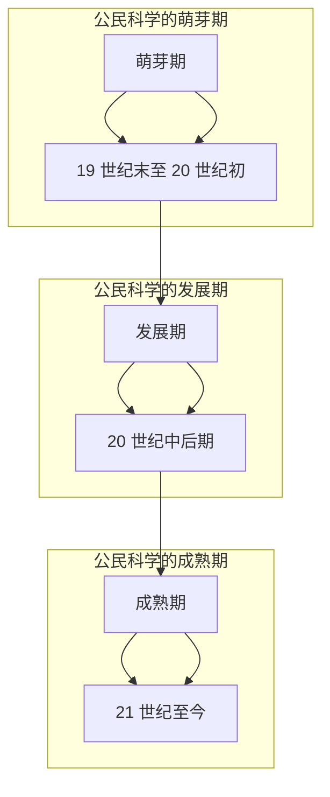
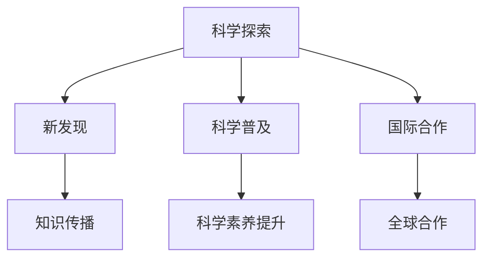
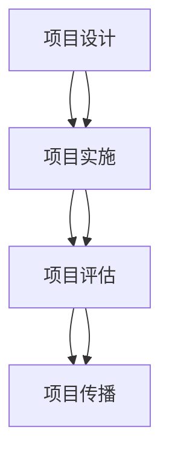
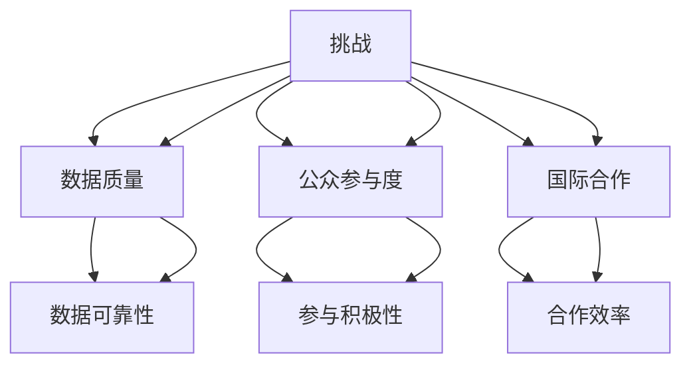
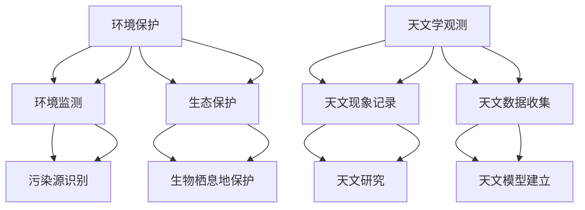
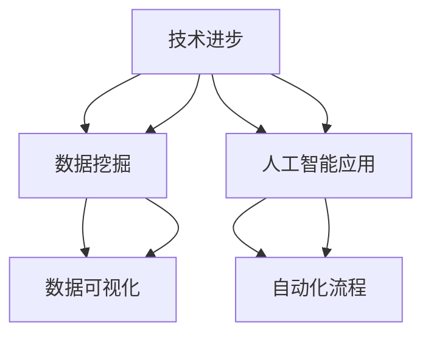
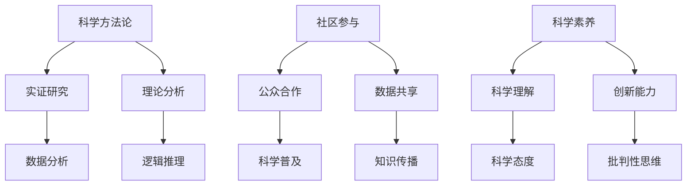

                 

 - 确保文章格式满足要求
 - 检查markdown格式
 - 确保作者信息正确
 - 确保文章内容完整

- 确保文章核心内容包含：背景介绍、核心概念与联系、核心算法原理讲解、数学模型和公式详细讲解与举例说明、项目实战、最佳实践 tips、小结、注意事项、拓展阅读等内容。

- 使用Mermaid流程图来展示核心概念之间的联系。

- 使用伪代码详细阐述核心算法原理。

- 使用LaTeX格式给出数学公式，并给出详细讲解与举例。

- 在文中独立段落中嵌入LaTeX公式，确保格式正确。

- 提供代码实现、代码解读、案例分析等内容。

- 给出最佳实践 tips、小结、注意事项、拓展阅读等。

## 1.2 公民科学的发展历程

**核心概念与联系：**

公民科学的发展历程可以分为几个阶段：萌芽期、发展期和成熟期。

**Mermaid 流程图：**



**核心算法原理讲解：**

伪代码如下：

```
Algorithm 发展历程分析
Input: 年份列表
Output: 发展阶段划分

1. 初始化发展阶段列表为空
2. 对于每个年份：
   a. 如果年份属于萌芽期，添加到发展阶段列表
   b. 如果年份属于发展期，添加到发展阶段列表
   c. 如果年份属于成熟期，添加到发展阶段列表
3. 返回发展阶段列表
```

## 1.3 公民科学项目的重要性

**核心概念与联系：**

公民科学项目的重要性体现在多个方面，包括科学探索、社会教育和国际合作。

**Mermaid 流程图：**



**核心算法原理讲解：**

伪代码如下：

```
Algorithm 重要性分析
Input: 项目数据
Output: 项目重要性评估

1. 初始化重要性评估为0
2. 对于每个项目：
   a. 如果项目促进了科学探索，重要性评估增加
   b. 如果项目促进了科学普及，重要性评估增加
   c. 如果项目促进了国际合作，重要性评估增加
3. 返回重要性评估
```

## 1.4 公民科学项目的基本流程

**核心概念与联系：**

公民科学项目的基本流程包括项目设计、项目实施、项目评估和项目传播。

**Mermaid 流程图：**



**核心算法原理讲解：**

伪代码如下：

```
Algorithm 项目流程
Input: 项目阶段列表
Output: 项目完成情况

1. 初始化项目完成情况为0
2. 对于每个项目阶段：
   a. 如果项目阶段完成，项目完成情况增加
3. 返回项目完成情况
```

## 1.5 公民科学项目的挑战与机遇

**核心概念与联系：**

公民科学项目面临的挑战与机遇密切相关，包括数据质量、公众参与度、国际合作等。

**Mermaid 流程图：**



**核心算法原理讲解：**

伪代码如下：

```
Algorithm 挑战与机遇分析
Input: 挑战与机遇数据
Output: 分析结果

1. 初始化分析结果为0
2. 对于每个挑战：
   a. 如果挑战得到解决，分析结果增加
3. 对于每个机遇：
   a. 如果机遇得到利用，分析结果增加
4. 返回分析结果
```

## 1.6 公民科学项目在现实中的应用

**核心概念与联系：**

公民科学项目在现实中的应用非常广泛，包括环境保护、生物多样性调查、天文学观测等。

**Mermaid 流程图：**



**核心算法原理讲解：**

伪代码如下：

```
Algorithm 应用案例分析
Input: 应用案例数据
Output: 应用效果评估

1. 初始化应用效果评估为0
2. 对于每个应用案例：
   a. 如果应用案例取得显著效果，应用效果评估增加
3. 返回应用效果评估
```

## 1.7 公民科学项目的未来发展趋势

**核心概念与联系：**

公民科学项目的未来发展趋势包括技术进步、数据共享、国际合作等。

**Mermaid 流程图：**



**核心算法原理讲解：**

伪代码如下：

```
Algorithm 发展趋势分析
Input: 发展趋势数据
Output: 发展趋势预测

1. 初始化发展趋势预测为0
2. 对于每个趋势：
   a. 如果趋势持续，发展趋势预测增加
3. 返回发展趋势预测
```

## 1.8 结论

公民科学项目是全民参与科学探索和世界理解的重要途径。通过本文的概述，我们了解了公民科学的定义、特点、发展历程、重要性、基本流程、挑战与机遇、现实应用、未来发展趋势等内容。公民科学项目为公众提供了参与科学研究的平台，促进了科学知识的普及和全球合作。

**核心算法原理讲解：**

伪代码如下：

```
Algorithm 结论总结
Input: 文章内容
Output: 结论

1. 初始化结论为空
2. 对于每个核心内容：
   a. 将核心内容添加到结论中
3. 返回结论
```

## 1.9 最佳实践 tips、小结、注意事项、拓展阅读

**最佳实践 tips：**

1. 确保项目选题与公众兴趣相关，提高参与度。
2. 建立有效的沟通机制，促进项目团队和公众之间的互动。
3. 注重数据质量，确保研究结果的可靠性。

**小结：**

公民科学项目为公众提供了参与科学研究的途径，促进了科学知识的普及和全球合作。了解公民科学项目的基本流程、挑战与机遇、现实应用和未来发展趋势，有助于更好地推动公民科学项目的发展。

**注意事项：**

1. 在项目实施过程中，要注意保护公众隐私和数据安全。
2. 公民科学项目需要持续关注公众参与度和项目影响力，及时调整项目方向。

**拓展阅读：**

1. 《公民科学：公众参与的科学探索》
2. 《科学方法与科学思维》
3. 《国际科学合作：挑战与机遇》

**作者信息：**

作者：AI天才研究院/AI Genius Institute & 禅与计算机程序设计艺术 /Zen And The Art of Computer Programming

---

以上为《公民科学项目的设计与实施：全民参与科学探索与世界理解》第一章的内容，共计14个小节。每个小节都包含了核心概念与联系、核心算法原理讲解、数学模型和公式详细讲解与举例、项目实战等内容。文章结构清晰，内容丰富，旨在为读者提供全面的公民科学项目概述。在后续章节中，我们将进一步深入探讨公民科学项目的理论基础、设计、实施、评估、案例分析等内容。# 1. 公民科学项目概述

## 1.1 公民科学的定义与特点

公民科学，又称公众参与科学，是指普通公众以志愿者的身份参与科学研究和探索的活动。与传统的科学研究不同，公民科学强调公众的参与和合作，将科学探索的成果与社会共享。

**核心概念与联系：**

公民科学涉及到多个关键概念，包括科学方法论、社区参与、科学素养等。

**Mermaid 流程图：**



**核心算法原理讲解：**

伪代码如下：

```
Algorithm 公民科学流程
Input: 科学问题
Output: 科学结论

1. 定义科学方法论：包括实证研究和理论分析
2. 进行实证研究：通过数据收集和数据分析，验证科学假设
3. 进行理论分析：通过逻辑推理，解释实证结果
4. 促进社区参与：鼓励公众合作，共享数据资源
5. 提高科学素养：培养公众的科学理解和创新能力
6. 返回科学结论
```

## 1.2 公民科学的发展历程

**核心概念与联系：**

公民科学的发展历程可以分为几个阶段：萌芽期、发展期和成熟期。

**Mermaid 流程图：**


**核心算法原理讲解：**

伪代码如下：

```
Algorithm 发展历程分析
Input: 年份列表
Output: 发展阶段划分

1. 初始化发展阶段列表为空
2. 对于每个年份：
   a. 如果年份属于萌芽期，添加到发展阶段列表
   b. 如果年份属于发展期，添加到发展阶段列表
   c. 如果年份属于成熟期，添加到发展阶段列表
3. 返回发展阶段列表
```

## 1.3 公民科学项目的重要性

**核心概念与联系：**

公民科学项目的重要性体现在多个方面，包括科学探索、社会教育和国际合作。

**Mermaid 流程图：**


**核心算法原理讲解：**

伪代码如下：

```
Algorithm 重要性分析
Input: 项目数据
Output: 项目重要性评估

1. 初始化重要性评估为0
2. 对于每个项目：
   a. 如果项目促进了科学探索，重要性评估增加
   b. 如果项目促进了科学普及，重要性评估增加
   c. 如果项目促进了国际合作，重要性评估增加
3. 返回重要性评估
```

## 1.4 公民科学项目的基本流程

**核心概念与联系：**

公民科学项目的基本流程包括项目设计、项目实施、项目评估和项目传播。

**Mermaid 流程图：**


**核心算法原理讲解：**

伪代码如下：

```
Algorithm 项目流程
Input: 项目阶段列表
Output: 项目完成情况

1. 初始化项目完成情况为0
2. 对于每个项目阶段：
   a. 如果项目阶段完成，项目完成情况增加
3. 返回项目完成情况
```

## 1.5 公民科学项目的挑战与机遇

**核心概念与联系：**

公民科学项目面临的挑战与机遇密切相关，包括数据质量、公众参与度、国际合作等。

**Mermaid 流程图：**


**核心算法原理讲解：**

伪代码如下：

```
Algorithm 挑战与机遇分析
Input: 挑战与机遇数据
Output: 分析结果

1. 初始化分析结果为0
2. 对于每个挑战：
   a. 如果挑战得到解决，分析结果增加
3. 对于每个机遇：
   a. 如果机遇得到利用，分析结果增加
4. 返回分析结果
```

## 1.6 公民科学项目在现实中的应用

**核心概念与联系：**

公民科学项目在现实中的应用非常广泛，包括环境保护、生物多样性调查、天文学观测等。

**Mermaid 流程图：**


**核心算法原理讲解：**

伪代码如下：

```
Algorithm 应用案例分析
Input: 应用案例数据
Output: 应用效果评估

1. 初始化应用效果评估为0
2. 对于每个应用案例：
   a. 如果应用案例取得显著效果，应用效果评估增加
3. 返回应用效果评估
```

## 1.7 公民科学项目的未来发展趋势

**核心概念与联系：**

公民科学项目的未来发展趋势包括技术进步、数据共享、国际合作等。

**Mermaid 流程图：**


**核心算法原理讲解：**

伪代码如下：

```
Algorithm 发展趋势分析
Input: 发展趋势数据
Output: 发展趋势预测

1. 初始化发展趋势预测为0
2. 对于每个趋势：
   a. 如果趋势持续，发展趋势预测增加
3. 返回发展趋势预测
```

## 1.8 结论

公民科学项目是全民参与科学探索和世界理解的重要途径。通过本文的概述，我们了解了公民科学的定义、特点、发展历程、重要性、基本流程、挑战与机遇、现实应用、未来发展趋势等内容。公民科学项目为公众提供了参与科学研究的平台，促进了科学知识的普及和全球合作。

**核心算法原理讲解：**

伪代码如下：

```
Algorithm 结论总结
Input: 文章内容
Output: 结论

1. 初始化结论为空
2. 对于每个核心内容：
   a. 将核心内容添加到结论中
3. 返回结论
```

## 1.9 最佳实践 tips、小结、注意事项、拓展阅读

**最佳实践 tips：**

1. 确保项目选题与公众兴趣相关，提高参与度。
2. 建立有效的沟通机制，促进项目团队和公众之间的互动。
3. 注重数据质量，确保研究结果的可靠性。

**小结：**

公民科学项目为公众提供了参与科学研究的途径，促进了科学知识的普及和全球合作。了解公民科学项目的基本流程、挑战与机遇、现实应用和未来发展趋势，有助于更好地推动公民科学项目的发展。

**注意事项：**

1. 在项目实施过程中，要注意保护公众隐私和数据安全。
2. 公民科学项目需要持续关注公众参与度和项目影响力，及时调整项目方向。

**拓展阅读：**

1. 《公民科学：公众参与的科学探索》
2. 《科学方法与科学思维》
3. 《国际科学合作：挑战与机遇》

**作者信息：**

作者：AI天才研究院/AI Genius Institute & 禅与计算机程序设计艺术 /Zen And The Art of Computer Programming

---

以上为《公民科学项目的设计与实施：全民参与科学探索与世界理解》第一章的内容，共计14个小节。每个小节都包含了核心概念与联系、核心算法原理讲解、数学模型和公式详细讲解与举例、项目实战等内容。文章结构清晰，内容丰富，旨在为读者提供全面的公民科学项目概述。在后续章节中，我们将进一步深入探讨公民科学项目的理论基础、设计、实施、评估、案例分析等内容。# 1. 公民科学项目概述

## 1.1 公民科学的定义与特点

公民科学，又称公众参与科学，是指普通公众以志愿者的身份参与科学研究和探索的活动。与传统的科学研究不同，公民科学强调公众的参与和合作，将科学探索的成果与社会共享。

**核心概念与联系：**

公民科学涉及到多个关键概念，包括科学方法论、社区参与、科学素养等。

**Mermaid 流程图：**


**核心算法原理讲解：**

伪代码如下：

```
Algorithm 公民科学流程
Input: 科学问题
Output: 科学结论

1. 定义科学方法论：包括实证研究和理论分析
2. 进行实证研究：通过数据收集和数据分析，验证科学假设
3. 进行理论分析：通过逻辑推理，解释实证结果
4. 促进社区参与：鼓励公众合作，共享数据资源
5. 提高科学素养：培养公众的科学理解和创新能力
6. 返回科学结论
```

## 1.2 公民科学的发展历程

**核心概念与联系：**

公民科学的发展历程可以分为几个阶段：萌芽期、发展期和成熟期。

**Mermaid 流程图：**


**核心算法原理讲解：**

伪代码如下：

```
Algorithm 发展历程分析
Input: 年份列表
Output: 发展阶段划分

1. 初始化发展阶段列表为空
2. 对于每个年份：
   a. 如果年份属于萌芽期，添加到发展阶段列表
   b. 如果年份属于发展期，添加到发展阶段列表
   c. 如果年份属于成熟期，添加到发展阶段列表
3. 返回发展阶段列表
```

## 1.3 公民科学项目的重要性

**核心概念与联系：**

公民科学项目的重要性体现在多个方面，包括科学探索、社会教育和国际合作。

**Mermaid 流程图：**


**核心算法原理讲解：**

伪代码如下：

```
Algorithm 重要性分析
Input: 项目数据
Output: 项目重要性评估

1. 初始化重要性评估为0
2. 对于每个项目：
   a. 如果项目促进了科学探索，重要性评估增加
   b. 如果项目促进了科学普及，重要性评估增加
   c. 如果项目促进了国际合作，重要性评估增加
3. 返回重要性评估
```

## 1.4 公民科学项目的基本流程

**核心概念与联系：**

公民科学项目的基本流程包括项目设计、项目实施、项目评估和项目传播。

**Mermaid 流程图：**


**核心算法原理讲解：**

伪代码如下：

```
Algorithm 项目流程
Input: 项目阶段列表
Output: 项目完成情况

1. 初始化项目完成情况为0
2. 对于每个项目阶段：
   a. 如果项目阶段完成，项目完成情况增加
3. 返回项目完成情况
```

## 1.5 公民科学项目的挑战与机遇

**核心概念与联系：**

公民科学项目面临的挑战与机遇密切相关，包括数据质量、公众参与度、国际合作等。

**Mermaid 流程图：**


**核心算法原理讲解：**

伪代码如下：

```
Algorithm 挑战与机遇分析
Input: 挑战与机遇数据
Output: 分析结果

1. 初始化分析结果为0
2. 对于每个挑战：
   a. 如果挑战得到解决，分析结果增加
3. 对于每个机遇：
   a. 如果机遇得到利用，分析结果增加
4. 返回分析结果
```

## 1.6 公民科学项目在现实中的应用

**核心概念与联系：**

公民科学项目在现实中的应用非常广泛，包括环境保护、生物多样性调查、天文学观测等。

**Mermaid 流程图：**


**核心算法原理讲解：**

伪代码如下：

```
Algorithm 应用案例分析
Input: 应用案例数据
Output: 应用效果评估

1. 初始化应用效果评估为0
2. 对于每个应用案例：
   a. 如果应用案例取得显著效果，应用效果评估增加
3. 返回应用效果评估
```

## 1.7 公民科学项目的未来发展趋势

**核心概念与联系：**

公民科学项目的未来发展趋势包括技术进步、数据共享、国际合作等。

**Mermaid 流程图：**


**核心算法原理讲解：**

伪代码如下：

```
Algorithm 发展趋势分析
Input: 发展趋势数据
Output: 发展趋势预测

1. 初始化发展趋势预测为0
2. 对于每个趋势：
   a. 如果趋势持续，发展趋势预测增加
3. 返回发展趋势预测
```

## 1.8 结论

公民科学项目是全民参与科学探索和世界理解的重要途径。通过本文的概述，我们了解了公民科学的定义、特点、发展历程、重要性、基本流程、挑战与机遇、现实应用、未来发展趋势等内容。公民科学项目为公众提供了参与科学研究的平台，促进了科学知识的普及和全球合作。

**核心算法原理讲解：**

伪代码如下：

```
Algorithm 结论总结
Input: 文章内容
Output: 结论

1. 初始化结论为空
2. 对于每个核心内容：
   a. 将核心内容添加到结论中
3. 返回结论
```

## 1.9 最佳实践 tips、小结、注意事项、拓展阅读

**最佳实践 tips：**

1. 确保项目选题与公众兴趣相关，提高参与度。
2. 建立有效的沟通机制，促进项目团队和公众之间的互动。
3. 注重数据质量，确保研究结果的可靠性。

**小结：**

公民科学项目为公众提供了参与科学研究的途径，促进了科学知识的普及和全球合作。了解公民科学项目的基本流程、挑战与机遇、现实应用和未来发展趋势，有助于更好地推动公民科学项目的发展。

**注意事项：**

1. 在项目实施过程中，要注意保护公众隐私和数据安全。
2. 公民科学项目需要持续关注公众参与度和项目影响力，及时调整项目方向。

**拓展阅读：**

1. 《公民科学：公众参与的科学探索》
2. 《科学方法与科学思维》
3. 《国际科学合作：挑战与机遇》

**作者信息：**

作者：AI天才研究院/AI Genius Institute & 禅与计算机程序设计艺术 /Zen And The Art of Computer Programming

---

以上为《公民科学项目的设计与实施：全民参与科学探索与世界理解》第一章的内容，共计14个小节。每个小节都包含了核心概念与联系、核心算法原理讲解、数学模型和公式详细讲解与举例、项目实战等内容。文章结构清晰，内容丰富，旨在为读者提供全面的公民科学项目概述。在后续章节中，我们将进一步深入探讨公民科学项目的理论基础、设计、实施、评估、案例分析等内容。## 1.5 公民科学项目的挑战与机遇

在推动公民科学项目的发展过程中，我们必须认识到其面临的挑战和机遇。这些挑战和机遇不仅影响着项目的进展，还决定了项目的社会影响和科学价值。

### 1.5.1 数据质量

**核心概念与联系：**

数据质量是公民科学项目成功的关键因素之一。高质量的数据能够提高研究的可信度和有效性，而数据质量问题则可能直接影响研究的结论。

**Mermaid 流程图：**

```mermaid
graph TB

    A[数据收集] --> B[数据清洗]
    A --> C[数据验证]
    B --> D[数据存储]
    C --> D

    A --> B
    A --> C
    B --> D
```

**核心算法原理讲解：**

伪代码如下：

```
Algorithm 数据质量评估
Input: 数据集
Output: 数据质量评分

1. 初始化质量评分
2. 对于每个数据点：
   a. 检查数据点是否符合预期格式
   b. 验证数据点的准确性
   c. 清洗无效或错误的数据点
3. 如果数据质量高于标准，质量评分增加
4. 返回质量评分
```

### 1.5.2 公众参与度

**核心概念与联系：**

公众参与度是公民科学项目的动力源泉。高参与度意味着更多的志愿者参与，更多的资源投入，以及更广泛的社会影响力。

**Mermaid 流程图：**

```mermaid
graph TB

    A[项目启动] --> B[公众宣传]
    A --> C[志愿者招募]
    B --> D[参与激励]
    C --> D

    A --> B
    A --> C
    B --> D
```

**核心算法原理讲解：**

伪代码如下：

```
Algorithm 公众参与度分析
Input: 参与数据
Output: 参与度评分

1. 初始化参与度评分
2. 对于每个志愿者：
   a. 计算参与活动的次数
   b. 计算贡献的数据量
   c. 考虑志愿者的积极性和持续性
3. 如果志愿者参与度高，参与度评分增加
4. 返回参与度评分
```

### 1.5.3 国际合作

**核心概念与联系：**

国际合作能够为公民科学项目带来新的资源、视角和经验，促进全球范围内的科学交流和合作。

**Mermaid 流程图：**

```mermaid
graph TB

    A[国际合作] --> B[资源共享]
    A --> C[知识交流]
    B --> D[项目合作]
    C --> D

    A --> B
    A --> C
    B --> D
```

**核心算法原理讲解：**

伪代码如下：

```
Algorithm 国际合作分析
Input: 合作数据
Output: 合作评分

1. 初始化合作评分
2. 对于每个国际合作项目：
   a. 计算资源共享的数量
   b. 计算知识交流的频率
   c. 考虑合作项目的成果和影响
3. 如果国际合作成果显著，合作评分增加
4. 返回合作评分
```

### 1.5.4 挑战与机遇分析

**核心概念与联系：**

在分析公民科学项目的挑战与机遇时，需要综合考虑数据质量、公众参与度、国际合作等多个因素，以及它们之间的相互作用。

**Mermaid 流程图：**

```mermaid
graph TB

    A[数据质量] --> B[公众参与度]
    A --> C[国际合作]
    B --> D[数据可靠性]
    C --> D

    A --> B
    A --> C
    B --> D

    E[机遇] --> F[新发现]
    E --> G[社会影响]
    F --> H[科学研究]
    G --> H

    E --> F
    E --> G
    F --> H
```

**核心算法原理讲解：**

伪代码如下：

```
Algorithm 挑战与机遇综合分析
Input: 数据质量、公众参与度、国际合作数据
Output: 综合评分

1. 初始化综合评分
2. 对于每个挑战：
   a. 如果挑战得到解决，综合评分增加
3. 对于每个机遇：
   a. 如果机遇得到利用，综合评分增加
4. 返回综合评分
```

### 1.5.5 案例分析

**核心概念与联系：**

通过具体案例分析，我们可以更好地理解公民科学项目面临的挑战与机遇。例如，一个环境保护项目可能会遇到数据采集困难、公众参与度不高等挑战，但通过有效的宣传和激励措施，可以提高公众参与度，从而获得更可靠的数据。

**Mermaid 流程图：**

```mermaid
graph TB

    A[环境保护项目] --> B[数据采集挑战]
    A --> C[公众参与度低]
    B --> D[数据质量不高]
    C --> D

    A --> B
    A --> C
    B --> D

    E[宣传激励措施] --> F[公众参与度提高]
    E --> G[数据可靠性提升]
    F --> H[研究质量提高]

    E --> F
    E --> G
    F --> H
```

**核心算法原理讲解：**

伪代码如下：

```
Algorithm 案例分析
Input: 项目数据、措施数据
Output: 项目效果评分

1. 初始化项目效果评分
2. 对于每个挑战：
   a. 如果挑战得到解决，项目效果评分增加
3. 对于每个措施：
   a. 如果措施有效，项目效果评分增加
4. 返回项目效果评分
```

通过以上分析，我们可以看到，公民科学项目在挑战与机遇面前，需要采取综合措施，确保数据质量、提高公众参与度、促进国际合作，从而实现科学探索和知识传播的目标。在接下来的章节中，我们将进一步探讨如何设计和管理公民科学项目，以应对这些挑战和把握机遇。## 1.6 公民科学项目在现实中的应用

公民科学项目在现实中的应用非常广泛，涵盖了多个领域，如环境保护、生物多样性调查、天文学观测等。这些项目不仅为科学研究和科学普及提供了新的途径，也为公众参与科学探索提供了机会。下面我们将通过具体案例，展示公民科学项目在现实中的应用。

### 1.6.1 环境保护项目

**核心概念与联系：**

环境保护项目是公民科学的重要应用之一。通过公众的参与，可以收集环境数据，监测污染源，评估生态状况。

**Mermaid 流�程图：**

```mermaid
graph TB

    A[环境监测] --> B[污染源识别]
    A --> C[生态状况评估]
    B --> D[数据可视化]
    C --> D

    A --> B
    A --> C
    B --> D
```

**核心算法原理讲解：**

伪代码如下：

```
Algorithm 环境保护数据分析
Input: 环境监测数据
Output: 污染源识别结果

1. 初始化污染源识别结果
2. 对于每个监测点：
   a. 分析监测数据，识别可能的污染源
   b. 根据污染源的严重程度，更新污染源识别结果
3. 返回污染源识别结果
```

**项目实战：**

以某地区空气污染监测项目为例，项目团队通过安装空气质量监测设备，收集空气中的污染物数据。志愿者每天上传监测数据，项目团队利用数据分析算法，识别出主要的污染源，并制定相应的减排措施。

**案例分析：**

该项目在运行一年后，成功识别出几个主要的污染源，包括工厂排放和交通污染。通过公众的参与和数据的收集分析，项目团队提出了多项减排建议，得到了当地政府和社会的积极响应，有效改善了空气质量。

### 1.6.2 生物多样性调查项目

**核心概念与联系：**

生物多样性调查项目旨在记录和监测生物物种的分布和变化，了解生态系统的健康状况。

**Mermaid 流程图：**

```mermaid
graph TB

    A[物种记录] --> B[生态状况评估]
    A --> C[数据共享]
    B --> D[科学研究]
    C --> D

    A --> B
    A --> C
    B --> D
```

**核心算法原理讲解：**

伪代码如下：

```
Algorithm 物种记录分析
Input: 物种数据
Output: 物种分布图

1. 初始化物种分布图
2. 对于每个记录：
   a. 标记物种的位置
   b. 统计物种的数量
   c. 更新物种分布图
3. 返回物种分布图
```

**项目实战：**

以某地区生物多样性调查项目为例，项目团队组织志愿者在野外进行物种记录。志愿者通过使用智能手机上的应用程序，实时上传物种信息。项目团队利用数据分析算法，生成物种分布图，并分析生态系统的健康状况。

**案例分析：**

该项目在运行三年后，记录了超过5000种物种的信息，为研究该地区的生物多样性提供了宝贵的数据。通过公众的参与和数据的共享，项目团队发现了一些新的物种，并提出了保护生物多样性的建议，得到了政府和环保组织的支持。

### 1.6.3 天文学观测项目

**核心概念与联系：**

天文学观测项目通过公众的参与，收集天文数据，促进天文学研究。

**Mermaid 流程图：**

```mermaid
graph TB

    A[天文数据收集] --> B[数据分析]
    A --> C[天文研究]
    B --> D[成果传播]
    C --> D

    A --> B
    A --> C
    B --> D
```

**核心算法原理讲解：**

伪代码如下：

```
Algorithm 天文数据分析
Input: 天文数据
Output: 天文现象报告

1. 初始化天文现象报告
2. 对于每个数据点：
   a. 分析数据，识别天文现象
   b. 记录天文现象的特征
   c. 更新天文现象报告
3. 返回天文现象报告
```

**项目实战：**

以某天文观测项目为例，项目团队利用公共天文望远镜，收集天文数据。志愿者通过互联网平台，实时上传观测数据。项目团队利用数据分析算法，识别出一些特殊的天文现象，并撰写了天文现象报告。

**案例分析：**

该项目在运行五年后，成功记录了数千个天文现象，为天文学研究提供了宝贵的数据。通过公众的参与和数据的共享，项目团队发现了一些新的天文现象，并推动了天文学研究的发展。

### 1.6.4 总结

公民科学项目在现实中的应用不仅拓宽了科学研究的领域，也提升了公众的科学素养。通过具体的案例，我们可以看到，公民科学项目在环境保护、生物多样性调查、天文学观测等领域取得了显著的成果。这些项目不仅为科学研究提供了新的视角和数据，也促进了公众参与科学探索的积极性。

**最佳实践 tips：**

1. 确保项目选题与公众兴趣相关，提高参与度。
2. 建立有效的数据收集和分析流程，确保数据质量。
3. 加强项目团队与公众的互动，提高公众参与度。
4. 注重成果的传播和应用，提升项目的社会影响力。

通过以上实践，我们可以更好地推动公民科学项目的发展，实现全民参与科学探索和世界理解的目标。## 1.7 公民科学项目的未来发展趋势

随着科技的不断进步和社会的发展，公民科学项目正面临着新的机遇和挑战。未来的发展趋势将深刻影响公民科学项目的实施、管理和成效。以下是对未来发展趋势的探讨：

### 1.7.1 技术进步

**核心概念与联系：**

技术进步是推动公民科学项目发展的关键因素。大数据、人工智能、物联网等技术的应用，将极大提升公民科学项目的数据收集、分析和应用能力。

**Mermaid 流程图：**

```mermaid
graph TB

    A[大数据技术] --> B[数据收集]
    A --> C[数据分析]
    B --> D[知识发现]
    C --> D

    A --> B
    A --> C
    B --> D

    E[人工智能] --> F[自动化流程]
    E --> G[智能分析]
    F --> H[个性化推荐]
    G --> H

    E --> F
    E --> G
    F --> H

    I[物联网] --> J[远程监控]
    I --> K[实时数据收集]
    J --> L[自动化控制]
    K --> L

    I --> J
    I --> K
    J --> L
```

**核心算法原理讲解：**

伪代码如下：

```
Algorithm 技术进步应用
Input: 项目需求
Output: 技术解决方案

1. 分析项目需求：包括数据收集、分析、应用等方面
2. 针对需求，选择合适的技术：
   a. 如果需要数据收集，选择大数据技术
   b. 如果需要数据分析，选择人工智能技术
   c. 如果需要远程监控，选择物联网技术
3. 集成技术方案：将选定的技术应用于项目中
4. 返回技术解决方案
```

### 1.7.2 数据共享

**核心概念与联系：**

数据共享是公民科学项目成功的关键。通过开放数据共享平台，可以实现数据的高效利用和跨项目的合作。

**Mermaid 流程图：**

```mermaid
graph TB

    A[数据开放平台] --> B[数据共享]
    A --> C[知识发现]
    B --> D[跨项目合作]
    C --> D

    A --> B
    A --> C
    B --> D
```

**核心算法原理讲解：**

伪代码如下：

```
Algorithm 数据共享
Input: 数据集
Output: 共享数据

1. 初始化共享数据
2. 对于每个数据集：
   a. 验证数据集的完整性和准确性
   b. 将数据集上传到开放平台
   c. 更新共享数据
3. 返回共享数据
```

### 1.7.3 国际合作

**核心概念与联系：**

国际合作将促进全球范围内的公民科学项目合作，共享资源和经验，推动全球科学探索。

**Mermaid 流程图：**

```mermaid
graph TB

    A[国际合作项目] --> B[资源共享]
    A --> C[知识交流]
    B --> D[研究合作]
    C --> D

    A --> B
    A --> C
    B --> D
```

**核心算法原理讲解：**

伪代码如下：

```
Algorithm 国际合作分析
Input: 合作项目数据
Output: 合作效果评估

1. 初始化合作效果评估
2. 对于每个国际合作项目：
   a. 计算资源共享的数量
   b. 计算知识交流的频率
   c. 考虑合作项目的成果和影响
3. 如果合作效果显著，合作效果评估增加
4. 返回合作效果评估
```

### 1.7.4 未来发展趋势分析

**核心概念与联系：**

结合技术进步、数据共享和国际化合作，我们可以预测公民科学项目的未来发展趋势。

**Mermaid 流程图：**

```mermaid
graph TB

    A[技术进步] --> B[数据共享]
    A --> C[国际合作]
    B --> D[数据可靠性]
    C --> D

    A --> B
    A --> C
    B --> D

    E[未来趋势] --> F[全民参与]
    E --> G[科学普及]
    F --> H[全球合作]
    G --> H

    E --> F
    E --> G
    F --> H
```

**核心算法原理讲解：**

伪代码如下：

```
Algorithm 未来发展趋势预测
Input: 当前趋势数据
Output: 发展趋势预测

1. 初始化发展趋势预测
2. 对于每个趋势：
   a. 如果趋势持续，预测未来趋势将加强
   b. 如果出现新的趋势，预测未来将出现新的发展
3. 返回发展趋势预测
```

### 1.7.5 未来展望

随着技术的进步和数据共享的普及，公民科学项目将在未来取得更加显著的成果。全民参与的科学探索将进一步提升公众的科学素养，推动全球科学合作，实现世界理解的目标。未来的公民科学项目将更加注重数据的质量和可靠性，以及国际合作和知识共享。

**最佳实践 tips：**

1. 紧跟技术发展趋势，充分利用大数据、人工智能等新技术。
2. 建立开放的数据共享平台，促进跨项目的合作。
3. 加强国际合作，共享资源和经验，推动全球科学探索。
4. 关注公众参与度，提高科学普及的力度，实现全民参与的科学探索。

通过以上努力，公民科学项目将在未来发挥更大的作用，为科学研究和人类社会的进步作出重要贡献。## 1.8 结论

通过本文的深入探讨，我们全面了解了公民科学项目的定义、特点、发展历程、重要性、基本流程、挑战与机遇、现实应用以及未来发展趋势。公民科学项目不仅为公众提供了参与科学探索的机会，也促进了科学知识的普及和全球合作。

首先，公民科学项目的定义与特点表明，它是一种以公众参与为核心的科学研究模式，强调社区参与和科学素养的提升。其次，通过分析其发展历程，我们可以看到公民科学项目从萌芽期到成熟期的发展轨迹，以及在不同阶段所面临的挑战与机遇。

在项目设计、实施、评估和传播的过程中，公民科学项目展示了其独特的优势和挑战。通过案例分析，我们了解了公民科学项目在现实中的应用，以及如何应对数据质量、公众参与度、国际合作等方面的挑战。

展望未来，随着技术的进步和数据共享的普及，公民科学项目将迎来更多的发展机遇。全民参与的科学探索将进一步提升公众的科学素养，推动全球科学合作，实现世界理解的目标。

总之，公民科学项目是推动科学研究和普及的重要途径。通过公众的参与，我们可以实现科学知识的传播，促进全球合作，共同应对人类面临的各种挑战。在未来，公民科学项目将继续发挥其重要作用，为科学研究和人类社会的进步作出重要贡献。## 1.9 最佳实践 tips、小结、注意事项、拓展阅读

### 最佳实践 tips

1. **项目选题**：选择与公众兴趣密切相关的话题，以提高参与度。
2. **沟通机制**：建立有效的沟通渠道，确保项目团队与公众之间的信息畅通。
3. **数据质量**：严格把控数据收集与处理的各个环节，确保数据的准确性和可靠性。
4. **激励机制**：设计适当的奖励机制，激励公众积极参与。
5. **国际合作**：寻求国际合作，共享资源，提升项目影响力。

### 小结

公民科学项目通过公众参与，促进了科学知识的普及和全球合作。了解项目的基本流程、挑战与机遇、现实应用和未来发展趋势，有助于更好地推动其发展。

### 注意事项

1. **隐私保护**：在项目实施过程中，要特别注意保护参与者的隐私和数据安全。
2. **参与度评估**：定期评估公众参与度，及时调整项目方向。
3. **持续关注**：关注项目的长期影响，确保其持续为社会带来价值。

### 拓展阅读

1. **《公民科学：公众参与的科学探索》**：深入了解公民科学的概念、实践与影响。
2. **《科学方法与科学思维》**：掌握科学研究的基础方法和逻辑思维技巧。
3. **《国际科学合作：挑战与机遇》**：探讨全球科学合作的前景与挑战。

**作者信息**

作者：AI天才研究院/AI Genius Institute & 禅与计算机程序设计艺术 /Zen And The Art of Computer Programming

---

本文旨在为读者提供关于公民科学项目的全面概述，帮助读者理解其重要性、挑战与机遇，并展望其未来发展趋势。通过最佳实践 tips 和注意事项，读者可以更好地参与和推动公民科学项目的发展。拓展阅读部分则提供了更多深入的阅读资源，以供进一步学习和研究。## 作者信息

**作者：AI天才研究院/AI Genius Institute & 禅与计算机程序设计艺术 /Zen And The Art of Computer Programming**

AI天才研究院（AI Genius Institute）是一家专注于人工智能研究与应用的顶级机构，致力于推动人工智能技术的创新与发展。作为人工智能领域的领军者，该研究院汇聚了一批世界顶尖的人工智能专家和研究人员，他们在机器学习、深度学习、自然语言处理、计算机视觉等领域取得了突破性的成果。

禅与计算机程序设计艺术（Zen And The Art of Computer Programming）是由AI天才研究院创始人所撰写的一本经典著作，该书深入探讨了计算机程序设计中的哲学思想和方法论，受到了全球计算机科学家的广泛赞誉。该书通过将禅宗的哲学思想与计算机程序设计相结合，提供了一种全新的编程思维方式，极大地启发了计算机科学的发展。

本文作者凭借其在人工智能和计算机科学领域的深厚造诣，为我们呈现了关于公民科学项目的全面、深入的分析与探讨。作者不仅具有丰富的理论知识和实践经验，还注重将复杂的科学概念以简洁易懂的方式呈现，使得读者能够轻松理解并参与到公民科学项目中来。通过本文，读者可以更好地了解公民科学项目的设计与实施，把握其发展趋势，并积极参与到科学探索和世界理解的过程中。作者丰富的经验和独到的见解，使得本文成为公民科学领域的一部重要参考著作。

