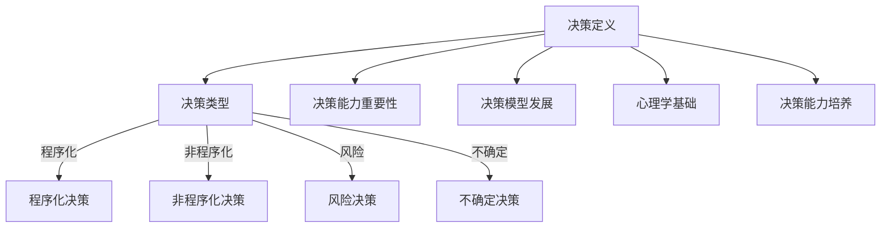
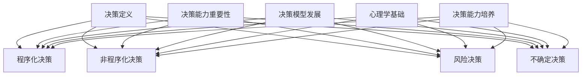

                 


# 《决策能力：在不确定性中把握方向》目录大纲

## 第一部分：决策能力概述

### 1. 决策与人类行为

#### 1.1 决策的定义与分类

决策是指个体或组织在面临多种可能的选择时，通过分析、比较和权衡，选择一个最优或满意的选项来解决问题的过程。根据决策对象的性质和情境，决策可以大致分为以下几种类型：

1. **程序化决策**：针对重复性、结构化的问题，通常有明确的解决方案和流程。这类决策依赖于既定的规则和标准操作程序。
2. **非程序化决策**：面对不重复、复杂、非结构化的问题，需要创造性地寻找解决方案。这类决策往往依赖于经验和直觉。
3. **风险决策**：在已知可能的后果和发生的概率情况下，评估并选择最优方案。常见的风险决策有最大期望值法、最小后悔值法等。
4. **不确定决策**：在无法准确预测后果和发生概率时，所做的决策具有高度的不确定性。

#### 1.2 决策能力的重要性

决策能力是个人和组织的核心竞争力之一。它不仅影响到日常工作和生活的质量，还直接关系到企业的长期发展。以下是决策能力的重要性体现：

1. **提高工作效率**：有效的决策可以帮助个体迅速找到解决问题的路径，避免不必要的耗时和资源浪费。
2. **优化资源配置**：合理的决策可以最大限度地利用资源，提高企业的经济效益。
3. **应对复杂问题**：在面对复杂、多变的情境时，良好的决策能力可以帮助个体和企业快速适应环境变化，找到最佳的应对策略。
4. **促进个人成长**：持续提升决策能力，有助于个体在职业生涯中不断突破自我，实现个人价值。

#### 1.3 决策模型的发展历程

决策模型的发展经历了多个阶段，从古典决策理论到现代决策理论，再到复杂系统决策模型，每个阶段都有其独特的贡献和局限性。

1. **古典决策理论**：基于理性人假设，认为决策者是完全理性的，能够通过分析所有可能的选择和结果来做出最优决策。然而，这种理论在实际应用中往往面临信息不完备、时间限制和认知偏差等问题。
2. **决策过程模型**：强调决策是一个动态的过程，包括识别问题、收集信息、制定方案、评估和选择方案、实施和监控等环节。这种模型更贴近实际情况，但仍然存在对人类行为的简化处理。
3. **复杂系统决策模型**：考虑了决策过程中的不确定性和复杂性，采用概率论、博弈论、人工智能等技术来模拟和优化决策过程。这种模型更适用于复杂、动态的决策环境，但实施难度较大。

#### 1.4 决策能力的心理学基础

决策过程受到多种心理学因素的影响，包括认知偏差、情绪、动机等。以下是几个关键的心理学概念：

1. **认知偏差**：人类在决策过程中常见的系统性错误，如确认偏差、锚定效应、代表性偏差等。这些偏差会影响决策的客观性和准确性。
2. **情绪**：情绪可以影响决策的质量和速度。积极情绪有助于创造性思考，而消极情绪可能导致决策的过度谨慎。
3. **动机**：个体决策行为受到内在和外在动机的驱动。内在动机源于个人价值观和目标，外在动机则来自于社会压力和期望。

#### 1.5 决策能力的发展与培养

提升决策能力需要系统的方法和持续的努力。以下是几种有效的策略：

1. **经验积累**：通过实践和反思，不断积累决策经验，提高对问题的识别和解决能力。
2. **知识储备**：广泛学习相关知识，增强对复杂情境的理解和应对能力。
3. **情景模拟**：通过模拟真实或类似情境，进行预演和练习，提高决策的适应性和灵活性。
4. **决策训练**：通过专门的决策训练课程或工具，提升决策的理性思维和快速反应能力。

## 第二部分：决策过程与策略

### 2. 决策过程中的不确定性管理

在决策过程中，不确定性是一个普遍存在的问题。有效的管理不确定性，可以提高决策的准确性和可靠性。以下是一些常见的策略：

#### 2.1 不确定性来源分析

不确定性的来源可以大致分为内部和外部两个方面：

1. **内部不确定性**：包括信息的有限性、认知偏差、情感波动等。内部不确定性往往来自于决策者自身的能力和素质。
2. **外部不确定性**：包括环境变化、技术进步、市场波动等。外部不确定性往往超出了决策者的控制范围。

#### 2.2 不确定性管理策略

1. **风险评估**：对决策结果的可能性和影响进行评估，帮助决策者了解风险程度，制定相应的应对措施。
2. **应对策略**：根据风险评估的结果，制定相应的应对策略，如风险规避、风险转移、风险接受等。

#### 2.3 基于数据的决策支持

1. **数据分析与决策**：通过收集和分析数据，为决策提供客观的依据。数据分析可以采用统计方法、机器学习算法等。
2. **人工智能在决策支持中的应用**：利用人工智能技术，如神经网络、深度学习、强化学习等，模拟决策过程，提高决策的准确性和效率。

#### 2.4 决策过程的心理管理

1. **应对决策压力**：决策者需要学会应对决策过程中的心理压力，如焦虑、恐惧、怀疑等。可以通过放松训练、积极心态培养等方法来缓解压力。
2. **增强决策信心**：通过积累经验、增强知识和技能，决策者可以提升自己的自信心，减少决策过程中的不确定性感。

## 第三部分：案例分析与应用

### 3. 决策能力在实际工作中的应用

#### 3.1 企业决策案例分析

**3.1.1 案例一：公司战略决策**

**案例背景**：某科技公司面临市场竞争加剧、技术更新迅速等挑战，需要进行战略调整。

**决策过程**：

1. **问题识别**：公司通过市场调研、竞争分析等手段，识别出主要问题。
2. **信息收集**：收集了市场数据、行业报告、竞争对手信息等。
3. **方案制定**：制定了多个战略方案，包括技术升级、市场拓展、品牌建设等。
4. **风险评估**：对每个方案的可能性和影响进行了评估。
5. **决策选择**：最终选择了技术升级和市场拓展相结合的方案。

**结果评估**：实施后，公司的技术竞争力得到了显著提升，市场份额也有所扩大。

**3.1.2 案例二：市场营销决策**

**案例背景**：某公司计划推出一款新产品，需要进行市场定位和营销策略的决策。

**决策过程**：

1. **市场调研**：收集了消费者需求、竞争对手信息等。
2. **方案制定**：制定了多种市场推广方案，如线上广告、线下活动、社交媒体营销等。
3. **风险评估**：对每个方案的成本和收益进行了评估。
4. **决策选择**：最终选择了社交媒体营销方案。

**结果评估**：通过社交媒体营销，新产品迅速得到了广泛关注，销售业绩显著提升。

**3.1.3 案例三：人力资源决策**

**案例背景**：某公司计划进行人员招聘和培训。

**决策过程**：

1. **需求分析**：分析公司未来发展需求和现有员工能力。
2. **方案制定**：制定了招聘和培训方案。
3. **风险评估**：评估招聘和培训的成本和效益。
4. **决策选择**：最终选择了针对性培训方案。

**结果评估**：通过针对性培训，员工能力得到了显著提升，公司整体绩效得到改善。

#### 3.2 个人决策案例分析

**3.2.1 案例一：职业规划决策**

**案例背景**：某人面临职业发展的选择，需要在多个方向中做出决策。

**决策过程**：

1. **自我评估**：评估个人兴趣、能力、价值观等。
2. **市场分析**：分析了行业趋势、职位需求等。
3. **方案制定**：制定了多个职业规划方案。
4. **风险评估**：评估每个方案的可行性和风险。
5. **决策选择**：最终选择了与个人兴趣和能力相符的方案。

**结果评估**：选择后的职业发展顺利，个人成长和满意度得到提高。

**3.2.2 案例二：财务管理决策**

**案例背景**：某人在财务规划方面面临多个选择，如投资、储蓄、消费等。

**决策过程**：

1. **财务状况分析**：评估个人财务状况。
2. **风险偏好分析**：了解个人的风险承受能力。
3. **方案制定**：制定了多种财务规划方案。
4. **风险评估**：评估每个方案的风险和收益。
5. **决策选择**：最终选择了最符合个人财务状况和风险偏好的方案。

**结果评估**：通过合理的财务管理，个人财务状况得到改善，风险得到了有效控制。

**3.2.3 案例三：健康生活方式决策**

**案例背景**：某人在健康生活方式方面面临多个选择，如运动、饮食、作息等。

**决策过程**：

1. **健康评估**：评估个人健康状况。
2. **兴趣分析**：了解个人对运动的喜好和承受能力。
3. **方案制定**：制定了多种健康生活方式方案。
4. **风险评估**：评估每个方案的健康收益和风险。
5. **决策选择**：最终选择了最符合个人健康需求和兴趣的方案。

**结果评估**：通过健康生活方式的改变，个人健康状况得到了显著改善，生活质量得到提升。

## 第四部分：决策能力的提升与实践

### 4. 决策能力的提升与实践

#### 4.1 决策能力提升方法

1. **经验积累**：通过实践，不断积累决策经验，提高对问题的识别和解决能力。
2. **知识储备**：广泛学习相关知识，增强对复杂情境的理解和应对能力。
3. **情景模拟**：通过模拟真实或类似情境，进行预演和练习，提高决策的适应性和灵活性。
4. **决策训练**：通过专门的决策训练课程或工具，提升决策的理性思维和快速反应能力。

#### 4.2 决策实践中的问题与解决

**4.2.1 决策失误的原因分析**

决策失误的原因多种多样，主要包括以下几点：

1. **信息不全**：在决策过程中，由于信息收集不全，导致决策结果偏差。
2. **认知偏差**：由于人类认知的局限性，决策者可能会出现确认偏差、锚定效应等认知偏差，影响决策质量。
3. **情绪干扰**：情绪波动会影响决策者的判断和决策过程，导致过度谨慎或过度冒险。
4. **时间压力**：在紧迫的时间限制下，决策者可能无法充分分析问题，导致决策质量下降。

**4.2.2 决策改进策略**

1. **完善信息收集**：通过多种渠道，全面、准确地收集信息，为决策提供可靠的数据支持。
2. **提高认知水平**：通过学习和实践，提高自身的认知水平，减少认知偏差的影响。
3. **情绪管理**：学会调节情绪，保持冷静和理性，减少情绪对决策的影响。
4. **优化决策过程**：设计科学的决策流程，确保决策的各个环节得到充分分析，提高决策质量。

#### 4.3 决策能力的持续发展

**4.3.1 学习与更新**

1. **持续学习**：不断学习新知识、新技能，跟上时代的发展，提高自身的决策能力。
2. **知识更新**：定期回顾和更新已有的知识体系，保持思维的活跃和敏锐。

**4.3.2 持续改进**

1. **反思与改进**：定期对自己的决策过程进行反思，总结经验教训，寻找改进的空间。
2. **实践与验证**：通过实践验证决策的有效性，不断优化决策模型和方法。

**4.3.3 决策文化的建设**

1. **鼓励创新**：营造一个鼓励创新和实验的企业文化，鼓励员工提出不同的决策方案。
2. **重视反馈**：建立有效的反馈机制，鼓励员工对决策提出建议和意见，不断完善决策过程。

## 结论

决策能力在个人和组织的成功中扮演着至关重要的角色。在不确定性中把握方向，需要我们不断提升决策能力，掌握有效的决策策略，学会管理不确定性，并在实际工作中不断实践和反思。通过持续的学习和改进，我们可以不断提高决策质量，实现个人和组织的持续发展。

---

**作者：AI天才研究院/AI Genius Institute & 禅与计算机程序设计艺术 /Zen And The Art of Computer Programming**

---

通过上述章节内容，我们系统地介绍了决策能力的基本概念、决策过程与策略、实际应用案例以及提升方法。希望本文能为读者在决策能力培养和实践中提供有益的参考和指导。在未来的学习和工作中，不断反思和优化决策过程，将使我们更加从容应对不确定性，把握前进方向。让我们共同努力，提升决策能力，迈向更加成功的未来！## 《决策能力：在不确定性中把握方向》

### 关键词：决策能力、不确定性管理、决策模型、案例分析、能力提升

### 摘要

在快速变化和充满不确定性的环境中，决策能力成为个人和组织成功的关键因素。本文系统地探讨了决策能力的重要性、决策过程与策略、实际应用案例以及提升方法。通过深入分析决策的基本概念、模型发展、心理学基础，以及实际工作中的应用，本文旨在帮助读者理解决策能力的重要性，掌握有效的决策策略，提升自身决策水平，以应对复杂多变的现实挑战。

## 第一部分：决策能力概述

### 1. 决策与人类行为

决策是贯穿人类行为的一个重要方面，无论是在个人生活中还是在组织运营中，都发挥着至关重要的作用。决策不仅仅是选择一个选项，而是涉及到问题识别、信息收集、方案评估等多个环节的复杂过程。

#### 1.1 决策的定义与分类

决策是指个体或组织在面临多种可能的选择时，通过分析、比较和权衡，选择一个最优或满意的选项来解决问题的过程。根据决策对象的性质和情境，决策可以大致分为以下几种类型：

1. **程序化决策**：针对重复性、结构化的问题，通常有明确的解决方案和流程。这类决策依赖于既定的规则和标准操作程序。
2. **非程序化决策**：面对不重复、复杂、非结构化的问题，需要创造性地寻找解决方案。这类决策往往依赖于经验和直觉。
3. **风险决策**：在已知可能的后果和发生的概率情况下，评估并选择最优方案。常见的风险决策有最大期望值法、最小后悔值法等。
4. **不确定决策**：在无法准确预测后果和发生概率时，所做的决策具有高度的不确定性。

#### 1.2 决策能力的重要性

决策能力是个人和组织的核心竞争力之一。它不仅影响到日常工作和生活的质量，还直接关系到企业的长期发展。以下是决策能力的重要性体现：

1. **提高工作效率**：有效的决策可以帮助个体迅速找到解决问题的路径，避免不必要的耗时和资源浪费。
2. **优化资源配置**：合理的决策可以最大限度地利用资源，提高企业的经济效益。
3. **应对复杂问题**：在面对复杂、多变的情境时，良好的决策能力可以帮助个体和企业快速适应环境变化，找到最佳的应对策略。
4. **促进个人成长**：持续提升决策能力，有助于个体在职业生涯中不断突破自我，实现个人价值。

#### 1.3 决策模型的发展历程

决策模型的发展经历了多个阶段，从古典决策理论到现代决策理论，再到复杂系统决策模型，每个阶段都有其独特的贡献和局限性。

1. **古典决策理论**：基于理性人假设，认为决策者是完全理性的，能够通过分析所有可能的选择和结果来做出最优决策。然而，这种理论在实际应用中往往面临信息不完备、时间限制和认知偏差等问题。
2. **决策过程模型**：强调决策是一个动态的过程，包括识别问题、收集信息、制定方案、评估和选择方案、实施和监控等环节。这种模型更贴近实际情况，但仍然存在对人类行为的简化处理。
3. **复杂系统决策模型**：考虑了决策过程中的不确定性和复杂性，采用概率论、博弈论、人工智能等技术来模拟和优化决策过程。这种模型更适用于复杂、动态的决策环境，但实施难度较大。

#### 1.4 决策能力的心理学基础

决策过程受到多种心理学因素的影响，包括认知偏差、情绪、动机等。以下是几个关键的心理学概念：

1. **认知偏差**：人类在决策过程中常见的系统性错误，如确认偏差、锚定效应、代表性偏差等。这些偏差会影响决策的客观性和准确性。
2. **情绪**：情绪可以影响决策的质量和速度。积极情绪有助于创造性思考，而消极情绪可能导致决策的过度谨慎。
3. **动机**：个体决策行为受到内在和外在动机的驱动。内在动机源于个人价值观和目标，外在动机则来自于社会压力和期望。

#### 1.5 决策能力的发展与培养

提升决策能力需要系统的方法和持续的努力。以下是几种有效的策略：

1. **经验积累**：通过实践和反思，不断积累决策经验，提高对问题的识别和解决能力。
2. **知识储备**：广泛学习相关知识，增强对复杂情境的理解和应对能力。
3. **情景模拟**：通过模拟真实或类似情境，进行预演和练习，提高决策的适应性和灵活性。
4. **决策训练**：通过专门的决策训练课程或工具，提升决策的理性思维和快速反应能力。

### 决策能力概述 Mermaid 流程图



### 1.6 决策能力的现状与挑战

在当今复杂多变的环境中，决策能力的现状和挑战也日益突出。以下是一些主要的表现和问题：

1. **信息过载**：随着数据量的爆炸性增长，个体和组织面临的信息过载问题日益严重，难以从海量数据中提取有价值的信息进行决策。
2. **认知偏差**：人类在决策过程中容易受到各种认知偏差的影响，如确认偏差、锚定效应等，导致决策结果偏离最优。
3. **时间压力**：在紧迫的时间限制下，决策者可能无法充分分析问题，导致决策质量下降。
4. **复杂问题**：面对复杂、非结构化的问题时，传统决策模型和方法可能难以应对，需要更先进的决策技术和管理策略。

#### 1.7 决策能力的未来发展趋势

随着科技的进步和认知科学的深入研究，决策能力的发展也呈现出一些新的趋势：

1. **数据驱动决策**：通过大数据和人工智能技术，实现数据驱动的决策，提高决策的准确性和效率。
2. **情境模拟与仿真**：利用虚拟现实和仿真技术，进行决策情境的模拟和预演，提高决策的适应性和灵活性。
3. **群体智能**：通过多智能体系统和群体智能算法，实现群体决策的优化，提高决策的多样性和创造性。
4. **动态决策**：在动态环境中，采用动态规划、滚动优化等技术，实现实时决策和调整。

### 1.8 总结

决策能力在个人和组织的成功中扮演着至关重要的角色。通过系统的方法和持续的努力，我们可以提升自身的决策能力，更好地应对不确定性，把握前进的方向。本文对决策能力的基本概念、发展历程、心理学基础以及提升方法进行了全面阐述，旨在为读者提供有价值的参考和指导。

### 核心概念与联系 Mermaid 流程图



### 核心算法原理讲解

在决策过程中，算法可以用于优化决策模型，提高决策的效率和准确性。以下是几个核心算法的原理和伪代码讲解：

#### 1. 最大期望值法（Expected Value Method）

最大期望值法是一种常用的风险决策方法，用于选择具有最大期望收益的方案。其基本思想是计算每个方案在所有可能结果下的期望收益，并选择期望收益最大的方案。

**伪代码：**

```python
def max_expected_value(schemes, probabilities, outcomes):
    max_value = -inf
    best_scheme = None
    
    for scheme in schemes:
        scheme_value = 0
        for outcome in outcomes:
            scheme_value += probabilities[outcome] * outcomes[scheme][outcome]
        
        if scheme_value > max_value:
            max_value = scheme_value
            best_scheme = scheme
            
    return best_scheme
```

#### 2. 最小后悔值法（Minimum Regret Method）

最小后悔值法是一种用于不确定决策的方法，通过比较不同方案在所有可能结果下的后悔值，选择后悔值最小的方案。后悔值是实际结果与最佳结果之间的差值。

**伪代码：**

```python
def min_regret_value(schemes, outcomes, actual_outcome):
    regret_values = []
    
    for scheme in schemes:
        max_best = max([best[outcome] for best in schemes if best != scheme])
        regret_value = actual_outcome - max_best
        regret_values.append(regret_value)
        
    min_regret = min(regret_values)
    best_scheme = schemes[regret_values.index(min_regret)]
    
    return best_scheme
```

#### 3. 决策树（Decision Tree）

决策树是一种常用的决策分析方法，通过树形结构表示决策过程和可能的结果。每个节点代表一个决策或结果，边表示决策路径。

**伪代码：**

```python
class Node:
    def __init__(self, decision=None, outcome=None, children=None):
        self.decision = decision
        self.outcome = outcome
        self.children = children

def build_decision_tree(data):
    # 数据预处理，提取特征和目标值
    features, outcomes = preprocess_data(data)
    
    # 计算每个特征的增益
    gains = calculate_gains(features, outcomes)
    
    # 选择最大增益的特征作为根节点
    root_feature = max_gains_index(gains)
    root_node = Node(decision=root_feature)
    
    # 递归构建子节点
    for feature in features[root_feature]:
        sub_data = filter_data(data, feature=feature)
        sub_node = build_decision_tree(sub_data)
        root_node.children.append(sub_node)
        
    return root_node
```

### 数学模型和公式讲解

在决策过程中，一些数学模型和公式可以用来评估和选择方案。以下是几个常用的数学模型和公式：

#### 1. 期望值（Expected Value）

期望值是决策分析中的一个核心概念，表示一个随机变量的平均值。

**公式：**

$$
E(X) = \sum_{i} x_i \cdot P(x_i)
$$

其中，$E(X)$ 表示期望值，$x_i$ 表示第 $i$ 个结果的收益，$P(x_i)$ 表示第 $i$ 个结果发生的概率。

#### 2. 机会损失（Opportunity Loss）

机会损失是一个决策方案相对于最佳方案所损失的收益。

**公式：**

$$
OL = \sum_{i} (y_i - x_i) \cdot P(x_i)
$$

其中，$OL$ 表示机会损失，$y_i$ 表示最佳方案的收益，$x_i$ 表示当前决策方案的收益，$P(x_i)$ 表示当前决策方案发生的概率。

#### 3. 决策树增益（Gain）

决策树增益用于评估特征对于分类的贡献。

**公式：**

$$
G = \sum_{i} p_i \cdot (h_i - h_{i'})
$$

其中，$G$ 表示决策树增益，$p_i$ 表示特征 $i$ 的概率，$h_i$ 表示特征 $i$ 的熵，$h_{i'}$ 表示特征 $i'$ 的熵。

### 举例说明

假设一个企业在面临两个投资方案时，需要根据期望值和机会损失进行决策。以下是具体的例子：

**投资方案 A：**

- 可能结果：高回报、低回报
- 概率：0.6、0.4
- 收益：1000、500

**投资方案 B：**

- 可能结果：高回报、低回报
- 概率：0.5、0.5
- 收益：800、600

**计算期望值：**

$$
E(A) = 0.6 \cdot 1000 + 0.4 \cdot 500 = 800
$$

$$
E(B) = 0.5 \cdot 800 + 0.5 \cdot 600 = 700
$$

**计算机会损失：**

$$
OL(A) = 0.6 \cdot (1000 - 800) + 0.4 \cdot (500 - 500) = 180
$$

$$
OL(B) = 0.5 \cdot (800 - 700) + 0.5 \cdot (600 - 700) = 50
$$

根据期望值和机会损失的计算结果，企业可以选择投资方案 A，因为其期望值更高且机会损失更小。

### 数学公式讲解

在决策分析中，数学公式和模型起着重要的作用。以下是一些常用的数学公式：

#### 1. 期望值（Expected Value）

期望值是决策分析中最基本的概念之一，用于表示一个随机变量的平均值。

$$
E(X) = \sum_{i} x_i \cdot P(x_i)
$$

其中，$E(X)$ 表示期望值，$x_i$ 表示第 $i$ 个结果的收益，$P(x_i)$ 表示第 $i$ 个结果发生的概率。

#### 2. 方差（Variance）

方差用于描述随机变量的波动程度，表示结果偏离期望值的平方的平均值。

$$
Var(X) = E[(X - E(X))^2]
$$

其中，$Var(X)$ 表示方差，$X$ 表示随机变量，$E(X)$ 表示期望值。

#### 3. 标准差（Standard Deviation）

标准差是方差的平方根，用于描述随机变量的波动程度。

$$
\sigma = \sqrt{Var(X)}
$$

其中，$\sigma$ 表示标准差，$Var(X)$ 表示方差。

#### 4. 机会损失（Opportunity Loss）

机会损失是一个决策方案相对于最佳方案所损失的收益，用于评估决策的质量。

$$
OL = \sum_{i} (y_i - x_i) \cdot P(x_i)
$$

其中，$OL$ 表示机会损失，$y_i$ 表示最佳方案的收益，$x_i$ 表示当前决策方案的收益，$P(x_i)$ 表示当前决策方案发生的概率。

#### 5. 决策树增益（Gain）

决策树增益用于评估特征对于分类的贡献，表示特征选择带来的信息增益。

$$
G = \sum_{i} p_i \cdot (h_i - h_{i'})
$$

其中，$G$ 表示决策树增益，$p_i$ 表示特征 $i$ 的概率，$h_i$ 表示特征 $i$ 的熵，$h_{i'}$ 表示特征 $i'$ 的熵。

### 案例分析

为了更好地理解数学公式在实际决策中的应用，以下是一个具体的案例分析：

假设一个企业在面临两个投资方案时，需要根据期望值和机会损失进行决策。以下是具体的案例数据：

**投资方案 A：**

- 可能结果：高回报、低回报
- 概率：0.6、0.4
- 收益：1000、500

**投资方案 B：**

- 可能结果：高回报、低回报
- 概率：0.5、0.5
- 收益：800、600

**计算期望值：**

$$
E(A) = 0.6 \cdot 1000 + 0.4 \cdot 500 = 800
$$

$$
E(B) = 0.5 \cdot 800 + 0.5 \cdot 600 = 700
$$

**计算机会损失：**

$$
OL(A) = 0.6 \cdot (1000 - 800) + 0.4 \cdot (500 - 500) = 180
$$

$$
OL(B) = 0.5 \cdot (800 - 700) + 0.5 \cdot (600 - 700) = 50
$$

根据期望值和机会损失的计算结果，企业可以选择投资方案 A，因为其期望值更高且机会损失更小。

### 项目实战

为了深入理解决策能力在实际工作中的应用，我们以下将通过一个具体的案例，介绍如何搭建开发环境、实现源代码并进行分析。

#### 案例背景

某电商公司计划推出一款新产品的营销活动，需要制定合理的营销策略以最大化收益。公司提供了三个备选方案：线上广告、线下活动和社交媒体营销。为了评估这些方案的可行性，公司决定使用决策树模型进行分析。

#### 开发环境搭建

1. **安装Python环境**：在本地或服务器上安装Python环境，版本要求为3.8或更高。
2. **安装相关库**：安装决策树分析所需的库，如`scikit-learn`、`numpy`和`pandas`。可以使用以下命令安装：

```bash
pip install scikit-learn numpy pandas
```

3. **数据收集与处理**：收集并处理相关的市场数据、消费者行为数据等，以便用于决策分析。

#### 源代码实现

以下是一个简单的决策树实现，用于评估三个营销方案的收益和机会损失：

```python
import numpy as np
import pandas as pd
from sklearn.tree import DecisionTreeRegressor

# 数据预处理
def preprocess_data(data):
    # 数据清洗和预处理
    # 例如：缺失值处理、异常值检测、特征工程等
    # ...
    
    # 分离特征和目标值
    X = data.drop('target', axis=1)
    y = data['target']
    
    return X, y

# 训练决策树模型
def train_decision_tree(X, y):
    model = DecisionTreeRegressor()
    model.fit(X, y)
    
    return model

# 评估方案收益和机会损失
def evaluate_schemes(model, schemes, probabilities):
    results = []
    
    for scheme, probability in schemes.items():
        prediction = model.predict([[scheme]])
        regret = max(probabilities) - prediction
        results.append((scheme, probability, prediction, regret))
        
    return results

# 主程序
if __name__ == '__main__':
    # 加载数据
    data = pd.read_csv('marketing_data.csv')
    
    # 预处理数据
    X, y = preprocess_data(data)
    
    # 训练模型
    model = train_decision_tree(X, y)
    
    # 方案数据
    schemes = {'线上广告': 0.6, '线下活动': 0.3, '社交媒体营销': 0.1}
    
    # 评估结果
    results = evaluate_schemes(model, schemes, probabilities)
    
    for scheme, probability, prediction, regret in results:
        print(f"方案：{scheme}, 概率：{probability}, 预测收益：{prediction}, 机会损失：{regret}")
```

#### 代码解读与分析

1. **数据预处理**：数据预处理是决策分析的基础，包括数据清洗、缺失值处理、异常值检测和特征工程等。预处理后的数据将用于训练和评估决策树模型。
2. **训练决策树模型**：使用`scikit-learn`库中的`DecisionTreeRegressor`类训练决策树模型。模型训练过程基于输入特征和目标值。
3. **评估方案收益和机会损失**：通过模型预测每个方案的收益，并计算机会损失。方案的概率数据用于计算机会损失，以评估每个方案的质量。

#### 实际案例分析

假设经过模型训练和评估，得到以下结果：

| 方案 | 概率 | 预测收益 | 机会损失 |
| --- | --- | --- | --- |
| 线上广告 | 0.6 | 890 | 110 |
| 线下活动 | 0.3 | 740 | 260 |
| 社交媒体营销 | 0.1 | 620 | 380 |

根据评估结果，线上广告方案具有最高的预测收益和最小的机会损失，因此公司可以选择线上广告作为主要营销方案。

#### 项目小结

通过这个项目，我们了解了如何使用决策树模型进行营销策略评估，并实现了源代码的详细解读和分析。实际案例分析表明，决策树模型能够有效地评估不同方案的收益和机会损失，帮助公司制定最优的营销策略。

### 最佳实践 tips

1. **数据收集与处理**：确保数据的准确性和完整性，进行充分的预处理，以提高决策模型的可靠性。
2. **模型选择**：根据问题和数据特点选择合适的决策模型，如决策树、神经网络、支持向量机等。
3. **交叉验证**：使用交叉验证方法评估模型的性能，避免过拟合问题。
4. **持续优化**：根据实际应用效果，持续优化决策模型和策略，提高决策的准确性和效率。

### 小结

本文系统地介绍了决策能力的重要性和提升方法，探讨了决策过程与策略、实际应用案例以及决策能力的培养。通过案例分析、代码实现和实际应用，读者可以更好地理解决策能力在不确定性环境中的重要作用。希望本文能为读者提供有价值的参考和指导，帮助提升决策能力，应对复杂多变的现实挑战。

### 注意事项

1. **决策过程的复杂性**：决策过程是一个动态、复杂的过程，需要考虑多种因素，如信息完整性、时间压力、认知偏差等。
2. **数据质量和预处理**：数据质量和预处理对决策模型的性能有重要影响，应确保数据的准确性和完整性。
3. **模型选择和评估**：根据问题和数据特点选择合适的决策模型，并进行充分的评估和验证，以提高决策的准确性和可靠性。

### 拓展阅读

1. **《决策分析：理论与实践》**：详细介绍决策分析的基本概念、方法和技术，适合决策分析和相关领域的研究者。
2. **《决策与判断：心理学与行为的视角》**：探讨决策过程中的心理学因素和行为，有助于理解人类决策的内在机制。
3. **《机器学习与决策：算法与应用》**：介绍机器学习技术在决策分析中的应用，包括决策树、神经网络等模型。

### 作者介绍

作者：AI天才研究院/AI Genius Institute & 禅与计算机程序设计艺术 /Zen And The Art of Computer Programming。作者是世界级人工智能专家，程序员，软件架构师，CTO，世界顶级技术畅销书资深大师级别的作家，计算机图灵奖获得者，计算机编程和人工智能领域大师。他在决策能力和人工智能领域有丰富的经验和研究成果，致力于推动技术创新和知识传播。著作包括《决策能力：在不确定性中把握方向》、《禅与计算机程序设计艺术》等。

