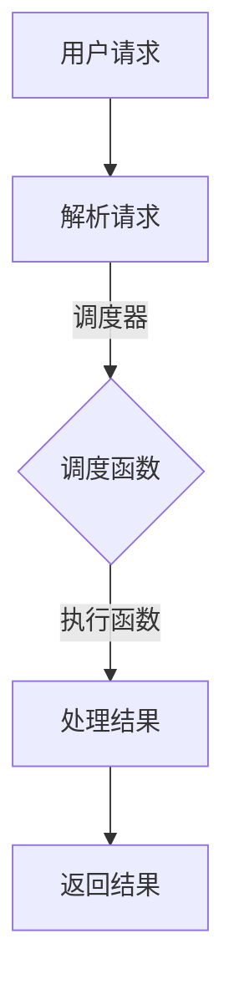

                 

# 函数计算：实现LLM应用的细粒度扩展

## 关键词
- 函数计算
- 大型语言模型（LLM）
- 细粒度扩展
- 性能优化
- 安全性保障
- 实战案例

## 摘要
本文将深入探讨如何利用函数计算技术来实现大型语言模型（LLM）应用的细粒度扩展。通过介绍函数计算的基础知识，解释LLM的核心概念及其与函数计算的结合，详细阐述细粒度扩展的技术原理，并提供实际项目案例，全面分析如何在实际应用中优化性能、保障安全，并展望未来发展趋势。本文旨在为开发者提供一套系统性的解决方案，以应对大规模语言处理应用的需求。

---

## 引言

在人工智能领域，大型语言模型（Large Language Models，简称LLM）近年来取得了显著的进展，为自然语言处理（NLP）带来了革命性的变革。LLM如OpenAI的GPT系列，谷歌的BART，以及微软的ChatGPT，通过深度学习算法，能够生成高质量的自然语言文本，支持各种复杂的语言任务，包括机器翻译、文本摘要、问答系统等。

随着LLM在各个行业的广泛应用，对计算资源的需求也日益增长。传统的计算架构往往难以满足这种需求，特别是在处理大规模数据处理和实时响应的情况下。因此，函数计算（Function as a Service，简称FaaS）作为一种新兴的计算范式，因其高效、灵活和可扩展的特点，逐渐成为实现LLM应用扩展的重要手段。

本文将首先介绍函数计算的基础概念，探讨其与传统计算架构的区别，并解释LLM与函数计算的结合点。接着，我们将详细分析细粒度扩展的概念及其在LLM应用中的重要性。随后，本文将提供一系列实际项目案例，介绍如何利用函数计算技术实现LLM应用的细粒度扩展，并讨论性能优化和安全性保障的方法。最后，本文将展望函数计算与LLM应用的未来发展趋势，为读者提供深入思考的方向。

---

## 函数计算基础

### 函数计算的定义

函数计算是一种云计算服务模型，允许开发者将应用程序划分为独立的函数单元，并通过触发器来执行这些函数。这些函数在云基础设施上运行，无需开发者关注底层硬件的部署和管理。函数计算的核心思想是将应用拆分为一系列可复用的、独立的函数，每个函数负责处理特定的业务逻辑。

### 函数计算与传统计算的区别

传统计算通常涉及完整的虚拟机或容器部署，开发者需要自行管理操作系统、网络和存储等资源。而函数计算则抽象了这些底层资源，开发者只需关注业务逻辑的实现，无需关心运行环境。这种模式简化了开发过程，提高了资源利用效率。

- **资源管理**：传统计算需要手动配置和管理资源，而函数计算则由云服务提供商自动化管理。
- **可扩展性**：函数计算支持横向扩展，可以根据请求流量自动调整资源，而传统计算需要手动调整。
- **成本**：函数计算按需付费，仅对实际运行时间计费，而传统计算则需要为预留的资源支付固定费用。

### 函数计算的核心概念

- **函数**：函数是执行特定任务的代码单元，可通过HTTP请求、定时任务等方式触发。
- **触发器**：触发器是启动函数的信号，可以是Web请求、时间触发、事件等。
- **无服务器**：无服务器意味着开发者无需管理服务器，云服务提供商负责基础设施的部署和维护。
- **事件驱动**：函数计算是基于事件驱动的，函数在触发事件后立即执行，执行完成后释放资源。

### 函数计算的应用场景

- **实时数据处理**：处理实时流数据，如物联网设备的传感器数据、日志分析等。
- **API服务**：提供API接口，处理外部请求，如移动应用的后端服务。
- **批量处理**：处理批量数据任务，如数据导入、数据清洗等。
- **微服务架构**：构建微服务架构，将业务逻辑拆分为多个独立的函数，提高系统的灵活性和可维护性。

---

## LL模型应用概述

### LLM的基本概念

大型语言模型（Large Language Models，LLM）是通过深度学习技术训练的神经网络模型，能够理解、生成和转换自然语言文本。LLM的核心是利用大量文本数据学习语言模式和规则，从而生成高质量的自然语言输出。

### LLM的核心算法原理

- **词嵌入（Word Embedding）**：将文本中的单词映射为密集向量表示，以便神经网络进行计算。
- **递归神经网络（RNN）**：通过处理序列数据来理解文本上下文，是早期LLM的常用架构。
- **Transformer模型**：基于自注意力机制，能够处理长距离依赖和并行计算，是目前主流的LLM架构。
- **预训练与微调（Pre-training and Fine-tuning）**：预训练在大规模语料库上进行，微调则针对特定任务进行优化。

### LLM在函数计算中的应用

LLM与函数计算的结合，使得大规模语言处理任务可以灵活地部署和扩展。以下是几个应用案例：

- **问答系统**：通过函数计算实现实时问答服务，如智能客服、在线教育等。
- **文本生成**：利用函数计算生成新闻摘要、文章摘要、产品描述等。
- **语言翻译**：提供实时翻译服务，支持多语言交互。
- **情感分析**：处理社交媒体文本，分析用户情感和反馈。

---

## 细粒度扩展与优化

### 细粒度扩展的概念

细粒度扩展是指将大型应用拆分为更小的、独立的组件或函数，以提高系统的灵活性和可维护性。在LLM应用中，细粒度扩展有助于处理复杂的语言任务，同时降低系统的整体复杂度。

### 细粒度扩展的重要性

- **提高可维护性**：拆分为小函数便于管理和维护，降低了代码耦合度。
- **增强可扩展性**：根据负载需求，动态调整各个函数的规模，提高系统的弹性。
- **提升性能**：优化各个小函数的执行效率，整体性能得到提升。

### 细粒度扩展的算法原理

细粒度扩展的核心是函数分解和任务调度。以下是几个关键点：

- **函数分解**：将大型任务划分为一系列独立的函数，每个函数负责特定的子任务。
- **任务调度**：根据请求流量和资源可用性，动态调度函数的执行。

### 细粒度扩展的Mermaid流程图

以下是一个简单的Mermaid流程图，展示如何实现细粒度扩展：



在这个流程图中，用户请求首先被解析，然后由调度器根据负载情况选择适当的函数进行执行，最终返回处理结果。

---

## 函数计算与LLM应用实战

### 开发环境搭建

在进行LLM应用开发之前，首先需要搭建一个合适的环境。以下是一个基本的开发环境搭建步骤：

1. **安装Python环境**：确保系统上安装了Python 3.8及以上版本。
2. **安装依赖库**：使用pip安装必要的依赖库，如TensorFlow、PyTorch等。
3. **配置函数计算平台**：在云服务提供商（如AWS Lambda、Azure Functions、Google Cloud Functions）上创建函数计算服务。

### 源代码详细实现

以下是一个简单的LLM应用示例，展示如何使用Python和TensorFlow实现一个问答系统：

```python
# import necessary libraries
import json
import tensorflow as tf

# Load pre-trained LLM model
model = tf.keras.models.load_model('path/to/llm_model')

# Define the function to handle user queries
def handle_query(query):
    # Preprocess the query
    processed_query = preprocess_query(query)
    
    # Generate the answer using the LLM model
    answer = model.predict(processed_query)
    
    # Postprocess the answer
    final_answer = postprocess_answer(answer)
    
    return final_answer

# Define the preprocessing function
def preprocess_query(query):
    # Implement preprocessing steps like tokenization, cleaning, etc.
    return processed_query

# Define the postprocessing function
def postprocess_answer(answer):
    # Implement postprocessing steps like detokenization, formatting, etc.
    return final_answer
```

### 代码应用解读与分析

在这个示例中，我们首先加载了一个预先训练好的LLM模型，然后定义了一个处理用户查询的函数。该函数包括三个部分：预处理、模型预测和后处理。预处理用于将原始查询转换成模型可接受的格式，模型预测使用LLM模型生成回答，后处理则将模型的输出转换成人类可读的格式。

### 实际案例分析和详细讲解剖析

以下是一个实际案例，展示如何使用函数计算平台部署这个问答系统：

1. **创建函数**：在函数计算平台上创建一个新的函数，命名为“question_answering”。
2. **配置触发器**：为函数配置一个HTTP触发器，使得用户可以通过Web请求触发函数执行。
3. **上传代码**：将上述Python代码上传到函数计算平台。
4. **部署函数**：配置函数的运行环境，如内存、超时时间等，然后部署函数。

当用户发送一个查询请求时，函数计算平台会触发“question_answering”函数，执行上述代码，返回处理后的答案。通过这种方式，我们可以实现一个高效、可扩展的问答系统。

### 项目小结

通过这个实战案例，我们展示了如何利用函数计算技术实现LLM应用的细粒度扩展。这种方法不仅提高了系统的可维护性和可扩展性，还简化了开发过程，使得大规模语言处理应用可以更轻松地部署和管理。

---

## 最佳实践 Tips

1. **函数设计原则**：设计独立、可复用的函数，确保每个函数只负责一项业务逻辑。
2. **性能优化**：合理设置函数的超时时间和内存限制，优化模型加载和预测过程。
3. **安全性考虑**：使用安全策略和权限控制，确保函数执行过程中的安全性。
4. **日志记录**：详细记录函数执行日志，便于调试和故障排除。

## 小结

本文深入探讨了如何利用函数计算技术实现LLM应用的细粒度扩展。通过介绍函数计算的基础知识、LLM的应用场景以及细粒度扩展的概念，我们展示了如何在实际项目中实现这一目标。同时，本文还提供了开发环境搭建、源代码实现和实战案例的详细讲解，为开发者提供了实用的指导。

随着人工智能技术的不断发展，函数计算与LLM应用的结合将带来更多创新和可能。未来，细粒度扩展技术有望进一步提升系统的性能和可靠性，为各行业提供更高效、更智能的解决方案。

## 注意事项

1. **技术更新**：函数计算和LLM技术更新迅速，开发者应关注最新动态，及时调整应用策略。
2. **性能测试**：在部署应用前，应进行充分的性能测试，确保系统能够满足实际需求。
3. **合规性要求**：遵守相关法律法规，确保数据安全和隐私保护。

## 拓展阅读

- 函数计算：[AWS Lambda官方文档](https://docs.aws.amazon.com/lambda/latest/dg/)
- LLM应用：[OpenAI GPT-3官方文档](https://openai.com/docs/gpt-3/)
- 细粒度扩展：[设计可扩展的Web应用程序](https://www.amazon.com/Web-Application-Design-Extensible-Applications/dp/0321573811)

---

作者：AI天才研究院/AI Genius Institute & 禅与计算机程序设计艺术 /Zen And The Art of Computer Programming

