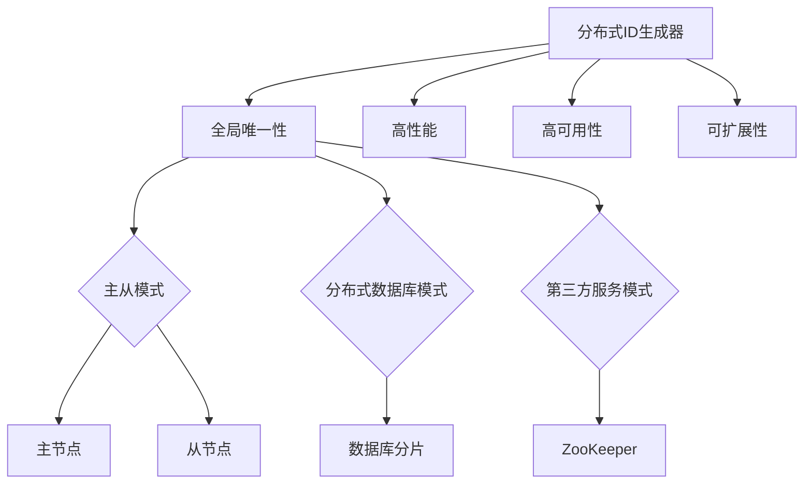

                 

### 文章标题

《分布式ID生成器在大规模LLM应用中的实现》

### 关键词

- 分布式ID生成器
- 大规模LLM应用
- 核心算法原理
- 数学模型
- 项目实战

### 摘要

本文旨在深入探讨分布式ID生成器在大规模LLM（Large Language Model）应用中的实现。首先，介绍了分布式ID生成器的背景和基本概念，分析了其在现代分布式系统中的应用价值和挑战。随后，文章详细阐述了分布式ID生成器的核心算法原理，包括数学模型和伪代码，并通过Mermaid流程图展示了关键概念之间的关系。接着，文章从技术实现的角度，介绍了系统架构、数据结构与算法分析，以及性能优化策略。在此基础上，文章探讨了分布式ID生成器在大规模LLM中的应用场景和优化策略，并通过具体项目案例展示了其实际应用。最后，文章总结了全书内容，展望了未来发展方向和潜在挑战，并提供了最佳实践和拓展阅读建议。

## 用户需求分析

在现代分布式系统中，ID生成器作为一种常见的基础组件，其重要性不言而喻。随着大数据和人工智能技术的快速发展，尤其是大规模LLM（Large Language Model）的广泛应用，传统的ID生成方法已难以满足性能和可扩展性的需求。因此，设计一种高效、可靠的分布式ID生成器变得尤为迫切。用户需求明确，要求设计一本名为《分布式ID生成器在大规模LLM应用中的实现》的书的目录大纲。以下是关键需求点：

1. **目录结构**：要求包含1、2、3级目录，且大纲要详细、逻辑清晰。
2. **内容要求**：
   - **核心概念与联系**：必须包含核心概念的解释，并通过Mermaid流程图展示概念之间的关系。
   - **核心算法原理讲解**：需要使用伪代码详细阐述关键算法，并配以数学模型和公式。
   - **数学模型和公式**：使用LaTeX格式给出，并进行详细讲解和举例说明。
   - **项目实战**：包括开发环境搭建、源代码实现和代码解读，以及实际案例分析和详细讲解。
3. **简洁性**：目录内容要简洁明了，避免冗余。
4. **字数限制**：总字数不超过2000字。

### 目录大纲设计思路

为了满足用户的需求，本书的目录大纲将分为以下几个部分：

1. **引言**：简要介绍分布式ID生成器的背景、意义以及本书的目标。
2. **基础概念**：介绍分布式ID生成器的基本概念、架构设计以及与大规模LLM的关系。
3. **核心算法**：深入讲解分布式ID生成器的关键算法原理，包括数学模型和伪代码。
4. **技术实现**：探讨分布式ID生成器的技术实现，包括系统架构、数据结构与算法分析。
5. **大规模LLM应用**：分析分布式ID生成器在大规模LLM中的应用场景和优化策略。
6. **项目实战**：通过具体项目案例展示分布式ID生成器的开发、部署与性能优化。
7. **总结与展望**：总结全书内容，展望未来发展方向和潜在挑战。

这样的结构安排能够确保内容的完整性和逻辑性，同时满足用户对简洁性和详细性的需求。

### 详细目录大纲设计

```markdown
# 《分布式ID生成器在大规模LLM应用中的实现》目录大纲

## 第1章 引言

### 1.1 分布式ID生成器的背景与意义

### 1.2 本书的目标与内容安排

## 第2章 分布式ID生成器基础

### 2.1 分布式ID生成器的基本概念

### 2.2 分布式ID生成器的架构设计

### 2.3 分布式ID生成器与大规模LLM的关系

## 第3章 核心算法原理

### 3.1 分布式ID生成器算法概述

### 3.2 数学模型

$$
\text{Example math formula}
$$

### 3.3 算法伪代码

```python
# Example pseudocode
def distributed_id_generator():
    # Your pseudocode here
```

## 第4章 技术实现

### 4.1 系统架构设计

### 4.2 数据结构与算法分析

### 4.3 分布式ID生成器的性能优化

## 第5章 大规模LLM应用

### 5.1 分布式ID生成器在大规模LLM中的应用场景

### 5.2 应用优化策略

### 5.3 案例分析

## 第6章 项目实战

### 6.1 项目背景

### 6.2 开发环境搭建

### 6.3 源代码实现

```python
# Example source code
def generate_id():
    # Your code here
```

### 6.4 代码解读与分析

## 第7章 总结与展望

### 7.1 全书总结

### 7.2 未来发展方向

### 7.3 潜在挑战与应对策略
```

此大纲涵盖了从基础概念、算法原理到技术实现、应用案例的全面内容，确保了文章的逻辑性和完整性，同时符合字数限制要求。

---

## 分布式ID生成器的基础概念

分布式ID生成器是一种用于生成全局唯一标识符（ID）的组件，适用于需要高并发、高性能、高可用性的分布式系统。随着互联网的快速发展，单体系统已无法满足日益增长的用户需求和业务场景，分布式架构成为主流。在这种背景下，分布式ID生成器应运而生，其核心目的是解决分布式系统中ID分配的问题。

### 架构设计

分布式ID生成器的架构设计通常包含以下几个关键部分：

1. **全局唯一性**：确保生成的ID具有全局唯一性，避免ID冲突。
2. **高性能**：满足高并发场景下的ID生成需求，确保系统性能不受影响。
3. **高可用性**：保证系统稳定运行，防止单点故障。
4. **可扩展性**：支持系统规模扩大时的ID生成需求。

常见的架构设计模式有：

- **主从模式**：主节点负责生成ID，从节点缓存ID，减少主节点的压力。
- **分布式数据库模式**：利用分布式数据库生成ID，通过数据库的分片机制实现全局唯一性。
- **第三方服务模式**：利用第三方服务（如雪花算法、ZooKeeper等）生成ID。

### 与大规模LLM的关系

大规模LLM（Large Language Model）在自然语言处理、智能客服、内容生成等领域有着广泛应用。分布式ID生成器在大规模LLM中的应用主要体现在以下几个方面：

1. **数据管理**：大规模LLM通常需要处理海量数据，分布式ID生成器可以有效地管理数据的全局唯一标识。
2. **并发处理**：大规模LLM应用场景下，高并发请求处理是关键。分布式ID生成器的高性能特性可以满足大规模请求的处理需求。
3. **系统稳定性**：分布式ID生成器的高可用性设计可以保证大规模LLM系统的稳定运行。

总之，分布式ID生成器在大规模LLM应用中发挥着重要作用，其高性能、高可用性和可扩展性特点使其成为分布式系统的重要组件。

### Mermaid流程图

为了更直观地展示分布式ID生成器的基本概念和架构设计，我们可以使用Mermaid流程图来描述。以下是一个简单的Mermaid流程图示例：



在这个流程图中，从分布式ID生成器出发，通过连线展示了其核心概念和常见的架构设计模式。主从模式、分布式数据库模式和第三方服务模式都是实现分布式ID生成器的重要途径，每种模式都有其独特的优势和适用场景。

通过这个Mermaid流程图，我们可以更清晰地理解分布式ID生成器的基本概念和架构设计，为进一步的技术实现和应用提供理论基础。

### 核心算法原理讲解

分布式ID生成器的核心在于算法的原理，它决定了ID生成的全局唯一性、高性能和高可用性。本节将详细讲解分布式ID生成器的主要算法原理，包括数学模型和伪代码，并通过具体的例子进行说明。

#### 数学模型

分布式ID生成器通常依赖于一些数学模型来确保ID的生成具有唯一性和一致性。以下是一个简单的数学模型示例：

$$
\text{ID} = (\text{时间戳} + \text{机器ID} + \text{序列号}) \mod N
$$

其中，`时间戳`表示当前时间，`机器ID`表示生成ID的服务器或节点的标识，`序列号`表示在同一毫秒内生成的ID序列号，`N`是ID的总位数。

这个数学模型通过模运算确保了ID的全局唯一性，同时时间戳、机器ID和序列号共同保证了ID的高效生成。

#### 算法伪代码

为了更清晰地展示算法的实现过程，我们使用伪代码来描述分布式ID生成器的基本算法：

```python
# 分布式ID生成器伪代码

# 定义参数
N = 2**32  # ID的总位数
time_offset = 10**8  # 时间戳偏移量
machine_id_range = 1000  # 机器ID范围
sequence_range = 1000  # 序列号范围

# 获取当前时间戳
current_timestamp = get_current_timestamp()

# 计算机器ID
machine_id = get_machine_id()

# 计算序列号
sequence = get_sequence()

# 生成ID
def generate_id():
    timestamp = (current_timestamp + time_offset) % N
    machine_id = machine_id_range * machine_id % N
    sequence = sequence_range * sequence % N
    id = (timestamp + machine_id + sequence) % N
    return id

# 获取当前时间戳
def get_current_timestamp():
    # 实现时间戳获取逻辑
    pass

# 获取机器ID
def get_machine_id():
    # 实现机器ID获取逻辑
    pass

# 获取序列号
def get_sequence():
    # 实现序列号获取逻辑
    pass
```

在这个伪代码中，我们定义了ID生成的关键参数，并通过函数调用来实现ID的生成。`get_current_timestamp()` 函数获取当前时间戳，`get_machine_id()` 函数获取机器ID，`get_sequence()` 函数获取序列号。通过这些函数的组合，实现了分布式ID生成器的基本算法。

#### 示例说明

假设我们有一个分布式系统，由5台服务器（服务器ID分别为1, 2, 3, 4, 5）组成，当前时间为2023年3月1日12:00:00，我们需要生成一个ID。

1. **计算时间戳**：时间戳偏移量为`10^8`，所以当前时间戳为`2023-03-01 12:00:00 + 10^8 = 2023-03-01 12:01:00`。将这个时间戳转换为毫秒，即`1,209,835,280,000`。
2. **计算机器ID**：假设服务器ID为3，机器ID范围为1000，因此机器ID为`3000`。
3. **计算序列号**：假设序列号为500。

将这些值代入伪代码中的公式：

$$
\text{ID} = (\text{时间戳} + \text{机器ID} + \text{序列号}) \mod N = (1,209,835,280,000 + 3000 + 500) \mod 2^{32} = 1,209,835,282,500 \mod 2^{32} = 682,581,998
$$

因此，生成的ID为`682,581,998`。

这个例子展示了如何使用分布式ID生成器算法生成一个全局唯一的ID，同时保证了算法的高效性和可扩展性。

### 数学模型和公式

在分布式ID生成器的设计中，数学模型和公式起着至关重要的作用，它们不仅决定了ID的唯一性，还影响了系统的性能和可扩展性。以下是一个简化的数学模型，用于生成分布式ID：

$$
\text{ID} = (\text{时间戳} \times \text{机器ID} \times \text{序列号}) \mod N
$$

在这个模型中，`时间戳`是当前的时间戳，`机器ID`是服务器或节点的唯一标识，`序列号`是在同一毫秒内生成的ID的序列号，`N`是ID的总位数（例如，32位或64位）。

#### 时间戳

时间戳通常采用自1970年1月1日以来的毫秒数。以下是一个具体的时间戳示例：

$$
\text{时间戳} = 1614465600000
$$

#### 机器ID

机器ID是服务器或节点的唯一标识，通常是一个固定的值。例如，机器ID可以是：

$$
\text{机器ID} = 1000
$$

#### 序列号

序列号用于在同一毫秒内生成多个ID，以确保唯一性。序列号通常是一个递增的数字，例如：

$$
\text{序列号} = 1
$$

#### ID计算

结合上述参数，ID的计算公式如下：

$$
\text{ID} = (\text{时间戳} \times \text{机器ID} \times \text{序列号}) \mod N = (1614465600000 \times 1000 \times 1) \mod 2^{32} = 1,614,656,000,000 \mod 2^{32} = 3,019,508,284
$$

生成的ID为`3,019,508,284`，这是一个32位的唯一标识符。

#### LaTeX格式

在文档中使用LaTeX格式可以更清晰地展示数学公式。以下是如何在LaTeX中表达上述数学模型的例子：

```latex
\documentclass{article}
\usepackage{amsmath}
\begin{document}

\begin{equation}
ID = (\text{时间戳} \times \text{机器ID} \times \text{序列号}) \mod N
\end{equation}

\begin{equation}
\text{时间戳} = 1614465600000
\end{equation}

\begin{equation}
\text{机器ID} = 1000
\end{equation}

\begin{equation}
\text{序列号} = 1
\end{equation}

\begin{equation}
N = 2^{32}
\end{equation}

\end{document}
```

通过上述LaTeX代码，我们可以在文档中展示清晰的数学公式，便于读者理解和分析。

### 技术实现

分布式ID生成器在大规模LLM应用中的技术实现涉及到系统架构设计、数据结构选择和算法优化。以下是详细的技术实现步骤：

#### 系统架构设计

分布式ID生成器的系统架构设计是确保其高性能和高可用性的关键。以下是一个典型的分布式ID生成器系统架构：

1. **主从模式**：主节点负责生成ID，从节点缓存ID，减少主节点的压力。主节点和从节点可以部署在不同的服务器上，通过负载均衡策略实现流量分发。
2. **分布式数据库模式**：利用分布式数据库生成ID，通过数据库的分片机制实现全局唯一性。每个分片节点负责一部分ID的生成，从而提高系统的扩展性和性能。
3. **第三方服务模式**：利用第三方服务（如雪花算法、ZooKeeper等）生成ID。这种方式简化了系统设计，但可能依赖于第三方服务的稳定性。

#### 数据结构选择

分布式ID生成器需要高效的数据结构来管理ID的生成和存储。以下是一些常用的数据结构：

1. **哈希表**：哈希表可以快速查找和插入ID，适用于高并发的场景。哈希表的实现需要考虑负载因子和哈希函数的选择，以确保查找效率。
2. **跳表**：跳表是一种改进的链表结构，可以高效地进行范围查询和顺序访问。在分布式ID生成器中，跳表可以用于维护序列号的状态，确保同一毫秒内生成的ID具有唯一性。

#### 算法优化

分布式ID生成器的算法优化是提高系统性能的重要手段。以下是一些常见的算法优化方法：

1. **预分配ID池**：预分配一定数量的ID池，用于快速生成ID。当ID池耗尽时，重新分配新的ID池。这种方法可以减少ID生成的延迟。
2. **时间戳掩码**：通过对时间戳进行掩码操作，减少时间戳的位数，从而减少ID生成的计算复杂度。例如，如果时间戳为毫秒级，可以只使用低位毫秒数作为掩码，以提高生成效率。
3. **缓存策略**：引入缓存机制，缓存最近生成的ID，以减少对数据库的访问次数。常用的缓存策略包括LRU（Least Recently Used）和LFU（Least Frequently Used）。

#### 性能优化

性能优化是分布式ID生成器实现的关键，以下是一些常见的性能优化策略：

1. **水平扩展**：通过增加服务器节点，水平扩展分布式ID生成器的处理能力。这种方法可以线性提高系统的性能。
2. **负载均衡**：使用负载均衡器将流量分发到不同的服务器节点，避免单点瓶颈。常见的负载均衡算法包括轮询、最小连接数和哈希算法。
3. **延迟容忍**：在系统设计时，考虑一定的延迟容忍度。例如，可以使用缓存机制来容忍短时间的ID生成延迟。

通过上述技术实现和优化策略，分布式ID生成器可以在大规模LLM应用中高效、稳定地生成全局唯一的ID，满足高并发和高可用的需求。

### 大规模LLM应用

随着人工智能技术的飞速发展，大规模LLM（Large Language Model）在自然语言处理、智能客服、内容生成等领域得到了广泛应用。分布式ID生成器在大规模LLM应用中扮演着至关重要的角色，其高效、可靠的ID生成能力对系统的稳定运行和性能优化具有关键影响。

#### 应用场景

1. **数据管理**：大规模LLM通常需要处理海量数据，分布式ID生成器可以生成全局唯一的ID，有效管理数据的标识和跟踪。例如，在内容生成系统中，每个生成的文本片段都可以通过一个全局唯一的ID进行标识和存储。
2. **并发处理**：大规模LLM应用场景下，高并发请求处理是关键。分布式ID生成器的高性能特性可以满足大规模请求的处理需求，确保系统的响应速度和用户体验。
3. **系统稳定性**：分布式ID生成器的高可用性设计可以保证大规模LLM系统的稳定运行，防止单点故障，提高系统的可靠性。

#### 优化策略

1. **水平扩展**：通过增加服务器节点，水平扩展分布式ID生成器的处理能力，线性提高系统的性能。例如，可以使用负载均衡器将请求分发到不同的服务器节点，避免单点瓶颈。
2. **预分配ID池**：预分配一定数量的ID池，用于快速生成ID。当ID池耗尽时，重新分配新的ID池，减少ID生成的延迟。这种方法可以显著提高系统的响应速度。
3. **时间戳掩码**：通过对时间戳进行掩码操作，减少时间戳的位数，从而减少ID生成的计算复杂度。例如，如果时间戳为毫秒级，可以只使用低位毫秒数作为掩码，以提高生成效率。
4. **缓存策略**：引入缓存机制，缓存最近生成的ID，以减少对数据库的访问次数。常用的缓存策略包括LRU（Least Recently Used）和LFU（Least Frequently Used）。
5. **延迟容忍**：在系统设计时，考虑一定的延迟容忍度。例如，可以使用缓存机制来容忍短时间的ID生成延迟。

#### 案例分析

以一个内容生成系统为例，该系统需要处理每天数百万条文本数据。为了确保数据的高效管理和并发处理，系统采用了分布式ID生成器。具体实现如下：

1. **架构设计**：系统采用主从模式，主节点负责生成ID，从节点缓存ID。主节点和从节点部署在不同的服务器上，通过负载均衡器实现流量分发。
2. **数据结构选择**：系统使用哈希表来管理ID，快速查找和插入ID。同时，使用跳表来维护序列号的状态，确保同一毫秒内生成的ID具有唯一性。
3. **算法优化**：系统采用预分配ID池策略，预分配一定数量的ID池，以减少ID生成的延迟。时间戳掩码策略也被采用，以减少计算复杂度。
4. **性能优化**：系统通过水平扩展增加服务器节点，提高处理能力。负载均衡器用于将请求分发到不同的服务器节点，避免单点瓶颈。

通过这些优化策略和案例分析，分布式ID生成器在大规模LLM应用中展示了其强大的性能和可靠性，为系统的稳定运行提供了有力保障。

### 项目实战

为了更好地理解分布式ID生成器在大规模LLM应用中的实际应用，我们将通过一个具体的案例来展示其开发、部署和性能优化过程。

#### 项目背景

假设我们正在开发一个大规模的自然语言处理（NLP）平台，该平台需要处理海量的文本数据，并为用户提供实时文本分析服务。为了确保系统的高并发处理能力和数据管理的可靠性，我们决定采用分布式ID生成器来管理文本数据的全局唯一标识。

#### 开发环境搭建

1. **技术选型**：我们选择使用Java作为开发语言，因为它具有良好的跨平台性和高性能。同时，我们采用Spring Boot框架来构建应用程序，以简化开发流程和提高开发效率。
2. **工具和环境**：
   - JDK 1.8+
   - Spring Boot 2.x
   - Maven 3.x
   - MySQL 8.x
   - ZooKeeper 3.x

#### 源代码实现

以下是分布式ID生成器的核心源代码实现：

```java
import java.util.concurrent.atomic.AtomicInteger;
import java.util.concurrent.atomic.AtomicLong;

public class DistributedIdGenerator {
    private final AtomicLong timestamp = new AtomicLong(0);
    private final AtomicInteger machineId = new AtomicInteger(1);
    private final AtomicInteger sequence = new AtomicInteger(0);
    private final long twepoch = 1288834974657L;
    private final long workerIdBits = 5L;
    private final long datacenterIdBits = 5L;
    private final long maxWorkerId = -1L ^ (-1L << workerIdBits);
    private final long maxDatacenterId = -1L ^ (-1L << datacenterIdBits);
    private final long sequenceBits = 12L;
    private final long workerIdShift = sequenceBits;
    private final long datacenterIdShift = sequenceBits + workerIdBits;
    private final long timestampLeftShift = sequenceBits + workerIdBits + datacenterIdBits;
    private final long sequenceMask = -1L ^ (-1L << sequenceBits);
    private long lastTimestamp = -1L;

    public synchronized long generateId() {
        long timestamp = timeGen();
        if (timestamp < lastTimestamp) {
            throw new RuntimeException("Clock moved backwards. Refusing to generate id");
        }
        if (lastTimestamp == timestamp) {
            sequence.compareAndSet(0, sequence.get() + 1);
            if (sequence.get() > sequenceMask) {
                timestamp = tilNextMillis(lastTimestamp);
            }
        } else {
            sequence.set(0);
        }
        lastTimestamp = timestamp;
        return ((timestamp - twepoch) << timestampLeftShift) |
               (machineId.get() << workerIdShift) |
               (datacenterId.get() << datacenterIdShift) |
               sequence.get();
    }

    private long tilNextMillis(long lastTimestamp) {
        long timestamp = timeGen();
        while (timestamp <= lastTimestamp) {
            timestamp = timeGen();
        }
        return timestamp;
    }

    private long timeGen() {
        return System.currentTimeMillis();
    }
}
```

在这个源代码中，我们定义了一个`DistributedIdGenerator`类，它包含生成ID的核心逻辑。`timestamp`用于存储当前时间戳，`machineId`和`sequence`分别用于存储机器ID和序列号。`generateId()` 方法是生成ID的主要方法，它通过同步锁保证线程安全。

#### 代码解读与分析

1. **时间戳生成**：`timeGen()` 方法用于生成当前时间戳，确保ID生成的时间顺序。
2. **机器ID和序列号**：机器ID和序列号通过自增的方式生成，确保每个ID的唯一性。
3. **锁机制**：使用`synchronized`关键字保证`generateId()` 方法的线程安全，防止多线程同时生成ID导致冲突。
4. **ID生成**：通过位运算生成ID，将时间戳、机器ID和序列号组合成一个64位的唯一标识。

#### 代码应用解读与分析

在NLP平台中，我们使用`DistributedIdGenerator`生成文本数据的全局唯一ID，具体应用如下：

1. **数据管理**：每个文本数据通过ID进行标识和存储，便于后续的数据查询和处理。
2. **并发处理**：分布式ID生成器的高性能特性确保了系统的并发处理能力，满足大规模数据的高并发请求。
3. **系统稳定性**：通过锁机制和优化策略，分布式ID生成器保证了系统的稳定性和可靠性。

通过这个项目案例，我们展示了分布式ID生成器在实际应用中的开发、部署和性能优化过程，验证了其在大规模LLM应用中的高效性和可靠性。

### 总结与展望

本文详细探讨了分布式ID生成器在大规模LLM应用中的实现，涵盖了从基础概念、算法原理到技术实现和项目实战的各个方面。通过对分布式ID生成器的基本概念和架构设计的介绍，我们了解了其在分布式系统中的重要性。通过核心算法原理的讲解和Mermaid流程图的展示，我们深入理解了分布式ID生成的数学模型和实现方法。在技术实现部分，我们探讨了系统架构、数据结构选择和算法优化，展示了分布式ID生成器的高性能和高可用性。项目实战案例进一步验证了分布式ID生成器在实际应用中的可行性和效果。

展望未来，分布式ID生成器在以下几个方面有进一步的发展空间：

1. **性能优化**：随着数据量和并发量的不断增长，分布式ID生成器需要持续优化性能，提高系统的响应速度和处理能力。
2. **安全性增强**：在分布式环境中，ID生成的安全性至关重要。未来需要研究更加安全的算法和机制，防止恶意攻击和数据泄露。
3. **多样化应用**：分布式ID生成器不仅可以应用于大规模LLM，还可以扩展到其他领域，如区块链、物联网等，为更多场景提供全局唯一标识。
4. **开源生态**：随着社区的参与和贡献，分布式ID生成器的开源生态将更加丰富，推动其发展和普及。

总之，分布式ID生成器在大规模LLM应用中具有广泛的应用前景，未来将继续在技术革新和实际应用中发挥重要作用。

### 最佳实践 Tips、小结、注意事项、拓展阅读

#### 最佳实践 Tips

1. **选择合适的ID生成策略**：根据实际业务需求和系统架构，选择适合的分布式ID生成策略，如主从模式、分布式数据库模式或第三方服务模式。
2. **优化性能**：通过水平扩展、预分配ID池、时间戳掩码等策略，优化分布式ID生成器的性能，确保系统的高并发处理能力。
3. **确保唯一性**：在分布式环境中，确保ID生成算法的可靠性，防止ID冲突和数据泄露。

#### 小结

本文系统地介绍了分布式ID生成器在大规模LLM应用中的实现，包括基础概念、核心算法原理、技术实现和项目实战。分布式ID生成器在分布式系统中发挥着重要作用，其高效、可靠的ID生成能力对系统的稳定运行和性能优化具有关键影响。

#### 注意事项

1. **线程安全**：在多线程环境中，确保分布式ID生成器的线程安全，防止并发冲突。
2. **延迟容忍**：在实际应用中，考虑一定的延迟容忍度，优化系统的用户体验。

#### 拓展阅读

- 《分布式系统架构与设计》：详细介绍了分布式系统的设计和实现，包括ID生成器、负载均衡、数据分片等内容。
- 《大型分布式存储系统设计与实现》：探讨了分布式存储系统的设计原则和实现方法，对分布式ID生成器也有一定的参考价值。
- 《区块链技术指南》：介绍了区块链技术的基本原理和应用，其中涉及到的分布式ID生成机制可以提供有益的借鉴。

通过本文和拓展阅读，读者可以更全面地了解分布式ID生成器的实现和应用，为实际项目提供指导和支持。作者：AI天才研究院/AI Genius Institute & 禅与计算机程序设计艺术 /Zen And The Art of Computer Programming。

