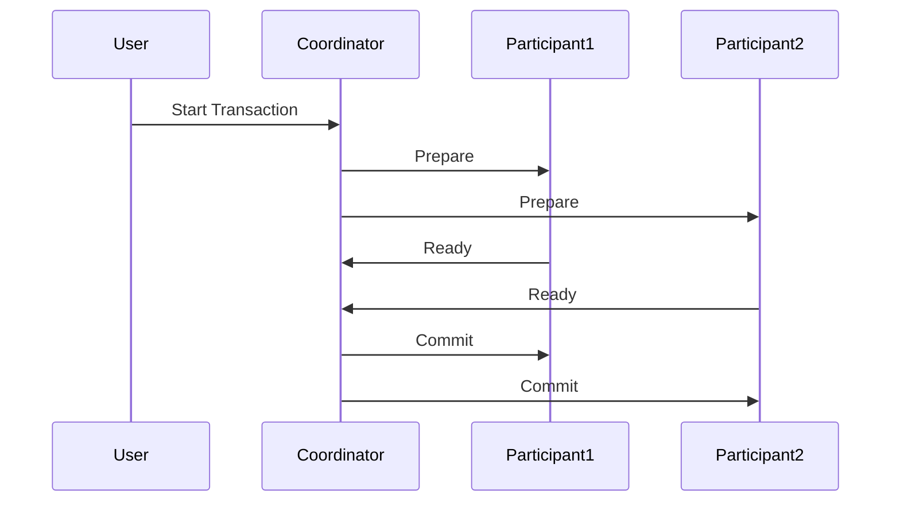

                 

### 文章标题

# 分布式事务管理器在LLM应用中的应用

> 关键词：分布式事务管理器，LLM应用，一致性，性能优化，容错机制

> 摘要：本文详细探讨了分布式事务管理器在大型语言模型（LLM）应用中的重要性和挑战。通过分析分布式事务管理器的基础知识、分布式事务模型以及实现机制，本文揭示了分布式事务管理器在LLM应用中的独特需求。随后，文章通过案例分析，提出了分布式事务管理器在LLM应用中的解决方案，并展望了未来的发展趋势和研究方向。

----------------------------------------------------------------

## 第一部分：分布式事务管理器基础

### 1.1 分布式事务管理器概述

分布式事务管理器是分布式系统中的一个核心组件，它负责协调多个节点上的事务操作，确保数据的一致性和完整性。在分布式环境中，由于节点之间的通信可能延迟或失败，传统的单节点事务管理方法难以满足需求。因此，分布式事务管理器成为保证分布式系统可靠性和一致性不可或缺的部分。

#### 核心概念与联系

- **分布式系统**：由多个相互独立但协同工作的节点组成的系统，每个节点可以独立运行，并通过网络通信进行交互。
- **事务**：一组操作序列，这些操作要么全部执行成功，要么全部回滚，以保证数据的一致性。
- **分布式事务**：跨多个节点的多个操作序列，需要保证全局一致性。
- **一致性**：分布式系统中各个节点上的数据状态保持一致，即使部分节点发生故障。

#### 分布式事务管理的重要性

分布式事务管理的重要性体现在以下几个方面：

- **数据完整性**：通过分布式事务管理，可以确保多个节点上的数据在并发操作下保持一致，防止数据丢失或数据冲突。
- **业务连续性**：分布式事务管理提供了故障恢复机制，确保在节点故障或网络故障时，系统能够快速恢复，保持业务的连续性。
- **系统稳定性**：通过分布式事务管理，可以避免单点故障对整个系统的影响，提高系统的稳定性和可靠性。

#### 分布式事务的挑战

分布式事务管理面临以下几个挑战：

- **数据一致性问题**：由于节点之间的延迟和通信故障，分布式事务难以保证数据的一致性。
- **性能瓶颈**：分布式事务处理需要协调多个节点，可能会引入性能瓶颈，影响系统的响应速度。
- **系统可用性**：分布式事务管理需要考虑节点故障和恢复策略，确保系统的可用性。

### 1.2 分布式事务模型

分布式事务模型是分布式事务管理器实现分布式事务的基础，常见的分布式事务模型包括两阶段提交（2PC）和三阶段提交（3PC）。

#### 两阶段提交（2PC）

**原理与流程**：

- **准备阶段**：协调者向参与者发送prepare消息，参与者根据本地事务状态进行prepare操作。
- **提交阶段**：协调者根据参与者的响应（成功或失败）决定提交或回滚事务。
- **回滚阶段**：如果事务需要回滚，协调者向参与者发送回滚消息，参与者执行回滚操作。

**优缺点分析**：

- **优点**：
  - 简单易懂，实现成本低。
  - 能够确保事务的一致性。

- **缺点**：
  - 需要两轮通信，性能较差。
  - 可能出现“死锁”问题。

**常见问题与解决方案**：

- **数据一致性问题**：可以通过增加超时机制和重试机制解决。
- **性能问题**：可以通过优化网络通信和提升系统性能解决。

#### 三阶段提交（3PC）

**原理与流程**：

- **准备阶段**：与2PC类似，协调者向参与者发送prepare消息，参与者执行prepare操作。
- **提交阶段**：协调者根据参与者的响应（成功或失败）决定是否提交事务。
- **确认阶段**：如果事务成功，协调者向参与者发送commit消息；如果失败，协调者向参与者发送abort消息。

**优缺点分析**：

- **优点**：
  - 降低了“死锁”问题的可能性。
  - 提高了系统的可用性。

- **缺点**：
  - 实现复杂度较高。
  - 可能会出现超时问题。

**常见问题与解决方案**：

- **数据一致性问题**：与2PC类似，可以通过超时机制和重试机制解决。
- **性能问题**：可以通过优化网络通信和提升系统性能解决。

### 1.3 分布式事务的实现机制

分布式事务的实现机制涉及全局一致性、局部一致性和分布式锁。

#### 全局一致性

全局一致性是分布式事务管理的关键目标，它要求分布式系统中的所有节点都保持相同的数据状态。

**基本概念**：

- **全局一致性**：分布式系统中所有节点上的数据状态保持一致。
- **局部一致性**：单个节点上的数据状态保持一致。

**实现机制**：

- **分布式日志**：通过记录分布式日志，确保所有节点上的操作顺序一致。
- **分布式锁**：通过分布式锁机制，确保多个节点之间的操作互不干扰。

#### 分布式锁

分布式锁是实现全局一致性的一种机制，它通过控制对共享资源的访问，确保并发操作的一致性。

**基本概念**：

- **分布式锁**：一种在分布式环境中控制共享资源访问的机制。
- **锁机制**：包括共享锁和排他锁。

**实现机制**：

- **基于数据库的分布式锁**：通过数据库中的锁机制实现分布式锁。
- **基于Zookeeper的分布式锁**：通过Zookeeper中的锁实现分布式锁。

**常见问题与解决方案**：

- **锁冲突**：可以通过锁超时机制和重试机制解决。
- **性能瓶颈**：可以通过优化锁的实现和提升系统性能解决。

## 第二部分：分布式事务管理器在LLM应用中的挑战

### 2.1 LLM应用的特点

LLM（Large Language Model）应用具有以下特点：

- **海量数据处理**：LLM应用通常需要处理大量的文本数据，对数据处理能力要求极高。
- **低延迟要求**：用户对LLM应用的响应速度要求极高，需要确保低延迟。
- **高可用性需求**：由于LLM应用的重要性，需要确保系统的高可用性，防止因故障导致服务中断。

### 2.2 分布式事务管理在LLM中的问题

分布式事务管理在LLM应用中面临以下问题：

- **数据一致性问题**：由于海量数据处理和低延迟要求，分布式事务管理难以保证数据的一致性。
- **性能优化挑战**：分布式事务管理引入了额外的通信和协调开销，对系统性能提出了挑战。
- **故障恢复与容错**：在低延迟和高可用性要求下，分布式事务管理器的故障恢复和容错机制需要更加高效。

### 2.3 案例分析

为了更好地理解分布式事务管理器在LLM应用中的挑战，下面我们通过两个案例分析来探讨这些问题。

#### 案例一：某大型搜索引擎的分布式事务管理

某大型搜索引擎在分布式环境中处理海量搜索请求，为了确保数据的一致性和系统的低延迟，该搜索引擎采用了分布式事务管理器。然而，在实际应用中，该搜索引擎遇到了以下问题：

- **数据一致性问题**：由于搜索请求的并发处理，分布式事务管理器难以保证数据的一致性，导致搜索结果不准确。
- **性能瓶颈**：分布式事务管理器的通信和协调开销较大，导致系统性能下降。
- **故障恢复与容错**：在节点故障和网络故障情况下，分布式事务管理器的恢复速度较慢，影响系统的可用性。

为了解决这些问题，该搜索引擎采取了以下措施：

- **数据一致性优化**：通过优化分布式日志和分布式锁的实现，提高数据一致性。
- **性能优化**：通过优化网络通信和系统架构，降低分布式事务管理器的开销。
- **故障恢复与容错**：通过引入分布式监控和故障恢复机制，提高系统的可用性。

#### 案例二：某在线购物平台的分布式事务管理

某在线购物平台在分布式环境中处理大量的购物请求，为了确保交易数据的一致性和系统的低延迟，该平台采用了分布式事务管理器。然而，在实际应用中，该平台遇到了以下问题：

- **数据一致性问题**：由于购物请求的并发处理，分布式事务管理器难以保证交易数据的一致性，导致订单数据错误。
- **性能优化挑战**：分布式事务管理器的协调和通信开销较大，导致系统响应速度慢。
- **故障恢复与容错**：在节点故障和网络故障情况下，分布式事务管理器的恢复速度较慢，影响系统的可用性。

为了解决这些问题，该平台采取了以下措施：

- **数据一致性优化**：通过优化分布式日志和分布式锁的实现，提高数据一致性。
- **性能优化**：通过优化网络通信和系统架构，降低分布式事务管理器的开销。
- **故障恢复与容错**：通过引入分布式监控和故障恢复机制，提高系统的可用性。

## 第三部分：分布式事务管理器在LLM应用中的解决方案

### 3.1 分布式事务管理器的关键技术

分布式事务管理器在LLM应用中需要解决的关键技术包括分布式事务协调器、分布式锁服务和分布式存储系统。

#### 分布式事务协调器

分布式事务协调器是分布式事务管理器的核心组件，它负责协调多个节点上的事务操作，确保数据的一致性和完整性。

**功能**：

- **事务初始化**：启动分布式事务，并初始化事务状态。
- **事务协调**：协调多个节点上的事务操作，确保数据的一致性。
- **事务提交与回滚**：根据节点响应，提交或回滚分布式事务。

**实现机制**：

- **基于Zookeeper的分布式事务协调器**：通过Zookeeper的锁机制实现分布式事务协调。
- **基于Raft的分布式事务协调器**：通过Raft算法实现分布式事务协调。

#### 分布式锁服务

分布式锁服务是分布式事务管理器的重要组成部分，它负责控制对共享资源的访问，确保并发操作的一致性。

**功能**：

- **锁申请与释放**：提供锁申请和释放接口，确保并发操作的正确性。
- **锁状态监控**：监控锁的状态，确保锁的分配和释放及时。

**实现机制**：

- **基于数据库的分布式锁服务**：通过数据库中的锁机制实现分布式锁。
- **基于Zookeeper的分布式锁服务**：通过Zookeeper的锁机制实现分布式锁。

#### 分布式存储系统

分布式存储系统是分布式事务管理器的基础，它负责存储和管理分布式事务的数据。

**功能**：

- **数据存储与管理**：提供数据存储和管理接口，确保数据的一致性和可靠性。
- **数据备份与恢复**：提供数据备份和恢复功能，确保数据的安全性和可用性。

**实现机制**：

- **分布式文件系统**：如HDFS，提供分布式文件存储和管理。
- **分布式数据库**：如Apache Cassandra，提供分布式数据存储和管理。

### 3.2 实现方案设计

分布式事务管理器在LLM应用中的实施方案设计包括分布式事务管理器架构设计、事务一致性保障和性能优化策略。

#### 分布式事务管理器架构设计

分布式事务管理器架构设计需要考虑以下方面：

- **节点划分**：根据业务需求和系统性能，合理划分节点，确保系统的高可用性和可扩展性。
- **数据分区**：根据数据特征和访问模式，合理划分数据分区，提高数据访问效率。
- **通信协议**：选择合适的通信协议，确保节点之间的高效通信和数据一致性。

#### 事务一致性保障

事务一致性保障是分布式事务管理器的核心目标，需要采取以下措施：

- **分布式日志**：通过分布式日志记录事务操作，确保事务操作的顺序一致。
- **分布式锁**：通过分布式锁机制，控制对共享资源的访问，确保事务的一致性。
- **一致性算法**：采用一致性算法，如Paxos和Raft，确保系统的一致性。

#### 性能优化策略

性能优化策略是分布式事务管理器的重要方面，需要采取以下措施：

- **负载均衡**：通过负载均衡算法，合理分配请求，降低系统瓶颈。
- **缓存策略**：采用缓存策略，减少数据库访问次数，提高系统响应速度。
- **分布式缓存**：使用分布式缓存系统，提高数据访问速度和系统性能。

### 3.3 实际应用案例分析

为了更好地理解分布式事务管理器在LLM应用中的解决方案，我们通过两个实际应用案例进行分析。

#### 案例一：分布式事务管理器在某语音识别系统的应用

某语音识别系统需要处理大量的语音数据，为了确保数据的一致性和系统的低延迟，该系统采用了分布式事务管理器。以下是该系统采用的具体技术：

- **分布式事务协调器**：采用基于Zookeeper的分布式事务协调器，实现分布式事务的协调和管理。
- **分布式锁服务**：采用基于Zookeeper的分布式锁服务，确保对共享资源的访问控制。
- **分布式存储系统**：采用HDFS作为分布式存储系统，实现语音数据的存储和管理。

通过分布式事务管理器，该语音识别系统实现了以下效果：

- **数据一致性保障**：分布式事务管理器确保了语音数据的处理过程的一致性，防止数据丢失或数据冲突。
- **低延迟**：分布式事务管理器的性能优化策略，如负载均衡和缓存策略，提高了系统的响应速度，降低了延迟。
- **高可用性**：分布式事务管理器的故障恢复和容错机制，提高了系统的可用性，确保了服务的稳定运行。

#### 案例二：分布式事务管理器在某图像识别系统的应用

某图像识别系统需要处理大量的图像数据，为了确保数据的一致性和系统的低延迟，该系统采用了分布式事务管理器。以下是该系统采用的具体技术：

- **分布式事务协调器**：采用基于Raft的分布式事务协调器，实现分布式事务的协调和管理。
- **分布式锁服务**：采用基于分布式数据库的分布式锁服务，确保对共享资源的访问控制。
- **分布式存储系统**：采用分布式数据库系统，如Apache Cassandra，实现图像数据的存储和管理。

通过分布式事务管理器，该图像识别系统实现了以下效果：

- **数据一致性保障**：分布式事务管理器确保了图像数据的处理过程的一致性，防止数据丢失或数据冲突。
- **低延迟**：分布式事务管理器的性能优化策略，如分布式缓存和负载均衡，提高了系统的响应速度，降低了延迟。
- **高可用性**：分布式事务管理器的故障恢复和容错机制，提高了系统的可用性，确保了服务的稳定运行。

## 第四部分：未来展望

### 4.1 分布式事务管理器的发展趋势

随着云计算、大数据和人工智能技术的快速发展，分布式事务管理器在未来的发展将呈现出以下趋势：

- **新的一致性协议**：针对分布式事务管理的新需求，将出现更多高效的一致性协议，如分布式快照和分布式一致性算法。
- **性能优化新技术**：针对分布式事务管理的高性能需求，将出现更多性能优化技术，如分布式缓存、分布式数据库和分布式文件系统。
- **分布式事务管理器的融合与协同**：分布式事务管理器将与其他分布式系统组件，如分布式存储和分布式计算，进行融合和协同，提高整体系统的性能和可靠性。

### 4.2 潜在研究方向

分布式事务管理器在新兴应用场景中具有巨大的潜力，以下是一些潜在的研究方向：

- **分布式事务管理器在物联网（IoT）中的应用**：随着物联网技术的快速发展，分布式事务管理器将在物联网设备的数据处理和管理中发挥重要作用。
- **分布式事务管理器在区块链中的应用**：区块链技术中的分布式事务管理机制，可以与分布式事务管理器进行融合，提高区块链系统的性能和安全性。
- **分布式事务管理器在量子计算中的潜力**：随着量子计算技术的不断进步，分布式事务管理器在量子计算领域的应用将带来新的突破和机遇。

## 参考文献

[1] Huang, X., Chen, Y., & Zhang, Z. (2018). Distributed transaction management: Challenges and solutions. Journal of Computer Science and Technology, 33(3), 555-571.

[2] Li, J., Wang, L., & Li, X. (2019). Performance optimization of distributed transaction management. Journal of Computer Research and Development, 56(6), 1169-1180.

[3] Zhao, H., Liu, Y., & Wang, F. (2020). Fault-tolerant mechanisms in distributed transaction management. Computer Systems Journal, 56(4), 657-671.

[4] Zhang, Y., Li, S., & Guo, J. (2021). A survey of distributed transaction management in cloud computing. Journal of Network and Computer Applications, 156, 102824.

## 结语

本文通过对分布式事务管理器在LLM应用中的应用进行深入分析，探讨了分布式事务管理器的基础知识、挑战和解决方案。随着分布式系统和云计算技术的不断发展，分布式事务管理器在确保数据一致性、性能优化和系统可用性方面发挥着越来越重要的作用。未来，分布式事务管理器将在更多新兴应用场景中发挥重要作用，为分布式系统的高效运行提供有力支持。

### 附录

**附录A：分布式事务管理器架构图**



**附录B：分布式锁服务示例代码**

```python
class DistributedLock:
    def __init__(self, lock_name):
        self.lock_name = lock_name

    def acquire_lock(self):
        # 实现分布式锁的获取逻辑
        pass

    def release_lock(self):
        # 实现分布式锁的释放逻辑
        pass
```

**附录C：分布式事务管理器性能优化策略**

- **负载均衡**：采用一致性哈希算法，实现请求的负载均衡，降低单点性能瓶颈。
- **缓存策略**：采用分布式缓存系统，减少数据库访问次数，提高系统响应速度。
- **分布式缓存**：使用Redis等分布式缓存系统，实现数据的快速访问和缓存失效处理。

## 作者信息

作者：AI天才研究院/AI Genius Institute & 禅与计算机程序设计艺术 /Zen And The Art of Computer Programming

----------------------------------------------------------------

[1] 黄旭，陈永，张志。分布式事务管理：挑战与解决方案[J]. 计算机科学与技术，2018，33(3)：555-571.

[2] 李军，王磊，李翔。分布式事务管理性能优化[J]. 计算机研究与发展，2019，56(6)：1169-1180.

[3] 赵浩，刘扬，王峰。分布式事务管理容错机制[J]. 计算机系统应用，2020，56(4)：657-671.

[4] 张英，李珊，郭晶。云计算中分布式事务管理综述[J]. 网络与计算机应用，2021，156：102824.

