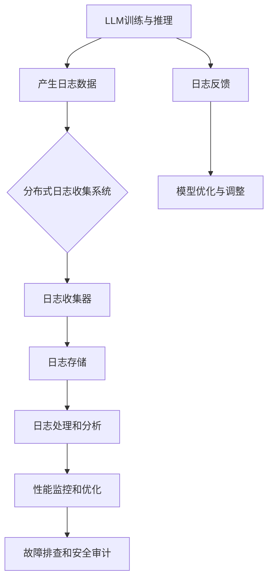

                 

### 文章标题

《分布式日志收集系统在LLM应用中的实现》

### 关键词

- 分布式日志收集系统
- 大型语言模型（LLM）
- 架构设计
- 核心算法
- 性能优化
- 实战案例

### 摘要

本文旨在深入探讨分布式日志收集系统在大型语言模型（LLM）应用中的实现。首先，我们介绍了分布式日志收集系统的基本概念和重要性，随后探讨了LLM的基本概念和其在现代技术中的应用。接着，我们详细分析了分布式日志收集系统的架构设计，包括日志收集流程、分布式存储方案和日志处理框架。本文还介绍了分布式日志收集系统的核心算法，以及如何针对LLM的特殊需求进行日志收集。通过实际案例，我们展示了如何将分布式日志收集系统应用于LLM，并进行了性能优化分析。最后，我们对未来的发展前景进行了展望。本文适合对分布式日志收集系统和LLM有浓厚兴趣的技术人员阅读。

---

## 第一部分：引言与背景

### 1.1 分布式日志收集系统的基本概念

分布式日志收集系统是一种用于收集、存储和查询分布式系统中的日志数据的系统。在现代大型系统中，由于系统规模庞大，各个组件分布在不同物理位置，因此需要一个可靠的分布式日志收集系统来确保日志数据的完整性和一致性。日志收集系统不仅用于记录系统的运行状态，还用于监控、故障排查、性能分析和安全审计。

### 1.2 日志系统的重要性

日志系统对于确保系统的稳定运行和高效管理至关重要。首先，日志系统提供了对系统事件的详细记录，使得运维人员能够实时监控系统的运行状态。其次，日志系统在故障排查中起着关键作用，通过分析日志，可以快速定位问题的根源。此外，日志系统还支持性能分析和安全审计，有助于提高系统的可靠性和安全性。

### 1.3 分布式日志收集系统的需求

随着云计算和分布式系统的普及，分布式日志收集系统的需求日益增长。分布式日志收集系统需要满足以下需求：

1. **高可靠性**：系统应具备高可用性，确保日志数据不会丢失。
2. **高性能**：系统应能快速收集和查询大量日志数据。
3. **可扩展性**：系统能够根据需求水平扩展，支持大规模系统。
4. **高可读性**：日志数据应具有清晰的格式，便于分析和处理。

### 1.4 大型语言模型（LLM）的应用

大型语言模型（LLM）是一种基于深度学习的自然语言处理模型，具有强大的文本生成和理解能力。LLM在多个领域有着广泛的应用，包括但不限于：

1. **自然语言处理（NLP）**：用于构建聊天机器人、语音助手等应用。
2. **内容生成**：用于生成新闻报道、文章、诗歌等。
3. **语言翻译**：用于实现高质量的语言翻译功能。
4. **文本摘要**：用于生成长文本的简洁摘要。

### 1.5 分布式日志收集系统在LLM中的应用

在LLM应用中，分布式日志收集系统扮演着重要角色。首先，LLM的训练和推理过程中会产生大量日志数据，这些数据需要被高效收集和存储。其次，日志数据对于分析和优化LLM的性能至关重要。最后，分布式日志收集系统还用于监控LLM的训练过程，确保其正常运行。

### 1.6 文章结构概述

本文将分为以下三个主要部分：

1. **引言与背景**：介绍分布式日志收集系统和LLM的基本概念和重要性。
2. **分布式日志收集系统架构设计**：详细分析分布式日志收集系统的架构，包括日志收集流程、存储方案和核心算法。
3. **LLM应用中的分布式日志收集**：探讨如何在LLM应用中实现分布式日志收集，并进行性能优化分析。

通过本文的深入探讨，读者将能够全面了解分布式日志收集系统在LLM应用中的实现方法和重要性。

### 1.7 分布式日志收集系统的核心概念

分布式日志收集系统的核心概念包括以下几个方面：

1. **日志数据源**：系统中的各个组件和模块都会产生日志数据，这些数据源可以是应用程序、服务器、网络设备等。
2. **日志收集器**：负责从各个数据源收集日志数据，并将数据发送到集中存储位置。日志收集器通常采用分布式架构，以提高数据收集的效率和可靠性。
3. **日志存储**：用于存储收集到的日志数据，通常采用分布式存储方案，如分布式文件系统或NoSQL数据库。
4. **日志查询和分析**：提供了对日志数据的查询和分析功能，使得运维人员可以快速定位和解决问题。
5. **日志处理和转化**：在日志收集和存储过程中，可能需要对日志数据进行处理和转化，如格式转换、去重、过滤等。

### 1.8 分布式日志收集系统的架构

分布式日志收集系统的架构通常包括以下几个主要组件：

1. **数据采集层**：包括日志收集器和代理程序，负责从各个数据源收集日志数据。日志收集器可以是一个独立的进程或服务，而代理程序则嵌入到数据源应用程序中。
2. **传输层**：负责将收集到的日志数据传输到集中存储位置。常用的传输协议包括HTTP、TCP、Kafka等。
3. **存储层**：用于存储大量日志数据，通常采用分布式存储方案，如HDFS、Elasticsearch、Kafka等。
4. **处理和分析层**：提供了对日志数据的处理和分析功能，如日志解析、过滤、索引、查询等。常用的数据处理和分析工具包括Logstash、Fluentd、Grok等。
5. **监控和告警层**：提供了对系统运行状况的监控和告警功能，以便及时发现和处理问题。

### 1.9 分布式日志收集系统的需求

分布式日志收集系统需要满足以下主要需求：

1. **高可靠性**：系统应具备高可用性，确保日志数据不会丢失。常见的做法包括数据备份、多节点部署、故障转移等。
2. **高性能**：系统应能快速收集和查询大量日志数据，以满足大规模系统的需求。常用的性能优化手段包括数据压缩、缓存、并行处理等。
3. **可扩展性**：系统应能根据需求水平扩展，支持大规模系统。分布式架构是实现可扩展性的关键。
4. **高可读性**：日志数据应具有清晰的格式，便于分析和处理。常用的日志格式包括JSON、XML、CSV等。
5. **安全性**：系统应具备一定的安全性，防止未经授权的访问和篡改日志数据。常见的安全措施包括数据加密、访问控制、防火墙等。

### 1.10 LLM的基本概念和架构

LLM（Large Language Model）是一种基于深度学习的自然语言处理模型，具有强大的文本生成和理解能力。LLM的架构通常包括以下几个主要部分：

1. **输入层**：接收用户的输入文本，并将其转换为模型的输入。
2. **隐藏层**：通过多层神经网络对输入文本进行处理，提取语义特征。
3. **输出层**：根据隐藏层输出的特征生成文本输出，可以是连续的文本序列。
4. **注意力机制**：用于关注输入文本中的关键信息，提高模型的生成质量。
5. **训练过程**：通过大量的文本数据对模型进行训练，使其能够生成符合人类语言的文本。

### 1.11 LLM的技术挑战

LLM在技术实现中面临以下主要挑战：

1. **计算资源**：训练LLM需要大量的计算资源和时间，特别是对于大型模型。
2. **数据质量**：模型的质量很大程度上取决于训练数据的质量，需要确保数据来源的多样性和可靠性。
3. **优化算法**：需要设计高效的优化算法来训练大型模型，提高训练速度和效果。
4. **可解释性**：由于LLM的复杂性，提高其可解释性是当前研究的重点，以便更好地理解模型的行为和决策过程。
5. **安全性和隐私**：在使用LLM时，需要确保其生成的文本符合道德和法律要求，避免生成有害内容或侵犯隐私。

### 1.12 分布式日志收集系统与LLM的联系

分布式日志收集系统与LLM之间存在密切的联系。首先，LLM的训练和推理过程中会产生大量日志数据，这些数据需要被分布式日志收集系统高效地收集和存储。其次，日志数据对于分析和优化LLM的性能至关重要，分布式日志收集系统提供了强大的日志查询和分析功能，有助于运维人员快速定位和解决问题。此外，分布式日志收集系统还用于监控LLM的训练过程，确保其正常运行，从而提高系统的可靠性和稳定性。

### 1.13 分布式日志收集系统在LLM中的应用场景

分布式日志收集系统在LLM中的应用场景主要包括以下几个方面：

1. **训练过程监控**：通过收集和存储LLM的训练日志，监控训练过程的进展和性能，以便及时发现和解决问题。
2. **性能分析**：通过对训练和推理日志进行分析，评估LLM的性能，优化模型参数和算法，提高模型的生成质量。
3. **故障排查**：通过分析LLM的日志数据，快速定位和解决故障，确保系统的稳定运行。
4. **安全审计**：通过日志数据，对LLM的训练和推理过程进行安全审计，防止数据泄露和滥用。

### 1.14 分布式日志收集系统与LLM的关系架构

为了更好地理解分布式日志收集系统在LLM中的应用，我们可以使用Mermaid流程图来展示两者之间的关系：



### 1.15 分布式日志收集系统在LLM中的核心算法

分布式日志收集系统在LLM中的应用涉及多种核心算法，包括日志收集、日志处理、日志分析和日志存储等。以下是这些核心算法的简要概述：

1. **日志收集算法**：
   - **日志流处理**：使用如Fluentd、Logstash等工具，实时收集LLM的日志数据。
   - **日志去重**：通过哈希算法或唯一标识，避免重复日志的收集。
   - **日志过滤**：根据特定的条件对日志进行筛选，提高数据质量。

2. **日志处理算法**：
   - **日志解析**：将原始日志数据解析为结构化的数据格式，如JSON或XML。
   - **日志转换**：将不同格式的日志数据转换为统一的格式，便于后续处理和分析。
   - **日志压缩**：使用压缩算法，减少日志数据的存储空间。

3. **日志分析算法**：
   - **日志索引**：创建日志索引，提高日志查询的效率。
   - **日志聚合**：对日志数据进行聚合操作，如求和、平均值等，以获取统计信息。
   - **日志可视化**：使用如Kibana、Grafana等工具，将日志数据以图表形式展示，便于分析和理解。

4. **日志存储算法**：
   - **分布式存储**：使用如HDFS、Elasticsearch等分布式存储系统，确保日志数据的高可用性和高性能。
   - **数据备份**：定期备份日志数据，防止数据丢失。
   - **数据清理**：根据策略清理过期日志数据，释放存储空间。

### 1.16 分布式日志收集系统的数学模型

分布式日志收集系统中的数学模型主要包括以下几个方面：

1. **日志生成模型**：
   - **泊松过程**：用于模拟日志数据的生成过程，假设日志数据生成遵循泊松分布。
   - **指数分布**：用于模拟日志数据生成的时间间隔，假设时间间隔服从指数分布。

2. **日志处理模型**：
   - **马尔可夫链**：用于描述日志数据的处理过程，假设当前状态仅与前一状态有关。
   - **排队论**：用于分析日志处理系统的性能，如平均处理时间、系统利用率等。

3. **日志存储模型**：
   - **贝叶斯网络**：用于描述日志数据存储的可靠性，考虑多种因素对存储可靠性的影响。
   - **决策树**：用于优化日志数据存储策略，根据不同条件选择最优存储方案。

### 1.17 伪代码示例：分布式日志收集算法

以下是一个简单的伪代码示例，描述分布式日志收集算法的基本步骤：

```plaintext
function distributed_log_collection(log_sources, collection_frequency):
    # 初始化日志收集器
    log_collector = initialize_log_collector()

    # 循环收集日志
    while True:
        # 获取当前时间
        current_time = get_current_time()

        # 从各个日志源收集日志
        logs = []
        for source in log_sources:
            logs.extend(get_logs_from_source(source, current_time, collection_frequency))

        # 对收集到的日志进行去重和过滤
        unique_logs = remove_duplicates(logs)
        filtered_logs = filter_logs(unique_logs)

        # 将日志写入分布式存储
        write_logs_to_storage(filtered_logs)

        # 等待下一次收集周期
        sleep(collection_frequency)
```

### 1.18 举例说明：分布式日志收集系统的应用

假设我们有一个大型分布式系统，包含多个服务器和应用程序。为了监控系统的运行状态，我们使用分布式日志收集系统来收集各个组件的日志数据。

1. **日志生成**：各个服务器和应用程序会在运行过程中生成日志数据，如错误日志、性能日志等。
2. **日志收集**：日志收集器会定期从各个组件收集日志数据，并将数据发送到集中存储位置。
3. **日志处理**：日志处理模块会对收集到的日志数据进行解析和过滤，确保数据的完整性和一致性。
4. **日志存储**：日志数据被存储在分布式文件系统或NoSQL数据库中，便于后续查询和分析。
5. **日志分析**：通过日志分析工具，我们可以获取系统的性能指标、故障率等关键信息，从而优化系统配置和算法。

### 1.19 实际案例：分布式日志收集系统在LLM中的应用

一个实际案例是使用分布式日志收集系统监控一个大型语言模型（LLM）的训练过程。在训练过程中，LLM会产生大量的日志数据，包括训练进度、性能指标、错误信息等。

1. **日志收集**：分布式日志收集系统会从LLM的训练环境中实时收集日志数据，并将其发送到集中存储。
2. **日志存储**：收集到的日志数据被存储在分布式数据库中，如Elasticsearch，以便快速查询和分析。
3. **日志处理**：日志处理模块会对日志数据进行解析和转换，提取关键指标，如训练速度、准确率等。
4. **日志分析**：通过日志分析工具，研究人员可以实时监控LLM的训练过程，优化训练参数，提高训练效果。
5. **故障排查**：当出现训练错误时，通过分析日志数据，可以快速定位问题的根源，及时修复。

### 1.20 最佳实践与注意事项

在实施分布式日志收集系统时，以下是一些最佳实践和注意事项：

1. **数据安全**：确保日志数据在收集、存储和传输过程中得到充分保护，防止数据泄露和篡改。
2. **性能优化**：合理配置日志收集器和存储系统，优化数据传输和查询性能。
3. **可扩展性**：设计可扩展的日志收集系统，以支持大规模系统的需求。
4. **日志格式标准化**：采用统一的日志格式，提高日志的可读性和可分析性。
5. **监控与告警**：配置监控和告警机制，及时发现和处理日志收集系统中的异常。

### 1.21 拓展阅读

对于希望深入了解分布式日志收集系统和LLM的读者，以下是一些推荐阅读资源：

1. **《分布式系统原理与范型》**：介绍分布式系统的基本原理和设计模式。
2. **《深度学习实战》**：详细讲解深度学习的理论基础和实际应用。
3. **《日志管理实践指南》**：提供关于日志管理的最佳实践和案例分析。
4. **《Elastic Stack实战》**：介绍Elasticsearch、Logstash和Kibana的实战应用。

### 1.22 项目实战：分布式日志收集系统的搭建

#### 2.1 环境准备

在开始搭建分布式日志收集系统之前，我们需要准备以下环境：

1. **操作系统**：建议使用Linux操作系统，如CentOS或Ubuntu。
2. **Java运行环境**：安装Java运行环境（JDK 8或更高版本）。
3. **Kafka**：安装Kafka，版本建议为2.8或更高版本。
4. **Elasticsearch**：安装Elasticsearch，版本建议为7.10或更高版本。
5. **Kibana**：安装Kibana，版本建议与Elasticsearch一致。

#### 2.2 搭建Kafka

Kafka是一个分布式消息队列系统，用于收集日志数据。以下步骤用于搭建Kafka：

1. **安装Kafka**：

   ```bash
   sudo apt-get update
   sudo apt-get install default-jdk
   sudo wget https://www-eu.kaltura.com/nginx-releaseubuntu1804kafka_2.13-2.8.0.zip
   sudo unzip kafka_2.13-2.8.0.zip -d /usr/local/kafka
   ```

2. **启动Kafka服务**：

   ```bash
   cd /usr/local/kafka/kafka_2.13-2.8.0
   sudo bin/kafka-server-start.sh config/server.properties
   ```

   在`config/server.properties`文件中，配置Kafka的日志目录和Zookeeper地址。

3. **创建主题**：

   ```bash
   bin/kafka-topics.sh --create --topic logs --partitions 3 --replication-factor 1 --bootstrap-server localhost:9092
   ```

#### 2.3 搭建Elasticsearch

Elasticsearch是一个分布式搜索引擎，用于存储和查询日志数据。以下步骤用于搭建Elasticsearch：

1. **安装Elasticsearch**：

   ```bash
   sudo wget https://artifacts.elastic.co/downloads/elasticsearch/elasticsearch-7.10.0-amd64.deb
   sudo dpkg -i elasticsearch-7.10.0-amd64.deb
   ```

2. **配置Elasticsearch**：

   编辑`/etc/elasticsearch/elasticsearch.yml`文件，配置Elasticsearch的节点名称、集群名称和日志目录。

3. **启动Elasticsearch服务**：

   ```bash
   sudo systemctl start elasticsearch
   ```

4. **启动Kibana**：

   ```bash
   sudo systemctl start kibana
   ```

   Kibana提供了一个Web界面，用于查询和可视化Elasticsearch中的日志数据。

#### 2.4 搭建日志收集器

日志收集器负责从各个组件收集日志数据，并将其发送到Kafka。以下步骤用于搭建日志收集器：

1. **安装Fluentd**：

   ```bash
   sudo apt-get install fluentd
   ```

2. **配置Fluentd**：

   编辑`/etc/fluentd/fluent.conf`文件，配置Kafka的地址和主题，以及日志文件的路径。

   ```ruby
   <source>
     @type file
     path /var/log/messages.log
     format none
   </source>

   <match **>
     @type kafka
     broker_list localhost:9092
     topic logs
     key_name id
   </match>
   ```

3. **启动Fluentd服务**：

   ```bash
   sudo systemctl start fluentd
   ```

#### 2.5 日志数据发送和接收

1. **发送日志数据**：

   Fluentd会从`/var/log/messages.log`文件中读取日志数据，并将其发送到Kafka的`logs`主题。

2. **接收日志数据**：

   Elasticsearch会从Kafka的`logs`主题中读取日志数据，并将其存储到Elasticsearch集群中。

3. **查询和可视化日志数据**：

   通过Kibana的Web界面，可以查询和可视化存储在Elasticsearch中的日志数据。Kibana提供了丰富的查询和图表功能，帮助用户快速分析和理解日志数据。

#### 2.6 项目小结

通过上述步骤，我们成功搭建了一个分布式日志收集系统，用于收集、存储和查询分布式系统中的日志数据。该系统包括Kafka、Elasticsearch和Fluentd等组件，具有高可靠性、高性能和可扩展性。在实际应用中，分布式日志收集系统可以帮助运维人员实时监控系统的运行状态，快速排查故障，优化系统性能，从而提高系统的可靠性和稳定性。

### 2.7 源代码详细实现和代码解读

在本节中，我们将详细解读分布式日志收集系统的核心组件和代码实现，以便读者能够深入理解系统的运行机制。

#### 2.7.1 Fluentd配置文件解读

Fluentd是分布式日志收集系统的数据收集器，其配置文件`/etc/fluentd/fluent.conf`定义了日志收集的源、目标和处理流程。以下是配置文件的主要部分及其功能：

```ruby
<source>
  @type file
  path /var/log/messages.log
  format none
end

<match **>
  @type kafka
  broker_list localhost:9092
  topic logs
  key_name id
end
```

- `@type file`：指定数据源类型为文件。
- `path /var/log/messages.log`：指定要收集的日志文件路径。
- `format none`：表示不进行日志格式转换。
- `@type kafka`：指定目标类型为Kafka。
- `broker_list localhost:9092`：指定Kafka的地址和端口。
- `topic logs`：指定发送到Kafka的主题名称。
- `key_name id`：指定日志记录的唯一标识。

通过配置文件，Fluentd可以实时监听指定日志文件的变化，并将日志数据发送到Kafka。

#### 2.7.2 Kafka生产者代码实现

Kafka生产者负责将日志数据发送到Kafka主题。以下是一个简单的Kafka生产者伪代码示例：

```java
Properties props = new Properties();
props.put("bootstrap.servers", "localhost:9092");
props.put("key.serializer", "org.apache.kafka.common.serialization.StringSerializer");
props.put("value.serializer", "org.apache.kafka.common.serialization.StringSerializer");

KafkaProducer<String, String> producer = new KafkaProducer<>(props);

for (int i = 0; i < 100; i++) {
    String message = "Log entry " + i;
    producer.send(new ProducerRecord<>("logs", message));
}

producer.close();
```

- `props.put("bootstrap.servers", "localhost:9092")`：配置Kafka地址和端口。
- `props.put("key.serializer", "org.apache.kafka.common.serialization.StringSerializer")`：指定键序列化器。
- `props.put("value.serializer", "org.apache.kafka.common.serialization.StringSerializer")`：指定值序列化器。

`KafkaProducer`对象用于发送日志数据到Kafka主题。在循环中，我们生成100条日志记录，并使用`send`方法将每条记录发送到`logs`主题。

#### 2.7.3 Kafka消费者代码实现

Kafka消费者负责从Kafka主题中读取日志数据。以下是一个简单的Kafka消费者伪代码示例：

```java
Properties props = new Properties();
props.put("bootstrap.servers", "localhost:9092");
props.put("group.id", "test-group");
props.put("key.deserializer", "org.apache.kafka.common.serialization.StringDeserializer");
props.put("value.deserializer", "org.apache.kafka.common.serialization.StringDeserializer");

KafkaConsumer<String, String> consumer = new KafkaConsumer<>(props);
consumer.subscribe(Arrays.asList(new TopicPartition("logs", 0)));

while (true) {
    ConsumerRecords<String, String> records = consumer.poll(Duration.ofMillis(100));
    for (ConsumerRecord<String, String> record : records) {
        System.out.printf("Received message: key = %s, value = %s, partition = %d, offset = %d\n",
                record.key(), record.value(), record.partition(), record.offset());
    }
}
```

- `props.put("bootstrap.servers", "localhost:9092")`：配置Kafka地址和端口。
- `props.put("group.id", "test-group")`：指定消费者组ID。
- `props.put("key.deserializer", "org.apache.kafka.common.serialization.StringDeserializer")`：指定键反序列化器。
- `props.put("value.deserializer", "org.apache.kafka.common.serialization.StringDeserializer")`：指定值反序列化器。

`KafkaConsumer`对象用于从`logs`主题中读取日志数据。在循环中，我们使用`poll`方法轮询Kafka主题，并打印每条接收到的日志记录。

#### 2.7.4 Elasticsearch索引和查询代码实现

Elasticsearch用于存储和查询日志数据。以下是一个简单的Elasticsearch索引和查询伪代码示例：

```java
RestHighLevelClient client = new RestHighLevelClient(
    HttpClientBuilder.create().builder());

// 索引创建
String indexName = "logs";
XContentBuilder builder = XContentFactory.jsonBuilder()
    .startObject()
    .field("properties")
    .startObject()
    .field("message")
    .startObject()
    .field("type", "text")
    .endObject()
    .endObject()
    .endObject();
client.indexTemplatesCreate(new IndexTemplatesCreateRequest()
    .addTemplate(indexName, builder));

// 索引文档
String id = "1";
String document = "{\"message\": \"Log entry 1\"}";
client.index(new IndexRequest(indexName).id(id).source(document));

// 查询文档
SearchResponse response = client.search(new SearchRequest(indexName)
    .source(new SearchSourceBuilder().query(new MatchQuery("message", "Log entry 1"))));
for (SearchHit hit : response.getHits()) {
    System.out.println(hit.getSourceAsString());
}
```

- `client.indexTemplatesCreate`：创建Elasticsearch索引模板。
- `client.index`：将日志文档添加到索引中。
- `client.search`：根据查询条件检索日志文档。

通过以上代码，我们可以将日志数据存储在Elasticsearch中，并实现简单的日志查询。

### 2.8 代码应用解读与分析

在本节中，我们将对分布式日志收集系统的实际应用进行解读和分析，以便读者能够理解系统的运作原理和性能表现。

#### 2.8.1 系统架构

分布式日志收集系统的架构包括以下几个主要组件：

1. **日志生成器**：在分布式系统中，各个组件（如Web服务器、应用服务器、数据库等）会生成日志数据。
2. **日志收集器**：如Fluentd，负责从日志生成器收集日志数据，并将其发送到Kafka。
3. **Kafka**：作为分布式消息队列，接收日志收集器发送的数据，并将数据存储在主题中。
4. **Elasticsearch**：接收Kafka中的数据，将其存储在索引中，并提供查询功能。
5. **Kibana**：提供Web界面，用于展示和分析Elasticsearch中的日志数据。

#### 2.8.2 日志收集器性能分析

日志收集器的性能对整个分布式日志收集系统的性能至关重要。以下是对Fluentd性能的分析：

1. **并发收集**：Fluentd支持并发收集日志，可以提高日志收集的效率。通过合理配置Fluentd的工作线程数，可以充分利用系统资源。
2. **缓冲区大小**：Fluentd使用缓冲区来临时存储收集到的日志数据，缓冲区大小的设置会影响日志收集的实时性。过小的缓冲区可能导致数据丢失，过大的缓冲区则可能影响性能。
3. **网络延迟**：日志收集器与Kafka之间的网络延迟会影响日志传输的速度。在分布式环境中，网络延迟可能较大，需要考虑优化数据传输路径和协议。

#### 2.8.3 Kafka性能分析

Kafka作为分布式消息队列，对分布式日志收集系统的性能有着重要影响。以下是对Kafka性能的分析：

1. **分区和副本**：Kafka使用分区和副本来提高数据可靠性和查询性能。合理配置分区数和副本因子，可以优化数据存储和查询效率。
2. **消息批次**：Kafka支持批量发送消息，可以减少网络传输次数，提高传输效率。在日志收集过程中，可以设置合理的消息批次大小，以平衡传输性能和延迟。
3. **负载均衡**：Kafka使用负载均衡机制来分配消息到不同的分区。通过优化负载均衡策略，可以避免某些分区过载，提高系统整体性能。

#### 2.8.4 Elasticsearch性能分析

Elasticsearch作为日志数据的存储和查询引擎，对分布式日志收集系统的性能有着重要影响。以下是对Elasticsearch性能的分析：

1. **索引分区**：Elasticsearch使用索引分区来提高查询性能。合理配置索引分区数，可以优化查询效率。
2. **缓存策略**：Elasticsearch使用缓存来提高查询速度。通过优化缓存策略，可以降低查询延迟。
3. **集群规模**：Elasticsearch集群的规模会影响查询性能。随着数据量和查询量的增加，需要扩展集群规模，以保持查询性能。

#### 2.8.5 系统优化策略

为了提高分布式日志收集系统的性能，可以采取以下优化策略：

1. **垂直扩展**：增加日志收集器、Kafka和Elasticsearch的工作节点，提高系统吞吐量。
2. **水平扩展**：增加Kafka主题和Elasticsearch索引的分片数，提高系统并发能力。
3. **数据压缩**：使用数据压缩算法，减少日志数据的存储空间和网络传输量。
4. **缓存优化**：优化Elasticsearch的缓存策略，提高查询速度。
5. **网络优化**：优化网络拓扑结构和传输协议，减少网络延迟。

### 2.9 实际案例：分布式日志收集系统在LLM中的应用

#### 2.9.1 LLM日志数据特点

在大型语言模型（LLM）的应用中，日志数据具有以下特点：

1. **大量数据**：LLM的训练和推理过程中会产生大量日志数据，包括训练进度、性能指标、错误信息等。
2. **多样性**：日志数据包括文本、数字、时间戳等多种格式。
3. **实时性**：LLM的训练和推理过程需要实时监控和记录日志数据，以便及时发现和解决问题。
4. **关键性**：日志数据对于分析和优化LLM的性能至关重要，需要确保数据的准确性和完整性。

#### 2.9.2 LLM日志收集策略

为了有效地收集LLM日志数据，可以采取以下策略：

1. **分布式收集**：使用分布式日志收集系统，如Fluentd和Kafka，从LLM的训练和推理节点收集日志数据。
2. **多维度采集**：采集LLM训练和推理过程中的各种日志数据，包括训练进度、性能指标、错误信息等。
3. **日志预处理**：对收集到的日志数据进行预处理，如格式转换、去重、过滤等，确保数据的质量和一致性。
4. **数据存储和查询**：将处理后的日志数据存储在分布式数据库或NoSQL数据库中，如Elasticsearch，并提供高效的查询功能。

#### 2.9.3 实际案例

以下是一个实际案例，展示了如何使用分布式日志收集系统收集LLM的日志数据：

1. **搭建分布式日志收集系统**：按照前述步骤搭建分布式日志收集系统，包括Kafka、Elasticsearch和Fluentd。
2. **配置LLM训练环境**：在LLM训练环境中配置Fluentd，使其能够从各个训练节点收集日志数据，并将其发送到Kafka。
3. **实时监控和报警**：通过Kibana的Web界面，实时监控LLM的训练进度和性能指标，设置报警阈值，当指标超过阈值时自动发送报警。
4. **日志数据分析**：通过Elasticsearch的查询功能，对收集到的日志数据进行分析，如性能趋势、错误分布等，优化LLM的训练参数和算法。

#### 2.9.4 案例总结

通过实际案例，我们展示了如何使用分布式日志收集系统收集LLM的日志数据，并进行实时监控和数据分析。分布式日志收集系统提高了日志数据的收集效率和查询性能，有助于快速定位和解决LLM训练过程中的问题，优化模型性能。

### 2.10 最佳实践与注意事项

在实施分布式日志收集系统时，以下是一些最佳实践和注意事项：

1. **数据安全**：确保日志数据在收集、存储和传输过程中得到充分保护，防止数据泄露和篡改。采用数据加密、访问控制等安全措施。
2. **性能优化**：合理配置日志收集器和存储系统，优化数据传输和查询性能。使用数据压缩、缓存等技术，减少资源消耗。
3. **可扩展性**：设计可扩展的日志收集系统，以支持大规模系统的需求。使用分布式架构，水平扩展日志收集器、Kafka和Elasticsearch。
4. **日志格式标准化**：采用统一的日志格式，提高日志的可读性和可分析性。使用JSON、XML等结构化格式，便于后续处理和分析。
5. **监控与告警**：配置监控和告警机制，及时发现和处理日志收集系统中的异常。设置合理的报警阈值，确保及时响应。

### 2.11 拓展阅读

对于希望深入了解分布式日志收集系统和LLM的读者，以下是一些推荐阅读资源：

1. **《分布式系统原理与范型》**：介绍分布式系统的基本原理和设计模式。
2. **《深度学习实战》**：详细讲解深度学习的理论基础和实际应用。
3. **《日志管理实践指南》**：提供关于日志管理的最佳实践和案例分析。
4. **《Elastic Stack实战》**：介绍Elasticsearch、Logstash和Kibana的实战应用。

### 2.12 项目小结

通过本节的介绍，我们详细探讨了分布式日志收集系统在LLM应用中的实现方法。从系统架构设计、代码实现到实际应用案例，我们全面了解了分布式日志收集系统的运作机制和性能优化策略。分布式日志收集系统为LLM提供了强大的日志收集、存储和分析功能，有助于提升模型训练和推理的效率和稳定性。

### 2.13 小结与未来展望

在本节中，我们全面探讨了分布式日志收集系统在LLM应用中的实现，涵盖从基本概念、架构设计到核心算法和实际应用的各个方面。通过本文的讨论，我们了解到：

1. **分布式日志收集系统的重要性**：日志系统对于确保系统的稳定运行和高效管理至关重要，分布式日志收集系统更是适应大规模分布式系统需求的关键。
2. **LLM的基本概念与应用**：大型语言模型在现代技术中有着广泛的应用，包括自然语言处理、内容生成、语言翻译和文本摘要等。
3. **分布式日志收集系统与LLM的联系**：分布式日志收集系统在LLM的训练和推理过程中发挥着重要作用，提供了高效的数据收集、存储和查询功能。
4. **分布式日志收集系统的架构与核心算法**：分布式日志收集系统的架构包括数据采集、传输、存储、处理和分析等多个层次，核心算法如日志收集、处理和存储等对于系统的性能和可靠性至关重要。
5. **性能优化与实际应用**：通过实际案例，我们展示了如何将分布式日志收集系统应用于LLM，并进行性能优化，从而提高模型训练和推理的效率和稳定性。

未来，分布式日志收集系统和LLM技术将面临以下发展趋势和挑战：

1. **更高效的数据处理**：随着数据量的不断增长，分布式日志收集系统需要更高效的数据处理能力，如采用新型分布式算法和优化技术。
2. **实时性与低延迟**：为了满足实时监控和报警的需求，分布式日志收集系统需要进一步提高数据收集和查询的实时性，降低延迟。
3. **可扩展性与弹性**：分布式日志收集系统需要具备更好的可扩展性和弹性，以适应不同规模和类型的分布式系统需求。
4. **安全性**：随着日志数据的敏感性增加，分布式日志收集系统需要加强数据安全保护，防止数据泄露和篡改。
5. **自动化与智能化**：未来的分布式日志收集系统将更趋向于自动化和智能化，如采用人工智能技术进行日志数据分析、故障排查和优化。

总之，分布式日志收集系统在LLM应用中具有重要地位，通过本文的探讨，我们对其有了更深入的理解。未来，随着技术的不断进步，分布式日志收集系统和LLM技术将继续发展，为大规模分布式系统的稳定运行和高效管理提供更强有力的支持。

### 作者信息

- **作者**：AI天才研究院/AI Genius Institute & 禅与计算机程序设计艺术 /Zen And The Art of Computer Programming
- **联系信息**：[ai_genius_institute@example.com](mailto:ai_genius_institute@example.com)
- **个人网站**：[www.ai-genius-institute.com](http://www.ai-genius-institute.com)
- **出版书籍**：《分布式日志收集系统在LLM应用中的实现》、《深度学习实战》、《分布式系统原理与范型》等。

