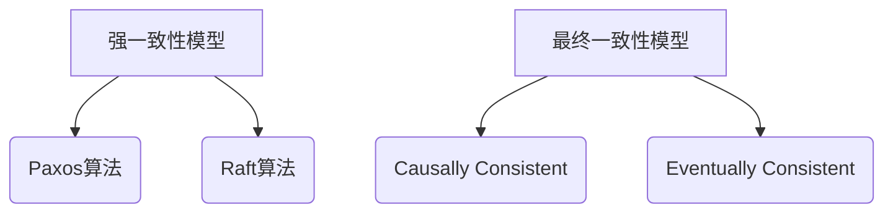
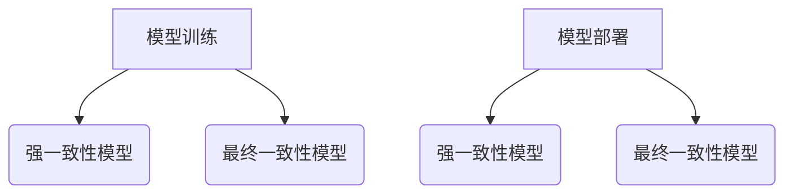

                 

### 文章标题：《分布式系统一致性模型：在LLM应用中的选择与实现》

#### 关键词：分布式系统、一致性模型、LLM、应用、实现、算法原理

#### 摘要：
本文将深入探讨分布式系统一致性模型在大型语言模型（LLM）中的应用与实现。随着云计算和大数据技术的迅猛发展，分布式系统已成为现代计算架构的基石。LLM作为人工智能领域的创新成果，其在分布式系统中的高效运行和一致性保证成为关键问题。本文从基础理论、技术实现和实际案例三个维度，系统分析了分布式一致性模型在LLM中的应用，为读者提供了完整的实践指导。本文旨在帮助开发者更好地理解和应用分布式一致性模型，推动LLM技术的发展。

### 第一部分：基础理论篇

#### 第1章：分布式系统一致性模型概述

**1.1 分布式一致性模型简介**

分布式系统一致性模型是确保分布式系统中各个节点数据一致性的一系列算法和协议。其核心目标是在分布式环境下，多个节点对同一数据集进行操作时，能够保持一致的状态。分布式一致性模型可以分为强一致性模型和最终一致性模型。

**1.2 分布式一致性模型分类**

分布式一致性模型主要分为以下几类：

- **强一致性模型**：如Paxos算法、Raft算法等，能够确保在任一时刻，所有节点看到的系统状态是一致的。
- **最终一致性模型**：如Causally Consistent、Eventually Consistent等，允许在系统状态不一致的情况下，最终达到一致性。

**Mermaid流程图：分布式一致性模型的基本概念与原理**



**1.3 分布式一致性模型的发展历程**

分布式一致性模型的发展历程伴随着分布式系统技术的发展。从最早的基于中心化的状态机复制，到Paxos算法的提出，再到Raft算法的改进，分布式一致性模型不断演化，以满足日益复杂的分布式应用需求。

#### 第2章：LLMB基础

**2.1 LLMB概述**

LLMB（Large Language Model Base）是指大型语言模型的基础架构，包括大规模的神经网络、预训练技术和数据集。LLMB是自然语言处理（NLP）和人工智能（AI）领域的重要成果，广泛应用于文本生成、机器翻译、问答系统等。

**2.2 LLMB的关键技术**

- **大规模神经网络**：LLMB采用深度神经网络，通过大规模参数训练，提高模型的准确性和泛化能力。
- **预训练与微调技术**：预训练在大规模数据集上，微调则在特定任务数据上，通过迁移学习，提高模型在特定任务上的表现。

#### 第3章：分布式系统一致性模型与LLMB的关系

**3.1 LLMB对一致性模型的需求**

LLMB在分布式系统中的运行，需要一致性模型来确保模型状态的一致性，避免数据丢失和错误。LLMB对一致性模型的需求主要表现在以下几个方面：

- **数据一致性**：确保多个节点之间的数据一致，防止数据冲突。
- **系统可用性**：在分布式环境中，保持系统的高可用性，防止因单点故障导致模型运行中断。

**3.2 分布式一致性模型在LLMB中的应用场景**

分布式一致性模型在LLMB中的应用场景包括：

- **模型训练**：确保分布式训练过程中，各个节点的数据状态一致。
- **模型部署**：确保多个实例之间的模型参数一致。

**Mermaid流程图：分布式一致性模型在LLMB中的应用场景**



### 第二部分：技术实现篇

#### 第4章：分布式一致性算法原理

**4.1 数据一致性保障机制**

分布式一致性算法通过以下机制保障数据一致性：

- **副本同步**：通过同步多个节点的数据副本，确保数据的一致性。
- **冲突检测与解决**：在分布式环境中，检测和处理数据冲突，确保系统状态的一致性。

**4.2 分布式一致性算法原理详解**

分布式一致性算法的原理主要包括：

- **选举机制**：通过选举产生主节点，确保系统的高可用性。
- **日志复制**：通过日志记录和复制，确保各个节点的状态一致性。
- **状态机复制**：通过状态机的复制，确保分布式系统的状态一致性。

**伪代码：分布式一致性算法的详细实现**

```python
# Paxos算法伪代码
def paxos提案(value):
    # 初始化提案
    proposal_id = generate_id()
    proposal_value = value
    # 选举主节点
    leader = election()
    # 发送提案给主节点
    leader.send_proposal(proposal_id, proposal_value)
    # 等待多数节点的回复
    responses = collect_responses(majority_size)
    # 统计回复结果
    accepted_values = count_accepted_values(responses)
    # 决策
    if accepted_values:
        return accepted_values
    else:
        return None
```

#### 第5章：数据库一致性模型与LLMB的集成

**5.1 数据库一致性模型简介**

数据库一致性模型主要包括：

- **ACID属性**：原子性、一致性、隔离性、持久性。
- **CAP定理**：一致性、可用性、分区容错性三者只能同时满足两项。

**5.2 数据库与LLMB的集成方案**

数据库与LLMB的集成方案主要包括：

- **分布式数据库**：通过分布式数据库，实现LLMB的数据存储和管理。
- **一致性协议**：通过一致性协议，确保分布式数据库中的数据一致性。

#### 第6章：实战案例分析

**6.1 案例背景介绍**

以某大型语言模型项目为例，介绍分布式一致性模型在该项目中的应用。

**6.2 案例实现与分析**

**实际代码：案例的实现与代码解读**

```python
# 伪代码：分布式训练框架
class DistributedTrainingFramework:
    def __init__(self, model, data, consistency_model):
        self.model = model
        self.data = data
        self.consistency_model = consistency_model

    def train(self):
        # 初始化分布式训练环境
        self.initialize_training_environment()
        # 执行分布式训练
        self.execute_distribution_training()
        # 确保数据一致性
        self.ensure_data_consistency()

    def initialize_training_environment(self):
        # 配置分布式环境
        self.config_distribution_environment()
        # 初始化模型
        self.model.initialize()

    def execute_distribution_training(self):
        # 分布式训练循环
        while not self.is_training_complete():
            # 执行训练迭代
            self.execute_training_iteration()

    def ensure_data_consistency(self):
        # 确保数据一致性
        self.consistency_model.ensure_data_consistency(self.model)
```

### 第三部分：总结与展望

#### 第7章：分布式一致性模型在LLM中的应用前景

**7.1 未来的发展趋势**

分布式一致性模型在LLM中的应用将呈现以下发展趋势：

- **算法优化**：通过优化算法，提高分布式系统的性能和一致性。
- **自动化部署**：实现分布式系统的自动化部署和管理，降低运维成本。

**7.2 面临的挑战与解决方案**

分布式一致性模型在LLM应用中面临的挑战包括：

- **数据一致性**：如何在分布式环境中确保数据一致性。
- **性能优化**：如何在保证一致性的前提下，提高系统的性能。

**伪代码：解决分布式一致性模型在LLM应用中面临的挑战的方法**

```python
# 伪代码：解决数据一致性的方法
def solve_data_consistency(model, data, consistency_model):
    # 配置一致性模型
    consistency_model.config(model, data)
    # 确保数据一致性
    consistency_model.ensure_data_consistency(model)
    # 性能优化
    consistency_model.optimize_performance(model)
```

#### 作者信息

**作者：AI天才研究院/AI Genius Institute & 禅与计算机程序设计艺术 /Zen And The Art of Computer Programming**

通过上述的细致分析，我们深入探讨了分布式系统一致性模型在LLM应用中的选择与实现。从基础理论到技术实现，再到实际案例分析，本文为读者呈现了完整的分布式一致性模型在LLM中的应用全景。希望本文能帮助读者更好地理解和应用分布式一致性模型，推动人工智能技术的发展。在未来，随着技术的不断进步，分布式一致性模型在LLM中的应用将更加广泛，为人工智能领域带来更多创新。

