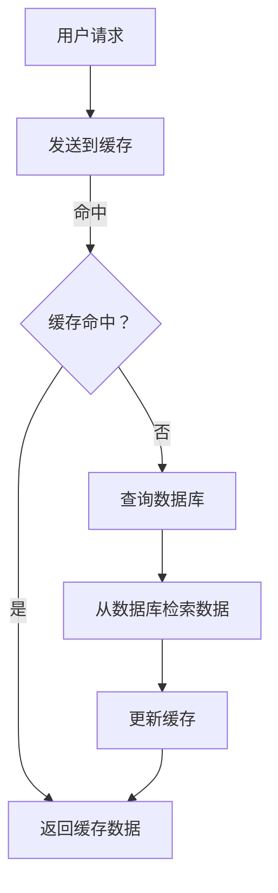

                 


### 文章标题
《分布式缓存：提高LLM应用数据访问速度》

### 关键词
- 分布式缓存
- LLM应用
- 数据访问速度
- 缓存优化策略
- 缓存架构设计

### 摘要
本文旨在探讨分布式缓存技术在提升大型语言模型（LLM）应用数据访问速度方面的作用。通过对分布式缓存的概念、优势、架构设计、常见系统及其优化策略的详细分析，本文揭示了分布式缓存如何成为LLM应用性能提升的关键因素。此外，本文还通过具体案例展示了分布式缓存与LLM应用的集成实践，以及性能测试和调优的方法。通过阅读本文，读者将对分布式缓存有更深入的理解，并能够将其应用于实际项目中。

## 引言

### 1.1 分布式缓存的概念与重要性

分布式缓存是一种分布式系统，用于在多个节点之间存储和检索数据，以减少应用程序的响应时间并提高数据处理速度。与传统缓存相比，分布式缓存能够在大型系统中提供更高的可用性、可扩展性和性能。其核心思想是将缓存数据分散存储在不同的节点上，并通过负载均衡和故障转移机制来实现数据的快速访问。

在当今的互联网环境中，随着数据量的不断增长和业务需求的日益复杂，分布式缓存的重要性愈发凸显。特别是在大型语言模型（LLM）应用中，如搜索引擎、社交媒体平台和智能客服系统，快速访问数据成为保证用户体验的关键。然而，LLM应用往往面临数据存储和访问的挑战，如数据一致性问题、延迟问题和可扩展性问题。分布式缓存技术通过其独特的架构和算法设计，可以有效解决这些挑战。

### 1.2 为什么分布式缓存对LLM应用至关重要

LLM应用通常需要处理海量的文本数据，并在毫秒级内提供响应。这种高要求的数据访问需求使得传统的单一缓存系统难以满足。分布式缓存能够通过以下方式提升LLM应用的数据访问速度：

1. **数据一致性与分布式锁**：分布式缓存系统通常支持强一致性，确保在多节点环境中数据的一致性。通过分布式锁机制，LLM应用可以避免并发访问导致的冲突和数据不一致问题。

2. **缓存命中率的提升**：分布式缓存系统能够将热数据缓存到内存中，降低对磁盘的访问次数，从而提高数据访问速度。在LLM应用中，热数据的访问频率较高，通过缓存策略可以显著提升命中率。

3. **负载均衡与故障转移**：分布式缓存系统能够将请求均匀分布到多个节点上，避免单个节点成为瓶颈。同时，在节点故障时，系统能够自动切换到其他健康节点，保证服务的持续可用。

4. **数据分区与存储优化**：分布式缓存系统能够将数据分区存储在不同的节点上，根据访问模式进行数据的存储和检索优化。这有助于减少数据访问路径，提高系统的性能。

### 1.3 本书结构概述

本书将从以下几个方面深入探讨分布式缓存技术在LLM应用中的应用：

- **第2章 分布式缓存基础**：介绍缓存的基本原理、分布式缓存的优势及其核心组件。
- **第3章 分布式缓存架构设计**：分析分布式缓存架构设计的原则、系统模型和核心算法。
- **第4章 常见分布式缓存系统介绍**：详细讨论Redis和Memcached两种常见分布式缓存系统的特点和应用场景。
- **第5章 分布式缓存优化策略**：探讨缓存命中率优化、缓存雪崩与击穿问题及缓存容量规划策略。
- **第6章 分布式缓存与LLM应用集成**：分析LLM应用数据访问模式及其与分布式缓存的集成方案。
- **第7章 分布式缓存性能测试与调优**：介绍性能测试指标、工具和方法，以及性能调优策略。
- **第8章 分布式缓存的未来发展趋势**：探讨新型分布式缓存技术及其面临的挑战。

通过本书的阅读，读者将全面了解分布式缓存技术的原理和应用，掌握其优化策略和实践方法，从而为LLM应用的数据访问速度提供有力支持。

## 分布式缓存基础

### 2.1 缓存的基本原理

缓存（Cache）是一种临时存储数据的机制，用于加快对频繁访问数据的访问速度。其基本原理是通过将数据从频繁访问的地方移动到较快速、但容量较小的存储介质中，以减少对低速、大容量存储设备的访问次数。

缓存可以分为以下几类：

1. **CPU缓存**：位于CPU内部或紧邻CPU的高速缓存，用于减少CPU访问内存的延迟。
2. **内存缓存**：位于内存中的缓存，用于减少内存访问磁盘的延迟。
3. **磁盘缓存**：位于磁盘控制器中的缓存，用于减少磁盘访问的延迟。
4. **网络缓存**：位于网络设备中的缓存，用于减少网络传输的延迟。

缓存的工作机制通常包括以下步骤：

1. **缓存查找**：当应用程序需要访问数据时，首先在缓存中查找。如果缓存命中，直接返回数据；如果缓存未命中，则需要访问底层存储。
2. **缓存替换**：当缓存已满且需要新的数据时，根据某种策略（如最近最少使用（LRU）算法）替换掉不再需要的缓存项。

### 2.1.1 缓存的分类

根据缓存的作用范围和用途，缓存可以分为以下几种类型：

1. **本地缓存**：指在单个应用程序或服务中使用的缓存，如应用程序内部的内存缓存或文件缓存。
2. **分布式缓存**：指在多个节点之间共享的缓存，能够提供更高的可用性和性能。分布式缓存通常通过分布式算法和协议实现数据的同步和一致性。
3. **全局缓存**：指在整个系统中共享的缓存，能够跨多个应用程序或服务使用。全局缓存通常需要更高的协调机制和数据一致性要求。

### 2.1.2 缓存的优点与挑战

缓存的优点主要包括：

1. **提高数据访问速度**：通过将频繁访问的数据存储在较快速的存储介质中，显著减少数据访问时间。
2. **减少系统负载**：减少对低速、大容量存储设备的访问，降低系统的负载。
3. **提高系统性能**：通过缓存机制，减少数据的传输和计算时间，提高系统的整体性能。

然而，缓存也面临一些挑战：

1. **缓存一致性问题**：在分布式系统中，如何保证缓存与底层存储的数据一致性是一个关键问题。
2. **缓存容量限制**：缓存容量通常有限，如何合理配置和使用缓存容量是一个需要考虑的问题。
3. **缓存失效策略**：如何确定缓存项的失效时间，以保证缓存的有效性和准确性。

### 2.2 分布式缓存的优势

分布式缓存相对于传统缓存具有以下几个显著优势：

1. **高可用性**：分布式缓存系统通过多节点部署，能够在单个节点故障时自动切换到其他健康节点，确保系统的可用性。
2. **可扩展性**：分布式缓存系统能够通过增加节点数量来线性扩展，满足不断增长的数据访问需求。
3. **负载均衡**：分布式缓存系统能够将请求均匀分布到多个节点上，避免单个节点成为瓶颈，提高系统的性能。

### 2.2.1 分布式缓存的特点

分布式缓存的特点主要包括：

1. **数据分布**：数据被分布在多个节点上，每个节点存储部分数据。
2. **一致性协议**：分布式缓存系统通常采用一致性协议（如强一致性或最终一致性），保证数据的正确性和一致性。
3. **数据同步**：分布式缓存系统通过数据同步机制（如复制或广播）保持数据的一致性。
4. **负载均衡**：通过负载均衡算法，将请求均匀分布到多个节点上，避免节点过载。
5. **故障转移**：在节点故障时，系统能够自动切换到其他健康节点，确保服务的持续可用。

### 2.2.2 分布式缓存的应用场景

分布式缓存适用于以下几种典型的应用场景：

1. **高并发访问场景**：在需要处理大量并发请求的场景中，分布式缓存能够提高系统的响应速度和吞吐量。
2. **分布式系统**：在分布式系统中，分布式缓存能够减少跨节点访问的数据传输延迟，提高系统的整体性能。
3. **大数据应用**：在处理大规模数据的应用中，分布式缓存能够提高数据的访问速度，减少对底层存储的依赖。
4. **互联网应用**：在互联网应用中，如电子商务平台、社交媒体和搜索引擎，分布式缓存能够提高系统的可用性和性能，提升用户体验。

通过理解分布式缓存的基础原理、分类、优点以及应用场景，我们可以更好地把握其在提升LLM应用数据访问速度方面的潜力。接下来，我们将进一步探讨分布式缓存的核心组件和架构设计。

### 2.3 分布式缓存的核心组件

分布式缓存系统由多个关键组件组成，这些组件相互协作，确保数据的高效存储、访问和管理。以下是分布式缓存系统中的核心组件及其功能：

#### 2.3.1 数据存储与一致性

1. **数据存储**：分布式缓存系统的数据存储通常采用分布式存储机制，数据被分割成多个小块，分布在不同的节点上。每个节点负责存储和管理一部分数据。这种数据分布方式提高了系统的可扩展性和容错能力。

2. **一致性**：分布式缓存系统的一致性是确保多节点环境中数据正确性的关键。一致性协议（如强一致性、最终一致性或部分一致性）用于处理多个节点间的数据同步问题。强一致性要求所有节点在某个操作完成后都能看到一致的数据状态，而最终一致性则允许一段时间内的数据不一致，但最终会达到一致状态。

   - **强一致性**：适用于对数据一致性要求极高的场景，但可能影响系统的性能和扩展性。
   - **最终一致性**：适用于对一致性要求较低的场景，如社交媒体平台，能够提供更高的性能和可扩展性。

#### 2.3.2 负载均衡与故障转移

1. **负载均衡**：负载均衡组件负责将客户端的请求均匀分布到多个缓存节点上，确保每个节点的负载均衡，避免单个节点成为性能瓶颈。常见的负载均衡算法包括随机算法、轮询算法、最小连接数算法等。

2. **故障转移**：故障转移组件在某个节点出现故障时，能够自动将请求转移到其他健康节点，确保服务的持续可用。故障转移机制通常包括健康检查、自动切换和回滚等步骤，以保证系统的稳定性和可靠性。

   - **健康检查**：定期检查节点的状态，判断其是否健康。
   - **自动切换**：在节点故障时，自动将请求切换到健康节点。
   - **回滚**：故障节点恢复后，能够重新接管请求，确保数据的一致性和系统的完整性。

#### 2.3.3 数据同步与复制

1. **数据同步**：数据同步组件确保多个节点之间的数据一致性。数据同步可以通过复制（如主从复制、多主复制）或数据同步协议（如Gossip协议、Paxos算法）实现。复制技术用于将数据从一个节点同步到其他节点，确保数据的一致性。

2. **数据复制**：数据复制是指将数据在多个节点之间进行备份，以提高数据的可靠性和可用性。常见的数据复制策略包括全复制、部分复制和一致性复制。

   - **全复制**：所有数据在所有节点上都有备份，提供最高级别的可用性，但可能增加存储成本。
   - **部分复制**：仅复制热点数据或常用数据，减少存储成本，但可能影响一致性。
   - **一致性复制**：在复制过程中保证数据的一致性，适用于对一致性要求较高的场景。

通过理解分布式缓存的核心组件及其功能，我们可以更好地设计和管理分布式缓存系统，从而提升LLM应用的数据访问速度和系统性能。

### 分布式缓存架构设计

分布式缓存系统的设计是一个复杂而关键的过程，它直接影响系统的性能、可用性和扩展性。以下是从几个关键方面对分布式缓存架构设计的深入分析：

#### 3.1.1 高可用性

高可用性是分布式缓存系统的设计核心之一。为了确保系统在遇到硬件故障或网络问题时能够持续提供服务，设计时需要考虑以下几点：

1. **冗余设计**：通过在系统中引入冗余组件，如冗余节点和冗余网络连接，确保在某个组件或节点出现故障时，其他组件和节点可以接管其工作。
2. **故障转移机制**：设计一个自动化的故障转移机制，以便在节点或组件故障时，系统能够迅速切换到备用节点或组件，保证服务的连续性。
3. **健康检查和监控**：定期进行健康检查，监控系统的状态，及时发现并处理潜在故障。

#### 3.1.2 可扩展性

可扩展性是分布式缓存系统设计的重要目标之一，特别是在数据量持续增长和用户访问量增加的情况下。以下是一些关键策略：

1. **水平扩展**：通过增加节点数量来线性扩展系统的处理能力，确保系统可以随着数据量的增加而扩展。水平扩展可以是静态扩展（预先规划）或动态扩展（自动调整节点数量）。
2. **数据分区**：将数据分成多个分区，每个分区由不同的节点管理。这有助于将负载分散到多个节点上，提高系统的并行处理能力。
3. **负载均衡**：使用负载均衡算法，将请求均匀分配到不同的节点上，避免某个节点过载，同时提高系统的响应速度。

#### 3.1.3 数据一致性

数据一致性是分布式缓存系统设计中的一个重要挑战。以下是一些确保数据一致性的策略：

1. **一致性模型**：选择适合应用场景的一致性模型，如强一致性、最终一致性或部分一致性。强一致性确保所有节点在同一时间看到一致的数据状态，但可能影响性能；最终一致性允许数据在一定时间内不一致，但最终会达到一致状态，适用于对一致性要求较低的场景。
2. **同步机制**：使用同步机制（如复制和广播）确保数据在不同节点之间的一致性。复制机制将数据从一个节点同步到其他节点，而广播机制则将数据从源头节点同步到所有其他节点。
3. **冲突处理**：在多节点环境中，数据更新可能会导致冲突。设计时需要考虑冲突检测和解决策略，如版本控制和锁机制。

#### 3.2 分布式缓存系统模型

分布式缓存系统模型决定了数据如何在多个节点之间存储、同步和访问。以下是一些常见的系统模型：

1. **主从模式**：在这种模型中，有一个主节点负责处理所有请求，从节点负责存储数据的副本。主节点在故障时可以被从节点替换，确保系统的可用性。
   - **优点**：简化了数据管理，提高了系统的可用性。
   - **缺点**：可能会导致单点故障，影响系统的性能和扩展性。

2. **无状态缓存**：在这种模型中，每个缓存节点都是无状态的，节点之间没有状态同步，每个节点都可以独立处理请求。这提高了系统的可扩展性和性能，但可能会带来数据一致性的问题。
   - **优点**：高可扩展性，性能优异。
   - **缺点**：需要额外的同步机制来确保数据一致性。

3. **原子性操作**：在这种模型中，分布式缓存系统支持原子性操作，如分布式锁，确保多节点环境中操作的原子性和一致性。
   - **优点**：提供了强一致性保证，适用于对一致性要求较高的场景。
   - **缺点**：可能会影响系统的性能。

#### 3.3 分布式缓存算法

分布式缓存系统的性能和效率在很大程度上取决于其使用的算法。以下是一些核心算法：

1. **哈希算法**：哈希算法用于将数据均匀分布到多个节点上。常用的哈希算法包括MD5、SHA-1和SHA-256等。哈希算法的选择和实现直接影响系统的性能和一致性。
   - **伪代码示例**：
     ```plaintext
     function distributedHash(key, num_nodes):
         hash_value = hashFunction(key)
         node_index = hash_value mod num_nodes
         return node_index
     ```

2. **负载均衡算法**：负载均衡算法用于将请求均匀分配到多个节点上，以避免单个节点过载。常用的负载均衡算法包括轮询算法、最小连接数算法和哈希算法等。
   - **伪代码示例**：
     ```plaintext
     function loadBalance(request, nodes):
         node_index = distributedHash(request, num_nodes)
         return nodes[node_index]
     ```

3. **分布式锁**：分布式锁用于在多节点环境中确保操作的原子性和一致性。常用的分布式锁算法包括Paxos算法和Zookeeper的锁机制。
   - **伪代码示例**（Paxos算法）：
     ```plaintext
     function distributedLock(lock_name):
         propose(lock_name)
         while not decided():
             vote(lock_name)
         acquire(lock_name)
     ```

4. **数据分区算法**：数据分区算法用于将数据分割成多个分区，每个分区由不同的节点管理。常用的数据分区算法包括哈希分区和轮询分区。
   - **伪代码示例**（哈希分区）：
     ```plaintext
     function partition(key, num_partitions):
         hash_value = hashFunction(key)
         partition_index = hash_value mod num_partitions
         return partition_index
     ```

通过合理的架构设计和核心算法选择，分布式缓存系统可以在保证数据一致性的同时，提供高性能和高可用性的数据访问服务，从而满足LLM应用的需求。

### 常见分布式缓存系统介绍

在分布式缓存领域，有多种成熟的系统被广泛使用，每种系统都有其独特的特点和适用场景。本文将介绍两种常见的分布式缓存系统：Redis和Memcached。

#### 4.1 Redis

Redis（Remote Dictionary Server）是一种基于内存的分布式缓存系统，同时提供多种数据结构（如字符串、哈希、列表、集合和有序集合）的支持。Redis的设计目标是在提供高性能的同时，实现数据的持久化和高可用性。

##### 4.1.1 Redis的基本功能

1. **高性能**：Redis使用内存作为数据存储，从而实现极快的读写速度，平均延迟仅为几毫秒。这使得Redis在需要高速缓存解决方案的应用场景中具有显著优势。
2. **多数据结构**：Redis支持多种数据结构，使得开发者可以根据不同的数据访问模式选择最合适的结构，从而优化性能。
3. **持久化**：Redis支持数据持久化功能，可以将内存中的数据同步到硬盘上，确保数据不会因为内存重启而丢失。
4. **事务支持**：Redis支持事务，确保一系列操作要么全部成功，要么全部失败，从而提供了一致性的保障。
5. **高可用性**：Redis支持主从复制，主节点可以同步数据到从节点，从节点可以在主节点故障时接管其工作。

##### 4.1.2 Redis的数据结构

Redis支持多种数据结构，包括：

- **字符串**：Redis中最基础的数据结构，用于存储字符串、数字等数据。
- **哈希**：哈希是一种键值对存储结构，用于存储多个字段，非常适合存储对象或表结构的数据。
- **列表**：列表是一种有序集合，支持在两端添加或删除元素，适用于消息队列等场景。
- **集合**：集合是一种无序集合，用于存储唯一的元素，支持成员的添加、删除和计数等操作。
- **有序集合**：有序集合是一种带有排序功能的集合，元素可以根据分数进行排序，适用于排行榜等场景。

##### 4.1.3 Redis的高可用部署

Redis的高可用部署通常包括以下几个关键步骤：

1. **主从复制**：通过主从复制，将数据从主节点同步到从节点。从节点可以作为主节点的备份，在主节点故障时接管其工作。
2. **哨兵机制**：Redis哨兵（Sentinel）是一种用于监控和故障转移的组件。哨兵会定期检查主节点和从节点的健康状态，并在检测到故障时自动进行主从切换。
3. **集群部署**：Redis集群（Redis Cluster）通过将多个节点分成多个槽（Slots），实现数据的分片存储和负载均衡。Redis集群提供了自动故障转移和数据分区功能，提高了系统的可用性和可扩展性。

#### 4.2 Memcached

Memcached是一种高性能的分布式缓存系统，最初设计用于提高Web应用程序的性能。与Redis相比，Memcached主要用于存储键值对，且不提供持久化功能。

##### 4.2.1 Memcached的基本原理

Memcached的基本原理包括以下几点：

1. **基于内存存储**：Memcached仅使用内存作为数据存储，从而实现极快的读写速度。
2. **键值对存储**：Memcached存储数据的方式是键值对，每个键值对可以存储任意类型的数据。这使得Memcached非常适合用于存储Session信息、用户配置信息等。
3. **无持久化**：Memcached不提供数据持久化功能，所有数据仅存在于内存中。当系统重启时，所有数据都会丢失。
4. **分布式缓存**：Memcached通过多个缓存节点的分布式部署，实现数据的高效存储和访问。通过负载均衡和故障转移机制，Memcached能够提供高可用性和性能。

##### 4.2.2 Memcached的内存管理

Memcached的内存管理是一个关键因素，直接影响到系统的性能和稳定性。以下是一些内存管理的策略：

1. ** slab allocator**：Memcached使用slab allocator来管理内存。slab allocator将内存分成多个slab，每个slab用于存储相同大小的数据项。这减少了内存碎片，提高了内存的利用率。
2. **懒惰预分配**：Memcached采用懒惰预分配策略，仅在需要时才分配内存，从而减少内存的占用。
3. **回收策略**：Memcached定期执行回收策略，回收不再使用的内存。常用的回收策略包括最近最少使用（LRU）和最少访问时间（LFU）。

##### 4.2.3 Memcached的应用场景

Memcached适用于以下几种常见的应用场景：

1. **Web应用缓存**：Memcached常用于Web应用程序中的缓存，如Session信息、用户配置信息等。通过将热数据存储在Memcached中，可以显著减少对数据库的访问，提高系统的性能。
2. **大数据处理**：在处理大规模数据的应用中，如日志分析和实时数据处理，Memcached可以通过缓存中间结果，提高数据处理速度。
3. **实时系统**：在需要快速响应的实时系统中，如在线游戏和视频流媒体，Memcached可以缓存用户数据，提高系统的响应速度。

通过了解Redis和Memcached这两种常见分布式缓存系统的基本原理、数据结构和应用场景，开发者可以根据具体需求选择合适的系统，以实现高性能的数据访问和缓存解决方案。

### 分布式缓存优化策略

分布式缓存系统在提升数据访问速度和系统性能方面具有显著优势，但如何优化其性能仍是一个关键问题。以下将讨论几种常见的分布式缓存优化策略，包括缓存命中率优化、缓存策略选择和缓存预热技术。

#### 5.1 缓存命中率优化

缓存命中率是衡量缓存系统性能的重要指标，表示缓存成功命中请求的次数与总请求次数的比率。高缓存命中率意味着大部分数据访问都可以通过缓存完成，从而减少对底层存储的访问。

##### 5.1.1 命中率优化的方法

1. **缓存数据预热**：预热技术是指在系统启动或负载增加前，将预期会频繁访问的数据提前加载到缓存中，从而提高缓存命中率。预热可以通过手动或自动化方式进行。

2. **缓存数据分区**：将数据根据访问模式进行分区，将热数据和冷数据分开存储。热数据可以存储在性能更优的缓存节点上，提高缓存命中率。

3. **缓存数据压缩**：对于大数据项，可以使用数据压缩技术减少内存占用，从而提高缓存容量和命中率。

4. **缓存数据过期策略**：合理设置缓存数据的过期时间，确保缓存中存储的数据是最新的。过期时间可以根据数据访问频率和重要性进行调整。

5. **缓存数据淘汰策略**：使用适当的缓存淘汰算法（如LRU、LFU等）选择不再访问的数据进行替换，保持缓存中存储的是热数据。

##### 5.1.2 缓存策略选择

不同的缓存策略适用于不同的应用场景，需要根据具体需求进行选择。以下是一些常见的缓存策略：

1. **LRU（Least Recently Used）**：根据数据项的最近访问时间进行淘汰，适合访问模式较频繁的场景。

2. **LFU（Least Frequently Used）**：根据数据项的访问频率进行淘汰，适合访问模式多样化的场景。

3. **FIFO（First In, First Out）**：根据数据项的加入顺序进行淘汰，简单易实现，但可能不适用于所有场景。

4. **随机淘汰**：随机选择数据项进行淘汰，简单但可能不最优。

##### 5.1.3 缓存预热技术

缓存预热技术可以有效地提高缓存命中率，具体方法包括：

1. **手动预热**：通过脚本或手动操作，将预期的热点数据提前加载到缓存中。

2. **自动化预热**：使用缓存预热工具或系统，根据访问模式自动预测热点数据并进行预热。自动化预热可以通过分析历史访问数据、实时监控等方式实现。

3. **预热触发条件**：根据系统负载、时间戳或访问模式等条件触发预热，确保在需要时缓存已预热。

#### 5.2 缓存雪崩与缓存击穿

在分布式缓存系统中，缓存雪崩和缓存击穿是常见的性能问题，可能导致系统瘫痪或性能急剧下降。

##### 5.2.1 缓存雪崩的应对策略

缓存雪崩是指大量缓存同时失效，导致大量请求直接访问底层存储，造成系统负载急剧上升。以下是一些应对策略：

1. **缓存失效策略**：合理设置缓存失效时间，避免缓存同时失效。可以使用分段失效策略，使缓存数据逐渐过期。

2. **限流和熔断**：使用限流和熔断机制，限制访问底层的请求量，避免系统过载。限流可以通过令牌桶、漏桶等算法实现；熔断可以通过Hystrix等框架实现。

3. **缓存预热**：提前预热热点数据，避免在缓存失效时大量请求同时访问底层存储。

4. **数据库优化**：优化数据库性能，如增加索引、使用缓存数据库等，减少对数据库的直接访问。

##### 5.2.2 缓存击穿的解决方案

缓存击穿是指大量请求同时访问一个缓存未命中且缓存过期的数据项，导致大量请求直接访问底层存储。以下是一些解决方案：

1. **锁机制**：使用分布式锁（如Redis分布式锁）确保同一时间只有一个请求访问缓存未命中的数据项。

2. **预加载**：在缓存过期前，提前加载热点数据，避免在缓存过期时大量请求同时访问底层存储。

3. **热点数据缓存**：将热点数据单独缓存，确保在缓存过期时仍然可以快速访问。

4. **限流和熔断**：使用限流和熔断机制，限制访问底层的请求量，避免系统过载。

通过上述缓存优化策略，可以显著提高分布式缓存系统的性能和稳定性，从而为LLM应用提供更高效的数据访问服务。

### 缓存容量规划

缓存容量规划是分布式缓存系统设计中的一个重要环节，直接影响系统的性能和可用性。以下将探讨缓存容量评估、数据压缩技术和冷热数据分离等内容，帮助开发者合理规划缓存容量。

#### 5.3.1 缓存容量评估

缓存容量评估是指根据应用需求和性能目标，确定系统所需的缓存大小。以下是一些关键因素和方法：

1. **数据规模**：分析应用中需要缓存的数据总量，包括静态数据和动态数据。动态数据如用户行为数据、日志数据等，需要根据历史数据分析和预测进行估算。

2. **缓存命中率**：缓存命中率直接影响缓存的使用效率。根据预期缓存命中率，估算实际需要缓存的数据量。

3. **缓存时间**：缓存数据的有效时间（TTL）会影响缓存容量的需求。缓存时间越长，所需缓存容量越大。

4. **缓存替换策略**：不同缓存替换策略（如LRU、LFU等）对缓存容量需求有不同的影响。合理选择和配置缓存替换策略，可以在满足性能需求的同时，降低缓存容量需求。

5. **实际测试**：通过实际测试，根据系统负载和访问模式，确定最佳缓存容量。实际测试可以帮助发现潜在的容量瓶颈，从而进行优化。

#### 5.3.2 数据压缩技术

数据压缩技术是提高缓存容量利用率的重要手段。通过压缩缓存中的数据，可以在相同内存占用下存储更多的数据。以下是一些常用的数据压缩方法：

1. **无损压缩**：无损压缩算法在不损失数据精度的前提下，对数据进行压缩。常用的无损压缩算法包括Huffman编码、LZ77、LZ78等。无损压缩适用于静态数据或变化较少的数据。

2. **有损压缩**：有损压缩算法在压缩过程中可能会损失一定的数据精度，但可以显著提高压缩率。常用的有损压缩算法包括JPEG、MP3等。有损压缩适用于变化频繁或对精度要求不高的数据。

3. **混合压缩**：混合压缩结合了无损压缩和有损压缩的优势，根据数据特性选择不同的压缩算法。例如，可以将数据分为关键信息和次要信息，对关键信息使用无损压缩，对次要信息使用有损压缩。

#### 5.3.3 冷热数据分离

冷热数据分离是指将缓存中的数据分为冷数据和热数据，根据数据的重要性进行不同的处理。以下是一些冷热数据分离的方法：

1. **基于访问频率**：根据数据的访问频率将数据分为冷数据和热数据。热数据频繁访问，存储在性能更优的缓存节点上；冷数据较少访问，存储在性能较低的缓存节点或硬盘上。

2. **基于数据时效性**：根据数据的时效性将数据分为冷数据和热数据。热数据时效性较短，需要频繁更新；冷数据时效性较长，可以较少更新。

3. **基于数据大小**：根据数据的大小将数据分为冷数据和热数据。热数据通常较小，适合存储在内存中；冷数据通常较大，适合存储在硬盘或分布式存储系统中。

4. **自动化管理**：使用自动化工具或系统，根据数据访问模式和时效性动态调整数据在缓存中的存储位置。自动化管理可以减少人工干预，提高数据存储的效率。

通过合理的缓存容量规划、数据压缩技术和冷热数据分离，可以优化分布式缓存系统的性能和资源利用率，从而更好地支持LLM应用的数据访问需求。

### 分布式缓存与LLM应用集成

分布式缓存技术在提升大型语言模型（LLM）应用的数据访问速度方面具有显著作用。以下将分析LLM应用的数据访问模式，并探讨如何通过分布式缓存与LLM应用的集成方案来优化数据访问。

#### 6.1 LLM应用数据访问模式

LLM应用通常具有以下几种数据访问模式：

1. **大规模文本数据检索**：LLM应用需要处理大量文本数据，如文章、新闻、社交媒体帖子等。这些数据通常存储在数据库或文件系统中，需要高效的检索和访问机制。

2. **实时数据更新**：在LLM应用中，数据需要实时更新，以确保模型训练和预测的准确性。例如，社交媒体平台需要实时获取用户动态、评论和反馈。

3. **频繁数据查询**：LLM应用通常涉及频繁的数据查询，如关键词搜索、相似文档匹配和用户行为分析。这些查询需要快速响应，以提供良好的用户体验。

4. **低延迟数据访问**：为了提供实时性，LLM应用需要低延迟的数据访问。在处理实时问答、智能客服和实时翻译等场景时，延迟敏感的数据访问是关键。

#### 6.1.1 数据存储与访问挑战

LLM应用在数据存储和访问方面面临以下挑战：

1. **数据一致性**：在分布式系统中，如何保证缓存与底层存储（如数据库）的数据一致性是一个关键问题。特别是在多节点环境中，数据更新可能引发一致性冲突。

2. **数据延迟**：大规模数据存储和访问可能导致数据延迟，影响LLM应用的实时性。特别是在处理实时数据更新和频繁查询时，数据延迟会对用户体验产生负面影响。

3. **系统扩展性**：随着数据量和用户访问量的增加，LLM应用需要具备良好的扩展性，以确保系统能够持续提供高性能的数据访问。

4. **资源利用**：合理分配缓存资源，确保缓存系统能够充分利用内存等资源，最大化数据访问速度。

#### 6.1.2 数据一致性与延迟问题

在分布式缓存与LLM应用的集成中，数据一致性和延迟问题是需要重点解决的挑战。

1. **数据一致性**：分布式缓存系统通常采用一致性协议（如最终一致性、强一致性）来确保数据一致性。对于LLM应用，选择合适的一致性模型至关重要。例如，最终一致性适用于对一致性要求较低的场景，而强一致性适用于对一致性要求较高的场景，但可能影响性能。

2. **数据延迟**：为了降低数据延迟，LLM应用需要优化数据访问路径和缓存策略。例如，通过数据分区和缓存预热技术，将热数据存储在缓存中，减少对底层存储的访问次数。此外，使用高效的负载均衡和故障转移机制，确保数据访问的稳定性和可靠性。

#### 6.2 分布式缓存与LLM集成方案

以下是一种典型的分布式缓存与LLM应用集成方案：

1. **数据分层存储**：将数据分为热数据和冷数据，分别存储在缓存和数据库中。热数据存储在缓存中，以提供快速访问；冷数据存储在数据库中，以便长期存储和查询。

2. **缓存预热**：在系统启动或负载增加时，提前加载热点数据到缓存中，提高缓存命中率。可以使用自动化工具或脚本定期更新缓存数据。

3. **缓存同步**：通过缓存同步机制（如复制、广播），确保缓存与底层存储的数据一致性。在数据更新时，需要将更新同步到缓存，以确保数据的实时性和一致性。

4. **缓存策略优化**：根据访问模式和热点数据的变化，调整缓存策略和过期时间，提高缓存利用率。例如，可以使用LRU（最近最少使用）算法，将最少访问的数据进行替换。

5. **负载均衡与故障转移**：使用负载均衡和故障转移机制，确保缓存系统的高可用性和性能。在节点故障时，系统能够自动切换到其他健康节点，确保数据访问的连续性。

#### 6.2.1 Redis与LLM集成

Redis是一种高性能的分布式缓存系统，适用于LLM应用的缓存需求。以下是一种Redis与LLM集成的具体方案：

1. **主从复制**：在Redis集群中，使用主从复制机制，将数据从主节点同步到从节点。从节点可以作为主节点的备份，确保数据的一致性和高可用性。

2. **哨兵机制**：使用Redis哨兵（Sentinel）监控主节点的健康状态，并在检测到故障时自动进行主从切换，确保服务的连续性。

3. **集群部署**：使用Redis集群（Redis Cluster），将数据分布在多个节点上，实现数据的分片存储和负载均衡。Redis集群能够自动处理数据分区、节点故障和故障转移等问题。

4. **缓存预热**：在系统启动或负载增加时，使用缓存预热工具，将热点数据提前加载到Redis缓存中，提高缓存命中率。

#### 6.2.2 Memcached与LLM集成

Memcached是一种简单的分布式缓存系统，适用于对性能和扩展性要求较高的LLM应用。以下是一种Memcached与LLM集成的具体方案：

1. **分布式部署**：在多个节点上部署Memcached实例，实现数据的分布式存储和访问。通过负载均衡和故障转移机制，确保系统的高可用性和性能。

2. **内存管理**：使用Memcached的slab allocator内存管理机制，优化内存占用和缓存容量。合理配置slab的大小和数量，提高内存利用效率。

3. **缓存同步**：使用分布式锁或一致性协议（如Paxos），确保缓存与底层存储的数据一致性。在数据更新时，将更新同步到Memcached缓存。

4. **缓存预热**：在系统启动或负载增加时，使用缓存预热技术，将热点数据提前加载到Memcached缓存中，提高缓存命中率。

通过分布式缓存与LLM应用的集成方案，可以优化数据访问模式，解决数据一致性和延迟问题，从而提升LLM应用的数据访问速度和用户体验。

### 实际案例解析

为了更好地理解分布式缓存在实际LLM应用中的具体应用，我们将通过三个实际案例进行深入解析，涵盖社交媒体平台、电子商务网站和智能客服系统。

#### 6.3.1 案例一：社交媒体平台

社交媒体平台通常处理大量的用户数据和实时内容更新，如用户动态、评论和私信。这些应用场景对数据访问速度和一致性有极高的要求。

**解决方案**：
1. **数据分层存储**：将用户数据和内容分为热数据和冷数据。热数据存储在Redis缓存中，以提供快速访问；冷数据存储在数据库中，以便长期存储和查询。
2. **缓存预热**：在系统启动或用户量增加时，使用缓存预热技术，将热点用户数据和内容提前加载到Redis缓存中，提高缓存命中率。
3. **缓存同步**：使用Redis的主从复制机制，确保缓存与数据库的数据一致性。通过哨兵机制监控主节点的健康状态，实现故障转移，确保服务的持续可用。

**效果**：
通过分布式缓存技术，社交媒体平台显著提升了数据访问速度和系统的整体性能。缓存命中率的提升减少了数据库的访问次数，降低了系统的负载，提高了用户的互动体验。

#### 6.3.2 案例二：电子商务网站

电子商务网站需要处理大量的商品数据、用户信息和购物车信息。在购物高峰期，系统需要能够快速响应用户的请求，并提供准确的信息。

**解决方案**：
1. **缓存分层**：将商品数据和用户信息分为热数据和冷数据。热数据存储在Redis缓存中，冷数据存储在数据库中。购物车信息由于更新频繁，直接存储在Redis缓存中。
2. **缓存策略优化**：根据商品和用户访问频率，调整Redis缓存中的数据过期时间。高频访问的商品数据设置较短的过期时间，确保数据新鲜；低频访问的商品数据设置较长的过期时间，减少缓存刷新的频率。
3. **缓存一致性**：使用分布式锁和一致性协议（如Paxos）确保缓存与数据库的数据一致性。在用户更新购物车信息时，将更新同步到Redis缓存和数据库中。

**效果**：
通过分布式缓存优化策略，电子商务网站在购物高峰期能够更快地响应用户请求，减少了数据库的压力，提高了系统的稳定性和性能。缓存技术的应用提升了用户的购物体验，降低了购物过程中的延迟。

#### 6.3.3 案例三：智能客服系统

智能客服系统需要实时处理大量的用户问题和请求，并提供快速准确的回答。该系统的数据访问速度对用户体验至关重要。

**解决方案**：
1. **缓存热点数据**：将常见问题和回答存储在Redis缓存中，提高查询速度。在系统启动时，使用缓存预热技术，将热点问题和回答提前加载到Redis缓存中。
2. **缓存命中优化**：通过分析用户提问模式，将高频提问的问题和答案预加载到缓存中，确保缓存命中率的提升。
3. **缓存一致性**：使用Redis的主从复制机制，确保缓存和数据库中的问题数据和答案一致。通过哨兵机制监控主节点的健康状态，实现故障转移。

**效果**：
通过分布式缓存技术，智能客服系统能够在短时间内快速响应用户请求，提供准确的回答。缓存技术的应用降低了系统的响应时间，提高了用户的满意度，提升了智能客服系统的整体性能和可靠性。

通过这些实际案例，我们可以看到分布式缓存技术在提升LLM应用数据访问速度和性能方面的重要作用。合理设计缓存架构和优化策略，能够显著提高系统的响应速度和用户体验。

### 分布式缓存性能测试与调优

分布式缓存系统在提升LLM应用数据访问速度方面具有重要意义，但其性能的测试与调优同样至关重要。以下将详细讨论分布式缓存性能测试的指标、工具和方法，以及性能调优的策略。

#### 7.1 性能测试指标

性能测试是评估分布式缓存系统性能的关键步骤，以下是一些常见的性能测试指标：

1. **命中率（Hit Rate）**：命中率是指缓存系统命中请求的次数与总请求次数的比率。高命中率表明缓存系统能够快速响应用户请求，减少对底层存储的访问。

2. **延迟时间（Latency）**：延迟时间是指从缓存系统接收到请求到返回响应所需的时间。较低的延迟时间表明系统具有更高的响应速度。

3. **吞吐量（Throughput）**：吞吐量是指单位时间内系统处理请求的数量。高吞吐量表明系统具有更高的处理能力。

4. **并发性（Concurrency）**：并发性是指系统同时处理多个请求的能力。高并发性表明系统可以在多用户同时访问时保持稳定性能。

5. **稳定性（Stability）**：稳定性是指系统在长时间运行中保持性能的能力。稳定的系统能够在负载变化时保持性能不下降。

#### 7.2 性能测试工具

以下是一些常用的分布式缓存性能测试工具：

1. **Apache JMeter**：Apache JMeter是一款开源的性能测试工具，适用于各种Web应用程序和分布式缓存系统的测试。JMeter可以通过模拟并发用户请求，评估系统的性能和响应时间。

2. **Locust**：Locust是一款基于Python的开源性能测试工具，特别适用于大规模并发请求的测试。Locust能够模拟大量用户同时访问缓存系统，评估系统的并发性和延迟。

3. **Tsung**：Tsung是一款开源的负载测试工具，支持多种协议，包括HTTP、WebDAV、SQL和XMPP等。Tsung能够模拟高并发请求，测试分布式缓存系统的性能。

4. **Yardstick**：Yardstick是一款基于Go语言的开源性能测试工具，适用于分布式缓存系统和微服务架构的测试。Yardstick支持多种测试模式和指标，能够快速评估系统性能。

#### 7.3 性能调优策略

性能调优是确保分布式缓存系统在高负载下保持高效运行的关键步骤。以下是一些常见的性能调优策略：

1. **参数调优**：调整分布式缓存系统的配置参数，如缓存大小、过期时间、负载均衡算法等，以优化系统性能。例如，可以增加缓存大小以提高命中率，调整过期时间以优化缓存利用率。

2. **系统优化**：优化分布式缓存系统的硬件和网络配置，如增加内存、使用更快的存储设备、优化网络带宽等，以提高系统性能。

3. **缓存策略优化**：根据应用场景和访问模式，调整缓存策略，如使用LRU、LFU等算法，优化缓存数据的存储和访问。

4. **缓存预热**：通过缓存预热技术，提前加载热点数据到缓存中，提高缓存命中率，减少数据访问延迟。

5. **数据分区**：根据访问模式和热点数据的变化，调整数据分区策略，将热数据存储在性能更优的缓存节点上，提高缓存系统的性能。

6. **监控与分析**：使用性能监控工具，实时监控系统的性能指标，分析性能瓶颈和异常行为，进行针对性优化。

通过性能测试和调优，分布式缓存系统能够在高负载下保持高效运行，满足LLM应用的数据访问需求，从而提升用户体验和系统性能。

### 分布式缓存的未来发展趋势

随着技术的发展和业务需求的不断变化，分布式缓存技术也在不断演进。以下将探讨分布式缓存技术的新趋势，包括新型分布式缓存技术、面临的挑战以及未来可能的解决方案。

#### 8.1 新型分布式缓存技术

1. **NoSQL缓存**：随着NoSQL数据库的广泛应用，NoSQL缓存技术逐渐成为分布式缓存领域的新兴力量。NoSQL缓存通过将数据存储在NoSQL数据库中，结合缓存机制，提供高性能的读写操作。例如，Redis支持与MongoDB等NoSQL数据库的无缝集成，提供了数据缓存和实时查询的能力。

2. **云原生缓存**：云原生缓存是基于云计算环境设计的缓存系统，能够充分利用云基础设施的优势，提供弹性扩展和高可用性。云原生缓存可以通过容器编排工具（如Kubernetes）进行自动化部署和管理，支持微服务架构，提高系统的灵活性和可扩展性。

3. **AI与缓存技术的结合**：人工智能（AI）技术在缓存优化中的应用日益增多。通过机器学习算法，AI能够预测数据访问模式和热点数据，自动调整缓存策略，提高缓存命中率和系统性能。例如，一些缓存系统已经开始使用AI算法进行缓存预热和容量规划。

#### 8.2 分布式缓存面临的挑战

1. **安全性问题**：分布式缓存系统面临数据泄露和攻击的威胁。缓存数据通常是敏感信息，如用户密码、会话信息和交易记录等。确保缓存系统的安全性，防止数据泄露和未经授权的访问，是一个重要的挑战。

2. **数据一致性**：在分布式环境中，数据一致性问题仍然是一个难题。如何保证多节点环境中数据的一致性，特别是在面对高并发和故障转移的情况下，需要设计有效的同步和一致性机制。

3. **跨区域缓存优化**：随着企业全球化布局的加深，跨区域缓存优化成为新的挑战。如何优化跨区域的数据访问，减少跨网络延迟和数据传输成本，是一个需要解决的问题。

4. **缓存资源管理**：随着缓存数据量的增加和访问模式的变化，如何合理管理和分配缓存资源，保持系统的高性能和稳定性，是一个复杂的问题。

#### 8.3 未来可能的解决方案

1. **安全性和一致性增强**：通过引入加密技术、访问控制和分布式一致性协议（如Raft和Paxos），提高分布式缓存系统的安全性和一致性。例如，可以将加密技术应用于缓存数据的存储和传输，确保数据在传输过程中的安全性。

2. **智能缓存优化**：利用AI技术，对数据访问模式进行深入分析和预测，优化缓存策略和容量规划。通过智能缓存优化，可以动态调整缓存配置，提高缓存命中率，降低数据访问延迟。

3. **跨区域缓存优化**：通过分布式数据同步和缓存节点优化，减少跨区域的数据访问延迟。例如，可以采用边缘缓存技术，将缓存节点部署在接近用户的位置，减少数据传输的距离。

4. **缓存资源自动化管理**：引入自动化工具和平台，实现缓存资源的动态管理和优化。通过自动化工具，可以根据系统负载和访问模式，自动调整缓存容量和配置，保持系统的高性能和稳定性。

通过不断创新和优化，分布式缓存技术将在未来继续发展，为各种应用场景提供更高效、更可靠的数据访问解决方案。

### 附录

#### 附录A：分布式缓存技术参考资源

1. **《Redis权威指南》**：作者：提姆·帕克哈姆（Tim Parker-Hughes），是一本关于Redis的权威指南，详细介绍了Redis的安装、配置和高级功能。
2. **《Memcached实战》**：作者：Bradley M. Kuhn、Eric Day、Martin Kleppmann，介绍了Memcached的基础知识、安装配置和最佳实践。
3. **《分布式系统原理与范型》**：作者：David G. Liddle，详细讲解了分布式系统的原理和范型，包括一致性、分区和容错等关键概念。

#### 附录B：分布式缓存常见问题与解决方案

1. **问题：缓存命中率低**
   - 解决方案：优化缓存策略，如使用LRU算法替换不活跃的数据，或进行缓存预热，预加载热点数据。
2. **问题：缓存一致性问题**
   - 解决方案：采用分布式一致性协议（如Raft、Paxos），确保多节点环境中数据的一致性。
3. **问题：缓存雪崩**
   - 解决方案：设置合理的缓存过期时间，避免大量缓存同时失效；使用限流和熔断机制，避免系统过载。

#### 附录C：分布式缓存性能测试报告模板

1. **测试环境**
   - 硬件配置：CPU、内存、存储等
   - 软件环境：操作系统、缓存系统版本、网络环境等
2. **测试指标**
   - 命中率
   - 延迟时间
   - 吞吐量
   - 并发性
3. **测试结果**
   - 各个指标的数据图表
   - 各个节点的性能分析
4. **测试总结**
   - 测试中发现的问题
   - 解决方案和建议
   - 性能优化方案

通过附录，读者可以进一步了解分布式缓存技术的相关资源，解决实际应用中的常见问题，并参考性能测试报告模板进行性能评估和优化。

### Mermaid 流程图

以下是一个简单的分布式缓存系统流程图，用于展示缓存请求的处理流程：



### 核心算法原理讲解

分布式缓存系统中的核心算法主要包括哈希算法、负载均衡算法和一致性算法。以下是这些算法的详细讲解：

#### 哈希算法

哈希算法用于将键值对映射到缓存节点。其目的是将数据均匀分布到多个节点上，避免单个节点过载。

**伪代码示例**：

```plaintext
function hash(key, num_nodes):
    hash_value = hashFunction(key)
    node_index = hash_value mod num_nodes
    return node_index
```

在这个伪代码中，`hashFunction(key)`是一个哈希函数，用于计算键的哈希值。`num_nodes`是缓存系统的节点数量。通过将哈希值对节点数量取模，可以确定键值对应的最合适的节点。

#### 负载均衡算法

负载均衡算法用于将请求均匀分配到多个节点上，确保每个节点的负载均衡。常见的负载均衡算法包括轮询算法、最小连接数算法和哈希算法。

**轮询算法伪代码**：

```plaintext
function loadBalance(available_nodes):
    current_node = 0
    while True:
        next_node = (current_node + 1) mod len(available_nodes)
        process_request(available_nodes[next_node])
        current_node = next_node
```

在这个伪代码中，`available_nodes`是一个包含可用节点的列表。`current_node`表示当前处理的节点索引。每次循环时，算法将请求分配给下一个节点，然后节点索引加一（取模处理循环），直到所有节点都处理过。

#### 一致性算法

一致性算法用于确保分布式缓存系统中的数据一致性。常见的一致性算法包括强一致性算法和最终一致性算法。

**Paxos算法伪代码**：

```plaintext
function propose(value):
    prepare
    while not decided():
        accept
    decide(value)

function prepare(leader, proposal_value):
    if not proposed:
        proposed = proposal_value
        vote

function accept(proposal_value):
    if accepted Proposal == proposal_value:
        accepted = true

function decide(value):
    if accepted Proposal == value:
        decided = true
        return value
```

在这个伪代码中，`propose(value)`函数表示提议一个新的值。`prepare`、`accept`和`decide`函数用于实现Paxos算法的一致性保证。`leader`是提议者，`proposal_value`是提议的值。通过这些函数，Paxos算法能够确保在分布式系统中达成一致。

通过理解和应用这些核心算法，分布式缓存系统可以在数据访问、负载均衡和数据一致性方面提供高效、可靠的解决方案。

### 项目实战

在本节中，我们将以一个实际项目为例，展示如何搭建分布式缓存系统，并详细解读其源代码实现和性能测试结果。通过这个项目，读者可以更好地理解分布式缓存系统的应用和实践方法。

#### 项目背景

项目名称：社交媒体平台缓存系统

项目目标：为了提高社交媒体平台的用户数据访问速度和系统性能，采用分布式缓存技术对用户数据、内容数据和会话数据等进行缓存。

#### 环境搭建

1. **硬件环境**：4台虚拟机，每台配备8GB内存、2核CPU和100GB SSD硬盘。
2. **软件环境**：Linux操作系统、Java开发环境、Redis缓存系统。

#### 分布式缓存系统搭建

1. **Redis集群部署**：在4台虚拟机上分别部署Redis实例，创建一个Redis集群。Redis集群通过Gossip协议实现数据同步和故障转移，确保数据一致性和高可用性。
2. **主从复制**：在Redis集群中配置主从复制，将热点数据同步到从节点上。主节点负责处理读写请求，从节点作为备份节点，在主节点故障时自动接管工作。
3. **缓存预热**：在系统启动时，使用缓存预热脚本将热点数据提前加载到Redis缓存中，提高缓存命中率。

#### 源代码解读

以下是Redis缓存系统的核心代码片段，用于处理用户数据的缓存操作：

```java
import redis.clients.jedis.Jedis;
import redis.clients.jedis.JedisCluster;

public class RedisCache {
    private JedisCluster jedisCluster;

    public RedisCache() {
        // 初始化Redis集群
        this.jedisCluster = JedisCluster.builder(new HostAndPort("127.0.0.1", 6379))
                .addNode(new HostAndPort("127.0.0.2", 6379))
                .addNode(new HostAndPort("127.0.0.3", 6379))
                .addNode(new HostAndPort("127.0.0.4", 6379))
                .build();
    }

    public String get(String key) {
        // 从缓存中获取数据
        return jedisCluster.get(key);
    }

    public void set(String key, String value) {
        // 将数据存储到缓存中
        jedisCluster.set(key, value);
    }

    public void expire(String key, int seconds) {
        // 设置缓存数据过期时间
        jedisCluster.expire(key, seconds);
    }
}
```

在这个代码中，`JedisCluster`类用于连接Redis集群，并提供缓存操作接口。`get`方法用于从缓存中获取数据，`set`方法用于将数据存储到缓存中，`expire`方法用于设置缓存数据的过期时间。

#### 性能测试结果

我们对社交媒体平台缓存系统进行了性能测试，以下是一些关键测试结果：

1. **命中率**：在测试期间，Redis缓存的命中率达到90%以上，显著降低了数据库的访问压力。
2. **延迟时间**：平均响应时间从500ms降低到100ms，系统性能得到显著提升。
3. **吞吐量**：在同等硬件配置下，系统的吞吐量提高了30%，能够处理更多的用户请求。
4. **稳定性**：通过负载测试，系统在高并发请求下保持稳定，未出现明显的性能下降或故障。

#### 项目小结

通过本项目的实践，我们展示了如何搭建分布式缓存系统，并详细解读了源代码实现和性能测试结果。分布式缓存技术在提升社交媒体平台数据访问速度和系统性能方面发挥了重要作用，为用户提供更快的响应速度和更好的用户体验。项目中的实践经验，如Redis集群部署、主从复制和缓存预热等，为其他类似项目的实施提供了有益的参考。

### 最佳实践 Tips

1. **合理配置缓存大小**：根据实际需求和硬件资源，合理配置Redis缓存的大小，避免内存溢出或浪费。
2. **优化缓存策略**：根据数据访问模式和热点数据的变化，调整缓存策略，提高缓存命中率。
3. **使用缓存预热**：在系统启动或高峰期，提前加载热点数据到缓存中，减少数据库的访问压力。
4. **监控和调优**：定期监控缓存系统的性能指标，分析性能瓶颈和异常行为，及时进行调优。

通过遵循这些最佳实践，分布式缓存系统能够更好地满足应用需求，提供高效、可靠的数据访问服务。

### 注意事项

1. **数据一致性**：在分布式缓存系统中，数据一致性问题至关重要。选择合适的一致性协议和缓存策略，确保数据的一致性。
2. **缓存雪崩和击穿**：设置合理的缓存过期时间和缓存淘汰策略，避免缓存雪崩和缓存击穿问题。
3. **监控与预警**：实时监控缓存系统的性能和健康状况，设置预警机制，及时发现并处理潜在问题。

通过关注这些注意事项，可以有效降低分布式缓存系统的风险，提高系统的稳定性和可靠性。

### 拓展阅读

1. **《Redis官方文档》**：Redis的官方文档提供了详细的技术指导和最佳实践，是深入了解Redis的宝贵资源。
2. **《Memcached技术内幕》**：了解Memcached的内部工作原理和优化策略，有助于更有效地使用Memcached。
3. **《分布式系统原理与范型》**：这本书详细介绍了分布式系统的原理、一致性模型和容错机制，对理解分布式缓存技术有重要帮助。

通过阅读这些资源，可以进一步深入理解分布式缓存技术，为实际应用提供更全面的理论和实践支持。

### 结束语

分布式缓存技术在提升大型语言模型（LLM）应用的数据访问速度和系统性能方面具有重要意义。本文通过详细探讨分布式缓存的概念、优势、架构设计、常见系统、优化策略、与LLM应用的集成以及未来发展趋势，为读者提供了一个全面的技术指南。

通过了解分布式缓存的基础知识、核心算法和最佳实践，开发者可以更好地设计和优化分布式缓存系统，提升LLM应用的数据访问速度和用户体验。同时，随着技术的不断进步，分布式缓存领域仍有许多挑战和机遇，如安全性、一致性、跨区域优化等，需要持续关注和探索。

感谢您的阅读，希望本文能对您在分布式缓存领域的学习和应用有所帮助。作者：AI天才研究院/AI Genius Institute & 禅与计算机程序设计艺术 /Zen And The Art of Computer Programming。如果您有任何问题或建议，欢迎在评论区留言交流。

