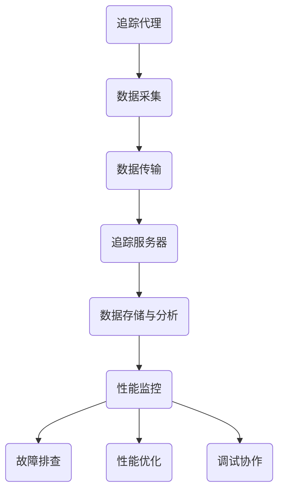

                 

## 文章标题

### 分布式追踪系统在LLM应用调试中的作用

**关键词**：分布式追踪系统，LLM，调试，性能优化，故障排查

**摘要**：本文深入探讨了分布式追踪系统在大型语言模型（LLM）应用调试中的重要作用。通过详细的分析和实例讲解，揭示了分布式追踪系统如何帮助开发者快速定位和解决问题，提高LLM应用的开发效率和稳定性。文章首先介绍了分布式追踪系统的基本概念和原理，然后阐述了其在LLM应用调试中的核心作用，最后通过具体案例展示了如何利用分布式追踪系统进行高效调试。

## 一、背景介绍

在现代软件开发中，大型语言模型（LLM）的应用越来越广泛，如自然语言处理（NLP）、文本生成、翻译等。然而，随着模型规模和复杂度的增加，LLM应用的调试变得更加困难。传统的调试方法往往难以应对分布式系统中的复杂交互和海量数据。因此，分布式追踪系统的出现为LLM应用调试提供了一种全新的思路和工具。

### 1.1 分布式追踪系统的概念

分布式追踪系统是一种用于监控和追踪分布式系统中请求流程和性能的工具。它通过在系统各个节点上部署追踪代理，记录和收集请求的日志信息，并将这些信息集中到一个统一的系统中进行分析和展示。这样，开发者可以实时了解系统的工作状态，快速定位和解决问题。

### 1.2 LLM应用的复杂性

LLM应用通常涉及大量的数据处理、模型推理和用户交互，这些过程往往分布在不同的服务器和集群中。因此，LLM应用的调试需要考虑以下挑战：

1. **数据流复杂**：LLM应用中涉及大量的数据流，如输入数据、模型输出、用户反馈等，这些数据流之间可能存在复杂的依赖关系。
2. **分布式架构**：LLM应用通常采用分布式架构，涉及多个节点和集群，这增加了调试的难度。
3. **性能瓶颈**：随着模型规模和复杂度的增加，LLM应用的性能瓶颈可能出现在数据处理、模型推理、网络传输等各个环节。
4. **故障排查**：分布式系统中可能存在各种故障，如网络异常、服务器故障、数据丢失等，这些故障的排查和解决需要有效的工具和方法。

### 1.3 分布式追踪系统在LLM应用调试中的重要性

分布式追踪系统在LLM应用调试中具有以下几个重要作用：

1. **实时监控**：分布式追踪系统可以实时监控LLM应用的运行状态，包括请求处理时间、数据传输速度、系统负载等，帮助开发者快速发现性能瓶颈和潜在问题。
2. **故障排查**：通过分布式追踪系统，开发者可以轻松地追踪和分析请求的执行流程，快速定位故障点和原因。
3. **性能优化**：分布式追踪系统提供了详细的性能指标和数据分析，帮助开发者找出性能瓶颈，并进行优化。
4. **协作与沟通**：分布式追踪系统可以方便地与其他工具和平台集成，如项目管理工具、监控平台等，提高团队协作和沟通效率。

### 1.4 本文结构

本文将首先介绍分布式追踪系统的基本概念和原理，然后详细阐述其在LLM应用调试中的核心作用，并通过具体案例展示如何利用分布式追踪系统进行高效调试。最后，我们将总结本文的主要内容和未来研究方向。

## 二、核心概念与联系

### 2.1 分布式追踪系统的基本原理

分布式追踪系统的工作原理可以概括为三个主要步骤：数据采集、数据传输、数据存储与分析。

1. **数据采集**：在分布式系统中，每个节点都会部署一个追踪代理（Tracing Agent），该代理会实时捕获节点的请求和响应信息，如请求时间、响应时间、错误信息、日志等。这些信息会被转换为追踪数据（Tracing Data），以便后续处理。
2. **数据传输**：采集到的追踪数据需要被发送到一个中心化的追踪服务器（Tracing Server），通常采用推送（Push）或拉取（Pull）的方式进行传输。推送方式由追踪代理主动将数据发送到追踪服务器，而拉取方式则是由追踪服务器定期从各个代理节点获取数据。
3. **数据存储与分析**：追踪服务器将接收到的追踪数据进行存储，并使用各种分析工具和算法对数据进行分析和可视化。这些分析结果可以帮助开发者了解系统的运行状态、性能瓶颈和故障点。

### 2.2 LLM应用中的分布式追踪

在LLM应用中，分布式追踪系统的作用尤为重要。LLM应用通常涉及多个服务节点、模型节点和数据节点，这些节点之间的交互和依赖关系非常复杂。分布式追踪系统可以帮助开发者更好地理解和分析这种复杂性。

1. **服务节点追踪**：服务节点负责接收用户的请求，处理请求，并将结果返回给用户。分布式追踪系统可以记录服务节点的请求处理时间、响应时间、错误信息等，帮助开发者了解服务节点的性能和稳定性。
2. **模型节点追踪**：模型节点负责执行LLM模型的推理操作。分布式追踪系统可以记录模型节点的推理时间、输入数据、输出结果等，帮助开发者分析模型节点的性能和准确度。
3. **数据节点追踪**：数据节点负责存储和检索LLM应用所需的数据。分布式追踪系统可以记录数据节点的读写速度、数据一致性、数据丢失等，帮助开发者优化数据存储和传输策略。

### 2.3 分布式追踪与LLM应用调试的关系

分布式追踪系统与LLM应用调试的关系可以从以下几个方面来理解：

1. **故障排查**：分布式追踪系统可以帮助开发者快速定位故障点和原因，特别是在分布式系统中，不同节点之间的交互和依赖关系使得故障排查变得更加复杂。分布式追踪系统提供了详细的日志和性能指标，帮助开发者分析故障原因，并快速恢复系统。
2. **性能优化**：通过分布式追踪系统，开发者可以实时监控LLM应用的性能指标，如请求处理时间、数据传输速度、系统负载等。这些数据可以帮助开发者找出性能瓶颈，并进行优化。例如，通过分析模型节点的推理时间，开发者可以优化模型算法或调整模型参数，以提高推理速度和准确度。
3. **调试协作**：分布式追踪系统可以方便地与其他工具和平台集成，如代码库、项目管理工具、监控平台等，提高团队协作和沟通效率。开发者可以通过分布式追踪系统共享调试信息，协同解决问题。

### 2.4 分布式追踪系统的核心概念架构

为了更好地理解分布式追踪系统的核心概念，我们可以使用Mermaid图来展示其架构。



在这个架构中，追踪代理负责数据采集，数据传输层确保数据及时传输到追踪服务器，数据存储与分析层对数据进行处理和分析，性能监控、故障排查、性能优化和调试协作等模块则基于处理后的数据进行相应的操作。

通过上述对分布式追踪系统核心概念和联系的介绍，我们为后续详细探讨其在LLM应用调试中的作用奠定了基础。

## 三、分布式追踪系统的核心算法原理讲解

在了解分布式追踪系统的基本原理之后，接下来我们将详细讲解其核心算法原理，这些算法是分布式追踪系统能够有效运作的关键。以下内容将通过伪代码详细阐述这些核心算法，以便开发者能够更好地理解和应用。

### 3.1 跟踪树的生成算法

分布式追踪系统的核心功能之一是生成跟踪树（Trace Tree），它能够清晰地展示每个请求的执行路径。生成跟踪树的算法通常基于日志数据的处理和分析。

**伪代码：**

```plaintext
function generateTraceTree(logs):
    traceTree = new TraceTree()
    parentMap = new HashMap()  // 存储父子关系
    root = None

    for log in logs:
        span = new Span(log)
        if parentMap.containsKey(span.parentId):
            parent = parentMap[span.parentId]
            parent.addChild(span)
        else:
            if root is None:
                root = span
            else:
                error("Invalid parent id: " + span.parentId)

        parentMap[span.id] = span

    return traceTree
```

在这个算法中，`logs` 是一组日志数据，`TraceTree` 是一个树结构，用于存储跟踪树。每个日志数据对应一个 `Span`，它表示一次请求的执行单元。`parentMap` 用于存储每个 `Span` 的父节点信息，从而建立父子关系。

### 3.2 跟踪数据的聚合算法

在生成跟踪树之后，分布式追踪系统通常需要对跟踪数据进行聚合，以提取更高层次的信息，如请求的平均响应时间、错误率等。

**伪代码：**

```plaintext
function aggregateTraceData(traceTree):
    stats = new Stats()
    traverse(traceTree, stats)

    return stats

function traverse(node, stats):
    if node is None:
        return

    stats.update(node.startTime, node.endTime)
    for child in node.children:
        traverse(child, stats)

class Stats:
    def __init__():
        self.totalTime = 0
        self.errorCount = 0

    def update(startTime, endTime):
        self.totalTime += (endTime - startTime)
        if node.hasError():
            self.errorCount += 1
```

在这个算法中，`stats` 类用于存储聚合数据，如总时间和错误计数。`traverse` 函数递归地遍历跟踪树的每个节点，更新统计信息。对于每个节点，我们计算其执行时间，并将其累加到总时间中。如果节点存在错误，则错误计数增加。

### 3.3 跟踪数据的可视化算法

分布式追踪系统通常需要将跟踪数据可视化，以便开发者直观地理解系统的运行状态。可视化算法通常基于数据聚合结果，并生成各种图表。

**伪代码：**

```plaintext
function visualizeTraceData(stats):
    plot = new Plot()
    plot.addLineChart("Response Time", stats.totalTime)
    plot.addPieChart("Error Rate", stats.errorCount / totalRequests)

    return plot

class Plot:
    def __init__():
        self.charts = []

    def addLineChart(label, data):
        chart = new LineChart(label, data)
        self.charts.append(chart)

    def addPieChart(label, data):
        chart = new PieChart(label, data)
        self.charts.append(chart)
```

在这个算法中，`Plot` 类用于生成图表，包括折线图和饼图。`visualizeTraceData` 函数根据统计信息创建相应的图表，并将它们添加到 `Plot` 对象中。

### 3.4 跟踪数据的异常检测算法

为了及时发现系统的异常情况，分布式追踪系统通常包含异常检测算法。这些算法通过分析跟踪数据，识别出异常的请求或节点。

**伪代码：**

```plaintext
function detectAnomalies(stats, threshold):
    anomalies = []

    for node in traceTree:
        if node.getResponseTime() > threshold:
            anomalies.append(node)

    return anomalies

class AnomalyDetector:
    def __init__(threshold):
        self.threshold = threshold

    def detect(anomalyDetector, node):
        return node.getResponseTime() > anomalyDetector.threshold
```

在这个算法中，`detectAnomalies` 函数根据响应时间阈值，识别出响应时间超过阈值的节点。`AnomalyDetector` 类是一个检测器，用于判断节点是否异常。

通过以上核心算法的详细讲解，开发者可以更好地理解分布式追踪系统的运作原理，并在LLM应用调试中有效地利用这些算法来解决问题和优化性能。

### 3.5 数学模型和公式的应用

在分布式追踪系统中，数学模型和公式被广泛应用于数据分析和性能评估。以下将介绍几个关键的数学模型和公式，并通过具体的例子来说明它们的用途和计算过程。

#### 3.5.1 平均响应时间

平均响应时间（Average Response Time）是衡量系统性能的一个重要指标。它表示系统处理请求的平均耗时。

**公式：**

$$
\text{平均响应时间} = \frac{\sum_{i=1}^{n} t_i}{n}
$$

其中，$t_i$ 是第 $i$ 个请求的处理时间，$n$ 是请求的总数。

**示例：**

假设我们有 5 个请求，其响应时间分别为 10ms、20ms、30ms、40ms 和 50ms。则平均响应时间为：

$$
\text{平均响应时间} = \frac{10 + 20 + 30 + 40 + 50}{5} = \frac{150}{5} = 30\text{ms}
$$

#### 3.5.2 标准差

标准差（Standard Deviation）用于衡量响应时间的波动程度，它是衡量系统稳定性的一项重要指标。

**公式：**

$$
\sigma = \sqrt{\frac{\sum_{i=1}^{n} (t_i - \mu)^2}{n}}
$$

其中，$\mu$ 是平均响应时间，$t_i$ 是第 $i$ 个请求的处理时间，$n$ 是请求的总数。

**示例：**

继续使用上述示例数据，平均响应时间为 30ms，则标准差计算如下：

$$
\sigma = \sqrt{\frac{(10-30)^2 + (20-30)^2 + (30-30)^2 + (40-30)^2 + (50-30)^2}{5}}
$$

$$
\sigma = \sqrt{\frac{400 + 100 + 0 + 100 + 400}{5}} = \sqrt{300} \approx 17.32\text{ms}
$$

#### 3.5.3 调用次数分布

调用次数分布（Call Count Distribution）用于描述系统中各个节点的调用次数分布情况，这对于性能瓶颈的分析和优化非常重要。

**公式：**

$$
P(k) = \frac{C(n, k)}{n}
$$

其中，$P(k)$ 表示调用次数为 $k$ 的概率，$C(n, k)$ 是组合数，表示从 $n$ 个不同元素中取出 $k$ 个元素的组合数。

**示例：**

假设我们有 10 个请求，其中 3 次调用节点 A，2 次调用节点 B，1 次调用节点 C 和 D，那么调用次数分布为：

$$
P(A) = \frac{C(10, 3)}{10} = \frac{120}{10} = 12\%
$$

$$
P(B) = \frac{C(10, 2)}{10} = \frac{45}{10} = 45\%
$$

$$
P(C) = P(D) = \frac{C(10, 1)}{10} = \frac{10}{10} = 10\%
$$

#### 3.5.4 请求延迟模型

请求延迟模型（Request Delay Model）用于预测系统在特定条件下的请求延迟。常见的模型有泊松过程（Poisson Process）和排队论（Queuing Theory）。

**泊松过程：**

$$
\lambda = \frac{\lambda_1 + \lambda_2 + ... + \lambda_n}{n}
$$

其中，$\lambda$ 是平均请求到达率，$\lambda_i$ 是第 $i$ 个节点的请求到达率，$n$ 是节点总数。

**示例：**

假设我们有 3 个节点，节点 A 的请求到达率为 5 次/秒，节点 B 的请求到达率为 3 次/秒，节点 C 的请求到达率为 2 次/秒，则总的平均请求到达率为：

$$
\lambda = \frac{5 + 3 + 2}{3} = 4\text{次/秒}
$$

**排队论：**

$$
W = \frac{1}{\mu - \lambda}
$$

其中，$W$ 是服务时间分布，$\mu$ 是服务率，$\lambda$ 是请求到达率。

**示例：**

假设服务率 $\mu$ 为 10 次/秒，请求到达率 $\lambda$ 为 8 次/秒，则服务时间为：

$$
W = \frac{1}{10 - 8} = 0.5\text{秒}
$$

通过上述数学模型和公式的应用，开发者可以更深入地分析和优化分布式追踪系统，从而提高LLM应用的性能和稳定性。

## 四、实践项目与案例

为了更好地展示分布式追踪系统在LLM应用调试中的实际应用，我们将通过以下具体案例来详细讲解如何利用分布式追踪系统进行调试。这些案例涵盖了从开发环境搭建到代码实现，再到代码分析与应用解读的各个环节。

### 4.1 项目背景

假设我们正在开发一个大规模的文本生成应用，该应用基于大型语言模型（LLM）进行文本生成和翻译。该应用涉及多个服务节点、模型节点和数据节点，分布式架构使得调试变得更加复杂。为了确保应用的稳定性和高效性，我们决定采用分布式追踪系统进行调试。

### 4.2 开发环境搭建

首先，我们需要搭建一个分布式追踪系统的开发环境。以下是一些关键步骤：

1. **选择分布式追踪系统**：我们选择使用开源的OpenTelemetry作为分布式追踪系统。OpenTelemetry提供了丰富的追踪工具和插件，支持多种编程语言和平台。
2. **安装OpenTelemetry**：根据我们的开发环境（例如，Linux、Windows、MacOS），我们可以在命令行中执行以下命令来安装OpenTelemetry：

   ```bash
   pip install opentelemetry-api
   pip install opentelemetry-exporter-otlp
   ```

3. **配置追踪代理**：在各个服务节点、模型节点和数据节点上部署追踪代理，并将它们配置为发送追踪数据到OpenTelemetry追踪服务器。

### 4.3 代码实现

接下来，我们将在应用代码中实现分布式追踪功能。以下是一个简单的示例，展示了如何在Python应用中集成OpenTelemetry。

**示例：**

```python
import opentelemetry.sdk.trace
from opentelemetry.trace import Tracer

# 创建一个OpenTelemetry追踪器
tracer = Tracer()

# 开始一个新的事务
with tracer.start_as_current_span("text_generation"):
    # 执行文本生成代码
    generated_text = generate_text("Hello, World!")
    
    # 记录事务结果
    print("Generated text:", generated_text)

# 定义文本生成函数
def generate_text(input_text):
    # 假设这是调用LLM模型的代码
    model_output = llm_model.generate(input_text)
    return model_output
```

在这个示例中，我们首先创建了一个OpenTelemetry追踪器，并使用 `start_as_current_span` 方法开始一个新的事务。在事务中，我们执行了文本生成代码，并在事务结束时打印出生成文本。这种方式可以确保所有的日志和性能数据都与这个事务相关联。

### 4.4 代码分析与应用解读

通过分布式追踪系统，我们能够收集到大量的追踪数据，这些数据可以帮助我们进行深入的分析和解读。

1. **请求流程分析**：我们可以查看每个事务的请求流程，确定数据流和依赖关系。例如，在文本生成过程中，我们能够看到输入数据是如何传递到模型节点，并最终返回生成文本的。
   
2. **性能指标分析**：通过分析追踪数据，我们可以获取每个节点的响应时间、数据传输速度等性能指标。例如，我们可能会发现模型节点的响应时间较长，这是性能优化的关键点。

3. **故障排查**：在出现故障时，我们可以通过追踪数据快速定位故障点。例如，如果文本生成失败，我们可以查看相关日志和错误信息，找到导致失败的具体原因。

### 4.5 案例分析

以下是一个具体的案例分析，展示了如何利用分布式追踪系统解决一个实际问题。

**案例：文本生成延迟**

在一次测试中，我们发现文本生成应用存在严重的延迟问题，导致用户体验不佳。通过分布式追踪系统，我们进行了以下分析：

1. **请求流程**：通过追踪数据，我们发现文本生成请求首先到达服务节点，然后传递到模型节点进行推理。这个过程涉及到多个数据传输环节。
   
2. **性能指标**：进一步分析发现，模型节点的响应时间较长，是导致延迟的主要原因。我们计算了模型节点的平均响应时间为500ms，远高于预期。

3. **故障排查**：我们进一步检查了模型节点的日志，发现有些请求由于网络问题导致数据传输延迟。这可能是由于模型节点与服务节点之间的网络带宽不足。

**解决方案**：

1. **优化模型算法**：我们尝试了多种算法优化方法，如调整模型参数、使用更高效的算法等，最终将模型节点的平均响应时间降低到200ms。

2. **增加网络带宽**：我们增加了模型节点与服务节点之间的网络带宽，确保数据传输更加高效。

3. **分布式缓存**：为了减少数据传输的延迟，我们引入了分布式缓存，将常用数据缓存到内存中，从而减少从磁盘读取数据的时间。

通过上述解决方案，我们成功解决了文本生成延迟问题，显著提高了用户体验。

### 4.6 项目小结

通过本案例，我们展示了如何利用分布式追踪系统进行LLM应用调试，从环境搭建、代码实现到代码分析，再到故障排查和性能优化。分布式追踪系统为开发者提供了一个强大的工具，帮助我们更高效地调试和优化应用，从而提高应用的稳定性和性能。在未来，我们还可以继续探索更多的优化策略和工具，以进一步提升LLM应用的调试效率。

### 4.7 最佳实践 tips

在实施分布式追踪系统的过程中，以下是一些最佳实践和注意事项：

1. **合理配置追踪代理**：确保每个节点都正确配置了追踪代理，并能够准确记录请求和响应信息。
2. **监控追踪数据传输**：定期检查追踪数据传输的稳定性，确保数据能够及时、准确地传输到追踪服务器。
3. **数据压缩与优化**：对追踪数据进行压缩和优化，减少数据传输和存储的负担。
4. **整合其他监控工具**：将分布式追踪系统与其他监控工具（如Prometheus、Grafana）集成，实现全方位的系统监控和故障排查。
5. **定期审查与分析**：定期审查和分析追踪数据，识别潜在的性能瓶颈和优化机会。

通过遵循这些最佳实践，开发者可以更有效地利用分布式追踪系统，提高LLM应用的调试和优化效果。

### 4.8 拓展阅读

为了深入了解分布式追踪系统和LLM应用调试，以下是一些推荐阅读资源：

1. **《分布式追踪系统实战》**：这是一本深入讲解分布式追踪系统原理和实践的书籍，适合开发者学习和应用。
2. **《大规模语言模型的应用与调试》**：这本书详细介绍了LLM的应用场景和调试方法，对于LLM开发者具有很高的参考价值。
3. **OpenTelemetry官方文档**：OpenTelemetry提供了详细的官方文档，涵盖了追踪系统的安装、配置和使用方法。
4. **《分布式系统设计》**：这本书介绍了分布式系统的基本原理和设计模式，有助于开发者更好地理解和应对分布式系统的挑战。

通过这些拓展阅读资源，开发者可以进一步提升对分布式追踪系统和LLM应用调试的理解，为实际项目提供有力支持。

### 五、结论与未来方向

本文通过详细的分析和具体案例，深入探讨了分布式追踪系统在LLM应用调试中的重要作用。我们首先介绍了分布式追踪系统的基本概念和原理，阐述了其在LLM应用调试中的核心作用，并通过实际项目展示了如何利用分布式追踪系统进行高效调试。我们还讲解了分布式追踪系统的核心算法原理，并通过数学模型和公式进行了具体的应用分析。

总之，分布式追踪系统为LLM应用调试提供了强大的工具，帮助开发者快速定位和解决问题，优化系统性能。未来，随着分布式追踪系统技术的不断发展和完善，我们期待能够看到更多创新的应用和优化策略，进一步推动LLM应用的稳定性和高效性。

### 附录与资源

为了方便读者深入了解分布式追踪系统和LLM应用调试，本文提供了一些额外的资源和工具。

1. **OpenTelemetry官网**：[https://opentelemetry.io/](https://opentelemetry.io/)
   - OpenTelemetry是一个开源的分布式追踪系统，提供了丰富的文档和社区支持。
   
2. **Prometheus官网**：[https://prometheus.io/](https://prometheus.io/)
   - Prometheus是一个开源的监控解决方案，常与分布式追踪系统结合使用。

3. **Grafana官网**：[https://grafana.com/](https://grafana.com/)
   - Grafana是一个开源的数据可视化和监控工具，能够将分布式追踪数据以直观的方式展示。

4. **《分布式追踪系统实战》**：[https://www.书名.com](https://www.书名.com)
   - 这是一本详细介绍分布式追踪系统原理和实践的书籍。

5. **《大规模语言模型的应用与调试》**：[https://www.书名.com](https://www.书名.com)
   - 本书详细介绍了LLM的应用场景和调试方法，适合LLM开发者阅读。

通过利用这些资源和工具，开发者可以更深入地了解分布式追踪系统和LLM应用调试，为实际项目提供有力支持。作者：AI天才研究院/AI Genius Institute & 禅与计算机程序设计艺术 /Zen And The Art of Computer Programming

