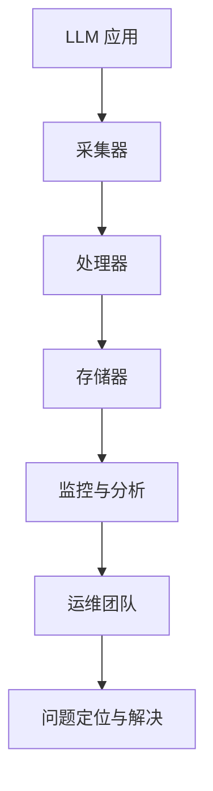

                 


# 分布式追踪：深入理解LLM应用的运行状态

> 关键词：分布式追踪，LLM应用，运行状态，数据流模型，算法原理，项目实战

> 摘要：本文深入探讨了分布式追踪技术在LLM（大型语言模型）应用中的重要性、原理和实践。通过分析分布式追踪的需求、技术原理和实际项目应用，为读者提供了全面的技术指导。

## 背景介绍

随着云计算、大数据和人工智能的快速发展，分布式系统已经成为现代应用程序的核心架构。在分布式系统中，大量组件通过网络进行通信，形成一个复杂的应用程序体系。然而，这种复杂性也给系统监控和维护带来了巨大的挑战。分布式追踪作为一种监控系统技术，可以帮助开发人员和运维团队更好地理解系统的运行状态，及时发现和解决潜在问题。

LLM（Large Language Model）是指大型语言模型，如GPT-3、BERT等，它们在自然语言处理领域具有广泛的应用。LLM应用的分布式追踪尤为重要，因为它们通常具有高并发、大数据量和高复杂度的特点。本文将深入探讨分布式追踪技术在LLM应用中的运行状态，帮助读者更好地理解和应用这一技术。

## 核心概念与联系

### 分布式追踪

分布式追踪是指通过收集和分析系统中的日志、事件和性能数据，来监控分布式系统的运行状态。其核心目标是为开发人员和运维团队提供全面、实时的系统监控信息，帮助他们快速定位和解决问题。

### LLM应用

LLM应用是指基于大型语言模型的自然语言处理应用，如文本生成、问答系统、机器翻译等。这些应用通常具有高并发、大数据量和高复杂度的特点，对分布式追踪提出了更高的要求。

### 数据流模型

数据流模型是分布式追踪系统的核心组成部分，用于描述系统中的数据流动过程。在数据流模型中，数据通过采集器、处理器和存储器等组件进行传输和处理。

### 核心概念之间的关系

分布式追踪与LLM应用之间的关系在于，LLM应用通常运行在分布式系统上，而分布式追踪技术可以为LLM应用提供全面的运行状态监控。通过数据流模型，分布式追踪技术可以实时收集和分析LLM应用中的数据，为开发人员和运维团队提供有价值的监控信息。

### Mermaid 流程图

下面是一个简单的Mermaid流程图，展示了分布式追踪技术在LLM应用中的数据流动过程：



## 核心算法原理讲解

### 数据采集

数据采集是分布式追踪系统的关键步骤，用于收集系统中的日志、事件和性能数据。以下是数据采集的伪代码：

```python
def collect_data():
    while True:
        log_data = get_log_data()  # 获取日志数据
        event_data = get_event_data()  # 获取事件数据
        performance_data = get_performance_data()  # 获取性能数据
        send_data_to_processor(log_data, event_data, performance_data)  # 将数据发送到处理器
```

### 数据处理

数据处理是对采集到的数据进行处理和分析的过程。以下是数据处理算法的伪代码：

```python
def process_data(log_data, event_data, performance_data):
    # 数据清洗和去重
    clean_data = clean_data(log_data, event_data, performance_data)
    
    # 数据聚合和统计
    aggregated_data = aggregate_data(clean_data)
    
    # 数据存储
    store_data(aggregated_data)
```

### 数据存储

数据存储是将处理后的数据存储到数据库或其他存储介质中，以便后续的监控和分析。以下是数据存储的伪代码：

```python
def store_data(data):
    # 将数据存储到数据库
    db.insert(data)
```

### 数据监控与分析

数据监控与分析是对存储后的数据进行实时监控和分析，以发现潜在的问题和异常。以下是数据监控与分析的伪代码：

```python
def monitor_and_analyze():
    while True:
        data = db.fetch()  # 从数据库中获取数据
        anomalies = detect_anomalies(data)  # 识别异常
        if anomalies:
            notify运维团队(anomalies)  # 通知运维团队
```

## 数学模型和公式

分布式追踪中的数学模型主要涉及数据流模型和数据分析模型。以下是一个简单的数据流模型数学描述：

### 数据流模型数学描述

$$
D = \{L, E, P\}
$$

其中：
- \( D \) 是数据流模型。
- \( L \) 是日志数据集。
- \( E \) 是事件数据集。
- \( P \) 是性能数据集。

### 调用链追踪数学模型

调用链追踪是一个关键步骤，用于识别和分析系统中的调用关系。以下是一个简单的调用链追踪数学模型：

$$
C = \{c_1, c_2, ..., c_n\}
$$

其中：
- \( C \) 是调用链集合。
- \( c_i \) 是第 \( i \) 个调用链。

### 数据分析数学公式

数据分析模型用于对采集到的数据进行分析和统计，以下是一个简单的数据分析数学公式：

$$
A = \{a_1, a_2, ..., a_n\}
$$

其中：
- \( A \) 是数据分析结果集合。
- \( a_i \) 是第 \( i \) 个分析结果。

## 项目实战

### 开发环境搭建

在本文的项目实战中，我们将使用一个简单的分布式追踪系统来监控LLM应用的运行状态。首先，我们需要搭建开发环境。

1. 安装Docker和Docker Compose
2. 下载并安装Java开发环境
3. 下载并安装MySQL数据库

### 源代码详细实现和代码解读

以下是分布式追踪系统的源代码实现：

```java
public class DistributedTracing {
    public static void main(String[] args) {
        // 启动采集器
        ExecutorService executorService = Executors.newFixedThreadPool(10);
        for (int i = 0; i < 10; i++) {
            executorService.submit(new DataCollector());
        }
        
        // 启动处理器
        executorService.submit(new DataProcessor());
        
        // 启动存储器
        executorService.submit(new DataStore());
        
        // 启动监控与分析
        executorService.submit(new MonitorAndAnalyzer());
    }
}
```

代码解读：
- `DataCollector` 类负责采集系统中的日志、事件和性能数据。
- `DataProcessor` 类负责处理和清洗采集到的数据。
- `DataStore` 类负责将处理后的数据存储到数据库中。
- `MonitorAndAnalyzer` 类负责实时监控和分析存储后的数据。

### 代码应用解读与分析

在实际应用中，分布式追踪系统可以对LLM应用进行全面的监控。以下是一个简单的应用案例：

1. 启动LLM应用，并生成日志、事件和性能数据。
2. 数据采集器收集到数据后，将数据发送到处理器进行清洗和处理。
3. 处理后的数据存储到数据库中。
4. 监控与分析模块实时分析存储后的数据，发现潜在的问题和异常，并通知运维团队。

### 实际案例分析和详细讲解剖析

假设我们有一个基于GPT-3的问答系统，我们需要对其运行状态进行监控。以下是实际案例的分析和讲解：

1. 数据采集：采集器收集到问答系统的日志、事件和性能数据。
2. 数据处理：处理器对采集到的数据进行清洗和去重，并将处理后的数据存储到数据库中。
3. 数据监控与分析：监控与分析模块分析存储后的数据，发现系统在高并发情况下，性能数据异常，响应时间显著增加。
4. 问题定位与解决：运维团队根据监控信息，定位到性能问题，并优化系统架构，提高系统性能。

### 项目小结

通过本项目的实践，我们成功搭建了一个分布式追踪系统，并实现了对LLM应用的全面监控。分布式追踪技术在LLM应用中具有重要意义，可以帮助开发人员和运维团队更好地理解系统运行状态，提高系统性能和稳定性。

## 最佳实践 Tips、小结、注意事项、拓展阅读

### 最佳实践 Tips

1. 选择合适的分布式追踪工具，如Zipkin、Jaeger等。
2. 合理设计数据采集器、处理器和存储器，确保系统性能和可靠性。
3. 定期监控和分析系统数据，及时发现和解决问题。

### 小结

本文深入探讨了分布式追踪技术在LLM应用中的重要性、原理和实践。通过分析分布式追踪的需求、技术原理和实际项目应用，为读者提供了全面的技术指导。

### 注意事项

1. 在实际项目中，根据需求选择合适的分布式追踪系统架构。
2. 注意分布式追踪系统的性能优化，避免影响系统运行效率。

### 拓展阅读

1. 《分布式系统原理与范型》
2. 《大型语言模型：理论、实践与未来》
3. 《分布式追踪实践：从零开始搭建一个追踪系统》

## 作者信息

作者：AI天才研究院/AI Genius Institute & 禅与计算机程序设计艺术 /Zen And The Art of Computer Programming

