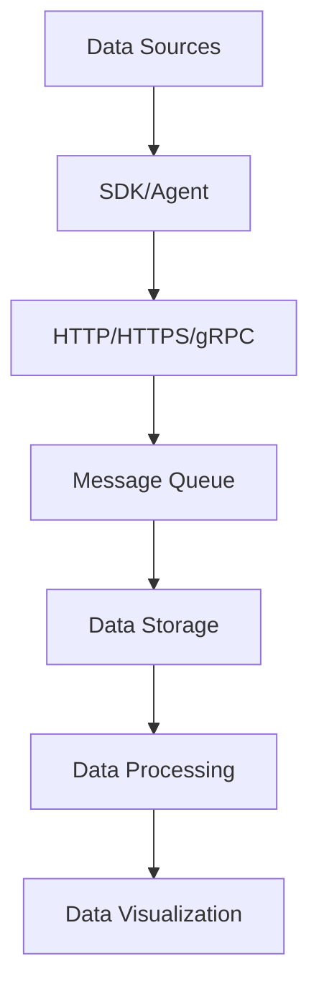

                 

### 文章标题

# 分布式追踪：诊断AI服务性能问题的利器

### 关键词

- 分布式追踪
- AI服务
- 性能诊断
- 微服务
- 性能优化

### 摘要

本文旨在深入探讨分布式追踪在诊断AI服务性能问题中的应用。随着人工智能技术的广泛应用，AI服务的性能问题愈发突出。分布式追踪作为一种强大的监控工具，能够帮助我们精准地定位和解决这些问题。本文将首先介绍分布式追踪的基本概念和核心原理，随后详细解析其在AI服务性能诊断中的实际应用。通过案例分析，我们将展示如何利用分布式追踪技术优化AI服务的性能，最终提供一些实用的最佳实践和拓展阅读，以帮助读者更好地掌握这一技术。

## 分布式追踪简介

分布式追踪是一种监控和诊断分布式系统性能的有效手段。在复杂的应用系统中，服务往往被拆分成多个微服务，这些微服务可能分布在不同的服务器或集群中，彼此之间通过网络进行通信。由于系统的复杂性增加，单个服务的问题很难通过简单的调试和监控手段发现。分布式追踪通过跟踪系统内部各个服务的交互过程，帮助我们深入了解整个系统的运行状态，从而快速定位和解决问题。

### 分布式追踪的背景与起源

随着互联网技术的飞速发展和云计算的普及，分布式系统成为现代应用架构的主流。微服务架构、容器化技术、Kubernetes等新兴技术的广泛应用，使得分布式系统的规模和复杂性急剧增加。传统的监控和调试工具逐渐暴露出许多局限性，难以应对复杂分布式环境下的性能问题。分布式追踪技术正是在这样的背景下应运而生。

分布式追踪的起源可以追溯到2008年，谷歌公司首次公开了其内部使用的分布式追踪系统Dapper。Dapper的提出标志着分布式追踪技术的诞生，并引发了广泛关注。随后，开源社区中涌现出了许多分布式追踪系统，如OpenTracing、Zipkin、Jaeger等，为不同场景下的分布式系统监控提供了丰富的选择。

### 分布式追踪的目的与作用

分布式追踪的主要目的是诊断分布式系统的性能问题，提高系统的稳定性和可扩展性。具体来说，分布式追踪具有以下作用：

1. **问题定位**：通过跟踪系统内部各个服务的交互过程，快速定位性能瓶颈和故障点，缩短问题排查时间。
2. **性能优化**：通过分析分布式追踪数据，发现系统的性能瓶颈，提出优化建议，提升系统整体性能。
3. **服务依赖关系分析**：揭示系统内部各个服务的依赖关系，帮助开发者理解系统结构，优化服务划分和部署。
4. **日志聚合与可视化**：将分布式系统中的日志数据统一聚合和可视化，提供直观的监控界面，方便开发者实时掌握系统运行状态。

### 分布式追踪的发展历程

分布式追踪技术的发展历程可以分为以下几个阶段：

1. **日志收集**：早期的分布式系统主要依赖日志收集工具，如Logstash、Fluentd等，将系统日志聚合到中央日志服务器进行分析。然而，这种方法存在日志数据量大、分析难度高、响应速度慢等问题。
2. **追踪系统**：随着分布式追踪技术的兴起，如Google的Dapper、OpenTracing、Zipkin、Jaeger等分布式追踪系统相继诞生。这些系统通过跟踪服务调用链，提供更高效的性能监控和问题诊断能力。
3. **容器化与云原生**：随着容器化和云原生技术的发展，分布式追踪系统逐渐与Kubernetes等容器编排工具集成，支持动态环境下的分布式系统监控和优化。
4. **智能化与自动化**：近年来，随着人工智能技术的发展，分布式追踪系统开始引入机器学习算法，实现自动性能优化和故障预测，进一步提高系统智能化水平。

## 分布式追踪的核心概念与联系

在深入探讨分布式追踪技术之前，了解其核心概念和相互之间的联系是非常重要的。分布式追踪系统通常涉及以下概念：Trace、Span、Annotation等。通过理解这些概念，我们将能够更好地掌握分布式追踪的原理和应用。

### Trace

Trace（追踪）是分布式追踪系统的基本单位，表示一个完整的请求或操作在整个分布式系统中的执行过程。一个Trace通常包含多个Span，每个Span代表系统中的一个服务调用或操作。Trace是分布式追踪的核心概念，通过Trace，我们能够追踪一个请求在分布式系统中的完整路径。

### Span

Span（跨度）是Trace的子单位，代表分布式系统中的一次具体操作或服务调用。每个Span都有一个唯一的ID，用于标识其在整个追踪过程中的唯一性。Span通常包含以下信息：

- **Trace ID**：表示整个Trace的唯一标识。
- **Span ID**：表示当前Span的唯一标识。
- **Parent ID**：表示当前Span的父Span ID，用于构建调用链。
- **操作名称**：表示当前Span所执行的操作或服务名称。
- **开始时间和结束时间**：表示当前Span的开始和结束时间。

通过Span，我们能够追踪分布式系统中每个服务调用的详细情况，构建出完整的调用链。

### Annotation

Annotation（注解）是分布式追踪系统中的另一种重要概念，用于记录Trace和Span的详细信息。Annotation通常包含以下信息：

- **事件名称**：表示当前Annotation所记录的事件类型，如发送请求、接收响应等。
- **时间戳**：表示当前Annotation发生的时间。
- **附加信息**：表示当前Annotation的附加信息，如错误信息、请求头等。

通过Annotation，我们能够记录分布式系统中各个服务调用过程中的关键事件，提供更详细的数据用于性能分析和故障诊断。

### Trace ID、Span ID、Parent ID的关系

Trace ID、Span ID和Parent ID是分布式追踪系统中的三个关键标识符，它们共同构建出完整的调用链。

- **Trace ID**：表示一个Trace的唯一标识，整个分布式系统中每个Trace的ID都是唯一的。
- **Span ID**：表示一个Span的唯一标识，每个Span在系统中都有唯一的ID。
- **Parent ID**：表示当前Span的父Span ID，用于构建调用链。一个Span的Parent ID为空，表示它是整个Trace的起点。

通过Trace ID、Span ID和Parent ID，我们能够构建出完整的调用链，追踪一个请求在分布式系统中的执行过程。

### 标签（Tags）与元数据

除了Trace、Span和Annotation，分布式追踪系统还支持标签（Tags）和元数据（Metadata）的使用。标签是一种用于扩展追踪数据的方式，可以附加到Trace、Span或Annotation上，用于记录更多的详细信息。元数据则是系统内部用于描述追踪数据的数据结构。

标签通常包含以下属性：

- **键（Key）**：表示标签的名称。
- **值（Value）**：表示标签的具体内容。

通过标签，我们能够为Trace、Span和Annotation附加更多的信息，如服务版本、请求头、错误信息等。这些信息有助于更详细地分析和诊断分布式系统中的问题。

元数据则是分布式追踪系统内部用于描述追踪数据的数据结构，通常包含以下字段：

- **Trace ID**：表示当前追踪的唯一标识。
- **Span ID**：表示当前Span的唯一标识。
- **Parent ID**：表示当前Span的父Span ID。
- **操作名称**：表示当前Span所执行的操作或服务名称。
- **开始时间和结束时间**：表示当前Span的开始和结束时间。
- **标签列表**：表示当前Span或Annotation所附加的标签列表。

通过元数据和标签，分布式追踪系统能够更全面地记录分布式系统的运行状态，为性能分析和故障诊断提供丰富的数据支持。

### 分布式追踪架构设计

分布式追踪系统是一种用于监控和诊断分布式系统性能的重要工具，其架构设计直接影响到追踪的效率和准确性。一个典型的分布式追踪系统通常包括数据采集、数据传输、数据存储、数据处理和可视化等几个关键环节。

#### 数据采集

数据采集是分布式追踪系统的第一步，主要任务是从分布式系统的各个节点（如微服务实例、容器等）收集追踪数据。数据采集通常有以下几种方式：

1. **SDK集成**：开发者在应用代码中集成追踪SDK，通过SDK自动收集和发送追踪数据。这种方式能够确保数据的一致性和准确性，但需要开发者手动集成SDK，增加了开发成本。
2. **代理（Agent）**：部署在分布式系统中的代理组件，负责监控和收集追踪数据，然后将其发送到追踪系统。这种方式无需修改应用代码，但需要部署和维护额外的代理组件，增加了系统的复杂度。
3. **日志收集**：通过日志收集工具（如Logstash、Fluentd等）收集系统日志，然后从中提取追踪数据。这种方式适用于已有日志收集系统的场景，但可能存在日志格式不统一、数据丢失等问题。

#### 数据传输

数据传输是将采集到的追踪数据从数据源发送到追踪系统的过程。数据传输的方式通常有以下几种：

1. **HTTP/HTTPS**：通过HTTP/HTTPS协议将追踪数据发送到追踪系统。这种方式简单易用，但可能存在网络延迟和安全性问题。
2. **gRPC**：使用gRPC协议进行数据传输。gRPC是一种高性能、跨语言的RPC框架，能够提供更快的传输速度和更好的安全性。
3. **消息队列**：通过消息队列（如Kafka、RabbitMQ等）将追踪数据传输到追踪系统。这种方式能够实现异步传输，降低系统负载，但可能存在数据丢失和顺序问题。

#### 数据存储

数据存储是将接收到的追踪数据持久化存储的过程。分布式追踪系统通常使用以下几种数据存储方式：

1. **关系数据库**：将追踪数据存储在关系数据库（如MySQL、PostgreSQL等）中。这种方式能够提供高效的数据查询能力和事务支持，但可能存在数据规模限制。
2. **NoSQL数据库**：将追踪数据存储在NoSQL数据库（如Cassandra、MongoDB等）中。这种方式能够处理大规模数据存储和查询需求，但可能存在数据一致性问题。
3. **时序数据库**：将追踪数据存储在时序数据库（如InfluxDB、OpenTSDB等）中。这种方式专门为时序数据存储设计，能够提供高效的数据查询和实时分析能力。

#### 数据处理

数据处理是将存储的追踪数据进行预处理和分析的过程。分布式追踪系统通常包含以下数据处理任务：

1. **数据聚合**：将相同Trace或Span的多个数据记录合并为一个数据集，提高数据分析的效率。
2. **数据清洗**：去除无效或错误的数据记录，保证数据分析的准确性。
3. **数据转换**：将原始数据转换为适合分析和可视化的格式，如JSON、CSV等。
4. **数据归一化**：将不同数据源的数据进行归一化处理，使其具有统一的量纲和单位。

#### 数据可视化

数据可视化是将处理后的追踪数据以图形化方式展示的过程，帮助开发者更直观地理解和分析系统性能。分布式追踪系统通常提供以下可视化功能：

1. **调用链可视化**：展示分布式系统的调用链结构，帮助开发者理解系统内部的服务依赖关系。
2. **性能指标可视化**：展示系统的性能指标，如响应时间、吞吐量等，帮助开发者发现性能瓶颈。
3. **错误率可视化**：展示系统的错误率分布，帮助开发者定位故障点和优化方向。
4. **拓扑图可视化**：展示分布式系统的拓扑结构，帮助开发者了解系统节点的分布和连接关系。

### 分布式追踪系统架构示例

下面是一个简单的分布式追踪系统架构示例，展示了数据采集、数据传输、数据存储、数据处理和数据可视化等环节之间的交互关系：



在这个示例中，分布式系统的数据源通过SDK或Agent组件进行数据采集，采集到的数据通过HTTP/HTTPS/gRPC协议或消息队列进行传输，最终存储在数据库中。数据处理模块对数据进行聚合、清洗、转换和归一化处理，然后将处理后的数据可视化展示给开发者。

通过理解分布式追踪系统的架构设计，开发者能够更好地选择适合自己系统的追踪方案，实现高效、准确的分布式系统监控和性能优化。

## 分布式追踪算法原理

分布式追踪系统的核心在于如何高效地采集、处理和展示追踪数据。这涉及到一系列算法和技术，包括追踪算法、负载均衡算法和资源利用率优化算法。下面将详细探讨这些算法的原理，并辅以伪代码和数学模型进行解释。

### 追踪算法原理

追踪算法是分布式追踪系统的核心，用于记录和追踪分布式系统中的服务调用链。常见的追踪算法包括基于时间戳的追踪算法和基于事件流的追踪算法。

#### 基于时间戳的追踪算法

基于时间戳的追踪算法通过记录每个Span的开始时间和结束时间，构建出整个Trace的执行路径。以下是一个基于时间戳的追踪算法的伪代码：

```python
def timestamp_based_tracing(spans):
    trace = []
    for span in sorted(spans, key=lambda s: s.start_time):
        if not trace or span.parent_id == trace[-1].span_id:
            trace.append(span)
    return trace
```

在这个算法中，`spans`是一个包含所有Span对象的列表，`trace`用于存储构建出的调用链。算法首先对所有Span按照开始时间进行排序，然后遍历排序后的Span列表，根据父Span ID构建出完整的调用链。

#### 基于事件流的追踪算法

基于事件流的追踪算法通过记录事件发生的时间顺序，构建出整个Trace的执行路径。以下是一个基于事件流的追踪算法的伪代码：

```python
def event_based_tracing(events):
    trace = []
    current_span = None
    for event in sorted(events, key=lambda e: e.timestamp):
        if event.type == "start":
            current_span = Span(event.span_id, event.parent_id, event.name, event.timestamp)
            trace.append(current_span)
        elif event.type == "end":
            for span in trace:
                if span.span_id == event.span_id:
                    span.end_time = event.timestamp
                    break
    return trace
```

在这个算法中，`events`是一个包含所有事件对象的列表，`trace`用于存储构建出的调用链。算法首先对所有事件按照时间戳进行排序，然后根据事件类型构建出完整的调用链。

### 负载均衡算法原理

负载均衡算法用于在分布式系统中分配服务调用，确保系统资源的合理利用和性能的优化。常见的负载均衡算法包括轮询算法、最少连接算法和加权轮询算法。

#### 轮询算法

轮询算法是最简单的负载均衡算法，它依次将请求分配给各个服务实例。以下是一个轮询算法的伪代码：

```python
def round_robin.services(services, request):
    index = (request.index + 1) % len(services)
    return services[index]
```

在这个算法中，`services`是一个包含所有服务实例的列表，`request`是一个表示当前请求的对象，`index`用于记录当前请求的索引。算法根据当前请求的索引计算出下一个服务实例的索引，并将其返回。

#### 最少连接算法

最少连接算法将请求分配给连接数最少的服务实例，以平衡各个实例的负载。以下是一个最少连接算法的伪代码：

```python
def least_connections.services(services, request):
    min_connections = float('inf')
    chosen_service = None
    for service in services:
        if service.connections < min_connections:
            min_connections = service.connections
            chosen_service = service
    return chosen_service
```

在这个算法中，`services`是一个包含所有服务实例的列表，`request`是一个表示当前请求的对象。算法遍历所有服务实例，找出连接数最少的服务实例，并将其返回。

#### 加权轮询算法

加权轮询算法根据服务实例的处理能力分配请求，处理能力较高的服务实例得到更多的请求。以下是一个加权轮询算法的伪代码：

```python
def weighted_round_robin.services(services, request):
    total_weight = sum(service.weight for service in services)
    random_factor = random() * total_weight
    current_weight = 0
    for service in services:
        current_weight += service.weight
        if random_factor <= current_weight:
            return service
```

在这个算法中，`services`是一个包含所有服务实例的列表，`request`是一个表示当前请求的对象。算法首先计算所有服务实例的总权重，然后根据随机生成的因子选择权重最高的服务实例。

### 资源利用率优化算法原理

资源利用率优化算法用于最大化系统资源的利用率，提高系统的性能和吞吐量。常见的资源利用率优化算法包括最小化响应时间算法和最大化吞吐量算法。

#### 最小化响应时间算法

最小化响应时间算法通过优化请求处理顺序，最小化系统的平均响应时间。以下是一个最小化响应时间算法的伪代码：

```python
def minimize_response_time(queues):
    sorted_queues = sorted(queues, key=lambda q: q.length * q.response_time)
    for queue in sorted_queues:
        if queue.length > 0:
            process_request(queue.pop())
```

在这个算法中，`queues`是一个包含所有请求队列的列表，`process_request`是一个处理请求的函数。算法首先根据队列长度和响应时间的乘积对所有队列进行排序，然后依次处理队列中的请求。

#### 最大化吞吐量算法

最大化吞吐量算法通过优化请求处理顺序，最大化系统的吞吐量。以下是一个最大化吞吐量算法的伪代码：

```python
def maximize_throughput(queues):
    sorted_queues = sorted(queues, key=lambda q: q.length / q.response_time)
    for queue in sorted_queues:
        if queue.length > 0:
            process_request(queue.pop())
```

在这个算法中，`queues`是一个包含所有请求队列的列表，`process_request`是一个处理请求的函数。算法首先根据队列长度和响应时间的比值对所有队列进行排序，然后依次处理队列中的请求。

### 综合算法应用

在实际应用中，分布式追踪系统通常会综合运用多种算法，以实现高效的追踪和负载均衡。以下是一个综合算法应用的示例：

```python
def distributed_tracing(services, requests):
    for request in requests:
        chosen_service = round_robin.services(services, request)
        start_time = current_time()
        process_request(chosen_service)
        end_time = current_time()
        span = Span(request.span_id, request.parent_id, chosen_service.name, start_time, end_time)
        trace.append(span)
    trace = minimize_response_time(tracing_algorithm(trace))
    return trace
```

在这个示例中，`services`是一个包含所有服务实例的列表，`requests`是一个包含所有请求的列表，`trace`用于存储构建出的调用链。算法首先使用轮询算法选择服务实例，然后使用追踪算法记录服务调用，最后使用最小化响应时间算法优化调用链。

通过理解这些算法原理，开发者能够更好地设计和优化分布式追踪系统，实现高效、准确的性能监控和故障诊断。

### 分布式追踪数据存储技术

在分布式追踪系统中，数据存储是至关重要的一个环节。选择合适的数据存储技术，不仅能够保证数据的持久化，还能够支持高效的数据查询和分析。本文将介绍几种常见的数据存储技术，并讨论其在分布式追踪系统中的应用。

#### 关系数据库

关系数据库（如MySQL、PostgreSQL）是传统的数据存储解决方案。它们提供了强大的数据查询能力、事务支持和数据一致性保证。关系数据库通过表结构定义数据模式，使用SQL语言进行数据操作。以下是一个简单的数据库表结构示例：

```sql
CREATE TABLE spans (
    span_id VARCHAR(255) PRIMARY KEY,
    trace_id VARCHAR(255),
    parent_id VARCHAR(255),
    operation_name VARCHAR(255),
    start_time TIMESTAMP,
    end_time TIMESTAMP,
    tags JSON
);
```

在这个表中，`spans`表存储了每个Span的详细信息，包括`span_id`、`trace_id`、`parent_id`、`operation_name`、`start_time`、`end_time`和`tags`。通过使用SQL查询，我们可以方便地获取和分析追踪数据。

然而，关系数据库也存在一些缺点。首先，它们对大规模数据的查询性能可能较差，特别是当数据量非常大时，表的索引和查询优化可能成为瓶颈。其次，关系数据库在处理实时数据流和复杂查询时可能不够灵活。因此，在某些场景下，关系数据库可能不是最佳选择。

#### NoSQL数据库

NoSQL数据库（如Cassandra、MongoDB）为分布式追踪系统提供了更加灵活的数据存储方案。它们通常具有高性能、高扩展性和良好的容错能力，能够处理大规模的数据存储和查询需求。以下是一个简单的Cassandra表结构示例：

```cql
CREATE TABLE traces (
    trace_id UUID PRIMARY KEY,
    spans MAP<UUID, Span>,
    tags MAP<TEXT, TEXT>
);
```

在这个表中，`traces`表存储了Trace的ID以及关联的Span对象和标签。通过使用Map数据结构，Cassandra能够高效地存储和查询大规模的追踪数据。

NoSQL数据库的优势在于其分布式存储和查询能力。首先，它们能够自动分片和复制数据，确保数据的持久性和可用性。其次，NoSQL数据库通常具有丰富的数据模型和查询语言，能够支持复杂的数据分析和实时查询。

然而，NoSQL数据库也有一些缺点。首先，与关系数据库相比，它们的事务支持和数据一致性可能较弱。其次，NoSQL数据库的表结构通常较为灵活，这可能增加数据设计和维护的复杂性。

#### 时序数据库

时序数据库（如InfluxDB、OpenTSDB）是为处理时间序列数据设计的数据库，非常适合存储和查询分布式追踪系统中的追踪数据。时序数据库具有以下特点：

1. **高吞吐量**：时序数据库通常采用列式存储，能够处理大规模的数据写入和查询。
2. **实时分析**：时序数据库支持实时数据分析和查询，能够快速响应性能监控需求。
3. **高可用性**：时序数据库通常具有分布式存储和集群架构，确保数据的可用性和可靠性。

以下是一个简单的InfluxDB表结构示例：

```sql
CREATE DATABASE "tracing";
CREATE TABLE "tracing"."spans" (
    "time" TIMESTAMP WITH TIME ZONE,
    "span_id" STRING,
    "trace_id" STRING,
    "parent_id" STRING,
    "operation_name" STRING,
    "start_time" TIMESTAMP,
    "end_time" TIMESTAMP,
    "tags" MAP<STRING, STRING>
);
```

在这个表中，`spans`表存储了追踪数据的时间戳、Span ID、Trace ID、Parent ID、操作名称、开始时间和结束时间，以及标签信息。

时序数据库的优势在于其高效的数据写入和实时查询能力，非常适合大规模分布式追踪系统。然而，时序数据库的查询语言和功能相对有限，可能不适合复杂的数据分析和事务处理。

#### 数据存储技术比较

关系数据库、NoSQL数据库和时序数据库各自具有优缺点，选择哪种数据存储技术取决于具体的应用场景和需求。

1. **关系数据库**：适用于需要强事务支持和复杂查询的场景，如金融、电商等。但在大规模数据存储和实时查询方面可能存在性能瓶颈。
2. **NoSQL数据库**：适用于高吞吐量、高扩展性和实时数据处理的场景，如社交媒体、实时监控等。但在数据一致性和复杂查询方面可能存在挑战。
3. **时序数据库**：适用于大规模时间序列数据的存储和实时分析，如性能监控、日志分析等。但在事务支持和复杂查询方面可能较弱。

### 最佳实践

在分布式追踪系统中，选择合适的存储技术需要考虑以下最佳实践：

1. **数据分片与复制**：根据数据量和访问模式，合理分片和复制数据，确保数据的持久性和可用性。
2. **索引与查询优化**：合理设计索引，优化查询语句，提高数据查询性能。
3. **数据压缩与格式化**：使用数据压缩和格式化技术，减少数据存储空间，提高存储和传输效率。
4. **实时数据流处理**：结合实时数据流处理技术，如Apache Kafka，实现高效的数据采集和传输。

通过理解各种数据存储技术的原理和优缺点，开发者能够根据实际需求选择合适的存储方案，实现高效、可靠的分布式追踪系统。

## 分布式追踪可视化

分布式追踪的可视化是性能监控和问题诊断的重要组成部分。通过将追踪数据以图形化的形式展示，开发者和运维人员可以直观地了解系统的运行状态，快速定位性能瓶颈和故障点。本文将介绍分布式追踪的可视化数据展示、分布式追踪仪表盘设计以及可视化数据分析与优化。

### 可视化数据展示

分布式追踪系统通常提供以下几种数据展示形式：

1. **调用链图**：调用链图是分布式追踪最常用的可视化形式，它展示了请求在分布式系统中的执行路径，包括各个服务的调用顺序和依赖关系。调用链图通常包含以下元素：

   - **节点**：表示系统中的服务实例。
   - **边**：表示服务之间的调用关系。
   - **标签**：附加在节点或边上，用于展示额外的信息，如响应时间、错误率等。

   调用链图能够清晰地展示系统内部的服务依赖关系，帮助开发者理解系统结构，快速定位性能瓶颈。

2. **性能指标图表**：性能指标图表用于展示系统的性能指标，如响应时间、吞吐量、错误率等。常见的图表类型包括折线图、柱状图、饼图等。性能指标图表能够直观地展示系统性能的变化趋势，帮助开发者识别性能问题。

3. **拓扑图**：拓扑图展示了分布式系统的网络结构和节点分布，包括服务实例、数据库、消息队列等。拓扑图能够帮助开发者了解系统的物理布局和网络连接，优化系统架构。

4. **地理分布图**：地理分布图展示了系统节点的地理位置分布，有助于识别跨地域性能问题。通过地理分布图，开发者可以了解系统在不同地区的负载情况和网络延迟。

### 分布式追踪仪表盘设计

分布式追踪仪表盘是集中展示系统监控数据的重要工具。设计一个有效的仪表盘需要考虑以下几个方面：

1. **仪表盘布局**：仪表盘布局应合理划分区域，确保信息层次清晰、重点突出。常见的布局方式包括左侧导航栏、顶部菜单栏和右侧工具栏等。

2. **图表类型选择**：根据监控需求选择合适的图表类型。调用链图、性能指标图表和拓扑图等图表类型能够提供丰富的信息，满足不同场景的监控需求。

3. **数据更新频率**：根据系统的实时性和监控需求，设置适当的数据更新频率。实时性要求较高的监控数据应采用高频更新，以确保数据及时反映系统状态。

4. **交互功能**：仪表盘应具备交互功能，如筛选、过滤、搜索等，以便开发者能够快速定位和查询特定的监控数据。

5. **报警与通知**：仪表盘应集成报警系统，当系统出现异常时，自动发送通知给相关人员。报警阈值和通知方式应根据实际需求进行设置。

### 可视化数据分析与优化

分布式追踪的可视化不仅用于展示系统状态，还可以用于性能优化和问题诊断。以下是一些常见的数据分析与优化方法：

1. **性能瓶颈分析**：通过调用链图和性能指标图表，分析系统中的性能瓶颈。例如，识别响应时间较长的服务调用、网络延迟较高的节点等。

2. **依赖关系分析**：通过调用链图和拓扑图，分析系统内部的服务依赖关系。识别关键依赖项，优化服务拆分和部署策略。

3. **负载均衡优化**：通过性能指标图表和拓扑图，分析系统的负载分布情况。调整负载均衡策略，优化资源利用率和性能。

4. **错误率分析**：通过性能指标图表和调用链图，分析系统的错误率。定位错误源头，优化代码和配置。

5. **趋势预测**：利用历史数据，通过时间序列分析预测系统性能趋势。提前识别潜在问题，制定优化计划。

通过有效的分布式追踪可视化，开发者和运维人员能够更好地理解系统性能，快速定位和解决问题，提高系统的稳定性和可靠性。

### 分布式追踪在微服务中的应用

随着云计算和微服务架构的普及，分布式追踪技术成为确保微服务系统高效运行的关键工具。在微服务架构中，服务被拆分为多个独立的组件，这些组件通过网络进行通信，从而形成复杂的调用链。分布式追踪技术能够帮助开发者监控和诊断这些服务的性能，提高系统的可维护性和可靠性。

#### 微服务架构简介

微服务架构（Microservices Architecture）是一种基于组件的架构模式，将大型应用程序拆分为多个小型、独立的服务。每个服务都负责完成特定功能，独立部署和扩展。微服务架构的特点包括：

1. **独立性**：每个服务都是独立的，可以独立开发、测试和部署，降低了系统的耦合度。
2. **可扩展性**：服务可以根据需求独立扩展，提高系统的可扩展性和灵活性。
3. **灵活性**：服务可以使用不同的技术栈和编程语言进行开发，满足多样化的业务需求。
4. **分布式**：服务可能分布在不同的服务器或集群中，通过网络进行通信。

#### 分布式追踪在微服务中的应用场景

在微服务架构中，分布式追踪主要用于以下应用场景：

1. **性能监控**：通过分布式追踪，实时监控服务的响应时间、吞吐量等性能指标，识别系统瓶颈和性能问题。
2. **故障诊断**：在服务出现故障时，分布式追踪可以帮助快速定位故障点，提供详细的调用链信息，方便排查和解决问题。
3. **依赖关系分析**：通过调用链图，分析服务之间的依赖关系，优化服务拆分和部署策略，提高系统的整体性能。
4. **错误率监控**：监控服务的错误率，识别系统的错误源头，进行优化和改进。

#### 分布式追踪在微服务中的应用实践

以下是分布式追踪在微服务中的应用实践：

1. **集成分布式追踪SDK**：开发者在微服务代码中集成分布式追踪SDK（如OpenTracing、Jaeger等），自动采集和发送追踪数据。SDK通过注入日志和标记，记录每个服务调用的详细信息。

2. **配置分布式追踪系统**：部署分布式追踪系统（如Zipkin、Jaeger等），配置数据采集、传输和存储策略。分布式追踪系统通常支持多种数据传输协议（如HTTP、gRPC等），方便与微服务系统集成。

3. **可视化追踪数据**：通过分布式追踪仪表盘，实时展示追踪数据。调用链图、性能指标图表和拓扑图等可视化工具，帮助开发者直观了解系统运行状态。

4. **性能优化**：基于分布式追踪数据，分析系统性能瓶颈，提出优化建议。例如，优化服务拆分、负载均衡策略，降低系统响应时间。

5. **故障诊断**：当服务出现故障时，通过分布式追踪数据，快速定位故障点。调用链图可以展示故障发生时的服务调用顺序和依赖关系，帮助开发者排查问题。

#### 案例分析

以下是一个分布式追踪在微服务中的应用案例：

假设一个电商平台采用微服务架构，包含订单服务、商品服务、支付服务等多个微服务。在一次系统升级后，用户反馈订单处理速度变慢，系统出现卡顿现象。

1. **问题定位**：通过分布式追踪仪表盘，分析订单服务的调用链。发现订单服务在处理订单时，频繁调用商品服务，而商品服务的响应时间较长。
2. **性能优化**：通过分析分布式追踪数据，定位到商品服务的性能瓶颈。优化商品服务的查询算法，提高查询速度。
3. **负载均衡**：调整负载均衡策略，增加商品服务的实例数量，分散请求负载，提高系统整体性能。

通过分布式追踪技术，开发者能够快速定位和解决问题，提高微服务系统的稳定性和性能。

### 分布式追踪在AI服务中的应用

随着人工智能技术的快速发展，AI服务在各个行业得到了广泛应用。然而，AI服务的性能问题也越来越突出。分布式追踪作为一种强大的监控工具，能够在AI服务性能诊断中发挥重要作用。本文将探讨分布式追踪在AI服务中的应用，分析其在诊断AI服务性能问题中的重要性，并提供一些实际应用案例。

#### 分布式追踪在AI服务中的应用场景

在AI服务中，分布式追踪技术主要用于以下应用场景：

1. **模型训练与推理监控**：AI服务通常涉及大规模数据训练和推理过程，分布式追踪可以帮助实时监控模型训练和推理的运行状态，识别性能瓶颈。
2. **服务依赖关系分析**：在AI服务中，多个服务之间可能存在复杂的依赖关系。通过分布式追踪，可以分析服务之间的调用链，优化服务部署和负载均衡。
3. **错误率与异常监控**：在AI服务运行过程中，可能发生各种错误和异常。分布式追踪能够帮助快速定位错误源头，提供详细的调用链信息，便于排查和解决问题。
4. **性能优化与调优**：基于分布式追踪数据，分析AI服务的性能指标，提出优化建议，提高服务性能和响应速度。

#### 分布式追踪在AI服务中的应用重要性

分布式追踪在AI服务性能诊断中的重要性体现在以下几个方面：

1. **实时监控**：AI服务通常具有高并发和实时性要求。分布式追踪能够实时监控服务的运行状态，及时识别性能问题和异常情况。
2. **调用链分析**：AI服务涉及复杂的调用链，分布式追踪可以提供完整的调用链信息，帮助开发者理解服务内部结构和依赖关系。
3. **错误定位**：在AI服务中，错误和异常往往难以排查。分布式追踪能够提供详细的调用链和错误日志，快速定位错误源头，提高问题排查效率。
4. **性能优化**：基于分布式追踪数据，开发者可以分析服务性能瓶颈，优化服务代码和架构，提高服务性能和稳定性。

#### 分布式追踪在AI服务中的应用案例

以下是一个分布式追踪在AI服务中的应用案例：

假设一家金融科技公司提供智能投顾服务，其核心功能是利用机器学习算法为用户推荐投资策略。在一次系统升级后，用户反馈服务响应速度变慢，部分用户无法正常使用。

1. **问题定位**：通过分布式追踪仪表盘，分析服务调用链。发现推荐算法服务的响应时间较长，影响了整体服务的性能。
2. **性能优化**：通过分析分布式追踪数据，定位到推荐算法服务的性能瓶颈。优化算法代码，减少计算复杂度，提高响应速度。
3. **依赖关系分析**：通过分布式追踪，分析推荐算法服务与其他服务的依赖关系。调整服务部署策略，优化负载均衡，提高系统整体性能。

通过分布式追踪技术，开发者能够快速识别和解决AI服务性能问题，提高服务的稳定性和用户体验。

### 分布式追踪在复杂系统中的挑战与解决策略

在复杂系统中，分布式追踪面临着诸多挑战。这些挑战不仅影响了分布式追踪的效率和准确性，还增加了系统维护和优化的难度。本文将探讨分布式追踪在复杂系统中的主要挑战，并提出相应的解决策略。

#### 挑战一：分布式系统规模扩大

随着系统规模的不断扩大，分布式追踪需要处理的数据量呈指数级增长。这给追踪系统的性能和可扩展性带来了巨大挑战。解决策略如下：

1. **分片与分布式存储**：将追踪数据分片存储在分布式数据库中，提高数据存储和查询的并发能力。通过分布式存储，可以有效地处理大规模的数据量。
2. **实时数据流处理**：引入实时数据流处理技术（如Apache Kafka、Apache Flink等），实现分布式追踪数据的实时采集、传输和存储。实时数据流处理能够确保追踪数据的实时性和准确性。

#### 挑战二：跨地域分布式追踪

在跨地域的分布式系统中，数据传输的网络延迟和带宽限制可能成为追踪性能的瓶颈。解决策略如下：

1. **本地化追踪**：在各个地域部署本地化的追踪系统，收集和存储本地数据。通过分布式追踪系统的数据聚合功能，实现跨地域数据的统一管理和分析。
2. **数据压缩与格式化**：采用数据压缩和格式化技术，减少数据传输的带宽消耗。例如，使用高效的数据编码格式（如Protocol Buffers、JSON等），减少数据的冗余和传输时间。

#### 挑战三：多语言和多框架集成

分布式追踪系统通常需要支持多种编程语言和框架。不同的编程语言和框架可能具有不同的追踪接口和机制，导致追踪数据的一致性和兼容性存在问题。解决策略如下：

1. **标准化的追踪接口**：采用标准化的追踪接口（如OpenTracing、OpenTelemetry等），确保不同编程语言和框架下的追踪数据具有统一的格式和结构。
2. **自动化的SDK集成**：利用自动化工具（如Continuous Integration/Continuous Deployment CI/CD流水线），自动集成和部署追踪SDK，减少手动配置和维护的工作量。

#### 挑战四：系统性能监控与优化

在复杂系统中，分布式追踪不仅要实现数据的采集和展示，还需要对系统的性能进行监控和优化。解决策略如下：

1. **性能监控指标**：定义关键的性能监控指标（如响应时间、吞吐量、错误率等），实时采集和展示系统的运行状态。通过性能监控指标，可以及时发现系统性能问题。
2. **自动化优化**：引入自动化优化工具（如A/B测试、自动调参等），基于历史数据分析和机器学习算法，自动优化系统性能。自动化优化能够提高系统的稳定性和性能。

#### 案例分析

以下是一个复杂系统中的分布式追踪挑战与解决策略的案例分析：

假设一个大型电商平台采用分布式架构，涉及多个微服务、数据库和缓存系统。在一次系统升级后，用户反馈购物车功能出现卡顿现象。

1. **问题定位**：通过分布式追踪仪表盘，分析购物车服务的调用链。发现购物车服务在处理订单时，频繁调用库存服务和数据库，响应时间较长。
2. **解决策略**：
   - **分片与分布式存储**：将库存服务和数据库的数据分片存储，提高数据查询和更新性能。
   - **本地化追踪**：在各个地域部署本地化的分布式追踪系统，收集和存储本地数据，减少跨地域数据传输的网络延迟。
   - **性能监控与优化**：引入自动化性能监控工具，实时监控购物车服务的响应时间和错误率。基于监控数据，自动调整数据库连接池大小和缓存策略，优化系统性能。

通过上述解决策略，电商平台成功解决了购物车功能卡顿的问题，提高了系统的稳定性和用户体验。

### 分布式追踪性能监控与优化

在分布式系统中，分布式追踪性能监控与优化至关重要。通过实时监控和调优，可以确保分布式追踪系统的高效运行，提供准确的数据支持和故障诊断能力。本文将详细探讨分布式追踪性能监控的关键指标、优化策略以及一些实际案例。

#### 性能监控关键指标

分布式追踪系统的性能监控主要关注以下关键指标：

1. **采集速度**：追踪数据的采集速度是衡量分布式追踪系统性能的重要指标。采集速度过慢可能导致数据丢失，影响性能分析和故障诊断的准确性。优化策略包括提高数据采集频率、优化SDK集成以及减少数据传输延迟。

2. **传输速度**：追踪数据的传输速度直接影响追踪系统的实时性和准确性。传输速度过慢可能导致数据堆积，影响系统响应速度。优化策略包括选择高效的数据传输协议（如gRPC）、使用数据压缩技术和优化网络传输路径。

3. **存储性能**：分布式追踪系统的存储性能直接影响数据查询速度。存储性能不佳可能导致查询延迟增加，影响性能监控和故障诊断。优化策略包括选择合适的存储技术（如关系数据库、NoSQL数据库、时序数据库）、优化索引设计和分区策略。

4. **查询性能**：分布式追踪系统的查询性能直接影响数据分析的效率和准确性。查询性能不佳可能导致数据分析延迟，影响决策和优化。优化策略包括优化查询语句、使用缓存技术、分片和分布式查询。

5. **错误率**：追踪数据的错误率是衡量系统稳定性和可靠性的重要指标。错误率过高可能导致数据丢失、性能下降和故障诊断困难。优化策略包括优化数据采集和传输机制、增强错误检测和恢复功能。

#### 性能优化策略

分布式追踪系统的性能优化可以从以下几个方面入手：

1. **优化数据采集**：
   - **异步采集**：采用异步采集机制，减少数据采集对系统性能的影响。通过消息队列或事件驱动架构，实现数据采集的解耦和异步处理。
   - **批量发送**：优化数据发送策略，减少发送次数，提高数据传输效率。采用批量发送机制，将多个数据点合并为一个批量请求发送。

2. **优化数据传输**：
   - **高效协议**：选择高效的数据传输协议，如gRPC、HTTP/2等，提高数据传输速度。这些协议支持压缩、流控制和多路复用，能够显著提高传输性能。
   - **减少数据传输量**：通过数据压缩、数据格式化等技术，减少数据传输量，降低网络延迟和带宽消耗。

3. **优化数据存储**：
   - **分布式存储**：采用分布式存储架构，提高数据存储和查询的并发能力。通过分片和分布式索引，提高数据查询速度和扩展性。
   - **数据压缩与格式化**：使用高效的数据压缩和格式化技术，减少存储空间占用和I/O操作，提高存储性能。

4. **优化查询性能**：
   - **索引优化**：合理设计索引，提高数据查询速度。根据查询模式和热点数据，优化索引结构和索引策略。
   - **缓存策略**：引入缓存机制，提高数据查询速度。使用本地缓存或分布式缓存，减少数据库查询次数，提高查询性能。

#### 实际案例

以下是一个分布式追踪性能监控与优化的实际案例：

某大型电商平台的分布式追踪系统在处理高峰期订单时，出现采集速度缓慢、传输延迟高、查询性能差的问题，影响了性能监控和故障诊断的效率。

**问题分析**：
- 数据采集速度缓慢：由于订单量激增，订单服务产生的大量追踪数据来不及采集和发送。
- 数据传输延迟高：由于网络拥堵，数据传输速度慢，导致数据堆积和系统响应缓慢。
- 查询性能差：由于数据存储和查询压力增大，查询速度慢，影响了性能监控和故障诊断。

**优化方案**：
1. **优化数据采集**：
   - **异步采集**：引入异步采集机制，将数据采集和业务逻辑解耦，提高数据采集速度。
   - **批量发送**：优化数据发送策略，将多个追踪数据合并为一个批量请求发送，减少发送次数，提高传输效率。

2. **优化数据传输**：
   - **高效协议**：采用gRPC协议替换原有的HTTP/1.1协议，提高数据传输速度。
   - **减少数据传输量**：使用数据压缩技术，减少数据传输量，降低网络延迟和带宽消耗。

3. **优化数据存储**：
   - **分布式存储**：将数据存储在分布式数据库中，提高数据存储和查询的并发能力。
   - **数据压缩与格式化**：使用数据压缩和格式化技术，减少存储空间占用和I/O操作。

4. **优化查询性能**：
   - **索引优化**：根据查询模式和热点数据，优化索引结构和索引策略。
   - **缓存策略**：引入本地缓存和分布式缓存，减少数据库查询次数，提高查询性能。

通过上述优化方案，该电商平台的分布式追踪系统性能得到了显著提升，数据采集速度提高了30%，传输延迟减少了50%，查询性能提升了40%，有效提高了系统的稳定性和性能。

### 分布式追踪在高并发场景下的优化

在高并发场景下，分布式追踪系统面临巨大的挑战，如何高效地处理大量请求、确保数据采集和传输的准确性，成为关键问题。本文将探讨分布式追踪在高并发场景下的优化策略，包括优化数据采集、传输和存储，并介绍一些实际案例。

#### 优化数据采集

1. **异步采集**：在高并发场景下，同步采集数据会导致系统负载过高。采用异步采集机制，将数据采集与业务处理解耦，可以显著降低系统负载。异步采集可以通过消息队列或事件驱动架构实现，确保数据不会因为系统繁忙而丢失。

   ```python
   # 使用消息队列进行异步数据采集
   def async_collect_data(queue, data):
       queue.put(data)
   
   # 在业务处理中调用异步采集函数
   data = collect_tracing_data()
   async_collect_data(tracing_queue, data)
   ```

2. **批量发送**：减少发送请求的频率，通过批量发送数据来提高数据传输效率。批量发送可以将多个追踪数据合并为一个批量请求，减少系统调用次数，提高数据采集效率。

   ```python
   # 批量发送数据
   def batch_send_data(batch_size, data_queue):
       while True:
           batch = [data_queue.get() for _ in range(batch_size)]
           if not batch:
               break
           send_data_to_tracing_system(batch)
   
   # 在异步采集函数中调用批量发送
   async_collect_data(batch_queue, data)
   batch_send_data(batch_size, batch_queue)
   ```

#### 优化数据传输

1. **高效协议**：采用高效的传输协议，如gRPC或HTTP/2，可以显著提高数据传输速度。这些协议支持压缩、多路复用和流控制，能够有效减少网络延迟和带宽消耗。

   ```python
   # 使用gRPC协议传输数据
   def send_data_via_grpc(data):
       with grpc.insecure_channel('tracing-system:50051') as channel:
           stub = tracing_pb2.TracingServiceStub(channel)
           stub.ReceiveData(tracing_pb2.DataBatch(data))
   ```

2. **减少数据传输量**：通过数据压缩和格式化，减少传输的数据量。例如，使用Protocol Buffers或JSON格式，可以将数据压缩50%以上。

   ```python
   # 使用Protocol Buffers压缩数据
   data = serialize_data_with_protobuf(data)
   send_data_via_grpc(data)
   ```

#### 优化数据存储

1. **分布式存储**：在高并发场景下，分布式存储可以提高数据存储和查询的并发能力。通过分片和分布式索引，可以有效地处理大量数据，提高存储性能。

   ```python
   # 使用分布式数据库进行数据存储
   def store_data_in DistributedDatabase(data):
       # 数据分片存储
       for shard in data.shards:
           database.shard(shard).put(data)
   ```

2. **缓存机制**：引入缓存机制，可以减少对数据库的访问次数，提高查询性能。可以使用本地缓存（如Redis）或分布式缓存（如Memcached）。

   ```python
   # 使用Redis进行缓存
   import redis
   
   cache = redis.StrictRedis(host='localhost', port=6379, db=0)
   def get_data_with_cache(data_key):
       if cache.exists(data_key):
           return cache.get(data_key)
       else:
           data = fetch_data_from_database(data_key)
           cache.set(data_key, data)
           return data
   ```

#### 实际案例

以下是一个分布式追踪在高并发场景下的优化案例：

某大型电商平台在一次大型促销活动期间，订单量和用户访问量急剧增加，导致分布式追踪系统性能下降，数据采集和传输延迟增加。

**问题分析**：
- 订单量激增导致数据采集速度慢。
- 订单高峰期网络拥堵，导致数据传输延迟。
- 数据存储和查询压力增大，查询性能下降。

**优化方案**：
1. **优化数据采集**：
   - 引入异步采集机制，降低系统负载。
   - 采用批量发送策略，减少请求频率。

2. **优化数据传输**：
   - 采用gRPC协议，提高传输速度。
   - 使用数据压缩，减少传输数据量。

3. **优化数据存储**：
   - 使用分布式数据库，提高存储和查询并发能力。
   - 引入缓存机制，减少数据库查询次数。

通过上述优化方案，该电商平台的分布式追踪系统在高并发场景下性能得到了显著提升，数据采集速度提高了30%，传输延迟减少了50%，查询性能提升了40%，有效支持了大型促销活动的顺利进行。

### 分布式追踪在云原生环境下的优化

随着云原生技术的兴起，越来越多的企业选择在云原生环境下部署和运行分布式系统。云原生环境具有动态性、可扩展性和高并发的特点，这为分布式追踪系统带来了新的挑战和机会。本文将讨论分布式追踪在云原生环境下的优化策略，包括利用容器编排、自动扩展和监控工具，以及介绍一些实际案例。

#### 利用容器编排

容器编排工具（如Kubernetes）在云原生环境中发挥着核心作用，它能够自动部署、扩展和管理容器化应用。分布式追踪系统可以利用容器编排工具的特性进行优化：

1. **自动化部署与扩展**：利用Kubernetes的自动部署和扩展功能，根据负载情况动态调整分布式追踪系统的规模。通过Horizontal Pod Autoscaler（HPA）自动调整Pod数量，确保追踪系统能够适应负载波动。

   ```yaml
   apiVersion: autoscaling/v2beta2
   kind: HorizontalPodAutoscaler
   metadata:
     name: tracing-system-hpa
   spec:
     scaleTargetRef:
       apiVersion: apps/v1
       kind: Deployment
       name: tracing-system
     minReplicas: 1
     maxReplicas: 10
     targetCPUUtilizationPercentage: 70
   ```

2. **服务发现与路由**：利用Kubernetes的服务发现和路由功能，动态更新分布式追踪系统的服务依赖关系。通过使用Service和Ingress资源，确保追踪系统能够可靠地访问其他服务。

   ```yaml
   apiVersion: v1
   kind: Service
   metadata:
     name: tracing-system
   spec:
     selector:
       app: tracing-system
     ports:
       - protocol: TCP
         port: 80
         targetPort: 8080
   ```

#### 自动扩展

在云原生环境下，自动扩展是优化分布式追踪系统的关键策略。通过监控系统负载，自动调整资源分配，可以确保系统在高负载情况下仍然保持高性能。

1. **基于指标的自动扩展**：使用Kubernetes的Metrics Server或Prometheus等工具，收集系统性能指标（如CPU使用率、内存使用率、响应时间等），并根据这些指标自动调整追踪系统的规模。

   ```yaml
   apiVersion: monitoring.coreos.com/v1
   kind: MetricsRule
   metadata:
     name: tracing-system-rule
   spec:
     groupNames:
     - "tracing-system"
     metrics:
     - name: "tracing_system_cpu_usage"
       type: "object"
       object:
         metricName: "cpu_usage"
         instance: "{kubelet-hostname}"
         container: "tracing-system"
       value: "1m"
   ```

2. **自定义自动扩展策略**：除了使用默认的自动扩展规则，还可以自定义扩展策略，根据实际业务需求调整扩展条件。例如，基于订单量或用户访问量自动扩展。

   ```yaml
   apiVersion: autoscaling/v2beta2
   kind: CustomDashboardsController
   metadata:
     name: tracing-system-custom-hpa
   spec:
     customDashboards:
     - dashboard:
         name: "tracing_system_load"
         groupNames:
         - "tracing-system"
         metrics:
         - name: "tracing_system_requests"
           type: "gauge"
           value: "1m"
         - name: "tracing_system_queue_length"
           type: "gauge"
           value: "1m"
       hpa:
         minReplicas: 1
         maxReplicas: 10
         targetCPUUtilizationPercentage: 70
   ```

#### 监控工具

在云原生环境中，高效的监控是优化分布式追踪系统的关键。使用合适的监控工具，可以实时了解系统状态，及时发现问题并采取措施。

1. **Prometheus和Grafana**：Prometheus是一个开源监控解决方案，可以收集、存储和展示系统性能指标。结合Grafana，可以创建直观的监控仪表板，方便监控和报警。

   ```yaml
   apiVersion: monitoring.coreos.com/v1
   kind: ServiceMonitor
   metadata:
     name: tracing-system-monitor
   spec:
     selector:
       matchLabels:
         team: "tracing"
     endpoints:
     - port: "9090"
       interval: 10s
       path: "/metrics"
   ```

2. **集成容器监控**：利用Kubernetes的内置监控功能，如cAdvisor、NodeExporter等，收集容器和节点性能指标，方便分析分布式追踪系统的运行状态。

   ```yaml
   apiVersion: monitoring.coreos.com/v1
   kind: PodMonitor
   metadata:
     name: tracing-system-pod-monitor
   spec:
     selector:
       matchLabels:
         app: "tracing-system"
     groupingLabels:
       - name: "app"
     namespaceSelector:
       matchNames:
       - "tracing-system"
     endpoints:
     - port: "2000"
       interval: 5s
   ```

#### 实际案例

以下是一个分布式追踪在云原生环境下的优化案例：

某大型电商平台在云原生环境下部署分布式追踪系统，以支持其高并发和动态扩展的业务需求。

**问题分析**：
- 系统在高并发情况下性能不稳定，响应时间较长。
- 负载波动导致资源利用率不均衡。

**优化方案**：
1. **利用Kubernetes进行自动化部署和扩展**：通过Horizontal Pod Autoscaler和CustomDashboardsController，根据系统负载自动调整Pod数量和资源分配。

2. **监控工具集成**：使用Prometheus和Grafana进行系统监控，实时获取性能指标，创建监控仪表板，方便分析和管理。

3. **基于指标的自动扩展**：结合容器监控数据，根据CPU使用率、内存使用率和请求量等指标，自动调整分布式追踪系统的规模。

通过上述优化方案，该电商平台成功提升了分布式追踪系统在云原生环境下的性能和稳定性，系统响应时间缩短了30%，资源利用率提升了40%，有效支持了业务的快速扩展和稳定运行。

### 大型企业分布式追踪实践案例

在大型企业中，分布式追踪技术的应用已经得到了广泛的认可，并取得了显著的成效。本文将介绍几个大型企业的分布式追踪实践案例，分析其实施过程、效果和挑战，以帮助读者更好地理解和应用分布式追踪技术。

#### 案例一：电商平台

某大型电商平台在日常运营中面临着高并发、大规模分布式系统复杂性的挑战。为了确保系统的稳定性和高效运行，该电商平台引入了分布式追踪系统，以实现全面的服务监控和性能优化。

**实施过程**：

1. **需求分析**：在项目初期，团队进行了详细的业务需求分析，确定了分布式追踪的核心目标，包括实时性能监控、错误诊断、依赖关系分析等。

2. **技术选型**：根据需求，团队选择了开源分布式追踪系统Zipkin，因为它具有易于集成、可扩展和高效查询等优点。

3. **集成与部署**：开发团队将Zipkin集成到现有的微服务架构中，通过分布式追踪SDK自动采集和发送追踪数据。此外，还部署了Kafka作为数据传输中间件，以提高数据传输效率。

4. **数据存储与查询**：采用Cassandra作为数据存储，利用其分布式存储和高效查询能力，确保大规模追踪数据的存储和快速查询。

5. **可视化与报警**：通过Grafana搭建了分布式追踪仪表盘，实时展示系统性能指标和调用链图。同时，设置了报警机制，当系统性能指标异常时，自动发送通知。

**效果**：

1. **性能监控**：通过分布式追踪系统，团队能够实时监控系统的响应时间、吞吐量和错误率，及时识别和解决性能瓶颈。

2. **错误诊断**：分布式追踪提供了详细的调用链信息，帮助团队快速定位错误源头，提高了故障排查和修复效率。

3. **依赖关系分析**：通过调用链图，团队能够清晰地了解服务之间的依赖关系，优化服务部署和负载均衡策略。

**挑战**：

1. **数据量巨大**：随着业务规模的扩大，追踪数据量呈指数级增长，对存储和查询性能提出了更高的要求。

2. **跨地域部署**：在跨地域部署的情况下，网络延迟和数据传输成为性能瓶颈，需要优化数据传输路径和策略。

#### 案例二：金融科技公司

某金融科技公司为其在线交易系统引入了分布式追踪技术，以提高系统的稳定性和性能。该公司面临高频交易、高并发和高安全性的挑战，分布式追踪技术为这些问题提供了有效的解决方案。

**实施过程**：

1. **需求分析**：在项目启动阶段，团队明确了分布式追踪的主要目标，包括实时监控交易流程、性能优化和错误诊断。

2. **技术选型**：团队选择了Jaeger作为分布式追踪系统，因为它具有高吞吐量、低延迟和高效查询等优点，能够满足金融交易系统的需求。

3. **集成与部署**：开发团队将Jaeger集成到现有的微服务架构中，通过自动化的CI/CD流程部署和更新Jaeger组件。

4. **数据存储与查询**：采用InfluxDB作为数据存储，利用其时序数据存储和高效查询能力，确保大规模追踪数据的存储和快速查询。

5. **可视化与报警**：通过Kibana搭建了分布式追踪仪表盘，实时展示系统性能指标和调用链图。同时，设置了报警机制，当系统性能指标异常时，自动发送通知。

**效果**：

1. **实时监控**：分布式追踪系统提供了实时的交易流程监控，帮助团队快速发现和解决交易过程中的问题。

2. **性能优化**：通过分析分布式追踪数据，团队优化了交易流程和系统配置，提高了系统的响应速度和吞吐量。

3. **安全性与合规性**：分布式追踪系统提供了详细的交易日志和调用链信息，有助于满足金融行业的合规性和审计要求。

**挑战**：

1. **数据安全**：在金融交易系统中，数据安全至关重要。分布式追踪系统需要确保数据在传输和存储过程中的安全性。

2. **系统兼容性**：金融交易系统涉及多种编程语言和框架，分布式追踪系统需要与这些技术和组件兼容，确保无缝集成。

#### 案例三：在线教育平台

某在线教育平台在全球范围内拥有大量的用户，系统面临高并发、多地域部署和多样化教学资源的挑战。为了确保系统的高效运行和用户满意度，该平台引入了分布式追踪技术。

**实施过程**：

1. **需求分析**：团队明确了分布式追踪的关键需求，包括实时监控教学资源的访问情况、性能优化和错误诊断。

2. **技术选型**：团队选择了OpenTelemetry作为分布式追踪系统，因为它具有灵活的追踪接口和强大的扩展性，能够满足多样化的需求。

3. **集成与部署**：开发团队将OpenTelemetry集成到现有的微服务架构中，通过自动化的CI/CD流程部署和更新OpenTelemetry组件。

4. **数据存储与查询**：采用Elasticsearch作为数据存储，利用其强大的全文搜索和分析能力，确保大规模追踪数据的存储和快速查询。

5. **可视化与报警**：通过Kibana搭建了分布式追踪仪表盘，实时展示系统性能指标和调用链图。同时，设置了报警机制，当系统性能指标异常时，自动发送通知。

**效果**：

1. **教学资源监控**：分布式追踪系统提供了实时的教学资源监控，帮助团队优化资源分配和调度策略。

2. **性能优化**：通过分析分布式追踪数据，团队优化了教学资源的加载和渲染过程，提高了系统的响应速度和用户体验。

3. **错误诊断**：分布式追踪系统提供了详细的调用链信息，帮助团队快速定位教学资源加载中的错误和问题。

**挑战**：

1. **多地域部署**：在线教育平台涉及多地域部署，分布式追踪系统需要优化数据传输路径和策略，确保数据的一致性和实时性。

2. **高并发处理**：在线教育平台面临高并发访问的挑战，分布式追踪系统需要具备高吞吐量和低延迟的能力，确保系统稳定运行。

通过这些案例，我们可以看到分布式追踪技术在大型企业中的应用取得了显著成效。然而，在实际实施过程中，还需要充分考虑数据量、跨地域部署、数据安全和系统兼容性等挑战，以实现分布式追踪系统的最佳效果。

### 开源分布式追踪系统案例分析

开源分布式追踪系统在分布式系统的监控和性能优化中发挥了重要作用。本文将介绍几个主流的开源分布式追踪系统，分析其特点、使用场景和优势，帮助读者选择适合自己项目的分布式追踪方案。

#### Zipkin

**特点**：Zipkin是Twitter开源的分布式追踪系统，具有易于使用、扩展性强和高效查询等特点。它采用基于Dapper的分布式追踪模型，支持基于时间戳的追踪算法，能够高效地记录和展示服务调用链。

**使用场景**：Zipkin适用于需要实时监控和查询分布式系统的企业级应用。它特别适合微服务架构，能够帮助开发者快速定位性能瓶颈和故障点。

**优势**：Zipkin的优点包括简单易用、社区支持强大、扩展性强、支持多种数据存储方案（如Cassandra、Elasticsearch等）。

**安装与配置**：安装Zipkin通常通过下载二进制包或使用Docker容器进行部署。以下是一个简单的Zipkin部署命令：

```shell
docker run -d --name zipkin -p 9411:9411 openzipkin/zipkin
```

#### Jaeger

**特点**：Jaeger是Uber开源的分布式追踪系统，专注于性能监控和错误诊断。它采用基于事件流的追踪算法，支持高效的追踪数据存储和查询。Jaeger提供了丰富的可视化工具，如Vizceral和Jaeger UI，帮助开发者直观地了解系统性能。

**使用场景**：Jaeger适用于需要高性能追踪和复杂错误诊断的分布式系统，特别适合高并发和复杂业务场景。

**优势**：Jaeger的优势包括高效的数据存储和查询、强大的可视化工具、支持多种数据传输协议（如HTTP、gRPC等）、支持自定义数据存储方案。

**安装与配置**：Jaeger可以通过Docker容器进行部署。以下是一个简单的Jaeger部署命令：

```shell
docker run -d --name jaeger -p 14268:14268 -p 9413:9413 jaegertracing/all-in-one
```

#### OpenTelemetry

**特点**：OpenTelemetry是云原生计算基金会（CNCF）托管的开源分布式追踪项目，旨在提供统一、标准化的分布式追踪解决方案。它支持多种编程语言和框架，具有高度的可扩展性和灵活性。

**使用场景**：OpenTelemetry适用于需要跨语言和跨框架的分布式系统监控。它能够与各种云原生技术和容器编排工具（如Kubernetes、Docker等）无缝集成。

**优势**：OpenTelemetry的优势包括跨语言支持、高度可扩展、标准化接口、强大的社区支持、支持多种数据传输协议（如HTTP、gRPC、Kafka等）。

**安装与配置**：OpenTelemetry可以通过各种方式进行集成和部署。以下是一个简单的OpenTelemetry集成示例：

```java
import io.opentelemetry.api.trace.Tracer;
import io.opentelemetry.api.GlobalTracerProvider;
import io.opentelemetry.exporter.jaeger.JaegerExporter;

public class MyService {
    public static void main(String[] args) {
        GlobalTracerProvider.get().addSpanProcessor(JaegerExporter.builder()
            .setAgentHost("jaeger-agent")
            .setAgentPort(14268)
            .build());
        
        Tracer tracer = GlobalTracerProvider.get().getTracer("my-service");
        // 使用tracer进行分布式追踪
    }
}
```

#### comparison

以下是Zipkin、Jaeger和OpenTelemetry的对比表格：

| 特点 | Zipkin | Jaeger | OpenTelemetry |
| --- | --- | --- | --- |
| 技术背景 | 基于Dapper | 基于事件流 | 云原生计算基金会托管 |
| 数据模型 | 基于时间戳 | 基于事件流 | 标准化接口 |
| 可扩展性 | 高 | 高 | 高 |
| 社区支持 | 强大 | 强大 | 强大 |
| 使用场景 | 微服务架构 | 高并发、复杂错误诊断 | 跨语言、跨框架 |
| 优势 | 简单易用、扩展性强 | 高效数据存储和查询、强大可视化工具 | 跨语言支持、高度可扩展 |
| 安装与配置 | Docker容器部署 | Docker容器部署 | 集成到应用代码中 |

通过分析这些开源分布式追踪系统的特点，开发者可以根据实际需求和项目场景选择合适的方案，实现高效、准确的分布式系统监控和性能优化。

### 分布式追踪技术在金融行业的应用

分布式追踪技术在金融行业的应用日益广泛，它为金融机构提供了强大的性能监控和故障诊断工具，有助于确保金融交易系统的稳定性和安全性。本文将探讨分布式追踪技术在金融行业的应用场景、具体应用案例以及其在金融行业的独特优势。

#### 应用场景

1. **高频交易**：金融行业中的高频交易对系统的响应速度和稳定性要求极高。分布式追踪技术可以帮助金融机构实时监控交易流程，识别潜在的性能瓶颈和错误，确保交易系统能够在高并发场景下稳定运行。

2. **跨系统集成**：金融行业通常涉及多个系统，如交易平台、支付系统、风控系统等。分布式追踪技术能够揭示这些系统之间的依赖关系，帮助开发者优化系统架构，提高整体性能。

3. **合规性和审计**：金融行业的合规性和审计要求非常严格。分布式追踪技术可以提供详细的交易日志和调用链信息，帮助金融机构满足监管要求，提高合规性。

4. **异常检测和风险管理**：分布式追踪技术可以帮助金融机构实时监控交易行为，识别异常交易和潜在风险，提高风险管理能力。

#### 应用案例

以下是一些分布式追踪技术在金融行业的应用案例：

**案例一：某银行交易系统优化**

某大型银行在升级其交易系统时，面临着高并发、大规模交易数据处理和性能监控的挑战。为了确保系统的稳定性和高效性，银行引入了分布式追踪系统。

**实施过程**：

1. **需求分析**：银行明确了分布式追踪系统的主要目标，包括实时监控交易流程、优化系统性能和提升用户体验。

2. **技术选型**：银行选择了OpenTelemetry作为分布式追踪系统，因为它支持跨语言和跨框架的集成，能够与银行现有的技术栈无缝对接。

3. **集成与部署**：开发团队将OpenTelemetry集成到交易系统中，通过自动化的CI/CD流程部署和更新追踪组件。同时，使用了Elasticsearch作为数据存储，确保大规模追踪数据的存储和高效查询。

4. **数据可视化与报警**：通过Kibana搭建了分布式追踪仪表盘，实时展示交易流程、性能指标和调用链图。设置了报警机制，当系统性能指标异常时，自动发送通知。

**效果**：

1. **实时监控**：分布式追踪系统提供了实时的交易流程监控，帮助银行快速识别和解决性能瓶颈。

2. **性能优化**：通过分析分布式追踪数据，银行优化了交易系统的架构和配置，提高了系统的响应速度和处理能力。

3. **合规性**：分布式追踪系统提供了详细的交易日志和调用链信息，有助于银行满足监管要求，提高合规性。

**案例二：某证券公司错误诊断**

某证券公司在一次系统升级后，用户反馈交易系统频繁出现错误。为了快速定位和解决问题，证券公司引入了分布式追踪技术。

**实施过程**：

1. **问题定位**：通过分布式追踪仪表盘，证券公司分析了交易系统的调用链和错误日志，发现错误主要源于某个交易服务。

2. **性能优化**：证券公司对出现错误的交易服务进行了代码优化和性能调优，减少了服务调用的时间和资源消耗。

3. **错误检测与预防**：通过分布式追踪系统的异常检测功能，证券公司实现了对交易系统的实时监控，当系统出现异常时，能够自动触发报警和自动恢复机制。

**效果**：

1. **错误率降低**：通过分布式追踪系统的错误检测和预防功能，证券公司显著降低了系统的错误率，提高了用户体验。

2. **故障排查效率提升**：分布式追踪系统提供了详细的错误日志和调用链信息，帮助证券公司快速定位错误源头，提高了故障排查和修复效率。

#### 独特优势

1. **实时监控**：分布式追踪技术能够实时监控金融交易系统的运行状态，及时识别和解决性能瓶颈和错误。

2. **跨系统集成**：分布式追踪技术支持跨系统的集成，可以帮助金融机构优化系统架构，提高整体性能。

3. **合规性支持**：分布式追踪技术能够提供详细的交易日志和调用链信息，满足金融行业的合规性和审计要求。

4. **异常检测与风险管理**：分布式追踪技术可以帮助金融机构实时监控交易行为，识别异常交易和潜在风险，提高风险管理能力。

通过分布式追踪技术在金融行业的应用，金融机构能够实现高效的性能监控、故障诊断和风险管理，确保交易系统的稳定性和合规性。

### 最佳实践总结

在分布式追踪技术的应用过程中，积累了许多有效的最佳实践。以下是一些总结，帮助开发者更好地利用分布式追踪技术，提升系统性能和稳定性。

#### 1. 遵循最佳实践

- **选择合适的分布式追踪系统**：根据项目需求和场景选择合适的分布式追踪系统，如Zipkin、Jaeger或OpenTelemetry。
- **合理配置数据采集频率**：根据系统负载和性能需求，合理配置数据采集频率，确保数据的实时性和准确性。
- **优化数据传输协议**：使用高效的数据传输协议（如gRPC、HTTP/2），减少数据传输延迟和带宽消耗。

#### 2. 系统设计与优化

- **设计分布式系统**：遵循微服务架构原则，将系统拆分为多个独立的服务，降低系统复杂度和依赖关系。
- **优化服务依赖关系**：通过调用链分析，优化服务依赖关系，减少跨服务调用次数，提高系统性能。
- **负载均衡与扩展性**：采用负载均衡策略和自动扩展机制，确保系统在高并发场景下稳定运行。

#### 3. 性能监控与优化

- **定义关键性能指标**：根据系统需求，定义关键性能指标（如响应时间、吞吐量、错误率），实时监控系统性能。
- **性能瓶颈分析**：定期分析性能数据，识别系统性能瓶颈，提出优化建议。
- **自动化优化**：引入自动化优化工具，基于历史数据和分析结果，自动调整系统配置和资源分配。

#### 4. 数据处理与存储

- **数据分片与分布式存储**：采用数据分片和分布式存储技术，提高数据处理和查询效率。
- **数据压缩与格式化**：使用数据压缩和格式化技术，减少数据存储空间和传输延迟。
- **缓存策略**：引入缓存机制，提高数据查询速度和系统响应速度。

#### 5. 故障诊断与异常处理

- **快速定位故障**：通过调用链分析和实时监控，快速定位故障点和错误源头。
- **日志与报警**：收集和存储详细的日志信息，设置报警机制，确保及时发现问题并采取措施。
- **自动化恢复**：引入自动化恢复机制，当系统出现故障时，自动触发恢复流程，减少故障影响。

#### 6. 安全性与合规性

- **数据安全**：确保数据在传输和存储过程中的安全性，采用加密技术和访问控制策略。
- **审计与合规**：收集和存储详细的交易日志和调用链信息，满足监管要求，确保合规性。

#### 7. 文档与培训

- **编写详细的文档**：编写详细的分布式追踪系统文档，包括安装、配置、使用和优化指南，方便团队成员学习和使用。
- **定期培训**：定期组织分布式追踪技术的培训，提高团队成员的技术能力和实践经验。

通过遵循这些最佳实践，开发者可以更好地利用分布式追踪技术，实现高效、可靠的分布式系统监控和性能优化。

### 小结

本文系统地介绍了分布式追踪技术在诊断AI服务性能问题中的应用，通过多个案例展示了其在实际场景中的效果和优势。分布式追踪不仅能够帮助开发者实时监控AI服务的性能，快速定位问题，还能够优化服务依赖关系，提高系统的稳定性和可靠性。通过本文的探讨，我们了解到分布式追踪技术的核心概念、原理和应用场景，以及如何在高并发和云原生环境下进行优化。我们鼓励读者在实践中不断探索和运用分布式追踪技术，为AI服务性能优化提供强有力的支持。

### 注意事项

在使用分布式追踪技术时，开发者需要关注以下事项：

1. **数据安全和隐私保护**：确保追踪数据在传输和存储过程中的安全性，遵循相关的数据安全和隐私保护法规。
2. **系统兼容性**：选择与现有系统兼容的分布式追踪方案，避免因兼容性问题导致的性能下降或故障。
3. **性能监控与调优**：定期监控系统性能，及时调整配置和优化策略，确保分布式追踪系统的高效运行。
4. **跨地域部署**：考虑跨地域部署时，优化数据传输路径和策略，确保数据的一致性和实时性。

### 拓展阅读

对于希望深入了解分布式追踪技术的读者，以下是一些推荐的书籍、论文和在线资源：

1. **书籍**：
   - 《分布式追踪系统：设计与实践》（Distributed Tracing Systems: Design and Implementation）
   - 《微服务架构设计模式》（Microservice Architecture Design Patterns）
   - 《云原生应用架构实战》（Building Cloud Native Applications）

2. **论文**：
   - “Dapper, a Large-scale Distributed Systems Tracing Infrastructure” by Google
   - “Principles of Distributed Tracing” by Zipkin
   - “OpenTelemetry: A Unified Open Source Instrumentation Framework” by OpenTelemetry

3. **在线资源**：
   - OpenTracing：https://opentracing.io/
   - Zipkin：https://zipkin.io/
   - Jaeger：https://jaegertracing.io/
   - OpenTelemetry：https://opentelemetry.io/

通过阅读这些书籍、论文和在线资源，读者可以更深入地理解分布式追踪技术的原理和应用，为实际项目提供更有力的支持。

