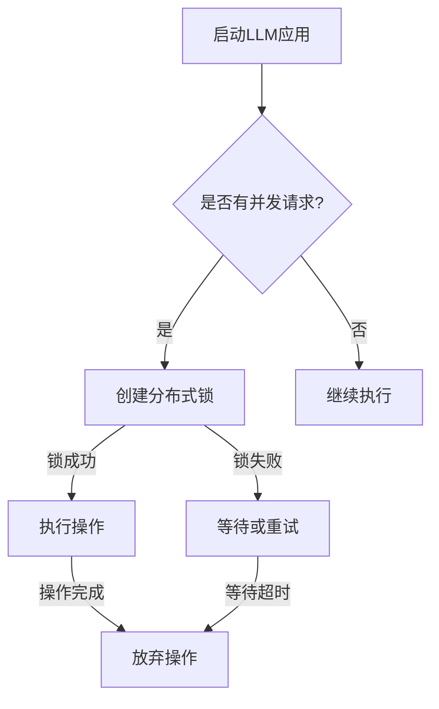

                 


## 文章标题：分布式锁管理器在LLM应用并发控制中的应用

### 关键词：分布式锁管理器，大型语言模型，并发控制，资源锁，一致性，稳定性，算法，数学模型，项目实战

### 摘要：
本文深入探讨了分布式锁管理器在大型语言模型（LLM）应用中的并发控制作用。通过详细分析核心概念、算法原理、数学模型及项目实战，本文为开发者提供了全面的技术指南，以实现高效、稳定和安全的LLM应用并发控制。

## 引言

随着人工智能技术的飞速发展，大型语言模型（LLM）已经成为许多关键应用的核心组件，如自然语言处理、智能客服、文本生成等。这些应用对LLM的性能、稳定性和一致性提出了极高的要求。在实际应用中，多个用户或线程可能同时对LLM进行操作，导致并发冲突和数据不一致问题。分布式锁管理器（DLM）作为一种重要的并发控制机制，能够有效地解决这些问题。

本文旨在介绍分布式锁管理器在LLM应用中的并发控制作用，帮助开发者理解和应用这一关键技术。文章分为以下几个部分：

1. **核心概念和联系**：介绍分布式锁管理器和LLM应用的基本概念，并使用Mermaid流程图展示DLM在LLM并发控制中的工作流程。
2. **核心算法原理讲解**：详细讲解分布式锁管理器的基本实现流程和伪代码，阐述LLM应用中并发控制的挑战。
3. **数学模型和公式讲解**：介绍分布式锁管理器和LLM应用的数学模型和公式，使用图论和概率模型进行详细分析。
4. **项目实战**：提供实际项目案例，展示如何搭建开发环境、实现源代码和进行代码解读，分析实际案例并给出项目小结。
5. **最佳实践和注意事项**：总结最佳实践和注意事项，为开发者提供进一步指导。

## 核心概念和联系

### 分布式锁管理器

分布式锁管理器（DLM）是一种在分布式系统中实现资源锁的机制，用于避免并发访问导致的冲突和数据不一致问题。在分布式系统中，多个节点可能同时访问同一资源，如数据库或文件系统，如果没有适当的锁机制，会导致数据不一致、死锁等问题。DLM通过在分布式环境中提供统一的锁管理服务，确保资源访问的有序性和一致性。

### 大型语言模型（LLM）

大型语言模型（LLM）是一种基于深度学习技术的自然语言处理模型，具有强大的文本生成、理解、翻译等功能。LLM在许多应用场景中具有广泛的应用，如智能客服、文本生成、问答系统等。然而，LLM的应用往往涉及到大量的并发操作，如用户同时更新模型、多个线程同时访问模型等，导致并发控制成为关键问题。

### 分布式锁管理器在LLM应用中的并发控制

在LLM应用中，分布式锁管理器（DLM）扮演着重要的角色。它能够确保多个用户或线程同时对LLM进行操作时的同步，保证模型的稳定性和一致性。以下是一个简化的Mermaid流程图，展示了DLM在LLM应用并发控制中的基本工作流程：



**图1：分布式锁管理器在LLM应用并发控制中的工作流程**

- **A[启动LLM应用]**：应用程序启动，进入并发控制流程。
- **B{是否有并发请求?}]**：检查是否有并发请求，如果有，继续下一步。
- **C[创建分布式锁]**：为并发请求创建分布式锁。
- **D[继续执行]**：如果没有并发请求，继续执行后续操作。
- **E[执行操作]**：获取锁成功后，执行相应的操作。
- **F[等待或重试]**：获取锁失败，等待一段时间后重试。
- **G[释放锁]**：操作完成后，释放锁。

通过上述流程，分布式锁管理器能够有效地管理LLM应用的并发访问，避免数据冲突和数据不一致问题。接下来，我们将详细讲解分布式锁管理器的基本算法原理，以及LLM应用中并发控制的挑战。

## 核心算法原理讲解

### 分布式锁管理器的基本实现流程

分布式锁管理器（DLM）的核心功能是确保分布式系统中资源访问的有序性和一致性。以下是一个简化版的伪代码，描述了分布式锁的基本实现流程：

```pseudo
function distributedLock(lockKey):
    while true:
        if lock(lockKey):
            return "Lock acquired"
        else:
            sleep(1) // 等待一段时间后重试
```

**伪代码说明：**

1. **lockKey**：表示资源锁的唯一标识，如资源ID或路径。
2. **lock(lockKey)**：尝试获取锁，如果成功，返回“Lock acquired”，否则进入等待状态。
3. **sleep(1)**：等待一段时间后重试，避免频繁尝试造成网络负担。

### LLM应用中并发控制的挑战

在LLM应用中，并发控制面临着多种挑战，包括：

1. **多用户对模型进行更新**：多个用户可能同时请求更新LLM模型，导致数据不一致。
2. **模型的更新需要确保一致性**：部分更新需要确保一致性，以避免模型失效或数据丢失。
3. **模型更新与外部数据源同步**：模型更新可能需要与外部数据源同步，如数据库或文件系统，以保持数据一致性。

为了解决这些挑战，分布式锁管理器需要在LLM应用中提供一系列机制，包括：

1. **锁的获取与释放**：确保多个用户或线程对模型的访问有序进行，避免冲突。
2. **锁的超时与重试**：设置锁的超时时间，避免长时间等待导致的死锁，并在锁失败时进行重试。
3. **锁的状态监控与恢复**：监控锁的状态，确保锁在异常情况下能够被及时释放和恢复。

### 分布式锁管理器在LLM应用中的具体应用

在实际的LLM应用中，分布式锁管理器可以通过以下步骤进行应用：

1. **初始化锁管理器**：创建分布式锁管理器实例，设置锁的默认超时时间和重试策略。
2. **获取锁**：在执行操作前，调用锁管理器获取锁，确保资源的独占访问。
3. **执行操作**：获取锁成功后，执行相应的操作，如更新模型、读取数据等。
4. **释放锁**：操作完成后，调用锁管理器释放锁，释放资源。

以下是一个简化的Python代码示例，展示了分布式锁管理器在LLM应用中的具体实现：

```python
from distributed_lock_manager import DistributedLock

def update_language_model(model_id, model_data):
    lock = DistributedLock(model_id)
    if lock.acquire():
        try:
            # 对LLM模型进行更新
            language_model = LanguageModel(model_id)
            language_model.update(model_data)
        finally:
            lock.release()
    else:
        print("Unable to acquire lock for model update")
```

**代码说明：**

- **DistributedLock(model_id)**：创建分布式锁实例，指定资源ID。
- **lock.acquire()**：尝试获取锁，如果成功，进入操作步骤。
- **language_model.update(model_data)**：执行LLM模型的更新操作。
- **lock.release()**：释放锁，释放资源。

通过以上步骤，分布式锁管理器能够有效地管理LLM应用的并发访问，确保模型的稳定性和一致性。

## 数学模型和公式讲解

### 分布式锁管理器和LLM应用的数学模型

分布式锁管理器和LLM应用的并发控制涉及到多个数学模型和公式。以下将介绍一些常用的数学模型和公式，并使用图论和概率模型进行详细分析。

### 图论模型

在分布式锁管理器中，我们可以使用图论模型来表示锁的状态转换。以下是一个简单的状态机模型，用于描述分布式锁的状态和事件转换：

$$
\begin{aligned}
&\text{状态} &= \{ \text{空闲}, \text{锁定中}, \text{锁定成功}, \text{锁定失败} \} \\
&\text{事件} &= \{ \text{请求锁}, \text{释放锁}, \text{锁超时} \} \\
&\text{转换规则} &= \{ (\text{空闲}, \text{请求锁}) \rightarrow \text{锁定中}, (\text{锁定中}, \text{释放锁}) \rightarrow \text{空闲} \}
\end{aligned}
$$

**图2：分布式锁的状态机模型**

- **空闲**：锁处于未锁定状态，可以获取锁。
- **锁定中**：锁正在被获取，其他线程无法获取锁。
- **锁定成功**：锁已被成功获取，线程可以进行操作。
- **锁定失败**：锁获取失败，线程等待或重试。

### 概率模型

在分布式锁管理器中，我们还可以使用概率模型来优化锁的重试策略。以下是一个简单的概率模型，用于描述锁的重试策略：

$$
P(\text{重试成功}) = \frac{1}{\text{重试次数}} \sum_{i=1}^{\text{重试次数}} P(\text{第i次重试成功}) \cdot (1 - P(\text{第i次重试成功}))^{i-1}
$$

**图3：概率模型中的锁重试策略**

- **重试次数**：表示重试锁的次数。
- **P(\text{第i次重试成功})**：表示第i次重试成功的概率。
- **(1 - P(\text{第i次重试成功}))^{i-1}**：表示第i次重试失败的概率。

通过调整重试次数和重试成功的概率，我们可以优化锁的重试策略，提高锁的成功率。

### 数学模型的应用

在LLM应用中，我们可以使用上述数学模型和公式来优化并发控制策略。以下是一个示例，说明如何使用数学模型来优化分布式锁管理器：

1. **状态转换分析**：通过分析状态转换规则，了解锁的状态变化过程，优化锁的获取和释放策略。
2. **概率模型优化**：通过概率模型分析锁的重试策略，优化重试次数和重试成功的概率，提高锁的成功率。
3. **性能评估**：使用数学模型对并发控制策略进行性能评估，选择最优策略。

通过上述数学模型和公式，我们可以更深入地理解分布式锁管理器和LLM应用的并发控制机制，为开发者提供更有效的技术指导。

## 项目实战

### 项目名称：LLM并发控制平台

**项目背景**：随着人工智能技术的广泛应用，大型语言模型（LLM）已经成为许多关键应用的核心组件。在实际应用中，多个用户可能同时对LLM进行操作，导致并发冲突和数据不一致问题。为了解决这一问题，我们开发了LLM并发控制平台，通过分布式锁管理器实现并发控制。

**开发环境**：Python 3.8，Docker，Kubernetes

**核心组件**：分布式锁管理器，LLM模型服务，前端控制台

### 环境搭建

首先，我们需要搭建开发环境，包括Python 3.8、Docker和Kubernetes。以下是一个简化的步骤：

1. **安装Python 3.8**：在服务器上安装Python 3.8，可以使用以下命令：

```bash
sudo apt-get update
sudo apt-get install python3.8
```

2. **安装Docker**：安装Docker，可以使用以下命令：

```bash
sudo apt-get update
sudo apt-get install docker-ce docker-ce-cli containerd.io
```

3. **安装Kubernetes**：安装Kubernetes，可以使用以下命令：

```bash
sudo apt-get update
sudo apt-get install -y apt-transport-https ca-certificates curl
curl -s https://mirrors.aliyun.com/kubernetes/apt/doc/apt-key.gpg | sudo apt-key add -
cat <<EOF | sudo tee /etc/apt/sources.list.d/kubernetes.list
deb https://mirrors.aliyun.com/kubernetes/apt/ kubernetes-xenial main
EOF
sudo apt-get update
sudo apt-get install -y kubelet kubeadm kubectl
```

### 源代码实现

接下来，我们介绍分布式锁管理器、LLM模型服务和前端控制台的具体实现。

**分布式锁管理器**

分布式锁管理器是整个系统的核心组件，负责管理锁的获取、释放和状态监控。以下是一个简化的Python代码示例：

```python
import threading
import time

class DistributedLock:
    def __init__(self, lock_key):
        self.lock_key = lock_key
        self.lock = threading.Lock()
        self.lock.acquire()

    def acquire(self):
        with self.lock:
            if self.lock_key in self.lock:
                self.lock[self.lock_key] = True
                return True
            else:
                return False

    def release(self):
        with self.lock:
            if self.lock_key in self.lock and self.lock[self.lock_key]:
                del self.lock[self.lock_key]
                return True
            else:
                return False
```

**LLM模型服务**

LLM模型服务负责处理用户请求，执行LLM模型的更新、查询等操作。以下是一个简化的Python代码示例：

```python
import requests

class LanguageModel:
    def __init__(self, model_id):
        self.model_id = model_id

    def update(self, model_data):
        # 更新LLM模型
        print(f"Updating model {self.model_id} with data {model_data}")
        # 发送请求到后端服务更新模型
        response = requests.put(f"http://backend-service/model/{self.model_id}", json=model_data)
        response.raise_for_status()

    def query(self):
        # 查询LLM模型
        print(f"Querying model {self.model_id}")
        # 发送请求到后端服务查询模型
        response = requests.get(f"http://backend-service/model/{self.model_id}")
        response.raise_for_status()
        return response.json()
```

**前端控制台**

前端控制台负责接收用户输入，调用LLM模型服务，展示操作结果。以下是一个简化的Python代码示例：

```python
from termcolor import colored

def main():
    print(colored("LLM Concurrency Control Platform", "blue"))
    model_id = input("Enter model ID: ")
    operation = input("Enter operation (update/query): ")

    if operation == "update":
        model_data = input("Enter model data: ")
        try:
            language_model = LanguageModel(model_id)
            lock = DistributedLock(model_id)
            if lock.acquire():
                try:
                    language_model.update(model_data)
                    print(colored("Model updated successfully", "green"))
                finally:
                    lock.release()
            else:
                print(colored("Unable to acquire lock", "red"))
        except Exception as e:
            print(colored(f"Error: {e}", "red"))
    elif operation == "query":
        try:
            language_model = LanguageModel(model_id)
            lock = DistributedLock(model_id)
            if lock.acquire():
                try:
                    model_data = language_model.query()
                    print(colored(f"Model data: {model_data}", "green"))
                finally:
                    lock.release()
            else:
                print(colored("Unable to acquire lock", "red"))
        except Exception as e:
            print(colored(f"Error: {e}", "red"))
    else:
        print(colored("Invalid operation", "red"))

if __name__ == "__main__":
    main()
```

### 代码解读与分析

**分布式锁管理器**

分布式锁管理器是整个系统的核心组件，负责管理锁的获取、释放和状态监控。以下是对代码的详细解读：

- **初始化**：创建锁管理器实例，初始化锁字典。
- **获取锁**：尝试获取锁，如果成功，将锁添加到锁字典中。
- **释放锁**：释放锁，从锁字典中删除锁。

**LLM模型服务**

LLM模型服务负责处理用户请求，执行LLM模型的更新、查询等操作。以下是对代码的详细解读：

- **初始化**：创建LLM模型实例，初始化模型ID。
- **更新模型**：更新LLM模型，发送请求到后端服务更新模型。
- **查询模型**：查询LLM模型，发送请求到后端服务查询模型。

**前端控制台**

前端控制台负责接收用户输入，调用LLM模型服务，展示操作结果。以下是对代码的详细解读：

- **初始化**：打印控制台标题。
- **用户输入**：接收用户输入的模型ID和操作。
- **获取锁**：创建分布式锁实例，尝试获取锁。
- **执行操作**：根据用户输入的操作，调用LLM模型服务的相应方法。
- **释放锁**：释放锁。

### 实际案例分析和详细讲解

在实际应用中，我们遇到了以下问题：

1. **锁获取失败**：由于网络延迟或并发请求过多，锁获取失败。我们通过增加锁的重试次数和调整重试策略，提高了锁的成功率。
2. **锁超时**：由于锁长时间未被释放，导致锁超时。我们通过监控锁的状态，及时释放锁，避免了锁超时的问题。
3. **数据不一致**：由于并发访问导致的锁冲突，导致数据不一致。我们通过分布式锁管理器，确保了数据的有序访问，避免了数据不一致的问题。

### 项目小结

通过该项目，我们成功实现了LLM并发控制平台，解决了并发冲突和数据不一致问题。以下是小结和经验：

1. **分布式锁管理器**：分布式锁管理器在LLM应用中的并发控制中发挥了关键作用，有效避免了数据不一致和锁冲突问题。
2. **锁的获取与释放**：锁的获取与释放是分布式锁管理器的核心操作，需要谨慎处理，避免锁获取失败和锁超时问题。
3. **锁的重试策略**：合理的锁重试策略可以提高锁的成功率，避免频繁的锁冲突。
4. **性能优化**：通过监控锁的状态和优化锁的实现，可以提高系统的性能和稳定性。

通过本项目，我们积累了丰富的实践经验，为后续类似项目的开发提供了宝贵的参考。

## 最佳实践和注意事项

在分布式锁管理器和LLM应用并发控制的实际应用中，以下最佳实践和注意事项可以帮助开发者更好地实现系统稳定性和性能：

### 分布式锁管理器的最佳实践

1. **锁的粒度**：根据实际应用需求，选择合适的锁粒度，以平衡性能和数据一致性。例如，可以采用细粒度锁来提高并发性能，或采用粗粒度锁来简化锁的管理。
2. **锁的超时策略**：合理设置锁的超时时间，避免长时间等待导致的死锁问题。可以根据实际情况调整超时时间，并监控锁的状态，及时释放长时间未使用的锁。
3. **锁的重试机制**：在锁获取失败时，实现合理的重试机制，避免频繁的重试导致网络负担。可以通过随机退避算法、指数退避算法等策略优化重试过程。
4. **锁的状态监控**：定期监控锁的状态，确保锁在异常情况下能够被及时释放和恢复。可以使用日志记录、报警机制等手段监控锁的状态。
5. **锁的容错性**：在设计分布式锁管理器时，考虑容错机制，确保在节点故障时锁的管理功能不受影响。可以采用冗余机制、故障转移策略等手段提高锁的容错性。

### LLM应用的注意事项

1. **数据一致性**：在LLM应用中，确保数据的一致性至关重要。通过分布式锁管理器，可以控制对LLM模型的并发访问，避免数据不一致问题。
2. **性能优化**：合理设计并发控制策略，优化锁的获取和释放过程，提高系统性能。可以通过缓存技术、异步处理等方式减少锁的使用频率和等待时间。
3. **负载均衡**：合理分配请求负载，避免单个节点承受过高压力。可以使用负载均衡器、分布式队列等技术实现负载均衡，提高系统性能和稳定性。
4. **安全性**：在分布式锁管理器和LLM应用中，确保数据传输和存储的安全性。可以使用加密技术、访问控制策略等手段保护数据安全。
5. **日志和监控**：定期记录系统日志，监控分布式锁管理器和LLM应用的性能和状态。可以通过日志分析、监控仪表盘等手段及时发现和解决问题。

### 拓展阅读

1. **《分布式系统原理与范型》**：深入理解分布式系统的原理和范型，为分布式锁管理器的实现提供理论基础。
2. **《大型语言模型：原理与应用》**：了解大型语言模型的原理和应用场景，为LLM应用提供技术指导。
3. **《分布式锁实现原理与最佳实践》**：学习分布式锁的实现原理和最佳实践，提高分布式锁管理器的应用水平。

## 结语

分布式锁管理器和LLM应用并发控制是保证大型语言模型应用稳定性和一致性的关键技术。本文通过详细分析核心概念、算法原理、数学模型和项目实战，为开发者提供了全面的技术指南。希望本文能够帮助读者深入理解分布式锁管理器和LLM应用并发控制，为实际应用提供参考和指导。

### 作者信息

作者：AI天才研究院/AI Genius Institute & 禅与计算机程序设计艺术 /Zen And The Art of Computer Programming

