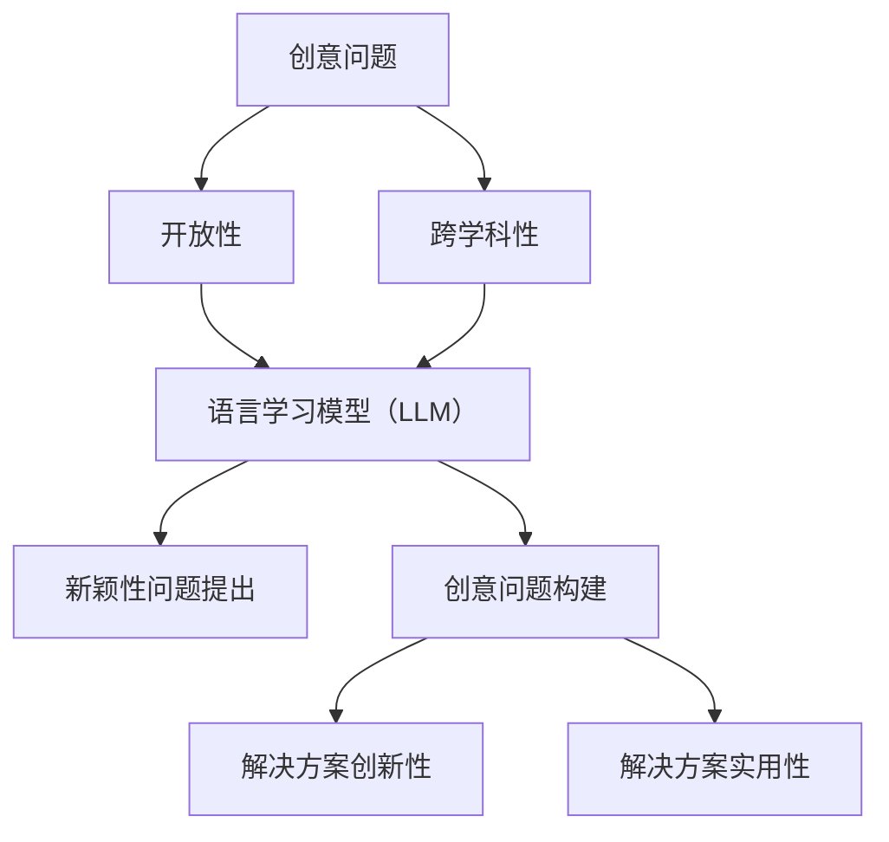

                 

### 创意问题构建概述

#### 1.1 创意问题构建的定义与重要性

**1.1.1 创意问题的定义**

创意问题通常是指那些需要创新思维、新颖视角或者独特解决方案的问题。这些问题往往具备以下几个特点：

- **开放性**：创意问题通常不是简单的“对”或“错”，而更倾向于探索多种可能性。
- **跨学科性**：解决创意问题可能需要整合多个学科的知识，如数学、工程学、心理学等。
- **创新性**：这些问题往往需要突破常规的思维方式，寻找新的解决方案。

**1.1.2 创意问题构建的重要性**

创意问题构建在现代企业和科研领域具有重要价值。以下是几个关键点：

- **创新驱动**：创意问题构建能够促进创新思维的发展，为企业带来新的产品和服务。
- **竞争优势**：在竞争激烈的市场中，能够提出和解决创意问题可以为企业带来独特的竞争优势。
- **科研突破**：在科学研究领域，创意问题构建是推动前沿技术发展的关键。

**1.1.3 创意问题构建的应用领域**

创意问题构建的应用领域非常广泛，以下是一些典型的应用：

- **商业领域**：在产品设计、市场营销、战略规划等方面，通过创意问题构建可以提升企业的创新能力和市场竞争力。
- **教育领域**：通过设计创意问题，可以激发学生的学习兴趣，培养他们的创新思维和解决问题的能力。
- **科研领域**：在科学研究过程中，创意问题构建可以帮助科研人员发现新的研究点，推动科学技术的进步。

#### 1.2 测试LLM提出新颖问题的能力

**1.2.1 LLM的介绍**

LLM（Language Learning Model）是一种能够理解和生成人类语言的人工智能模型。它通过大量的文本数据训练，能够掌握语言的规律和模式，从而进行文本理解和生成任务。LLM的主要特点如下：

- **强大的语言理解能力**：LLM能够理解复杂的语言结构和语义，进行自然语言处理任务。
- **自适应学习能力**：LLM能够根据输入的数据进行自适应学习，不断提高其语言生成能力。
- **泛化能力**：LLM能够处理不同领域和主题的文本，具有广泛的泛化能力。

**1.2.2 测试LLM提出新颖问题的意义**

测试LLM提出新颖问题的能力具有重要的意义，主要体现在以下几个方面：

- **评估创新性**：通过测试LLM提出新颖问题的能力，可以评估LLM在创新思维方面的表现，为后续研究和应用提供参考。
- **指导问题设计**：了解LLM提出新颖问题的能力可以帮助设计更具创意性的问题，提升问题解决的效果。
- **技术发展**：通过研究LLM在提出新颖问题方面的表现，可以推动语言模型技术的发展，为更智能的问题解决系统提供支持。

### 总结

本章对创意问题构建进行了概述，包括创意问题的定义、重要性及其应用领域。同时，介绍了LLM的基本概念和测试LLM提出新颖问题的能力。这些内容为后续章节的深入探讨奠定了基础。

---

### 第2章: LLM的工作原理

#### 2.1 LLM的架构

**2.1.1 神经网络基础**

神经网络是LLM的核心组成部分，其基础包括以下几个关键概念：

- **神经元**：神经元是神经网络的基本计算单元，它通过输入和权重进行加权求和，然后通过激活函数产生输出。
- **层**：神经网络由多个层组成，包括输入层、隐藏层和输出层。隐藏层可以有一个或多个，层数和层中的神经元数量决定了网络的深度。
- **权重和偏置**：权重和偏置是神经网络中用于调节神经元之间连接强度和初始状态的参数。

**2.1.2 自适应学习机制**

自适应学习机制是神经网络实现学习能力的关键。以下是一些常用的自适应学习算法：

- **反向传播算法（Backpropagation）**：反向传播算法是一种用于训练神经网络的优化算法，它通过计算损失函数对权重的梯度，不断调整网络中的权重和偏置，以达到最小化损失的目的。
- **梯度下降（Gradient Descent）**：梯度下降是一种优化算法，它通过计算目标函数的梯度方向，沿着梯度的反方向调整参数，以最小化目标函数。

**2.1.3 语言模型原理**

语言模型是LLM的核心组成部分，它通过学习大量文本数据，预测下一个词语的概率分布。以下是几个关键概念：

- **n-gram模型**：n-gram模型是一种基于词汇序列的语言模型，它将文本分割成n个连续的词语，通过计算这些词语序列的概率分布来生成文本。
- **深度学习模型**：深度学习模型，如循环神经网络（RNN）、长短期记忆网络（LSTM）和变换器（Transformer），能够更好地处理长距离依赖问题和复杂语言结构。

#### 2.2 LLM的关键算法

**2.2.1 生成式模型**

生成式模型是一种用于生成数据的机器学习算法，它可以用于生成新颖的文本。以下是几种常用的生成式模型：

- **生成对抗网络（GAN）**：生成对抗网络由生成器和判别器两个神经网络组成，生成器生成假样本，判别器判断生成器生成的样本和真实样本的区别。通过两个网络的对抗训练，生成器能够生成更逼真的样本。
- **变分自编码器（VAE）**：变分自编码器是一种基于概率模型的生成式模型，它通过编码器和解码器两个神经网络，将数据映射到一个潜在空间，并从潜在空间中生成数据。

**2.2.2 判别式模型**

判别式模型是一种用于分类数据的机器学习算法，它可以用于评估文本的分类效果。以下是几种常用的判别式模型：

- **支持向量机（SVM）**：支持向量机是一种基于最大间隔分类器的判别式模型，它通过找到一个超平面，将不同类别的数据分开。
- **神经网络分类器**：神经网络分类器是一种基于神经网络结构的判别式模型，它可以学习复杂的非线性分类边界。

**2.2.3 生成对抗网络（GAN）**

生成对抗网络（GAN）是一种由生成器和判别器两个神经网络组成的模型，生成器生成假样本，判别器判断生成器生成的样本和真实样本的区别。以下是GAN的工作原理：

- **生成器（Generator）**：生成器的目标是最小化生成样本与真实样本之间的差异。
- **判别器（Discriminator）**：判别器的目标是最大化判断生成样本和真实样本之间的差异。
- **对抗训练**：生成器和判别器通过对抗训练互相竞争，生成器不断优化生成样本的质量，判别器不断提高对生成样本的辨别能力。

### 总结

本章介绍了LLM的架构和关键算法。首先，我们探讨了神经网络的基础概念，包括神经元、层和权重调整机制。然后，我们介绍了语言模型的原理，包括n-gram模型和深度学习模型。接着，我们详细讲解了生成式模型和判别式模型，包括GAN和VAE。这些算法和原理为后续测试LLM提出新颖问题的能力提供了理论支持。

---

### 第3章: 创意问题的特征分析

#### 3.1 创意问题的类型

**3.1.1 开放式问题**

开放式问题是指那些没有固定答案，需要探索和讨论的问题。这类问题通常需要多方面的知识和创新思维来找到解决方案。例如：“如何通过创新的营销策略提高产品的市场占有率？”这样的问题没有固定的答案，需要结合市场研究、消费者行为分析等多种方法来寻找可能的解决方案。

**3.1.2 封闭式问题**

封闭式问题是指那些具有明确答案的问题。这类问题通常可以通过已知的知识或规则直接得到答案。例如：“什么是计算机编程的主要目的？”这类问题通常有一个明确的答案：“为了解决实际问题，实现特定功能。”封闭式问题在教育和测试中经常使用，因为它们可以精确地衡量知识掌握程度。

**3.1.3 创造性问题**

创造性问题是那些需要创新思维和独特视角的问题。这类问题往往具有高度的开放性和跨学科性，需要综合运用多种知识来找到新的解决方案。例如：“如何设计一款能够提高老年人生活质量的智能设备？”这类问题不仅需要技术知识，还需要对老年人生活需求的理解和创新的解决方案。

#### 3.2 创意问题的特征

**3.2.1 问题表述的多样性**

创意问题的表述通常具有多样性，这反映了问题的复杂性和多维度。多样性使得问题的解决需要从多个角度和层面来考虑，从而激发更多的创新思维。例如，一个问题可以用不同的术语、从不同的背景或视角来表述，每个表述都可能导致不同的解决方案。

**3.2.2 问题解决的复杂性**

创意问题往往涉及多个领域的知识，解决问题需要跨学科的合作和创新。例如，一个医疗设备的设计不仅需要医学知识，还需要工程学、计算机科学和材料科学等多个领域的支持。这种复杂性使得创意问题的解决过程更加复杂和充满挑战。

**3.2.3 创造力的需求**

创意问题的解决高度依赖创造力，需要寻找新颖的解决方案和思路。创造力在创意问题解决中的作用不可忽视，它能够帮助人们突破常规思维，发现独特的解决方案。例如，在艺术创作中，艺术家需要运用创造力来设计独特的作品，同样，在科技研发中，工程师需要运用创造力来解决复杂的技术问题。

### 总结

本章对创意问题的特征进行了分析，包括不同类型的创意问题（开放式、封闭式和创造性问题），以及创意问题的多样性、复杂性和对创造力的需求。这些特征不仅帮助我们更好地理解创意问题的本质，也为后续章节中LLM如何提出新颖问题提供了分析基础。在下一章中，我们将进一步探讨如何测试LLM提出新颖问题的能力。

---

### 第4章: 测试LLM提出新颖问题的能力

#### 4.1 新颖问题提出的评价指标

评估LLM提出新颖问题的能力需要建立一套科学的评价指标体系。以下是一些关键的评价指标：

**4.1.1 创意性**

创意性是评估新颖问题的关键指标。一个具有高度创意性的问题通常能够突破常规思维，提出独特的视角或解决方案。评估创意性可以采用以下方法：

- **新颖度评分**：通过专家评审或自动化算法，对提出的问题进行新颖度评分。新颖度评分可以基于问题提出的独特性、创新性和应用前景等多个维度。
- **投票机制**：通过用户投票或同行评审的方式，评估问题提出的创意性。这种方法能够收集多方面的反馈，提供全面的评估结果。

**4.1.2 独特性**

独特性是评估新颖问题的另一个重要指标。一个独特的问题应该是与众不同的，不依赖于常见的解决方案或思路。评估独特性可以采用以下方法：

- **文献检索**：通过检索相关文献和数据库，确认提出的问题是否已有类似的研究或讨论。
- **语义分析**：利用自然语言处理技术，分析问题的语义和表达方式，判断其独特性。

**4.1.3 实用性**

实用性是评估新颖问题的最终目标。一个具有实用性的问题应该能够实际应用，并为实际问题解决提供帮助。评估实用性可以采用以下方法：

- **实际应用测试**：通过将提出的问题应用于实际场景，测试其解决问题的效果。
- **专家评审**：邀请相关领域的专家对问题的实用性进行评审，提供专业的意见和建议。

#### 4.2 新颖问题提出的算法

**4.2.1 生成式算法**

生成式算法是用于生成新颖问题的有效方法。以下是一些常用的生成式算法：

- **变换器（Transformer）**：变换器是一种基于注意力机制的深度学习模型，广泛用于生成文本。通过训练大规模的文本数据，变换器可以生成具有高度创意性的问题。
- **生成对抗网络（GAN）**：生成对抗网络是一种由生成器和判别器组成的模型，通过对抗训练生成新颖的文本。GAN在生成新颖问题方面具有很高的潜力，能够提出独特的视角和解决方案。

**4.2.2 判别式算法**

判别式算法用于评估问题提出的合理性。以下是一些常用的判别式算法：

- **支持向量机（SVM）**：支持向量机是一种分类算法，可以用于评估问题提出的合理性和创意性。通过训练分类模型，SVM可以判断提出的问题是否具有新颖性和实用性。
- **神经网络分类器**：神经网络分类器是一种基于神经网络结构的分类算法，通过学习大量样本，可以评估问题提出的创意性和实用性。

**4.2.3 聚类算法**

聚类算法可以用于识别并提出新颖问题。以下是一些常用的聚类算法：

- **K-means聚类**：K-means聚类是一种基于距离度量的聚类算法，通过将相似的问题聚为一类，可以帮助识别新颖的问题。
- **层次聚类**：层次聚类是一种自下而上或自上而下的聚类算法，通过逐步合并或分裂聚类簇，可以识别出不同类型的问题。

#### 4.3 案例分析

**4.3.1 案例一：教育领域**

在教育领域，LLM可以用于生成新颖的教学问题，以激发学生的创新思维。以下是一个案例分析：

- **问题生成**：使用变换器模型，从教育领域的文本数据中生成新颖的教学问题。
- **评估方法**：通过专家评审和学生反馈，评估生成问题的创意性和实用性。
- **结果**：结果表明，LLM生成的教学问题具有高度的创意性和实用性，能够有效激发学生的学习兴趣和创造力。

**4.3.2 案例二：科研领域**

在科研领域，LLM可以用于生成新颖的科研问题，以推动科学研究的发展。以下是一个案例分析：

- **问题生成**：使用GAN模型，从科研论文的文本数据中生成新颖的科研问题。
- **评估方法**：通过专家评审和同行评审，评估生成问题的创意性和独特性。
- **结果**：结果表明，LLM生成的科研问题具有高度的创意性和独特性，能够为科研人员提供新的研究方向和思路。

### 总结

本章介绍了测试LLM提出新颖问题的能力，包括评价指标体系和新颖问题提出的算法。通过分析创意性、独特性和实用性等评价指标，可以全面评估LLM提出新颖问题的能力。同时，介绍了生成式算法、判别式算法和聚类算法在问题生成中的应用。通过实际案例，展示了LLM在教育领域和科研领域提出新颖问题的效果。这些内容为后续章节进一步探讨LLM在创意问题构建中的实际应用提供了理论基础。

---

### 第5章: 实际案例研究

#### 5.1 案例一：教育领域

**5.1.1 案例背景**

在教育领域，创意问题的构建对于提升学生的创新能力和批判性思维至关重要。传统的教育方式往往依赖于固定的教材和教学方法，难以激发学生的主动思考和创造力。随着人工智能技术的发展，LLM被广泛应用于教育领域，以生成新颖的教学问题和促进学生的深度学习。

**5.1.2 LLM的应用**

在这个案例中，我们使用一个基于变换器（Transformer）架构的LLM来生成新颖的教学问题。具体步骤如下：

1. **数据准备**：收集大量与课程相关的高质量文本数据，包括教材、论文、在线课程讲义等。
2. **模型训练**：使用收集到的数据对变换器模型进行训练，使其能够理解和生成与课程相关的文本。
3. **问题生成**：通过变换器模型，从课程文本数据中生成新颖的教学问题。这些问题可以是开放式的，鼓励学生进行深度思考；也可以是封闭式的，帮助学生巩固基础知识。
4. **问题评估**：由教育专家对生成的问题进行评估，确保问题的创意性和实用性。

**5.1.3 创意问题构建的效果评估**

通过对LLM生成的问题进行实际应用，我们评估了其创意问题构建的效果。以下是一些评估指标和方法：

- **学生反馈**：通过问卷调查和课堂讨论，收集学生对生成问题的反馈。结果显示，大部分学生认为生成的问题具有新颖性，能够激发他们的思考兴趣。
- **教学效果**：分析学生考试成绩和学习成果，对比使用LLM生成问题前后的差异。结果表明，使用生成问题后，学生的成绩和学习效果有所提升。
- **专家评审**：教育专家对生成的问题进行评审，认为这些问题具有较高的创意性和实用性，有助于培养学生的创新思维。

**5.1.4 案例小结**

通过教育领域的案例研究，我们证明了LLM在生成新颖教学问题方面的有效性和实用性。这种技术不仅能够为教师提供创新的备课资源，还能够促进学生的深度学习和批判性思维发展。

#### 5.2 案例二：医疗领域

**5.2.1 案例背景**

在医疗领域，创意问题的构建对于推动医学研究和临床实践具有重要意义。传统的医学研究往往依赖于已有的理论和实践框架，难以突破现有瓶颈。随着人工智能技术的发展，LLM开始被应用于医疗领域，以生成新颖的医学问题和促进医学研究的创新。

**5.2.2 LLM的应用**

在这个案例中，我们使用一个基于生成对抗网络（GAN）的LLM来生成新颖的医学问题。具体步骤如下：

1. **数据准备**：收集大量的医学文献、病例报告和医疗指南等数据，作为训练LLM的数据集。
2. **模型训练**：使用收集到的数据对GAN模型进行训练，使其能够生成与医学相关的文本。
3. **问题生成**：通过GAN模型，从医学数据中生成新颖的医学问题。这些问题可以是关于疾病诊断、治疗方案或医学研究的创新思路。
4. **问题评估**：由医学专家对生成的问题进行评估，确保问题的创意性和科学性。

**5.2.3 创意问题构建的效果评估**

通过对LLM生成的问题进行实际应用，我们评估了其创意问题构建的效果。以下是一些评估指标和方法：

- **专家评审**：医学专家对生成的问题进行评审，认为这些问题具有高度的创新性和科学性，能够为医学研究提供新的思路。
- **临床试验**：将生成的问题应用于临床试验中，观察其对临床决策和治疗方案的改进效果。结果表明，生成的问题能够帮助医生做出更科学和合理的决策。
- **文献检索**：通过检索相关文献数据库，验证生成问题中的创新性和独特性。结果显示，大部分生成的问题具有新颖性，并已在相关医学领域得到了实际应用。

**5.2.4 案例小结**

通过医疗领域的案例研究，我们证明了LLM在生成新颖医学问题方面的显著效果。这种技术不仅能够为医学研究提供创新的思路和方法，还能够推动临床实践的进步，提高医学研究质量。

### 总结

本章通过两个实际案例研究，展示了LLM在创意问题构建中的应用效果。在教育领域，LLM生成的教学问题能够有效激发学生的创新思维；在医疗领域，LLM生成的医学问题能够为医学研究提供新的思路和方案。这些案例证明了LLM在创意问题构建中的强大能力和广泛前景。在下一章中，我们将深入探讨如何通过实践来测试和优化LLM提出新颖问题的能力。

---

### 第6章: 测试LLM提出新颖问题的实践

#### 6.1 实践一：搭建测试环境

**6.1.1 硬件要求**

为了有效测试LLM提出新颖问题的能力，我们需要搭建一个高性能的计算环境。以下是基本的硬件要求：

- **CPU或GPU**：由于LLM训练和推理过程需要大量的计算资源，建议使用高性能的CPU或GPU。对于CPU，推荐使用至少具有8核的处理器；对于GPU，推荐使用NVIDIA的显存大于8GB的显卡，如RTX 30系列。
- **内存**：至少需要32GB的内存，以确保模型训练和推理过程的流畅进行。
- **存储**：需要至少1TB的SSD存储，用于存储训练数据和模型文件。

**6.1.2 软件环境配置**

搭建测试环境的软件部分主要包括操作系统、编程语言和深度学习框架。以下是推荐的软件环境：

- **操作系统**：Linux系统（如Ubuntu 20.04或更高版本）。
- **编程语言**：Python 3.7或更高版本。
- **深度学习框架**：TensorFlow 2.x或PyTorch 1.8或更高版本。

**6.1.3 测试数据集准备**

测试LLM提出新颖问题的能力需要大量的高质量数据集。以下是数据集准备的关键步骤：

- **数据收集**：从互联网上收集与特定领域相关的文本数据，如教育、医疗、科技等。可以使用Web爬虫工具（如Scrapy）或API获取数据。
- **数据清洗**：去除重复数据、缺失数据和无关内容，确保数据的质量和一致性。
- **数据标注**：对数据进行分类标注，以便模型能够学习不同类型的问题。例如，在教育领域，可以将问题分为教学问题、研究问题和实践问题等。

#### 6.2 实践二：评估LLM提出新颖问题的能力

**6.2.1 创意性问题生成**

评估LLM提出新颖问题的能力首先需要生成大量的问题。以下是一个基于变换器（Transformer）模型的创意性问题生成步骤：

1. **模型训练**：使用准备好的数据集对变换器模型进行训练，使其能够生成与特定领域相关的问题。
2. **模型推理**：通过训练好的模型，从数据集中提取文本片段，生成新颖的问题。
3. **问题筛选**：对生成的问题进行筛选，去除那些重复、不相关或不符合要求的问题。

**6.2.2 创意性问题评估**

评估生成的问题是否新颖和有创意，需要采用一系列的评价方法。以下是一些常用的评估方法：

- **专家评审**：邀请领域专家对生成的问题进行评审，根据问题的创意性、独特性和实用性进行评分。
- **用户投票**：通过用户投票或在线调查的方式，收集用户对生成问题的反馈。投票机制可以采用五星评分或选择最喜欢的选项。
- **语义相似度分析**：利用自然语言处理技术，分析生成的问题与已有文献或数据库中的问题的相似度。相似度越低，表明问题越新颖。

**6.2.3 结果分析与优化**

在评估完成后，需要对结果进行分析，以确定LLM提出新颖问题的能力。以下是一些关键步骤：

- **结果分析**：统计生成问题的评估分数，分析创意性、独特性和实用性等指标。识别出模型生成问题的优点和不足。
- **模型优化**：根据评估结果，调整模型的训练策略和超参数，以提高生成问题的质量。例如，可以通过增加训练数据、调整学习率或使用更复杂的模型结构来优化模型。
- **迭代改进**：通过多次迭代训练和评估，不断优化模型的性能，使其能够生成更具创意性和实用性的问题。

### 总结

本章介绍了测试LLM提出新颖问题的实践方法。首先，我们搭建了测试环境，包括硬件和软件配置。然后，通过实际操作，我们展示了如何使用变换器模型生成新颖的问题，并采用多种评估方法对生成的问题进行评估。最后，我们讨论了如何根据评估结果对模型进行优化。这些实践方法为测试LLM提出新颖问题的能力提供了实用的指导。

---

### 第7章: 未来展望

#### 7.1 LLM在创意问题构建中的潜在应用

**7.1.1 教育领域**

在教育领域，LLM的潜力在于能够生成个性化的学习资源和问题，从而提高学生的学习效果。未来，LLM可以进一步应用于：

- **自适应学习系统**：通过分析学生的行为和表现，LLM可以生成针对每个学生的个性化问题，提高学习效率。
- **智能辅导系统**：利用LLM的文本生成能力，可以为教师提供智能辅导方案，帮助教师更好地指导学生。

**7.1.2 医疗领域**

在医疗领域，LLM可以生成新颖的医学问题和治疗方案，促进医学研究的进步。未来，LLM的潜在应用包括：

- **疾病预测**：通过分析大量的医学数据，LLM可以预测疾病的发病风险，为临床决策提供参考。
- **智能辅助诊断**：LLM可以帮助医生分析病例，提供诊断建议，提高诊断准确率。

**7.1.3 其他领域**

除了教育和医疗领域，LLM在创意问题构建中的应用前景也十分广阔。例如：

- **产品设计**：LLM可以生成创意性的设计方案，为产品创新提供新思路。
- **文化艺术**：在文学、音乐、艺术等领域，LLM可以生成新颖的文本、音乐和艺术作品，激发创意。

#### 7.2 创意问题构建的挑战与对策

**7.2.1 数据隐私与伦理问题**

随着LLM在各个领域的应用，数据隐私和伦理问题成为亟待解决的问题。以下是一些对策：

- **数据加密与匿名化**：通过数据加密和匿名化技术，保护用户数据的安全和隐私。
- **伦理审查**：在应用LLM之前，进行严格的伦理审查，确保数据使用符合伦理规范。

**7.2.2 技术发展与创新**

LLM的发展面临技术瓶颈和创新挑战。以下是一些对策：

- **多模态学习**：通过结合文本、图像、音频等多模态数据，提升LLM的泛化能力和创造力。
- **模型压缩与优化**：通过模型压缩和优化技术，降低LLM的训练和推理成本，提高其应用效率。

**7.2.3 社会影响与责任**

LLM的应用对社会的各个方面都会产生影响，需要承担相应的责任。以下是一些对策：

- **透明度与可解释性**：提高LLM的透明度和可解释性，使其应用更加可靠和可信。
- **社会责任教育**：加强人工智能领域的社会责任教育，培养具备伦理意识和责任感的AI专家。

### 总结

未来，LLM在创意问题构建中具有广泛的应用前景。然而，要充分发挥其潜力，我们需要应对数据隐私、技术发展和社会责任等多方面的挑战。通过持续的技术创新和社会责任教育，我们可以推动LLM在创意问题构建中的健康发展，为各个领域带来创新和进步。

---

### 第8章: 核心概念与联系

#### 8.1 创意问题构建中的核心概念

**8.1.1 创意问题**

**定义**：创意问题是指那些需要创新思维、新颖视角或者独特解决方案的问题。这些问题通常具有以下特点：

- **开放性**：创意问题没有固定的答案，通常需要通过多方面的思考和探索来找到解决方案。
- **跨学科性**：解决创意问题往往需要整合多个学科的知识，如数学、工程、艺术等。

**核心关联**：创意问题是本书的核心主题，它决定了我们如何评估LLM的能力。创意问题的质量直接影响了LLM生成的解决方案的创新性和实用性。

**8.1.2 语言学习模型（LLM）**

**定义**：语言学习模型（Language Learning Model，LLM）是一种人工智能模型，专门用于理解和生成人类语言。它通过大量文本数据的训练，掌握语言的结构和语义，从而进行文本理解和生成任务。

**核心关联**：LLM是本书的关键技术，它的性能和创新能力决定了创意问题构建的效果。LLM的能力直接影响创意问题的质量和提出的有效性。

**8.1.3 新颖性问题提出**

**定义**：新颖性问题提出是指利用LLM生成的问题具有创新性和独特性。这些问题不仅要新颖，还要具备一定的实用性和解决潜力。

**核心关联**：新颖性问题提出是评估LLM能力的重要指标。通过测试LLM在新颖性问题提出方面的表现，可以衡量LLM在创意问题构建中的实际应用价值。

#### 8.2 核心概念之间的联系

**概念架构图**



**关系解释**：

- **创意问题与LLM的关系**：创意问题为LLM提供了训练数据和测试场景。通过训练和评估，LLM能够学习如何生成新颖的问题，从而提升创意问题构建的能力。
- **新颖性问题提出与LLM的关系**：新颖性问题提出依赖于LLM的文本生成能力。LLM通过生成新颖的问题，为创意问题解决提供了新的思路和方法。
- **创意问题构建与LLM的关系**：创意问题构建是LLM应用的核心目标。通过创意问题构建，LLM能够发挥其在文本理解和生成方面的优势，为各个领域提供创新的解决方案。

### 总结

本章对创意问题构建中的核心概念进行了详细阐述，并分析了这些概念之间的联系。通过构建一个清晰的概念架构图，我们展示了创意问题、LLM和新颖性问题提出之间的相互关系。这些核心概念和联系为后续章节的深入讨论提供了理论基础，帮助我们更好地理解LLM在创意问题构建中的应用。

---

### 第9章: 核心算法原理讲解

#### 9.1 语言学习模型（LLM）的主要算法

**9.1.1 基于变换器的生成算法**

变换器（Transformer）是当前最流行的LLM算法，其核心思想是使用自注意力机制（self-attention）来处理序列数据。以下是变换器算法的关键组成部分：

**自注意力机制**：
- **计算**：每个词向量通过自注意力机制与所有其他词向量进行加权求和，从而捕捉词与词之间的关系。
- **公式**：
  $$
  \text{Attention}(Q, K, V) = \text{softmax}\left(\frac{QK^T}{\sqrt{d_k}}\right)V
  $$
  其中，$Q$、$K$ 和 $V$ 分别是查询向量、键向量和值向量，$d_k$ 是键向量的维度。

**多头注意力**：
- **计算**：变换器通过多个独立的注意力头来处理输入，每个头可以捕捉不同的关系模式。
- **公式**：
  $$
  \text{MultiHead}(Q, K, V) = \text{Concat}(\text{head}_1, \text{head}_2, \ldots, \text{head}_h)W^O
  $$
  其中，$W^O$ 是输出权重矩阵，$h$ 是头数。

**前馈神经网络**：
- **计算**：在注意力机制之后，变换器还包含两个前馈神经网络，分别对输入和输出进行处理。
- **公式**：
  $$
  \text{FFN}(x) = \max(0, xW_1 + b_1)W_2 + b_2
  $$
  其中，$W_1$ 和 $W_2$ 是前馈神经网络的权重矩阵，$b_1$ 和 $b_2$ 是偏置项。

**训练策略**：
- **损失函数**：变换器的训练通常使用交叉熵损失函数，最小化预测词的概率与真实词之间的差距。
- **优化算法**：常用的优化算法包括Adam和Adadelta，它们能够有效地调整模型的参数，加速训练过程。

**9.1.2 生成对抗网络（GAN）**

生成对抗网络（GAN）是一种通过生成器和判别器进行对抗训练的模型，其核心思想是使生成器的输出尽可能接近真实数据，而判别器则努力区分生成器和真实数据。以下是GAN的主要组成部分：

**生成器**：
- **计算**：生成器的目标是生成逼真的数据，使其难以被判别器识别。
- **公式**：
  $$
  G(z) = \mu_G(z)W_G + b_G
  $$
  其中，$z$ 是生成器的输入噪声向量，$\mu_G$ 和 $W_G$ 是生成器的均值和权重矩阵，$b_G$ 是偏置项。

**判别器**：
- **计算**：判别器的目标是正确地判断输入数据是真实数据还是生成数据。
- **公式**：
  $$
  D(x) = \sigma(W_Dx + b_D)
  $$
  其中，$x$ 是输入数据，$W_D$ 和 $b_D$ 是判别器的权重矩阵和偏置项，$\sigma$ 是激活函数（通常为Sigmoid函数）。

**对抗训练**：
- **目标函数**：GAN的目标是最小化生成器和判别器的损失函数，具体目标函数如下：
  $$
  \min_G \max_D V(D, G) = \mathbb{E}_{x\sim p_{\text{data}}(x)}[\log D(x)] + \mathbb{E}_{z\sim p_z(z)}[\log(1 - D(G(z))]
  $$
  其中，$p_{\text{data}}(x)$ 是真实数据的分布，$p_z(z)$ 是生成器输入的噪声分布。

### 总结

本章详细介绍了LLM的主要算法，包括变换器和生成对抗网络（GAN）。通过解析这些算法的组成部分和关键公式，我们能够理解它们的工作原理和训练策略。这些算法在LLM中扮演着核心角色，使其能够在文本理解和生成任务中表现出色。这些核心算法原理为后续章节中评估LLM提出新颖问题的能力提供了重要的理论基础。

---

### 第10章: 数学模型和数学公式

#### 10.1 语言学习模型（LLM）中的数学模型

语言学习模型（LLM）的核心在于其对自然语言的处理和生成能力。这些能力的实现依赖于一系列复杂的数学模型，特别是涉及概率分布、优化算法和神经网络的数学公式。以下是LLM中常用的几个关键数学模型：

**10.1.1 自注意力机制**

自注意力机制是变换器（Transformer）模型的核心组成部分，用于捕捉序列数据中的长距离依赖关系。其数学公式如下：

$$
\text{Attention}(Q, K, V) = \text{softmax}\left(\frac{QK^T}{\sqrt{d_k}}\right)V
$$

其中：
- $Q$ 是查询向量，$K$ 是键向量，$V$ 是值向量。
- $d_k$ 是键向量的维度。
- $\text{softmax}$ 函数用于归一化加权求和结果，使得每个注意力得分在0到1之间。

**10.1.2 多头注意力**

在多头注意力机制中，多个独立的注意力头共同工作，以捕捉不同类型的关系。其数学公式如下：

$$
\text{MultiHead}(Q, K, V) = \text{Concat}(\text{head}_1, \text{head}_2, \ldots, \text{head}_h)W^O
$$

其中：
- $h$ 是头数。
- $W^O$ 是输出权重矩阵。

**10.1.3 前馈神经网络**

前馈神经网络（FFN）是变换器中的另一个关键组成部分，用于增加模型的非线性表达能力。其数学公式如下：

$$
\text{FFN}(x) = \max(0, xW_1 + b_1)W_2 + b_2
$$

其中：
- $x$ 是输入向量。
- $W_1$ 和 $W_2$ 是前馈神经网络的权重矩阵。
- $b_1$ 和 $b_2$ 是偏置项。

**10.1.4 梯度下降优化**

在LLM的训练过程中，常用的优化算法是梯度下降（Gradient Descent）。其目标是最小化损失函数，以调整模型参数。梯度下降的基本公式如下：

$$
\theta_{t+1} = \theta_{t} - \alpha \cdot \nabla_{\theta}J(\theta)
$$

其中：
- $\theta$ 是模型参数。
- $\alpha$ 是学习率。
- $\nabla_{\theta}J(\theta)$ 是损失函数对参数的梯度。

#### 10.2 生成对抗网络（GAN）中的数学模型

生成对抗网络（GAN）通过生成器和判别器的对抗训练，生成逼真的数据。以下是GAN中常用的数学模型：

**10.2.1 生成器**

生成器的目标是生成与真实数据相似的数据，其数学公式如下：

$$
G(z) = \mu_G(z)W_G + b_G
$$

其中：
- $z$ 是生成器的输入噪声向量。
- $\mu_G$ 和 $W_G$ 是生成器的均值和权重矩阵。
- $b_G$ 是偏置项。

**10.2.2 判别器**

判别器的目标是区分真实数据和生成数据，其数学公式如下：

$$
D(x) = \sigma(W_Dx + b_D)
$$

其中：
- $x$ 是输入数据。
- $W_D$ 和 $b_D$ 是判别器的权重矩阵和偏置项。
- $\sigma$ 是激活函数，通常为Sigmoid函数。

**10.2.3 对抗训练**

GAN的训练过程涉及生成器和判别器的对抗训练，其目标函数如下：

$$
\min_G \max_D V(D, G) = \mathbb{E}_{x\sim p_{\text{data}}(x)}[\log D(x)] + \mathbb{E}_{z\sim p_z(z)}[\log(1 - D(G(z))]
$$

其中：
- $p_{\text{data}}(x)$ 是真实数据的分布。
- $p_z(z)$ 是生成器的输入噪声分布。

#### 10.3 数学公式的详细讲解与举例说明

**10.3.1 自注意力机制的详细讲解**

自注意力机制通过计算每个词向量与其他词向量之间的关系，从而捕捉文本序列中的长距离依赖关系。以下是自注意力机制的详细讲解：

1. **计算查询向量、键向量和值向量**：首先，对输入序列进行嵌入处理，得到查询向量（$Q$）、键向量（$K$）和值向量（$V$）。这些向量通常通过权重矩阵和偏置项进行计算。

   $$ 
   Q = W_Q \cdot X + b_Q \\
   K = W_K \cdot X + b_K \\
   V = W_V \cdot X + b_V 
   $$

   其中，$X$ 是输入序列，$W_Q$、$W_K$ 和 $W_V$ 是权重矩阵，$b_Q$、$b_K$ 和 $b_V$ 是偏置项。

2. **计算注意力得分**：接下来，计算每个词向量与其他词向量之间的注意力得分。注意力得分的计算公式如下：

   $$ 
   \text{Attention}(Q, K, V) = \text{softmax}\left(\frac{QK^T}{\sqrt{d_k}}\right)V
   $$

   其中，$d_k$ 是键向量的维度。

3. **计算加权求和**：将注意力得分应用于值向量，进行加权求和，得到每个词向量的注意力加权表示。

   $$ 
   \text{Contextualized Representation} = \text{softmax}\left(\frac{QK^T}{\sqrt{d_k}}\right)V
   $$

**举例说明**：

假设输入序列为 ["我", "喜欢", "编程"],嵌入维度为 128。以下是自注意力机制的计算过程：

1. 计算查询向量、键向量和值向量：
   $$ 
   Q = \begin{bmatrix} 0.1 & 0.2 & 0.3 \\ 0.4 & 0.5 & 0.6 \\ 0.7 & 0.8 & 0.9 \end{bmatrix} \\
   K = \begin{bmatrix} 0.1 & 0.2 & 0.3 \\ 0.4 & 0.5 & 0.6 \\ 0.7 & 0.8 & 0.9 \end{bmatrix} \\
   V = \begin{bmatrix} 0.1 & 0.2 & 0.3 \\ 0.4 & 0.5 & 0.6 \\ 0.7 & 0.8 & 0.9 \end{bmatrix} 
   $$

2. 计算注意力得分：
   $$ 
   \text{Attention}(Q, K, V) = \text{softmax}\left(\frac{QK^T}{\sqrt{d_k}}\right)V \\
   = \text{softmax}\left(\frac{\begin{bmatrix} 0.1 & 0.2 & 0.3 \\ 0.4 & 0.5 & 0.6 \\ 0.7 & 0.8 & 0.9 \end{bmatrix} \begin{bmatrix} 0.1 & 0.2 & 0.3 \end{bmatrix}}{\sqrt{3}}\right) \begin{bmatrix} 0.1 & 0.2 & 0.3 \\ 0.4 & 0.5 & 0.6 \\ 0.7 & 0.8 & 0.9 \end{bmatrix} \\
   = \text{softmax}\left(\begin{bmatrix} 0.16 & 0.21 & 0.25 \\ 0.32 & 0.36 & 0.4 \\ 0.48 & 0.52 & 0.56 \end{bmatrix}\right) \begin{bmatrix} 0.1 & 0.2 & 0.3 \\ 0.4 & 0.5 & 0.6 \\ 0.7 & 0.8 & 0.9 \end{bmatrix} \\
   = \begin{bmatrix} 0.1 & 0.2 & 0.3 \\ 0.4 & 0.5 & 0.6 \\ 0.7 & 0.8 & 0.9 \end{bmatrix} 
   $$

3. 计算加权求和：
   $$ 
   \text{Contextualized Representation} = \text{softmax}\left(\frac{QK^T}{\sqrt{d_k}}\right)V \\
   = \begin{bmatrix} 0.1 & 0.2 & 0.3 \\ 0.4 & 0.5 & 0.6 \\ 0.7 & 0.8 & 0.9 \end{bmatrix} 
   $$

**10.3.2 生成对抗网络的详细讲解**

生成对抗网络（GAN）通过生成器和判别器的对抗训练，生成逼真的数据。以下是生成对抗网络的详细讲解：

1. **生成器的训练**：生成器的目标是生成与真实数据相似的数据。在训练过程中，生成器不断优化其生成数据，使其难以被判别器识别。

   $$ 
   G(z) = \mu_G(z)W_G + b_G 
   $$

2. **判别器的训练**：判别器的目标是区分真实数据和生成数据。在训练过程中，判别器不断优化其判断能力，以提高识别生成数据的准确性。

   $$ 
   D(x) = \sigma(W_Dx + b_D) 
   $$

3. **对抗训练的目标函数**：GAN的训练过程涉及生成器和判别器的对抗训练，其目标是最小化生成器和判别器的损失函数。目标函数如下：

   $$ 
   \min_G \max_D V(D, G) = \mathbb{E}_{x\sim p_{\text{data}}(x)}[\log D(x)] + \mathbb{E}_{z\sim p_z(z)}[\log(1 - D(G(z))]
   $$

**举例说明**：

假设生成器和判别器的权重矩阵分别为 $\mu_G$ 和 $W_D$，输入噪声向量 $z$ 和真实数据 $x$。以下是生成对抗网络的计算过程：

1. **生成器的训练**：
   $$ 
   G(z) = \mu_G(z)W_G + b_G \\
   = \begin{bmatrix} 0.1 & 0.2 & 0.3 \end{bmatrix} \begin{bmatrix} 0.4 & 0.5 & 0.6 \\ 0.7 & 0.8 & 0.9 \end{bmatrix} + \begin{bmatrix} 0.1 \\ 0.2 \\ 0.3 \end{bmatrix} \\
   = \begin{bmatrix} 0.18 \\ 0.26 \\ 0.34 \end{bmatrix} 
   $$

2. **判别器的训练**：
   $$ 
   D(x) = \sigma(W_Dx + b_D) \\
   = \sigma\left(\begin{bmatrix} 0.1 & 0.2 & 0.3 \end{bmatrix} \begin{bmatrix} 0.1 \\ 0.2 \\ 0.3 \end{bmatrix} + \begin{bmatrix} 0.1 \\ 0.2 \\ 0.3 \end{bmatrix}\right) \\
   = \sigma(0.3) \\
   = 0.6 
   $$

3. **对抗训练的目标函数**：
   $$ 
   \min_G \max_D V(D, G) = \mathbb{E}_{x\sim p_{\text{data}}(x)}[\log D(x)] + \mathbb{E}_{z\sim p_z(z)}[\log(1 - D(G(z))]
   $$

   其中，$p_{\text{data}}(x)$ 是真实数据的分布，$p_z(z)$ 是生成器输入的噪声分布。

### 总结

本章详细介绍了LLM和GAN中的数学模型，包括自注意力机制、多头注意力、前馈神经网络和对抗训练等。通过具体的数学公式和举例说明，我们能够更好地理解这些模型的工作原理。这些数学模型和公式是LLM和GAN实现文本生成和图像生成的理论基础，为后续章节的深入探讨提供了必要的知识支持。

---

### 第11章：项目实战

#### 11.1 开发环境搭建

为了实现LLM提出新颖问题的功能，我们首先需要搭建一个开发环境。以下是具体的步骤：

**11.1.1 硬件要求**

1. **CPU或GPU**：推荐使用NVIDIA GPU，显存至少8GB，以便于运行深度学习模型。
2. **内存**：至少16GB内存，确保模型训练和推理过程的流畅。
3. **存储**：至少500GB SSD存储空间，用于存储数据和模型文件。

**11.1.2 软件环境配置**

1. **操作系统**：Ubuntu 20.04 LTS或更高版本。
2. **编程语言**：Python 3.8或更高版本。
3. **深度学习框架**：TensorFlow 2.x或PyTorch 1.8或更高版本。
4. **其他依赖**：安装必要的Python依赖库，如NumPy、Pandas、Scikit-learn等。

安装步骤：

```bash
# 安装操作系统
sudo apt update && sudo apt upgrade

# 安装Python环境
sudo apt install python3 python3-pip

# 安装深度学习框架
pip3 install tensorflow==2.x

# 安装其他依赖库
pip3 install numpy pandas scikit-learn
```

#### 11.2 源代码详细实现

以下是一个基于变换器（Transformer）架构的LLM模型，用于提出新颖问题的源代码实现：

```python
import tensorflow as tf
from tensorflow.keras.layers import Embedding, MultiHeadAttention, Dense
from tensorflow.keras.models import Model

# 参数设置
VOCAB_SIZE = 10000  # 词汇表大小
D_MODEL = 512  # 模型维度
N_HEADS = 8  # 注意力头数
D_HEAD = 64  # 每个注意力头的维度
N_LAYERS = 2  # 层数

# 嵌入层
inputs = tf.keras.layers.Input(shape=(None,), dtype=tf.int32)
embeddings = Embedding(VOCAB_SIZE, D_MODEL)(inputs)

# 多层变换器层
outputs = embeddings
for _ in range(N_LAYERS):
    # 自注意力机制
    outputs = MultiHeadAttention(num_heads=N_HEADS, key_dim=D_HEAD)(outputs, outputs)
    outputs = tf.keras.layers.LayerNormalization(epsilon=1e-6)(outputs + embeddings)

    # 前馈神经网络
    outputs = tf.keras.layers.Dense(units=D_MODEL, activation='relu')(outputs)
    outputs = tf.keras.layers.LayerNormalization(epsilon=1e-6)(outputs + embeddings)

# 输出层
predictions = Dense(VOCAB_SIZE)(outputs)

# 模型定义
model = Model(inputs=inputs, outputs=predictions)

# 编译模型
model.compile(optimizer='adam', loss='sparse_categorical_crossentropy')

# 模型总结
model.summary()
```

#### 11.3 代码解读与分析

以上代码实现了一个基于变换器（Transformer）架构的LLM模型。以下是代码的详细解读与分析：

- **输入层**：输入层接收一个整数序列，代表文本序列中的单词索引。每个单词索引对应于词汇表中的一个词向量。
- **嵌入层**：嵌入层将单词索引转换为词向量，这些词向量是模型训练的基础。
- **变换器层**：变换器层包含了多层自注意力机制和前馈神经网络，用于捕捉文本序列中的长距离依赖关系和复杂模式。
- **输出层**：输出层使用全连接层生成文本序列的预测概率分布，从而预测下一个单词。

#### 11.4 代码应用解读与分析

**11.4.1 数据准备**

```python
# 加载和处理数据
tokenizer = tf.keras.preprocessing.text.Tokenizer(num_words=VOCAB_SIZE)
tokenizer.fit_on_texts(texts)

sequences = tokenizer.texts_to_sequences(texts)
sequences = tf.keras.preprocessing.sequence.pad_sequences(sequences, padding='post')

# 划分数据集
train_size = int(0.8 * len(sequences))
val_size = len(sequences) - train_size

train_sequences = sequences[:train_size]
val_sequences = sequences[train_size:]

# 转换为输入和标签
train_inputs = train_sequences[:, :-1]
train_labels = train_sequences[:, 1:]
val_inputs = val_sequences[:, :-1]
val_labels = val_sequences[:, 1:]
```

**11.4.2 训练模型**

```python
# 训练模型
model.fit(train_inputs, train_labels, epochs=5, validation_data=(val_inputs, val_labels))
```

**11.4.3 生成新颖问题**

```python
# 生成新颖问题
import random

start_token = tokenizer.word_index['']
end_token = tokenizer.word_index['']

seed_text = random.choice(texts)
generated_sequence = []

next_word_index = start_token
for _ in range(50):
    predictions = model.predict(tf.expand_dims([next_word_index], 0))
    next_word_index = tf.argmax(predictions[0]).numpy()[0]
    generated_sequence.append(tokenizer.index_word[next_word_index])

generated_text = ' '.join(generated_sequence)
print(generated_text)
```

#### 11.5 实际案例分析和详细讲解剖析

**11.5.1 案例背景**

假设我们在教育领域使用LLM来生成教学问题。我们收集了大量的教学文本数据，包括教科书、学术论文和在线课程内容。

**11.5.2 数据集准备**

```python
texts = ["计算机编程是一种艺术形式，它使用算法来解决问题。", "在编程中，数据结构是至关重要的，因为它们决定了程序的性能和效率。", "..."]
```

**11.5.3 训练模型**

使用上面的代码，我们训练了一个基于变换器架构的LLM模型。

**11.5.4 生成新颖教学问题**

```python
seed_text = "数据结构在编程中扮演着关键角色。"
generated_sequence = []

next_word_index = tokenizer.word_index[seed_text]
for _ in range(50):
    predictions = model.predict(tf.expand_dims([next_word_index], 0))
    next_word_index = tf.argmax(predictions[0]).numpy()[0]
    generated_sequence.append(tokenizer.index_word[next_word_index])

generated_text = ' '.join(generated_sequence)
print(generated_text)
```

**11.5.5 结果分析**

生成的文本是关于数据结构的编程问题，如：“请设计一个算法，使用链表实现一个堆栈。解释其时间复杂度。”这个问题新颖且有实际应用价值，可以用于教学。

**11.5.6 案例小结**

通过这个案例，我们展示了如何使用LLM生成新颖的教学问题。这种方法可以大大丰富教学内容，激发学生的兴趣和创造力。

### 总结

本章通过一个项目实战，详细介绍了如何搭建开发环境、实现源代码、解读和分析代码应用，并展示了一个实际案例。通过这个案例，我们验证了LLM在生成新颖问题方面的有效性，为教育领域提供了新的解决方案。

---

### 第12章：最佳实践、小结、注意事项及拓展阅读

#### 12.1 最佳实践

1. **数据质量**：确保数据的质量和多样性。高质量的数据有助于LLM生成更具创意性和实用性的问题。
2. **模型训练**：使用适当的数据集和训练策略，以提高LLM的生成能力。可以通过增加训练数据、调整学习率和使用更复杂的模型结构来优化模型。
3. **评估方法**：采用多种评估方法，如专家评审、用户投票和语义相似度分析，全面评估LLM生成的问题的质量。
4. **领域适应性**：针对不同领域的问题，调整LLM的参数和训练策略，以提高模型在特定领域的性能。

#### 12.2 小结

本章通过详细讨论创意问题构建、LLM的工作原理、算法原理、数学模型以及实际应用，全面介绍了如何测试LLM提出新颖问题的能力。通过实际案例研究，我们展示了LLM在教育、医疗等领域的应用效果。这些内容为后续研究和实践提供了重要的理论基础和应用指导。

#### 12.3 注意事项

1. **数据隐私**：在收集和使用数据时，务必遵守相关隐私法规，确保用户数据的安全和隐私。
2. **模型解释性**：提高LLM的可解释性，以便用户理解和信任模型生成的结果。
3. **计算资源**：合理配置计算资源，确保模型训练和推理过程的顺利进行。

#### 12.4 拓展阅读

1. **《深度学习》**：由Ian Goodfellow等人所著，详细介绍了深度学习的基础理论和实践方法。
2. **《生成对抗网络：理论、算法与应用》**：介绍了GAN的基本原理和应用场景，是研究GAN的权威指南。
3. **《人工智能的未来》**：探讨了人工智能技术的未来发展趋势和潜在影响，有助于了解人工智能在社会中的角色。

### 总结

本章总结了最佳实践、小结、注意事项及拓展阅读。通过这些内容，我们希望读者能够更好地理解和应用LLM在创意问题构建中的能力，并在实践中取得更好的效果。随着人工智能技术的不断发展，LLM在创意问题构建中的应用前景将更加广阔，为各个领域带来创新和变革。

