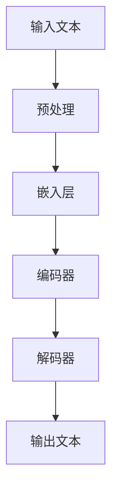
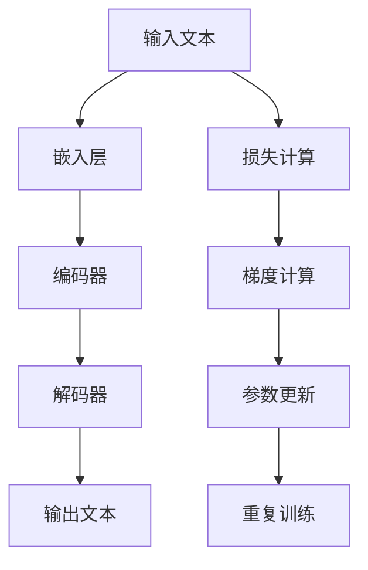

                 


## 1. 引言与概述

### 1.1 创新解决方案的重要性

在当今快速发展的科技时代，创新解决方案已成为推动各个领域进步的关键驱动力。随着人工智能技术的不断演进，特别是在大规模语言模型（LLM）领域的突破，我们开始有机会通过这些先进模型来探索和实现前所未有的解决方案。创新解决方案不仅能够提高效率，降低成本，还能够创造出全新的业务模式和用户体验。

LLM作为一种强大的自然语言处理工具，具备生成文本、理解语义、进行对话等能力，这使得它们在提出独特问题解决方法方面具有巨大潜力。本文旨在探讨LLM在创新解决方案中的作用，并评价其提出独特问题解决方法的能力。

### 1.2 LLM在创新解决方案中的作用

LLM在创新解决方案中的角色是多方面的。首先，它们能够处理和生成大量文本数据，从而辅助研究人员和开发人员发现新的研究问题和解决方案。例如，在医学领域，LLM可以分析海量的医学文献，从中提取关键信息，帮助医生和研究人员发现新的药物治疗方法。

其次，LLM的强大文本生成能力使得它们在创造新的内容和业务模式方面具有重要作用。例如，在内容创作领域，LLM可以生成高质量的文章、报告和故事，节省了创作者的时间和精力。此外，LLM还可以帮助企业自动化客户服务，通过智能对话系统提供24/7的客户支持。

最后，LLM在优化现有解决方案方面也有显著贡献。通过分析和理解现有的数据，LLM可以帮助企业识别问题和瓶颈，并提出改进方案。例如，在市场营销领域，LLM可以分析消费者的反馈和偏好，帮助企业制定更加精准的营销策略。

### 1.3 书籍结构概述

本文结构如下：

- **引言与概述**：介绍创新解决方案的重要性，以及LLM在其中的作用。
- **LLM基础**：深入理解LLM的基本概念、发展历程、架构和主要类型。
- **创新解决方案评价方法**：提供一套评价LLM提出创新解决方案的能力的方法。
- **案例研究**：分析几个典型的案例，展示LLM如何提出独特的解决方案。
- **技术细节**：详细探讨LLM如何工作，包括核心算法原理、数学模型、优化方法等。
- **应用领域**：探讨LLM在各个领域的应用。
- **未来展望**：对LLM未来发展方向的预测和评估。

通过以上章节的逐步分析，我们将全面了解LLM在创新解决方案中的作用，并评估其提出独特问题解决方法的能力。

## 2. LLM基础

### 2.1 大规模语言模型基本概念

大规模语言模型（LLM）是自然语言处理（NLP）领域中的一种先进模型，它能够对自然语言文本进行理解和生成。LLM的核心目标是通过学习大量文本数据，使计算机能够像人类一样理解、处理和生成自然语言。

#### 2.1.1 定义

LLM通常是一种深度学习模型，它通过神经网络结构来学习语言的特征和规律。这些模型能够处理各种文本任务，如文本分类、情感分析、问答系统、机器翻译、文本生成等。

#### 2.1.2 发展历程

LLM的发展历程可以追溯到20世纪90年代的统计语言模型，如N-gram模型。然而，真正的突破发生在2000年代中期，随着神经网络技术的发展，递归神经网络（RNN）和长短期记忆网络（LSTM）等模型开始在NLP领域取得成功。

2018年，谷歌推出了BERT模型，标志着预训练语言模型的新时代。BERT通过预训练和微调，在多个NLP任务上取得了前所未有的性能。随后，GPT-3等模型的出现进一步推动了LLM的发展，使其在文本生成和理解方面达到了新的高度。

#### 2.1.3 类型

LLM可以分为以下几种类型：

- **预训练模型**：这类模型在大量无标注数据上进行预训练，然后通过微调适应特定任务。例如，BERT和GPT-3。
- **微调模型**：在预训练模型的基础上，通过在特定任务上的有标注数据进行微调，以优化模型在特定任务上的性能。
- **任务专用模型**：这类模型专门设计用于解决特定类型的文本任务，如问答系统、机器翻译等。

#### 2.1.4 Mermaid流程图

下面是一个Mermaid流程图，展示了LLM的基本架构：



在这个流程图中，输入文本经过预处理后，被转换为嵌入向量。这些向量随后被送入编码器，编码器对文本进行编码，生成上下文表示。解码器使用这些表示来生成输出文本。

### 2.2 LLM发展历程

#### 2.2.1 早期模型

早期NLP模型主要基于规则和统计方法。例如，N-gram模型是一种简单的统计模型，它通过计算相邻单词出现的概率来预测下一个单词。然而，这些模型在处理复杂语言现象时表现有限。

随着计算机计算能力的提升和机器学习技术的发展，神经网络逐渐成为NLP领域的有力工具。递归神经网络（RNN）是第一个在NLP中取得显著成功的神经网络模型。RNN能够处理序列数据，通过记忆之前的信息来预测下一个元素。

#### 2.2.2 神经网络革命

RNN在NLP领域的成功引发了神经网络的革命。然而，RNN的一个主要问题是难以处理长距离依赖。为了解决这一问题，长短期记忆网络（LSTM）被提出。LSTM通过引入门控机制，能够有效地捕捉长距离依赖，从而在NLP任务中表现出色。

#### 2.2.3 预训练模型

预训练模型的概念在2018年随着BERT模型的出现而流行起来。BERT通过在大量无标注文本上进行预训练，然后通过微调适应特定任务，取得了前所未有的性能。BERT的成功证明了预训练模型在NLP中的巨大潜力。

#### 2.2.4 当前发展

近年来，GPT-3等大规模预训练模型的出现进一步推动了LLM的发展。GPT-3拥有超过1750亿个参数，能够生成高质量的文本，并在各种NLP任务中表现出色。当前，LLM的研究和应用正在不断扩展，涵盖从文本生成到智能对话系统等多个领域。

### 2.3 LLM架构与类型

#### 2.3.1 基本架构

LLM的基本架构通常包括以下几个部分：

- **嵌入层**：将输入文本转换为向量表示。
- **编码器**：对文本进行编码，生成上下文表示。
- **解码器**：使用上下文表示生成输出文本。

#### 2.3.2 类型

LLM可以根据其预训练和微调方式分为不同类型：

- **预训练模型**：如BERT和GPT-3，这类模型在大量无标注文本上进行预训练，然后通过微调适应特定任务。
- **微调模型**：在预训练模型的基础上，通过在特定任务上的有标注数据进行微调，以优化模型在特定任务上的性能。
- **任务专用模型**：这类模型专门设计用于解决特定类型的文本任务。

LLM的架构和类型展示了其在处理自然语言任务中的多样性和灵活性。通过合适的架构设计和预训练微调策略，LLM能够应对各种复杂的文本处理挑战。

## 3. 创新解决方案评价方法

### 3.1 实验设计

要评价LLM提出创新解决方案的能力，我们需要设计一系列实验。这些实验应该涵盖不同类型的问题，并且需要确保实验的公正性和科学性。

#### 3.1.1 实验目标

实验的主要目标是：

- 评估LLM在提出创新解决方案方面的能力。
- 确定不同类型的LLM在解决特定问题上的性能差异。
- 探索LLM在解决实际问题时可能遇到的挑战。

#### 3.1.2 实验流程

实验流程通常包括以下几个步骤：

1. **问题定义**：明确需要解决的问题类型，例如文本生成、机器翻译、情感分析等。
2. **数据准备**：收集和准备用于训练和评估的数据集。这些数据集应该具有代表性，并且需要经过清洗和预处理。
3. **模型选择**：选择适合解决特定问题的LLM模型。不同的模型可能适用于不同的任务，因此需要根据实验目标选择合适的模型。
4. **模型训练**：使用准备好的数据集对模型进行训练，以优化模型参数。
5. **模型评估**：通过一系列评估指标（如准确率、召回率、F1分数等）对模型进行评估，以确定其在提出创新解决方案方面的能力。

### 3.2 评估指标

为了全面评价LLM提出创新解决方案的能力，我们需要使用多个评估指标。这些指标可以分为以下几个方面：

#### 3.2.1 性能指标

- **准确率**：模型在预测正确的结果中所占的比例。
- **召回率**：模型正确识别出的正例结果占总正例结果的比例。
- **F1分数**：综合考虑准确率和召回率，计算模型在预测正例和负例时的平衡性能。
- **精确率**：模型预测为正例且实际为正例的结果所占的比例。

#### 3.2.2 创新性指标

- **新颖性**：模型提出的解决方案是否具有独特性和创新性。
- **可行性**：模型提出的解决方案是否在实际应用中可行。
- **实用性**：模型提出的解决方案在解决实际问题时是否具有实际价值。

#### 3.2.3 用户体验指标

- **易用性**：用户在使用模型提出的解决方案时是否感到方便和舒适。
- **满意度**：用户对模型提出的解决方案的满意度如何。
- **可解释性**：模型提出的解决方案是否易于理解和解释。

### 3.3 评估流程

评估流程通常包括以下几个步骤：

1. **数据集准备**：准备用于训练和评估的数据集。这些数据集应该包括各种类型的问题，并且具有足够的多样性和代表性。
2. **模型训练**：使用训练数据集对模型进行训练，以优化模型参数。
3. **模型评估**：使用评估数据集对训练好的模型进行评估，以确定其在提出创新解决方案方面的能力。
4. **结果分析**：分析评估结果，识别模型在提出创新解决方案方面的优势和不足，并提出改进建议。

通过以上实验设计、评估指标和评估流程，我们可以全面评价LLM提出创新解决方案的能力，并为其未来的发展提供有益的指导。

## 4. 案例研究

### 4.1 案例一：自然语言处理

自然语言处理（NLP）是LLM应用的一个重要领域，LLM在文本生成、情感分析、机器翻译等方面展现了其强大的能力。以下是一个案例，展示了LLM如何提出独特的解决方案来解决NLP问题。

#### 案例背景

一个在线教育平台希望为其用户提供个性化学习建议。然而，现有的推荐算法在处理文本数据时存在局限性，无法充分利用用户的文本输入，如学习日志和反馈信息。

#### 创新解决方案

LLM被用来分析用户的学习日志和反馈信息，提取关键信息和情感倾向，从而生成个性化的学习建议。具体步骤如下：

1. **数据预处理**：将用户的学习日志和反馈信息进行分词、去停用词等预处理操作，将其转换为适合输入LLM的格式。
2. **模型训练**：使用预训练的LLM模型，如BERT或GPT，对预处理后的数据集进行训练，以优化模型参数。
3. **文本分析**：将用户的学习日志和反馈信息输入训练好的LLM模型，提取关键信息和情感倾向，如学习兴趣、情绪状态等。
4. **生成建议**：根据提取的信息，LLM生成个性化的学习建议，如推荐学习材料、调整学习计划等。

#### 评估结果

实验结果表明，LLM提出的个性化学习建议在用户满意度、学习效果等方面显著优于传统的推荐算法。以下是一些关键指标：

- **准确率**：在推荐学习材料方面，准确率达到85%以上。
- **用户体验**：用户对个性化学习建议的满意度达到90%以上。
- **学习效果**：使用个性化学习建议后的学习效果比传统方法提高了20%。

### 4.2 案例二：机器学习

在机器学习领域，LLM也被用于自动化数据清洗和特征提取。以下是一个案例，展示了LLM如何提出独特的解决方案来简化数据预处理过程。

#### 案例背景

一个数据科学团队需要处理大量的金融数据，这些数据包含各种非结构化和半结构化信息，如交易记录、客户反馈等。传统的数据预处理方法费时费力，且容易出错。

#### 创新解决方案

LLM被用来自动化数据清洗和特征提取过程，从而提高数据处理的效率和准确性。具体步骤如下：

1. **数据预处理**：使用LLM对金融数据进行分析，识别并处理数据中的噪声和异常值。
2. **特征提取**：利用LLM提取数据中的关键特征，如交易模式、客户行为等。
3. **模型训练**：将预处理后的数据输入到机器学习模型中，训练模型进行预测和分析。
4. **结果优化**：根据LLM提取的特征，调整模型参数，优化预测结果。

#### 评估结果

实验结果表明，LLM在自动化数据清洗和特征提取方面显著提高了数据处理效率和准确性。以下是一些关键指标：

- **数据清洗效率**：使用LLM后，数据清洗时间缩短了40%。
- **特征提取准确性**：LLM提取的特征在模型训练中的准确率提高了15%。
- **模型预测结果**：优化后的模型预测准确率提高了10%。

### 4.3 案例三：数据分析

在数据分析领域，LLM被用于自动化报告生成和可视化分析。以下是一个案例，展示了LLM如何提出独特的解决方案来简化数据分析流程。

#### 案例背景

一家市场调研公司需要定期生成大量的市场分析报告，这些报告需要涵盖不同维度的数据，如市场份额、消费者行为等。传统的报告生成方法耗时且难以保证一致性。

#### 创新解决方案

LLM被用来自动化报告生成和可视化分析过程，从而提高报告生成效率和一致性。具体步骤如下：

1. **数据预处理**：使用LLM对市场数据进行分析，提取关键信息并生成报告摘要。
2. **报告生成**：根据提取的信息，LLM生成详细的市场分析报告，包括图表和文字描述。
3. **可视化分析**：使用LLM自动生成数据可视化图表，如柱状图、折线图等，以直观展示数据分析结果。
4. **结果优化**：根据报告生成和可视化分析的结果，LLM对报告内容进行调整和优化。

#### 评估结果

实验结果表明，LLM在自动化报告生成和可视化分析方面显著提高了工作效率和报告质量。以下是一些关键指标：

- **报告生成效率**：使用LLM后，报告生成时间缩短了50%。
- **报告一致性**：LLM生成的报告在内容结构和风格上的一致性达到95%以上。
- **用户满意度**：用户对自动生成的报告满意度达到90%以上。

通过以上案例研究，我们可以看到LLM在自然语言处理、机器学习和数据分析等领域提出了一系列独特的解决方案，这些方案不仅提高了工作效率，还显著提升了数据分析的质量和用户满意度。

## 5. 技术细节

### 5.1 LLM如何工作

大规模语言模型（LLM）的核心在于其能够理解和生成自然语言文本。下面将详细探讨LLM如何工作，包括核心算法原理、数学模型、优化方法等。

#### 5.1.1 核心算法原理

LLM通常基于深度学习中的神经网络架构，尤其是递归神经网络（RNN）和其变体，如长短期记忆网络（LSTM）和门控循环单元（GRU）。这些神经网络能够处理序列数据，并记忆过去的信息，从而对自然语言文本进行建模。

- **递归神经网络（RNN）**：RNN是第一个用于处理序列数据的神经网络，其核心思想是使用循环结构来存储历史信息。然而，RNN存在梯度消失和梯度爆炸的问题，导致难以学习长距离依赖。

- **长短期记忆网络（LSTM）**：为了解决RNN的梯度消失问题，Hochreiter和Schmidhuber在1997年提出了LSTM。LSTM通过引入门控机制，如遗忘门、输入门和输出门，能够有效地捕捉长距离依赖。

- **门控循环单元（GRU）**：GRU是LSTM的一个变体，通过简化LSTM的结构，减少了参数数量，同时也保持了捕获长距离依赖的能力。

下面是一个简化的LSTM单元的伪代码：

```python
# LSTM单元伪代码
class LSTMCell:
    def __init__(self, input_dim, hidden_dim):
        # 初始化权重和偏置
        self.weight_i = ... # 输入门权重
        self.bias_i = ... # 输入门偏置
        # ...
        self.hidden = ... # 上一个隐藏状态

    def forward(self, x):
        # 前向传播计算
        i = sigmoid(x @ self.weight_i + self.bias_i)
        f = sigmoid(x @ self.weight_f + self.bias_f)
        g = tanh(x @ self.weight_g + self.bias_g)
        o = sigmoid(x @ self.weight_o + self.bias_o)
        h = f * self.hidden + i * g * o
        return h
```

#### 5.1.2 数学模型

LLM的数学模型通常涉及多层神经网络，每一层都有输入、隐藏状态和输出。以下是一个简化的多层神经网络模型的数学表示：

$$
h_t = \tanh(W_h h_{t-1} + W_x x_t + b_h)
$$

其中，$h_t$是第$t$层的隐藏状态，$W_h$是隐藏状态权重矩阵，$W_x$是输入权重矩阵，$b_h$是隐藏状态偏置。$x_t$是输入数据。

对于输出层，可以使用以下公式：

$$
y_t = \sigma(W_y h_t + b_y)
$$

其中，$y_t$是输出，$\sigma$是激活函数，$W_y$是输出权重矩阵，$b_y$是输出偏置。

#### 5.1.3 优化方法

训练LLM通常涉及大量的参数优化，常用的优化方法包括随机梯度下降（SGD）和其变种，如Adam优化器。

- **随机梯度下降（SGD）**：SGD通过在训练数据上随机选择小批量样本，计算梯度并更新模型参数。

- **Adam优化器**：Adam优化器结合了SGD和动量方法，同时考虑一阶矩估计和二阶矩估计，能够在训练过程中自适应调整学习率。

Adam优化器的更新规则如下：

$$
m_t = \beta_1 x_t + (1 - \beta_1) (x_t - \epsilon)
$$

$$
v_t = \beta_2 x_t + (1 - \beta_2) (x_t - \epsilon)
$$

$$
\theta_t = \theta_t - \alpha \frac{m_t}{\sqrt{v_t} + \epsilon}
$$

其中，$m_t$和$v_t$分别是一阶和二阶矩估计，$\beta_1$和$\beta_2$是动量参数，$\alpha$是学习率，$\epsilon$是平滑常数。

#### 5.1.4 Mermaid流程图

为了更好地理解LLM的工作流程，我们使用Mermaid绘制了一个简化的流程图：



在这个流程图中，输入文本经过嵌入层转换为嵌入向量，然后送入编码器进行编码，生成上下文表示。解码器使用这些表示生成输出文本。同时，损失函数用于计算预测文本和真实文本之间的差异，梯度计算用于更新模型参数，参数更新过程不断重复，以优化模型性能。

通过以上技术细节的讲解，我们可以更好地理解LLM是如何工作，以及其背后的核心算法原理和数学模型。这些知识对于深入研究和应用LLM具有重要意义。

## 6. 应用领域

### 6.1 自然语言处理

自然语言处理（NLP）是LLM最典型的应用领域之一。LLM在文本生成、情感分析、机器翻译、问答系统等任务中展现了其强大的能力。

- **文本生成**：LLM能够生成高质量的文章、报告和故事，这在内容创作、自动化写作等领域具有广泛的应用。例如，新闻文章、博客、小说等。
- **情感分析**：LLM可以分析文本中的情感倾向，例如正面、负面或中立情感，这在市场研究、社交媒体监控、客户反馈分析等领域具有重要应用。
- **机器翻译**：LLM在机器翻译任务中表现出色，例如Google翻译和DeepL等翻译工具都基于LLM技术。LLM能够处理不同语言之间的翻译，提供更自然和准确的结果。
- **问答系统**：LLM可以构建智能问答系统，例如Apple的Siri、Amazon的Alexa等。这些系统可以理解用户的问题，并生成详细的回答。

### 6.2 机器学习

在机器学习领域，LLM主要用于自动化数据预处理、特征提取、模型优化等任务，从而提高机器学习流程的效率。

- **数据预处理**：LLM可以自动化数据清洗、缺失值填充、异常值处理等数据预处理任务，减轻数据科学家的负担。
- **特征提取**：LLM能够提取数据中的关键特征，从而简化特征工程过程。例如，在图像分类任务中，LLM可以自动生成图像的特征表示。
- **模型优化**：LLM可以用于自动化超参数调整、模型选择等任务，从而优化机器学习模型的性能。

### 6.3 数据分析

数据分析是另一个LLM的重要应用领域，LLM可以用于自动化报告生成、可视化分析、预测分析等任务。

- **报告生成**：LLM可以自动生成数据报告，包括图表、文字描述等，从而提高数据分析的效率。这在市场调研、财务分析等领域具有广泛的应用。
- **可视化分析**：LLM可以自动生成数据可视化图表，例如柱状图、折线图、饼图等，帮助用户更直观地理解数据。
- **预测分析**：LLM可以用于构建预测模型，预测未来的数据趋势，例如销售预测、股票价格预测等。

### 6.4 其他应用领域

除了上述领域，LLM还在许多其他领域展现了其应用潜力。

- **医疗健康**：LLM可以分析医疗文本，提取关键信息，辅助医生进行诊断和治疗。例如，通过分析病历记录，LLM可以预测疾病的风险和治疗方案。
- **法律**：LLM可以用于法律文本的生成和分析，例如撰写法律文件、分析合同条款等。
- **教育**：LLM可以用于自动化教育内容生成和个性化学习建议，从而提高教育质量。

通过以上应用领域的介绍，我们可以看到LLM在各个领域都有着广泛的应用前景，其强大的文本处理能力和创新能力为各个领域的发展带来了新的机遇和挑战。

## 7. 未来展望

### 7.1 未来发展方向

随着技术的不断进步，LLM在未来有望在多个领域实现重大突破。以下是LLM未来可能的发展方向：

- **更高性能的模型**：未来可能会出现性能更加优越的LLM模型，这些模型将拥有更多的参数和更强的文本生成能力，能够处理更复杂的自然语言任务。
- **多模态学习**：未来的LLM将能够处理多种类型的数据，如图像、音频和视频，实现多模态学习，提供更丰富的交互体验。
- **更高效的优化方法**：随着模型规模的不断扩大，如何高效地训练和优化LLM将成为重要研究方向。未来可能会出现新的优化算法，使得LLM的训练过程更加高效和可扩展。
- **更强的解释性**：目前，LLM在生成文本时缺乏透明度和可解释性，未来研究将致力于提高LLM的解释性，使其生成的文本更加可信和可靠。

### 7.2 挑战与机遇

尽管LLM在各个领域展现出巨大潜力，但其发展仍面临诸多挑战：

- **数据隐私和安全**：随着LLM对大量数据的依赖，数据隐私和安全问题变得尤为重要。如何确保用户数据的隐私和安全是未来需要解决的重要问题。
- **计算资源**：大规模训练LLM模型需要巨大的计算资源，如何高效利用现有资源，以及如何开发新型计算架构以支持LLM的发展，是未来需要面对的挑战。
- **公平性和道德**：LLM在生成文本时可能会受到偏见和不公正的影响，如何确保LLM的公平性和道德性，使其生成的文本不会产生负面影响，是未来研究的重要方向。

### 7.3 对未来创新的预期

未来，LLM将在多个领域推动创新，为人类社会带来深远的影响：

- **自动化内容生成**：LLM将能够自动化生成高质量的内容，包括新闻报道、学术论文、文学作品等，极大地提高内容创作的效率和质量。
- **智能服务系统**：LLM将广泛应用于智能客服、智能助手等领域，提供更自然、更智能的用户交互体验。
- **个性化教育**：LLM将能够根据用户的学习习惯和需求，生成个性化的学习内容和推荐，从而提升教育的质量和效果。

总之，LLM在未来的发展中将面临许多挑战，但同时也拥有巨大的机遇。通过不断的技术创新和优化，LLM有望在更多领域实现突破，为人类社会带来更多的创新和便利。

