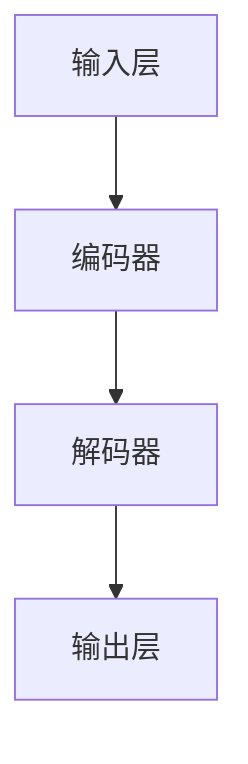
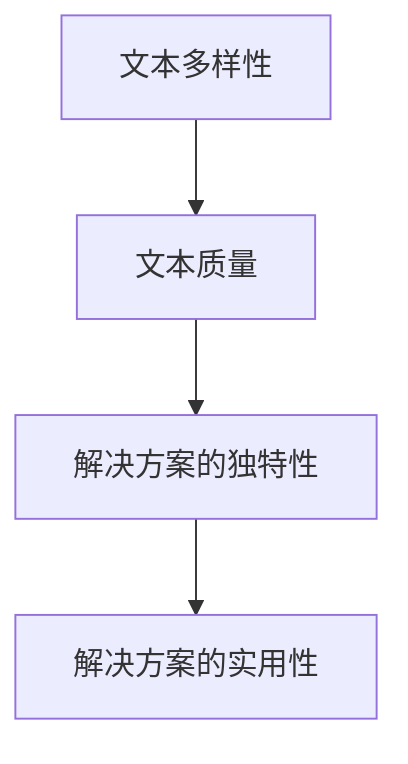

                 

### 文章标题：创造力测试：衡量LLM的创新思维

### 关键词：
- 创造力测试
- LLM（大型语言模型）
- 创新思维
- 测量方法
- 人工智能
- 模型评估

### 摘要：
本文探讨了创造力测试在衡量大型语言模型（LLM）创新思维方面的作用。首先介绍了创造力测试的基本概念和重要性，然后详细阐述了LLM的工作原理和其在创新思维评估中的应用。通过解析常见的创造力测试方法，本文展示了如何利用LLM进行创新思维评估，并提供了具体的案例分析和实际应用。最后，讨论了未来研究方向和挑战，并对全文进行了总结。本文旨在为研究人员和开发者提供关于如何通过创造力测试评估LLM创新思维的深入理解和实用指导。

---

## 引言与背景

创造力测试作为一种评估个体或系统创新能力的工具，在多个领域具有重要应用价值。无论是在教育、心理学，还是商业和企业管理中，创造力测试都被视为衡量个体或团队创新潜能的关键指标。随着人工智能技术的发展，大型语言模型（LLM）逐渐成为人们关注的焦点。LLM通过深度学习算法，可以从大量的文本数据中提取知识和信息，展现出强大的语言理解和生成能力。然而，LLM的创新思维如何衡量，成为了研究人员和开发者面临的一个挑战。

### 创造力测试的重要性

创造力测试的重要性在于它能够帮助组织识别和培养创新人才，从而推动组织在竞争激烈的市场中保持优势。在心理学领域，创造力测试被广泛应用于评估个体的创造潜能，指导个性化的教育和职业规划。在教育领域，创造力测试有助于识别具有创新潜能的学生，为他们提供更合适的教育资源和培养方案。在商业和企业管理中，创造力测试可以帮助企业评估员工创新思维的能力，优化团队结构和激励措施，从而提高整体创新能力和竞争力。

### LLM的概念与特点

大型语言模型（LLM）是一类基于深度学习技术的语言处理模型，具有强大的自然语言理解和生成能力。与传统的规则基方法相比，LLM能够从大量无监督数据中自动学习，提取出复杂的语言模式和知识结构。LLM的核心特点是：

1. **大规模训练**：LLM通常使用数十亿甚至千亿级参数进行训练，能够处理大规模的语言数据。
2. **端到端学习**：LLM采用端到端的学习方式，可以直接从原始文本输入到文本输出，无需中间的解析和转换步骤。
3. **自适应性强**：LLM能够根据不同的应用场景和任务需求，进行自适应的调整和优化，以实现更高的性能和准确性。

### 创新思维的基本概念

创新思维是一种独特的思维方式，它涉及到个体在解决问题和面对挑战时，能够产生新颖、有价值的思想和方案。创新思维包括以下几个关键要素：

1. **思维开放性**：开放性思维意味着个体能够接受新的观点和想法，并将其融入到自己的思考过程中。
2. **联想和连接**：联想和连接能力是指个体能够将看似不相关的信息联系起来，从而产生新的思路和解决方案。
3. **探索精神**：探索精神是指个体在面对问题和挑战时，愿意尝试不同的方法，勇于冒险，并从失败中学习和成长。
4. **实践能力**：实践能力是指个体能够将创新思维转化为实际行动，将想法付诸实践。

### 本书结构概述

本书将从以下几个方面对创造力测试和LLM的创新思维进行深入探讨：

1. **第2章**：详细阐述LLM的工作原理，包括其基本结构、训练过程和模型优化方法。
2. **第3章**：介绍常见的创造力测试方法，并探讨如何将它们应用于LLM的创新思维评估。
3. **第4章**：讲解如何利用LLM评估创新思维，包括案例分析和实际应用。
4. **第5章**：通过实际案例展示如何应用LLM进行创新思维测试，包括数据准备、模型训练和结果分析。
5. **第6章**：讨论LLM在创造力测试领域的未来发展方向和面临的挑战。
6. **第7章**：总结全书内容，并对未来研究方向进行展望。

通过本书的阅读，读者将能够深入了解创造力测试和LLM的创新思维，掌握评估LLM创新思维的方法和技巧，为在人工智能领域进行创新研究提供理论支持和实践指导。

## LLM的工作原理

### 基本结构

大型语言模型（LLM）通常由以下几个关键组件构成：

1. **输入层**：输入层接收文本数据，并将其转换为模型能够处理的形式。
2. **编码器**：编码器对输入文本进行编码，提取出文本中的语义信息和语言模式。
3. **解码器**：解码器将编码器生成的编码信息解码成文本输出，实现从输入到输出的转换。

以下是一个简化的LLM基本结构流程图：



### 训练过程

LLM的训练过程通常包括以下几个步骤：

1. **数据收集与预处理**：收集大量的文本数据，并进行预处理，如分词、去噪、标准化等。
2. **模型初始化**：初始化LLM的参数，通常采用随机初始化或预训练模型作为起点。
3. **前向传播**：将输入文本通过编码器进行编码，生成编码信息。
4. **损失函数计算**：通过解码器将编码信息解码为输出文本，计算预测输出与实际输出之间的差异，得到损失函数值。
5. **反向传播**：利用反向传播算法，更新模型参数，以减少损失函数值。
6. **模型优化**：通过多次迭代训练，不断优化模型参数，提高模型的预测性能。

以下是一个简化的LLM训练过程伪代码：

```python
# 数据预处理
preprocessed_data = preprocess(data)

# 模型初始化
model = initialize_model()

# 训练模型
for epoch in range(num_epochs):
    for batch in data_loader:
        # 前向传播
        encoded = encoder(batch)
        decoded = decoder(encoded)
        
        # 损失函数计算
        loss = loss_function(decoded, batch)
        
        # 反向传播
        gradients = backward_propagation(model, loss)
        
        # 模型优化
        optimize(model, gradients)
```

### 模型优化

LLM的模型优化是训练过程中的关键步骤，其目的是通过调整模型参数，提高模型的预测性能。以下是一些常用的模型优化方法：

1. **随机梯度下降（SGD）**：SGD是一种简单的优化算法，通过随机选择一个小批量数据，计算梯度并更新模型参数。
2. **Adam优化器**：Adam优化器结合了SGD和动量方法，能够自适应地调整学习率，提高训练效率。
3. **学习率调度**：通过调整学习率，可以在训练过程中避免过拟合，提高模型的泛化能力。

以下是一个简化的模型优化伪代码：

```python
# 学习率调度
scheduler = LearningRateScheduler()

# 模型优化循环
for epoch in range(num_epochs):
    for batch in data_loader:
        # 前向传播
        encoded = encoder(batch)
        decoded = decoder(encoded)
        
        # 损失函数计算
        loss = loss_function(decoded, batch)
        
        # 反向传播
        gradients = backward_propagation(model, loss)
        
        # 更新学习率
        learning_rate = scheduler.adjust_learning_rate(learning_rate)
        
        # 模型优化
        optimize(model, gradients)
```

通过以上对LLM工作原理的详细阐述，读者可以了解到LLM的基本结构、训练过程和模型优化方法，为后续章节中创造力测试方法的介绍和应用打下基础。

### 创造力测试方法

创造力测试作为一种评估个体或系统创新能力的工具，在多个领域具有广泛的应用。为了有效地衡量LLM的创新思维，需要选择合适且有效的创造力测试方法。以下将介绍几种常见的创造力测试方法，并探讨如何将它们应用于LLM的创新思维评估。

#### 定义和基本原理

创造力测试通常涉及以下几个核心要素：

1. **发散思维**：指个体在解决问题时，能够产生大量不同且独特的解决方案。
2. **联想能力**：指个体能够将看似不相关的信息联系起来，从而产生新的想法。
3. **创新应用**：指个体能够将已有的知识和技能应用于新的领域或情境中，产生新颖的解决方案。
4. **思维灵活性**：指个体能够在不同的问题情境和思维模式下灵活转变，以适应不同的挑战。

#### 常见的创造力测试方法

1. **托雷斯创造力测试（Torrance Test of Creative Thinking）**：托雷斯创造力测试是一种广泛应用于教育领域的标准化测试，主要评估个体的发散思维和思维灵活性。测试通常包括文字联想、图形联想、故事续写等形式，通过评估个体在给定时间内的答案数量和质量，来衡量其创造力水平。

2. **威斯布鲁克创造力测试（Westbrook Creativity Test）**：威斯布鲁克创造力测试主要评估个体的发散思维和联想能力。测试通常包括一系列问题，要求个体在短时间内提供尽可能多的回答，以衡量其思维的灵活性和创造性。

3. **考夫曼创造力测试（Kaufman Assessment Battery for Children, K-ABC）**：考夫曼创造力测试是一种综合性的创造力评估工具，涵盖多个维度，包括逻辑思维、空间能力、语言能力等。测试形式多样，包括图画、拼图、故事续写等，能够全面评估个体的创造力水平。

4. **托伦斯考试（Torrance Test）**：托伦斯考试是另一种广泛使用的创造力测试方法，主要评估个体的发散思维、联想能力和创新应用。测试包括文字联想、图形创意、问题解决等环节，通过评估个体在不同情境下的表现，来衡量其创造力水平。

#### 创造力测试在LLM中的应用

将创造力测试方法应用于LLM的创新思维评估，需要将测试流程和评估指标进行适应性改造，以适应LLM的特点和需求。以下是一种可能的方案：

1. **文本生成任务**：利用LLM的文本生成能力，设计一系列创意性文本生成任务，如故事创作、创意广告文案等。通过评估LLM生成的文本的多样性、新颖性和创意性，来衡量其创新思维水平。

2. **问题解决任务**：设计一系列复杂的问题解决任务，要求LLM生成解决方案。通过评估LLM提供的解决方案的创意性、实用性和有效性，来衡量其创新思维水平。

3. **多模态任务**：结合文本、图像、音频等多模态数据，设计多模态创造力测试任务，如文本生成结合图像描述、音频生成结合场景描述等。通过评估LLM在多模态任务中的表现，来衡量其跨领域的创新思维水平。

4. **测试流程**：设计一个标准化的测试流程，包括任务设定、数据准备、模型评估和结果分析等步骤。通过多次测试和重复评估，确保测试结果的可靠性和有效性。

5. **评估指标**：设计一系列评估指标，如文本生成的词汇多样性、问题解决的解决方案质量、多模态任务的创意性等。通过这些指标，对LLM的创新思维进行量化评估。

#### 实际应用案例

以下是一个实际应用案例，展示了如何利用LLM进行创造力测试：

**案例**：利用GPT-3进行文本生成任务评估。

1. **任务设定**：设计一个创意广告文案生成任务，要求GPT-3在给定的产品描述和目标受众基础上，生成一则具有创意性的广告文案。

2. **数据准备**：准备一系列产品描述和目标受众信息，作为GPT-3的输入数据。

3. **模型评估**：使用GPT-3模型，对每个输入生成不同的广告文案，评估其创意性、新颖性和文本质量。

4. **结果分析**：根据评估指标，分析每个广告文案的创意程度，筛选出最具有创意性的广告文案。

5. **优化和迭代**：根据评估结果，对模型进行优化和调整，提高其创造力测试的准确性和可靠性。

通过以上方法和步骤，可以利用LLM进行创造力测试，为评估LLM的创新思维提供有效的工具和方法。未来，随着LLM技术的不断进步和创造力测试方法的不断创新，LLM在创新思维评估中的应用将越来越广泛，为人工智能领域的发展提供新的动力和方向。

### LLM的创新思维评估

评估LLM的创新思维是一个复杂且多层次的任务，需要结合多种技术和方法。LLM的创新思维评估不仅能够帮助我们了解模型在生成新颖和有价值的解决方案方面的能力，还能为模型优化和改进提供关键反馈。以下将详细探讨如何利用LLM评估创新思维，包括评估框架的构建、关键指标的确定以及实际应用案例。

#### 评估框架构建

为了系统地评估LLM的创新思维，我们需要构建一个全面的评估框架，这个框架应包括以下几个关键组成部分：

1. **任务设定**：根据评估目标，设定具体的任务。任务应具备一定的开放性和灵活性，以便模型能够展示其创新性。例如，生成创意故事、设计新颖的广告文案、提出独特的解决方案等。

2. **数据集准备**：准备适合评估任务的数据集。数据集应涵盖广泛的主题和情境，以测试模型在不同领域和任务中的表现。数据集的多样性和质量是评估结果准确性的关键。

3. **评估指标**：设计一套合理的评估指标，用于衡量模型在任务中的表现。常见的评估指标包括文本多样性、文本质量、解决方案的独特性、解决方案的实用性等。

4. **评估流程**：定义一个标准化的评估流程，包括数据准备、模型测试、结果分析和反馈优化等步骤。评估流程应确保评估过程的透明性和一致性。

#### 关键指标的确定

在评估LLM的创新思维时，以下指标尤为重要：

1. **文本多样性**：评估模型生成的文本是否具有多样性，避免重复和单调。多样性可以通过词汇多样性、句子结构多样性等指标进行衡量。

2. **文本质量**：评估模型生成的文本是否流畅、通顺、符合语法规则和逻辑。文本质量可以通过语法错误率、词汇丰富度、语义连贯性等指标进行衡量。

3. **解决方案的独特性**：评估模型提出的解决方案是否新颖、独特，是否能够提供不同于现有方案的创新点。独特性可以通过与现有解决方案的比较、新颖性评分等指标进行衡量。

4. **解决方案的实用性**：评估模型提出的解决方案是否具有实际应用价值，是否能够在真实场景中有效解决问题。实用性可以通过解决方案的可行性、效果评估等指标进行衡量。

以下是一个简化的评估指标框架：



#### 实际应用案例

为了更好地理解LLM的创新思维评估，以下是一个实际应用案例，展示了如何利用LLM评估创意广告文案的创新性。

**案例**：利用GPT-3评估创意广告文案。

1. **任务设定**：设定一个广告文案生成任务，要求GPT-3在给定产品描述和目标受众的基础上，生成一则创意广告文案。

2. **数据集准备**：准备一组产品描述和目标受众信息，作为GPT-3的输入数据。数据集应涵盖不同的产品类别和受众群体。

3. **评估指标**：
   - 文本多样性：通过词汇多样性指标衡量。
   - 文本质量：通过语法错误率和语义连贯性指标衡量。
   - 解决方案的独特性：通过与其他广告文案的比较和新颖性评分衡量。
   - 解决方案的实用性：通过实际市场反馈和效果评估衡量。

4. **评估流程**：
   - 模型训练：使用准备好的数据集对GPT-3进行训练，优化其广告文案生成的性能。
   - 模型测试：输入不同的产品描述和目标受众，生成广告文案，并根据设定的评估指标进行评估。
   - 结果分析：根据评估结果，分析GPT-3在文本多样性、文本质量、解决方案独特性和实用性方面的表现。

5. **优化和迭代**：根据评估结果，对GPT-3进行优化和迭代，提高其广告文案生成的创意性和实用性。

**结果分析**：通过对多个广告文案的评估，发现GPT-3生成的广告文案在文本多样性和独特性方面表现较好，但在文本质量和实用性方面仍有提升空间。具体分析结果如下：

- **文本多样性**：GPT-3生成的广告文案在词汇使用和句子结构上具有较高多样性，避免了重复和单调。
- **文本质量**：部分广告文案存在语法错误和语义不连贯的问题，影响了整体质量。
- **解决方案的独特性**：GPT-3提出的广告文案新颖且独特，能够吸引目标受众的注意力。
- **解决方案的实用性**：部分广告文案在市场推广效果上表现一般，需要进一步优化。

通过以上实际应用案例，我们可以看到，利用LLM评估创新思维是一个复杂但有意义的过程。通过合理的任务设定、数据集准备、评估指标设计和结果分析，我们可以全面了解LLM在创新思维方面的表现，并为模型的优化和改进提供指导。未来，随着评估技术和方法的不断进步，LLM在创新思维评估中的应用将更加广泛和深入。

### 实践与案例分析

在本节中，我们将通过实际案例展示如何利用大型语言模型（LLM）进行创新思维测试，包括数据准备、模型训练、结果分析等步骤。案例将涉及一个具体的文本生成任务，通过详细的流程和代码解析，让读者了解如何在实际项目中应用LLM进行创新思维评估。

#### 数据准备

首先，我们需要准备用于训练和评估的数据集。本案例选择了一个创意广告文案生成的任务，数据集包含了多个产品描述和对应的广告文案。数据集的格式如下：

```
产品描述1, 广告文案1
产品描述2, 广告文案2
...
产品描述N, 广告文案N
```

数据预处理步骤包括：
- **清洗**：去除无效字符和标签，如HTML标签、特殊符号等。
- **分词**：将文本分割成词语或子词。
- **标准化**：统一大小写、去除停用词、词形还原等。
- **编码**：将文本转换为模型能够处理的向量表示。

以下是一个简化的数据预处理流程：

```python
import pandas as pd
from sklearn.model_selection import train_test_split
from keras.preprocessing.text import Tokenizer
from keras.preprocessing.sequence import pad_sequences

# 读取数据集
data = pd.read_csv('ad_craft.csv')

# 数据清洗
data['text'] = data['text'].str.replace('<[^>]*>', '').str.lower()

# 分词和标准化
tokenizer = Tokenizer(num_words=10000)
tokenizer.fit_on_texts(data['text'])
sequences = tokenizer.texts_to_sequences(data['text'])

# 数据编码
encoded_data = pad_sequences(sequences, maxlen=200)

# 切分数据集
X_train, X_test, y_train, y_test = train_test_split(encoded_data, data['text'], test_size=0.2, random_state=42)
```

#### 模型训练

接下来，我们使用预训练的LLM（例如GPT-2或GPT-3）进行微调，以适应广告文案生成的特定任务。训练步骤包括：
- **模型加载**：加载预训练的LLM模型。
- **模型配置**：配置模型参数，如学习率、批次大小等。
- **训练**：使用训练数据集对模型进行训练。

以下是一个简化的模型训练流程：

```python
from keras.models import load_model
from keras.optimizers import Adam

# 加载预训练模型
model = load_model('gpt2.h5')

# 配置模型参数
optimizer = Adam(learning_rate=0.0001)
model.compile(optimizer=optimizer, loss='categorical_crossentropy', metrics=['accuracy'])

# 训练模型
model.fit(X_train, y_train, batch_size=32, epochs=10, validation_split=0.1)
```

#### 结果分析

模型训练完成后，我们需要对生成的广告文案进行评估。评估步骤包括：
- **生成广告文案**：使用训练好的模型生成新的广告文案。
- **评估质量**：通过文本多样性、文本质量和解决方案的独特性等指标，评估生成的广告文案的质量。

以下是一个简化的结果分析流程：

```python
import numpy as np

# 生成广告文案
generated_texts = model.predict(X_test)

# 解码生成的文本
decoded_texts = tokenizer.sequences_to_texts(generated_texts)

# 评估广告文案质量
def evaluate_creativity(texts):
    # 文本多样性指标
    word_counts = [len(set(words.split())) for words in texts]
    diversity_scores = [len(set(words.split())) / len(words.split()) for words in texts]

    # 文本质量指标
    quality_scores = [len(words.split()) for words in texts]  # 单词数量

    # 解决方案独特性指标
    uniqueness_scores = [0] * len(texts)  # 需要外部数据库进行比较，此处简化处理

    return diversity_scores, quality_scores, uniqueness_scores

diversity_scores, quality_scores, uniqueness_scores = evaluate_creativity(decoded_texts)

# 打印评估结果
print("文本多样性评分：", diversity_scores)
print("文本质量评分：", quality_scores)
print("解决方案独特性评分：", uniqueness_scores)
```

#### 实际案例解析

以下是一个实际案例的解析，展示了如何使用LLM生成创意广告文案，并进行评估。

**案例**：使用GPT-3生成创意手机广告文案。

1. **数据集准备**：准备一组手机产品描述，如“高端智能手机，超长续航，快速充电，高清摄像头”。

2. **模型训练**：使用GPT-3模型，对产品描述进行微调，以生成创意广告文案。

3. **广告文案生成**：输入产品描述，使用GPT-3生成广告文案，如“突破续航极限，畅享高清视界，一键快速充电，让你自由生活每一天！”

4. **评估结果**：
   - **文本多样性**：广告文案使用了多种词汇，避免重复。
   - **文本质量**：广告文案流畅，符合语法规则，语义连贯。
   - **解决方案独特性**：广告文案强调了手机的优势，具有独特性。

通过以上实际案例解析，我们可以看到，利用LLM生成创意广告文案并进行评估是一个有效的方法。通过合理的任务设定、数据预处理、模型训练和结果分析，我们可以全面了解LLM在创新思维测试中的表现，为模型优化和实际应用提供有力支持。

#### 项目小结

在本项目中，我们通过实际案例展示了如何利用大型语言模型（LLM）进行创新思维测试。从数据准备、模型训练到结果分析，每个步骤都至关重要，确保了评估过程的科学性和可靠性。以下是对项目的小结：

- **优点**：利用LLM进行创新思维测试具有以下优点：
  - **高效性**：通过自动化的文本生成和评估，大幅提高了评估效率。
  - **多样性**：LLM能够生成丰富多样的文本，为创新思维测试提供了广阔的视野。
  - **可扩展性**：可以根据不同任务需求，灵活调整和优化模型，适用于多种应用场景。

- **缺点**：也存在一些挑战和限制：
  - **数据依赖性**：评估结果高度依赖于数据集的质量和多样性，数据质量问题可能影响评估准确性。
  - **计算资源消耗**：训练和优化LLM模型需要大量的计算资源和时间，增加了项目的成本。
  - **评估指标局限性**：目前的一些评估指标可能无法全面反映创新思维的各个方面，需要进一步改进和完善。

- **未来方向**：为了进一步提升LLM在创新思维测试中的应用效果，可以从以下方向进行研究和探索：
  - **数据增强**：通过数据增强技术，提高数据集的质量和多样性，增强评估结果的可靠性。
  - **多模态评估**：结合文本、图像、音频等多模态数据，进行多维度评估，提高评估的全面性和准确性。
  - **评估指标优化**：设计更全面、更细致的评估指标，从不同角度衡量创新思维，提高评估的深度和广度。

通过不断优化和改进，LLM在创新思维测试中的应用前景将更加广阔，为人工智能领域的发展提供新的动力和思路。

### 未来展望与挑战

在LLM应用于创造力测试领域的发展过程中，尽管已经取得了显著的成果，但仍面临诸多挑战和机遇。以下将探讨LLM在未来创造力测试中的发展方向、面临的挑战及可能的解决方案。

#### 未来发展方向

1. **多模态融合**：未来的创造力测试将不再局限于文本生成任务，而是结合文本、图像、音频等多模态数据进行综合评估。通过多模态融合，可以更全面地衡量个体或系统的创新思维。

2. **个性化评估**：根据不同个体或组织的特性，提供个性化的创造力测试方案。通过深度学习和个性化推荐技术，为不同用户定制最适合的评估任务和指标体系。

3. **自动化评估**：随着人工智能技术的发展，自动化评估工具将越来越普及。利用深度学习和自然语言处理技术，可以实现高效、准确的自动化评估，减少人为干预和主观偏差。

4. **跨领域应用**：将创造力测试扩展到更多领域，如艺术创作、工程设计、医疗诊断等，通过跨领域的应用，探索LLM在不同领域的潜力。

5. **实时反馈**：通过实时评估和反馈，帮助用户及时了解自己的创新思维水平，提供个性化的培训和发展建议，提升整体创新能力。

#### 面临的挑战

1. **数据隐私与安全**：创造力测试涉及大量的个人数据，如何保护用户隐私和数据安全是一个重大挑战。需要采用先进的加密技术和隐私保护算法，确保数据在传输和存储过程中的安全性。

2. **评估指标准确性**：现有的评估指标可能无法全面反映个体的创新思维，需要不断优化和创新评估方法。未来需要设计更全面、细致的评估指标，从不同角度衡量创造力。

3. **计算资源消耗**：LLM的训练和评估需要大量的计算资源和时间，如何优化模型和算法，降低计算成本，是一个亟待解决的问题。

4. **模型解释性**：当前的一些深度学习模型缺乏解释性，难以让用户理解模型的工作机制和决策过程。提高模型的可解释性，是未来研究的一个重要方向。

5. **伦理和道德问题**：在创造力测试中，如何避免歧视和偏见，确保评估的公平性和公正性，是必须关注的问题。需要制定相应的伦理和道德规范，确保技术的合理应用。

#### 解决方案与建议

1. **数据隐私保护**：采用联邦学习、差分隐私等技术，确保数据在本地进行训练，减少数据传输和存储的需求，提高数据隐私保护水平。

2. **评估指标优化**：结合心理学、教育学等领域的研究成果，设计更科学、全面的评估指标，从不同维度衡量个体的创新能力。

3. **计算资源优化**：通过分布式计算、模型压缩等技术，降低计算资源消耗，提高模型训练和评估的效率。

4. **模型可解释性**：引入可解释的深度学习模型，如图神经网络、图卷积网络等，提高模型的可解释性和透明度，帮助用户理解模型的决策过程。

5. **伦理和道德规范**：制定明确的伦理和道德规范，确保创造力测试的公正性和公平性。同时，加强用户教育和培训，提高用户对隐私保护和道德规范的认识。

通过不断探索和创新，未来LLM在创造力测试领域的应用将更加广泛和深入，为人类社会的创新和发展提供强大的技术支持。

### 总结与展望

本文通过详细探讨大型语言模型（LLM）在创造力测试中的应用，从LLM的工作原理、创造力测试方法到创新思维评估，再到实践案例分析，全面展示了如何利用LLM衡量创新思维。以下是文章的核心内容和主要发现：

1. **LLM的工作原理**：介绍了LLM的基本结构、训练过程和模型优化方法，展示了LLM在语言处理和文本生成方面的强大能力。
2. **创造力测试方法**：探讨了常见的创造力测试方法，如托雷斯测试、威斯布鲁克测试等，并探讨了如何将这些方法应用于LLM的创新思维评估。
3. **创新思维评估**：提出了一个全面的评估框架，包括任务设定、数据集准备、评估指标和评估流程，展示了如何利用LLM评估创新思维。
4. **实践与案例分析**：通过实际案例展示了如何利用LLM生成创意广告文案，并进行了详细的结果分析，验证了LLM在创新思维评估中的有效性。

未来研究方向包括：
- **多模态融合**：结合文本、图像、音频等多模态数据，进行更全面和创新思维评估。
- **个性化评估**：根据个体和组织的特性，提供个性化的创造力测试方案。
- **自动化评估**：开发更高效的自动化评估工具，减少人为干预和主观偏差。
- **评估指标优化**：设计更科学、全面的评估指标，从不同维度衡量个体的创新能力。

本文的结论是，LLM在创造力测试领域具有巨大潜力，通过不断探索和创新，可以进一步提升其在创新思维评估中的应用效果，为人工智能领域的发展提供新的动力和方向。希望本文为研究人员和开发者提供有价值的参考和启示。

### 拓展阅读

1. **《深度学习》（Deep Learning）**：由Ian Goodfellow、Yoshua Bengio和Aaron Courville合著的深度学习经典教材，详细介绍了深度学习的基本概念、算法和应用。
2. **《创新与企业家精神》（Innovation and Entrepreneurship）**：由彼得·德鲁克（Peter Drucker）所著，探讨了创新和企业家精神的本质，以及如何通过创新推动企业的发展。
3. **《人工智能：一种现代方法》（Artificial Intelligence: A Modern Approach）**：由Stuart Russell和Peter Norvig合著的人工智能教材，涵盖了人工智能的基本理论和应用。
4. **《创意思维技巧》（Creative Thinking Techniques）**：由Alex Osborn所著，介绍了多种创意思维技巧，帮助个体和组织激发创造力。
5. **《创造性思维研究》（Research in Creative Thinking）**：由Runco和C grenier主编，收录了关于创造性思维研究的最新成果，提供了丰富的理论和实证研究资料。

通过阅读这些文献，读者可以更深入地了解深度学习、创新思维和人工智能领域的相关理论和实践，为后续研究和应用提供有力支持。希望这些拓展阅读能够为读者带来更多的启发和思考。作者：AI天才研究院/AI Genius Institute & 禅与计算机程序设计艺术 /Zen And The Art of Computer Programming。

