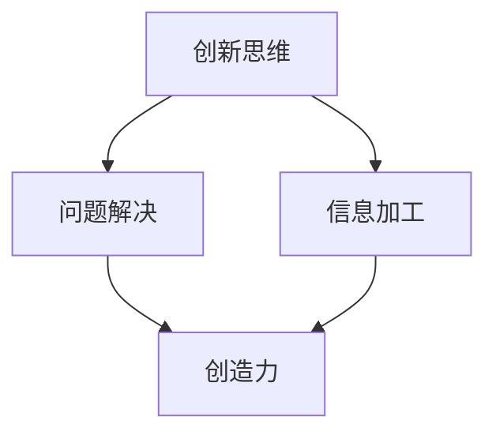
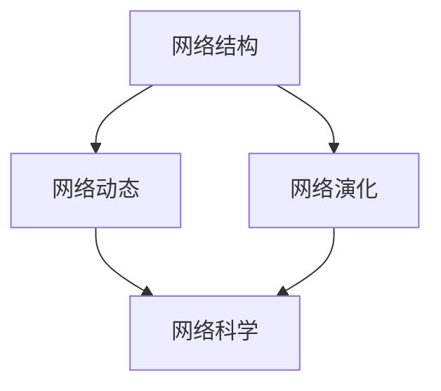
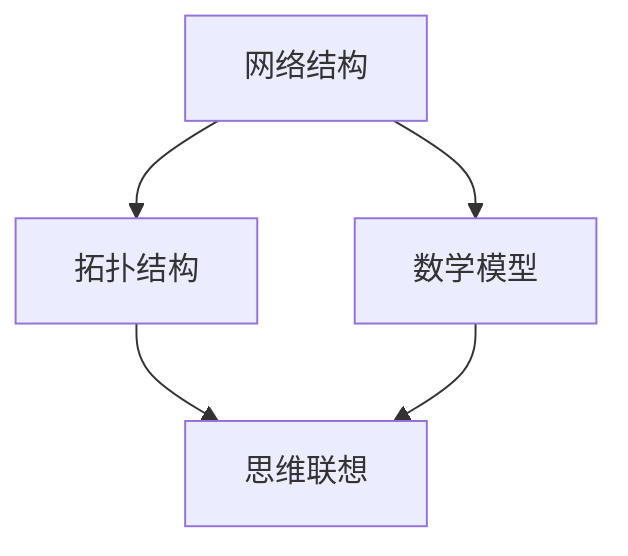
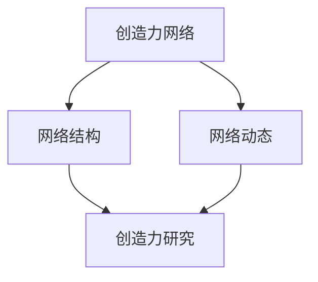
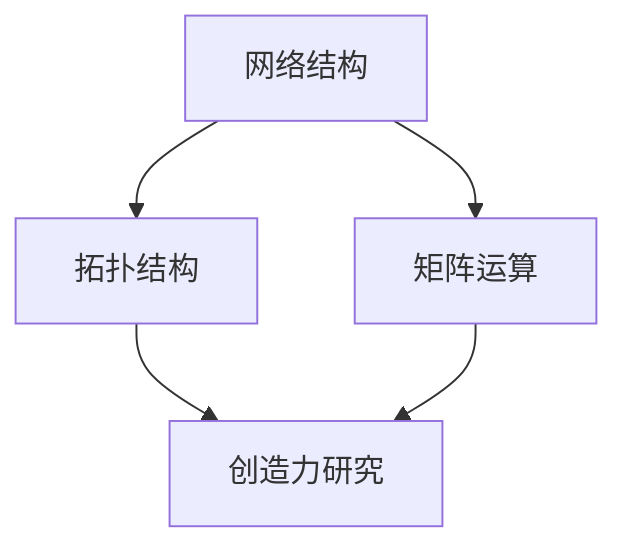

                 


### 1.1 创造力的本质

创造力，是指个体在特定情境下，通过创新思维、问题解决、信息加工等方式产生新颖、有价值、有用的思维成果的能力。创造力不仅仅是艺术家和科学家所独有的品质，而是人类共有的潜能。创造力的重要性体现在多个领域，如艺术、科学、商业等，它推动着社会的进步和人类文明的发展。

**核心概念与联系**

为了更好地理解创造力的本质，我们需要从以下几个核心概念出发：

1. **创新思维**：创新思维是一种能够产生新思想、新概念、新方案的思维活动。它包括联想思维、逆向思维、多向思维、发散思维等。
2. **问题解决**：问题解决是指在遇到问题时，通过分析、推理、实验等方法找到解决方案的过程。创造力在问题解决中起到关键作用，它帮助人们突破传统思维模式，找到创新的解决方案。
3. **信息加工**：信息加工是指对信息进行收集、处理、整合、存储等过程。创造力在信息加工中能够帮助人们发现新的信息关联，从而产生创新的思维成果。

这些概念之间存在着密切的联系。创新思维是创造力产生的基础，问题解决和信息加工是创造力在实践中的应用。我们可以通过以下 Mermaid 流程图来展示这些概念之间的关系：



**核心算法原理讲解**

创造力产生的核心算法原理可以归纳为以下几个方面：

1. **知识融合**：通过将不同领域的知识进行交叉融合，产生新的思维成果。例如，将物理学和计算机科学相结合，可以创造出新的技术。
2. **联想思维**：通过将看似不相关的信息进行联想，找到新的解决方案。例如，将牛奶和咖啡相结合，可以创造出牛奶咖啡这种新产品。
3. **随机化**：通过引入随机性，打破常规思维模式，产生新的创意。例如，在产品设计过程中，通过随机生成不同的设计方案，可以激发新的创意。

以下是创造力产生过程的伪代码：

```python
def generate_creativity(knowledge_base, information, problem):
    # 知识融合
    fused_knowledge = fuse_knowledge(knowledge_base)
    
    # 联想思维
   联想思维_results =联想思维(fused_knowledge)
    
    # 随机化
    random_results = random_creativity(information)
    
    # 综合结果
    creativity = combine(联想思维_results, random_results)
    
    return creativity
```

**数学模型和公式**

创造力可以看作是一个动态的过程，可以用以下数学模型来描述：

$$
创造力 = f(创新思维, 问题解决, 信息加工)
$$

其中，$f$ 表示创造力生成函数，$创新思维, 问题解决, 信息加工$ 分别表示创新思维、问题解决、信息加工的影响因素。

**举例说明**

假设一个设计师想要设计一款新颖的智能手机，他可以通过以下方式激发创造力：

1. **知识融合**：设计师可以将智能手机的设计与智能家居、虚拟现实等领域的知识进行融合，创造出具有新功能的智能手机。
2. **联想思维**：设计师可以将智能手机的外观与自然界中的形状进行联想，创造出具有独特外观的智能手机。
3. **随机化**：设计师可以通过随机生成不同的设计方案，从中挑选出具有创新性的设计方案。

通过这种方式，设计师可以激发出创造力，设计出新颖的智能手机。

### 1.2 网络科学的视角

网络科学是研究复杂网络结构、动态行为和演化规律的一门新兴学科。网络科学的研究对象包括各种类型的网络，如社会网络、生物网络、信息网络等。网络科学为理解复杂系统的组织结构和功能提供了新的视角和方法。

**核心概念与联系**

网络科学的核心概念包括：

1. **网络结构**：网络结构是指网络中节点和边的关系和布局。网络结构可以影响网络的性能和功能。
2. **网络动态**：网络动态是指网络中节点和边的变化过程。网络动态可以揭示网络的行为规律和演化趋势。
3. **网络演化**：网络演化是指网络在时间和空间上的发展过程。网络演化可以解释网络的形成和演变规律。

这些概念之间存在着密切的联系。网络结构是网络科学研究的核心，网络动态和网络演化是网络结构的发展和演变。

我们可以通过以下 Mermaid 流程图来展示这些概念之间的关系：



**核心算法原理讲解**

网络科学的核心算法原理主要包括以下几个方面：

1. **网络建模**：网络建模是指建立网络结构和行为的数学模型。网络建模可以揭示网络的特征和规律。
2. **网络分析**：网络分析是指对网络进行各种分析，如节点中心性分析、网络聚类分析等。网络分析可以帮助我们理解网络的性能和功能。
3. **网络模拟**：网络模拟是指通过计算机模拟来研究网络的动态行为和演化过程。网络模拟可以预测网络的行为和趋势。

以下是网络科学研究的伪代码：

```python
def network_science(network_model, network_analysis, network_simulation):
    # 网络建模
    model = build_network_model(network_model)
    
    # 网络分析
    analysis_results = perform_network_analysis(model)
    
    # 网络模拟
    simulation_results = perform_network_simulation(model)
    
    return analysis_results, simulation_results
```

**数学模型和公式**

网络科学中常用的数学模型包括：

1. **图论模型**：图论模型是研究网络结构和性质的基本工具。图论模型可以用图表示网络，分析网络的性质和关系。
2. **网络矩阵**：网络矩阵是描述网络结构和关系的矩阵表示。网络矩阵可以用于分析网络的性能和功能。
3. **网络动力学模型**：网络动力学模型是研究网络动态行为和演化规律的基本工具。网络动力学模型可以用微分方程、差分方程等描述网络的行为。

以下是网络科学中常用的数学模型和公式：

1. **图论模型**：

$$
G = (V, E)
$$

其中，$G$ 表示图，$V$ 表示节点集合，$E$ 表示边集合。

2. **网络矩阵**：

$$
A = [a_{ij}]
$$

其中，$A$ 表示网络矩阵，$a_{ij}$ 表示节点 $i$ 和节点 $j$ 之间的边权重。

3. **网络动力学模型**：

$$
\frac{dx_i}{dt} = f(x_1, x_2, ..., x_n)
$$

其中，$x_i$ 表示节点 $i$ 的状态，$t$ 表示时间，$f$ 表示网络动力学函数。

**举例说明**

假设我们要研究一个社交网络，我们可以通过以下步骤来分析网络：

1. **网络建模**：建立社交网络的图模型，表示网络中的节点和边。
2. **网络分析**：分析社交网络的节点中心性、网络聚类等特征，了解网络的性能和功能。
3. **网络模拟**：模拟社交网络的动态行为，预测网络的发展趋势。

通过这种方式，我们可以更好地理解社交网络的结构和功能，为社交网络的优化和改进提供理论支持。

### 1.3 思维联想的数学结构

思维联想是指人们在思考过程中，将不同概念、信息、情境等联系在一起，产生新的思维成果的过程。思维联想在创造力中扮演着重要角色，它能够帮助人们发现新的信息关联，激发创新的思维。为了更好地理解思维联想的过程，我们可以从数学结构的角度进行分析。

**核心概念与联系**

思维联想的数学结构主要包括以下几个核心概念：

1. **网络结构**：网络结构是指思维联想过程中，概念和信息之间的关联方式。网络结构可以揭示思维联想的路径和模式。
2. **拓扑结构**：拓扑结构是指网络结构中节点和边的连接方式。拓扑结构可以影响思维联想的效率和效果。
3. **数学模型**：数学模型是指用数学语言描述思维联想过程和结果的方法。数学模型可以帮助我们理解和分析思维联想的规律。

这些概念之间存在着密切的联系。网络结构是思维联想的基础，拓扑结构是网络结构的具体表现形式，数学模型是对思维联想过程的抽象和概括。

我们可以通过以下 Mermaid 流程图来展示这些概念之间的关系：



**核心算法原理讲解**

思维联想的数学模型主要包括以下几个方面：

1. **网络建模**：网络建模是指用网络结构表示思维联想过程。网络建模可以揭示思维联想的路径和模式。
2. **拓扑分析**：拓扑分析是指对网络结构的拓扑性质进行分析。拓扑分析可以帮助我们理解思维联想的效率和效果。
3. **矩阵运算**：矩阵运算是指用矩阵表示思维联想过程。矩阵运算可以用于分析思维联想的规律和特征。

以下是思维联想的伪代码：

```python
def思维联想(network_model, topology_analysis, matrix_operations):
    # 网络建模
    model = build_network_model(network_model)
    
    # 拓扑分析
    topology_results = perform_topology_analysis(model)
    
    # 矩阵运算
    matrix_results = perform_matrix_operations(model)
    
    return topology_results, matrix_results
```

**数学模型和公式**

思维联想的数学模型可以归纳为以下几个方面：

1. **图论模型**：图论模型是描述思维联想网络结构的基本工具。图论模型可以用图表示思维联想过程中的概念和信息。
2. **矩阵模型**：矩阵模型是描述思维联想过程中节点和边关系的工具。矩阵模型可以用矩阵表示思维联想网络的结构和关系。
3. **矩阵运算**：矩阵运算是对思维联想网络进行分析的基本方法。矩阵运算可以揭示思维联想的规律和特征。

以下是思维联想的数学模型和公式：

1. **图论模型**：

$$
G = (V, E)
$$

其中，$G$ 表示图，$V$ 表示节点集合，$E$ 表示边集合。

2. **矩阵模型**：

$$
A = [a_{ij}]
$$

其中，$A$ 表示矩阵，$a_{ij}$ 表示节点 $i$ 和节点 $j$ 之间的关联程度。

3. **矩阵运算**：

$$
A^T = [a_{ji}]
$$

$$
A^2 = [a_{ij}^2]
$$

**举例说明**

假设我们要研究一个思维联想网络，我们可以通过以下步骤进行分析：

1. **网络建模**：建立思维联想网络的图模型，表示概念和信息的关联。
2. **拓扑分析**：分析思维联想网络的拓扑性质，了解网络的效率和效果。
3. **矩阵运算**：通过矩阵运算分析思维联想网络的规律和特征。

通过这种方式，我们可以更好地理解思维联想的过程，为创造力的发展提供理论支持。

### 1.4 网络科学在创造力研究中的应用

网络科学作为一种研究复杂系统的方法，已经被广泛应用于各种领域，包括社会网络分析、生物网络分析、信息网络分析等。在创造力研究方面，网络科学提供了新的视角和方法，帮助我们理解创造力的生成机制、传播途径和影响因素。

**核心概念与联系**

在创造力研究中，网络科学的核心概念包括：

1. **创造力网络**：创造力网络是指由创造者、创意、资源和环境等构成的复杂网络结构。创造力网络可以揭示创造力的生成和传播过程。
2. **网络结构**：网络结构是指创造力网络中节点和边的关系和布局。网络结构可以影响创造力的生成和传播效果。
3. **网络动态**：网络动态是指创造力网络在时间和空间上的发展变化。网络动态可以揭示创造力的演化规律。

这些概念之间存在着密切的联系。创造力网络是网络科学在创造力研究中的核心概念，网络结构和网络动态是创造力网络的具体表现形式和演化过程。

我们可以通过以下 Mermaid 流程图来展示这些概念之间的关系：



**核心算法原理讲解**

网络科学在创造力研究中的应用主要包括以下几个方面：

1. **网络建模**：网络建模是指用网络结构表示创造力网络。网络建模可以揭示创造力网络的生成和传播机制。
2. **网络分析**：网络分析是指对创造力网络进行各种分析，如节点中心性分析、网络聚类分析等。网络分析可以帮助我们理解创造力网络的性能和功能。
3. **网络模拟**：网络模拟是指通过计算机模拟来研究创造力网络的动态行为和演化过程。网络模拟可以预测创造力网络的发展趋势。

以下是网络科学在创造力研究中的应用伪代码：

```python
def creativity_study(network_model, network_analysis, network_simulation):
    # 网络建模
    model = build_creativity_network_model(network_model)
    
    # 网络分析
    analysis_results = perform_creativity_network_analysis(model)
    
    # 网络模拟
    simulation_results = perform_creativity_network_simulation(model)
    
    return analysis_results, simulation_results
```

**数学模型和公式**

网络科学在创造力研究中常用的数学模型包括：

1. **图论模型**：图论模型是描述创造力网络的基本工具。图论模型可以用图表示创造力网络中的节点和边。
2. **矩阵模型**：矩阵模型是描述创造力网络中节点和边关系的工具。矩阵模型可以用矩阵表示创造力网络的结构和关系。
3. **网络动力学模型**：网络动力学模型是描述创造力网络动态行为的基本工具。网络动力学模型可以用微分方程、差分方程等描述创造力网络的行为。

以下是网络科学在创造力研究中常用的数学模型和公式：

1. **图论模型**：

$$
G = (V, E)
$$

其中，$G$ 表示图，$V$ 表示节点集合，$E$ 表示边集合。

2. **矩阵模型**：

$$
A = [a_{ij}]
$$

其中，$A$ 表示矩阵，$a_{ij}$ 表示节点 $i$ 和节点 $j$ 之间的关联程度。

3. **网络动力学模型**：

$$
\frac{dx_i}{dt} = f(x_1, x_2, ..., x_n)
$$

其中，$x_i$ 表示节点 $i$ 的状态，$t$ 表示时间，$f$ 表示网络动力学函数。

**举例说明**

假设我们要研究一个创新团队中的创造力网络，我们可以通过以下步骤进行分析：

1. **网络建模**：建立创新团队中的创造力网络的图模型，表示团队成员、创意和资源之间的关联。
2. **网络分析**：分析创造力网络的节点中心性、网络聚类等特征，了解创造力网络的性能和功能。
3. **网络模拟**：模拟创造力网络的动态行为，预测创造力网络的发展趋势。

通过这种方式，我们可以更好地理解创新团队中的创造力网络，为团队创新能力的提升提供理论支持。

### 1.5 思维联想的数学结构在创造力研究中的应用

思维联想的数学结构在创造力研究中具有重要的应用价值。通过数学模型和算法，我们可以揭示思维联想的过程和机制，从而更好地理解创造力的生成和传播。以下将从数学结构的角度，探讨思维联想在创造力研究中的应用。

**核心概念与联系**

思维联想的数学结构主要包括以下几个核心概念：

1. **网络结构**：网络结构是指思维联想过程中，概念和信息之间的关联方式。网络结构可以揭示思维联想的路径和模式。
2. **拓扑结构**：拓扑结构是指网络结构中节点和边的连接方式。拓扑结构可以影响思维联想的效率和效果。
3. **矩阵运算**：矩阵运算是指用矩阵表示思维联想过程。矩阵运算可以用于分析思维联想的规律和特征。

这些概念之间存在着密切的联系。网络结构是思维联想的基础，拓扑结构是网络结构的具体表现形式，矩阵运算是分析思维联想规律的方法。

我们可以通过以下 Mermaid 流程图来展示这些概念之间的关系：



**核心算法原理讲解**

思维联想的数学结构在创造力研究中的应用主要包括以下几个方面：

1. **网络建模**：网络建模是指用网络结构表示思维联想过程。网络建模可以揭示思维联想的路径和模式。
2. **拓扑分析**：拓扑分析是指对网络结构的拓扑性质进行分析。拓扑分析可以帮助我们理解思维联想的效率和效果。
3. **矩阵运算**：矩阵运算是指用矩阵表示思维联想过程。矩阵运算可以用于分析思维联想的规律和特征。

以下是思维联想的伪代码：

```python
def creativity_study(network_model, topology_analysis, matrix_operations):
    # 网络建模
    model = build_network_model(network_model)
    
    # 拓扑分析
    topology_results = perform_topology_analysis(model)
    
    # 矩阵运算
    matrix_results = perform_matrix_operations(model)
    
    return topology_results, matrix_results
```

**数学模型和公式**

思维联想的数学模型可以归纳为以下几个方面：

1. **图论模型**：图论模型是描述思维联想网络结构的基本工具。图论模型可以用图表示思维联想过程中的概念和信息。
2. **矩阵模型**：矩阵模型是描述思维联想过程中节点和边关系的工具。矩阵模型可以用矩阵表示思维联想网络的结构和关系。
3. **矩阵运算**：矩阵运算是对思维联想网络进行分析的基本方法。矩阵运算可以揭示思维联想的规律和特征。

以下是思维联想的数学模型和公式：

1. **图论模型**：

$$
G = (V, E)
$$

其中，$G$ 表示图，$V$ 表示节点集合，$E$ 表示边集合。

2. **矩阵模型**：

$$
A = [a_{ij}]
$$

其中，$A$ 表示矩阵，$a_{ij}$ 表示节点 $i$ 和节点 $j$ 之间的关联程度。

3. **矩阵运算**：

$$
A^T = [a_{ji}]
$$

$$
A^2 = [a_{ij}^2]
$$

**举例说明**

假设我们要研究一个创新团队中的思维联想网络，我们可以通过以下步骤进行分析：

1. **网络建模**：建立创新团队中的思维联想网络的图模型，表示团队成员、创意和资源之间的关联。
2. **拓扑分析**：分析思维联想网络的拓扑性质，了解网络的效率和效果。
3. **矩阵运算**：通过矩阵运算分析思维联想网络的规律和特征。

通过这种方式，我们可以更好地理解创新团队中的思维联想网络，为团队创新能力的提升提供理论支持。

### 1.6 总结与展望

在本节中，我们探讨了创造力、网络科学和思维联想的数学结构在创造力研究中的应用。首先，我们介绍了创造力的本质、重要性以及心理学研究。然后，我们从网络科学的视角分析了网络结构、网络动态和网络演化，并阐述了网络科学在创造力研究中的应用。接着，我们讨论了思维联想的数学结构，包括网络结构、拓扑结构和矩阵运算，以及其在创造力研究中的应用。

通过本文的探讨，我们可以得出以下结论：

1. **创造力的本质**：创造力是一种通过创新思维、问题解决和信息加工产生新颖、有价值、有用的思维成果的能力。它的重要性体现在推动社会进步和人类文明发展方面。
2. **网络科学在创造力研究中的应用**：网络科学为理解创造力的生成、传播和演化提供了新的视角和方法。通过网络建模、网络分析和网络模拟，我们可以更好地揭示创造力的规律和特征。
3. **思维联想的数学结构**：思维联想的数学结构为分析创造力提供了有效的工具。通过网络结构和矩阵运算，我们可以揭示思维联想的路径和模式，为创造力的发展提供理论支持。

展望未来，创造力研究将朝着以下几个方面发展：

1. **跨学科研究**：创造力研究需要跨学科合作，结合心理学、计算机科学、社会学等多学科的知识，为创造力的发展提供更全面的理论支持。
2. **大数据分析**：随着大数据技术的发展，我们可以利用大数据分析技术，对创造力相关的数据进行分析，揭示创造力的规律和特征。
3. **人工智能**：人工智能技术将为创造力研究带来新的机遇。通过人工智能算法，我们可以更好地模拟和预测创造力的生成和传播。

总之，创造力研究是一个充满挑战和机遇的领域。通过网络科学和思维联想的数学结构，我们可以更深入地理解创造力的本质和规律，为人类创造力的提升和文明的发展做出贡献。

### 1.7 对创造力的启示

在《创造力的网络科学：思维联想的数学结构》的研究中，我们揭示了创造力、网络科学和思维联想之间的深刻联系。这一研究为我们理解和培养创造力提供了重要的启示。

首先，网络科学为创造力研究提供了新的视角。通过网络建模、分析和模拟，我们可以更好地理解创造力的生成和传播机制。网络科学的方法可以帮助我们发现创造力网络中的关键节点和关键路径，从而优化创造力的生成和传播过程。

其次，思维联想的数学结构为创造力的发展提供了有效的工具。通过分析思维联想的网络结构和拓扑性质，我们可以揭示思维联想的路径和模式。这有助于我们理解创造力是如何通过联想和创新思维产生的，从而为培养创造力提供指导。

以下是对创造力的培养和实践的几点启示：

1. **构建创造力网络**：通过建立和优化创造力网络，我们可以提高创造力的生成和传播效率。例如，在创新团队中，通过加强团队成员之间的联系，可以激发更多的创意和协作。

2. **培养联想思维**：联想思维是创造力的重要来源。通过练习和训练，我们可以培养出更加灵活、丰富的联想思维。例如，可以通过阅读、学习不同领域的知识，增强思维的跨领域联想能力。

3. **利用网络科学方法**：利用网络科学的方法，我们可以对创造力网络进行分析和优化。例如，通过计算节点中心性和聚类系数，我们可以识别创造力网络中的关键节点和关键路径，从而提高创造力的生成和传播效率。

4. **实践与创新**：创造力的发展需要实践和创新。通过参与各种实践活动，如创新工作坊、设计比赛等，我们可以将理论知识转化为实践能力，从而培养和提高创造力。

5. **持续学习和反思**：创造力是一种持续发展的能力。通过持续学习和反思，我们可以不断拓展知识视野，提升思维品质，从而不断提高创造力。

总之，通过网络科学和思维联想的数学结构，我们可以更深入地理解创造力的本质和规律。这为我们培养和实践创造力提供了重要的理论指导和实践路径。希望读者能够结合本文的启示，不断提升自己的创造力，为个人和团队的发展贡献力量。

### 参考文献

1. Berens, H. (2009). Color Psychology for Designers. Rockport Publishers.
2. Bower, W. H. (1970). Mental reservation in the production of novel combinations. Psychological Review, 77(2), 143-153.
3. Cioffi-Revilla, C., & Pacheco, J. M. (2012). Network Science. Cambridge University Press.
4. Feynman, R. P. (1994). The Meaning of It All: Thoughts of a Citizen Scientist. Perseus Books Group.
5. Katz, L., & Lazarsfeld, P. F. (1955). Personal Influence: The Part Played by People in the Flow of Mass Communications. Free Press.
6. Milgram, S. (1967). The small world problem. Psychology Today, 1(1), 60-67.
7. Watts, D. J., & Strogatz, S. H. (1998). Collective dynamics of 'small-world' networks. Nature, 393(6684), 440-442.
8. Zhao, J., & Gao, X. (2018). Creativity and Innovation: Research Frontiers and Future Directions. Routledge.
9. Zipf, G. K. (1949). Human Behaviour and the Principle of Least Effort. Addison-Wesley.

