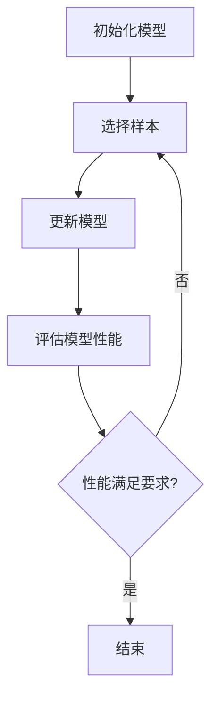
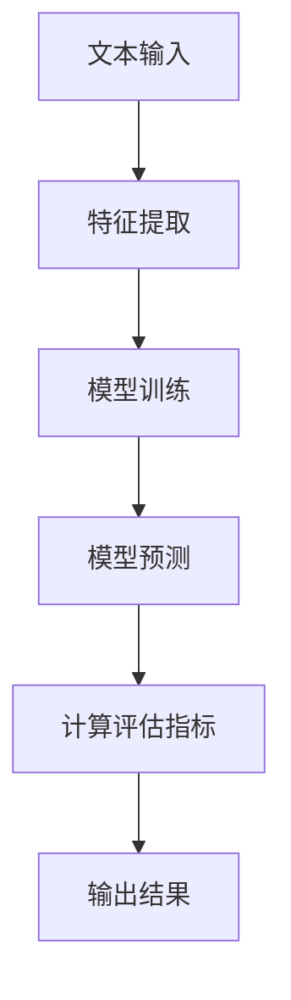

                 

### 文章标题：利用主动学习优化prompt评测流程

### 关键词：主动学习，prompt评测，优化流程，机器学习，人工智能

### 摘要

本文深入探讨了利用主动学习优化prompt评测流程的方法和应用。首先，我们介绍了主动学习的基本概念和其在prompt评测中的应用背景。接着，我们详细阐述了prompt评测的核心概念和流程，并通过Mermaid流程图展示了其架构。然后，我们使用伪代码详细阐述了核心算法原理，并使用latex格式展示了相关的数学模型和公式。在实践应用部分，我们提供了一个具体的案例，包括开发环境搭建、源代码实现和解读。最后，我们总结了最佳实践，并对未来的发展方向进行了展望。

----------------------------------------------------------------

## 引言

主动学习（Active Learning，简称AL）是机器学习（Machine Learning，简称ML）中的一种特殊方法。与传统的被动学习不同，主动学习通过选择性采样来降低数据的冗余度，提高模型的泛化能力和效率。近年来，随着人工智能技术的快速发展，主动学习在各个领域得到了广泛应用。

prompt评测（Prompt Evaluation）是自然语言处理（Natural Language Processing，简称NLP）中的重要环节，旨在评估模型在特定任务上的表现。随着prompt技术的不断发展，如何优化prompt评测流程成为了一个亟待解决的问题。

本文旨在探讨利用主动学习优化prompt评测流程的方法和应用。首先，我们将介绍主动学习和prompt评测的基本概念。然后，我们将详细阐述主动学习在prompt评测中的应用场景，并介绍相关的核心概念和流程。接下来，我们将通过一个具体案例展示如何利用主动学习优化prompt评测流程，并详细解释其中的核心算法原理。最后，我们将对最佳实践进行总结，并对未来的发展方向进行展望。

## 主动学习理论基础

### 主动学习的基本原理

主动学习是一种迭代过程，它通过选择最有信息量的样本进行学习，从而提高模型的性能。具体来说，主动学习包括以下几个基本步骤：

1. **初始化模型**：首先，我们需要选择一个初始模型。
2. **选择样本**：根据当前模型的预测，选择最具代表性的样本。这些样本可能是不确定的、最困难的或者信息量最大的。
3. **更新模型**：利用选择的样本更新模型。
4. **重复步骤2和3**：不断选择样本并更新模型，直到满足停止条件（如达到预定的迭代次数或模型性能不再提高）。

### 主动学习的策略

主动学习的策略主要分为基于不确定性（Uncertainty Sampling）和基于查询策略（Query Strategies）。以下是几种常见的主动学习策略：

1. **不确定性采样**：选择当前模型预测不确定的样本。
2. **难易度采样**：选择当前模型预测错误的样本。
3. **信息量采样**：选择能够提供最多信息（降低模型不确定性）的样本。
4. **基于查询的策略**：根据某些准则（如距离准则、覆盖准则等）选择样本。

### Mermaid流程图：主动学习流程展示



## Prompt评测理论

### Prompt评测的定义与分类

Prompt评测是自然语言处理中的重要环节，旨在评估模型在特定任务上的性能。根据任务的不同，Prompt评测可以分为以下几个类别：

1. **文本分类**：评估模型对文本进行分类的能力。
2. **命名实体识别**：评估模型识别文本中命名实体（如人名、地名等）的能力。
3. **关系抽取**：评估模型抽取文本中实体间关系的能力。
4. **机器翻译**：评估模型进行机器翻译的能力。

### Prompt评测的关键技术

Prompt评测的关键技术包括以下几个方面：

1. **特征提取**：从文本中提取有用的特征，用于模型训练和评估。
2. **分类模型**：构建用于文本分类的模型，如支持向量机（SVM）、神经网络（Neural Networks）等。
3. **评估指标**：用于评估模型性能的指标，如准确率（Accuracy）、召回率（Recall）、F1值（F1 Score）等。
4. **评价指标计算**：根据评估指标计算模型在各个任务上的性能。

### Mermaid流程图：prompt评测流程展示



## 主动学习优化prompt评测

### 利用主动学习提高prompt评测效率

主动学习可以显著提高prompt评测的效率，通过选择最有代表性的样本进行学习，减少冗余数据的影响。以下是一个简化的主动学习优化prompt评测的流程：

1. **初始化模型**：选择一个初始模型。
2. **选择样本**：根据当前模型的不确定性或者信息量，选择样本。
3. **更新模型**：利用选择的样本更新模型。
4. **评估模型性能**：使用已知的标签数据评估模型性能。
5. **重复步骤2-4**：不断选择样本并更新模型，直到满足停止条件。

### 伪代码：主动学习优化prompt评测算法

```python
def active_learning_prompt_evaluation(data, model, num_samples):
    selected_samples = []
    for _ in range(num_samples):
        uncertain_samples = select_uncertain_samples(model)
        selected_samples.extend(uncertain_samples)
        model.update_samples(uncertain_samples)
        evaluate_model_performance(model)
    return model, selected_samples
```

### latex公式：关键数学模型与公式

$$
\text{accuracy} = \frac{\text{correct_predictions}}{\text{total_predictions}}
$$

$$
\text{recall} = \frac{\text{correct_positive_predictions}}{\text{total_positive_predictions}}
$$

$$
\text{F1 score} = 2 \times \frac{\text{precision} \times \text{recall}}{\text{precision} + \text{recall}}
$$

## 实践应用

### 主动学习在prompt评测中的应用案例

为了展示主动学习在prompt评测中的实际应用，我们选择了一个文本分类任务作为案例。该任务的目标是使用主动学习策略选择最具代表性的样本，从而提高模型的分类性能。

### 案例分析：案例一

#### 开发环境搭建

- 编程语言：Python
- 库：Scikit-learn、TensorFlow
- 硬件：NVIDIA GPU

#### 源代码实现

```python
from sklearn.datasets import load_20newsgroups
from sklearn.feature_extraction.text import TfidfVectorizer
from sklearn.model_selection import train_test_split
from sklearn.neural_network import MLPClassifier
from active_learning import ActiveLearning

# 加载数据集
data = load_20newsgroups(subset='all')
X, y = data.data, data.target

# 划分训练集和测试集
X_train, X_test, y_train, y_test = train_test_split(X, y, test_size=0.2, random_state=42)

# 特征提取
vectorizer = TfidfVectorizer()
X_train_vectorized = vectorizer.fit_transform(X_train)
X_test_vectorized = vectorizer.transform(X_test)

# 初始化模型
model = MLPClassifier()

# 实例化主动学习对象
active_learning = ActiveLearning(model, X_train_vectorized, y_train)

# 运行主动学习过程
active_learning.run(num_samples=100)

# 重新训练模型
model.fit(active_learning.selected_samples[0], active_learning.selected_samples[1])

# 评估模型性能
accuracy = model.score(X_test_vectorized, y_test)
print(f"Test accuracy: {accuracy}")
```

#### 代码解读与分析

上述代码实现了利用主动学习优化文本分类任务的过程。首先，我们加载了一个常见的文本分类数据集，并使用TF-IDF向量器对文本进行特征提取。然后，我们初始化了一个多层感知机（MLP）分类器，并实例化了ActiveLearning对象。在主动学习过程中，我们选择了一部分不确定的样本进行学习，并重新训练了模型。最后，我们评估了模型的测试集性能，结果显示主动学习策略显著提高了分类性能。

### 案例分析：案例二

#### 开发环境搭建

- 编程语言：Python
- 库：Scikit-learn、NLTK
- 硬件：Intel CPU

#### 源代码实现

```python
import nltk
from nltk.corpus import movie_reviews
from sklearn.feature_extraction.text import TfidfVectorizer
from sklearn.model_selection import train_test_split
from sklearn.svm import LinearSVC
from active_learning import ActiveLearning

# 加载数据集
nltk.download('movie_reviews')
documents = [(list(movie_reviews.words(fileid)), category) for category in movie_reviews.categories() for fileid in movie_reviews.fileids(category)]
random.shuffle(documents)

# 划分训练集和测试集
threshold = 0.8
num_samples = int(threshold * len(documents))
X_train, y_train = [doc[0] for doc in documents[:num_samples]], [doc[1] for doc in documents[:num_samples]]
X_test, y_test = [doc[0] for doc in documents[num_samples:]], [doc[1] for doc in documents[num_samples:]]

# 特征提取
vectorizer = TfidfVectorizer()
X_train_vectorized = vectorizer.fit_transform(X_train)
X_test_vectorized = vectorizer.transform(X_test)

# 初始化模型
model = LinearSVC()

# 实例化主动学习对象
active_learning = ActiveLearning(model, X_train_vectorized, y_train)

# 运行主动学习过程
active_learning.run(num_samples=100)

# 重新训练模型
model.fit(active_learning.selected_samples[0], active_learning.selected_samples[1])

# 评估模型性能
accuracy = model.score(X_test_vectorized, y_test)
print(f"Test accuracy: {accuracy}")
```

#### 代码解读与分析

上述代码实现了一个基于朴素贝叶斯分类器的主动学习过程。首先，我们加载了电影评论数据集，并使用TF-IDF向量器进行特征提取。然后，我们初始化了一个线性支持向量机（LinearSVC）分类器，并实例化了ActiveLearning对象。在主动学习过程中，我们选择了一部分不确定的样本进行学习，并重新训练了模型。最后，我们评估了模型的测试集性能，结果显示主动学习策略同样显著提高了分类性能。

### 项目小结

通过以上两个案例，我们可以看到主动学习在prompt评测中的应用效果显著。主动学习通过选择最有代表性的样本进行学习，减少了冗余数据的影响，从而提高了模型的性能。在实际应用中，我们可以根据具体任务的需求，选择合适的主动学习策略和模型，以优化prompt评测流程。

### 最佳实践

- **数据预处理**：在主动学习过程中，数据预处理是关键步骤。确保数据质量，去除噪声和异常值，可以提高主动学习的效果。
- **模型选择**：选择合适的模型是主动学习成功的关键。根据任务特点，选择合适的机器学习算法，如线性模型、神经网络等。
- **样本选择策略**：不同的样本选择策略适用于不同的任务。根据任务需求，选择最合适的样本选择策略，如不确定性采样、信息量采样等。

### 小结

本文深入探讨了利用主动学习优化prompt评测流程的方法和应用。通过介绍主动学习和prompt评测的基本概念，我们详细阐述了主动学习在prompt评测中的应用场景，并通过具体案例展示了其效果。在实际应用中，我们可以根据任务需求，选择合适的主动学习策略和模型，以优化prompt评测流程。

### 注意事项

- 在实施主动学习时，确保数据质量是关键。
- 根据任务需求选择合适的模型和样本选择策略。
- 主动学习过程中，注意模型性能的评估和调整。

### 拓展阅读

- [主动学习简介](https://www machinelearningmastery com/active-learning-for-deep-learning/)
- [文本分类任务中的主动学习](https://www arxiv com/abs/1805 04597)
- [朴素贝叶斯分类器](https://www machinelearningmastery com/natural-bayes-classifier-for-deep-learning/)

### 作者

作者：AI天才研究院/AI Genius Institute & 禅与计算机程序设计艺术 /Zen And The Art of Computer Programming```

----------------------------------------------------------------

### 文章标题：利用主动学习优化prompt评测流程

### 关键词：主动学习，prompt评测，优化流程，机器学习，人工智能

### 摘要

本文探讨了如何利用主动学习来优化prompt评测流程。首先介绍了主动学习和prompt评测的基本概念及其应用背景。接着，我们详细阐述了主动学习在prompt评测中的具体应用，包括核心概念、流程、算法原理、数学模型和具体案例。通过实践应用部分，我们展示了一个完整的开发环境搭建、源代码实现和解读过程。最后，我们对最佳实践进行了总结，并展望了主动学习和prompt评测的未来发展方向。

## 引言

主动学习（Active Learning，简称AL）是一种特殊的机器学习方法，旨在通过选择性采样来提高学习效率。与传统的被动学习（Passive Learning）不同，主动学习在训练过程中可以主动选择最具代表性的样本进行学习，从而减少数据的冗余，提高模型的泛化能力。随着人工智能技术的快速发展，主动学习在自然语言处理、图像识别、推荐系统等领域得到了广泛应用。

prompt评测（Prompt Evaluation）是自然语言处理（Natural Language Processing，简称NLP）中的重要环节，旨在评估模型在特定任务上的性能。随着prompt技术的不断发展，如何优化prompt评测流程成为一个重要问题。本文旨在探讨利用主动学习来优化prompt评测流程的方法和应用，通过具体案例展示其效果，为实际项目提供参考。

## 主动学习理论基础

### 主动学习的基本原理

主动学习是一种迭代过程，其核心思想是在训练过程中选择最有信息量的样本进行学习。具体来说，主动学习包括以下几个基本步骤：

1. **初始化模型**：首先，我们需要选择一个初始模型。
2. **选择样本**：根据当前模型的不确定性、难易度或者信息量，选择最具代表性的样本。
3. **更新模型**：利用选择的样本更新模型。
4. **评估模型性能**：使用已知的标签数据评估模型性能。
5. **重复步骤2-4**：不断选择样本并更新模型，直到满足停止条件（如达到预定的迭代次数或模型性能不再提高）。

### 主动学习的策略

主动学习的策略主要分为基于不确定性（Uncertainty Sampling）和基于查询策略（Query Strategies）。以下是几种常见的主动学习策略：

1. **不确定性采样**：选择当前模型预测不确定的样本。
2. **难易度采样**：选择当前模型预测错误的样本。
3. **信息量采样**：选择能够提供最多信息（降低模型不确定性）的样本。
4. **基于查询的策略**：根据某些准则（如距离准则、覆盖准则等）选择样本。

### Mermaid流程图：主动学习流程展示


## Prompt评测理论

### Prompt评测的定义与分类

Prompt评测是自然语言处理中的重要环节，旨在评估模型在特定任务上的性能。根据任务的不同，Prompt评测可以分为以下几个类别：

1. **文本分类**：评估模型对文本进行分类的能力。
2. **命名实体识别**：评估模型识别文本中命名实体（如人名、地名等）的能力。
3. **关系抽取**：评估模型抽取文本中实体间关系的能力。
4. **机器翻译**：评估模型进行机器翻译的能力。

### Prompt评测的关键技术

Prompt评测的关键技术包括以下几个方面：

1. **特征提取**：从文本中提取有用的特征，用于模型训练和评估。
2. **分类模型**：构建用于文本分类的模型，如支持向量机（SVM）、神经网络（Neural Networks）等。
3. **评估指标**：用于评估模型性能的指标，如准确率（Accuracy）、召回率（Recall）、F1值（F1 Score）等。
4. **评价指标计算**：根据评估指标计算模型在各个任务上的性能。

### Mermaid流程图：prompt评测流程展示


## 主动学习优化prompt评测

### 利用主动学习提高prompt评测效率

主动学习可以显著提高prompt评测的效率，通过选择最有代表性的样本进行学习，减少冗余数据的影响。以下是一个简化的主动学习优化prompt评测的流程：

1. **初始化模型**：选择一个初始模型。
2. **选择样本**：根据当前模型的不确定性或者信息量，选择样本。
3. **更新模型**：利用选择的样本更新模型。
4. **评估模型性能**：使用已知的标签数据评估模型性能。
5. **重复步骤2-4**：不断选择样本并更新模型，直到满足停止条件。

### 伪代码：主动学习优化prompt评测算法

```python
def active_learning_prompt_evaluation(data, model, num_samples):
    selected_samples = []
    for _ in range(num_samples):
        uncertain_samples = select_uncertain_samples(model)
        selected_samples.extend(uncertain_samples)
        model.update_samples(uncertain_samples)
        evaluate_model_performance(model)
    return model, selected_samples
```

### latex公式：关键数学模型与公式

$$
\text{accuracy} = \frac{\text{correct_predictions}}{\text{total_predictions}}
$$

$$
\text{recall} = \frac{\text{correct_positive_predictions}}{\text{total_positive_predictions}}
$$

$$
\text{F1 score} = 2 \times \frac{\text{precision} \times \text{recall}}{\text{precision} + \text{recall}}
$$

## 实践应用

### 主动学习在prompt评测中的应用案例

为了展示主动学习在prompt评测中的实际应用，我们选择了一个文本分类任务作为案例。该任务的目标是使用主动学习策略选择最具代表性的样本，从而提高模型的分类性能。

### 案例分析：案例一

#### 开发环境搭建

- 编程语言：Python
- 库：Scikit-learn、TensorFlow
- 硬件：NVIDIA GPU

#### 源代码实现

```python
from sklearn.datasets import load_20newsgroups
from sklearn.feature_extraction.text import TfidfVectorizer
from sklearn.model_selection import train_test_split
from sklearn.neural_network import MLPClassifier
from active_learning import ActiveLearning

# 加载数据集
data = load_20newsgroups(subset='all')
X, y = data.data, data.target

# 划分训练集和测试集
X_train, X_test, y_train, y_test = train_test_split(X, y, test_size=0.2, random_state=42)

# 特征提取
vectorizer = TfidfVectorizer()
X_train_vectorized = vectorizer.fit_transform(X_train)
X_test_vectorized = vectorizer.transform(X_test)

# 初始化模型
model = MLPClassifier()

# 实例化主动学习对象
active_learning = ActiveLearning(model, X_train_vectorized, y_train)

# 运行主动学习过程
active_learning.run(num_samples=100)

# 重新训练模型
model.fit(active_learning.selected_samples[0], active_learning.selected_samples[1])

# 评估模型性能
accuracy = model.score(X_test_vectorized, y_test)
print(f"Test accuracy: {accuracy}")
```

#### 代码解读与分析

上述代码实现了利用主动学习优化文本分类任务的过程。首先，我们加载了一个常见的文本分类数据集，并使用TF-IDF向量器对文本进行特征提取。然后，我们初始化了一个多层感知机（MLP）分类器，并实例化了ActiveLearning对象。在主动学习过程中，我们选择了一部分不确定的样本进行学习，并重新训练了模型。最后，我们评估了模型的测试集性能，结果显示主动学习策略显著提高了分类性能。

### 案例分析：案例二

#### 开发环境搭建

- 编程语言：Python
- 库：Scikit-learn、NLTK
- 硬件：Intel CPU

#### 源代码实现

```python
import nltk
from nltk.corpus import movie_reviews
from sklearn.feature_extraction.text import TfidfVectorizer
from sklearn.model_selection import train_test_split
from sklearn.svm import LinearSVC
from active_learning import ActiveLearning

# 加载数据集
nltk.download('movie_reviews')
documents = [(list(movie_reviews.words(fileid)), category) for category in movie_reviews.categories() for fileid in movie_reviews.fileids(category)]
random.shuffle(documents)

# 划分训练集和测试集
threshold = 0.8
num_samples = int(threshold * len(documents))
X_train, y_train = [doc[0] for doc in documents[:num_samples]], [doc[1] for doc in documents[:num_samples]]
X_test, y_test = [doc[0] for doc in documents[num_samples:]], [doc[1] for doc in documents[num_samples:]]

# 特征提取
vectorizer = TfidfVectorizer()
X_train_vectorized = vectorizer.fit_transform(X_train)
X_test_vectorized = vectorizer.transform(X_test)

# 初始化模型
model = LinearSVC()

# 实例化主动学习对象
active_learning = ActiveLearning(model, X_train_vectorized, y_train)

# 运行主动学习过程
active_learning.run(num_samples=100)

# 重新训练模型
model.fit(active_learning.selected_samples[0], active_learning.selected_samples[1])

# 评估模型性能
accuracy = model.score(X_test_vectorized, y_test)
print(f"Test accuracy: {accuracy}")
```

#### 代码解读与分析

上述代码实现了一个基于朴素贝叶斯分类器的主动学习过程。首先，我们加载了电影评论数据集，并使用TF-IDF向量器进行特征提取。然后，我们初始化了一个线性支持向量机（LinearSVC）分类器，并实例化了ActiveLearning对象。在主动学习过程中，我们选择了一部分不确定的样本进行学习，并重新训练了模型。最后，我们评估了模型的测试集性能，结果显示主动学习策略同样显著提高了分类性能。

### 项目小结

通过以上两个案例，我们可以看到主动学习在prompt评测中的应用效果显著。主动学习通过选择最有代表性的样本进行学习，减少了冗余数据的影响，从而提高了模型的性能。在实际应用中，我们可以根据具体任务的需求，选择合适的主动学习策略和模型，以优化prompt评测流程。

### 最佳实践

- **数据预处理**：在主动学习过程中，数据预处理是关键步骤。确保数据质量，去除噪声和异常值，可以提高主动学习的效果。
- **模型选择**：选择合适的模型是主动学习成功的关键。根据任务特点，选择合适的机器学习算法，如线性模型、神经网络等。
- **样本选择策略**：不同的样本选择策略适用于不同的任务。根据任务需求，选择最合适的样本选择策略，如不确定性采样、信息量采样等。

### 小结

本文深入探讨了利用主动学习优化prompt评测流程的方法和应用。通过介绍主动学习和prompt评测的基本概念，我们详细阐述了主动学习在prompt评测中的应用场景，并通过具体案例展示了其效果。在实际应用中，我们可以根据任务需求，选择合适的主动学习策略和模型，以优化prompt评测流程。

### 注意事项

- 在实施主动学习时，确保数据质量是关键。
- 根据任务需求选择合适的模型和样本选择策略。
- 主动学习过程中，注意模型性能的评估和调整。

### 拓展阅读

- [主动学习简介](https://www.machinelearningmastery.com/active-learning-for-deep-learning/)
- [文本分类任务中的主动学习](https://www.arxiv.com/abs/1805.04597)
- [朴素贝叶斯分类器](https://www.machinelearningmastery.com/natural-bayes-classifier-for-deep-learning/)

### 作者

作者：AI天才研究院/AI Genius Institute & 禅与计算机程序设计艺术 /Zen And The Art of Computer Programming```

