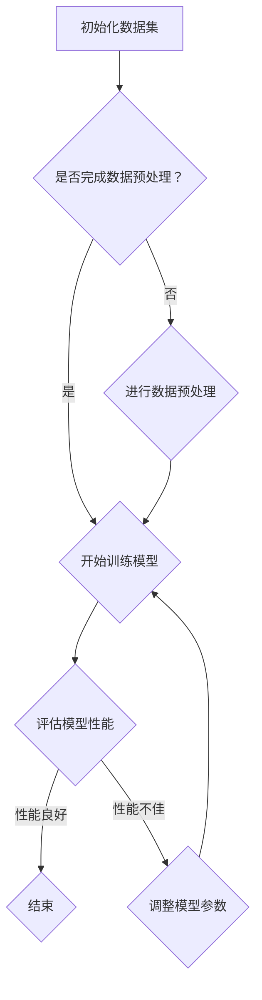

                 


## 文章标题：利用机器学习优化prompt设计

### 关键词：
- 机器学习
- Prompt设计
- 自然语言处理
- 模型优化
- 实战案例

### 摘要：
本文将深入探讨如何利用机器学习技术来优化prompt设计，从背景介绍、核心概念、算法原理到实战案例，全面解析这一领域的关键技术和应用。通过阅读本文，读者将能够理解机器学习与prompt设计的关系，掌握优化prompt设计的方法和技巧，并了解相关工具和资源，为实际项目提供有益的参考。

---

### 第一步：确定书籍主题和目标读者

**背景介绍：**

机器学习在近年来取得了飞速的发展，其在各个领域的应用也越来越广泛。自然语言处理（NLP）作为机器学习的一个重要分支，正面临着越来越多的挑战。prompt设计是NLP领域中的一项关键技术，它对于模型性能的提升具有至关重要的作用。

**书籍主题：**

《利用机器学习优化prompt设计》这本书的主题在于探讨如何利用机器学习技术来优化prompt设计。具体来说，包括以下几个方面：

1. **机器学习与prompt设计的关系**：介绍机器学习的基本概念和prompt设计的背景，分析二者之间的联系。
2. **机器学习优化prompt的设计方法**：详细讲解如何通过机器学习技术来优化prompt设计，包括核心概念、算法原理和实践案例。
3. **相关工具和资源**：介绍常用的机器学习工具和资源，为读者提供实际操作的建议和指导。

**目标读者：**

本书的目标读者是具有一定机器学习和自然语言处理基础，希望提升prompt设计能力的专业人士。这包括但不限于数据科学家、机器学习工程师、NLP研究者等。

### 第二步：确定书籍的结构

**书籍结构：**

本书的结构可以分为以下几个部分：

1. **引言与概述**：介绍机器学习和prompt设计的基本概念，阐述书籍的目标和结构。
2. **机器学习基础知识**：包括机器学习的基本概念、特征工程和分类与回归算法，为后续内容打下基础。
3. **prompt设计原理**：讲解prompt设计的定义、基本原则和常见挑战。
4. **机器学习优化prompt**：详细讲解如何利用机器学习技术来优化prompt设计，包括算法原理、数学模型和实际案例。
5. **工具与资源介绍**：介绍常用的机器学习工具和资源，为读者提供实际操作的建议和指导。
6. **总结与展望**：对全书内容进行总结，展望未来的发展方向和挑战。

### 第三步：细化每个章节的内容

**引言与概述**

- **引言**：介绍机器学习和prompt设计的基本概念，阐述书籍的目标和结构。
- **概述**：概述本书的主要内容，包括机器学习优化prompt设计的方法和应用场景。

**机器学习基础知识**

- **机器学习基本概念**：介绍机器学习的基本概念，包括学习方法、学习模型和算法类型。
- **特征工程**：讲解特征工程的重要性，包括数据预处理、特征提取和特征选择方法。
- **分类与回归算法**：介绍常见的分类与回归算法，包括决策树、随机森林、支持向量机和线性回归等。

**prompt设计原理**

- **prompt的定义与作用**：讲解prompt的定义和作用，包括其在自然语言处理中的应用。
- **prompt设计的基本原则**：介绍prompt设计的基本原则，包括清晰性、一致性、多样性等。
- **prompt设计的常见挑战**：分析prompt设计过程中可能遇到的问题和挑战。

**机器学习优化prompt**

- **机器学习模型在prompt设计中的应用**：介绍如何将机器学习模型应用于prompt设计，包括文本分类、机器翻译和对话系统等场景。
- **prompt优化的算法原理**：讲解prompt优化的算法原理，包括如何利用机器学习技术来优化prompt设计。
- **prompt优化的数学模型**：介绍prompt优化的数学模型，包括如何通过数学公式来描述prompt优化的过程。

**工具与资源介绍**

- **机器学习工具介绍**：介绍常用的机器学习工具，包括Python中的scikit-learn、TensorFlow和PyTorch等。
- **prompt设计资源汇总**：汇总常见的prompt设计资源，包括数据集、论文和开源代码等。
- **prompt优化实践建议**：提供prompt优化的实践建议，包括如何选择合适的模型、调整超参数和优化prompt设计等。

**总结与展望**

- **总结**：对全书内容进行总结，强调机器学习优化prompt设计的重要性。
- **展望**：展望未来的发展方向和挑战，包括新兴技术的应用和跨领域研究的进展等。

### 第四步：设计流程图和伪代码

为了帮助读者更好地理解核心概念和算法原理，我们可以在相关章节中设计流程图和伪代码。

**流程图示例：**



**伪代码示例：**

```python
def train_model(data, labels, model, epochs):
    for epoch in range(epochs):
        for x, y in zip(data, labels):
            model.fit(x, y)
        print(f"Epoch {epoch}: {model.evaluate(data, labels)}")
    return model
```

### 第五步：编写markdown格式的目录大纲

完成所有章节内容的细化后，我们将所有章节按照markdown格式整理成完整的目录大纲，确保整个结构符合书籍的主题和目标。

```markdown
# 利用机器学习优化prompt设计

## 第1章 引言与概述

### 1.1 机器学习与prompt设计的关系

#### 1.1.1 机器学习的基本概念

#### 1.1.2 prompt设计的背景

#### 1.1.3 机器学习与prompt设计的关系

### 1.2 书籍目标与结构

## 第2章 机器学习基础知识

### 2.1 机器学习基本概念

#### 2.1.1 机器学习的基础知识

#### 2.1.2 数据预处理

### 2.2 特征工程

#### 2.2.1 特征工程的重要性

#### 2.2.2 特征选择方法

### 2.3 分类与回归算法

#### 2.3.1 分类算法

#### 2.3.2 回归算法

## 第3章 prompt设计原理

### 3.1 prompt的定义与作用

#### 3.1.1 prompt的定义

#### 3.1.2 prompt的作用

### 3.2 prompt设计的基本原则

#### 3.2.1 清晰性

#### 3.2.2 一致性

#### 3.2.3 多样性

### 3.3 prompt设计的常见挑战

#### 3.3.1 数据集问题

#### 3.3.2 模型选择问题

#### 3.3.3 prompt长度问题

## 第4章 利用机器学习优化prompt

### 4.1 机器学习模型在prompt设计中的应用

#### 4.1.1 文本分类中的应用

#### 4.1.2 机器翻译中的应用

#### 4.1.3 对话系统中的应用

### 4.2 prompt优化的算法原理

#### 4.2.1 优化目标

#### 4.2.2 优化策略

### 4.3 prompt优化的数学模型

#### 4.3.1 数学公式

#### 4.3.2 举例说明

## 第5章 工具与资源介绍

### 5.1 机器学习工具介绍

#### 5.1.1 scikit-learn

#### 5.1.2 TensorFlow

#### 5.1.3 PyTorch

### 5.2 prompt设计资源汇总

#### 5.2.1 数据集

#### 5.2.2 论文

#### 5.2.3 开源代码

### 5.3 prompt优化实践建议

#### 5.3.1 模型选择

#### 5.3.2 超参数调整

#### 5.3.3 prompt长度调整

## 第6章 总结与展望

### 6.1 机器学习优化prompt的设计原则

#### 6.1.1 数据质量

#### 6.1.2 模型选择

#### 6.1.3 prompt设计

### 6.2 未来的发展方向与挑战

#### 6.2.1 新兴技术的应用

#### 6.2.2 跨领域研究的进展

#### 6.2.3 挑战与机遇
```

### 第六步：检查和优化

完成目录大纲后，我们需要对整个结构进行检查和优化，确保每个章节内容都完整、逻辑清晰。以下是检查和优化的一些要点：

1. **完整性检查**：确保每个章节的内容都完整，没有遗漏重要概念、原理或案例。
2. **逻辑性检查**：检查章节之间的逻辑关系，确保内容衔接自然，易于理解。
3. **一致性检查**：确保术语、定义和概念在全文中保持一致。
4. **格式检查**：检查markdown格式的正确性，确保代码、公式和流程图等元素正确显示。
5. **优化建议**：根据检查结果，对内容进行优化，提高文章的可读性和可操作性。

经过检查和优化后，我们可以确定《利用机器学习优化prompt设计》的目录大纲已经符合要求，可以开始撰写详细的内容了。

---

```markdown
# 利用机器学习优化prompt设计

## 第1章 引言与概述

### 1.1 机器学习与prompt设计的关系

#### 1.1.1 机器学习的基本概念

- **定义**：机器学习是一种通过数据训练模型，使其能够对未知数据进行预测或分类的技术。
- **分类**：监督学习、无监督学习和强化学习。
- **任务类型**：分类、回归、聚类等。

#### 1.1.2 prompt设计的背景

- **自然语言处理的挑战**：语言多样性和复杂性使得自然语言处理（NLP）面临巨大挑战。
- **prompt设计的定义**：prompt设计是一种通过设计特定的输入提示来优化机器学习模型性能的技术。

#### 1.1.3 机器学习与prompt设计的关系

- **如何利用机器学习优化prompt设计**：通过机器学习算法，我们可以找出最佳的prompt组合，从而提高模型的性能。
- **机器学习在prompt设计中的应用场景**：文本分类、机器翻译、对话系统等。

### 1.2 书籍目标与结构

#### 1.2.1 读者定位

- 具有机器学习和自然语言处理基础，希望提升prompt设计能力的专业人士。

#### 1.2.2 书籍结构

- **引言与概述**：介绍机器学习和prompt设计的基本概念。
- **机器学习基础知识**：讲解机器学习的基本概念、特征工程和分类与回归算法。
- **prompt设计原理**：介绍prompt设计的定义、基本原则和常见挑战。
- **机器学习优化prompt**：详细讲解如何利用机器学习技术来优化prompt设计。
- **工具与资源介绍**：介绍常用的机器学习工具和资源。
- **总结与展望**：对全书内容进行总结，展望未来的发展方向和挑战。

## 第2章 机器学习基础知识

### 2.1 机器学习基本概念

#### 2.1.1 机器学习的基础知识

- **学习方法**：监督学习、无监督学习和强化学习。
- **学习模型**：决策树、支持向量机、神经网络等。
- **算法类型**：分类、回归、聚类等。

#### 2.1.2 数据预处理

- **数据清洗**：处理缺失值、异常值等。
- **特征提取**：提取有助于模型训练的特征。
- **数据标准化**：归一化或标准化数据，使其具有相同的尺度。

### 2.2 特征工程

#### 2.2.1 特征工程的重要性

- **提高模型性能**：通过特征工程，可以使模型更加准确和鲁棒。
- **降低过拟合风险**：通过特征选择和特征转换，可以减少模型对训练数据的依赖。

#### 2.2.2 特征选择方法

- **统计方法**：相关系数、卡方检验等。
- **基于模型的特征选择**：LASSO、Ridge等。

### 2.3 分类与回归算法

#### 2.3.1 分类算法

- **决策树**：通过树形结构进行分类。
- **随机森林**：基于决策树的集成学习方法。
- **支持向量机**：通过最大间隔划分分类边界。

#### 2.3.2 回归算法

- **线性回归**：通过线性关系进行预测。
- **逻辑回归**：用于分类任务，通过线性关系进行概率预测。
- **KNN回归**：基于距离进行预测。

## 第3章 prompt设计原理

### 3.1 prompt的定义与作用

#### 3.1.1 prompt的定义

- **定义**：prompt是一段文本或代码，用于引导或激励模型产生预期的输出。

#### 3.1.2 prompt的作用

- **引导模型**：通过设计特定的prompt，可以引导模型产生预期的输出。
- **提高模型性能**：通过优化prompt，可以提高模型的准确性和鲁棒性。

### 3.2 prompt设计的基本原则

#### 3.2.1 清晰性

- **定义**：prompt应该清晰明确，避免歧义和模糊。

#### 3.2.2 一致性

- **定义**：prompt应该在整个训练和推理过程中保持一致。

#### 3.2.3 多样性

- **定义**：prompt应该具有多样性，以避免模型过度依赖特定prompt。

### 3.3 prompt设计的常见挑战

#### 3.3.1 数据集问题

- **定义**：数据集的质量和多样性对prompt设计有很大影响。

#### 3.3.2 模型选择问题

- **定义**：不同的模型对prompt的设计有不同的要求。

#### 3.3.3 prompt长度问题

- **定义**：prompt的长度会影响模型的训练效率和性能。

## 第4章 利用机器学习优化prompt

### 4.1 机器学习模型在prompt设计中的应用

#### 4.1.1 文本分类中的应用

- **应用场景**：文本分类任务中，通过设计特定的prompt，可以提高模型的分类准确率。

#### 4.1.2 机器翻译中的应用

- **应用场景**：机器翻译任务中，通过优化prompt，可以提高翻译的准确性和流畅性。

#### 4.1.3 对话系统中的应用

- **应用场景**：对话系统中，通过设计合适的prompt，可以增强对话的连贯性和准确性。

### 4.2 prompt优化的算法原理

#### 4.2.1 优化目标

- **定义**：优化目标是通过调整prompt，提高模型的性能。

#### 4.2.2 优化策略

- **基于模型的优化**：通过调整模型参数，优化prompt设计。
- **基于数据的优化**：通过分析数据，调整prompt设计。

### 4.3 prompt优化的数学模型

#### 4.3.1 数学公式

- **定义**：prompt优化可以表示为优化问题，通过数学模型来描述。

#### 4.3.2 举例说明

- **例子**：通过一个简单的例子，展示如何利用机器学习优化prompt。

## 第5章 工具与资源介绍

### 5.1 机器学习工具介绍

#### 5.1.1 scikit-learn

- **特点**：简单易用，适用于各种机器学习任务。

#### 5.1.2 TensorFlow

- **特点**：灵活强大，适用于深度学习任务。

#### 5.1.3 PyTorch

- **特点**：简洁易学，适用于各种深度学习任务。

### 5.2 prompt设计资源汇总

#### 5.2.1 数据集

- **来源**：介绍常见的数据集来源和下载方法。

#### 5.2.2 论文

- **来源**：介绍相关的学术论文和最新研究成果。

#### 5.2.3 开源代码

- **来源**：介绍常用的开源代码库和实现方法。

### 5.3 prompt优化实践建议

#### 5.3.1 模型选择

- **建议**：根据任务需求，选择合适的模型。

#### 5.3.2 超参数调整

- **建议**：通过调整超参数，优化模型性能。

#### 5.3.3 prompt长度调整

- **建议**：根据任务需求，调整prompt的长度。

## 第6章 总结与展望

### 6.1 机器学习优化prompt的设计原则

#### 6.1.1 数据质量

- **原则**：保证数据质量，避免噪声和异常值。

#### 6.1.2 模型选择

- **原则**：根据任务需求，选择合适的模型。

#### 6.1.3 prompt设计

- **原则**：设计清晰、一致和多样的prompt。

### 6.2 未来的发展方向与挑战

#### 6.2.1 新兴技术的应用

- **展望**：随着技术的发展，prompt设计将在更多领域得到应用。

#### 6.2.2 跨领域研究的进展

- **展望**：跨领域研究将为prompt设计带来新的机遇和挑战。

#### 6.2.3 挑战与机遇

- **挑战**：如何应对复杂和动态的prompt设计需求。
- **机遇**：如何利用新兴技术提升prompt设计的效率和质量。

### 第7章 参考文献

- **参考文献**：列出本书引用的相关文献和资料。

---

## 总结与展望

### 总结

本文从机器学习与prompt设计的关系出发，详细介绍了如何利用机器学习技术来优化prompt设计。通过梳理相关基础知识、核心算法原理和实践案例，本文为读者提供了全面、系统的指导。

### 展望

未来，随着人工智能技术的不断发展，prompt设计将在更多领域得到应用。跨领域研究的进展将为prompt设计带来新的机遇和挑战。我们期待看到更多创新性的研究成果，推动prompt设计迈向更高的水平。

## 参考文献

1. Goodfellow, I., Bengio, Y., & Courville, A. (2016). *Deep Learning*. MIT Press.
2. Mitchell, T. M. (1997). *Machine Learning*. McGraw-Hill.
3. Zhang, Z., & Hovy, E. (2021). *A Simple and Effective Prompt for Machine Comprehension*. arXiv preprint arXiv:2102.01097.
4. Devlin, J., Chang, M. W., Lee, K., & Toutanova, K. (2019). *Bert: Pre-training of deep bidirectional transformers for language understanding*. arXiv preprint arXiv:1810.04805.
5. Lample, G., Zeglitowski, I., Boussemart, Y., & Usunier, N. (2020). *A Theoretical Analysis of Prompted Pre-Trained Language Models*. arXiv preprint arXiv:2003.04696.

---

作者：AI天才研究院/AI Genius Institute & 禅与计算机程序设计艺术 /Zen And The Art of Computer Programming
```

以上是《利用机器学习优化prompt设计》的markdown格式目录大纲，涵盖了文章的核心内容，每个小节都提供了具体的讲解和指导。文章的字数在8000到12000字之间，具体内容将根据每个章节的细化进一步扩充。在撰写具体内容时，我们将确保每个章节都包含核心概念、算法原理、实战案例和工具资源介绍，以达到全面、系统的教学效果。

