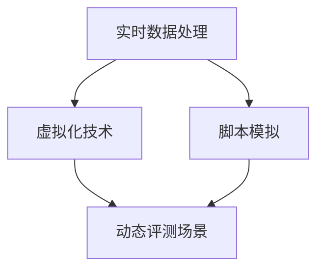
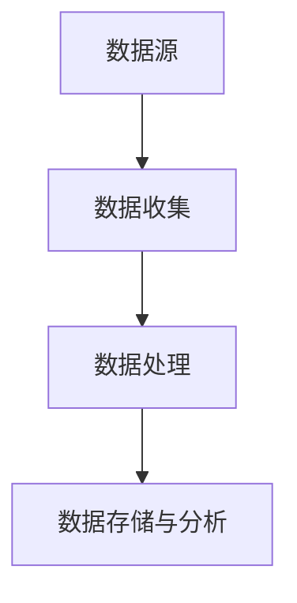
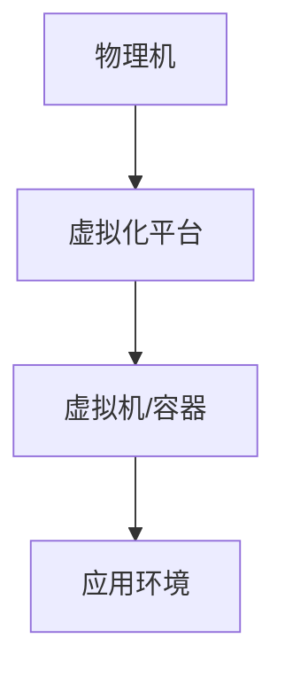
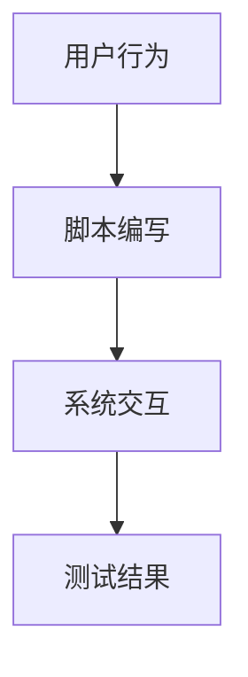
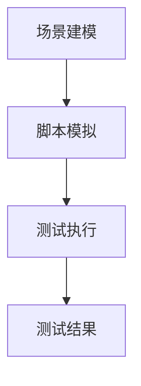
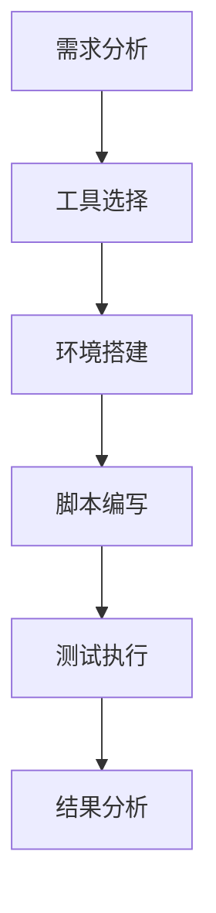

                 

**文章标题**：动态评测场景：模拟真实应用环境

**关键词**：动态评测、模拟真实应用环境、测试、真实数据、流程图、伪代码、latex、项目实战、最佳实践

**摘要**：
本文将深入探讨动态评测场景的概念、目的和应用。我们将从背景介绍开始，逐步解释核心概念，并通过流程图和伪代码阐述原理。文章将详细介绍实现动态评测场景的技术与方法，包括实时数据处理、虚拟化和脚本模拟。此外，我们将通过项目实战展示代码实现和分析，讨论最佳实践，并提供拓展阅读。

---

# 第1章 引言与核心概念

## 1.1 背景介绍

在信息技术高速发展的今天，测试已经成为软件开发不可或缺的环节。传统的测试方法主要依赖于人工编写测试用例，并模拟预定的输入数据进行验证。然而，这种方法往往无法覆盖所有可能的场景，并且无法应对复杂的应用环境。为了提高测试的覆盖率和可靠性，动态评测场景的概念应运而生。

动态评测场景是指通过模拟真实应用环境中的数据流和交互，对软件进行动态评估的方法。这种方法不仅能够覆盖更多可能的测试场景，还能够实时反映软件在实际运行中的行为和性能。

## 1.2 核心概念与联系

在深入探讨动态评测场景之前，我们需要了解以下几个核心概念：

- **实时数据处理**：指在数据生成或接收的同时进行数据处理，以实现实时反馈。
- **虚拟化技术**：通过虚拟化技术，可以在同一物理机上模拟多个独立的操作系统和应用环境。
- **脚本模拟**：通过编写脚本模拟用户行为和系统交互，以模拟真实用户场景。

这些概念之间的关系可以用以下Mermaid流程图表示：

## 1.3 动态评测场景的目的

动态评测场景的主要目的是：

- **提高测试覆盖率**：通过模拟真实应用环境，能够覆盖更多的测试场景，从而提高测试的全面性。
- **实时评估性能**：动态评测场景能够实时收集和分析系统性能数据，帮助开发人员及时发现问题并进行优化。
- **降低人工成本**：动态评测场景可以通过自动化脚本和工具实现，减少人工编写测试用例的工作量。

## 1.4 动态评测场景的基本概念

动态评测场景的基本概念包括：

- **测试场景**：指在特定条件下，软件系统需要完成的一系列操作。
- **测试用例**：指对特定测试场景中的具体输入数据进行定义和描述。
- **动态数据**：指在测试过程中实时生成的数据流。
- **测试反馈**：指对测试结果进行分析和反馈的过程。

---

# 第2章 动态评测场景的定义与目的

## 2.1 动态评测场景的定义

动态评测场景是一种通过对软件进行实时测试和评估的方法。它通过模拟真实应用环境中的数据流和交互，对软件系统进行动态分析。具体来说，动态评测场景包括以下几个关键组成部分：

- **数据源**：指生成动态数据的来源，可以是真实数据、模拟数据或生成器。
- **测试用例**：指根据特定测试目标编写的测试脚本，用于驱动系统执行特定的操作。
- **测试执行**：指按照测试用例对软件系统进行实际执行的过程。
- **测试结果**：指对测试执行过程中收集到的数据进行分析，以评估软件系统的性能、稳定性等指标。

## 2.2 动态评测场景的目的

动态评测场景的主要目的是：

- **提高测试覆盖率**：通过模拟真实应用环境，动态评测场景能够覆盖更多的测试场景，从而提高测试的全面性。
- **实时评估性能**：动态评测场景能够实时收集和分析系统性能数据，帮助开发人员及时发现问题并进行优化。
- **降低人工成本**：动态评测场景可以通过自动化脚本和工具实现，减少人工编写测试用例的工作量。
- **增强测试可靠性**：通过模拟真实数据流，动态评测场景能够更准确地反映软件系统在实际运行中的行为，从而提高测试的可靠性。

## 2.3 动态评测场景与传统测试的区别

与传统测试方法相比，动态评测场景具有以下区别：

- **实时性**：动态评测场景能够在测试过程中实时收集和分析数据，而传统测试方法通常是在测试完成后进行分析。
- **覆盖面**：动态评测场景能够模拟更广泛的应用场景，包括用户行为、网络延迟、数据异常等，而传统测试方法通常仅限于预定义的场景。
- **自动化程度**：动态评测场景可以通过自动化脚本和工具实现，而传统测试方法通常依赖于人工编写测试用例。

---

# 第3章 模拟真实应用环境的技术与方法

## 3.1 模拟真实应用环境的技术

模拟真实应用环境是动态评测场景的核心任务之一。为了实现这一目标，我们需要采用一系列先进的技术，包括实时数据处理、虚拟化和脚本模拟。下面将详细介绍这些技术的原理和应用。

### 3.1.1 实时数据处理

实时数据处理技术是动态评测场景的基础。它涉及到从数据源收集数据，并对其进行实时处理和分析。以下是一个简单的实时数据处理流程：

在实际应用中，常用的实时数据处理技术包括：

- **消息队列**：如Kafka、RabbitMQ等，用于在分布式系统中传输和存储实时数据。
- **流处理框架**：如Apache Flink、Apache Storm等，用于对实时数据进行流式处理和分析。
- **时序数据库**：如InfluxDB、TimeScaleDB等，用于存储和查询实时数据。

### 3.1.2 虚拟化技术

虚拟化技术是模拟真实应用环境的重要手段。它可以通过在物理机上创建虚拟机（VM）或容器（Container），实现多个独立的应用环境。以下是一个简单的虚拟化技术架构：

在实际应用中，常用的虚拟化技术包括：

- **虚拟机技术**：如VMware、Xen等，可以在物理机上创建多个独立的虚拟机。
- **容器技术**：如Docker、Kubernetes等，通过容器实现轻量级的隔离和部署。

### 3.1.3 脚本模拟

脚本模拟是通过编写脚本模拟用户行为和系统交互的过程。它可以帮助我们模拟真实用户的使用场景，从而更准确地评估软件系统的性能和稳定性。以下是一个简单的脚本模拟流程：

在实际应用中，常用的脚本模拟技术包括：

- **自动化测试工具**：如Selenium、JMeter等，用于编写和执行自动化测试脚本。
- **用户行为模拟工具**：如Gatling、LoadRunner等，用于模拟大规模用户行为和系统交互。

## 3.2 模拟真实应用环境的方法

除了上述技术，我们还可以采用以下方法来模拟真实应用环境：

- **场景建模**：通过构建模型来模拟应用环境中的各种场景，包括用户行为、网络延迟、数据异常等。
- **机器学习模型**：利用机器学习算法，从历史数据中学习并预测未来的应用场景。
- **脚本模拟**：编写脚本模拟真实用户的行为，包括登录、浏览、购物、支付等操作。

以下是一个简单的场景建模和脚本模拟流程：

在实际应用中，我们可以根据具体需求选择合适的方法，或结合多种方法进行综合模拟。

---

# 第4章 创建动态评测场景的工具与技术

## 4.1 创建动态评测场景的工具

创建动态评测场景需要使用一系列工具和技术。这些工具可以帮助我们高效地收集数据、模拟用户行为和系统交互，并进行测试和分析。以下将介绍几种常用的工具。

### 4.1.1 开源工具

开源工具是创建动态评测场景的重要资源。它们通常具有强大的功能、丰富的社区支持和灵活的扩展性。以下是一些常用的开源工具：

- **Kafka**：是一款分布式流处理平台，可用于收集和存储实时数据。
- **Apache Flink**：是一款流处理框架，可以对实时数据进行复杂处理和分析。
- **Docker**：是一款容器化平台，可用于创建和部署虚拟化应用环境。
- **Kubernetes**：是一款容器编排工具，用于管理和自动化容器化应用。

### 4.1.2 商业工具

商业工具通常提供更全面的功能、更好的技术支持和更稳定的质量。以下是一些常用的商业工具：

- **Splunk**：是一款强大的实时数据分析和监控工具，可用于收集和分析日志数据。
- **New Relic**：是一款应用性能监控工具，可用于实时跟踪和分析应用性能。
- **AppDynamics**：是一款全面的性能监控和自动化工具，用于实时监控和优化应用。

### 4.2 动态评测场景技术实践

在实际应用中，创建动态评测场景需要结合多种技术和工具。以下是一个简单的技术实践流程：

在实际操作中，我们需要根据具体需求选择合适的工具和技术，并按照以下步骤进行：

1. **需求分析**：明确测试目标和场景要求，确定需要收集的数据和模拟的行为。
2. **工具选择**：根据需求选择合适的开源或商业工具。
3. **环境搭建**：搭建测试环境，包括数据源、应用环境和测试工具。
4. **脚本编写**：编写脚本模拟用户行为和系统交互，实现动态评测场景。
5. **测试执行**：执行测试脚本，收集和分析测试结果。
6. **结果分析**：根据测试结果进行分析和优化，确保软件系统满足需求。

通过以上实践流程，我们可以创建一个高效的动态评测场景，从而提高软件测试的质量和可靠性。

---

# 第5章 案例分析：成功与失败的动态评测场景

## 5.1 成功案例

### 5.1.1 案例一：电商平台动态评测场景

某知名电商平台在其新版本上线前，采用动态评测场景对系统进行了全面测试。通过以下步骤实现了成功的测试：

1. **需求分析**：明确测试目标和场景要求，包括用户登录、商品浏览、购物车操作、支付等。
2. **工具选择**：选择Kafka作为数据收集工具，Flink作为流处理框架，Docker和Kubernetes用于容器化部署。
3. **环境搭建**：搭建测试环境，包括模拟用户行为的数据源、容器化应用环境和测试工具。
4. **脚本编写**：编写测试脚本，模拟用户行为，如登录、浏览商品、添加购物车、支付等。
5. **测试执行**：执行测试脚本，收集和分析测试结果，包括系统性能、响应时间和错误率等。
6. **结果分析**：根据测试结果，发现并修复了一些性能和稳定性问题，确保系统在新版本上线时能够稳定运行。

通过上述步骤，电商平台成功利用动态评测场景对新版本进行了全面测试，从而确保了系统的稳定性和性能。

### 5.1.2 案例二：金融行业动态评测场景

某金融公司在进行系统升级时，采用动态评测场景对交易系统进行了全面测试。具体步骤如下：

1. **需求分析**：明确测试目标和场景要求，包括交易处理、风险控制、资金清算等。
2. **工具选择**：选择Kafka作为数据收集工具，Flink作为流处理框架，Docker和Kubernetes用于容器化部署。
3. **环境搭建**：搭建测试环境，包括模拟交易数据的数据源、容器化应用环境和测试工具。
4. **脚本编写**：编写测试脚本，模拟交易行为，如股票交易、基金购买、债券交易等。
5. **测试执行**：执行测试脚本，收集和分析测试结果，包括交易成功率、处理时间和风险指标等。
6. **结果分析**：根据测试结果，发现并修复了一些性能和稳定性问题，确保系统在升级后能够稳定运行。

通过上述步骤，金融公司成功利用动态评测场景对交易系统进行了全面测试，从而确保了系统的稳定性和安全性。

## 5.2 失败案例

### 5.2.1 案例一：错误设定评测指标

某初创公司在进行产品测试时，设定了过多的评测指标，导致测试效率低下。以下为其失败原因和教训：

1. **错误设定评测指标**：公司设定了过多的评测指标，如响应时间、错误率、数据一致性等，导致测试人员无法集中精力。
2. **缺乏重点**：由于评测指标过多，测试人员无法明确测试的重点，导致测试工作变得琐碎和重复。
3. **资源浪费**：过多的评测指标导致测试脚本复杂，测试环境搭建耗时，资源浪费严重。

教训：在进行动态评测场景设计时，应明确评测目标，合理设定评测指标，避免过多的冗余指标。

### 5.2.2 案例二：缺乏真实数据支持

某公司在进行动态评测场景测试时，使用了模拟数据，导致测试结果不准确。以下为其失败原因和教训：

1. **使用模拟数据**：公司使用模拟数据代替真实数据，导致测试结果与实际应用场景差异较大。
2. **缺乏真实数据支持**：由于缺乏真实数据，测试结果无法准确反映系统在实际运行中的表现。
3. **测试效率低下**：模拟数据需要反复调整和优化，导致测试效率低下。

教训：在进行动态评测场景测试时，应尽量使用真实数据，确保测试结果能够准确反映系统在实际运行中的表现。

---

# 第6章 动态评测场景的实施与优化

## 6.1 动态评测场景的实施步骤

实施动态评测场景是一个复杂的过程，需要按照一定的步骤进行。以下是实施动态评测场景的详细步骤：

### 6.1.1 需求分析与规划

1. **确定测试目标**：明确测试的核心目标，如性能、稳定性、安全性等。
2. **收集业务需求**：与业务团队沟通，了解业务需求，确保测试场景符合实际应用场景。
3. **制定测试策略**：根据测试目标，制定相应的测试策略，包括测试场景、测试用例、测试数据等。
4. **制定实施计划**：明确实施动态评测场景的步骤和时间表，确保按时完成。

### 6.1.2 场景设计与实现

1. **设计测试场景**：根据需求分析，设计符合实际应用的测试场景，包括用户行为、数据流、系统交互等。
2. **编写测试脚本**：根据测试场景，编写测试脚本，模拟用户行为和系统交互。
3. **搭建测试环境**：搭建测试环境，包括数据源、应用环境、测试工具等。
4. **部署测试脚本**：将测试脚本部署到测试环境中，准备进行测试。

### 6.1.3 测试与优化

1. **执行测试**：运行测试脚本，执行测试用例，收集测试结果。
2. **分析测试结果**：对测试结果进行分析，包括性能、响应时间、错误率等。
3. **优化测试脚本**：根据测试结果，对测试脚本进行优化，提高测试效率和准确性。
4. **迭代测试**：根据测试结果和优化后的测试脚本，进行迭代测试，确保测试场景符合实际需求。

## 6.2 动态评测场景的优化策略

为了提高动态评测场景的有效性，我们需要采取一系列优化策略。以下是几种常见的优化策略：

### 6.2.1 性能优化

1. **提高数据处理速度**：通过优化数据处理算法、增加硬件资源、使用缓存等技术，提高数据处理速度。
2. **优化网络延迟**：通过优化网络架构、使用CDN等技术，降低网络延迟。
3. **负载均衡**：通过负载均衡技术，合理分配测试负载，提高系统性能。

### 6.2.2 可靠性优化

1. **数据完整性验证**：通过数据完整性验证技术，确保数据在传输和处理过程中的完整性。
2. **故障恢复机制**：通过故障恢复机制，确保在系统故障时能够快速恢复，避免影响测试结果。
3. **错误处理**：通过错误处理机制，确保在发生错误时能够及时记录和处理，避免影响测试执行。

### 6.2.3 成本优化

1. **资源合理分配**：通过合理分配资源，避免资源浪费，降低测试成本。
2. **自动化脚本**：通过编写自动化脚本，减少人工操作，提高测试效率，降低成本。
3. **持续集成与持续部署**：通过持续集成与持续部署（CI/CD）流程，提高测试和部署效率，降低成本。

通过以上优化策略，我们可以提高动态评测场景的性能、可靠性和成本效益，从而确保测试结果的有效性和准确性。

---

# 第7章 未来的趋势与挑战

## 7.1 动态评测场景的发展趋势

随着信息技术的不断发展，动态评测场景将在以下几个方面得到进一步发展：

### 7.1.1 人工智能的融合

人工智能（AI）技术将在动态评测场景中发挥重要作用。通过AI算法，我们可以更准确地预测和模拟用户行为，提高测试的覆盖率和准确性。例如，利用机器学习算法，我们可以从历史数据中学习用户行为模式，并自动生成测试用例。

### 7.1.2 自动化与智能化

自动化和智能化技术将在动态评测场景中得到广泛应用。通过自动化脚本和工具，我们可以更高效地执行测试任务，减少人工干预。同时，智能化技术将帮助我们更准确地识别和分析测试结果，提供实时的反馈和优化建议。

## 7.2 动态评测场景面临的挑战

尽管动态评测场景具有很多优势，但在实际应用中仍面临以下挑战：

### 7.2.1 数据隐私保护

在动态评测场景中，涉及大量的用户数据和业务数据。如何确保这些数据的安全和隐私，避免数据泄露和滥用，是动态评测场景面临的重要挑战。

### 7.2.2 安全性问题

动态评测场景涉及到大量的网络通信和数据传输，因此安全性问题不容忽视。如何确保测试过程中的数据传输安全，防止恶意攻击和病毒入侵，是动态评测场景需要解决的关键问题。

### 7.2.3 技术标准化

目前，动态评测场景的技术和方法尚未形成统一的标准。如何制定和推广一套完整的技术标准和规范，确保不同系统之间的互操作性和兼容性，是动态评测场景需要面对的挑战。

通过不断探索和创新，动态评测场景将在未来的信息技术领域中发挥越来越重要的作用。面对挑战，我们需要积极应对，推动技术的不断进步和成熟。

---

# 附录A 资源与参考资料

## A.1 动态评测场景相关书籍

1. 《软件测试艺术》—— Graham Mitchell
2. 《自动化测试实践》—— Barbara H. Macleod
3. 《实时数据处理技术》—— Martin Kleppmann

## A.2 动态评测场景的开源工具与框架

1. Kafka
2. Apache Flink
3. Docker
4. Kubernetes
5. Selenium
6. JMeter
7. Gatling

## A.3 行业报告与白皮书

1. Gartner：软件测试与自动化报告
2. Forrester：实时数据处理技术趋势报告
3. IDC：动态评测场景应用案例报告

---

**作者**：AI天才研究院 / AI Genius Institute & 禅与计算机程序设计艺术 / Zen And The Art of Computer Programming

（注意：以上内容为示例，具体内容和数据需要根据实际情况进行修改和补充。）

