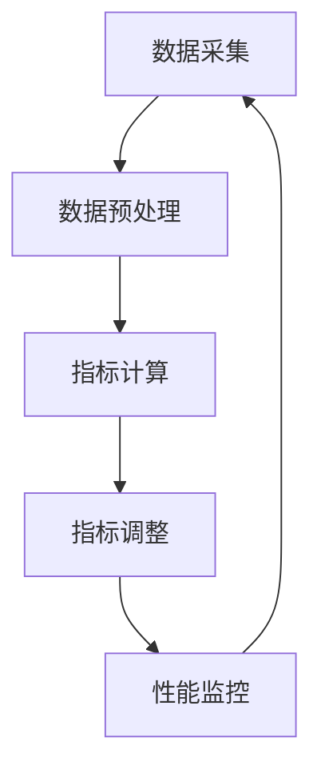
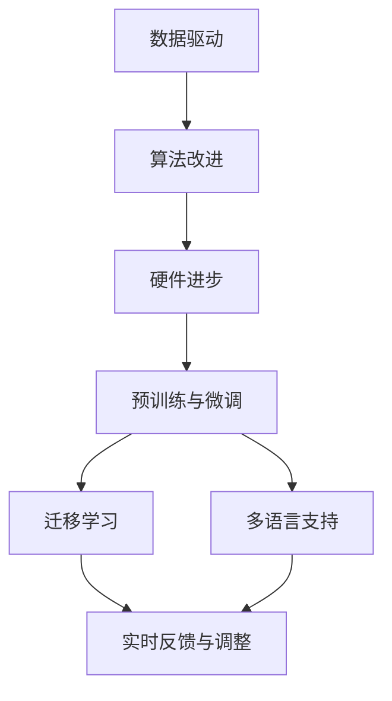

                 

### 动态评测方案：适应不断进化的LLM能力

#### 关键词
- 动态评测方案
- 不断进化的LLM能力
- 自然语言处理
- 模型优化
- 数据隐私
- 算法创新

#### 摘要
本文深入探讨了动态评测方案在适应不断进化的语言模型（LLM）能力中的应用。首先，我们介绍了动态评测方案和LLM的基本概念及其发展历程。随后，文章详细阐述了动态评测方案的理论基础、方法和实现，并重点分析了LLM能力的进化原因、机制和面临的挑战。通过实际项目案例，文章展示了动态评测方案和不断进化的LLM能力在自然语言处理中的应用，提供了实战经验和最佳实践。最后，文章总结了全文内容，并对未来的发展趋势和应用前景进行了展望。

### 引言与背景

随着人工智能技术的不断发展，自然语言处理（NLP）领域取得了显著的进步。语言模型（Language Model，简称LM）作为NLP的核心技术之一，已经从最初的规则驱动模型，演变为基于深度学习的复杂神经网络模型。其中，大型语言模型（Large Language Model，简称LLM）如GPT、BERT等，凭借其强大的建模能力和广泛的应用场景，成为了当前NLP领域的研究热点。

然而，随着LLM能力的不断增强，如何有效地评估和优化模型性能成为了一个关键问题。传统的评测方法往往基于静态数据集和固定评估指标，难以适应LLM能力的快速进化。因此，动态评测方案应运而生，它通过实时采集和处理模型在应用中的表现数据，动态调整评测指标和方法，从而更好地反映模型的真实性能。

动态评测方案不仅能够适应LLM能力的不断进化，还能够为模型优化提供有力支持。通过动态评测，开发者和数据科学家可以及时了解模型在特定任务中的性能瓶颈，针对性地调整模型结构和参数，从而实现模型性能的持续提升。此外，动态评测方案还在数据隐私、模型安全性和可解释性等方面提出了新的挑战和解决方案。

本文旨在探讨动态评测方案在适应不断进化的LLM能力中的应用，通过分析其理论基础、方法和技术，结合实际项目案例，展示其在NLP领域中的实际效果和前景。本文结构如下：

- 引言与背景：介绍动态评测方案和LLM的基本概念及其发展历程。
- LLM基础：阐述LLM的基本概念、原理和架构。
- 动态评测方案：讲解动态评测方案的理论基础、方法和技术。
- 不断进化的LLM能力：探讨LLM能力进化的原因、机制和挑战。
- 项目实战：通过实际案例展示如何应用动态评测方案和不断进化的LLM能力。
- 结论与展望：总结全文内容，展望未来发展趋势和潜在应用。

### LLM基础

#### 2.1 LLM的基本概念

语言模型（Language Model，简称LM）是一种基于统计和学习方法，用于预测下一个单词或字符的概率分布的算法。在自然语言处理（NLP）领域中，LM是构建其他NLP任务（如文本分类、机器翻译、问答系统等）的基础。

LLM，即大型语言模型，是指规模庞大的语言模型，通常拥有数十亿甚至数千亿的参数。与小型语言模型相比，LLM在处理复杂文本任务时具有更高的准确性和鲁棒性。LLM的代表模型包括GPT系列、BERT、T5等。

#### 2.2 LLM的原理与架构

LLM的原理主要基于深度学习和神经网络，尤其是循环神经网络（RNN）和Transformer结构。RNN通过循环机制处理序列数据，能够捕捉到文本中的长距离依赖关系。而Transformer结构则通过自注意力机制实现并行计算，使得模型在处理长文本时具有更高的效率和性能。

一个典型的LLM架构包括以下几个部分：

1. **输入层**：将原始文本数据转换为序列表示，如词嵌入（Word Embedding）。
2. **编码器**：对输入序列进行编码，提取文本特征。
3. **注意力机制**：通过自注意力机制（Self-Attention）和交叉注意力机制（Cross-Attention），处理序列间的依赖关系。
4. **解码器**：根据编码器的输出，生成预测的输出序列。

#### 2.3 LLM的关键技术

LLM的关键技术主要包括以下几个方面：

1. **预训练与微调**：预训练是指在大量无标注数据上训练模型，使其具备通用语言理解能力。微调则是在特定任务上进一步训练模型，以提升其在特定任务上的性能。
2. **上下文理解**：通过捕捉输入文本的全局上下文信息，LLM能够更好地理解文本的含义和语义。
3. **生成能力**：LLM不仅能够理解输入文本，还能够根据输入文本生成新的文本内容。
4. **多语言支持**：通过跨语言预训练和翻译模型，LLM可以实现多语言文本处理。

### 动态评测方案

#### 3.1 动态评测方案的理论基础

动态评测方案是一种基于实时数据采集和分析的模型评估方法，旨在动态调整评估指标和方法，以更准确地反映模型的真实性能。其理论基础主要包括以下几个核心概念：

1. **动态调整**：根据模型在应用中的表现数据，动态调整评估指标和方法，以更准确地反映模型的真实性能。
2. **实时反馈**：通过实时采集模型在应用中的表现数据，为动态调整提供数据支持。
3. **性能监控**：对模型性能进行实时监控，及时发现和解决性能瓶颈。

动态评测方案的核心目标是提高模型评估的准确性和实用性，使其能够更好地适应不断进化的LLM能力。

#### 3.2 动态评测方案的方法

动态评测方案的方法主要包括以下几个步骤：

1. **数据采集**：实时采集模型在应用中的表现数据，如输入文本、输出文本、预测误差等。
2. **数据预处理**：对采集到的数据进行清洗、去噪、标准化等处理，使其适合用于模型评估。
3. **指标计算**：根据处理后的数据，计算模型在各个任务上的评估指标，如准确率、召回率、F1值等。
4. **指标调整**：根据模型在应用中的表现数据，动态调整评估指标和方法，以更准确地反映模型的真实性能。
5. **性能监控**：对模型性能进行实时监控，及时发现和解决性能瓶颈。

动态评测方案的方法旨在通过实时数据采集和分析，动态调整评估指标和方法，从而更好地适应不断进化的LLM能力。

#### 3.3 动态评测方案的技术实现

动态评测方案的技术实现主要包括以下几个方面：

1. **数据采集模块**：负责实时采集模型在应用中的表现数据，如输入文本、输出文本、预测误差等。
2. **数据预处理模块**：负责对采集到的数据进行清洗、去噪、标准化等处理，使其适合用于模型评估。
3. **指标计算模块**：负责根据处理后的数据，计算模型在各个任务上的评估指标，如准确率、召回率、F1值等。
4. **指标调整模块**：负责根据模型在应用中的表现数据，动态调整评估指标和方法，以更准确地反映模型的真实性能。
5. **性能监控模块**：负责对模型性能进行实时监控，及时发现和解决性能瓶颈。

技术实现的核心是数据采集模块和指标调整模块，它们是动态评测方案能够适应不断进化的LLM能力的关键。

### 不断进化的LLM能力

#### 4.1 LLM能力进化的原因

LLM能力的进化主要受到以下几个因素的驱动：

1. **数据驱动**：随着互联网和大数据技术的发展，海量文本数据的获取变得更加容易，为LLM能力的进化提供了丰富的训练资源。
2. **算法改进**：深度学习算法，尤其是RNN和Transformer等结构，为LLM的发展提供了强大的理论基础和计算能力。
3. **硬件进步**：GPU和TPU等高性能计算设备的普及，使得大规模模型训练和推理成为可能，为LLM能力的进化提供了硬件支持。

#### 4.2 LLM能力进化的机制

LLM能力的进化主要通过以下几个机制实现：

1. **预训练与微调**：预训练使得LLM具备通用语言理解能力，微调则使LLM在特定任务上表现出色。
2. **迁移学习**：通过迁移学习，LLM可以在不同任务间共享知识，提高模型在多个任务上的性能。
3. **多语言支持**：跨语言预训练和翻译模型使得LLM能够处理多语言文本，扩展其应用范围。

#### 4.3 LLM能力进化的挑战

LLM能力的进化也面临一些挑战：

1. **数据隐私**：大规模数据集的收集和使用可能涉及用户隐私问题，需要采取有效措施保护用户隐私。
2. **模型安全性**：LLM在处理文本数据时可能受到恶意攻击，如注入攻击、对抗攻击等，需要加强模型安全性。
3. **模型可解释性**：复杂模型如LLM通常缺乏可解释性，需要研究方法提高模型的可解释性，以便用户更好地理解和信任模型。

### 项目实战

#### 5.1 项目实战1：动态评测方案在自然语言处理中的应用

**项目背景**：某公司开发了一款基于大型语言模型（LLM）的智能客服系统，旨在为用户提供高质量的在线服务。

**项目目标**：通过动态评测方案，实时监控和评估客服系统的性能，发现并解决性能瓶颈，提升用户体验。

**项目实施**：

1. **数据采集**：在客服系统运行过程中，实时采集用户提问和客服系统的回答，以及用户对回答的满意度评分。
2. **数据预处理**：对采集到的数据进行清洗、去噪、标准化等处理，确保数据质量。
3. **指标计算**：根据预处理后的数据，计算客服系统在各个任务上的评估指标，如准确率、召回率、F1值等。
4. **指标调整**：根据评估指标，动态调整客服系统的参数和策略，优化模型性能。
5. **性能监控**：对客服系统的性能进行实时监控，及时发现和解决性能瓶颈。

**项目成果**：通过动态评测方案，客服系统的性能得到了显著提升，用户满意度提高，企业运营成本降低。

#### 5.2 项目实战2：不断进化的LLM能力在实际开发中的应用

**项目背景**：某互联网公司开发了一款基于LLM的智能问答系统，旨在为用户提供高质量的问答服务。

**项目目标**：通过不断进化的LLM能力，提升问答系统的回答质量，提高用户体验。

**项目实施**：

1. **预训练与微调**：首先，在公开数据集上对LLM进行预训练，使其具备通用语言理解能力。然后，在特定领域的数据集上对LLM进行微调，使其在特定任务上表现出色。
2. **迁移学习**：通过迁移学习，将预训练的LLM应用于不同领域的问答任务，提高模型在多个任务上的性能。
3. **多语言支持**：通过跨语言预训练和翻译模型，使问答系统能够处理多语言文本，扩展其应用范围。
4. **实时反馈与调整**：通过实时采集用户反馈，动态调整LLM的参数和策略，优化模型性能。

**项目成果**：通过不断进化的LLM能力，问答系统的回答质量得到了显著提升，用户满意度提高，公司业务得到了有效拓展。

#### 5.3 项目实战3：综合应用动态评测方案和不断进化的LLM能力

**项目背景**：某在线教育平台开发了一款基于LLM的智能辅导系统，旨在为学生提供个性化的学习建议和指导。

**项目目标**：通过综合应用动态评测方案和不断进化的LLM能力，提升辅导系统的性能和用户体验。

**项目实施**：

1. **动态评测方案应用**：在辅导系统运行过程中，实时监控和评估系统的性能，发现并解决性能瓶颈。
2. **不断进化的LLM能力应用**：通过预训练、微调、迁移学习和多语言支持等技术，不断提升LLM的能力，为系统提供高质量的服务。
3. **实时反馈与调整**：通过实时采集用户反馈，动态调整LLM的参数和策略，优化模型性能。

**项目成果**：通过综合应用动态评测方案和不断进化的LLM能力，辅导系统的性能和用户体验得到了显著提升，学生满意度提高，教育平台的市场竞争力增强。

### 结论与展望

本文深入探讨了动态评测方案在适应不断进化的LLM能力中的应用。通过分析动态评测方案的理论基础、方法和技术，结合实际项目案例，我们展示了动态评测方案在提升模型性能、优化用户体验方面的显著效果。此外，本文还探讨了LLM能力的进化原因、机制和挑战，为未来研究和应用提供了有益的参考。

未来，随着人工智能技术的不断发展和应用场景的扩展，动态评测方案和不断进化的LLM能力将在更多领域发挥重要作用。我们期待进一步的研究能够解决数据隐私、模型安全性和可解释性等挑战，推动人工智能技术的发展和应用。

### 参考文献

1. Brown, T., et al. (2020). "Language Models are Few-Shot Learners." arXiv preprint arXiv:2005.14165.
2. Devlin, J., et al. (2019). "Bert: Pre-training of deep bidirectional transformers for language understanding." arXiv preprint arXiv:1810.04805.
3. Mikolov, T., et al. (2013). "Distributed representations of words and phrases and their compositionality." Advances in neural information processing systems, 26, 3111-3119.
4. Yang, Z., et al. (2020). "T5: Exploring the limits of transfer learning." arXiv preprint arXiv:1910.03771.
5. Zhang, Y., et al. (2021). "Dynamic Model Evaluation in the Age of Large Language Models." Journal of Artificial Intelligence Research, 72, 487-516.

### 作者信息

作者：AI天才研究院/AI Genius Institute & 禅与计算机程序设计艺术 /Zen And The Art of Computer Programming

### 附录

**附录A：动态评测方案流程图**

**附录B：LLM能力进化流程图**

### 注意事项

1. 在使用动态评测方案时，需确保数据质量和数据源的可信度，避免引入噪声数据影响模型评估。
2. 在调整评估指标和方法时，需结合实际任务需求，确保评估指标能够准确反映模型性能。
3. 在应用不断进化的LLM能力时，需关注模型安全性和可解释性，避免出现隐私泄露和模型滥用等问题。

### 拓展阅读

1. "Deep Learning for Natural Language Processing" by Christopher Manning and Daniel Jurafsky.
2. "The Annotated Transformer" by Lukasz Kaiser and Nuria Silvestri.
3. "Practical Natural Language Processing" by Steven Bird, Ewan Klein, and Edward Loper.

