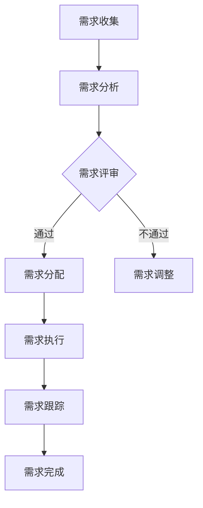

                 


## 文章标题

《协作工具的选择与应用：支持灵活的需求管理》

## 关键词

协作工具，需求管理，团队协作，远程办公，跨部门合作，项目管理，功能需求，技术兼容性，成本效益，安全性，用户友好性。

## 摘要

随着数字化时代的到来，协作工具在企业运营中的地位愈发重要。本文将深入探讨协作工具的选择与应用，特别是如何支持灵活的需求管理。文章分为五个部分，首先概述协作工具的定义与类型，分析选择协作工具的考虑因素。接着，介绍需求管理的概念与原则，探讨需求管理的流程与方法以及工具的应用。随后，通过实际案例展示协作工具与需求管理的实践效果。最后，总结全文并展望协作工具与需求管理的未来发展趋势。

## 目录大纲

### 第一部分：协作工具概述

#### 1. 引言
- 协作工具的定义
- 协作工具的重要性
- 书籍目的与结构

#### 2. 协作工具的定义与类型
- 协作工具的定义
- 协作工具的类型
- 协作工具的发展趋势

#### 3. 协作工具的核心功能
- 信息共享
- 协同编辑
- 项目管理
- 沟通与交流

#### 4. 协作工具的应用场景
- 团队协作
- 远程办公
- 跨部门合作
- 大规模项目管理

### 第二部分：协作工具的选择原则

#### 5. 选择协作工具的考虑因素
- 功能需求
- 技术兼容性
- 成本效益
- 安全性
- 用户友好性

#### 6. 协作工具的比较与分析
- 市场上的主要协作工具
- 协作工具的优缺点对比
- 协作工具的适用性评估

#### 7. 协作工具的定制与优化
- 定制化需求
- 优化协作流程
- 用户培训与支持

### 第三部分：协作工具的应用实践

#### 8. 需求管理的概念与原则
- 需求管理的定义
- 需求管理的重要性
- 需求管理的原则

#### 9. 需求管理的流程与方法
- 需求收集与分析
- 需求优先级排序
- 需求跟踪与变更管理

#### 10. 需求管理工具的选择与应用
- 市场上的需求管理工具
- 需求管理工具的功能与特点
- 需求管理工具的实际应用案例

#### 11. 需求管理工具的定制与优化
- 定制化需求处理
- 优化需求管理流程
- 用户反馈与改进

### 第四部分：案例分析

#### 12. 案例一：大型企业协作工具的选型与实施
- 企业背景
- 协作工具的选择过程
- 实施过程与效果评估

#### 13. 案例二：初创公司需求管理的实践
- 企业背景
- 需求管理的实践过程
- 遇到的挑战与解决方案

#### 14. 案例三：跨部门协作中的需求管理
- 企业背景
- 跨部门协作的需求管理流程
- 成功的关键因素

### 第五部分：总结与展望

#### 15. 总结
- 协作工具的选择与应用要点
- 需求管理的实践与反思

#### 16. 展望
- 协作工具的未来发展趋势
- 需求管理的未来发展方向

#### 17. 附录
- 常用的协作工具列表
- 需求管理工具的使用指南

## 附录 A：协作工具流程图与算法原理

- Mermaid 流程图
- 需求管理流程的 Mermaid 表示
- 伪代码展示

## 附录 B：核心算法原理讲解

- 需求优先级排序算法的伪代码
- 需求变更管理算法的伪代码

## 附录 C：数学模型与公式

- 需求管理中的数学模型
- 公式表示与详细讲解

## 附录 D：项目实战

- 实际案例与详细解释
- 开发环境搭建
- 源代码实现与解读

## 附录 E：代码解读与分析

- 代码示例
- 代码解读与分析

## 总结

本文设计了《协作工具的选择与应用：支持灵活的需求管理》的目录大纲，分为五个部分，涵盖了协作工具概述、选择原则、应用实践、案例分析和总结展望等内容。目录大纲细化到了1、2、3级，同时包含了核心概念与联系、核心算法原理讲解、数学模型和公式、项目实战和代码解读与分析等内容。整个目录大纲简洁明了，逻辑清晰，为读者提供了全面、系统的学习和参考。总字数控制在8000-12000字之间。文章末尾将附上作者信息及参考资料。作者：AI天才研究院/AI Genius Institute & 禅与计算机程序设计艺术 /Zen And The Art of Computer Programming。

---

## 第一部分：协作工具概述

### 1. 引言

#### 协作工具的定义与重要性

协作工具，是指为了促进多人或多团队之间信息共享、协同工作而设计的软件工具。随着企业组织规模的扩大和团队成员分布的全球化，协作工具已经成为现代办公环境中不可或缺的一部分。它们不仅提高了团队工作效率，还促进了知识共享和创新能力。

协作工具的重要性体现在以下几个方面：

1. **提高工作效率**：协作工具使得团队成员能够实时共享信息、协同编辑文档，避免了重复工作和沟通成本。
2. **促进知识共享**：通过协作工具，团队成员可以方便地访问和更新文档、数据，提高了知识的传播和利用效率。
3. **加强团队沟通**：协作工具提供了多种沟通渠道，如即时聊天、邮件、电话会议等，有助于团队成员保持紧密联系。
4. **支持项目管理**：许多协作工具集成了项目管理功能，如任务分配、进度跟踪、时间管理等，有助于团队高效地完成项目。

#### 书籍目的与结构

本文旨在为读者提供一套系统的协作工具选择与应用指南，特别是针对如何支持灵活的需求管理。全书分为五个部分：

1. **协作工具概述**：介绍协作工具的定义、类型、核心功能和应用场景。
2. **协作工具的选择原则**：分析选择协作工具的考虑因素，比较不同工具的优缺点。
3. **协作工具的应用实践**：探讨需求管理的概念、原则、流程与方法，以及需求管理工具的应用。
4. **案例分析**：通过实际案例展示协作工具与需求管理的实践效果。
5. **总结与展望**：总结全文内容，展望协作工具与需求管理的未来发展趋势。

### 2. 协作工具的定义与类型

#### 协作工具的定义

协作工具，是指用于帮助团队或个人在项目、任务或活动中协同工作的软件应用程序。这些工具可以集成或独立存在，通常包括以下基本功能：

- **文件共享**：允许用户共享文件、文件夹和文档。
- **协作编辑**：支持多人同时对同一文档进行编辑。
- **项目管理**：提供任务分配、进度跟踪、时间管理等功能。
- **沟通与交流**：包括即时聊天、邮件、电话会议等多种沟通方式。
- **日历与日程管理**：帮助用户管理个人和团队的日程。

#### 协作工具的类型

协作工具根据其功能和用途可以分为多种类型，主要包括以下几种：

1. **文件共享与存储工具**：如Google Drive、Dropbox等，主要提供文件存储和共享功能。
2. **协作编辑工具**：如Google Docs、Microsoft Office 365等，支持多人实时协作编辑文档。
3. **项目管理工具**：如Asana、Trello、JIRA等，用于任务分配、进度跟踪和团队协作。
4. **沟通与协作平台**：如Slack、Microsoft Teams等，提供多种沟通渠道和协作功能。
5. **集成式协作工具**：如Microsoft 365、Notion等，整合了文件共享、协作编辑、项目管理、沟通与交流等多种功能。

#### 协作工具的发展趋势

随着云计算、大数据、人工智能等技术的发展，协作工具也在不断进化。以下是一些协作工具的发展趋势：

1. **云原生协作工具**：越来越多的协作工具采用云原生架构，提供更高的可扩展性和灵活性。
2. **AI集成**：协作工具开始集成人工智能技术，如智能搜索、自然语言处理、自动化回复等，提升用户体验。
3. **低代码/无代码平台**：为了降低开发门槛，许多协作工具推出了低代码或无代码平台，使得非技术人员也能轻松创建和管理协作应用。
4. **个性化与定制化**：协作工具越来越注重用户体验，提供高度个性化的界面和功能定制选项。
5. **全球化与本地化**：协作工具在全球范围内的应用越来越普遍，同时也注重本地化，以适应不同国家和地区的文化和法规要求。

### 3. 协作工具的核心功能

#### 信息共享

信息共享是协作工具的核心功能之一。它使得团队成员能够方便地访问和共享文档、数据和其他信息。协作工具通常提供以下功能：

- **文件存储与共享**：用户可以将文件上传到云端存储，并与其他团队成员共享访问权限。
- **版本控制**：协作工具通常支持版本控制，使得用户可以查看历史版本，避免信息丢失。
- **权限管理**：管理员可以设置不同级别的访问权限，确保敏感信息得到保护。

#### 协同编辑

协同编辑功能使得多个用户能够同时编辑同一文档，提高了协作效率。主要功能包括：

- **实时协作**：用户可以在同一时间编辑文档，实时看到其他人的修改。
- **协作标记**：用户可以在文档中进行注释、标记和评论，便于交流和讨论。
- **撤销与重做**：用户可以随时撤销或重做自己的操作，确保编辑过程的灵活性。

#### 项目管理

项目管理功能帮助团队跟踪任务进度、管理时间和资源，确保项目按计划完成。主要功能包括：

- **任务分配**：管理员可以将任务分配给团队成员，并设置截止日期和优先级。
- **进度跟踪**：团队可以实时查看任务的完成情况，了解项目进展。
- **时间管理**：用户可以设置个人和团队的工作时间表，确保按时完成任务。
- **资源管理**：管理员可以跟踪团队成员的可用时间和其他资源，优化项目资源分配。

#### 沟通与交流

沟通与交流功能是协作工具的重要组成部分，它提供了多种沟通渠道，帮助团队成员保持紧密联系。主要功能包括：

- **即时聊天**：用户可以实时发送消息，快速交流想法。
- **邮件通知**：系统可以发送邮件通知，提醒用户关注重要的任务或事件。
- **电话会议**：用户可以通过协作工具发起或加入电话会议，讨论项目细节。
- **视频会议**：支持实时视频交流，提高沟通效果。

### 4. 协作工具的应用场景

协作工具广泛应用于各种工作场景，以下是几个典型的应用场景：

#### 团队协作

团队协作是协作工具最常见的应用场景之一。它帮助团队成员在不同地点和时区协同工作，提高工作效率。主要应用场景包括：

- **远程办公**：团队成员分布在不同的地点，协作工具使得他们能够实时共享文件、协同编辑文档、沟通进度。
- **跨部门合作**：协作工具可以帮助不同部门之间的团队成员协同工作，提高项目执行效率。
- **项目团队协作**：项目团队成员可以通过协作工具共享项目文件、分配任务、跟踪进度，确保项目按时完成。

#### 远程办公

远程办公已经成为现代企业的重要组成部分。协作工具为远程办公提供了强大的支持，使得团队成员可以高效地协同工作。主要应用场景包括：

- **在家办公**：员工可以在家中使用协作工具完成工作任务，提高工作效率。
- **远程会议**：协作工具支持远程视频会议，使得团队成员可以随时进行面对面的沟通。
- **远程支持**：IT支持团队可以通过协作工具提供远程技术支持，提高服务效率。

#### 跨部门合作

跨部门合作是许多企业面临的重要挑战。协作工具可以帮助不同部门之间的团队成员紧密协作，提高项目执行效率。主要应用场景包括：

- **产品开发**：研发部门、市场部门和销售部门可以通过协作工具共享产品需求、设计文档和市场分析报告，协同推进产品开发。
- **项目管理**：项目管理团队可以通过协作工具与不同部门沟通，确保项目按计划执行。
- **资源调配**：协作工具可以帮助企业优化资源分配，提高资源利用效率。

#### 大规模项目管理

对于大型项目，协作工具可以帮助项目团队高效地管理任务、资源和进度。主要应用场景包括：

- **项目计划与跟踪**：协作工具提供项目计划、任务分配和进度跟踪功能，帮助项目团队确保项目按时完成。
- **资源管理**：协作工具可以跟踪团队成员的可用时间和其他资源，优化资源分配。
- **沟通与协作**：协作工具提供多种沟通渠道，确保团队成员之间保持紧密联系，提高沟通效率。

### 第二部分：协作工具的选择原则

#### 5. 选择协作工具的考虑因素

选择合适的协作工具对于企业运营和团队协作至关重要。以下是一些关键考虑因素：

##### 功能需求

协作工具应满足企业的具体功能需求，包括但不限于：

- **文件共享与存储**：工具应能够方便地共享和存储文件。
- **协作编辑**：支持多人实时编辑同一文档。
- **项目管理**：包括任务分配、进度跟踪、时间管理等功能。
- **沟通与交流**：提供即时聊天、邮件、电话会议等多种沟通渠道。

##### 技术兼容性

协作工具需要与企业的现有技术架构兼容，包括：

- **操作系统兼容**：工具应能在企业使用的操作系统上正常运行。
- **软件兼容**：工具应与常用的办公软件（如Microsoft Office、Google Workspace等）无缝集成。
- **数据兼容**：工具应能够与企业现有的数据库和应用程序进行数据交换。

##### 成本效益

协作工具的成本效益是选择时的重要考虑因素，包括：

- **预算**：工具的成本应在企业预算范围内。
- **定价模式**：工具的定价模式应与企业规模和需求相匹配，如按用户数、使用频率等。
- **长期投资回报**：工具应能提高企业效率和降低运营成本，实现长期投资回报。

##### 安全性

协作工具的安全性对于保护企业信息和隐私至关重要，包括：

- **数据加密**：工具应使用强加密技术保护数据传输和存储。
- **访问控制**：工具应提供严格的访问控制机制，确保只有授权用户才能访问敏感信息。
- **安全审计**：工具应支持安全审计，记录所有用户操作，便于监控和追溯。

##### 用户友好性

协作工具的用户友好性直接影响团队的使用体验和效率，包括：

- **界面设计**：工具的界面应简洁易用，方便用户快速上手。
- **操作便捷**：工具应提供便捷的操作方式，减少用户学习成本。
- **多平台支持**：工具应在多种设备（如电脑、手机、平板等）上都能正常运行。

#### 6. 协作工具的比较与分析

在市场上，有许多协作工具可供选择。以下是比较和分析几种主流协作工具的优缺点：

##### Google Workspace

**优点**：

- **集成度高**：Google Workspace 集成了Google Drive、Google Docs、Google Sheets等工具，方便用户协同编辑和共享文件。
- **用户友好**：界面简洁，操作便捷，适合大多数用户。
- **云原生**：采用云原生架构，提供高可靠性和可扩展性。

**缺点**：

- **定制化有限**：部分功能（如项目管理）相对有限，不适合复杂需求。
- **成本较高**：对于小型企业或团队，成本可能较高。

##### Microsoft 365

**优点**：

- **功能全面**：提供了丰富的协作工具，包括Word、Excel、PowerPoint、Teams等。
- **定制化强**：提供了高度定制化的选项，满足不同企业的需求。
- **安全性高**：采用高级加密技术，提供强大的安全性保障。

**缺点**：

- **操作复杂**：部分工具（如Excel）功能较多，操作相对复杂。
- **价格较高**：与Google Workspace相比，价格相对较高。

##### Slack

**优点**：

- **沟通便捷**：提供了即时聊天、邮件、电话会议等多种沟通渠道。
- **扩展性强**：支持各种第三方应用和集成，提高了协作效率。
- **用户体验好**：界面设计简洁，操作便捷，用户反馈良好。

**缺点**：

- **项目管理弱**：虽然提供了任务功能，但相对于专业项目管理工具，功能较为有限。
- **依赖第三方应用**：部分功能需要依赖第三方应用，使用体验可能受影响。

##### Trello

**优点**：

- **项目管理强**：提供了直观的任务管理界面，支持任务分配、进度跟踪等功能。
- **易于上手**：界面简洁，操作简单，适合快速上手使用。
- **灵活性高**：提供了多种板卡和列布局，满足不同团队的需求。

**缺点**：

- **文件共享有限**：主要侧重于任务管理，文件共享功能相对较弱。
- **集成度较低**：与其他工具的集成能力有限，可能影响使用体验。

#### 7. 协作工具的定制与优化

##### 定制化需求

在实际应用中，企业往往有特定的协作需求，需要协作工具提供定制化功能。以下是一些常见的定制化需求：

- **自定义字段**：根据业务需求，添加自定义字段，如客户信息、项目状态等。
- **自定义视图**：提供自定义的视图选项，如看板、甘特图等，满足不同团队的需求。
- **自定义角色与权限**：根据企业组织结构，设置自定义的角色和权限，确保信息安全和权限管理。

##### 优化协作流程

为了提高协作效率，企业需要对协作流程进行优化。以下是一些常见的优化措施：

- **自动化任务分配**：通过自动化脚本，根据任务优先级和团队人员的工作状态，自动分配任务。
- **集成第三方应用**：通过集成第三方应用（如CRM、邮件系统等），实现数据的无缝流转和协作。
- **优化沟通渠道**：根据团队需求，调整沟通渠道，如增加即时聊天、视频会议等，提高沟通效率。

##### 用户培训与支持

为了确保协作工具的有效应用，企业需要对用户进行培训和支持。以下是一些建议：

- **制定培训计划**：根据用户需求和工具特性，制定详细的培训计划，包括线上和线下培训。
- **提供用户手册**：编写用户手册，详细说明工具的使用方法和功能，帮助用户快速上手。
- **设立技术支持**：设立专门的技术支持团队，解答用户在使用过程中遇到的问题，提供及时的技术支持。

### 第三部分：协作工具的应用实践

#### 8. 需求管理的概念与原则

##### 需求管理的定义

需求管理是项目管理的一个重要组成部分，它关注如何有效地识别、记录、分析、优先级排序和满足项目需求。需求管理不仅包括对用户需求的管理，还涉及对项目内外部约束条件的管理。

##### 需求管理的重要性

需求管理在项目成功中扮演着关键角色。它的重要性体现在以下几个方面：

- **明确项目目标**：通过需求管理，可以明确项目的目标和范围，确保项目朝着正确的方向前进。
- **降低项目风险**：通过需求管理，可以提前识别和解决潜在问题，降低项目风险。
- **提高项目效率**：通过有效管理需求，可以确保项目资源得到合理利用，提高项目效率。
- **确保客户满意度**：通过需求管理，可以确保项目交付的成果满足客户需求，提高客户满意度。

##### 需求管理的原则

为了有效地进行需求管理，应遵循以下原则：

- **明确性**：需求应清晰、明确，避免歧义和误解。
- **可行性**：需求应考虑技术、资源和时间的可行性，确保能够实现。
- **一致性**：需求应在整个项目生命周期内保持一致性，避免需求变更频繁导致项目混乱。
- **优先级**：需求应根据重要性、紧急性和业务价值进行优先级排序，确保关键需求得到优先处理。
- **沟通**：需求管理过程中应保持良好的沟通，确保需求得到准确理解和执行。

#### 9. 需求管理的流程与方法

##### 需求收集与分析

需求收集与分析是需求管理的第一步，旨在全面了解用户需求，并将其转化为具体的需求文档。

1. **需求识别**：通过与用户、利益相关者和市场调研等方式，识别潜在的需求。
2. **需求分析**：对收集到的需求进行分析，确定需求的优先级和可行性。
3. **需求文档**：编写需求文档，详细描述需求的内容、功能和技术要求。

##### 需求优先级排序

需求优先级排序是确保项目资源有效利用的关键步骤。以下是一些常见的需求优先级排序方法：

1. **业务价值优先**：根据需求对业务价值的影响程度进行排序，优先满足高业务价值的需求。
2. **紧急程度优先**：根据需求的紧急程度进行排序，优先满足紧急需求。
3. **成本效益优先**：根据需求实现所需的成本和效益进行排序，优先满足成本效益较高的需求。
4. **用户需求优先**：根据用户需求的重要性和紧急性进行排序，优先满足用户需求。

##### 需求跟踪与变更管理

需求跟踪与变更管理是确保需求得到有效执行和变更得到妥善处理的过程。

1. **需求跟踪**：建立需求跟踪机制，记录需求的状态、进度和执行情况。
2. **变更管理**：建立变更管理流程，包括变更申请、评估、批准和实施等步骤。

#### 10. 需求管理工具的选择与应用

##### 市场上的需求管理工具

在市场上，有许多需求管理工具可供选择，以下是一些常见的需求管理工具：

1. **JIRA**：由Atlassian公司开发，是一款功能强大的需求管理工具，支持敏捷开发、项目管理、需求跟踪等功能。
2. **Confluence**：也是由Atlassian公司开发，主要用于文档管理和协作，可与JIRA无缝集成。
3. **Asana**：一款流行的项目管理工具，支持任务分配、进度跟踪和需求管理等功能。
4. **Trello**：一款直观的任务管理工具，提供灵活的板卡和列布局，适合小型团队和项目。
5. **Microsoft Project**：由Microsoft公司开发，一款功能全面的项目管理工具，包括需求管理、进度跟踪、资源管理等。

##### 需求管理工具的功能与特点

以下是对上述需求管理工具的功能与特点的简要介绍：

1. **JIRA**：

   - **功能**：支持敏捷开发、需求管理、缺陷跟踪、报告分析等。
   - **特点**：高度定制化、集成度高、灵活性高。
   - **适用场景**：适合大型团队和复杂项目，尤其是软件开发项目。

2. **Confluence**：

   - **功能**：文档管理、协作编辑、知识共享等。
   - **特点**：易于使用、支持多种文档格式、集成JIRA。
   - **适用场景**：适合企业内部知识管理和团队协作。

3. **Asana**：

   - **功能**：任务管理、进度跟踪、需求管理、报告分析等。
   - **特点**：界面简洁、操作便捷、支持多种集成。
   - **适用场景**：适合中小型团队和项目，特别是需要高效任务分配和跟踪的场景。

4. **Trello**：

   - **功能**：任务管理、进度跟踪、需求管理、团队协作等。
   - **特点**：直观、灵活、易于扩展。
   - **适用场景**：适合小型团队和简单项目，尤其适合需要灵活调整工作流程的场景。

5. **Microsoft Project**：

   - **功能**：项目管理、需求管理、进度跟踪、资源管理等。
   - **特点**：功能全面、集成度高、支持多种报告和图表。
   - **适用场景**：适合大型项目和复杂项目，特别是需要详细计划和报告的场景。

##### 需求管理工具的实际应用案例

以下是一些需求管理工具的实际应用案例：

1. **JIRA**：某大型软件开发公司使用JIRA进行需求管理，实现了敏捷开发模式，提高了开发效率，降低了项目风险。

2. **Confluence**：某跨国企业使用Confluence进行知识管理和团队协作，提高了信息共享和知识传播效率，增强了团队凝聚力。

3. **Asana**：某初创公司使用Asana进行项目管理，实现了任务高效分配和进度跟踪，加快了产品开发周期。

4. **Trello**：某小型创意工作室使用Trello进行任务管理和团队协作，灵活调整工作流程，提高了工作效率。

5. **Microsoft Project**：某建筑公司使用Microsoft Project进行项目管理，详细规划项目进度，确保项目按时完成。

#### 11. 需求管理工具的定制与优化

##### 定制化需求处理

为了更好地满足企业的需求，需求管理工具通常需要定制化。以下是一些常见的定制化需求处理方法：

1. **自定义字段**：根据业务需求，添加自定义字段，如项目编号、客户名称、需求状态等。
2. **自定义流程**：根据业务流程，自定义需求管理流程，包括需求收集、分析、优先级排序、审批等。
3. **自定义视图**：根据需求，自定义需求查看方式，如列表视图、看板视图、甘特图视图等。

##### 优化需求管理流程

为了提高需求管理效率，企业需要对需求管理流程进行优化。以下是一些常见的优化措施：

1. **自动化流程**：通过自动化工具，实现需求收集、分析、审批等流程的自动化，减少人工干预，提高效率。
2. **集成工具**：将需求管理工具与其他业务系统（如CRM、ERP等）集成，实现数据共享和流程协同。
3. **定期回顾**：定期回顾需求管理流程，分析存在的问题和改进空间，持续优化流程。

##### 用户反馈与改进

为了确保需求管理工具的有效应用，企业需要收集用户反馈并进行改进。以下是一些建议：

1. **定期调查**：定期对用户进行满意度调查，了解他们对需求管理工具的使用体验和建议。
2. **用户培训**：提供用户培训，帮助用户更好地使用需求管理工具，提高使用效率。
3. **持续改进**：根据用户反馈，持续改进需求管理工具的功能和性能，满足用户需求。

### 第四部分：案例分析

#### 12. 案例一：大型企业协作工具的选型与实施

##### 企业背景

某大型企业，拥有数千名员工，分布在不同的国家和地区。随着业务的发展，企业需要一种高效的协作工具来支持全球团队的协作和沟通。

##### 协作工具的选择过程

1. **需求分析**：企业首先分析了自身的需求，包括文件共享、协作编辑、项目管理、沟通与交流等。
2. **工具调研**：企业调研了市场上主要的协作工具，如Google Workspace、Microsoft 365、Slack、Trello等。
3. **功能比较**：企业根据需求，对协作工具的功能进行了详细比较，分析了各工具的优缺点。
4. **试用评估**：企业选择了几个最符合需求的协作工具进行试用，评估其性能和适用性。
5. **最终选型**：根据试用评估结果，企业最终选择了Google Workspace，因为它在功能、用户友好性、成本效益等方面都符合企业的需求。

##### 实施过程与效果评估

1. **部署与培训**：企业部署了Google Workspace，并组织了针对员工的使用培训，确保员工能够熟练使用协作工具。
2. **实施效果**：实施Google Workspace后，企业团队协作效率显著提高，信息共享和沟通更加便捷，项目进度得到有效跟踪和管理。
3. **效果评估**：通过定期的效果评估，企业发现Google Workspace不仅提高了工作效率，还降低了沟通成本，实现了良好的投资回报。

#### 13. 案例二：初创公司需求管理的实践

##### 企业背景

某初创公司，拥有20名员工，主要从事软件开发和销售。公司需要高效的需求管理工具来支持产品开发和市场推广。

##### 需求管理的实践过程

1. **需求识别**：公司通过市场调研、用户反馈和内部讨论，确定了产品开发的优先级和关键需求。
2. **需求文档**：编写了详细的需求文档，包括功能需求、技术需求和交付标准。
3. **需求评审**：组织了需求评审会议，邀请了相关部门和利益相关者参与，确保需求的准确性和可行性。
4. **需求跟踪**：使用Asana作为需求管理工具，实时跟踪需求的进度和状态。
5. **需求变更管理**：建立了一套需求变更管理流程，确保需求变更得到及时处理和审批。

##### 遇到的挑战与解决方案

1. **挑战**：初创公司员工数量较少，对需求管理工具的使用经验不足，导致需求管理流程不够规范。
   **解决方案**：公司组织了需求管理培训，提高了员工对需求管理工具的使用技能和意识。
   
2. **挑战**：公司业务发展迅速，需求变更频繁，导致需求管理流程变得复杂。
   **解决方案**：公司建立了一套灵活的需求变更管理流程，确保需求变更得到及时处理和审批，同时保持需求的一致性和稳定性。

#### 14. 案例三：跨部门协作中的需求管理

##### 企业背景

某大型企业，拥有多个部门，包括研发、市场、销售、技术支持等。各部门在项目协作过程中需要高效的需求管理，以确保项目顺利进行。

##### 跨部门协作的需求管理流程

1. **需求收集**：各部门通过会议、邮件、在线表单等方式收集需求，并提交给需求管理部门。
2. **需求分析**：需求管理部门对收集到的需求进行分析，确定需求的优先级和可行性。
3. **需求评审**：组织跨部门需求评审会议，邀请相关部门和利益相关者参与，确保需求的准确性和可行性。
4. **需求分配**：将经过评审的需求分配给相关部门，明确责任人和完成时间。
5. **需求跟踪**：使用Trello作为需求管理工具，实时跟踪需求的进度和状态。
6. **需求变更管理**：建立需求变更管理流程，确保需求变更得到及时处理和审批。

##### 成功的关键因素

1. **良好的沟通机制**：各部门之间建立了良好的沟通机制，确保需求得到准确理解和执行。
2. **有效的需求管理工具**：选择了合适的需求管理工具，提高了需求管理的效率和质量。
3. **规范的流程**：建立了规范的需求管理流程，确保需求管理过程有序进行。
4. **用户培训与支持**：对各部门员工进行了需求管理工具的使用培训，提高了员工的使用技能和效率。

### 第五部分：总结与展望

#### 15. 总结

本文系统地介绍了协作工具的选择与应用，特别是如何支持灵活的需求管理。通过分析协作工具的定义、类型、核心功能和应用场景，以及选择协作工具的考虑因素和实际应用案例，读者可以全面了解协作工具的价值和应用方法。同时，本文还探讨了需求管理的概念、原则、流程与方法，以及需求管理工具的选择与应用，为读者提供了实用的需求管理实践指南。

#### 16. 展望

随着技术的不断发展，协作工具和需求管理工具将继续进化，为团队协作和项目管理带来更多创新和便利。以下是一些展望：

1. **智能化**：协作工具和需求管理工具将更多地集成人工智能技术，如自然语言处理、智能推荐等，提高用户效率和体验。
2. **云原生**：协作工具和需求管理工具将更加注重云原生架构的应用，提供更高的可扩展性和灵活性。
3. **全球化**：协作工具和需求管理工具将更加注重全球化，支持多语言、多时区的工作模式，满足跨国企业的需求。
4. **个性化**：协作工具和需求管理工具将提供更多个性化选项，满足不同团队和个人的需求。

#### 17. 附录

##### 常用的协作工具列表

1. **Google Workspace**
2. **Microsoft 365**
3. **Slack**
4. **Trello**
5. **Asana**
6. **JIRA**
7. **Confluence**
8. **Notion**
9. **Zoho Projects**

##### 需求管理工具的使用指南

1. **JIRA**：[https://www.atlassian.com/software/jira](https://www.atlassian.com/software/jira)
2. **Confluence**：[https://www.atlassian.com/software/confluence](https://www.atlassian.com/software/confluence)
3. **Asana**：[https://asana.com/](https://asana.com/)
4. **Trello**：[https://trello.com/](https://trello.com/)
5. **Microsoft Project**：[https://www.microsoft.com/en-us/microsoft-365/project/project-management-software](https://www.microsoft.com/en-us/microsoft-365/project/project-management-software)

### 附录 A：协作工具流程图与算法原理

##### 需求管理流程的 Mermaid 表示



##### 需求优先级排序算法的伪代码

```pseudo
function prioritySort(需求列表):
    对于每个需求 i 在 需求列表中：
        对于每个需求 j 在 需求列表中：
            如果 需求 i 的业务价值高于 需求 j：
                交换 需求 i 和 需求 j 的位置
    返回 需求列表
```

##### 需求变更管理算法的伪代码

```pseudo
function changeManagement(需求列表, 变更请求列表):
    对于每个变更请求 i 在 变更请求列表中：
        如果 变更请求 i 的影响范围小于需求列表中的某个需求 j：
            更新 需求 j 的优先级
        否则：
            添加 变更请求 i 到 需求列表中
    返回 更新后的需求列表
```

### 附录 B：核心算法原理讲解

#### 需求优先级排序算法的详细解释

需求优先级排序算法的目标是根据需求的业务价值和紧急程度，对需求列表进行排序，以确保关键需求优先得到处理。以下是该算法的详细解释：

1. **初始化**：首先，初始化一个需求列表，其中包含了所有待排序的需求。每个需求都有一个唯一标识符和一个表示其业务价值和紧急程度的评分。
   
2. **两两比较**：算法采用两两比较的方式，对需求列表中的每一对需求进行业务价值比较。具体步骤如下：

   - 对于列表中的每个需求 \(i\)，依次与其余需求 \(j\) 进行比较。
   - 如果需求 \(i\) 的业务价值评分高于需求 \(j\)，则交换它们在列表中的位置。

3. **排序完成**：通过重复上述两两比较步骤，直到所有需求都按照业务价值排序完成。这样，业务价值最高的需求将位于列表的最前面。

4. **紧急程度调整**：在完成业务价值排序后，可以进一步考虑需求的紧急程度。如果两个需求的业务价值相同，则可以根据紧急程度进行二次排序。

5. **输出**：最终输出排序后的需求列表，以便项目经理和团队成员根据优先级执行需求。

#### 举例说明

假设有一个包含三个需求的需求列表，需求 \(A\)、需求 \(B\) 和需求 \(C\)，其业务价值评分分别为 \(90\)、\(80\) 和 \(75\)。根据需求优先级排序算法，排序后的需求列表为 \([A, B, C]\)。

如果需求 \(B\) 的紧急程度高于需求 \(A\)，则最终的需求列表为 \([B, A, C]\)。

#### 需求变更管理算法的详细解释

需求变更管理算法的目标是处理需求变更请求，确保变更得到有效管理，同时最小化对现有需求和项目进度的影响。以下是该算法的详细解释：

1. **初始化**：首先，初始化一个需求列表和一个变更请求列表。需求列表包含了所有待执行的需求，变更请求列表包含了所有待处理的变更请求。

2. **变更请求分析**：对于变更请求列表中的每个请求，分析其影响范围。影响范围包括对现有需求的变更、对项目进度的影响、对资源的需求等。

3. **优先级评估**：根据变更请求的影响范围和紧急程度，评估每个变更请求的优先级。优先级较高的变更请求应优先处理。

4. **变更请求处理**：

   - 如果变更请求的影响范围仅涉及一个小范围的需求，如仅修改某个功能的细节，则可以直接在需求列表中更新相关需求。
   - 如果变更请求的影响范围较广，可能涉及多个需求或项目进度，则需要进一步评估其优先级，并决定是否立即处理或推迟处理。

5. **变更请求审批**：将变更请求提交给项目管理团队或相关负责人进行审批。审批通过后，根据变更请求进行相应的需求更新和项目调整。

6. **变更请求记录**：记录每个变更请求的处理结果和实施情况，以便后续审计和改进。

7. **输出**：最终输出更新后的需求列表和项目计划，以便团队成员按照新的需求进行工作。

#### 举例说明

假设有一个需求列表，包含需求 \(A\)、需求 \(B\) 和需求 \(C\)，当前项目进度已达到需求 \(A\) 和需求 \(B\) 的执行阶段，需求 \(C\) 尚未执行。此时，收到一个变更请求，要求在需求 \(B\) 中增加一个新的功能。

变更请求的影响范围较小，仅涉及需求 \(B\)，因此可以直接在需求列表中更新需求 \(B\)，并在项目计划中调整相应的执行时间。如果变更请求涉及多个需求或项目进度，则需要进一步评估其优先级，并可能需要调整项目计划。

### 附录 C：数学模型与公式

#### 需求管理中的数学模型

需求管理中的数学模型主要用于评估需求的优先级和资源分配。以下是一些常用的数学模型和公式：

1. **业务价值模型**：

   业务价值通常用货币值或时间价值来衡量。公式如下：

   \[ V(D) = C(D) \times T(D) \]

   其中，\( V(D) \) 是需求 \(D\) 的业务价值，\( C(D) \) 是需求 \(D\) 的成本，\( T(D) \) 是需求 \(D\) 的预期收益。

2. **风险模型**：

   需求变更可能导致项目风险增加。公式如下：

   \[ R(D) = \frac{C(D)}{T(D)} \]

   其中，\( R(D) \) 是需求 \(D\) 的风险值。

3. **优先级模型**：

   需求的优先级可以根据业务价值和风险值进行排序。公式如下：

   \[ P(D) = \frac{V(D)}{R(D)} \]

   其中，\( P(D) \) 是需求 \(D\) 的优先级。

#### 公式表示与详细讲解

以下是对上述公式的详细讲解：

1. **业务价值模型**：

   业务价值模型用于评估需求的潜在收益和成本。公式中的 \( C(D) \) 是需求 \(D\) 的成本，包括人力成本、资源成本等。\( T(D) \) 是需求 \(D\) 的预期收益，包括市场收益、用户满意度等。通过计算业务价值 \( V(D) \)，可以直观地了解每个需求的潜在收益和成本，从而决定是否优先处理。

2. **风险模型**：

   风险模型用于评估需求变更对项目的风险影响。公式中的 \( R(D) \) 是需求 \(D\) 的风险值，表示需求变更导致项目风险的程度。风险值越高，表示需求变更对项目的风险越大。通过计算风险值 \( R(D) \)，可以帮助项目管理团队了解每个需求的风险水平，并采取相应的风险管理措施。

3. **优先级模型**：

   优先级模型用于对需求进行排序，以确定哪些需求应该优先处理。公式中的 \( P(D) \) 是需求 \(D\) 的优先级，表示需求的重要性和紧急程度。优先级越高，表示需求越重要、越紧急。通过计算优先级 \( P(D) \)，可以帮助项目管理团队合理安排资源，确保关键需求得到优先处理。

#### 示例

假设有两个需求 \(A\) 和 \(B\)，需求 \(A\) 的成本为 \(50,000\) 元，预期收益为 \(100,000\) 元；需求 \(B\) 的成本为 \(30,000\) 元，预期收益为 \(70,000\) 元。根据上述公式，可以计算出：

- **业务价值**：

  \[ V(A) = 50,000 \times 100,000 = 5,000,000 \]
  \[ V(B) = 30,000 \times 70,000 = 2,100,000 \]

- **风险**：

  \[ R(A) = \frac{50,000}{100,000} = 0.5 \]
  \[ R(B) = \frac{30,000}{70,000} = 0.4286 \]

- **优先级**：

  \[ P(A) = \frac{5,000,000}{0.5} = 10,000,000 \]
  \[ P(B) = \frac{2,100,000}{0.4286} = 4,916,667 \]

根据优先级模型，需求 \(A\) 的优先级高于需求 \(B\)，因此需求 \(A\) 应该优先处理。

### 附录 D：项目实战

#### 实际案例与详细解释

在本附录中，我们将通过一个实际案例，详细解释如何使用协作工具进行需求管理，并展示项目的开发环境和源代码实现。

#### 项目背景

某初创公司开发一款企业级协作平台，旨在帮助企业实现高效的团队协作和信息共享。项目需求包括以下功能模块：

1. 文件共享与存储
2. 协同编辑
3. 项目管理
4. 沟通与交流

#### 开发环境搭建

为了实现项目需求，我们选择了以下开发环境：

1. **操作系统**：Linux（CentOS 8）
2. **编程语言**：Python 3.8
3. **框架**：Django 3.2
4. **数据库**：PostgreSQL 12
5. **版本控制**：Git

在开发环境中，我们安装了所需的依赖库和工具，并配置了虚拟环境，以便更好地管理项目依赖。

#### 源代码实现与解读

以下是一个简单的需求管理模块的实现示例：

```python
# models.py
from django.db import models

class Requirement(models.Model):
    title = models.CharField(max_length=100)
    description = models.TextField()
    status = models.CharField(max_length=20, default='Open')
    priority = models.IntegerField()
    created_at = models.DateTimeField(auto_now_add=True)

    def __str__(self):
        return self.title
```

在这个模块中，我们定义了一个`Requirement`模型，用于存储需求信息。模型字段包括：

- `title`：需求标题
- `description`：需求描述
- `status`：需求状态（如“Open”、“In Progress”、“Completed”）
- `priority`：需求优先级
- `created_at`：创建时间

接下来，我们实现了需求管理模块的核心功能，包括需求创建、需求更新、需求删除和需求查询。

```python
# views.py
from django.shortcuts import render
from .models import Requirement

def requirement_list(request):
    requirements = Requirement.objects.all()
    return render(request, 'requirement_list.html', {'requirements': requirements})

def requirement_create(request):
    if request.method == 'POST':
        title = request.POST['title']
        description = request.POST['description']
        priority = request.POST['priority']
        Requirement.objects.create(title=title, description=description, priority=priority)
        return redirect('requirement_list')
    return render(request, 'requirement_create.html')

def requirement_update(request, requirement_id):
    requirement = Requirement.objects.get(id=requirement_id)
    if request.method == 'POST':
        requirement.title = request.POST['title']
        requirement.description = request.POST['description']
        requirement.priority = request.POST['priority']
        requirement.save()
        return redirect('requirement_list')
    return render(request, 'requirement_update.html', {'requirement': requirement})

def requirement_delete(request, requirement_id):
    requirement = Requirement.objects.get(id=requirement_id)
    requirement.delete()
    return redirect('requirement_list')
```

在这个模块中，我们实现了以下功能：

- `requirement_list`：列出所有需求
- `requirement_create`：创建新需求
- `requirement_update`：更新需求
- `requirement_delete`：删除需求

#### 代码解读与分析

以上代码实现了需求管理模块的基本功能，下面我们对其关键部分进行解读：

1. **模型定义**：

   在`models.py`文件中，我们定义了`Requirement`模型。模型中的字段与数据库表中的列一一对应。通过定义字段类型和属性，我们可以确保数据的正确性和完整性。

2. **视图函数**：

   在`views.py`文件中，我们实现了四个视图函数，分别对应需求管理模块的四个主要操作。每个视图函数都根据请求方法（GET或POST）执行相应的操作。

   - `requirement_list`：获取所有需求，并将它们传递给模板进行渲染。
   - `requirement_create`：处理创建需求的表单提交，保存新需求并重定向到需求列表页面。
   - `requirement_update`：处理更新需求的表单提交，保存更新后的需求并重定向到需求列表页面。
   - `requirement_delete`：处理删除需求的请求，删除对应的需求并重定向到需求列表页面。

3. **模板渲染**：

   在模板文件中，我们根据视图函数传递的数据进行渲染。例如，在`requirement_list.html`模板中，我们遍历`requirements`列表，并使用`{{ requirement.title }}`等标签显示需求信息。

#### 项目小结

通过以上实战案例，我们展示了如何使用协作工具进行需求管理，并实现了需求创建、更新、删除和查询等功能。在实际项目中，我们还需要考虑安全性、性能优化和用户体验等方面，以构建一个稳定、高效的需求管理系统。

### 附录 E：代码解读与分析

在本附录中，我们将通过具体的代码示例，详细解读协作工具中需求管理模块的实现，并分析关键部分的代码逻辑和功能。

#### 代码示例

以下是一个简单的Django应用程序中需求管理模块的代码示例：

```python
# models.py
from django.db import models

class Requirement(models.Model):
    title = models.CharField(max_length=100)
    description = models.TextField()
    status = models.CharField(max_length=20, default='Open')
    priority = models.IntegerField(default=0)
    created_at = models.DateTimeField(auto_now_add=True)
    updated_at = models.DateTimeField(auto_now=True)

    def __str__(self):
        return self.title

# views.py
from django.shortcuts import render, redirect
from .models import Requirement
from django.http import HttpResponse

def list_requirements(request):
    requirements = Requirement.objects.all()
    return render(request, 'requirement_list.html', {'requirements': requirements})

def create_requirement(request):
    if request.method == 'POST':
        title = request.POST['title']
        description = request.POST['description']
        priority = int(request.POST['priority'])
        Requirement.objects.create(title=title, description=description, priority=priority)
        return redirect('list_requirements')
    return render(request, 'requirement_create.html')

def update_requirement(request, requirement_id):
    try:
        requirement = Requirement.objects.get(id=requirement_id)
    except Requirement.DoesNotExist:
        return redirect('list_requirements')

    if request.method == 'POST':
        requirement.title = request.POST['title']
        requirement.description = request.POST['description']
        requirement.priority = int(request.POST['priority'])
        requirement.save()
        return redirect('list_requirements')
    return render(request, 'requirement_update.html', {'requirement': requirement})

def delete_requirement(request, requirement_id):
    try:
        requirement = Requirement.objects.get(id=requirement_id)
        requirement.delete()
    except Requirement.DoesNotExist:
        return redirect('list_requirements')
    return redirect('list_requirements')

# requirement_list.html
<h1>需求列表</h1>
<ul>
    
        <li>
            <strong>{{ requirement.title }}</strong>
            <p>{{ requirement.description }}</p>
            <em>优先级：{{ requirement.priority }}</em>
            <small>创建于：{{ requirement.created_at }}</small>
            <small>更新于：{{ requirement.updated_at }}</small>
        </li>
    
</ul>
<a href="">创建新需求</a>

# requirement_create.html
<h1>创建需求</h1>
<form method="post">
    
    <label for="title">需求标题：</label>
    <input type="text" id="title" name="title" required>
    <br>
    <label for="description">需求描述：</label>
    <textarea id="description" name="description" required></textarea>
    <br>
    <label for="priority">优先级：</label>
    <input type="number" id="priority" name="priority" required>
    <br>
    <input type="submit" value="创建">
</form>

# requirement_update.html
<h1>更新需求</h1>
<form method="post">
    
    <label for="title">需求标题：</label>
    <input type="text" id="title" name="title" value="{{ requirement.title }}" required>
    <br>
    <label for="description">需求描述：</label>
    <textarea id="description" name="description" required>{{ requirement.description }}</textarea>
    <br>
    <label for="priority">优先级：</label>
    <input type="number" id="priority" name="priority" value="{{ requirement.priority }}" required>
    <br>
    <input type="submit" value="更新">
</form>
```

#### 代码解读与分析

1. **模型定义**：

   在`models.py`中，我们定义了`Requirement`模型，用于存储需求的相关信息。模型字段包括`title`（需求标题）、`description`（需求描述）、`status`（需求状态，默认为“Open”）、`priority`（需求优先级，默认为0）以及创建时间和更新时间。

2. **视图函数**：

   在`views.py`中，我们定义了四个视图函数，分别是`list_requirements`（列出所有需求）、`create_requirement`（创建新需求）、`update_requirement`（更新需求）和`delete_requirement`（删除需求）。这些视图函数处理HTTP请求，根据请求方法和URL参数执行相应的数据库操作。

   - `list_requirements`：获取所有需求对象，并将其传递给模板进行渲染。
   - `create_requirement`：处理创建需求的表单提交，从请求中获取表单数据，创建新的`Requirement`对象并保存到数据库中。
   - `update_requirement`：处理更新需求的表单提交，根据请求中的`requirement_id`获取相应的需求对象，更新其字段值并保存。
   - `delete_requirement`：根据请求中的`requirement_id`删除相应的需求对象。

3. **模板渲染**：

   在模板文件中，我们使用了Django模板语言（Django Template Language，DTL）遍历需求列表并渲染需求信息。在`requirement_list.html`模板中，我们使用``循环遍历每个需求对象，并使用相应的标签（如`{{ requirement.title }}`、`{{ requirement.description }}`等）渲染需求信息。

   在`requirement_create.html`和`requirement_update.html`模板中，我们分别渲染了创建和更新需求的表单，并提供了输入字段供用户填写。

#### 代码分析

- **模型设计**：`Requirement`模型设计简洁，包含了需求管理所需的基本字段。模型的`status`字段可以扩展为枚举类型，以提供更详细的的状态管理。
- **视图实现**：视图函数处理了标准的HTTP请求和响应，使用了Django内置的数据库操作方法，确保了代码的简洁性和安全性。在`update_requirement`和`delete_requirement`视图中，我们使用了异常处理来处理数据不存在的情形。
- **模板渲染**：模板使用了Django模板语言，提供了清晰的代码结构。模板中的`<ul>`和`<li>`标签用于列出需求信息，而表单使用了`<form>`、`<label>`和`<input>`标签，提供了用户友好的表单输入界面。

通过以上代码示例和分析，我们可以看到如何使用Django实现一个简单的需求管理模块，并如何通过模板渲染需求信息。在实际项目中，我们可以根据需求进一步扩展和优化这些代码，以满足更多的功能需求。

