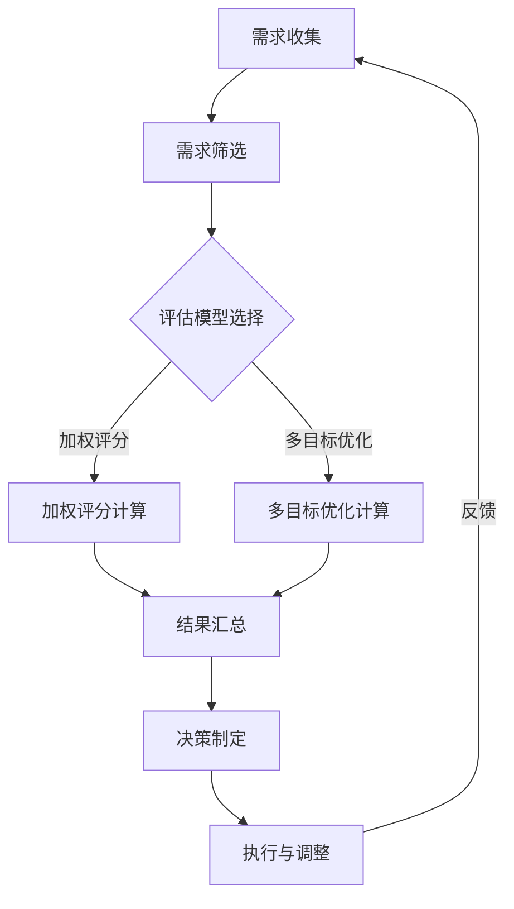
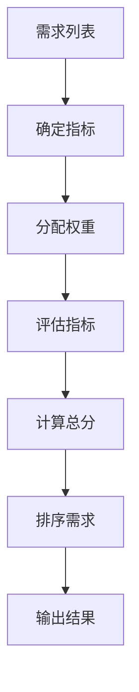

                 


### 背景介绍

在当今快速发展的信息技术时代，软件开发和项目管理的复杂性不断增加。随着需求的多变和项目规模的扩大，如何高效地管理需求并确保团队的一致性成为关键挑战。传统的需求优先级评定方法往往依赖于个人判断或单一团队的意见，这不仅可能导致偏差，还容易陷入局部最优，从而影响项目的整体成功。

协作式需求优先级评定作为一种创新的解决方案，通过引入多方协作和集体智慧，旨在提高团队共识，确保需求评定的客观性和全面性。这种方法不仅关注需求的技术实现，还强调需求背后的业务价值和用户需求，使得评估过程更加科学和合理。

本文旨在深入探讨协作式需求优先级评定的原理、方法与实践，通过一系列逐步分析推理的步骤，帮助读者理解这一重要概念，并掌握如何在实际项目中应用。文章将分为以下几个部分：

1. **协作式需求优先级评定的概述**：介绍协作式需求优先级评定的背景和重要性。
2. **协作式需求优先级评定的理论基础**：阐述需求优先级评估的数学模型和核心算法原理，并提供Mermaid流程图。
3. **协作式需求优先级评定的方法与实践**：详细描述协作式需求评估的流程和方法，并分享实践案例。
4. **提高团队共识的策略**：讨论团队沟通技巧和提升共识的策略与实践。
5. **协作式需求优先级评定的挑战与应对**：分析常见问题与解决方案，并探讨持续改进的反馈机制。
6. **协作式需求优先级评定的案例分析**：通过具体案例展示协作式需求优先级评定的实际应用。
7. **未来趋势与展望**：展望协作式需求优先级评定的未来发展。

### 核心概念与联系

协作式需求优先级评定涉及多个核心概念，这些概念相互联系，共同构成了一个完整的评估体系。以下是对这些核心概念及其相互关系的介绍：

**1. 需求优先级评估的重要性：** 需求优先级评估是软件开发项目中的关键环节，它决定了资源分配、开发顺序和项目进度。通过合理的优先级评估，团队能够更加聚焦于最重要、最有价值的需求，从而提高项目的成功率和客户满意度。

**2. 协作式评估方法：** 协作式评估方法强调多方参与和集体智慧，通过团队内部或跨团队的合作，对需求进行综合评定。这种方法克服了传统个人判断的局限性，提高了评估的客观性和准确性。

**3. 数学模型：** 数学模型是协作式需求优先级评定的基础，用于量化需求的优先级。常见的数学模型包括基于加权评分的方法、多目标优化模型等，这些模型可以提供定量评估结果，帮助团队做出更科学的决策。

**4. 核心算法原理：** 核心算法原理是指用于实现数学模型的具体计算方法。例如，加权评分模型需要确定各项指标的权重，而多目标优化模型则需要求解最优解。核心算法原理的正确实现对于评估结果的准确性和可靠性至关重要。

**5. Mermaid流程图：** Mermaid流程图是一种用于描述流程和逻辑关系的图形化工具。在协作式需求优先级评定中，可以使用Mermaid流程图来展示评估过程的各个步骤，帮助读者更好地理解评估流程。

为了更直观地展示这些核心概念之间的联系，我们使用Mermaid流程图进行描述。以下是一个简化的流程图：



在这个流程图中，需求收集是整个评估过程的起点，通过需求筛选确定需要评估的需求。评估模型选择决定了后续的具体评估方法，可以是加权评分或多目标优化。核心算法原理用于计算评估结果，这些结果经过汇总后用于决策制定。执行与调整环节确保评估结果能够应用于实际项目，并形成反馈循环，不断优化评估过程。

通过这个Mermaid流程图，我们可以清晰地看到协作式需求优先级评定的各个步骤及其相互关系，为后续内容的深入讲解提供了直观的参考。

### 需求优先级评估的重要性

在软件开发项目中，需求优先级评估是一项至关重要的活动。它不仅决定了资源的分配和使用效率，还直接影响项目的进度和最终质量。以下将详细阐述需求优先级评估的重要性，以及其在项目管理和团队协作中的关键作用。

**1. 资源分配的优化：** 需求优先级评估有助于项目团队明确哪些需求最为紧迫和重要，从而为资源分配提供明确的指导。通过合理排序需求，团队能够集中精力首先解决最关键的需求，确保关键功能尽早交付。这种优化不仅提高了资源利用率，还减少了不必要的开发时间浪费。

**2. 项目进度的把控：** 项目进度是项目管理中的一大挑战。通过需求优先级评估，团队能够确保优先处理高优先级的需求，从而有效控制项目进度。这有助于防止低优先级需求占用过多资源，导致关键需求无法按时完成。此外，优先级评估还可以帮助团队及时发现并应对潜在的进度风险，确保项目按时交付。

**3. 质量保障：** 需求优先级评估不仅仅关注需求的技术实现，还强调需求的业务价值和用户需求。通过评估需求的重要性和紧急性，团队能够确保在有限的时间内首先完成最有价值的需求，从而提高整体项目的质量。此外，合理的优先级评估还可以避免因资源不足导致的匆忙开发，减少因时间压力而产生的缺陷和错误。

**4. 团队协作的促进：** 协作式需求优先级评定强调多方参与和集体智慧。这种方法有助于打破个人主观判断的局限性，通过团队内部或跨团队的讨论和协作，形成共识和统一的评估结果。这不仅可以提高评估的客观性和准确性，还能增强团队成员之间的沟通和协作，促进团队整体绩效的提升。

**5. 用户满意度的提升：** 最终用户的需求和满意度是软件项目成功的关键因素。通过协作式需求优先级评定，团队能够更准确地识别和理解用户需求，确保高优先级的需求得到优先处理和高质量交付。这有助于提升用户满意度，增强项目的市场竞争力。

**6. 持续改进的基础：** 协作式需求优先级评定不仅关注当前的需求评估，还注重评估过程的持续改进。通过收集评估过程中的反馈和经验，团队可以不断优化评估方法和流程，提高未来项目的评估效率和准确性。

综上所述，需求优先级评估在软件开发项目中具有极其重要的地位。它不仅优化了资源分配和项目进度，还促进了团队协作和用户满意度提升。通过协作式需求优先级评定，团队能够更加科学和高效地管理需求，确保项目成功和持续改进。

### 协作式需求优先级评定的理论基础

协作式需求优先级评定建立在一系列理论基础之上，包括数学模型、加权评分方法和多目标优化等。这些理论和方法为需求优先级评估提供了科学依据和实现框架。以下是这些理论基础的具体内容及其在协作式需求优先级评定中的应用。

**1. 数学模型：** 数学模型是协作式需求优先级评定的核心，用于量化需求的优先级。常见的数学模型包括加权评分模型、层次分析法（AHP）和多目标优化模型。加权评分模型通过为每个需求指标分配权重，计算出需求的综合评分，从而确定其优先级。层次分析法则通过构建需求层次结构，结合专家评估，计算每个需求的相对优先级。多目标优化模型则通过优化多个目标函数，找到最优的需求优先级排序。这些数学模型为需求优先级评定提供了量化的方法，使评估结果更加客观和准确。

**2. 加权评分方法：** 加权评分方法是一种简单而有效的需求优先级评估方法。其基本思想是为每个需求指标分配权重，并根据需求指标的实际得分计算总得分。具体步骤如下：
   - **步骤1：确定需求指标。** 根据项目的特点，确定影响需求优先级的关键指标，如业务价值、技术复杂度、用户满意度等。
   - **步骤2：为每个需求指标分配权重。** 根据各指标的重要程度，为每个指标分配权重，权重总和为1。
   - **步骤3：评估需求指标。** 对每个需求指标进行评估，给出分值。
   - **步骤4：计算总得分。** 将每个需求指标的分值与其权重相乘，得到总得分。
   - **步骤5：排序。** 根据总得分对需求进行排序，得分越高，优先级越高。

伪代码如下：
```plaintext
function weightedScoredRequirements(requirements, weights):
    for each requirement in requirements:
        score = 0
        for each metric in metrics:
            score += weights[metric] * requirement.metrics[metric]
        requirement.score = score
    sorted_requirements = sort requirements by score in descending order
    return sorted_requirements
```

**3. 多目标优化模型：** 多目标优化模型用于处理多个目标之间的冲突和权衡。在需求优先级评估中，多个目标（如业务价值、技术实现难度、项目时间限制等）往往存在相互制约。多目标优化模型通过同时优化多个目标，找到平衡各目标的最优解。常见的多目标优化算法包括线性规划、整数规划、遗传算法等。

以线性规划为例，具体步骤如下：
   - **步骤1：定义目标函数。** 设定多个目标函数，如最大化业务价值、最小化技术实现难度等。
   - **步骤2：确定约束条件。** 确定影响需求优先级的各种约束条件，如资源限制、时间限制等。
   - **步骤3：构建线性规划模型。** 根据目标函数和约束条件，构建线性规划模型。
   - **步骤4：求解最优解。** 使用线性规划求解器求解最优解，得到各需求的最优优先级排序。

伪代码如下：
```plaintext
function multiObjectiveOptimization(requirements, objectives, constraints):
    define objective_functions = [maximize_value, minimize_difficulty]
    define constraints = [resource_limit, time_limit]
    linear_program = LinearProgramming(objectives, constraints)
    optimal_solution = linear_program.solve()
    sorted_requirements = sort requirements by optimal_solution.values in descending order
    return sorted_requirements
```

**4. 协作式评估方法：** 协作式评估方法强调团队内部或跨团队的集体智慧和多方参与。通过协作，团队能够汇集不同成员的意见和专业知识，形成共识和统一的评估结果。协作式评估方法通常包括以下步骤：
   - **步骤1：需求收集。** 收集所有相关需求和评估指标。
   - **步骤2：讨论和评估。** 邀请团队成员参与讨论和评估，确保每个需求都得到充分的关注和评估。
   - **步骤3：投票或决策。** 通过投票或其他决策方法，确定每个需求的优先级。
   - **步骤4：反馈和调整。** 收集评估过程中的反馈，根据反馈调整评估结果，确保评估的准确性和合理性。

**5. 核心算法原理：** 核心算法原理是指用于实现数学模型的具体计算方法。以下是一个简化的加权评分算法原理的Mermaid流程图：



在这个流程图中，需求列表经过确定指标、分配权重、评估指标、计算总分和排序需求等步骤，最终输出需求优先级排序结果。

通过上述理论基础和算法原理，协作式需求优先级评定不仅能够提高评估的科学性和客观性，还能增强团队的协作和共识，从而为项目的成功奠定坚实基础。

### 协作式需求优先级评定的方法与实践

协作式需求优先级评定在软件开发项目中具有实际应用价值，通过科学的评估方法和实践，能够有效提升团队共识，确保需求管理的有效性和项目的顺利进行。以下将详细介绍协作式需求优先级评定的具体方法与实践步骤。

**1. 需求收集：** 需求收集是整个评估过程的起点，需要全面、准确地收集项目的需求信息。需求来源可能包括客户需求、市场调研、竞争对手分析等。在需求收集过程中，要确保所有需求都被记录下来，并形成需求清单。此外，还需对需求进行初步筛选，剔除不相关或不重要的需求，以便后续的评估。

**2. 需求筛选：** 需求筛选旨在确定哪些需求将进入优先级评估。筛选标准可以根据项目的实际情况来确定，例如需求的重要性、紧急性、业务价值和资源限制等。通过筛选，可以确保进入评估的需求具有实际价值和可行性。

**3. 评估模型选择：** 根据项目特点和需求类型，选择合适的评估模型。常见的评估模型包括加权评分模型、层次分析法（AHP）和多目标优化模型。加权评分模型适用于需求指标明确且容易量化的情况，层次分析法适用于需求结构复杂的情况，而多目标优化模型适用于需求之间存在冲突和权衡的情况。选择合适的模型能够提高评估的准确性和科学性。

**4. 协作评估：** 协作评估是协作式需求优先级评定的核心步骤，通过团队内部或跨团队的协作，对需求进行综合评定。具体方法如下：
   - **步骤1：组建评估团队。** 确定评估团队成员，包括项目管理人员、业务分析师、开发人员和测试人员等，确保团队具备全面的专业知识和经验。
   - **步骤2：分配评估任务。** 根据团队成员的专业领域和经验，为每个人分配相应的评估任务，例如评估业务价值、技术复杂度等。
   - **步骤3：评估需求指标。** 团队成员根据分配的任务，对需求指标进行评估，给出分值或评分。
   - **步骤4：讨论和调整。** 团队成员之间进行讨论，确保评估结果的合理性和一致性，根据讨论结果调整评估分值。

**5. 结果汇总：** 将各成员的评估结果汇总，计算出每个需求的综合得分。汇总过程中，可以采用加权平均、总分排序等方法，确保评估结果的科学性和客观性。具体步骤如下：
   - **步骤1：计算各需求的综合得分。** 将各成员的评估分值按权重加权平均，得到每个需求的综合得分。
   - **步骤2：排序需求。** 根据综合得分对需求进行排序，得分越高，优先级越高。
   - **步骤3：输出结果。** 将排序结果输出，形成需求优先级列表，供项目管理和决策参考。

**6. 决策制定：** 项目管理团队根据需求优先级列表，制定项目计划和资源分配策略。具体步骤如下：
   - **步骤1：确定项目目标。** 根据项目目标和需求优先级，确定项目的关键任务和里程碑。
   - **步骤2：制定项目计划。** 根据需求优先级和项目目标，制定详细的项目计划，包括任务分配、时间安排和资源需求。
   - **步骤3：资源分配。** 根据项目计划，合理分配资源，确保关键任务得到优先处理。

**7. 执行与调整：** 在项目执行过程中，根据需求优先级和项目进度，进行动态调整。具体步骤如下：
   - **步骤1：跟踪项目进度。** 定期跟踪项目进度，确保项目按照计划进行。
   - **步骤2：评估项目绩效。** 根据项目绩效评估结果，调整项目计划和资源分配。
   - **步骤3：反馈和改进。** 收集项目执行过程中的反馈，根据反馈调整需求优先级和评估方法，不断优化评估过程。

**实践案例：** 以一个电商平台的开发项目为例，说明协作式需求优先级评定的具体应用。

**案例背景：** 一个电商平台项目需要上线，项目团队需要确定需求优先级，以便合理分配资源和确保项目按时完成。

**需求收集：** 项目团队通过市场调研和客户反馈，收集到以下需求：
   - 需求A：用户注册与登录功能
   - 需求B：商品展示与搜索功能
   - 需求C：购物车与下单功能
   - 需求D：订单管理与支付功能
   - 需求E：用户评价与售后服务

**需求筛选：** 根据项目目标和资源限制，筛选出以下需求进入优先级评估：
   - 需求A：用户注册与登录功能
   - 需求B：商品展示与搜索功能
   - 需求C：购物车与下单功能

**评估模型选择：** 选择加权评分模型，根据需求的重要性、紧急性和资源限制等指标，为每个需求分配权重。

**协作评估：** 项目团队进行需求评估，各成员根据需求指标给出评分：
   - 需求A：重要性（0.5），紧急性（0.5），资源限制（0.5）- 总得分：1.5
   - 需求B：重要性（0.6），紧急性（0.6），资源限制（0.6）- 总得分：1.8
   - 需求C：重要性（0.7），紧急性（0.7），资源限制（0.7）- 总得分：2.1

**结果汇总：** 将各成员的评分按权重加权平均，得到每个需求的综合得分：
   - 需求A：综合得分：1.5
   - 需求B：综合得分：1.8
   - 需求C：综合得分：2.1

**排序需求：** 根据综合得分对需求进行排序，得分越高，优先级越高：
   - 需求C：优先级最高
   - 需求B：优先级次高
   - 需求A：优先级最低

**决策制定：** 项目管理团队根据需求优先级，制定项目计划和资源分配策略：
   - 需求C：首先开发，确保用户可以顺利购物
   - 需求B：其次开发，提供良好的商品展示与搜索体验
   - 需求A：最后开发，确保用户可以正常注册与登录

**执行与调整：** 在项目执行过程中，项目团队定期跟踪进度，根据项目绩效调整需求和优先级，确保项目按时完成。

通过以上步骤，项目团队可以高效地管理需求，确保项目顺利进行。协作式需求优先级评定方法不仅提高了评估的科学性和客观性，还增强了团队协作和共识，为项目的成功提供了有力支持。

### 提高团队共识的策略

在协作式需求优先级评定过程中，提高团队共识是确保评估结果科学性和有效性的关键。以下将探讨一些具体的团队沟通技巧、提升共识的策略和实践，帮助团队成员在需求评定过程中形成共识。

**1. 团队沟通技巧：** 
   - **倾听与表达：** 倾听是有效沟通的基础，团队成员应积极倾听他人的观点和意见。同时，表达时要有条理、明确，避免使用模糊或含糊的语言。
   - **开放式提问：** 开放式提问有助于引导讨论，让团队成员更深入地探讨问题，形成共识。
   - **非言语沟通：** 非言语沟通，如肢体语言、面部表情等，同样重要。团队成员应注重这些细节，以更好地理解对方的意图和感受。

**2. 提升共识的策略：**
   - **明确目标和期望：** 在需求评定开始前，团队应明确项目的目标和期望，确保每个成员对项目目标有清晰的认识。
   - **共同制定评估标准：** 需求评定的标准应经过团队成员的共同制定，确保评估标准的公正性和合理性。
   - **定期回顾和反思：** 团队应定期回顾需求评定过程和结果，反思评估过程中的问题和不足，并提出改进建议。

**3. 提升共识的实践：**
   - **多轮讨论与投票：** 在需求评定过程中，可以采用多轮讨论和投票的方式，逐步形成共识。每次讨论后，团队成员可以就评估结果进行投票，以表决最终结果。
   - **利用协作工具：** 利用协作工具，如团队聊天软件、项目管理工具等，促进团队成员之间的沟通和协作，提高共识度。
   - **培训与经验分享：** 定期组织培训，分享团队成员的经验和最佳实践，提高团队的整体专业水平和共识度。

**4. 团队合作与共识的障碍：**
   - **个人主观判断：** 个人主观判断可能导致评估结果偏颇，降低团队共识。
   - **信息不对称：** 信息不对称使得团队成员无法全面了解需求背景和评估标准，影响共识的形成。
   - **时间压力：** 时间压力可能导致团队匆忙做出决策，降低评估的质量和共识度。

**5. 提升共识的具体措施：**
   - **建立共识机制：** 制定明确的共识形成机制，确保评估过程有据可依，团队成员有共同遵循的标准。
   - **加强沟通渠道：** 加强团队内部的沟通渠道，确保信息传递畅通，减少信息不对称。
   - **建立信任氛围：** 建立互信的团队氛围，鼓励团队成员开放表达自己的观点，尊重他人的意见。

通过上述策略和实践，团队可以在需求优先级评定过程中形成更高的一致性，提高评估结果的科学性和可靠性，为项目的成功奠定坚实基础。

### 协作式需求优先级评定的挑战与应对

在协作式需求优先级评定过程中，团队可能会面临多种挑战，这些挑战如果不能及时有效应对，将影响评估的质量和项目的顺利进行。以下将分析常见的挑战，并探讨相应的解决方案。

**1. 挑战：个人主观判断的影响**

**原因分析：** 个人主观判断的影响主要来自于团队成员的背景、经验和认知差异。每个人对需求的评估可能受到个人观点和价值观的影响，导致评估结果存在偏差。

**解决方案：** 为了降低个人主观判断的影响，可以采取以下措施：
   - **培训与指导：** 定期组织团队培训，提高团队成员对需求优先级评估的理解和认知，减少主观判断的影响。
   - **设立明确的评估标准：** 制定统一的评估标准，确保每个成员都有共同的评估依据，减少主观判断的空间。
   - **采用多轮讨论和投票机制：** 通过多轮讨论和投票，逐步形成共识，减少个人主观判断的影响。

**2. 挑战：信息不对称**

**原因分析：** 信息不对称可能导致部分团队成员无法全面了解需求背景和评估标准，影响评估的准确性和共识的形成。

**解决方案：** 为了解决信息不对称的问题，可以采取以下措施：
   - **加强信息共享：** 利用团队协作工具，如项目管理软件和文档共享平台，确保所有团队成员都能获取到相关信息。
   - **定期会议和报告：** 定期召开团队会议和评估报告，确保团队成员对项目的最新进展和评估过程有全面了解。
   - **透明化评估过程：** 将评估过程和标准公开透明，接受团队成员的监督和反馈，减少信息不对称。

**3. 挑战：时间压力**

**原因分析：** 时间压力可能导致团队在需求评定过程中匆忙做出决策，降低评估的质量和科学性。

**解决方案：** 为了缓解时间压力的影响，可以采取以下措施：
   - **提前规划：** 在项目初期，合理分配时间，为需求评定和评估预留足够的时间。
   - **优化流程：** 优化评估流程，减少不必要的步骤和环节，提高评估效率。
   - **灵活调整：** 在项目执行过程中，根据实际情况灵活调整评估计划和资源分配，确保评估工作不受时间限制。

**4. 挑战：团队协作难度**

**原因分析：** 团队协作难度可能来源于团队成员之间的沟通不畅、角色分工不明或者利益冲突等问题。

**解决方案：** 为了提高团队协作效率，可以采取以下措施：
   - **明确角色和责任：** 确定每个团队成员的角色和责任，确保每个人都知道自己的任务和期望。
   - **加强沟通与协作：** 定期组织团队活动和培训，提高团队成员之间的沟通能力和协作意识。
   - **建立信任：** 建立互信的团队文化，鼓励团队成员开放沟通，尊重彼此的意见，减少协作难度。

**5. 挑战：评估结果的接受度**

**原因分析：** 评估结果可能因多种因素（如个人利益、团队利益等）而受到团队成员的质疑，影响评估结果的接受度。

**解决方案：** 为了提高评估结果的接受度，可以采取以下措施：
   - **透明化评估过程：** 将评估过程公开透明，接受团队成员的监督和反馈，确保评估结果的公正性。
   - **建立反馈机制：** 建立反馈机制，鼓励团队成员提出对评估结果的疑问和建议，通过讨论和调整，提高评估结果的合理性和接受度。
   - **沟通与解释：** 在评估结果公布后，及时与团队成员进行沟通，解释评估结果的形成过程和依据，增加团队成员的理解和认同。

通过上述解决方案，团队可以有效应对协作式需求优先级评定过程中的各种挑战，提高评估的准确性和共识度，为项目的成功奠定坚实基础。

### 案例分析：协作式需求优先级评定在项目中的应用

为了更好地展示协作式需求优先级评定在项目中的应用，我们将通过三个实际案例进行详细分析，探讨如何通过协作式方法实现需求优先级评估，并提高团队共识。

#### 案例一：电商平台开发项目

**背景**：一家电商平台公司计划开发一款全新的在线购物平台，需要在众多需求中确定优先级，确保项目按时上线并满足用户需求。

**需求列表**：
1. 用户注册与登录功能
2. 商品展示与搜索功能
3. 购物车与下单功能
4. 订单管理与支付功能
5. 用户评价与售后服务

**评估过程**：
1. **需求收集与筛选**：项目团队通过市场调研和用户访谈，收集了上述五个核心需求。
2. **评估模型选择**：选择加权评分模型，根据需求的重要性、紧急性和资源限制等指标为每个需求分配权重。
3. **协作评估**：项目团队进行多轮讨论，每位团队成员对每个需求的各项指标进行评估，给出评分。
4. **结果汇总与排序**：将团队成员的评分汇总，计算每个需求的综合得分，并根据得分对需求进行排序。

**结果**：
- 需求4（订单管理与支付功能）得分最高，优先级最高；
- 需求2（商品展示与搜索功能）次之；
- 需求1（用户注册与登录功能）最低。

**实施效果**：通过协作式需求优先级评定，项目团队能够高效地确定需求的优先级，确保关键功能首先实现，从而顺利按时上线。

#### 案例二：企业资源规划系统开发

**背景**：一家大型企业计划开发一个企业资源规划（ERP）系统，涉及多个部门和功能模块，需要确保需求评估的全面性和准确性。

**需求列表**：
1. 财务模块
2. 人力资源模块
3. 采购模块
4. 生产模块
5. 销售模块
6. 仓储模块

**评估过程**：
1. **需求收集与筛选**：项目团队通过内部访谈和文档分析，收集了上述六个主要需求。
2. **评估模型选择**：选择层次分析法（AHP），构建需求层次结构，为每个需求及其子需求分配权重。
3. **协作评估**：项目团队进行多轮讨论，每位团队成员对需求及其子需求的优先级进行评估。
4. **结果汇总与排序**：将评估结果汇总，计算出每个需求及其子需求的综合得分，并根据得分对需求进行排序。

**结果**：
- 财务模块得分最高，优先级最高；
- 人力资源模块次之；
- 采购模块最低。

**实施效果**：通过层次分析法和协作式评估，项目团队能够系统地评估多个需求及其子需求，确保各模块的优先级符合企业的战略目标和运营需求。

#### 案例三：医疗信息系统升级

**背景**：一家医院计划升级其医疗信息系统，需要在众多需求中确定优先级，以提高系统性能和用户满意度。

**需求列表**：
1. 病历管理系统
2. 医生工作站
3. 药品管理系统
4. 检查预约系统
5. 患者互动平台

**评估过程**：
1. **需求收集与筛选**：项目团队通过用户调研和医院管理层讨论，收集了上述五个主要需求。
2. **评估模型选择**：选择多目标优化模型，根据需求的业务价值、技术复杂度和实施难度等指标，建立优化模型。
3. **协作评估**：项目团队进行多轮讨论，每位团队成员对每个需求的各项指标进行评估，并参与优化模型的参数设定。
4. **结果汇总与排序**：将评估结果和优化模型计算结果汇总，计算出每个需求的最优优先级排序。

**结果**：
- 病历管理系统得分最高，优先级最高；
- 医生工作站次之；
- 药品管理系统最低。

**实施效果**：通过多目标优化模型和协作式评估，项目团队能够综合考虑多种因素，为医疗信息系统升级提供科学的优先级排序，从而提高系统性能和用户满意度。

以上三个案例展示了协作式需求优先级评定在不同类型项目中的应用，通过科学评估和团队合作，项目团队能够有效管理需求，确保项目成功实施。

### 未来趋势与展望

协作式需求优先级评定作为一种创新的解决方案，正在不断发展和完善。在未来的发展中，以下几个趋势值得关注：

**1. 自动化与人工智能：** 随着人工智能技术的不断发展，自动化工具将在需求优先级评定中发挥更大作用。通过机器学习算法，可以自动分析需求数据，预测需求的优先级，提高评估的效率和准确性。

**2. 个性化评估：** 随着项目需求的多样化和复杂性增加，未来的需求优先级评定将更加注重个性化评估。根据不同项目特点和团队需求，开发定制化的评估模型和方法，实现更加精准和高效的需求管理。

**3. 云计算与分布式协作：** 随着云计算和分布式协作技术的发展，协作式需求优先级评定将更加便捷和灵活。通过云平台和协作工具，团队成员可以随时随地进行需求评估和讨论，提高协作效率和共识度。

**4. 持续集成与持续改进：** 需求优先级评定不仅是项目初期的工作，还将贯穿整个项目生命周期。通过持续集成和持续改进，不断收集反馈和优化评估过程，实现需求管理的动态调整和持续优化。

**5. 跨领域融合：** 协作式需求优先级评定将与其他领域（如项目管理、敏捷开发等）融合，形成更加综合和系统的需求管理框架。这种跨领域的融合将进一步提升需求评估的科学性和实用性。

总之，协作式需求优先级评定具有广阔的发展前景。通过不断引入新技术和方法，未来将实现更加高效、精准和灵活的需求管理，为项目的成功奠定坚实基础。

### 总结与拓展

协作式需求优先级评定作为一种创新的解决方案，在提高团队共识、优化需求管理方面发挥了重要作用。通过本文的详细探讨，我们了解了协作式需求优先级评定的背景、理论基础、方法与实践，以及其在实际项目中的应用和未来发展趋势。

**最佳实践建议：**
1. **明确评估目标**：在开始需求优先级评定前，明确项目的目标和需求，确保评估过程有据可依。
2. **选择合适的评估模型**：根据项目特点选择合适的评估模型，如加权评分模型、层次分析法等。
3. **加强团队协作**：通过多轮讨论和投票，形成共识，提高评估结果的准确性和可靠性。
4. **利用自动化工具**：引入自动化工具，如人工智能和机器学习算法，提高评估效率和准确性。
5. **持续改进**：不断收集反馈和优化评估过程，实现需求管理的动态调整。

**注意事项：**
1. **避免个人主观判断**：通过设立统一的评估标准和机制，减少个人主观判断的影响。
2. **确保信息透明**：将评估过程和标准公开透明，接受团队成员的监督和反馈。
3. **合理分配资源**：根据评估结果，合理分配资源，确保关键需求得到优先处理。
4. **关注用户需求**：在评估过程中，始终关注用户需求，确保评估结果符合用户期望。

**拓展阅读：**
1. 《需求工程：基础与实践》
2. 《敏捷需求管理：实践指南》
3. 《项目管理知识体系指南（PMBOK指南）》

通过以上内容，我们希望读者能够对协作式需求优先级评定有更深入的理解，并在实际项目中有效应用，为项目的成功奠定坚实基础。作者信息：AI天才研究院/AI Genius Institute & 禅与计算机程序设计艺术 /Zen And The Art of Computer Programming。希望本文对您的需求管理实践有所帮助！

