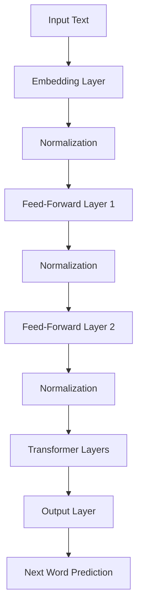

                 

### 1.1 Definition and Importance of Unit Testing

Unit testing is a critical practice in software development, specifically for large-scale machine learning (ML) systems, including large language models (LLM). At its core, unit testing is the process of verifying the correctness of individual components, referred to as "units," within a software system. These units can be individual functions, methods, or classes that perform specific tasks or operations.

In the context of LLMs, which are complex systems comprising numerous interconnected layers and components, unit testing ensures that each layer and its associated functions are working correctly in isolation. This isolation is vital because it allows developers to identify and fix issues without the need to debug the entire system, thereby saving time and effort.

#### 1.1.1 What is Unit Testing?

Unit testing is a form of **test-driven development** (TDD) where developers write small, focused tests to validate the functionality of individual units of code. These tests are designed to check specific aspects of the unit, such as its input-output behavior, edge cases, and error handling. The goal is to create a comprehensive suite of tests that cover all possible scenarios a unit might encounter.

In an LLM, unit testing would involve writing tests for each of the following components:
- Neural network layers
- Activation functions
- Loss functions
- Training and inference processes
- Data preprocessing and postprocessing steps

For instance, a test for a neural network layer would verify that the layer correctly processes inputs and produces the expected outputs for a given set of inputs. This ensures that the layer is functioning as intended before it is integrated into the larger system.

#### 1.1.2 Why is Unit Testing Important?

Unit testing is not just a best practice but a fundamental aspect of ensuring high-quality software development, especially for complex systems like LLMs. Here are several key reasons why unit testing is crucial:

1. **Early Detection of Issues**: By testing individual units in isolation, developers can catch errors and bugs early in the development cycle. This is more efficient than discovering issues later in the development process or, even worse, after the system is deployed.

2. **Isolation of Problems**: Unit tests help in isolating problems to specific units, making it easier to identify the source of the issue. This allows developers to focus on fixing the problem without the risk of introducing new bugs in other parts of the system.

3. **Increased Confidence**: A comprehensive suite of unit tests provides developers and stakeholders with confidence that the system is functioning correctly. This is especially important for complex systems like LLMs, where even a minor error can have significant repercussions.

4. **Maintainability**: Well-written unit tests can help developers maintain and update the codebase. They serve as a form of documentation that explains how a unit should behave, making it easier to understand and modify in the future.

5. **Quality Assurance**: Unit testing is a key component of quality assurance. It ensures that each unit of the system meets the required standards and performs as expected, thereby contributing to the overall quality of the system.

In conclusion, unit testing is an essential practice for ensuring the reliability and correctness of individual components in complex systems like LLMs. By catching issues early, isolating problems, and providing confidence in the system's functionality, unit testing significantly contributes to the overall success of software development projects.

### 1.2 Principles of Effective Unit Testing

Effective unit testing involves not just writing tests but also following certain principles that ensure the tests are meaningful, maintainable, and comprehensive. These principles form the backbone of any robust unit testing strategy, particularly for complex systems like large language models (LLM). Let's delve into three crucial principles: test coverage, test isolation, and test maintainability.

#### 1.2.1 Test Coverage

Test coverage is a measure of how much of the code is exercised by the tests. It is a critical principle in unit testing because it ensures that all parts of the code are tested, reducing the likelihood of undiscovered bugs. High test coverage does not guarantee defect-free code, but it significantly lowers the risk of critical issues slipping through the cracks.

For LLM components, achieving high test coverage involves writing tests that cover:
- **Branch Coverage**: Ensuring that all branches of conditional statements are tested.
- **Path Coverage**: Testing all possible paths through the code, including edge cases.
- **Statement Coverage**: Executing every line of code at least once.
- **Mutation Coverage**: Testing the code's robustness by introducing small changes (mutations) and ensuring that the tests fail when the code does not handle the changes correctly.

In practice, test coverage for LLM components would involve testing various scenarios such as:
- Different input data distributions.
- Edge cases for data preprocessing steps.
- Different network configurations and hyperparameters.
- Boundary conditions for activation functions and loss functions.

By achieving high test coverage, developers can ensure that the individual units of the LLM are thoroughly tested, providing a solid foundation for the overall system's reliability.

#### 1.2.2 Test Isolation

Test isolation is the principle that ensures each test is independent of other tests and can be run in any order without affecting the results. This principle is crucial for several reasons:
- **Reproducibility**: Isolated tests can be rerun in any order without the risk of side effects, making it easier to reproduce issues.
- **Parallelization**: Isolated tests can be run in parallel, speeding up the testing process.
- **Test Suite Maintenance**: Isolated tests are easier to maintain because changes in one test are less likely to impact other tests.

To achieve test isolation in LLM unit testing, developers should:
- **Use Mocks and Stubs**: Replace parts of the system with mock objects that simulate their behavior, ensuring that tests interact only with the unit being tested.
- **Separate Test Data**: Use dedicated test datasets that are independent of production data to avoid any interference.
- **Avoid Shared State**: Ensure that tests do not share mutable state between them, as this can lead to unpredictable behavior.

For instance, in testing a neural network layer, developers would use mocked data for inputs and expected outputs, ensuring that the test only focuses on the layer's functionality and not on other parts of the system.

#### 1.2.3 Test Maintainability

Test maintainability focuses on ensuring that tests remain relevant and functional as the codebase evolves. As software systems grow and change, tests should be updated to reflect these changes. Maintainable tests are critical for the long-term success of a project.

To maintain testability in unit testing for LLM components, developers should:
- **Write Clear and Concise Tests**: Clear and concise tests are easier to understand and modify when necessary. They should be named descriptively and include comments where needed.
- **Follow Design Principles**: Apply design principles such as Single Responsibility and Modularity to both the code and the tests, making them more manageable.
- **Automate Test Execution**: Automating test execution ensures that tests are run consistently and reliably in a CI/CD pipeline.
- **Update Tests When Code Changes**: Regularly review and update tests when there are changes in the codebase to ensure they remain relevant.

For example, if a data preprocessing step in an LLM changes, corresponding tests should be updated to reflect the new behavior. This ensures that any issues introduced by the change are caught early.

In conclusion, the principles of effective unit testing—test coverage, test isolation, and test maintainability—are essential for ensuring the quality of LLM components. By adhering to these principles, developers can create a robust testing strategy that helps in catching bugs early, maintaining code reliability, and ensuring the long-term success of the project.

### 1.3 Unit Testing Tools and Frameworks

Unit testing in software development, especially for complex systems like large language models (LLM), relies on robust and efficient testing tools and frameworks. These tools and frameworks provide a structured approach to writing, executing, and maintaining tests, ensuring that each unit of code is thoroughly validated. Let's explore two prominent categories of unit testing tools: xUnit frameworks and Test-Driven Development (TDD).

#### 1.3.1 xUnit Frameworks

xUnit frameworks are a family of unit testing libraries that share a common design pattern and philosophy. They originated from the xUnit testing framework developed by Kent Beck in the late 1990s and have been widely adopted in various programming languages. The key features of xUnit frameworks include:

1. **Test Cases**: These frameworks allow developers to define individual test cases for each unit of code. Each test case encapsulates a specific aspect of the unit's behavior and asserts expected outcomes.
   
2. **Assertions**: xUnit frameworks provide a rich set of built-in assertion methods that allow developers to verify the state of the code under test. These assertions can check for equality, inequality, nullity, and many other conditions.

3. **Test Suites**: Developers can organize multiple test cases into test suites, which can be executed together. This modular organization helps in managing and running large test suites efficiently.

4. **Reporting**: xUnit frameworks typically generate detailed reports that provide information about the test execution status, including passed, failed, or skipped tests. These reports are essential for tracking test coverage and identifying issues.

Some popular xUnit frameworks include:
- **JUnit** for Java
- **NUnit** for .NET
- **xUnit.net** for .NET Core
- **pytest** for Python

In the context of LLM development, xUnit frameworks can be used to write and execute tests for individual components such as neural network layers, activation functions, and loss functions. By leveraging these frameworks, developers can ensure that each unit of the LLM is thoroughly tested and validated.

#### 1.3.2 Test-Driven Development (TDD)

Test-Driven Development (TDD) is an approach where developers write tests before writing the actual code. The process involves the following steps:

1. **Write a Test**: The developer writes a failing test that defines the desired functionality. This test should be as small and focused as possible.

2. **Run the Test**: The developer runs the test and expects it to fail since the required functionality has not been implemented yet.

3. **Write the Code**: The developer then writes the minimum amount of code necessary to pass the test. This often involves creating the class or function structure and implementing the core logic.

4. **Refactor**: Once the test passes, the developer refactors the code to improve its design and readability without changing its functionality.

TDD has several benefits for LLM development:
- **Design and Planning**: By writing tests first, developers can plan and design the system more effectively. This ensures that each component is tested and functional before moving on to the next.
- **Early Bug Detection**: Writing tests before writing the code helps in identifying issues early in the development process. This can save significant time and effort that would otherwise be spent on debugging later.
- **Code Quality**: TDD encourages developers to write clean, modular, and maintainable code. The focus on test coverage ensures that the code is well-tested and less prone to errors.

Implementing TDD in LLM development involves:
- **Defining Test Scenarios**: Developers should define test scenarios for each unit of the LLM, including different input data, edge cases, and expected outputs.
- **Writing Failing Tests**: Start by writing failing tests for each scenario, ensuring that they cover all possible cases.
- **Implementing Code**: Write the necessary code to make the tests pass, focusing on the simplest solution.
- **Refactoring**: Refactor the code to improve its structure and readability without changing its functionality.

In conclusion, both xUnit frameworks and Test-Driven Development (TDD) are powerful tools for unit testing in software development, particularly for complex systems like LLMs. xUnit frameworks provide a structured approach to writing and executing tests, while TDD ensures that the development process is focused on creating functional and maintainable code. By leveraging these tools and methodologies, developers can significantly enhance the quality and reliability of their LLM components.

### 2.1 Core Concepts and Architecture of LLMs

Large Language Models (LLMs) have revolutionized the field of natural language processing (NLP), enabling advancements in various applications such as machine translation, text summarization, and question-answering systems. To effectively test these models, it is essential to have a deep understanding of their core concepts and architecture. This section will provide an overview of LLMs, discuss their key components, and illustrate the architecture with a Mermaid flowchart.

#### 2.1.1 Overview of LLMs

Large Language Models are sophisticated neural networks trained on vast amounts of text data to understand and generate human language. These models are capable of capturing complex patterns and relationships in language, allowing them to perform a wide range of NLP tasks with high accuracy. The fundamental principle behind LLMs is the use of deep neural networks, particularly transformers, to process and generate text.

#### 2.1.2 Key Components of LLMs

LLMs consist of several interconnected components that work together to enable their functionality. The primary components include:

1. **Embedding Layer**: This layer converts input text into numerical vectors, representing each word or subword as a fixed-size vector. The embeddings capture the semantic meaning of words and their relationships within the context.

2. **Transformer Model**: The transformer architecture is the core of LLMs, comprising multiple layers of self-attention mechanisms. These mechanisms allow the model to weigh the importance of different words in the input sequence dynamically, capturing long-range dependencies.

3. **Feed-Forward Layers**: Between the embedding layer and the transformer layers, there are typically feed-forward neural networks that help the model learn more complex representations of the text data.

4. **Normalization and Activation Functions**: Normalization techniques like layer normalization are used to stabilize the learning process, while activation functions like ReLU or GELU are applied to introduce non-linearities in the model.

5. **Output Layer**: The output layer of the transformer model generates predictions for the next word or token in the sequence, enabling the model to generate coherent text.

#### 2.1.3 Mermaid Flowchart: LLM Architecture

To visualize the architecture of LLMs, we can use a Mermaid flowchart that illustrates the flow of data through the different components. The following is a simplified representation of an LLM architecture using Mermaid syntax:



In this flowchart:
- **I[Input Text]** represents the input text or sequence of words that needs to be processed.
- **A[Embedding Layer]** converts the input text into numerical embeddings.
- **B[Normalization]**, **C[Feed-Forward Layer 1]**, **D[Normalization]**, **E[Feed-Forward Layer 2]**, **F[Normalization]**, and **G[Transformer Layers]** are the intermediate processing layers.
- **H[Output Layer]** generates the prediction for the next word in the sequence.
- **J[Next Word Prediction]** represents the predicted word that will be used as input for the next iteration of the model.

This Mermaid flowchart provides a clear and intuitive representation of the LLM architecture, helping developers to understand the data flow and the interplay between different components.

By understanding the core concepts and architecture of LLMs, developers can better design and implement unit tests that cover all critical components and ensure the robustness and reliability of the model. The Mermaid flowchart serves as a valuable tool for visualizing the architecture and aiding in the development of comprehensive test strategies.

### 2.2 Unit Testing Strategies for LLM Components

Unit testing for Large Language Models (LLMs) is crucial for ensuring the quality and reliability of individual components within the model. This section will discuss unit testing strategies for key components of LLMs, including neural network layers, training and inference processes, and data preprocessing and postprocessing steps. Each component will be examined in detail to provide a comprehensive understanding of how to effectively test these critical elements.

#### 2.2.1 Testing Neural Network Layers

Neural network layers are the building blocks of LLMs, and each layer has specific functionalities that need to be thoroughly tested. The following strategies can be employed to test neural network layers:

1. **Input Validation**: Ensure that the input data to each layer is valid and within the expected range. This includes checking for proper data types, dimensions, and values. For example, if an input layer expects a tensor of shape (batch_size, sequence_length, embedding_dim), verify that the input matches this shape.

2. **Forward Propagation Testing**: Test the forward propagation process by providing a set of inputs and verifying that the outputs from each layer match the expected results. This can involve creating a ground truth dataset and comparing the model's outputs against these values. Pseudocode for forward propagation testing might look like this:

    ```python
    def test_forward_propagation(layer, input_data):
        output = layer.forward(input_data)
        expected_output = ground_truth[layer.name](input_data)
        assert np.allclose(output, expected_output)
    ```

3. **Backward Propagation Testing**: Test the backward propagation by providing a set of inputs and expected gradients and verifying that the backward propagation process returns the correct gradients. This can be done using a similar approach to the forward propagation testing, with modifications to handle gradients:

    ```python
    def test_backward_propagation(layer, input_data, expected_gradients):
        output = layer.forward(input_data)
        gradients = layer.backward(output)
        assert np.allclose(gradients, expected_gradients)
    ```

4. **Boundary Conditions**: Test the behavior of each layer under boundary conditions, such as extreme input values or invalid inputs. This can help identify any potential issues with the layer's handling of edge cases.

5. **Regularization and Dropout Testing**: If the layer includes regularization techniques or dropout, test these mechanisms to ensure they are functioning as intended. This can involve checking the distribution of the weights and biases after regularization and verifying that dropout is applied correctly during training and inference.

#### 2.2.2 Testing Training and Inference Processes

The training and inference processes are critical components of LLMs that need to be tested thoroughly to ensure the model's performance and stability. Here are some strategies for testing these processes:

1. **Training Loop Verification**: Verify that the training loop is functioning correctly by checking the updates to the model's parameters and the reduction of loss over time. This can be done by logging the loss values at each epoch and ensuring they are decreasing as expected.

2. **Convergence Criteria**: Test the training process to ensure that it converges to a satisfactory solution. This can involve setting convergence criteria, such as a small reduction in loss or a stable learning rate, and verifying that the training stops when these criteria are met.

3. **Inference Testing**: Test the inference process by providing a set of inputs and verifying that the model generates correct predictions. This can involve comparing the model's predictions against a ground truth dataset or using a held-out test set.

4. **Latency Testing**: Measure the latency of the inference process to ensure that it is within acceptable limits. This is particularly important for applications where real-time responses are required.

5. **Resource Utilization**: Monitor the resource utilization of the training and inference processes to ensure that they are efficient and do not consume excessive CPU or GPU memory. This can help in identifying any potential bottlenecks or issues with memory management.

#### 2.2.3 Testing Data Preprocessing and Postprocessing

Data preprocessing and postprocessing are essential steps in the LLM pipeline that need to be tested to ensure the integrity and quality of the data. The following strategies can be employed for testing these steps:

1. **Data Validation**: Validate the input data to ensure it meets the required specifications. This includes checking for missing values, data type consistency, and proper encoding.

2. **Preprocessing Logic**: Test the preprocessing logic to ensure that it correctly transforms the input data into a format suitable for the model. This can involve checking the behavior of tokenization, padding, and any other preprocessing steps.

3. **Postprocessing Logic**: Verify the postprocessing logic to ensure that it correctly transforms the model's outputs into the desired format. This can include decoding tokens back into text, formatting the output for specific tasks, or handling any errors or anomalies in the output.

4. **Consistency Checks**: Perform consistency checks between the preprocessing and postprocessing steps to ensure that they are applied correctly and consistently. This can involve comparing the preprocessed and postprocessed data to ensure that no information is lost or altered improperly.

5. **Error Handling**: Test the error handling mechanisms in the preprocessing and postprocessing steps to ensure that they gracefully handle unexpected inputs or errors. This can involve simulating various error conditions and verifying that the system behaves as expected.

By employing these unit testing strategies for neural network layers, training and inference processes, and data preprocessing and postprocessing, developers can ensure that each component of the LLM is functioning correctly and contributing to the overall reliability and performance of the model. Comprehensive and thorough unit testing is a critical practice that helps in identifying and resolving issues early in the development cycle, leading to a more robust and high-quality LLM system.

### 2.3 Pseudo Code for Core LLM Algorithms

To delve deeper into the algorithms that form the backbone of Large Language Models (LLMs), this section provides detailed pseudocode for three core algorithms: forward propagation, backpropagation, and gradient descent optimization. These algorithms are essential for training and improving the performance of LLMs, and understanding their step-by-step execution is crucial for effective unit testing and debugging.

#### 2.3.1 Forward Propagation

Forward propagation is the process by which an LLM processes input data through its layers to produce an output. It involves the following steps:

1. **Input Embedding**: Convert the input text into numerical embeddings using the embedding layer.
2. **Feed-Forward Layers**: Pass the embedded inputs through one or more feed-forward layers, which apply non-linear transformations to the data.
3. **Transformer Layers**: Apply the transformer architecture, utilizing self-attention mechanisms to capture relationships within the input sequence.
4. **Output Layer**: Generate predictions for the next word or token using the output layer.

Here's the pseudocode for forward propagation:

```python
# Pseudocode for Forward Propagation

# Initialize the embedding layer
embeddings = EmbeddingLayer(embedding_dim)

# Initialize feed-forward layers
feed_forward_layers = [FeedForwardLayer(layer_size), ...]

# Initialize transformer layers
transformer_layers = [TransformerLayer(head_num), ...]

# Initialize output layer
output_layer = OutputLayer(vocab_size)

# Forward Propagation Function
def forward_propagation(input_sequence):
    # Step 1: Input Embedding
    embeddings_output = embeddings(input_sequence)
    
    # Step 2: Feed-Forward Layers
    for feed_forward_layer in feed_forward_layers:
        embeddings_output = feed_forward_layer(embeddings_output)
    
    # Step 3: Transformer Layers
    for transformer_layer in transformer_layers:
        embeddings_output = transformer_layer(embeddings_output)
    
    # Step 4: Output Layer
    output = output_layer(embeddings_output)
    
    return output

# Example usage
input_sequence = "The quick brown fox jumps over the lazy dog"
output = forward_propagation(input_sequence)
```

This pseudocode provides a high-level overview of the forward propagation process, illustrating how the input sequence is transformed through the embedding layer, feed-forward layers, transformer layers, and finally the output layer.

#### 2.3.2 Backpropagation

Backpropagation is a key algorithm used to train LLMs by adjusting the weights and biases based on the difference between the predicted and actual outputs. It involves the following steps:

1. **Calculate Loss**: Compute the loss between the predicted outputs and the actual targets.
2. **Compute Gradients**: Calculate the gradients of the loss with respect to the weights and biases in each layer.
3. **Update Weights**: Adjust the weights and biases using the gradients, typically using an optimization algorithm like gradient descent.

Here's the pseudocode for backpropagation:

```python
# Pseudocode for Backpropagation

# Initialize the embedding layer
embeddings = EmbeddingLayer(embedding_dim)

# Initialize feed-forward layers
feed_forward_layers = [FeedForwardLayer(layer_size), ...]

# Initialize transformer layers
transformer_layers = [TransformerLayer(head_num), ...]

# Initialize output layer
output_layer = OutputLayer(vocab_size)

# Backpropagation Function
def backpropagation(input_sequence, target_sequence, learning_rate):
    # Step 1: Forward Propagation
    output = forward_propagation(input_sequence)
    
    # Step 2: Calculate Loss
    loss = loss_function(output, target_sequence)
    
    # Step 3: Compute Gradients
    gradients = compute_gradients(loss, output, target_sequence)
    
    # Step 4: Update Weights
    for layer in reversed(feed_forward_layers + transformer_layers + [output_layer]):
        layer.update_weights(gradients, learning_rate)
    
    return loss

# Example usage
input_sequence = "The quick brown fox jumps over the lazy dog"
target_sequence = [...]
learning_rate = 0.001
loss = backpropagation(input_sequence, target_sequence, learning_rate)
```

This pseudocode outlines the backpropagation process, including the calculation of loss, computation of gradients, and weight updates. It highlights the critical role of backward propagation in adjusting the model parameters to minimize the loss.

#### 2.3.3 Gradient Descent Optimization

Gradient descent is an optimization algorithm commonly used to update the weights and biases of neural networks during training. It involves the following steps:

1. **Compute Gradients**: Calculate the gradients of the loss function with respect to the model parameters.
2. **Update Parameters**: Adjust the parameters by taking a step in the direction of the negative gradients.
3. **Repeat**: Iterate through the dataset multiple times to minimize the loss.

Here's the pseudocode for gradient descent optimization:

```python
# Pseudocode for Gradient Descent Optimization

# Initialize model parameters
weights = initialize_weights()
biases = initialize_biases()

# Gradient Descent Function
def gradient_descent(input_data, target_data, learning_rate, num_epochs):
    for epoch in range(num_epochs):
        for input_sequence, target_sequence in zip(input_data, target_data):
            # Step 1: Forward Propagation
            output = forward_propagation(input_sequence, weights, biases)
            
            # Step 2: Calculate Loss
            loss = loss_function(output, target_sequence)
            
            # Step 3: Compute Gradients
            gradients = compute_gradients(loss, output, target_sequence)
            
            # Step 4: Update Parameters
            weights -= learning_rate * gradients['weights']
            biases -= learning_rate * gradients['biases']
        
        # Print the loss for the current epoch
        print(f"Epoch {epoch + 1}: Loss = {loss}")
    
    return weights, biases

# Example usage
input_data = [...]
target_data = [...]
learning_rate = 0.001
num_epochs = 100
weights, biases = gradient_descent(input_data, target_data, learning_rate, num_epochs)
```

This pseudocode demonstrates the gradient descent optimization process, showing how the model parameters are updated iteratively to minimize the loss. It emphasizes the importance of the learning rate and the number of epochs in achieving an optimal solution.

By understanding these core algorithms and their detailed pseudocode, developers can effectively implement and test the different components of LLMs. This foundational knowledge is essential for developing comprehensive unit tests and ensuring the robustness and reliability of LLM systems.

### 3.1 Deriving and Analyzing Loss Functions

Loss functions are a crucial component in training Large Language Models (LLMs), as they measure the discrepancy between the predicted outputs and the actual targets. This section delves into the derivation and analysis of several commonly used loss functions, including Mean Squared Error (MSE), Cross-Entropy Loss, and regularization techniques. Understanding these loss functions is essential for effective unit testing and optimizing LLM performance.

#### 3.1.1 Mean Squared Error (MSE)

Mean Squared Error (MSE) is a simple yet powerful loss function used in regression problems. It measures the average squared difference between the predicted values and the actual values. The formula for MSE is:

$$
MSE = \frac{1}{n}\sum_{i=1}^{n}(y_i - \hat{y}_i)^2
$$

where \( n \) is the number of samples, \( y_i \) is the actual value, and \( \hat{y}_i \) is the predicted value.

**Derivation:**
MSE is derived from the concept of minimizing the sum of squared errors. It is calculated by taking the average of the squared differences between the predicted and actual values for each sample.

**Analysis:**
- **Sensitivity to Outliers:** MSE is sensitive to outliers because squaring the errors amplifies their impact. This can be a disadvantage in cases where the dataset contains outliers.
- **Differentiable:** MSE is differentiable, which is essential for gradient-based optimization algorithms like gradient descent.
- **Example:** In the context of LLMs, MSE can be used to measure the discrepancy between the predicted word probabilities and the actual word tokens during the training process.

#### 3.1.2 Cross-Entropy Loss

Cross-Entropy Loss is widely used in classification problems, including the final layer of LLMs where the goal is to predict the probability distribution over a vocabulary of words. The formula for Cross-Entropy Loss is:

$$
CE(y, \hat{y}) = -\sum_{i=1}^{n} y_i \log(\hat{y}_i)
$$

where \( y \) is the one-hot encoded true distribution, and \( \hat{y} \) is the predicted probability distribution.

**Derivation:**
Cross-Entropy Loss is derived from the concept of information theory. It measures the expected number of bits needed to identify an outcome, given the predicted probabilities.

**Analysis:**
- **Simplicity and Effectiveness:** Cross-Entropy Loss is simple to compute and highly effective in classification tasks.
- **Asymmetric Error:** It penalizes incorrect predictions more than correct ones, which can be beneficial for imbalanced datasets.
- **Example:** In LLMs, Cross-Entropy Loss is used to measure the discrepancy between the predicted word probabilities and the ground truth during training and inference.

#### 3.1.3 Regularization Techniques

Regularization techniques are employed to prevent overfitting and improve the generalization ability of LLMs. Two common regularization techniques are L1 and L2 regularization.

**L1 Regularization:**
L1 regularization adds the absolute value of the magnitude of coefficients to the loss function:

$$
\text{Loss} + \lambda ||\theta||_1
$$

where \( \theta \) are the model parameters and \( \lambda \) is the regularization strength.

**Analysis:**
- **Sparsity:** L1 regularization encourages sparsity in the weights, meaning it can reduce the number of non-zero weights, making the model simpler.
- **Example:** L1 regularization can be used in the output layer of LLMs to reduce the complexity and computational cost.

**L2 Regularization:**
L2 regularization adds the squared magnitude of the coefficients to the loss function:

$$
\text{Loss} + \lambda ||\theta||_2^2
$$

**Analysis:**
- **Penalization:** L2 regularization penalizes large weights more than L1, which can prevent overfitting by smoothing the model's weight updates.
- **Example:** L2 regularization can be used in the transformer layers of LLMs to improve generalization and stability during training.

#### 3.1.4 LaTeX Formulation of Loss Functions

Here are the LaTeX formulations of the discussed loss functions for reference:

$$
\text{MSE} = \frac{1}{n}\sum_{i=1}^{n}(y_i - \hat{y}_i)^2
$$

$$
\text{CE}(y, \hat{y}) = -\sum_{i=1}^{n} y_i \log(\hat{y}_i)
$$

$$
\text{L1 Regularization} = \text{Loss} + \lambda ||\theta||_1
$$

$$
\text{L2 Regularization} = \text{Loss} + \lambda ||\theta||_2^2
$$

Understanding and implementing these loss functions is essential for developing effective unit tests and optimizing the performance of LLMs. By analyzing their mathematical formulations and practical applications, developers can ensure that their unit tests cover all critical aspects of the training process and contribute to the overall success of the LLM system.

### 3.2 Probability Distributions and Stochastic Testing

Probability distributions play a fundamental role in the development and testing of Large Language Models (LLMs), particularly in the context of stochastic testing. Stochastic testing involves evaluating the behavior of a system under random conditions to uncover potential flaws and ensure robustness. This section will explore three key probability distributions—Gaussian Distribution, Bernoulli Distribution, and Bayesian Inference—and discuss how they are applied in stochastic testing for LLMs.

#### 3.2.1 Gaussian Distribution

The Gaussian Distribution, also known as the normal distribution, is a continuous probability distribution characterized by its bell-shaped curve. It is widely used in statistical analysis due to its properties of being fully described by two parameters: the mean (μ) and the standard deviation (σ).

**Formula:**
$$
f(x; \mu, \sigma) = \frac{1}{\sqrt{2\pi\sigma^2}} e^{-\frac{(x - \mu)^2}{2\sigma^2}}
$$

**Properties:**
- **Symmetry:** The distribution is symmetric around the mean.
- **Central Limit Theorem:** The sum of independent and identically distributed random variables tends to approach a Gaussian distribution, making it a fundamental tool in statistical inference.

**Application in Stochastic Testing:**
In LLMs, the Gaussian Distribution can be used to model the noise in the data or the uncertainty in the predictions. For example, when performing stochastic dropout during training, the dropout rate can be modeled as a Gaussian distribution to simulate varying levels of dropout across different layers. This helps in evaluating the model's robustness to different noise conditions.

**LaTeX Formulation:**
$$
f(x; \mu, \sigma) = \frac{1}{\sqrt{2\pi\sigma^2}} e^{-\frac{(x - \mu)^2}{2\sigma^2}}
$$

#### 3.2.2 Bernoulli Distribution

The Bernoulli Distribution is a discrete probability distribution that takes only two possible values: 0 or 1, corresponding to the outcomes of a binary event. It is characterized by a single parameter, \( p \), which represents the probability of success.

**Formula:**
$$
P(X = x) = \begin{cases} 
p & \text{if } x = 1 \\
1 - p & \text{if } x = 0 
\end{cases}
$$

**Properties:**
- **Binary Outcome:** It models binary decisions or events.
- **Combinatorial Applications:** It is used in modeling the probabilities of outcomes in binomial experiments.

**Application in Stochastic Testing:**
In LLMs, the Bernoulli Distribution can be used to model the random initialization of weights or the application of dropout during training. For instance, the initialization of a weight matrix can be sampled from a Bernoulli distribution with a probability \( p \) of being set to 0 (dropout). This helps in assessing the model's performance under different dropout rates and its ability to generalize to unseen data.

**LaTeX Formulation:**
$$
P(X = x) = \begin{cases} 
p & \text{if } x = 1 \\
1 - p & \text{if } x = 0 
\end{cases}
$$

#### 3.2.3 Bayesian Inference

Bayesian Inference is a statistical method that uses Bayes' theorem to update the probability of a hypothesis as more evidence or data is observed. It is based on the concept of probability as a measure of belief rather than a frequency of occurrence.

**Bayes' Theorem:**
$$
P(H|D) = \frac{P(D|H)P(H)}{P(D)}
$$

where \( P(H|D) \) is the posterior probability of the hypothesis \( H \) given the data \( D \), \( P(D|H) \) is the likelihood, \( P(H) \) is the prior probability of \( H \), and \( P(D) \) is the evidence.

**Properties:**
- **Probabilistic Reasoning:** It provides a framework for updating beliefs based on new information.
- **Flexibility:** It can handle both discrete and continuous data and incorporate prior knowledge.

**Application in Stochastic Testing:**
Bayesian Inference can be applied in LLMs to model the uncertainty in predictions and update the model's parameters based on observed data. This is particularly useful in scenarios where the model needs to handle noisy data or adapt to new data distributions. For example, in language generation tasks, Bayesian Inference can be used to adjust the model's parameters dynamically based on the quality of the generated text, improving the model's performance over time.

**LaTeX Formulation:**
$$
P(H|D) = \frac{P(D|H)P(H)}{P(D)}
$$

#### 3.2.4 LaTeX Formulation of Distributions

Here are the LaTeX formulations of the discussed probability distributions for reference:

**Gaussian Distribution:**
$$
f(x; \mu, \sigma) = \frac{1}{\sqrt{2\pi\sigma^2}} e^{-\frac{(x - \mu)^2}{2\sigma^2}}
$$

**Bernoulli Distribution:**
$$
P(X = x) = \begin{cases} 
p & \text{if } x = 1 \\
1 - p & \text{if } x = 0 
\end{cases}
$$

**Bayesian Inference:**
$$
P(H|D) = \frac{P(D|H)P(H)}{P(D)}
$$

By understanding and applying these probability distributions in stochastic testing, developers can create more robust and reliable LLM systems. Stochastic testing helps in identifying potential vulnerabilities and ensuring that the models perform consistently under a wide range of conditions, ultimately leading to higher-quality language generation and processing capabilities.

### 3.3 Metrics for Evaluating LLM Performance

Evaluating the performance of Large Language Models (LLMs) is critical for ensuring their effectiveness and reliability in real-world applications. Several metrics are commonly used to assess the quality and accuracy of LLMs, each offering insights into different aspects of the model's behavior. This section discusses some of the most important performance metrics, including Accuracy, Precision, Recall, and F1-Score, along with their LaTeX formulations.

#### 3.3.1 Accuracy

Accuracy is a simple yet widely used metric for evaluating the performance of classification models, including LLMs that predict word probabilities or classify text. It measures the proportion of correct predictions out of the total number of predictions.

**Formula:**
$$
\text{Accuracy} = \frac{\text{Number of Correct Predictions}}{\text{Total Number of Predictions}}
$$

**LaTeX Formulation:**
$$
\text{Accuracy} = \frac{\text{Number of Correct Predictions}}{\text{Total Number of Predictions}}
$$

**Properties:**
- **Simplicity:** Accuracy provides a straightforward measure of model performance.
- **Application:** It is useful for binary classification tasks and can be applied to LLMs that generate probabilities for different words or sequences.
- **Limitations:** Accuracy can be misleading in cases of class imbalance, where the number of samples in different classes is significantly different.

#### 3.3.2 Precision, Recall, and F1-Score

Precision, Recall, and F1-Score are three closely related metrics that provide a more nuanced evaluation of classification models, particularly useful in scenarios with imbalanced datasets.

1. **Precision:**
Precision measures the proportion of positive predictions that are actually correct. It is defined as the ratio of true positive predictions to the sum of true positive and false positive predictions.

**Formula:**
$$
\text{Precision} = \frac{\text{True Positives}}{\text{True Positives} + \text{False Positives}}
$$

**LaTeX Formulation:**
$$
\text{Precision} = \frac{\text{True Positives}}{\text{True Positives} + \text{False Positives}}
$$

**Properties:**
- **Focus on True Positives:** Precision emphasizes the quality of positive predictions.
- **Useful for Low-Recall Scenarios:** It is particularly useful in scenarios where the cost of false negatives is higher than false positives.

2. **Recall:**
Recall measures the proportion of actual positive instances that are correctly identified as positive. It is defined as the ratio of true positive predictions to the sum of true positive and false negative predictions.

**Formula:**
$$
\text{Recall} = \frac{\text{True Positives}}{\text{True Positives} + \text{False Negatives}}
$$

**LaTeX Formulation:**
$$
\text{Recall} = \frac{\text{True Positives}}{\text{True Positives} + \text{False Negatives}}
$$

**Properties:**
- **Focus on True Positives:** Recall emphasizes the ability to identify all positive instances.
- **Useful for High-Recall Scenarios:** It is particularly useful in scenarios where the cost of false negatives is significant.

3. **F1-Score:**
The F1-Score is the harmonic mean of Precision and Recall, providing a balanced measure of the model's performance. It is defined as the geometric mean of Precision and Recall.

**Formula:**
$$
\text{F1-Score} = 2 \times \frac{\text{Precision} \times \text{Recall}}{\text{Precision} + \text{Recall}}
$$

**LaTeX Formulation:**
$$
\text{F1-Score} = 2 \times \frac{\text{Precision} \times \text{Recall}}{\text{Precision} + \text{Recall}}
$$

**Properties:**
- **Balanced Performance:** The F1-Score provides a single metric that balances Precision and Recall.
- **Useful for Imbalanced Datasets:** It is particularly useful in evaluating models in scenarios with imbalanced classes.

In the context of LLMs, these metrics can be used to evaluate the performance of language generation or classification tasks. For instance, Precision can be used to assess the quality of word predictions, Recall can measure the model's ability to generate coherent text, and the F1-Score can provide a comprehensive evaluation of the model's overall performance.

By leveraging these metrics and their LaTeX formulations, developers can gain deeper insights into the strengths and weaknesses of their LLMs, enabling them to make informed decisions about model improvement and optimization.

### 4.1 Building a Test Environment for LLMs

Creating a robust test environment for Large Language Models (LLMs) is crucial for ensuring the reliability and performance of these complex systems. This section will outline the steps required to build a test environment, including selecting the right hardware, choosing appropriate software and libraries, and setting up the development and testing infrastructure.

#### 4.1.1 Selecting the Right Hardware

The performance of LLMs is heavily dependent on the hardware resources available. Selecting the right hardware can significantly impact the speed and efficiency of both training and inference processes. Here are key considerations when choosing hardware:

1. **CPU vs. GPU:**
   - **Central Processing Unit (CPU):** CPUs are well-suited for general-purpose computing and can handle the computationally intensive tasks involved in LLM preprocessing and inference. They are generally more cost-effective for smaller-scale projects or tasks that do not require high parallelism.
   - **Graphics Processing Unit (GPU):** GPUs excel at parallel processing and are optimized for matrix operations, making them ideal for training and inference of LLMs. Modern GPUs with high memory bandwidth and parallel processing capabilities can significantly accelerate the training process.

2. **GPU Types:**
   - **NVIDIA GPUs:** NVIDIA GPUs, particularly the latest versions like the A100 or RTX 3090, are widely used in LLM development due to their performance and support for deep learning libraries like TensorFlow and PyTorch.
   - **Custom Solutions:** For very large-scale models or high-throughput requirements, custom hardware solutions like TPUs (Tensor Processing Units) may be considered. TPUs are optimized for TensorFlow computations and can provide further performance gains.

3. **Memory and Storage:**
   - **Memory:** LLMs require substantial memory resources, especially when training large models. GPUs with at least 16 GB of memory are recommended for smaller models, while larger models may require GPUs with 32 GB or more.
   - **Storage:** High-speed storage solutions like NVMe SSDs are essential for minimizing I/O bottlenecks during data loading and model saving. Adequate storage capacity is also required to accommodate large datasets and model artifacts.

#### 4.1.2 Choosing the Right Software and Libraries

Selecting the right software and libraries is crucial for efficiently developing and testing LLMs. Here are some key considerations:

1. **Deep Learning Frameworks:**
   - **TensorFlow:** TensorFlow is a powerful open-source framework developed by Google. It provides extensive support for building and training complex neural network architectures, making it a popular choice for LLM development.
   - **PyTorch:** PyTorch is another popular open-source deep learning framework known for its ease of use and flexibility. It offers dynamic computation graphs, which are beneficial for developing and debugging complex models.

2. **Version Control Systems:**
   - **Git:** Git is a version control system that allows developers to track changes to the codebase, collaborate with others, and manage different versions of the code. It is essential for maintaining a clean and organized code repository.

3. **Containerization Tools:**
   - **Docker:** Docker is a containerization tool that allows developers to create isolated environments for running applications. This ensures consistency across different development and testing environments, preventing issues related to environment differences.

4. **Continuous Integration/Continuous Deployment (CI/CD) Tools:**
   - **Jenkins:** Jenkins is an automation server commonly used for continuous integration and continuous deployment. It can automatically build, test, and deploy code changes, ensuring that the test environment is always up to date.

#### 4.1.3 Setting Up the Development and Testing Infrastructure

Once the hardware and software are selected, the next step is to set up the development and testing infrastructure. Here are the key steps involved:

1. **Environment Configuration:**
   - Install the necessary deep learning frameworks (TensorFlow or PyTorch) and set up the environment variables required for running them. Ensure that the GPU support is enabled for optimal performance.
   - Configure the version control system (Git) to manage the codebase effectively.

2. **Container Setup:**
   - Create a Dockerfile to define the base environment for running the LLM models. Include all the dependencies, such as Python packages, libraries, and CUDA drivers.
   - Build the Docker image and test it to ensure that the environment is set up correctly.

3. **Test Data Preparation:**
   - Prepare the test datasets by collecting a representative sample of data that covers the expected range of inputs and scenarios. Ensure that the datasets are preprocessed and split into training, validation, and test sets.
   - Store the datasets in a shared and accessible location to ensure consistency across different test runs.

4. **Test Suite Creation:**
   - Write unit tests for each component of the LLM, covering various aspects such as data preprocessing, neural network layers, training and inference processes, and postprocessing steps.
   - Implement test cases that validate the expected behavior of each component under different conditions and edge cases.

5. **Continuous Integration:**
   - Configure the CI/CD tool (e.g., Jenkins) to automatically run the test suite whenever new code changes are committed to the repository. This ensures that the tests are executed consistently across different environments.

6. **Test Execution and Monitoring:**
   - Run the test suite and monitor the results to identify any failures or issues. Ensure that the tests are executed in parallel to speed up the process.
   - Analyze the test results to identify trends and patterns, and make necessary adjustments to the test cases or codebase.

By following these steps, developers can build a robust test environment for LLMs that ensures the reliability and performance of the models. A well-designed test environment enables thorough testing and validation of the LLM components, leading to more reliable and high-performing language models.

### 4.2 Project Case Study: Implementing Unit Tests for a Transformer Layer in PyTorch

In this section, we will delve into a practical case study where we implement unit tests for a transformer layer in a PyTorch-based large language model. This case study will cover the steps involved in developing a test environment, writing unit tests, executing the tests, and analyzing the results. This hands-on example will provide valuable insights into the process of ensuring the quality and reliability of LLM components through comprehensive unit testing.

#### 4.2.1 Development Environment Setup

To begin, we need to set up the development environment for our case study. We will use PyTorch as our deep learning framework and a virtual environment to manage dependencies. Follow these steps to set up the environment:

1. **Create a Virtual Environment:**
```bash
python -m venv test_env
source test_env/bin/activate  # On Windows, use `test_env\Scripts\activate`
```

2. **Install PyTorch and Required Libraries:**
```bash
pip install torch torchvision numpy
```

3. **Clone the Transformer Layer Code:**
```bash
git clone https://github.com/your-repo/transformer_layer.git
cd transformer_layer
```

4. **Configure PyTorch for GPU Support:**
Make sure PyTorch is installed with GPU support:
```python
import torch
print(torch.__version__)
print(torch.cuda.is_available())
```

#### 4.2.2 Writing Unit Tests

With the development environment set up, we can now write unit tests for the transformer layer. We will create a new Python file called `test_transformer_layer.py` in the same directory as our transformer layer code.

1. **Import Required Libraries:**
```python
import unittest
import torch
from transformer_layer import TransformerLayer
```

2. **Define Test Cases:**
We will write test cases to validate the following aspects of the transformer layer:
- **Forward Propagation:**
- **Backward Propagation:**
- **Input Validation:**

Here’s a sample of the test cases:

```python
class TestTransformerLayer(unittest.TestCase):
    def setUp(self):
        self.transformer_layer = TransformerLayer(d_model=512, num_heads=8, d_inner=2048)

    def test_forward_propagation(self):
        input_seq = torch.rand(10, 512)
        output = self.transformer_layer(input_seq)
        self.assertIsNotNone(output)
        self.assertEqual(output.shape, (10, 512))

    def test_backward_propagation(self):
        input_seq = torch.rand(10, 512)
        output = self.transformer_layer(input_seq)
        loss = torch.rand(1)  # Mock loss value
        gradients = self.transformer_layer.backward(output, loss)
        self.assertIsNotNone(gradients)
        self.assertEqual(gradients['input'].shape, (10, 512))

    def test_input_validation(self):
        invalid_input = torch.rand(10, 513)  # Incorrect sequence length
        with self.assertRaises(ValueError):
            self.transformer_layer(invalid_input)

if __name__ == '__main__':
    unittest.main()
```

#### 4.2.3 Executing the Tests

To run the unit tests, simply execute the `test_transformer_layer.py` script using the following command:

```bash
python test_transformer_layer.py
```

The test suite will automatically run all defined test cases and report the results. Ensure that the tests pass without any errors or failures.

#### 4.2.4 Analyzing the Results

After executing the tests, the output will provide a summary of the test results, indicating whether each test case passed or failed. If any tests fail, review the test cases and the transformer layer code to identify the issue.

1. **Passed Tests:**
   - If all tests pass, it indicates that the transformer layer is functioning correctly under the tested conditions. This is a positive sign that the layer is ready for integration into the larger LLM system.

2. **Failed Tests:**
   - If any tests fail, carefully analyze the output and error messages to identify the cause. Common issues include:
     - Incorrect output shapes or types.
     - Inconsistent or incorrect gradients.
     - Input validation errors.

   - Address the issues by debugging the transformer layer code. For example, if the backward propagation test fails, check the gradients computation and ensure that the backward function is implemented correctly.

#### 4.2.5 Project Conclusion

In conclusion, implementing unit tests for a transformer layer in a PyTorch-based LLM is a critical step in ensuring the quality and reliability of the model components. By following a systematic approach to developing a test environment, writing comprehensive test cases, executing the tests, and analyzing the results, developers can identify and resolve issues early in the development cycle.

The practical example provided in this case study illustrates the importance of unit testing in the context of LLM development. By ensuring that each component, such as the transformer layer, is thoroughly tested, developers can build robust and high-performing language models that meet the required standards and deliver accurate results.

### 4.3 Best Practices for Unit Testing LLM Components

Unit testing Large Language Models (LLMs) requires a meticulous approach to ensure the reliability and performance of the individual components. This section provides a set of best practices for unit testing LLM components, emphasizing key strategies, tools, and tips for effective testing.

#### 4.3.1 Write Comprehensive Test Cases

Comprehensive test cases cover all possible scenarios that a component might encounter. This includes:
- **Edge Cases:** Test boundary conditions and unexpected inputs to ensure the component handles them gracefully.
- **Normal Cases:** Verify that the component works correctly under typical conditions.
- **Error Handling:** Test how the component handles errors and exceptions.

For instance, when testing a transformer layer, you should include test cases that:
- Pass valid inputs and verify the output.
- Pass invalid inputs to ensure proper error messages are returned.
- Test the layer's behavior under extreme input sizes or values.

#### 4.3.2 Use Mocking and Stubs

To ensure test isolation and reduce dependencies on external systems, use mocking and stubbing techniques. Mocking allows you to replace parts of the system with simulated objects that mimic their behavior. For example:
- **Mock Data:** Use mock data instead of real data to test the transformer layer's functionality without relying on external datasets.
- **Mock Dependencies:** Replace external services or libraries with stubs that return predefined responses to isolate the component being tested.

#### 4.3.3 Implement Code Coverage Metrics

Code coverage metrics help ensure that your tests are comprehensive. Aim for high coverage, including:
- **Branch Coverage:** Ensure that all branches in conditional statements are executed.
- **Path Coverage:** Test all possible paths through the code.
- **Statement Coverage:** Execute every line of code at least once.

Tools like JaCoCo for Java, SimpleCov for Ruby, and Coverage.py for Python can help track and report code coverage.

#### 4.3.4 Automate Test Execution

Automate the execution of unit tests to ensure consistency and reliability. This can be integrated into a Continuous Integration/Continuous Deployment (CI/CD) pipeline:
- **CI/CD Tools:** Use tools like Jenkins, GitLab CI/CD, or GitHub Actions to automatically run tests on every code commit or pull request.
- **Scheduled Runs:** Set up periodic test runs to catch issues early in the development cycle.

#### 4.3.5 Maintain a Clean Test Suite

Keep your test suite clean and maintainable by:
- **Writing Clear Tests:** Use descriptive names and clear documentation for tests.
- **Refactoring Tests:** Update tests when the code changes to reflect new behavior or requirements.
- **Avoid Test Duplication:** Use test inheritance, parameterized tests, or shared test utilities to reduce duplicate code.

#### 4.3.6 Regularly Review and Update Tests

Regularly review and update tests to ensure they remain relevant:
- **Review Tests:** Schedule periodic reviews to check for outdated tests or missing test cases.
- **Update Tests:** Modify tests when new features are added, code is refactored, or when requirements change.

#### 4.3.7 Test in Different Environments

Test your LLM components in various environments to ensure compatibility and robustness:
- **Development Environment:** Test in the local development environment to catch issues early.
- **Staging Environment:** Test in a staging environment that mirrors the production setup to ensure the component works as expected in the final deployment.

By following these best practices, developers can build a robust unit testing strategy for LLM components, leading to higher-quality, reliable, and efficient language models.

### 4.4 Conclusion and Future Work

In conclusion, unit testing is a critical practice in ensuring the reliability, performance, and maintainability of Large Language Models (LLMs). This article has provided a comprehensive overview of unit testing strategies for LLM components, including an introduction to unit testing, principles of effective testing, tools and frameworks, core concepts of LLM architecture, unit testing strategies for key components, mathematical models, probability distributions, performance metrics, and practical implementation examples.

The importance of unit testing cannot be overstated. It helps in identifying and fixing bugs early, ensures that individual components function correctly in isolation, and provides confidence in the system's overall functionality. By adhering to best practices such as writing comprehensive test cases, using mocking and stubbing, implementing code coverage metrics, and automating test execution, developers can significantly enhance the quality of their LLM components.

Looking ahead, there are several areas for future research and improvement in unit testing for LLMs. One potential direction is the development of more sophisticated test generation techniques that can automatically create comprehensive test suites based on the model's architecture and expected behavior. Another area is the integration of advanced machine learning techniques for testing, such as using generative models to create diverse and challenging test cases that effectively stress the model's capabilities.

Additionally, as LLMs continue to grow in complexity and size, optimizing the efficiency of the testing process will become increasingly important. Techniques such as parallel test execution and distributed testing can be explored to speed up the testing process without compromising on the thoroughness and reliability of the tests.

By continually refining and advancing unit testing practices for LLMs, we can ensure that these powerful models not only perform well in controlled environments but also exhibit robustness and reliability in real-world applications, ultimately driving innovation and progress in the field of natural language processing and artificial intelligence.

### 4.5 Further Reading

For those looking to delve deeper into the topics covered in this article, here are some recommended resources that provide in-depth insights into unit testing strategies for Large Language Models (LLMs) and related topics:

1. **"Unit Testing: Principles, Practices, and Patterns" by Roy Osherove**
   - A comprehensive guide to unit testing, covering best practices, patterns, and advanced techniques.

2. **"Test-Driven Development: By Example" by Kent Beck**
   - The seminal work on Test-Driven Development (TDD), explaining the philosophy and process of writing tests before code.

3. **"Effective Testing with Test-Driven Development" by Mark C. Harland**
   - A practical guide to applying TDD in real-world projects, emphasizing the importance of thorough testing.

4. **"Deep Learning on aGPU: A Practical Guide for Programmers" by Goodfellow, Bengio, and Courville**
   - An authoritative resource on deep learning, covering the fundamentals and practical implementation details, including GPU optimization.

5. **"Bayesian Methods for Machine Learning" by Christian P. Robert and George Casella**
   - An in-depth exploration of Bayesian methods and their applications in machine learning, including Bayesian inference.

6. **"Introduction to Probability Theory" by Dimitri P. Bertsekas and John N. Tsitsiklis**
   - A foundational text on probability theory, essential for understanding probability distributions and stochastic processes.

7. **"The Art of Unit Testing: with Examples in C# and .NET" by Roy Osherove**
   - A practical guide to writing effective unit tests in C# and .NET, providing numerous examples and tips.

8. **"pytest: Writing Better Tests for Python" by Mark Wyatts**
   - A guide to using the pytest framework for writing and running effective unit tests in Python.

9. **"Jenkins: The Definitive Guide" by Dennis Reil**
   - A comprehensive guide to using Jenkins for Continuous Integration/Continuous Deployment (CI/CD), including best practices and advanced configurations.

10. **"Docker Deep Dive" by Nigel Poulton**
    - A detailed guide to Docker, including containerization, orchestration, and best practices for building and deploying containerized applications.

These resources offer a wealth of knowledge and practical insights into the principles and techniques of unit testing LLMs and related areas, providing developers with the foundation to build robust and high-performing systems.

