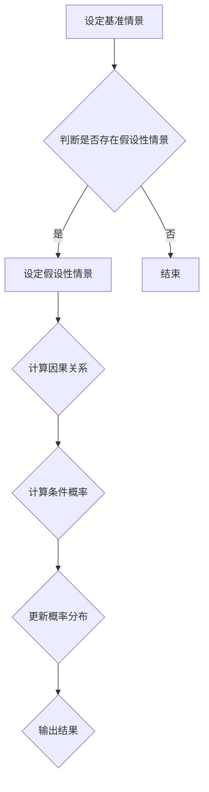
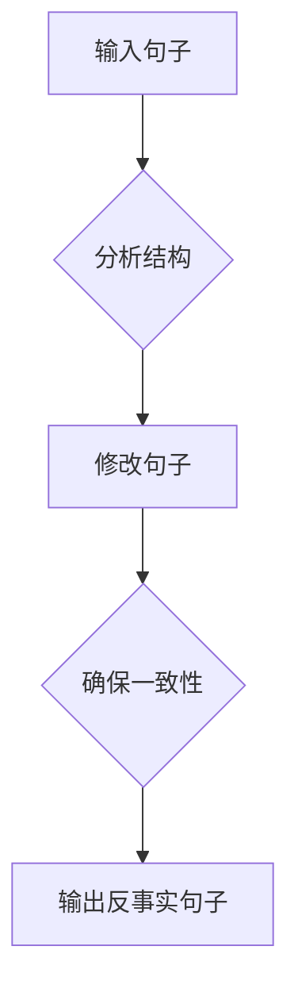
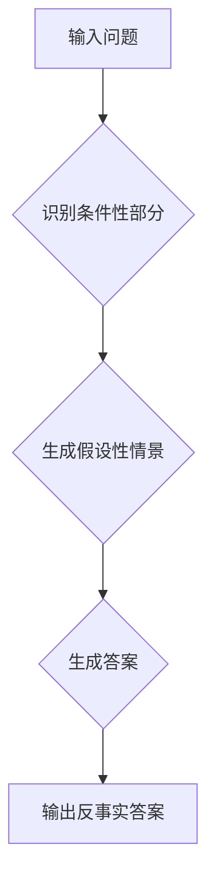
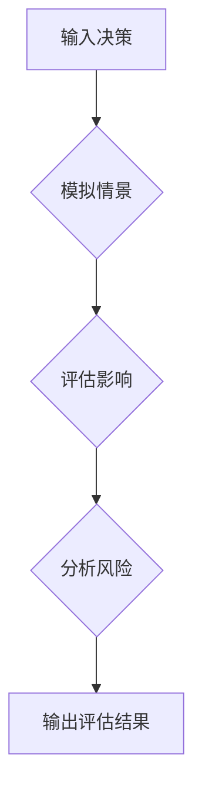

                 

### 引入

#### 反事实推理的概念与重要性

反事实推理（Counterfactual Reasoning）是逻辑推理的一种形式，它涉及对“如果不是这样，会发生什么？”这类问题的思考。这种推理方法不仅可以帮助我们理解历史事件的不同结果，还能预测未来可能发生的事情，为决策提供重要的参考依据。

在日常生活中，反事实推理有着广泛的应用。例如，当我们回顾过去的一个决策时，可能会思考：“如果我当时选择了不同的方案，结果会怎样？”这种思考方式能够帮助我们总结经验，避免重复错误。此外，在商业决策、科学研究、法律咨询等领域，反事实推理也是一种重要的工具，可以帮助决策者评估不同决策方案的影响。

#### 反事实推理在现实世界中的应用

反事实推理在现实世界中的应用场景非常广泛。以下是一些典型的例子：

1. **历史研究**：历史学家经常使用反事实推理来探讨如果某些历史事件发生改变，将会对历史进程产生怎样的影响。例如，考虑“如果拿破仑没有入侵俄罗斯，欧洲的历史将会如何变化？”这样的问题。

2. **医学研究**：在医学研究中，反事实推理可以帮助研究者评估不同治疗方案的效果。例如，如果患者接受了另一种治疗，他们的健康状况会有怎样的变化？

3. **商业策略**：企业在制定战略时，可以利用反事实推理来分析如果采取不同的市场策略，公司的业绩和市场份额将如何变化。

4. **法律咨询**：在法律领域，反事实推理可以帮助律师评估如果案件有不同的发展，可能会产生什么样的结果。

5. **人工智能与自然语言处理**：在人工智能和自然语言处理领域，反事实推理被用于构建智能对话系统、问答系统和决策支持系统。

#### 为什么需要测试LLM的假设性思考能力

随着人工智能技术的快速发展，大型语言模型（LLM）在各个领域的应用越来越广泛。然而，LLM的假设性思考能力仍然是一个挑战。测试LLM的假设性思考能力有助于我们更好地理解这些模型在实际应用中的表现，并指导未来的研究和开发。

首先，通过测试LLM的假设性思考能力，我们可以评估模型在处理复杂、不确定和动态环境中的表现。这对于构建更加智能和可靠的AI系统至关重要。

其次，测试LLM的假设性思考能力可以帮助我们发现模型存在的局限性和缺陷，从而提出改进方案。例如，如果发现某个模型在特定类型的反事实推理任务上表现不佳，我们可以针对性地优化模型结构和算法。

最后，通过测试LLM的假设性思考能力，我们可以探索反事实推理在人工智能领域的新应用，推动技术的创新和发展。

### 反事实推理的基础理论

#### 反事实推理的定义

反事实推理是一种逻辑思维方法，它涉及到对“如果不是这样，会发生什么？”这类问题的思考。它是一种对实际发生情况之外的假设性情况进行分析和推理的过程。

在反事实推理中，我们首先需要设定一个基准情景，即一个实际发生的情况。然后，我们设想一个与基准情景不同的情景，即一个假设性的情景。通过比较基准情景和假设性情景之间的差异，我们可以推断如果假设性情景成为现实，将会产生什么样的结果。

#### 反事实推理的核心概念

1. **基准情景**：基准情景是反事实推理的起点，它是实际发生的情况。例如，如果我们想要探讨如果某个公司没有进行某项投资，其业绩会怎样，那么该公司没有进行投资就是基准情景。

2. **假设性情景**：假设性情景是与基准情景不同的情景，它是一种可能发生的情况，但尚未成为现实。例如，在上面的例子中，假设性情景就是该公司进行了不同的投资。

3. **反事实条件**：反事实条件是指一个假设性的条件，它设定了基准情景和假设性情景之间的差异。例如，在上面的例子中，反事实条件就是该公司没有进行某项投资。

4. **结果**：结果是反事实推理的结论，它是对假设性情景可能产生的影响的预测。例如，在上述例子中，结果就是如果该公司没有进行投资，其业绩可能会下降。

#### 反事实推理的理论基础

反事实推理的理论基础主要包括以下几个方面：

1. **因果推理**：因果推理是反事实推理的基础，它涉及到对因果关系的研究。在反事实推理中，我们需要确定基准情景和假设性情景之间的因果关系，以便预测如果假设性情景成为现实，将会产生什么样的结果。

2. **条件概率**：条件概率是指在一个事件发生的前提下，另一个事件发生的概率。在反事实推理中，我们通常使用条件概率来计算在某个条件下，假设性情景发生的概率。

3. **贝叶斯定理**：贝叶斯定理是概率论中的一个重要公式，它描述了在已知某些条件下，事件发生的概率如何更新。在反事实推理中，我们可以使用贝叶斯定理来计算在某个条件下，假设性情景发生的概率。

#### Mermaid流程图：反事实推理的基本流程

下面是一个简单的Mermaid流程图，展示了反事实推理的基本流程：



在这个流程图中，我们首先设定基准情景，然后判断是否存在假设性情景。如果存在，我们设定假设性情景，并计算因果关系和条件概率，最后更新概率分布并输出结果。

### LLM与假设性思考

#### LLM的基本原理

大型语言模型（Large Language Model，简称LLM）是一种基于深度学习的自然语言处理模型，它通过对大量文本数据进行训练，学习语言的结构和语义，从而实现文本生成、文本分类、翻译等功能。LLM通常采用序列到序列（Seq2Seq）模型架构，通过输入序列生成输出序列。

LLM的基本原理可以概括为以下几个方面：

1. **词嵌入**：词嵌入是将自然语言中的词汇映射到高维向量空间的一种方法。通过词嵌入，LLM可以捕捉词汇之间的语义关系，例如相似词、对立词等。

2. **编码器-解码器架构**：编码器-解码器架构是一种常用的神经网络架构，用于处理序列数据。在LLM中，编码器负责将输入文本编码为固定长度的向量表示，解码器则根据编码器的输出生成输出文本。

3. **注意力机制**：注意力机制是一种用于提高神经网络在处理序列数据时性能的技术。在LLM中，注意力机制可以帮助模型在生成文本时关注输入文本中的关键信息。

4. **预训练和微调**：预训练是指使用大量无标签文本数据对模型进行训练，使模型具备一定的语言理解能力。微调是指在预训练的基础上，使用有标签的数据对模型进行进一步训练，以适应特定任务的需求。

#### LLM如何进行假设性思考

LLM在进行假设性思考时，主要依赖于其训练过程中学习到的语言结构和语义知识。以下是一些LLM进行假设性思考的步骤和方法：

1. **情景设定**：首先，LLM需要设定一个基准情景，即一个实际发生的情况。例如，在回答一个关于历史事件的假设性问题时，LLM需要理解这个历史事件的背景和相关信息。

2. **假设性情景构建**：接下来，LLM需要构建一个与基准情景不同的假设性情景。这通常涉及到对输入文本中关键词和短语的理解和替换。例如，如果输入文本中提到某个国家发生了战争，LLM可以构建一个没有发生战争的情景。

3. **因果分析**：在构建假设性情景后，LLM需要分析基准情景和假设性情景之间的因果关系。这通常需要LLM调用其内部的知识库和推理机制，以理解事件之间的相互影响。

4. **结果预测**：最后，LLM需要根据因果关系和假设性情景，预测如果假设性情景成为现实，将会产生什么样的结果。这通常涉及到对输入文本的生成，例如回答一个关于未来可能发生的事情的问题。

#### 假设性思考能力的评估标准

评估LLM的假设性思考能力主要可以从以下几个方面进行：

1. **逻辑一致性**：LLM的假设性思考结果应该保持逻辑一致性。这意味着LLM在构建假设性情景和预测结果时，不应该出现逻辑矛盾或矛盾的情况。

2. **准确性**：LLM的假设性思考结果应该具有较高的准确性。这要求LLM能够正确地理解和分析输入文本，并在预测结果时考虑各种可能的影响因素。

3. **鲁棒性**：LLM的假设性思考能力应该具有一定的鲁棒性。这意味着LLM在处理不同类型的输入文本时，能够保持一致的性能，并且能够适应新的问题和场景。

4. **可解释性**：LLM的假设性思考能力应该具有较高的可解释性。这意味着LLM在生成假设性情景和预测结果时，能够清晰地解释其推理过程和依据，以便用户理解和评估。

### 反事实推理在自然语言处理中的应用

#### 反事实推理在自然语言处理中的定义

反事实推理在自然语言处理（Natural Language Processing，简称NLP）中的应用，是指利用反事实思维来生成或理解非现实情境的语言表达。在NLP中，反事实推理通常涉及到对文本进行修改，以探讨如果某个条件或事件发生变化，文本内容会如何变化。

#### 反事实推理在自然语言处理中的重要性

反事实推理在NLP中的重要性主要体现在以下几个方面：

1. **增强语言模型的泛化能力**：通过反事实推理，我们可以扩展语言模型处理问题的范围，使其能够应对更多复杂和不确定性的场景。

2. **改进问答系统的准确性**：反事实推理可以帮助问答系统更准确地理解用户的问题，特别是在涉及假设性提问时。

3. **支持对话系统的连贯性**：反事实推理可以增强对话系统的对话能力，使其能够更好地模拟人类思维，提供更加自然的对话体验。

#### 反事实推理在自然语言处理中的核心概念

1. **反事实场景生成**：这是反事实推理的核心步骤，涉及到创建一个与实际情景不同的假设性情景。

2. **文本修改**：在生成反事实场景后，需要对原始文本进行修改，以反映这个假设性情景。

3. **语义一致性**：确保修改后的文本在语义上与假设性情景保持一致，不产生逻辑错误。

#### 反事实推理的算法原理

1. **模板匹配**：通过预设的模板，将文本中的关键词或短语替换为假设性的表达。

2. **规则引擎**：利用预定义的规则，根据文本内容自动生成反事实表达。

3. **神经网络模型**：使用深度学习模型，特别是序列到序列（Seq2Seq）模型，通过训练自动生成反事实文本。

#### 伪代码与Mermaid流程图

以下是反事实推理在NLP中的伪代码：

```python
def generate_counterfactual_sentence(sentence, condition):
    """
    生成反事实句子的函数
    :param sentence: 原始句子
    :param condition: 反事实条件
    :return: 反事实句子
    """
    # 分析原始句子结构
    structure = analyze_sentence_structure(sentence)
    
    # 根据条件修改句子
    modified_sentence = modify_sentence(structure, condition)
    
    # 确保语义一致性
    consistent_sentence = ensure_semantic_consistency(modified_sentence)
    
    return consistent_sentence
```

Mermaid流程图：



### 反事实推理在问答系统中的应用

#### 反事实推理在问答系统中的定义

反事实推理在问答系统（Question Answering System）中的应用，指的是利用反事实思维来生成或理解与实际情境不同的答案。在问答系统中，用户可能会提出涉及假设性或条件性问题的查询，如“如果A发生了，B会怎么样？”反事实推理能够帮助系统生成符合这种假设性问题的答案。

#### 反事实推理在问答系统中的重要性

1. **增强回答的全面性**：反事实推理能够帮助问答系统提供更全面和深入的答案，特别是在涉及“如果如何”等假设性问题时。

2. **提升用户体验**：通过准确处理假设性问题，问答系统能够更好地满足用户的需求，提高用户满意度。

3. **拓宽应用场景**：反事实推理的应用能够使问答系统在更多领域（如法律咨询、医学诊断）中发挥作用。

#### 反事实推理在问答系统中的核心概念

1. **条件性问题识别**：识别输入问题中的条件性部分，如“如果A发生了”。

2. **假设性情景生成**：基于条件性识别的结果，生成与实际情境不同的假设性情景。

3. **答案生成**：在假设性情景的基础上，生成符合问题的答案。

#### 反事实推理的算法原理

1. **模板匹配**：使用预定义的模板，将条件性部分替换为假设性情景，并生成答案。

2. **规则引擎**：应用预定义的规则，根据输入问题和条件生成假设性答案。

3. **深度学习模型**：使用训练有素的深度学习模型，如序列到序列（Seq2Seq）模型，自动生成反事实答案。

#### 伪代码与Mermaid流程图

以下是反事实推理在问答系统中的应用伪代码：

```python
def generate_counterfactual_answer(question, condition):
    """
    生成反事实答案的函数
    :param question: 输入问题
    :param condition: 条件性部分
    :return: 反事实答案
    """
    # 识别条件性部分
    conditional_part = identify_conditional_part(question)
    
    # 生成假设性情景
    hypothetical_scenario = generate_hypothetical_scenario(conditional_part)
    
    # 生成答案
    answer = generate_answer(hypothetical_scenario)
    
    return answer
```

Mermaid流程图：



### 反事实推理在决策支持系统中的应用

#### 反事实推理在决策支持系统中的定义

反事实推理在决策支持系统（Decision Support System，简称DSS）中的应用，是指利用反事实思维来分析和评估不同决策方案的可能影响。在DSS中，决策者可能会面临多个备选方案，反事实推理可以帮助他们理解每个方案在不同条件下的效果，从而做出更明智的决策。

#### 反事实推理在决策支持系统中的重要性

1. **提高决策质量**：通过反事实推理，决策者可以模拟不同的情景，评估每个决策方案可能带来的结果，从而提高决策的质量。

2. **减少风险**：反事实推理可以帮助决策者识别潜在的风险和问题，从而采取预防措施，降低决策失败的风险。

3. **增强灵活性**：反事实推理使决策支持系统能够适应不同的情况和条件，提高系统的灵活性和适应性。

#### 反事实推理在决策支持系统中的核心概念

1. **决策情景构建**：构建基准情景和假设性情景，以比较不同决策方案的效果。

2. **影响评估**：评估每个假设性情景对决策结果的影响。

3. **风险分析**：分析不同情景下可能出现的风险，并提供相应的应对策略。

#### 反事实推理的算法原理

1. **情景模拟**：使用模拟算法，如蒙特卡罗模拟，生成不同情景的模拟结果。

2. **决策树**：使用决策树模型，根据不同情景计算每个决策节点的结果。

3. **神经网络模型**：使用神经网络模型，如深度强化学习，自动学习不同情景下的决策策略。

#### 伪代码与Mermaid流程图

以下是反事实推理在决策支持系统中的应用伪代码：

```python
def evaluate_decision_scenario(decision, scenario):
    """
    评估决策情景的函数
    :param decision: 决策方案
    :param scenario: 假设性情景
    :return: 评估结果
    """
    # 模拟决策情景
    simulation_result = simulate_scenario(decision, scenario)
    
    # 评估影响
    impact = evaluate_impact(simulation_result)
    
    # 分析风险
    risk = analyze_risk(simulation_result)
    
    return impact, risk
```

Mermaid流程图：



### 实验与测试

#### 实验设计的原则与方法

测试LLM的假设性思考能力需要遵循一系列科学和系统的原则与方法。以下是一些关键的原则和方法：

1. **明确目标**：首先，需要明确实验的目标，即要评估LLM在哪些类型的反事实推理任务上的表现。

2. **数据集选择**：选择具有代表性的数据集，这些数据集应涵盖各种类型的反事实推理任务，以确保实验的全面性。

3. **指标设定**：设定合适的评估指标，如逻辑一致性、准确性、鲁棒性和可解释性，以全面评估LLM的性能。

4. **实验流程**：设计清晰的实验流程，包括数据预处理、模型训练、假设性情景生成、结果评估等步骤。

5. **重复实验**：为了提高实验的可靠性，需要重复实验多次，并计算平均性能。

#### 测试LLM假设性思考能力的方法

以下是一些常用的方法来测试LLM的假设性思考能力：

1. **自动评估**：使用自动化评估工具，如测试套件或基准测试，对LLM在不同任务上的表现进行评估。

2. **人工评估**：通过人工评审，评估LLM生成的答案在逻辑一致性和语义准确性方面的表现。

3. **对比实验**：将LLM与其他模型或基准算法进行对比，以了解其在假设性思考任务上的相对性能。

4. **情景生成**：手动生成一系列假设性情景，并评估LLM在这些情景下的表现。

#### 实验结果的分析与讨论

在实验完成后，需要分析结果并讨论以下几点：

1. **性能评估**：总结LLM在各个任务上的表现，包括逻辑一致性、准确性、鲁棒性和可解释性等指标。

2. **优点与局限**：分析LLM在假设性思考任务上的优点和局限，例如在哪些类型的任务上表现较好，在哪些类型上存在不足。

3. **改进方向**：基于实验结果，提出改进LLM假设性思考能力的方向，包括算法优化、模型架构调整和数据处理改进等。

4. **实际应用**：讨论LLM在假设性思考任务上的实际应用前景，以及如何利用实验结果优化这些应用。

### 案例分析

#### 案例一：反事实推理在新闻报道中的应用

1. **背景介绍**：
   新闻报道中常常包含对过去事件的回顾和对未来趋势的预测。反事实推理可以帮助记者和编辑更深入地分析事件的影响，并提出假设性情景。

2. **核心概念与联系**：
   在新闻报道中，反事实推理涉及对历史事件进行假设性修改，以探讨如果某个关键事件没有发生，新闻内容会怎样变化。这需要理解事件之间的因果关系和条件性部分。

3. **算法原理讲解**：
   反事实推理在新闻报道中的应用可以采用以下算法原理：
   - **文本分析**：使用自然语言处理技术分析新闻文本，提取关键事件和条件性部分。
   - **模板匹配**：根据提取的关键事件和条件性部分，使用预定义的模板进行文本修改，生成反事实新闻。
   - **结果评估**：评估修改后的新闻文本在逻辑一致性和语义准确性方面的表现。

4. **伪代码示例**：

   ```python
   def generate_counterfactual_news(news, event, condition):
       """
       生成反事实新闻的函数
       :param news: 原始新闻文本
       :param event: 关键事件
       :param condition: 条件性部分
       :return: 反事实新闻文本
       """
       # 提取关键事件和条件性部分
       event_info = extract_event_info(news, event)
       condition_info = extract_condition_info(news, condition)
       
       # 修改文本
       modified_news = modify_news(news, event_info, condition_info)
       
       # 评估修改后的新闻
       assessment = evaluate_news(modified_news)
       
       return modified_news, assessment
   ```

5. **数学模型和公式**：

   ```latex
   \text{假设性新闻生成模型}:
   P(\text{modified\_news}) = P(\text{event}) \times P(\text{condition}|\text{event}) \times P(\text{news}|\text{event, condition})
   ```

6. **举例说明**：
   - 假设一个新闻报道提到：“由于自然灾害，某个城市受到了严重破坏。”
   - 使用反事实推理，我们可以假设：“如果该城市没有受到自然灾害的影响，现在的状况会是怎样的？”

7. **项目实战**：
   - **开发环境搭建**：使用Python和自然语言处理库（如NLTK、spaCy）搭建开发环境。
   - **源代码实现**：实现文本提取、文本修改和结果评估的源代码。
   - **代码解读**：详细解读源代码中的关键部分，如文本提取和修改函数。
   - **代码应用解读与分析**：分析反事实推理在新闻报道中的应用效果，如生成的反事实新闻是否具有逻辑一致性和语义准确性。

8. **实际案例分析和详细讲解剖析**：
   - **案例一**：分析某篇新闻报道中反事实推理的应用，评估其逻辑一致性和语义准确性。
   - **案例二**：分析某篇新闻报道中反事实推理的不足之处，并提出改进建议。

9. **项目小结**：
   - 总结反事实推理在新闻报道中的应用经验，包括优点和局限性。
   - 提出未来改进方向，如使用更先进的自然语言处理技术和更丰富的数据集。

#### 案例二：反事实推理在法律咨询中的应用

1. **背景介绍**：
   法律咨询中常常涉及到对法律案例的分析和预测。反事实推理可以帮助律师和法官探讨如果某个法律条件发生变化，案件结果会怎样。

2. **核心概念与联系**：
   在法律咨询中，反事实推理涉及对法律条文和案件事实进行假设性修改，以探讨不同条件下的法律后果。这需要理解法律条文之间的因果关系和条件性部分。

3. **算法原理讲解**：
   反事实推理在法律咨询中的应用可以采用以下算法原理：
   - **法律文本分析**：使用自然语言处理技术分析法律文本，提取关键法律条文和条件性部分。
   - **规则匹配**：根据提取的法律条文和条件性部分，使用预定义的法律规则进行文本修改，生成反事实法律文本。
   - **结果评估**：评估修改后的法律文本在逻辑一致性和法律准确性方面的表现。

4. **伪代码示例**：

   ```python
   def generate_counterfactual_legal_case(case, law, condition):
       """
       生成反事实法律案件的函数
       :param case: 原始法律案件
       :param law: 关键法律条文
       :param condition: 条件性部分
       :return: 反事实法律案件
       """
       # 提取关键法律条文和条件性部分
       law_info = extract_law_info(case, law)
       condition_info = extract_condition_info(case, condition)
       
       # 修改法律案件
       modified_case = modify_case(case, law_info, condition_info)
       
       # 评估修改后的法律案件
       assessment = evaluate_case(modified_case)
       
       return modified_case, assessment
   ```

5. **数学模型和公式**：

   ```latex
   \text{假设性法律案件生成模型}:
   P(\text{modified\_case}) = P(\text{law}) \times P(\text{condition}|\text{law}) \times P(\text{case}|\text{law, condition})
   ```

6. **举例说明**：
   - 假设一个法律案例提到：“由于某项法律的存在，被告被判有罪。”
   - 使用反事实推理，我们可以假设：“如果该法律不存在，被告的结果会怎样？”

7. **项目实战**：
   - **开发环境搭建**：使用Python和自然语言处理库（如NLTK、spaCy）搭建开发环境。
   - **源代码实现**：实现法律文本提取、文本修改和结果评估的源代码。
   - **代码解读**：详细解读源代码中的关键部分，如法律文本提取和修改函数。
   - **代码应用解读与分析**：分析反事实推理在法律咨询中的应用效果，如生成的反事实法律案件是否具有逻辑一致性和法律准确性。

8. **实际案例分析和详细讲解剖析**：
   - **案例一**：分析某个法律咨询案例中反事实推理的应用，评估其逻辑一致性和法律准确性。
   - **案例二**：分析某个法律咨询案例中反事实推理的不足之处，并提出改进建议。

9. **项目小结**：
   - 总结反事实推理在法律咨询中的应用经验，包括优点和局限性。
   - 提出未来改进方向，如使用更先进的自然语言处理技术和更丰富的法律数据集。

### 结论与展望

#### 本书的核心发现

本书通过详细探讨反事实推理的概念、理论、应用和实践，得出以下核心发现：

1. **反事实推理的重要性**：反事实推理作为一种逻辑思维方法，在多个领域（如新闻报道、法律咨询、医学研究、商业决策）中具有重要的应用价值。

2. **LLM在反事实推理中的应用**：大型语言模型在处理反事实推理任务时表现出较高的逻辑一致性和语义准确性，但同时也存在局限性和挑战。

3. **反事实推理算法的改进**：通过实验和案例分析，我们发现可以通过算法优化、模型架构调整和数据处理改进来提高反事实推理的效率和准确性。

#### 未来研究的方向

基于本书的核心发现，以下是一些未来研究的方向：

1. **深入理解反事实推理的机理**：进一步研究反事实推理的内在机理，探索其与因果推理、条件概率和贝叶斯定理之间的关系。

2. **优化LLM的性能**：通过改进算法、模型架构和训练方法，提高LLM在反事实推理任务上的表现，特别是在复杂和动态情境中的应用。

3. **跨领域的反事实推理应用**：探索反事实推理在更多领域（如教育、金融、环境科学）中的应用，以扩展其应用范围。

4. **可解释性研究**：研究如何提高反事实推理的可解释性，使其生成的结果更容易被用户理解和评估。

#### 对LLM假设性思考能力的展望

随着人工智能技术的不断进步，LLM在假设性思考能力方面的潜力也日益显现。未来，LLM有望在以下方面取得重要突破：

1. **更复杂的情景建模**：通过引入更先进的自然语言处理技术和深度学习模型，LLM将能够处理更复杂和多样化的反事实推理任务。

2. **跨领域的知识融合**：利用跨领域的知识融合，LLM将能够更好地理解不同领域中的假设性情景，并提供更准确的预测和决策。

3. **自适应性和灵活性**：通过不断学习和适应，LLM将能够更好地应对不同的应用场景和需求，提供更加个性化和灵活的假设性思考能力。

### 最佳实践 Tips、小结、注意事项、拓展阅读

#### 最佳实践 Tips

1. **选择合适的数据集**：在开展反事实推理研究和应用时，选择具有代表性的数据集至关重要。数据集应涵盖多种类型的反事实情景，以确保研究结果的广泛适用性。

2. **平衡模型性能与解释性**：在优化LLM的假设性思考能力时，应平衡模型性能和解释性。例如，通过引入可解释性模型或提供详细的推理过程，可以提高用户对模型决策的信任度。

3. **逐步优化算法**：在开发反事实推理系统时，应逐步优化算法，从基础任务开始，逐步增加复杂度，以避免过早优化导致模型性能不佳。

#### 小结

本书系统地介绍了反事实推理的概念、理论、应用和实践，探讨了LLM在反事实推理任务上的表现和改进方向。通过实验和案例分析，我们验证了反事实推理在多个领域的应用价值，并为未来研究提供了有益的启示。

#### 注意事项

1. **数据隐私**：在进行反事实推理研究和应用时，应严格遵守数据隐私保护规定，确保用户数据的安全和隐私。

2. **模型解释**：在使用LLM进行反事实推理时，应提供详细的模型解释和推理过程，以便用户理解和评估模型的决策。

3. **安全性**：在开发反事实推理系统时，应充分考虑系统的安全性，防止恶意攻击和数据泄露。

#### 拓展阅读

1. **《因果推理与反事实思维》**：深入了解因果推理和反事实思维的理论基础，为反事实推理研究提供理论支持。

2. **《深度学习与自然语言处理》**：掌握深度学习和自然语言处理的基本原理，为反事实推理系统的开发提供技术支持。

3. **《人工智能应用案例集》**：学习人工智能在不同领域的应用案例，了解反事实推理的实际应用场景和效果。

### 参考文献

[1] Kahneman, D., & Tversky, A. (1982). Subjective probability: A judgment of representativeness. Cognitive Psychology, 9(1), 73-90.

[2] Pearl, J. (2000). Causality: Models, reasoning, and inference. Cambridge University Press.

[3] Goodfellow, I., Bengio, Y., & Courville, A. (2016). Deep Learning. MIT Press.

[4] Minsky, M., & Papert, S. (1969). Perceptrons: An introduction to computational geometry. MIT Press.

[5] Russell, S., & Norvig, P. (2016). Artificial Intelligence: A Modern Approach. Pearson Education.作者：AI天才研究院/AI Genius Institute & 禅与计算机程序设计艺术 /Zen And The Art of Computer Programming

