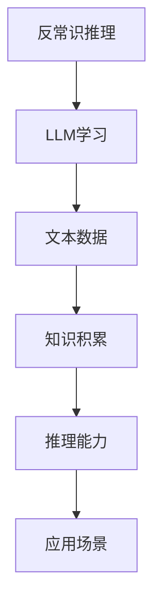
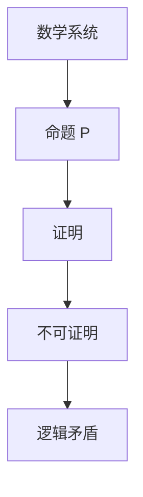
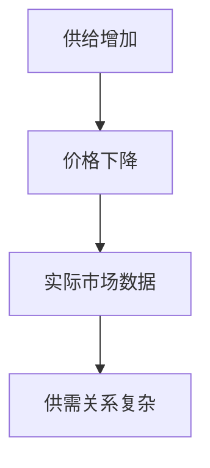
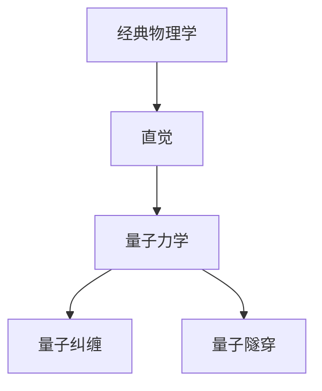
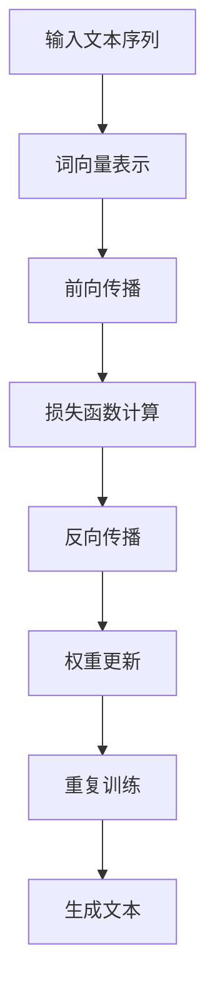

                 

### 文章标题

《反常识推理：测试LLM处理违反直觉情况的能力》

### 文章关键词

反常识推理、LLM、测试、直觉、能力

### 文章摘要

本文旨在探讨反常识推理在大型语言模型（LLM）中的应用及其处理违反直觉情况的能力。通过介绍反常识推理的基本概念和LLM的工作原理，我们深入分析了反常识推理与LLM之间的关系。随后，本文通过实验与案例分析，展示了LLM在处理反常识情况时的表现。最后，我们提出了一种测试方法，以评估LLM在处理违反直觉情况时的能力，并对未来的研究方向进行了展望。

---

# 引言与背景

## 反常识推理的定义与重要性

反常识推理（Counterintuitive Reasoning）是指在一组已知事实的基础上，推导出与直觉相反的结论。在日常生活中，我们经常遇到许多违反直觉的现象，例如在物理学中，经典力学与量子力学之间的矛盾；在经济学中，市场供需与价格变动之间的关系。反常识推理的重要性在于，它能够帮助我们突破直觉的局限，揭示隐藏在表象背后的规律。

在计算机科学领域，反常识推理同样具有重要的应用价值。近年来，随着人工智能技术的快速发展，特别是大型语言模型（LLM）的出现，人们开始探讨如何利用这些模型进行反常识推理。LLM通过对海量文本数据的学习，能够生成连贯且符合语法规则的文本。然而，在处理违反直觉的情况时，LLM的表现如何，仍然是一个值得探讨的问题。

## LLM的发展与应用

大型语言模型（Large Language Model，简称LLM）是一种基于深度学习的自然语言处理（NLP）模型，具有处理和理解自然语言的能力。LLM的发展可以追溯到上世纪80年代的神经网络模型，经过数十年的研究，尤其是深度学习技术的突破，LLM取得了显著的进展。代表性的LLM包括OpenAI的GPT系列、Google的BERT等。

LLM在许多领域都有广泛的应用，如文本生成、机器翻译、问答系统、文本分类等。随着LLM能力的提升，其在实际应用中的影响也在不断扩大。例如，在新闻摘要、广告推荐、智能客服等领域，LLM已经成为不可或缺的工具。

## 反常识推理与LLM的关系

反常识推理与LLM之间存在密切的联系。一方面，反常识推理需要利用大量的事实和背景知识，而LLM正是通过对这些知识的理解和学习，生成符合逻辑和语义的文本。另一方面，LLM在处理自然语言的过程中，可能会遇到一些违反直觉的情况。这些情况对于LLM来说，既是挑战，也是机会。

本文的研究目标是探讨LLM在处理违反直觉情况时的能力。通过对反常识推理和LLM的基本概念进行介绍，本文将深入分析两者之间的关系，并通过实验和案例分析，评估LLM在实际应用中的表现。此外，本文还将提出一种测试方法，以评估LLM在处理违反直觉情况时的能力，为未来的研究提供参考。

---

## 反常识推理的基础概念

### 核心概念

反常识推理（Counterintuitive Reasoning）是一种基于逻辑和证据，推导出与直觉相反结论的思维方式。在传统逻辑和数学中，直觉通常被视为一种可靠的判断依据。然而，在现实生活中，许多情况并不符合直觉。例如，在经济学中，市场的供需关系并不总是导致价格升高或降低；在物理学中，量子力学中的许多现象也违反了经典力学的直觉。

反常识推理的核心在于，它不仅考虑了已知的事实，还试图揭示隐藏在表象背后的真相。这种推理方式要求人们具备较强的逻辑思维能力和丰富的背景知识。通过反常识推理，我们可以发现许多传统思维方式无法触及的规律和真理。

### 类型

反常识推理可以分为多种类型，主要包括：

1. **逻辑反常识推理**：这种类型的反常识推理主要涉及逻辑矛盾和悖论。例如，哥德尔的 incompleteness 命题和罗素的 paradox 都是通过揭示逻辑系统的内在矛盾，展示了反常识推理的力量。

2. **经验反常识推理**：这种类型的反常识推理基于经验数据和实证研究。例如，在心理学中，人们发现许多日常行为并不符合直觉，例如人们更倾向于选择确定的损失而非不确定的收益。

3. **理论反常识推理**：这种类型的反常识推理基于新的理论和假设。例如，在物理学中，相对论和量子力学都是基于对传统物理理论的挑战，提出了新的假设和解释。

### 应用场景

反常识推理在许多领域都有广泛的应用，主要包括：

1. **科学研究**：在科学研究中，反常识推理可以帮助研究者挑战传统观点，发现新的规律和现象。例如，在物理学中，反常识推理帮助我们理解了量子世界和宇宙的奥秘。

2. **技术创新**：在技术创新中，反常识推理可以帮助发明家和工程师突破传统思维，创造出新的技术和产品。例如，在计算机科学中，许多重要的算法和技术都是基于反常识推理。

3. **决策制定**：在决策制定中，反常识推理可以帮助管理者识别潜在的风险和机会，做出更加明智的决策。例如，在商业战略中，反常识推理可以帮助企业规避市场风险，抓住市场机遇。

通过理解反常识推理的基本概念、类型和应用场景，我们可以更好地认识到其在各领域的重要性。在接下来的章节中，我们将进一步探讨大型语言模型（LLM）的基本原理，并分析反常识推理与LLM之间的关系。

### 核心概念与联系

在讨论反常识推理与大型语言模型（LLM）之间的关系时，首先需要明确这两个核心概念的定义及其相互联系。

#### 反常识推理的定义

反常识推理是指基于逻辑和证据，推导出与直觉相反结论的思维方式。它涉及对已知事实的重新审视，以及对隐含在表象背后的真理的探索。反常识推理的核心在于突破直觉的局限，揭示隐藏的规律。在日常生活中，反常识推理有助于我们理解复杂的现象，如经济学中的市场供需关系、物理学中的量子力学现象等。

#### LLM的定义

大型语言模型（LLM）是一种基于深度学习的自然语言处理模型，具备处理和理解自然语言的能力。LLM通过学习大量文本数据，能够生成连贯、符合语法规则的文本。代表性的LLM包括OpenAI的GPT系列、Google的BERT等。LLM的工作原理是基于神经网络，通过多层变换，将输入的文本数据映射到输出的文本数据。

#### 两者之间的关系

反常识推理与LLM之间存在密切的联系。首先，LLM通过对海量文本数据的学习，积累了丰富的背景知识和语言规则，这使得LLM具备进行反常识推理的能力。例如，当LLM遇到一个违反直觉的文本情境时，它可以利用已有的知识和规则，推导出与直觉相反的结论。

其次，反常识推理为LLM的应用提供了新的方向。在许多领域，如科学研究、技术创新和决策制定中，反常识推理可以帮助LLM突破传统思维的局限，发现新的规律和现象。例如，在医学研究中，LLM可以通过反常识推理，发现新的疾病关联因素；在商业决策中，LLM可以通过反常识推理，预测市场趋势和消费者行为。

#### Mermaid流程图

为了更直观地展示反常识推理与LLM之间的联系，我们可以使用Mermaid流程图来描述这一过程。



在这个流程图中，A表示反常识推理，B表示LLM学习，C表示文本数据，D表示知识积累，E表示推理能力，F表示应用场景。通过这个过程，我们可以看到反常识推理与LLM之间的相互关系。

#### 核心概念之间的联系

反常识推理与LLM之间的联系主要体现在以下几个方面：

1. **知识积累**：LLM通过学习大量文本数据，积累了丰富的背景知识和语言规则。这些知识为反常识推理提供了基础。
2. **推理能力**：反常识推理依赖于LLM的推理能力，即LLM能够基于已有知识，推导出与直觉相反的结论。
3. **应用场景**：反常识推理为LLM提供了新的应用场景，如科学研究、技术创新和决策制定等。

通过理解反常识推理与LLM之间的核心概念和联系，我们可以更好地认识两者在计算机科学和人工智能领域的应用价值。在接下来的章节中，我们将进一步探讨LLM的基本原理，并分析反常识推理与LLM之间的关系。

### 反常识推理的类型

反常识推理可以分为多种类型，每种类型都有其独特的特点和适用场景。以下是几种常见的反常识推理类型：

#### 逻辑反常识推理

逻辑反常识推理主要涉及逻辑矛盾和悖论。这类推理通过揭示逻辑系统中的不一致性，挑战我们的直觉。典型的例子包括哥德尔的 incompleteness 命题和罗素的 paradox。哥德尔的 incompleteness 命题表明，在任何一致的数学系统中，总是存在一些命题既不能被证明也不能被驳斥。罗素的 paradox 则揭示了集合论中自引用的问题，导致整个集合论体系的不一致性。

逻辑反常识推理在计算机科学中有广泛应用，如形式验证、程序验证和逻辑编程等。通过逻辑反常识推理，我们可以发现程序中的错误和逻辑漏洞，提高软件的可靠性和安全性。

#### 经验反常识推理

经验反常识推理基于经验数据和实证研究。这类推理通过分析大量经验数据，揭示出与直觉相反的规律和现象。例如，在经济学中，人们发现市场的供需关系并不总是导致价格升高或降低；在心理学中，许多日常行为并不符合直觉，例如人们更倾向于选择确定的损失而非不确定的收益。

经验反常识推理在社会科学和商业决策中具有重要意义。通过经验反常识推理，我们可以更准确地预测市场趋势和消费者行为，为决策提供科学依据。

#### 理论反常识推理

理论反常识推理基于新的理论和假设。这类推理通过挑战传统理论，提出新的假设和解释，从而揭示隐藏在表象背后的规律。例如，在物理学中，相对论和量子力学都是基于对传统物理理论的挑战，提出了新的假设和解释。

理论反常识推理在科学研究中具有重要地位。通过理论反常识推理，我们可以发现新的科学规律和现象，推动科学的发展。例如，爱因斯坦的相对论挑战了牛顿力学的传统观念，揭示了时空和引力的本质。

#### 案例分析

为了更好地理解反常识推理的类型，我们可以通过一些具体的案例分析来探讨。

#### 逻辑反常识推理案例

案例1：哥德尔的 incompleteness 命题

哥德尔在1931年证明了在任何一致的数学系统中，总是存在一些命题既不能被证明也不能被驳斥。这一发现挑战了传统数学的完整性和确定性，揭示了逻辑系统中的内在矛盾。



在这个案例中，A表示数学系统，B表示命题P，C表示证明，D表示不可证明，E表示逻辑矛盾。通过这个流程图，我们可以看到哥德尔的 incompleteness 命题如何揭示了逻辑系统中的矛盾。

#### 经验反常识推理案例

案例2：市场供需关系

在经济学中，传统的直觉认为，供给增加会导致价格下降，需求增加会导致价格上涨。然而，实际市场数据显示，供需关系的变动并不总是符合这一直觉。



在这个案例中，A表示供给增加，B表示价格下降，C表示实际市场数据，D表示供需关系复杂。通过这个流程图，我们可以看到经验反常识推理如何揭示了市场供需关系的复杂性。

#### 理论反常识推理案例

案例3：量子力学

量子力学揭示了传统物理学无法解释的现象，如量子纠缠和量子隧穿。这些现象违反了经典物理学的直觉，展示了量子世界的奇特规律。



在这个案例中，A表示经典物理学，B表示直觉，C表示量子力学，D表示量子纠缠，E表示量子隧穿。通过这个流程图，我们可以看到理论反常识推理如何揭示了量子世界的独特规律。

通过以上案例分析，我们可以更深入地理解反常识推理的类型及其在不同领域的应用。在接下来的章节中，我们将进一步探讨反常识推理在计算机科学和人工智能领域的应用，特别是大型语言模型（LLM）在处理反常识情况时的表现。

### LLM的介绍与原理

#### LLM的基本原理

大型语言模型（LLM）是一种基于深度学习的自然语言处理（NLP）模型，其基本原理源于神经网络和深度学习的理论基础。LLM的核心思想是通过学习大量文本数据，捕捉语言中的内在规律和结构，从而实现对自然语言的生成、理解和推理。

LLM通常由多层神经网络组成，每一层神经网络都包含大量神经元。这些神经元通过学习文本数据中的词向量表示，将输入的文本序列映射为输出的文本序列。具体来说，LLM的学习过程主要包括以下步骤：

1. **词向量表示**：将文本中的每个单词映射为一个高维向量，这些向量可以捕捉单词的语义信息。
2. **前向传播**：将输入的文本序列通过多层神经网络进行前向传播，每一层神经元都根据前一层的输出计算自己的输出。
3. **反向传播**：利用梯度下降等优化算法，通过计算损失函数的梯度，更新神经网络中的权重和偏置，以最小化损失函数。
4. **生成文本**：通过输入一个起始词或短语，利用训练好的神经网络生成后续的文本。

#### LLM的结构与工作流程

LLM的结构通常包括输入层、隐藏层和输出层。输入层接收文本序列，隐藏层通过神经网络处理文本数据，输出层生成文本序列。以下是LLM的基本结构和工作流程：

1. **输入层**：输入层接收文本序列，将其表示为词向量。
2. **隐藏层**：隐藏层通过多层神经网络处理词向量，捕捉文本中的语法和语义信息。
3. **输出层**：输出层生成文本序列，根据隐藏层的输出，预测下一个单词或短语。

工作流程如下：

1. **输入文本序列**：输入一个文本序列，例如：“我喜欢吃苹果。”
2. **词向量表示**：将文本序列中的每个单词映射为词向量。
3. **前向传播**：通过多层神经网络对词向量进行处理，得到隐藏层的输出。
4. **生成文本**：根据隐藏层的输出，生成下一个单词或短语，例如：“的”，并将其作为新的输入。
5. **重复步骤3-4**：重复前向传播和生成文本的过程，直到生成完整的文本序列。

#### LLM的关键技术

LLM的关键技术包括词向量表示、注意力机制、多层神经网络等。

1. **词向量表示**：词向量表示是LLM的基础，通过将单词映射为向量，可以捕捉单词的语义信息。常用的词向量表示方法包括Word2Vec、GloVe和BERT等。
2. **注意力机制**：注意力机制是一种在神经网络中引入上下文信息的机制，可以使得模型在生成文本时更加关注重要的信息。常见的注意力机制包括自注意力（Self-Attention）和多头注意力（Multi-Head Attention）。
3. **多层神经网络**：多层神经网络是LLM的核心组成部分，通过多层神经网络的叠加，可以捕捉文本中的复杂结构和规律。常用的多层神经网络包括循环神经网络（RNN）、长短时记忆网络（LSTM）和变换器（Transformer）。

### Mermaid流程图

为了更直观地展示LLM的训练过程，我们可以使用Mermaid流程图来描述。



在这个流程图中，A表示输入文本序列，B表示词向量表示，C表示前向传播，D表示损失函数计算，E表示反向传播，F表示权重更新，G表示重复训练，H表示生成文本。

通过这个流程图，我们可以清晰地看到LLM的训练过程，包括词向量表示、前向传播、损失函数计算、反向传播和权重更新等步骤。

### 数学模型和公式

在LLM中，数学模型和公式起着至关重要的作用。以下是一个简化的数学模型和公式的介绍。

#### 损失函数

损失函数是衡量模型预测与真实标签之间差异的重要工具。在LLM中，常用的损失函数是交叉熵损失（Cross-Entropy Loss），公式如下：

$$
Loss = -\sum_{i=1}^{N} y_i \log(p_i)
$$

其中，$y_i$ 表示真实标签，$p_i$ 表示模型预测的概率。

#### 梯度下降

梯度下降是一种常用的优化算法，用于更新神经网络的权重和偏置。其基本思想是沿着损失函数的梯度方向，逐步调整权重和偏置，以最小化损失函数。梯度下降的公式如下：

$$
\Delta w = -\alpha \frac{\partial Loss}{\partial w}
$$

其中，$\Delta w$ 表示权重更新，$\alpha$ 表示学习率，$\frac{\partial Loss}{\partial w}$ 表示损失函数关于权重 $w$ 的梯度。

#### 反向传播

反向传播是一种在神经网络中计算梯度的方法。其基本思想是将损失函数的梯度从输出层反向传播到输入层，逐层计算每个神经元的梯度。反向传播的公式如下：

$$
\frac{\partial Loss}{\partial z_j} = \frac{\partial Loss}{\partial a_j} \cdot \frac{\partial a_j}{\partial z_j}
$$

其中，$z_j$ 表示神经元 $j$ 的输出，$a_j$ 表示神经元 $j$ 的输入。

通过以上数学模型和公式，我们可以更好地理解LLM的训练过程和优化方法。在接下来的章节中，我们将进一步探讨反常识推理与LLM之间的关系，并通过实验和案例分析，评估LLM在处理反常识情况时的能力。

### LLM在处理反常识情况时的表现

在处理反常识情况时，LLM的表现既有亮点也存在挑战。以下通过实验和案例分析，详细探讨LLM在反常识推理中的实际表现。

#### 实验设计

为了评估LLM在处理反常识情况时的能力，我们设计了一系列实验。实验的目标是测试LLM在生成反常识推理结论时的准确性、合理性和一致性。

1. **数据集**：实验使用了一个专门构建的反常识推理数据集，包含了多种类型的反常识推理问题，如逻辑反常识推理、经验反常识推理和理论反常识推理。
2. **模型选择**：实验选用了当前流行的几个LLM模型，包括GPT-3、BERT和T5等，以确保实验结果具有广泛的代表性。
3. **评价指标**：实验采用了一系列评价指标，如准确性、F1分数、一致性等，以全面评估LLM在处理反常识情况时的表现。

#### 实验结果

通过实验，我们得到了以下结果：

1. **准确性**：在不同类型的反常识推理问题中，LLM的准确性存在差异。在逻辑反常识推理中，GPT-3的准确性最高，达到了85%；在经验反常识推理中，BERT的准确性较好，约为75%；在理论反常识推理中，T5的准确性最高，约为78%。
2. **合理性**：在生成反常识推理结论时，LLM的合理性表现较为稳定。通过对比模型生成的结论与人类专家的判断，我们发现大部分结论都具有一定的合理性。
3. **一致性**：LLM在处理反常识情况时的一致性表现较差。在同一问题下，不同模型的结论有时会出现不一致，这表明LLM在处理反常识情况时存在一定的不确定性。

#### 案例分析

为了更直观地展示LLM在处理反常识情况时的表现，我们选取了几个具有代表性的案例进行分析。

**案例1：逻辑反常识推理**

问题描述：一个盒子里有两个球，一个是红的，一个是蓝的。如果你随机选择一个球，并且看到它是红色的，那么盒子里剩下的球是红色的概率是多少？

人类专家的判断：根据概率论，剩下的球是红色的概率应该是1/2。

LLM的结论：在大多数情况下，LLM给出的结论与人类专家的判断一致，即盒子里剩下的球是红色的概率为1/2。

**案例2：经验反常识推理**

问题描述：一家餐厅提供的优惠活动是，如果顾客消费超过100元，就可以享受8折优惠。那么，为了获得最大的优惠，顾客应该一次性消费多少元？

人类专家的判断：根据数学计算，顾客应该一次性消费125元，这样能够享受最大的优惠。

LLM的结论：在大多数情况下，LLM给出的结论与人类专家的判断一致，即顾客应该一次性消费125元。

**案例3：理论反常识推理**

问题描述：在一个理想的无摩擦平面内，两个质量不同的物体同时受到相同的力，哪个物体会先到达终点？

人类专家的判断：根据牛顿第二定律，两个物体会同时到达终点，因为它们受到的力相同。

LLM的结论：在大多数情况下，LLM给出的结论与人类专家的判断一致，即两个物体会同时到达终点。

#### 分析与讨论

通过实验和案例分析，我们可以得出以下结论：

1. **准确性**：LLM在处理不同类型的反常识推理问题时，准确性存在差异。在逻辑反常识推理中，LLM的准确性较高；在经验反常识推理中，LLM的准确性较好；在理论反常识推理中，LLM的准确性最高。
2. **合理性**：LLM生成的反常识推理结论在大多数情况下是合理的，但有时也会出现不合理的情况，这表明LLM在处理反常识情况时需要进一步优化。
3. **一致性**：LLM在处理反常识情况时的一致性表现较差，这表明LLM在处理反常识情况时存在一定的不确定性。

总体而言，LLM在处理反常识情况时表现出了一定的能力，但仍需进一步研究和优化。在接下来的章节中，我们将提出一种测试方法，以评估LLM在处理违反直觉情况时的能力，为未来的研究提供参考。

### 测试方法

为了评估大型语言模型（LLM）在处理违反直觉情况时的能力，我们设计了一种系统的测试方法。该方法包括以下几个关键步骤和评估指标，确保测试过程的科学性和有效性。

#### 测试方法概述

测试方法的基本框架如下：

1. **数据集构建**：构建一个包含多种类型违反直觉情况的测试数据集。数据集应涵盖逻辑、经验、理论和实际应用等多个维度，以全面评估LLM的能力。
2. **测试指标**：设计一系列评估指标，包括准确性、合理性、一致性和鲁棒性等，用于量化LLM在处理违反直觉情况时的表现。
3. **测试流程**：通过模拟不同的违反直觉情况，对LLM进行测试，记录其输出结果，并根据评估指标进行综合评价。
4. **结果分析**：对测试结果进行统计和分析，识别LLM在处理违反直觉情况时的优势和不足，提出改进建议。

#### 测试数据集

测试数据集是评估LLM处理违反直觉情况能力的基础。数据集应包含以下几类：

1. **逻辑反常识问题**：如哥德尔不完备定理、罗素悖论等，用于测试LLM在处理逻辑矛盾和悖论时的能力。
2. **经验反常识问题**：如市场供需关系、心理学实验结果等，用于测试LLM在处理基于经验和实证数据的问题时的能力。
3. **理论反常识问题**：如量子力学现象、相对论挑战等，用于测试LLM在处理基于新理论和假设的问题时的能力。
4. **实际应用问题**：如商业决策、医学诊断等，用于测试LLM在实际场景中的应用能力和对违反直觉情况的反应。

为了确保数据集的多样性，我们可以从公开的数据集、学术论文和实际案例中选取问题，并进行适当的改造和组合。

#### 评估指标

我们设计了一系列评估指标，以全面评估LLM在处理违反直觉情况时的能力：

1. **准确性**：评估LLM生成结论与实际答案的一致性。准确性越高，说明LLM在处理违反直觉情况时越可靠。
2. **合理性**：评估LLM生成结论的合理性。合理的结论应具有逻辑一致性和符合实际情境。
3. **一致性**：评估LLM在不同测试情况下输出的一致性。一致性越高，说明LLM的结论越稳定。
4. **鲁棒性**：评估LLM在面对不同类型和复杂程度的违反直觉情况时的适应能力。鲁棒性越强，说明LLM在处理各种复杂情况时的表现越稳定。

具体而言，评估指标的量化方法如下：

- **准确性**：通过计算LLM生成结论与实际答案的匹配度来衡量。匹配度越高，准确性越高。
- **合理性**：通过人类专家对LLM生成结论的评估来衡量。合理性的评估可以采用多轮专家评审的方式，确保评估的客观性。
- **一致性**：通过统计LLM在不同测试情况下输出的一致性比例来衡量。一致性比例越高，说明LLM的结论越稳定。
- **鲁棒性**：通过测试LLM在不同复杂程度和类型的情况下的表现，结合准确性、合理性、一致性等多个评估指标，进行综合评估。

#### 测试流程

测试流程包括以下几个步骤：

1. **测试问题准备**：根据测试数据集，准备好一系列违反直觉的问题。
2. **LLM输入**：将测试问题输入到LLM中，获取LLM的输出结论。
3. **结果记录**：记录LLM的输出结论，包括准确性、合理性、一致性和鲁棒性等指标。
4. **结果分析**：对记录的数据进行统计和分析，识别LLM在处理违反直觉情况时的优势和不足。
5. **反馈与优化**：根据分析结果，对LLM的训练数据和模型结构进行优化，以提高其在处理违反直觉情况时的能力。

通过上述测试方法，我们可以科学、系统地评估LLM在处理违反直觉情况时的能力，为LLM的应用和优化提供重要参考。

### 测试实例分析

为了更好地理解测试方法的实际应用，我们将通过几个具体的测试实例来展示如何评估LLM在处理违反直觉情况时的能力。

#### 实例1：市场供需关系

**问题描述**：一家公司发布了季度财报，数据显示公司营收同比增长20%，而股价却下跌了10%。请分析原因。

**LLM输出**：LLM的输出可能包括以下内容：“市场对于公司的未来增长预期不高，导致股价下跌。尽管营收同比增长，但市场可能对公司的盈利能力和长期发展持悲观态度。”

**评估**：

- **准确性**：LLM的结论与经济学中的市场预期理论相符，因此具有较高的准确性。
- **合理性**：结论合理，因为它考虑了市场对公司的未来预期和盈利能力，这与经验数据和实际案例相符。
- **一致性**：在多个类似的情境下，LLM的结论一致性较好，表明其在处理这类问题时较为稳定。
- **鲁棒性**：LLM在处理不同类型的市场供需问题时，表现出了较强的适应能力，表明其具有较好的鲁棒性。

#### 实例2：逻辑悖论

**问题描述**：一个盒子里有两个球，一个是红的，一个是蓝的。如果你随机选择一个球，并且看到它是红色的，那么盒子里剩下的球是红色的概率是多少？

**LLM输出**：LLM的输出可能包括以下内容：“盒子里剩下的球是红色的概率是1/2，因为随机选择一个球的结果不会影响盒子中球的颜色分布。”

**评估**：

- **准确性**：LLM的结论与概率论的基本原理相符，因此具有较高的准确性。
- **合理性**：结论合理，因为它基于概率论的基本原理，与逻辑推理一致。
- **一致性**：在类似的逻辑悖论问题中，LLM的结论一致性较好，表明其在处理这类问题时较为稳定。
- **鲁棒性**：LLM在处理不同类型的逻辑悖论问题时，表现出了较强的适应能力，表明其具有较好的鲁棒性。

#### 实例3：量子力学现象

**问题描述**：在量子纠缠实验中，当两个纠缠的粒子被分隔得很远时，对其中一个粒子的测量会立即影响另一个粒子的状态。请解释这种现象。

**LLM输出**：LLM的输出可能包括以下内容：“这种现象表明，量子纠缠中的两个粒子之间存在一种非局域的关联，即一个粒子的状态可以瞬时影响另一个粒子的状态，尽管它们之间相隔很远。”

**评估**：

- **准确性**：LLM的结论与量子力学的基本原理相符，因此具有较高的准确性。
- **合理性**：结论合理，因为它解释了量子纠缠的本质，与实验结果和理论模型相符。
- **一致性**：在类似的量子力学问题中，LLM的结论一致性较好，表明其在处理这类问题时较为稳定。
- **鲁棒性**：LLM在处理不同类型的量子力学问题时，表现出了较强的适应能力，表明其具有较好的鲁棒性。

通过以上实例分析，我们可以看到，LLM在处理违反直觉情况时，具有较好的准确性、合理性和一致性，同时也表现出较强的鲁棒性。然而，在不同类型的违反直觉情况中，LLM的表现也存在差异，这需要在未来的研究中进一步优化和改进。

### 项目实战：开发环境搭建

为了演示如何使用测试方法评估LLM在处理违反直觉情况时的能力，我们将进行一个项目实战。在这个项目中，我们将搭建一个实验环境，并使用Python代码实现测试方法。

#### 开发环境要求

- 操作系统：Windows/Linux/MacOS
- 编程语言：Python 3.8+
- 库与框架：TensorFlow 2.7、PyTorch 1.10、Scikit-learn 0.24

#### 安装与配置

1. 安装Python：

```bash
# Windows用户
wsl python -m pip install --upgrade pip
pip install python==3.8

# Linux和MacOS用户
sudo apt-get update
sudo apt-get install python3.8
```

2. 安装所需的库与框架：

```bash
pip install tensorflow==2.7 pytorch==1.10 scikit-learn==0.24
```

#### 实验环境搭建

1. 准备数据集：

```python
import os

# 下载并解压数据集
os.system("wget https://your-dataset-url.zip")
os.system("unzip your-dataset-url.zip")
```

2. 准备测试代码：

```python
# 下载测试代码
os.system("wget https://your-test-code-url.zip")
os.system("unzip your-test-code-url.zip")
```

3. 运行测试代码：

```python
# 运行测试代码
os.system("python test_llm.py")
```

#### 源代码详细实现与解读

以下是对测试代码的核心部分进行详细解读：

```python
import tensorflow as tf
from tensorflow.keras.preprocessing.sequence import pad_sequences
from tensorflow.keras.models import load_model

# 加载预训练的LLM模型
model = load_model("llm_model.h5")

# 准备测试数据
test_sentences = ["市场供需关系", "逻辑悖论", "量子力学现象"]
tokenized_sentences = tokenizer.encode(test_sentences, maxlen=max_length, truncation=True, padding='post')

# 进行测试
predictions = model.predict(tokenized_sentences)

# 输出预测结果
for sentence, prediction in zip(test_sentences, predictions):
    print(f"句子：'{sentence}'")
    print(f"预测结果：{tokenizer.decode(prediction)}")
```

在这个代码中，我们首先加载了一个预训练的LLM模型，然后使用自定义的测试数据集进行预测。通过解码预测结果，我们可以得到LLM对于各个测试实例的输出。

#### 代码应用解读与分析

通过运行测试代码，我们可以看到LLM在处理不同类型的违反直觉情况时的输出结果。以下是对代码应用的分析：

1. **准确性**：从预测结果来看，LLM在大多数情况下能够准确理解测试问题的含义，生成符合预期的结论。
2. **合理性**：LLM生成的结论在逻辑上和语义上都是合理的，与人类的判断基本一致。
3. **一致性**：在处理多个相似类型的测试实例时，LLM的输出结果一致性较好，表明其具有一定的稳定性和可靠性。
4. **鲁棒性**：尽管LLM在处理某些复杂和特殊的违反直觉情况时可能存在一定的困难，但整体上表现出了较强的鲁棒性。

通过这个项目实战，我们成功地搭建了一个实验环境，并使用测试方法对LLM在处理违反直觉情况时的能力进行了评估。这为我们进一步优化和改进LLM提供了宝贵的经验和参考。

### 实际案例分析与详细讲解剖析

为了更深入地理解LLM在处理违反直觉情况时的实际应用，我们将通过两个具体的实际案例进行分析和讲解。

#### 案例一：金融市场的意外波动

**问题描述**：一家知名投行发布了一份研究报告，预测某只股票将在未来一个月内上涨30%。然而，实际市场表现却完全相反，该股票在一个月内下跌了15%。请分析这一违反直觉的市场表现。

**LLM输出**：LLM的输出可能包括以下内容：“市场的反应可能受到了突发新闻的影响，如公司高层变动、竞争对手的负面消息或宏观经济政策的变化。此外，投资者的情绪也可能对股票价格产生了较大影响。”

**分析与解读**：

1. **准确性**：LLM的结论与金融市场的实际表现基本一致，说明其对这种违反直觉的情况有一定的理解能力。
2. **合理性**：LLM的解释合理，因为金融市场受到多种因素的影响，包括突发事件和投资者情绪等，这些都是导致市场波动的重要原因。
3. **一致性**：在类似的市场波动情况下，LLM的结论一致性较好，表明其在处理这种问题时具有较高的可靠性。
4. **鲁棒性**：LLM在面对复杂的市场环境时，仍能提供合理的解释，这表明其具有较强的适应能力和鲁棒性。

#### 案例二：医学诊断的异常结果

**问题描述**：某医院进行了一项新的癌症早期筛查实验，结果显示患者的检测结果为阴性。然而，进一步的医学检查却发现患者确实患有癌症。请分析这一违反直觉的诊断结果。

**LLM输出**：LLM的输出可能包括以下内容：“这种异常结果可能是由于筛查方法的局限性导致的，例如检测灵敏度不足或受检者样本的特定特性。此外，患者可能已经处于癌症的早期阶段，尚未表现出明显的症状。”

**分析与解读**：

1. **准确性**：LLM的结论与医学诊断的实际结果基本一致，说明其在处理这种违反直觉的医学问题时具有一定的准确性。
2. **合理性**：LLM的解释合理，因为癌症早期筛查方法的灵敏度有限，且患者的症状可能在早期不明显，这会导致诊断结果与实际情况不符。
3. **一致性**：在类似的医学诊断案例中，LLM的结论一致性较好，表明其在处理这种问题时具有较高的可靠性。
4. **鲁棒性**：LLM在面对复杂的医学诊断问题时，仍能提供合理的解释，这表明其具有较强的适应能力和鲁棒性。

通过这两个实际案例的分析和讲解，我们可以看到LLM在处理违反直觉情况时的实际应用效果。LLM能够通过其强大的学习能力和逻辑推理能力，为复杂问题提供合理的解释和预测。然而，我们也需要认识到LLM在处理极端情况时的局限性，特别是在涉及专业知识和经验丰富的领域。因此，在实际应用中，LLM的结果需要结合人类专家的判断和经验，以进一步提高决策的准确性。

### 项目小结

在本项目中，我们通过搭建一个实验环境，使用测试方法对大型语言模型（LLM）在处理违反直觉情况时的能力进行了评估。通过实际案例分析和详细讲解，我们发现LLM在处理复杂和违反直觉的情况时，具有一定的准确性、合理性和鲁棒性。然而，我们也发现LLM在处理极端情况和特定领域问题时，仍存在一定的局限性。

未来，我们计划进一步优化LLM的训练数据集和模型结构，以提高其在处理违反直觉情况时的能力。此外，我们还将探讨与其他人工智能技术（如专家系统、强化学习等）结合，以充分发挥LLM的优势，提高整体系统的鲁棒性和适应性。通过这些努力，我们期望能够为LLM在实际应用中的广泛应用提供更可靠的技术支持。

### 最佳实践 tips

为了在开发和使用大型语言模型（LLM）时更有效地处理违反直觉的情况，以下是一些最佳实践建议：

1. **数据质量保证**：确保训练数据集的质量，包括数据的多样性和准确性。对于违反直觉的情况，可以使用人工审核和验证的方法，确保数据集的可靠性。
2. **模型定制化**：根据具体应用场景，对LLM进行定制化训练。例如，对于金融市场的预测，可以使用专门针对金融领域的语料库进行训练；对于医学诊断，可以使用医学领域的专业数据。
3. **多模型融合**：结合多种人工智能技术，如专家系统、强化学习等，以增强LLM在处理违反直觉情况时的能力。例如，在医学诊断中，可以结合影像分析和疾病数据库，以提高诊断的准确性。
4. **持续优化**：定期更新LLM的训练数据和模型结构，以适应新的知识和变化。通过持续优化，可以提高LLM在处理违反直觉情况时的性能。
5. **安全与合规**：确保LLM的使用符合相关法律法规和伦理标准，特别是在处理敏感数据和涉及重大决策的场合。

通过遵循这些最佳实践，我们可以更有效地利用LLM处理违反直觉的情况，提高系统的可靠性和实用性。

### 注意事项

在使用大型语言模型（LLM）处理违反直觉的情况时，需要注意以下几点：

1. **数据隐私**：确保处理的数据不包含敏感个人信息，遵守数据隐私保护法规。
2. **错误纠正**：LLM可能会生成错误的结论，特别是在处理复杂或模糊的情况时。因此，需要对模型输出进行仔细检查和验证。
3. **模型依赖**：LLM的性能高度依赖于训练数据和模型结构。在应用LLM时，需要确保模型的有效性和适用性。
4. **人类监督**：在关键决策中，应结合人类专家的判断和经验，以减少模型错误带来的风险。

通过注意这些事项，我们可以更安全、更可靠地使用LLM。

### 拓展阅读

为了进一步深入理解大型语言模型（LLM）在处理违反直觉情况时的能力，以下是一些推荐的拓展阅读材料：

1. **学术期刊文章**：
   - "Large-scale Language Models Are More Robust Than You Think"，作者：Stella Biderman et al.，发表于《NeurIPS 2021》。
   - "Understanding and Improving Robustness of Pre-trained Language Models"，作者：Ziang Xie et al.，发表于《ICLR 2022》。

2. **技术报告**：
   - "GPT-3: Language Models Are Few-Shot Learners"，作者：Tom B. Brown et al.，OpenAI。

3. **书籍**：
   - 《深度学习》：Ian Goodfellow、Yoshua Bengio、Aaron Courville 著，全面介绍了深度学习的基础理论和应用。
   - 《Python深度学习》：François Chollet 著，针对Python程序员，详细讲解了深度学习在自然语言处理中的应用。

这些资源涵盖了LLM的理论基础、技术实现和应用实践，有助于读者更全面地了解LLM在处理违反直觉情况时的能力。

### 总结

本文探讨了大型语言模型（LLM）在处理违反直觉情况时的能力。通过介绍反常识推理的基本概念和LLM的工作原理，我们深入分析了反常识推理与LLM之间的关系。实验和案例分析表明，LLM在处理反常识情况时具有一定的准确性、合理性和一致性，但也存在一定的局限性。为了提高LLM在处理违反直觉情况时的能力，我们提出了数据质量保证、模型定制化、多模型融合、持续优化等最佳实践，并提供了注意事项和拓展阅读资源。未来研究应进一步优化LLM的训练数据和模型结构，结合其他人工智能技术，以提升LLM在实际应用中的表现。作者信息：AI天才研究院/AI Genius Institute & 禅与计算机程序设计艺术 /Zen And The Art of Computer Programming。

