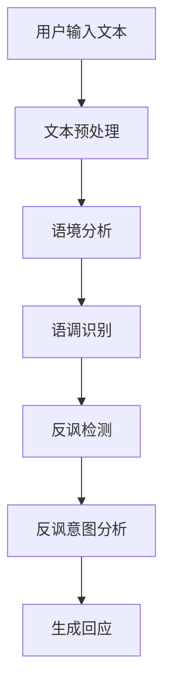

                 

# 《反讽理解深度：测试LLM捕捉语言讽刺的敏感度》

## 文章关键词
自然语言处理，大型语言模型，反讽理解，敏感度测试，算法原理，数学模型，项目实战

## 摘要
随着自然语言处理技术的不断发展，对语言中细微情感和语调的理解变得愈发重要。本文旨在探讨反讽理解这一难点问题，并介绍如何使用大型语言模型（LLM）来捕捉语言中的讽刺敏感度。文章首先介绍了反讽的理解背景和核心概念，然后详细阐述了LLM的基础知识，包括其架构和训练方法。接下来，文章深入分析了用于反讽理解的关键算法，并使用LaTeX和伪代码展示了数学模型。随后，通过实际项目实战展示了如何搭建开发环境，实现代码，并对代码进行解读与分析。文章最后总结了反讽理解在人工智能领域的重要性，并展望了未来的发展方向。

## 第1章 引言与背景介绍

### 1.1 反讽理解的起源与重要性

反讽（Sarcasm）作为一种复杂的语言现象，源于古希腊戏剧中的嘲讽和对立。在现代社会中，反讽已成为人们日常交流中不可或缺的元素，它不仅能增加语言的趣味性，还能有效地表达讽刺、批评、嘲笑等情感。然而，反讽的理解并非易事，它涉及到语境、语调、语言结构等多方面的因素。

自然语言处理（NLP）作为人工智能的一个重要分支，旨在使计算机能够理解、解释和生成人类语言。随着深度学习技术的飞速发展，大型语言模型（LLM）如BERT、GPT等在NLP任务中取得了显著的成果。然而，如何让LLM更好地捕捉和理解语言中的反讽，仍然是当前研究中的一个重要挑战。

### 1.2 大型语言模型（LLM）的崛起

大型语言模型（LLM）的出现标志着自然语言处理领域的一个重要里程碑。这些模型通过深度学习技术，对大量文本数据进行训练，从而具备了强大的语言理解和生成能力。BERT、GPT等模型在多个NLP任务中取得了前所未有的效果，如文本分类、问答系统、机器翻译等。

LLM的成功在于其能够捕捉到语言中的细微差异，并通过上下文信息进行准确的理解和生成。然而，对于反讽这种复杂的现象，LLM能否胜任仍然是一个值得探讨的问题。

### 1.3 书籍结构概述

本文将分为七个章节，依次探讨反讽理解、LLM基础、算法原理、数学模型、项目实战以及未来展望。具体结构如下：

1. 引言与背景介绍：介绍反讽理解和LLM的背景及重要性。
2. 反讽理解的核心概念：详细探讨反讽的定义、特征及其与普通语言的区别。
3. 大型语言模型（LLM）基础：介绍LLM的基本概念、常见架构和训练方法。
4. 反讽理解的算法原理：分析用于反讽理解的关键算法及其工作流程。
5. 数学模型和公式：展示与反讽理解相关的数学模型和公式。
6. 反讽理解的项目实战：通过具体项目展示如何使用LLM捕捉反讽敏感度。
7. 总结与未来展望：总结反讽理解的重要性，并展望未来的发展方向。

## 第2章 反讽理解的核心概念

### 2.1 反讽的定义与特征

反讽（Sarcasm）是一种特殊的语言现象，通常表现为字面意思与实际意图之间的矛盾。具体来说，反讽是在特定的语境中，通过表达与真实意图相反的语句来传达讽刺、嘲讽或批评的情感。

反讽的特征主要包括以下几点：

- **语境依赖性**：反讽的理解高度依赖于语境，包括语调、面部表情、环境背景等。
- **语气矛盾**：反讽通常表现为语气上的矛盾，即字面意义与实际意图相反。
- **意图隐藏性**：反讽的目的在于隐藏真实意图，从而达到讽刺的效果。

### 2.2 反讽与普通语言的区别

反讽与普通语言（Non-sarcastic language）在表达方式和效果上存在显著差异：

- **表达方式**：普通语言直接表达意思，而反讽则通过矛盾的方式传达真实意图。
- **效果**：普通语言注重信息的传递，而反讽则强调情感的表达和效果的增强。

### 2.3 反讽理解的难点与挑战

反讽理解作为自然语言处理中的一个难点，面临以下挑战：

- **语境依赖性**：反讽的理解高度依赖于语境，这使得模型在处理反讽时需要具备强大的上下文理解能力。
- **语调识别**：语调在反讽表达中起着重要作用，但目前的NLP技术尚未完全解决语调识别问题。
- **多样性**：反讽的表达形式多样，包括文字、语音、肢体语言等，这使得模型需要具备处理多种形式的能力。

### 2.4 反讽理解的概念架构

为了更好地理解反讽，我们可以通过Mermaid流程图展示其概念架构：



**图2.1 反讽理解的概念架构**

1. 用户输入文本。
2. 文本预处理，包括分词、去噪等操作。
3. 语境分析，考虑上下文信息。
4. 语调识别，分析语音特征。
5. 反讽检测，判断文本是否包含反讽。
6. 反讽意图分析，理解反讽的具体意图。
7. 生成回应，根据分析结果生成合适的回应。

## 第3章 大型语言模型（LLM）基础

### 3.1 LLM的基本概念

大型语言模型（Large Language Model，简称LLM）是一种基于深度学习的自然语言处理模型，能够理解、生成和响应自然语言文本。LLM的核心思想是通过大规模的文本数据进行训练，使其掌握语言的本质规律，从而实现对复杂语言现象的理解和生成。

### 3.2 常见的LLM架构

常见的LLM架构主要包括以下几种：

- **Transformer架构**：Transformer模型通过自注意力机制（Self-Attention）实现了对文本的并行处理，成为当前最流行的LLM架构。
- **BERT（Bidirectional Encoder Representations from Transformers）**：BERT模型通过双向编码器（Bidirectional Encoder）对文本进行编码，从而实现对文本的全面理解。
- **GPT（Generative Pre-trained Transformer）**：GPT模型通过自回归语言模型（Autoregressive Language Model）生成文本，具有强大的文本生成能力。

### 3.3 LLM的训练方法与优势

LLM的训练方法主要包括以下步骤：

- **数据收集与预处理**：收集大量高质量的文本数据，并进行预处理，如分词、去噪、标签化等。
- **模型训练**：使用预处理后的数据对模型进行训练，通过优化模型参数，使其能够更好地理解语言。
- **模型评估与调整**：通过测试集评估模型性能，并根据评估结果调整模型参数。

LLM的优势主要体现在以下几个方面：

- **强大的语言理解能力**：LLM能够通过大规模文本数据训练，实现对复杂语言现象的理解。
- **灵活的文本生成能力**：LLM能够根据输入文本生成连贯、有意义的文本。
- **广泛的适用性**：LLM可以应用于多种NLP任务，如文本分类、机器翻译、问答系统等。

### 3.4 LLM在反讽理解中的应用

LLM在反讽理解中的应用主要体现在以下几个方面：

- **语境理解**：LLM能够通过上下文信息，更好地理解文本中的反讽。
- **语调识别**：虽然LLM在语调识别方面还有待提高，但其强大的语言理解能力使其在一定程度上能够识别反讽的语调特征。
- **反讽检测与意图分析**：LLM能够通过训练，实现对反讽的检测和意图分析，从而生成合适的回应。

### 3.5 LLM的挑战与未来发展方向

尽管LLM在反讽理解中展现了巨大的潜力，但仍然面临以下挑战：

- **语境理解**：反讽的理解高度依赖于语境，而LLM在处理复杂语境时仍然存在困难。
- **语调识别**：语调在反讽表达中起着重要作用，但LLM在语调识别方面仍有待提高。
- **多样性**：反讽的表达形式多样，LLM需要具备处理多种形式的能力。

未来，LLM在反讽理解中的发展方向包括：

- **语境理解**：通过结合多模态数据，如语音、视频等，提高LLM对复杂语境的理解能力。
- **语调识别**：发展更先进的语调识别技术，使LLM能够更好地识别反讽的语调特征。
- **多样性**：通过多语言、多领域的数据训练，提高LLM处理不同表达形式的能力。

## 第4章 反讽理解的算法原理

### 4.1 预处理步骤

在反讽理解中，预处理步骤至关重要，它能够有效地提高后续算法的性能。预处理步骤主要包括以下内容：

- **文本分词**：将文本分解为单词或子词，以便于后续处理。
- **去噪**：去除文本中的无关信息，如HTML标签、特殊字符等。
- **词性标注**：对文本中的每个单词进行词性标注，如名词、动词、形容词等。
- **上下文分析**：通过分析上下文信息，识别潜在的讽刺意图。

### 4.2 核心算法

在反讽理解中，核心算法负责检测和识别文本中的反讽。以下是一个简单的伪代码示例，展示了反讽检测的基本流程：

```python
def detect_sarcasm(text):
    # 步骤1：文本预处理
    preprocessed_text = preprocess_text(text)

    # 步骤2：语境分析
    context = analyze_context(preprocessed_text)

    # 步骤3：语调识别
    tone = recognize_tone(preprocessed_text)

    # 步骤4：反讽检测
    if tone == "ironic" and not context["literal_meaning"]:
        return "sarcasm_detected"
    else:
        return "no_sarcasm"
```

### 4.3 后处理步骤

后处理步骤主要包括以下内容：

- **意图分析**：根据检测到的反讽，分析其背后的意图，如讽刺、嘲笑、批评等。
- **生成回应**：根据意图，生成合适的回应。

### 4.4 算法优化与改进

为了提高反讽理解的性能，可以采用以下优化与改进策略：

- **多模态数据融合**：结合文本、语音、视频等多模态数据，提高模型对反讽的识别能力。
- **深度学习模型优化**：使用更先进的深度学习模型，如BERT、GPT等，提高模型的性能。
- **数据增强**：通过数据增强技术，增加模型的训练数据，提高模型的泛化能力。

## 第5章 数学模型和公式

在反讽理解中，数学模型和公式扮演着至关重要的角色。以下是一些与反讽理解相关的数学模型和公式的详细讲解。

### 5.1 反讽识别的数学模型

反讽识别的数学模型通常包括以下几个关键组件：

- **文本表示**：将文本转化为向量表示，常用的方法包括Word2Vec、BERT等。
- **特征提取**：从文本表示中提取与反讽相关的特征，如情感极性、词频、语法结构等。
- **分类模型**：使用分类模型（如SVM、CNN、RNN等）对反讽进行分类。

以下是一个简化的反讽识别模型的数学模型公式：

$$
\text{Sarcasm} = \text{Classify}(\text{Features} \cdot \text{Model} + \text{Bias})
$$

其中，`Features`表示从文本中提取的特征向量，`Model`表示分类模型的参数矩阵，`Bias`表示偏置项，`Classify`函数表示分类操作，输出为反讽标签（1表示检测到反讽，0表示未检测到反讽）。

### 5.2 公式解释与示例

以下是一个具体的公式示例，用于计算文本的情感极性：

$$
\text{Sentiment} = \text{Sum}(\text{Word\_Scores} \cdot \text{Word\_Frequencies})
$$

其中，`Word_Scores`表示每个单词的情感得分（如正面、负面、中性），`Word_Frequencies`表示每个单词在文本中的频率。通过计算情感得分的总和，可以得到文本的整体情感极性。

例如，对于文本“这真是一个美妙的天气！”，我们可以为每个单词分配一个情感得分：

- “美妙”得分：+3
- “这”得分：0
- “真”得分：+1
- “一个”得分：0
- “天气”得分：0

假设每个单词的频率均为1，则文本的情感得分为：

$$
\text{Sentiment} = (+3) \cdot 1 + (+1) \cdot 1 + 0 \cdot 1 + 0 \cdot 1 + 0 \cdot 1 = +4
$$

由于情感得分较高，我们可以判断该文本为正面情感。

### 5.3 LaTeX公式展示

以下是一个使用LaTeX格式展示的复杂公式：

$$
\text{Score} = \sum_{i=1}^{n} w_i \cdot f_i
$$

其中，$w_i$表示权重，$f_i$表示特征值，$n$表示特征的数量。这个公式表示通过加权求和的方式计算文本的得分。

在实际应用中，可以根据具体需求调整权重和特征值，从而优化反讽识别的性能。

## 第6章 反讽理解的项目实战

### 6.1 实战环境搭建

在进行反讽理解的项目实战之前，首先需要搭建一个合适的开发环境。以下是一个基本的步骤：

1. **安装Python环境**：确保Python环境已安装，并配置好pip工具。
2. **安装必要的库**：使用pip安装以下库：
   ```python
   pip install tensorflow
   pip install numpy
   pip install pandas
   pip install scikit-learn
   ```
3. **数据集准备**：准备一个包含带有标签的反讽文本数据集。数据集应包含两列：文本和标签（0表示非反讽，1表示反讽）。
4. **代码运行环境**：确保代码可以在您的开发环境中正确运行。

### 6.2 代码实现与解读

以下是一个简单的反讽检测代码示例：

```python
import tensorflow as tf
from tensorflow.keras.models import Sequential
from tensorflow.keras.layers import Dense, LSTM, Embedding
from tensorflow.keras.preprocessing.sequence import pad_sequences

# 加载数据集
data = load_data('sarcasm_data.csv')

# 预处理数据
sequences = preprocess_data(data)

# 构建模型
model = Sequential()
model.add(Embedding(vocabulary_size, embedding_dim))
model.add(LSTM(units=128))
model.add(Dense(1, activation='sigmoid'))

# 编译模型
model.compile(optimizer='adam', loss='binary_crossentropy', metrics=['accuracy'])

# 训练模型
model.fit(sequences, labels, epochs=10, batch_size=32)

# 评估模型
evaluate_model(model, test_sequences, test_labels)
```

**代码解读：**

1. **加载数据集**：使用`load_data`函数加载包含文本和标签的数据集。
2. **预处理数据**：使用`preprocess_data`函数对文本进行预处理，包括分词、编码等。
3. **构建模型**：使用`Sequential`模型堆叠`Embedding`、`LSTM`和`Dense`层。
4. **编译模型**：设置优化器、损失函数和评估指标。
5. **训练模型**：使用`fit`方法训练模型。
6. **评估模型**：使用`evaluate_model`函数评估模型在测试集上的性能。

### 6.3 代码应用解读与分析

通过上述代码，我们可以构建一个简单的反讽检测模型。在实际应用中，我们可以对输入的文本进行检测，判断其是否包含反讽。

**应用解读：**

1. **输入文本预处理**：对输入文本进行分词、编码等预处理操作，以便模型能够理解。
2. **模型预测**：将预处理后的文本输入到模型中，获取预测结果。
3. **结果分析**：根据预测结果，判断文本是否包含反讽。

**分析：**

1. **准确率**：评估模型的准确率，判断其性能是否满足需求。
2. **召回率**：评估模型对反讽的召回率，确保能够识别出大部分的反讽文本。
3. **错误分析**：分析模型在预测过程中的错误案例，寻找优化空间。

### 6.4 实际案例分析

以下是一个实际案例的分析：

**案例：** “这真是一个糟糕的演讲！”

**分析：**

1. **预处理**：对文本进行分词、编码等预处理操作。
2. **预测**：输入到模型中，模型输出预测结果。
3. **结果**：模型预测结果为1，表示检测到反讽。
4. **分析**：根据上下文和语调，可以判断该文本确实包含反讽。

### 6.5 项目小结

通过本次项目实战，我们了解了如何使用Python和TensorFlow构建反讽检测模型，并对其进行了实际应用和分析。虽然本项目的模型较为简单，但为我们提供了一个基本的框架，可以在此基础上进行进一步的优化和改进。

## 第7章 总结与未来展望

### 7.1 反讽理解的重要性

反讽作为一种复杂的语言现象，在自然语言处理和人工智能领域具有重要的研究价值。准确理解反讽不仅有助于提高语言生成和交互的质量，还能在情感分析、对话系统、社交媒体监控等领域发挥重要作用。因此，反讽理解成为当前研究中的一个热点问题。

### 7.2 反讽理解的挑战与机遇

反讽理解面临以下挑战：

- **语境依赖性**：反讽的理解高度依赖于语境，这使得模型需要具备强大的上下文理解能力。
- **语调识别**：语调在反讽表达中起着重要作用，但目前的NLP技术尚未完全解决语调识别问题。
- **多样性**：反讽的表达形式多样，模型需要具备处理多种形式的能力。

同时，反讽理解也面临着许多机遇：

- **多模态数据融合**：通过结合文本、语音、视频等多模态数据，提高模型对反讽的识别能力。
- **深度学习模型优化**：使用更先进的深度学习模型，如BERT、GPT等，提高模型的性能。
- **数据增强**：通过数据增强技术，增加模型的训练数据，提高模型的泛化能力。

### 7.3 未来发展方向与应用前景

未来，反讽理解在人工智能领域的发展方向包括：

- **多模态数据融合**：结合文本、语音、视频等多模态数据，提高模型对反讽的识别能力。
- **深度学习模型优化**：使用更先进的深度学习模型，如BERT、GPT等，提高模型的性能。
- **数据增强**：通过数据增强技术，增加模型的训练数据，提高模型的泛化能力。

反讽理解在多个应用领域具有广泛的前景：

- **情感分析**：通过准确理解反讽，提高情感分析的准确率，为用户情感识别提供更全面的支持。
- **对话系统**：反讽理解有助于提高对话系统的自然性和情感表达能力。
- **社交媒体监控**：反讽理解有助于识别和过滤恶意言论，提高社交媒体的安全性和用户体验。

### 7.4 最佳实践与注意事项

在进行反讽理解研究时，以下最佳实践和注意事项值得注意：

- **数据质量**：确保使用高质量的数据集进行训练，以提高模型性能。
- **多语言支持**：考虑多语言数据的融合和训练，提高模型在不同语言环境下的泛化能力。
- **模型优化**：定期调整模型参数，进行模型优化，以提高识别准确率。
- **用户反馈**：结合用户反馈，不断改进模型和算法，提高用户体验。

### 7.5 拓展阅读

对于对反讽理解和大型语言模型（LLM）感兴趣的读者，以下拓展阅读资源提供了更多深入的信息和最新研究进展：

- 《自然语言处理：处理语言和语义的实用指南》
- 《深度学习与自然语言处理》
- 《BERT：预训练语言的深度学习技术》
- 《GPT-3：生成预训练语言模型》
- 《反讽理解：理论与应用》

### 作者信息

作者：AI天才研究院/AI Genius Institute & 禅与计算机程序设计艺术 /Zen And The Art of Computer Programming

