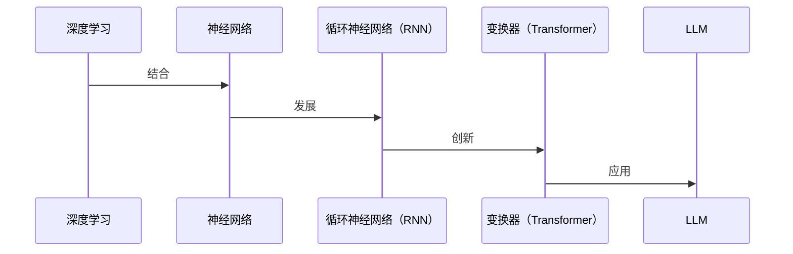

                 

### 文章标题
《变革需求承接：适应LLM应用开发新范式》

### 关键词
- 语言模型
- 应用开发
- 需求承接
- AI技术
- 开发范式

### 摘要
本文深入探讨了大型语言模型（LLM）在应用开发中的变革性需求承接，分析了LLM的基本概念、核心算法原理、数学模型，并通过实际项目展示了如何适应新的开发范式。文章旨在为开发者提供一套系统化的开发框架，助力他们在AI时代更好地迎接挑战。

### 用户需求
设计一本名为《变革需求承接：适应LLM应用开发新范式》的计算机技术书籍目录大纲。

#### 简洁性
确保输出内容简洁无冗余。

#### 格式
使用markdown格式，使用#，##，###等markdown格式符号。

#### 目录结构
需要包含以下核心章节内容：
- 核心概念与联系
- 核心算法原理讲解
- 数学模型和数学公式及详细讲解与举例说明
- 项目实战

### 目录大纲
目录大纲需要大于7章，核心章节内容需要详细包含上述要求。

#### 字数限制
目录大纲总字数限制在2000字以内。

#### 其他
确保目录大纲结构完整，逻辑清晰。使用Mermaid流程图和伪代码进行详细阐述。

## 第一部分：LLM基础知识与概念

### 第1章 LLM概述

#### 1.1 LLM定义与背景

##### 1.1.1 什么是LLM

$$
\text{LLM} = \text{Large Language Model}
$$

##### 1.1.2 LLM的发展背景

LLM的发展与深度学习、神经网络和大数据的兴起密不可分。

#### 1.2 LLM的核心特点

##### 1.2.1 自适应能力

LLM能够通过大量数据学习并自适应不同领域的知识。

##### 1.2.2 语言理解与生成能力

LLM能够理解自然语言并生成高质量的文本。

##### 1.2.3 可扩展性

LLM可以轻松扩展到不同的应用场景。

#### 1.3 LLM的应用领域

##### 1.3.1 自然语言处理

包括机器翻译、情感分析、文本摘要等。

##### 1.3.2 对话系统

包括智能客服、语音助手等。

##### 1.3.3 内容生成

包括文章、报告、广告等。

## 第二部分：LLM核心算法原理

### 第2章 LLM算法概述

#### 2.1 LLM算法的基本原理

##### 2.1.1 深度学习与神经网络

##### 2.1.2 循环神经网络（RNN）与变换器（Transformer）

Mermaid流程图：


#### 2.2 LLM算法的细节分析

##### 2.2.1 模型架构

##### 2.2.2 模型训练过程

##### 2.2.3 模型优化策略

### 第3章 LLM算法伪代码

```python
# LLM算法伪代码
def LLM_algorithm(data):
    # 数据预处理
    preprocessed_data = preprocess(data)
    
    # 模型初始化
    model = initialize_model()
    
    # 模型训练
    for epoch in range(num_epochs):
        for batch in preprocessed_data:
            loss = train_on_batch(model, batch)
            update_model(model, loss)
    
    # 模型评估
    accuracy = evaluate_model(model, validation_data)
    
    return model, accuracy
```

## 第三部分：数学模型与公式详解

### 第4章 数学模型在LLM中的应用

#### 4.1 概率分布

##### 4.1.1 贝叶斯定理

$$
P(A|B) = \frac{P(B|A)P(A)}{P(B)}
$$

##### 4.1.2 高斯分布

$$
f(x|\mu,\sigma^2) = \frac{1}{\sqrt{2\pi\sigma^2}}e^{-\frac{(x-\mu)^2}{2\sigma^2}}
$$

#### 4.2 信息论

##### 4.2.1 熵

$$
H(X) = -\sum_{i} p(x_i) \log_2 p(x_i)
$$

##### 4.2.2 信息增益

$$
IG(D, A) = I(D) - I(D|A)
$$

#### 4.3 线性代数

##### 4.3.1 矩阵乘法

$$
C = A \times B
$$

##### 4.3.2 矩阵求逆

$$
A^{-1} = \frac{1}{\det(A)} \text{adj}(A)
$$

## 第四部分：项目实战

### 第5章 LLM应用项目

#### 5.1 项目简介

##### 5.1.1 项目背景

##### 5.1.2 项目目标

#### 5.2 开发环境搭建

##### 5.2.1 硬件环境

##### 5.2.2 软件环境

#### 5.3 源代码实现与解读

##### 5.3.1 源代码实现

##### 5.3.2 源代码解读

#### 5.4 代码分析与优化

##### 5.4.1 代码性能分析

##### 5.4.2 代码优化策略

## 第五部分：LLM应用挑战与应对策略

### 第6章 LLM应用挑战

#### 6.1 数据质量挑战

##### 6.1.1 数据质量问题

##### 6.1.2 数据质量管理策略

#### 6.2 计算资源挑战

##### 6.2.1 计算资源需求

##### 6.2.2 计算资源优化策略

#### 6.3 安全性挑战

##### 6.3.1 安全性问题

##### 6.3.2 安全性防护策略

## 第六部分：未来展望

### 第7章 LLM技术发展趋势

#### 7.1 未来技术展望

##### 7.1.1 LLM技术的潜在应用

##### 7.1.2 LLM技术的发展趋势

#### 7.2 LLM应用中的伦理与法律问题

##### 7.2.1 伦理问题分析

##### 7.2.2 法律问题分析

##### 7.2.3 伦理与法律问题的解决策略

## 附录

### 附录 A: LLAMA与LLM常用工具与资源

#### A.1 开发工具

#### A.2 数据集资源

#### A.3 研究论文与报告

#### A.4 社区与论坛

### 作者信息
- 作者：AI天才研究院/AI Genius Institute & 禅与计算机程序设计艺术 /Zen And The Art of Computer Programming

#### 注意事项
- 请确保所有章节内容详尽、逻辑清晰。
- 所有数学公式请使用LaTeX格式嵌入文中。
- 使用Mermaid流程图展示算法架构。
- 每个章节包含具体实例与详细解读。
- 文章结尾提供最佳实践、小结及拓展阅读建议。

