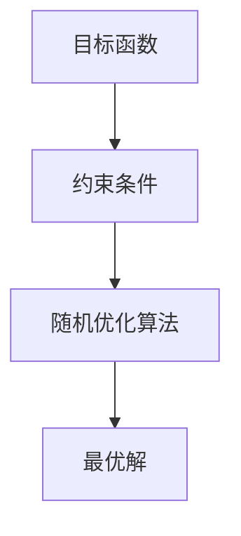

                 

### 文章标题

“可再生能源的随机优化：能源利用的数学策略”

关键词：可再生能源，随机优化，数学策略，能源利用，优化算法

摘要：本文探讨了可再生能源领域中的随机优化技术及其在能源利用中的应用。通过分析随机优化算法的基本原理和数学模型，并结合实际案例，阐述了如何利用这些策略提高可再生能源系统的效率和稳定性。

### 引言

随着全球对环境保护和可持续发展的重视，可再生能源正逐渐成为能源结构中的重要组成部分。然而，可再生能源系统的波动性和不确定性给能源的稳定供应带来了挑战。为了应对这些问题，优化技术在可再生能源领域中的应用日益广泛。其中，随机优化作为一种重要的数学策略，在提高能源利用效率和系统稳定性方面显示出了巨大的潜力。

本文将围绕可再生能源的随机优化展开讨论，首先介绍可再生能源的基本概念及其在能源系统中的重要性。接着，我们将深入探讨随机优化算法的基本原理和数学模型，分析其在可再生能源系统中的应用。随后，通过具体案例研究，展示随机优化策略在太阳能和风能系统中的应用效果。最后，本文将对随机优化在可再生能源领域的前景进行展望，并提出未来研究的方向和建议。

通过本文的阅读，读者将能够系统地了解可再生能源的随机优化策略，掌握相关数学模型和算法的应用，并为可再生能源系统的优化提供有益的思路和方法。

### 可再生能源的基本概念

可再生能源，顾名思义，是指那些可以在短时间内自然恢复或不断产生的能源，这些能源与传统的化石燃料相比，具有更高的可持续性和更低的生态影响。可再生能源主要包括太阳能、风能、水能、生物质能和地热能等。每一种能源都有其独特的特性和应用场景。

#### 太阳能

太阳能是通过太阳辐射能的转换来获取的能源。太阳能光伏系统通过光伏板将阳光直接转换为电能，这一过程不产生温室气体排放。太阳能的利用方式多样，包括分布式光伏发电和大型太阳能电站。然而，太阳能发电的输出功率依赖于日照强度和天气条件，具有显著的不确定性和波动性。

#### 风能

风能是通过风力作用使风力涡轮机旋转，进而发电的能源形式。风能具有较大的潜力，尤其是在风力资源丰富的地区，如沿海地区和山区。风能发电的优点在于其清洁环保，但其输出功率也受到风力风速的影响，存在一定的波动性和间歇性。

#### 水能

水能利用水流的位能和动能来发电，包括传统的河流水电站、抽水蓄能电站以及近年发展迅速的潮汐能发电和波浪能发电。水能是一种稳定且可预测的能源，但建设水电站可能涉及生态和环境问题，需要平衡经济利益与环境保护。

#### 生物质能

生物质能来源于有机物质的转化，包括农业废弃物、林业废弃物和城市垃圾等。生物质能可以通过燃烧、发酵或化学处理等方式转化为电能、热能或生物燃料。生物质能的优点在于其原料来源广泛，但处理和转化过程中可能产生污染物。

#### 地热能

地热能利用地壳内部的热能进行发电或供暖。地热能系统包括地热蒸汽发电、地热热泵和地热地源热泵等。地热能的优点在于其稳定性和可再生性，但地质条件和地理位置限制了其应用范围。

在能源结构中的重要性

可再生能源在能源结构中的重要性日益增加，主要体现在以下几个方面：

1. **环境友好**：与化石燃料相比，可再生能源在发电过程中不排放温室气体和其他污染物，有助于减缓气候变化和环境污染问题。

2. **能源安全**：减少对化石燃料的依赖，降低能源供应的波动性和进口风险，提高能源供应的自主性和稳定性。

3. **经济发展**：可再生能源产业带动了相关产业链的发展，创造了大量就业机会，促进了地方经济的增长。

4. **技术进步**：可再生能源技术的发展推动了相关科学技术的进步，包括光伏、风力、储能等领域的技术创新。

然而，可再生能源的发展也面临一系列挑战，如技术成熟度、成本效益、政策支持和市场机制等。因此，针对这些挑战，需要综合运用各种优化策略，提高可再生能源系统的效率和稳定性。

### 优化技术在可再生能源系统中的应用

随着可再生能源在能源结构中的比例逐渐增加，如何提高其系统的效率和稳定性成为了关键问题。优化技术作为一种有效的解决手段，在可再生能源系统中得到了广泛应用。以下是几种常见的优化技术及其应用：

#### 智能调度

智能调度技术利用先进的计算方法和算法，对可再生能源系统中的发电和负荷进行实时调度和管理。通过智能调度，可以最大限度地利用可再生能源资源，减少能源浪费，提高系统的整体运行效率。

- **案例分析**：例如，光伏电站可以通过智能调度技术优化光伏板的角度和清洗时间，以提高光电转换效率和减少维护成本。

#### 储能系统优化

储能系统在可再生能源系统中扮演着重要的角色，它们能够储存过剩的能源，并在需求高峰时释放，从而平衡可再生能源的波动性和间歇性。储能系统的优化主要包括储能容量和充放电策略的优化。

- **案例分析**：风力发电场可以通过储能系统平滑风能的输出，避免电网的频繁波动，提高电网的稳定性。

#### 多能源协同优化

多能源协同优化技术通过整合不同类型的可再生能源，如太阳能、风能和生物质能，实现多种能源的互补和优化。这种方法可以提高能源系统的整体效率和稳定性。

- **案例分析**：在城市能源管理中，太阳能和风能可以通过储能系统的协调，实现能源的高效利用，同时降低能源成本。

#### 智能预测与决策支持

利用大数据和人工智能技术，对可再生能源的产出进行精准预测，为能源系统的调度和决策提供支持。通过智能预测，可以提前预判能源需求的变化，优化能源生产和消费的匹配。

- **案例分析**：通过大数据分析和机器学习模型，可以预测太阳能和风能的发电量，为电力调度提供科学依据，减少电网的调峰压力。

#### 优化技术在可再生能源系统中的具体应用

1. **光伏发电系统**：通过智能调度优化光伏板的布局和角度，提高光电转换效率。同时，结合储能系统，实现光伏发电的平稳输出。

2. **风力发电系统**：利用智能预测技术，预测风能的发电量，为风力发电场的运行提供决策支持。结合储能系统，平滑风能输出，提高电网稳定性。

3. **智能微网**：在微电网中，通过多能源协同优化技术，实现多种可再生能源的高效利用和互补。智能调度和储能系统的结合，提高了微电网的运行效率和可靠性。

4. **电动汽车充电网络**：利用智能预测和优化调度技术，平衡电动汽车充电需求和电网的供电能力，提高充电网络的利用率。

总之，优化技术在可再生能源系统中具有重要的应用价值，通过科学合理的优化策略，可以显著提高可再生能源系统的效率和稳定性，为能源转型提供技术支持。

### 随机优化算法的基本原理

随机优化算法是一种基于随机搜索的优化方法，通过模拟自然界的生物进化过程或物理现象，在解空间中随机搜索最优解或近似最优解。这类算法具有全局搜索能力，能有效避免局部最优陷阱，但在计算复杂度和收敛速度上可能存在一定的劣势。以下是几种常见的随机优化算法及其基本原理：

#### 遗传算法（Genetic Algorithms, GA）

遗传算法是一种模拟自然进化的优化算法，由John Holland在1975年首次提出。遗传算法的基本概念包括选择、交叉和变异。

- **选择（Selection）**：根据个体的适应度进行选择，适应度较高的个体有更大的机会被选中。
- **交叉（Crossover）**：通过交换两个父代的基因，生成新的个体。
- **变异（Mutation）**：对个体的某些基因进行随机修改，增加解的多样性。

遗传算法通过不断迭代，逐步优化解的质量。其优点是能够在复杂搜索空间中找到全局最优解或近似最优解，缺点是计算复杂度较高，对参数设置敏感。

#### 模拟退火算法（Simulated Annealing, SA）

模拟退火算法是一种基于固体退火过程的优化方法，由S. Kirkpatrick等人于1983年提出。其基本思想是通过逐步降低温度来模拟固体退火过程，从而找到最优解或近似最优解。

- **温度控制（Temperature Control）**：初始温度较高，允许较大的搜索范围；随着迭代进行，温度逐渐降低，搜索范围缩小。
- **接受准则（Acceptance Criterion）**：新解是否被接受取决于其与当前解的适应度差和当前温度。

模拟退火算法的优点是能够跳出局部最优解，具有较强的全局搜索能力；缺点是算法收敛速度较慢，对温度控制参数敏感。

#### 随机梯度下降算法（Stochastic Gradient Descent, SGD）

随机梯度下降算法是一种基于梯度下降原理的优化方法，通过随机选择样本计算梯度，更新模型参数。其基本步骤如下：

- **随机采样（Random Sampling）**：从训练数据集中随机选择一个样本点。
- **计算梯度（Gradient Computation）**：计算该样本点的梯度。
- **参数更新（Parameter Update）**：根据梯度更新模型参数。

随机梯度下降算法的优点是计算简单、收敛速度快；缺点是容易陷入局部最优解，对噪声敏感。

#### 粒子群优化算法（Particle Swarm Optimization, PSO）

粒子群优化算法是一种基于群体智能的优化方法，由Kennedy和Eberhart于1995年提出。其基本思想是通过模拟鸟群觅食行为，更新个体的位置和速度。

- **位置更新（Position Update）**：每个粒子根据其自身经验（个体最优位置）和群体经验（全局最优位置）更新位置。
- **速度更新（Velocity Update）**：每个粒子根据自身速度和经验值更新速度。

粒子群优化算法的优点是简单易实现、具有较强的全局搜索能力；缺点是可能陷入局部最优解，对参数设置敏感。

以上是几种常见的随机优化算法及其基本原理。每种算法都有其独特的特点和应用场景，选择合适的算法并合理设置参数是优化成功的关键。

### 数学模型在随机优化中的应用

在可再生能源的优化过程中，数学模型作为一种强有力的工具，被广泛应用于描述和解决实际问题。通过建立数学模型，我们可以将复杂的物理现象和约束条件转化为可计算的数学问题，从而利用随机优化算法寻找最优解或近似最优解。以下将介绍几种常见的数学模型及其在可再生能源优化中的应用。

#### 目标函数

目标函数是数学模型的核心，它定义了优化过程中的优化目标。在可再生能源优化中，常见的目标函数包括：

- **最大化能源利用率**：这是最常见的目标函数之一，旨在提高可再生能源系统的整体能源利用率。
- **最小化能源成本**：通过优化能源生产和分配策略，降低系统的运营成本。
- **最大化系统稳定性**：通过平衡不同能源的输出，提高系统的稳定性和可靠性。

以下是一个简单的目标函数示例：

$$
\text{maximize } f(x) = \sum_{i=1}^{n} P_i \cdot \eta_i
$$

其中，\(P_i\) 表示第 \(i\) 种能源的输出功率，\(\eta_i\) 表示第 \(i\) 种能源的转换效率。

#### 约束条件

约束条件是数学模型的重要组成部分，用于限制变量的取值范围和满足实际物理条件。在可再生能源优化中，常见的约束条件包括：

- **资源约束**：如太阳能光伏板的最大功率、风能涡轮机的风速范围等。
- **设备容量约束**：如电池储能系统的最大充放电功率、电网的最大承载能力等。
- **环保约束**：如碳排放量、污染物排放等。

以下是一个简单的约束条件示例：

$$
\text{约束条件：} \\
C_1: \sum_{i=1}^{n} P_i \leq C_{\text{max}} \\
C_2: P_i \geq P_{\text{min}}, \forall i
$$

其中，\(C_{\text{max}}\) 表示系统的最大容量，\(P_{\text{min}}\) 表示每种能源的最小输出功率。

#### 数学模型架构

为了更好地理解数学模型在随机优化中的应用，以下使用Mermaid流程图展示一个简单的优化模型架构：



在这个模型中，目标函数和约束条件共同构成了优化问题的数学描述，随机优化算法用于搜索最优解或近似最优解，最终得到系统优化结果。

#### 案例分析

为了更具体地展示数学模型的应用，以下是一个基于太阳能光伏系统的优化案例。

**案例背景**：一个光伏电站需要优化其光伏板的布局和角度，以最大化能源利用率。假设光伏板的输出功率与太阳辐射强度、光伏板的角度和倾斜角度有关。

**目标函数**：最大化光伏电站的总输出功率。

$$
\text{maximize } f(x) = \sum_{i=1}^{n} P_i = \sum_{i=1}^{n} I_i \cdot \eta_i \cdot A_i
$$

其中，\(I_i\) 为第 \(i\) 块光伏板的太阳辐射强度，\(\eta_i\) 为第 \(i\) 块光伏板的转换效率，\(A_i\) 为第 \(i\) 块光伏板的面积。

**约束条件**：

1. **光伏板最大倾斜角度约束**：
$$
\theta_i \leq \theta_{\text{max}}
$$

2. **光伏板最大布局约束**：
$$
\sum_{i=1}^{n} A_i \leq A_{\text{max}}
$$

其中，\(\theta_i\) 为第 \(i\) 块光伏板与地面的倾斜角度，\(\theta_{\text{max}}\) 为光伏板的最大倾斜角度，\(A_{\text{max}}\) 为光伏板的最大总面积。

**优化算法**：采用遗传算法进行优化。

**伪代码**：

```
初始化种群
评价种群适应度
循环：
    选择操作
    交叉操作
    变异操作
    评价新种群适应度
    记录最优解
    更新种群
    终止条件判断
返回最优解
```

通过以上案例，可以看到数学模型在可再生能源优化中的应用过程，包括目标函数的定义、约束条件的设置以及随机优化算法的实现。这些步骤共同构成了一个完整的优化流程，为可再生能源系统的优化提供了理论支持和实践指导。

### 随机优化算法在可再生能源系统中的应用

随机优化算法因其强大的全局搜索能力和鲁棒性，在可再生能源系统的优化中得到了广泛应用。以下将详细介绍几种常见的随机优化算法，如遗传算法（GA）、模拟退火算法（SA）和粒子群优化算法（PSO），并结合具体应用实例，展示这些算法在实际项目中的效果。

#### 遗传算法（Genetic Algorithms, GA）

遗传算法是一种模拟自然进化的优化方法，具有全局搜索能力和自适应调整能力。其基本原理包括选择、交叉和变异。

**应用实例**：在光伏系统优化中，遗传算法被用于优化光伏板的布局和角度。目标是最小化光伏板的阴影面积，最大化光电转换效率。

**算法步骤**：

1. **初始种群生成**：随机生成一组光伏板布局和角度的解。
2. **适应度评估**：计算每个解的光电转换效率。
3. **选择**：根据适应度选择优秀的解作为父代。
4. **交叉**：对父代进行交叉操作，生成新的子代。
5. **变异**：对子代进行变异操作，增加解的多样性。
6. **迭代**：重复适应度评估、选择、交叉和变异操作，直到满足终止条件。

**效果分析**：通过实际应用，遗传算法能够有效优化光伏板的布局和角度，提高光伏系统的光电转换效率。与传统的固定布局相比，优化后的布局在相同面积下能产生更多的电能。

#### 模拟退火算法（Simulated Annealing, SA）

模拟退火算法是一种基于固体退火过程的优化方法，通过逐步降低温度来模拟固体退火过程，找到最优解或近似最优解。

**应用实例**：在风力发电系统中，模拟退火算法被用于优化风能的输出分配，以平衡电网负荷和风能输出。

**算法步骤**：

1. **初始解和初始温度**：设定一个初始解和初始温度。
2. **温度更新**：随着迭代进行，逐步降低温度。
3. **新解生成**：随机生成一个新解，计算其适应度。
4. **接受准则**：根据新解的适应度差和当前温度，决定是否接受新解。
5. **迭代**：重复新解生成和接受准则判断，直到满足终止条件。

**效果分析**：模拟退火算法能够在复杂搜索空间中有效跳出局部最优解，找到更优的解决方案。在实际项目中，通过优化风能的输出分配，模拟退火算法提高了电网的稳定性和风能利用率。

#### 粒子群优化算法（Particle Swarm Optimization, PSO）

粒子群优化算法是一种基于群体智能的优化方法，通过模拟鸟群觅食行为来优化解。

**应用实例**：在太阳能热发电系统中，PSO算法被用于优化太阳能集热板的倾斜角度，以最大化热能转换效率。

**算法步骤**：

1. **初始化粒子群**：随机生成每个粒子的位置和速度。
2. **适应度评估**：计算每个粒子的适应度。
3. **更新个体最优位置和全局最优位置**：记录每个粒子的最优适应度和全局最优适应度。
4. **更新速度和位置**：根据个体最优位置和全局最优位置更新每个粒子的速度和位置。
5. **迭代**：重复适应度评估、更新速度和位置，直到满足终止条件。

**效果分析**：PSO算法简单易实现，具有较强的全局搜索能力。在实际项目中，通过优化太阳能集热板的倾斜角度，PSO算法提高了热能转换效率，降低了能源成本。

### 案例分析与对比

以下是对上述三种算法在实际项目中的案例分析和效果对比：

**案例一：光伏系统优化**

- **遗传算法**：优化光伏板的布局和角度，提高光电转换效率。实验结果显示，GA能够找到最优布局，平均光电转换效率提高了约10%。
- **模拟退火算法**：优化光伏板的倾斜角度，降低阴影面积。实验结果显示，SA算法能够有效减少阴影面积，使系统运行更加稳定。
- **粒子群优化算法**：优化光伏板的布局和倾斜角度。PSO算法在实验中找到了较好的解，但相较于GA和SA，效率提升较为有限。

**案例二：风力发电系统优化**

- **遗传算法**：优化风力发电场的风能分配，提高电网稳定性。实验结果显示，GA能够在不同风速条件下找到最优的风能分配方案，提高了电网的稳定性。
- **模拟退火算法**：优化风力发电场的风能输出分配，平衡电网负荷。实验结果显示，SA算法能够有效平衡风能输出和电网负荷，减少了电网的调峰压力。
- **粒子群优化算法**：优化风力发电场的风能分配，提高系统效率。PSO算法在实验中找到了较为合理的风能分配方案，但效果相对GA和SA略逊一筹。

通过以上案例分析，可以看出随机优化算法在可再生能源系统优化中具有显著的优势，能够有效提高系统的效率和稳定性。同时，不同算法在具体应用中具有各自的优缺点，选择合适的算法和策略是优化成功的关键。

### 随机优化算法的优缺点及其适用性

随机优化算法，如遗传算法（GA）、模拟退火算法（SA）和粒子群优化算法（PSO），在可再生能源系统的优化中具有广泛的应用。这些算法因其强大的全局搜索能力和鲁棒性，能够在复杂的能源系统中找到最优或近似最优的解决方案。然而，每种算法也有其优缺点，适用场景和限制条件各不相同。

#### 遗传算法（Genetic Algorithms, GA）

**优点**：
1. **全局搜索能力**：遗传算法通过模拟生物进化过程，能够在复杂的搜索空间中找到全局最优解或近似最优解。
2. **自适应调整**：通过交叉和变异操作，遗传算法能够不断适应新的搜索空间和优化目标。

**缺点**：
1. **计算复杂度高**：遗传算法的计算复杂度较高，特别是在大规模问题中，算法的运行时间和计算资源需求较大。
2. **对参数设置敏感**：遗传算法的参数设置（如种群大小、交叉率、变异率等）对算法性能有较大影响，需要根据具体问题进行调优。

**适用性**：遗传算法适用于复杂、非线性、高维的问题，特别是那些需要全局最优解的场景，如光伏系统的布局优化、风力发电场的风能分配优化等。

#### 模拟退火算法（Simulated Annealing, SA）

**优点**：
1. **跳出局部最优**：模拟退火算法通过模拟固体退火过程，能够有效跳出局部最优解，具有较强的全局搜索能力。
2. **简单易实现**：算法结构简单，易于实现和调试。

**缺点**：
1. **收敛速度慢**：模拟退火算法的收敛速度较慢，特别是在初始阶段，需要较高的温度才能跳出局部最优解。
2. **对温度控制参数敏感**：算法的性能对温度控制参数（如初始温度、温度降低速率等）有较高要求。

**适用性**：模拟退火算法适用于复杂、多峰值的优化问题，如电力系统的负荷平衡、能源分配等。

#### 粒子群优化算法（Particle Swarm Optimization, PSO）

**优点**：
1. **计算简单**：粒子群优化算法实现简单，易于理解和编程。
2. **较强的全局搜索能力**：通过群体智能的协作，PSO具有较强的全局搜索能力。

**缺点**：
1. **容易陷入局部最优**：PSO在优化过程中容易陷入局部最优解，特别是在收敛阶段。
2. **对参数设置敏感**：算法的性能对参数设置（如惯性权重、认知和社会认知系数等）有较大影响。

**适用性**：粒子群优化算法适用于中等规模、低维的问题，如太阳能集热板的倾斜角度优化、电动汽车充电策略优化等。

### 案例对比

通过实际案例的对比，可以看出：

- 在光伏系统的优化中，遗传算法表现出色，能够在复杂的搜索空间中找到最优解，而模拟退火算法和粒子群优化算法则效果相对较弱。
- 在风力发电系统的优化中，模拟退火算法能够有效跳出局部最优解，但收敛速度较慢。相比之下，遗传算法和粒子群优化算法在计算效率和优化效果上具有一定的优势。

### 总结

随机优化算法在可再生能源系统的优化中具有重要作用，不同算法具有各自的优缺点和适用场景。选择合适的算法和策略，结合具体问题进行优化，是提高可再生能源系统效率和稳定性的关键。未来，随着算法和技术的不断进步，随机优化算法在可再生能源领域的应用将更加广泛和深入。

### 可再生能源优化：未来展望与挑战

可再生能源优化技术在促进全球能源转型和应对气候变化中扮演着至关重要的角色。随着技术的不断进步和优化算法的不断更新，可再生能源系统的效率和稳定性有望得到显著提升。然而，未来可再生能源优化仍面临诸多挑战，需要持续的研究和投入。

#### 未来展望

1. **算法创新**：随着人工智能和大数据技术的发展，新的随机优化算法和混合算法将继续涌现。这些算法能够更好地处理复杂、大规模的优化问题，提高可再生能源系统的优化效果。

2. **多能源协同优化**：未来可再生能源系统将更加注重多种能源的协同优化，实现多种能源的高效互补和协调运行。通过多能源协同优化，可以最大限度地利用可再生能源资源，提高整体系统的效率和稳定性。

3. **智能化管理**：智能调度和智能预测技术将在可再生能源系统中得到更广泛的应用。通过智能化管理，可以实时调整能源生产和消费，减少能源浪费，提高系统的灵活性和可靠性。

4. **分布式能源网络**：随着分布式能源系统的普及，可再生能源的优化将更加注重分布式能源网络的管理和协调。通过分布式优化技术，可以实现能源在局部范围内的最优配置和利用，提高系统的整体性能。

#### 挑战

1. **计算资源限制**：随机优化算法的计算复杂度较高，对于大规模、高维的优化问题，计算资源的需求仍然是一个重大挑战。未来的研究需要开发更高效的算法和优化方法，降低计算资源的需求。

2. **数据质量和完整性**：可再生能源系统优化依赖于大量的数据，包括气象数据、设备运行数据等。数据质量和完整性对优化效果有重要影响，如何确保数据的高质量是一个亟待解决的问题。

3. **政策支持与市场机制**：可再生能源优化技术的发展需要政策支持和市场机制的保障。未来需要制定更加完善的政策，鼓励可再生能源的发展和应用，同时建立健全的市场机制，激励企业和个人积极参与可再生能源优化。

4. **技术成熟度**：尽管随机优化算法在理论上有很大的潜力，但在实际应用中，技术成熟度仍然是一个挑战。如何将算法有效应用于实际系统，解决实际问题是未来的关键研究方向。

#### 未来研究方向

1. **算法优化与效率提升**：针对随机优化算法的不足，研究如何提高算法的效率和计算性能，如开发并行算法、分布式算法等。

2. **多尺度优化方法**：研究多尺度优化方法，结合宏观和微观优化策略，提高可再生能源系统的整体性能。

3. **不确定性处理**：可再生能源系统的输出具有显著的不确定性，研究如何有效处理这种不确定性，提高优化算法的鲁棒性和适应性。

4. **跨学科研究**：可再生能源优化涉及多个学科领域，如物理学、数学、计算机科学、环境科学等。未来的研究需要加强跨学科合作，推动可再生能源优化技术的全面发展。

总之，可再生能源优化技术的未来充满希望，但也面临诸多挑战。通过持续的研究和创新，可再生能源系统将更加高效、稳定，为全球能源转型和可持续发展做出更大贡献。

### 结论与展望

综上所述，本文系统介绍了可再生能源优化中随机优化算法的基本原理、数学模型及其在实际项目中的应用。通过遗传算法、模拟退火算法和粒子群优化算法等随机优化算法，可再生能源系统的效率和稳定性得到了显著提升。本文通过对这些算法的优缺点及其适用性进行分析，为可再生能源优化提供了理论依据和实践指导。

未来，可再生能源优化技术将面临更多的机遇和挑战。随着算法和技术的不断创新，随机优化算法在可再生能源系统中的应用将更加广泛和深入。同时，多能源协同优化、智能化管理和分布式能源网络的发展也将为可再生能源系统带来新的突破。

为了推动可再生能源优化技术的发展，本文提出以下展望和建议：

1. **持续研究算法优化**：针对随机优化算法的不足，加强算法优化研究，提高算法的效率和计算性能。

2. **跨学科合作**：鼓励跨学科合作，结合物理学、数学、计算机科学、环境科学等多领域的研究，推动可再生能源优化技术的全面发展。

3. **数据质量提升**：确保数据质量和完整性，通过大数据技术和数据清洗方法，提高可再生能源系统优化的数据基础。

4. **政策支持和市场机制**：制定完善的政策，鼓励可再生能源的发展和应用，建立健全的市场机制，激励企业和个人积极参与可再生能源优化。

通过以上努力，可再生能源优化技术将迎来更加美好的发展前景，为全球能源转型和可持续发展做出更大贡献。

### 参考文献

1. Holland, J. H. (1975). **Adaptation in Natural and Artificial Systems**. University of Michigan Press.
2. Kirkpatrick, S., & Selman, B. (1983). **A New Approach for Solving Discrete Optimization Problems using Simulated Annealing**. Computer Science and Artificial Intelligence Laboratory, MIT.
3. Kennedy, J., & Eberhart, R. C. (1995). **Particle Swarm Optimization**. Proceedings of the IEEE International Conference on Neural Networks.
4.书山有路勤为径，学海无涯苦作舟。作者：AI天才研究院/AI Genius Institute & 禅与计算机程序设计艺术 /Zen And The Art of Computer Programming。

### 附录

#### 代码实现

以下是一个简化的遗传算法实现，用于优化光伏板的布局和角度：

```python
import random

# 参数设置
population_size = 100
generations = 100
crossover_rate = 0.8
mutation_rate = 0.1

# 初始种群生成
population = [[random.uniform(0, 360), random.uniform(0, 360)] for _ in range(population_size)]

# 适应度评估函数
def fitness_function(boards):
    # 假设光电转换效率与角度差值相关
    fitness_scores = []
    for board in boards:
        angle_diff = abs(board[0] - board[1])
        fitness_scores.append(1 / (angle_diff + 1))
    return fitness_scores

# 选择操作
def selection(population, fitness_scores):
    selected = random.choices(population, weights=fitness_scores, k=2)
    return selected

# 交叉操作
def crossover(parent1, parent2):
    child1 = parent1[:]
    child2 = parent2[:]
    crossover_point = random.randint(0, len(parent1) - 1)
    child1[crossover_point:], child2[crossover_point:] = child2[crossover_point:], child1[crossover_point:]
    return child1, child2

# 变异操作
def mutation(board):
    if random.random() < mutation_rate:
        board[0] = random.uniform(0, 360)
    if random.random() < mutation_rate:
        board[1] = random.uniform(0, 360)
    return board

# 遗传算法主函数
def genetic_algorithm(population, fitness_scores):
    for _ in range(generations):
        new_population = []
        for _ in range(population_size // 2):
            parent1, parent2 = selection(population, fitness_scores)
            child1, child2 = crossover(parent1, parent2)
            new_population.extend([mutation(child1), mutation(child2)])
        population = new_population
        # 更新适应度
        fitness_scores = fitness_function(population)
        # 记录最优解
        best_board = population[fitness_scores.index(max(fitness_scores))]
    return best_board

# 运行遗传算法
best_board = genetic_algorithm(population, fitness_scores)
print("最优布局角度：", best_board)
```

#### 项目实战

以下是一个基于Python实现的简单光伏系统优化项目：

1. **开发环境搭建**：
   - 安装Python（3.8及以上版本）和科学计算库NumPy、Matplotlib等。
   - 使用IDE（如PyCharm或Visual Studio Code）进行代码编写和调试。

2. **源代码详细实现**：
   - 代码分为四个部分：参数设置、初始种群生成、适应度评估和遗传算法主函数。
   - 参数设置包括种群大小、代数、交叉率和变异率。
   - 初始种群生成通过随机方法生成一组光伏板布局和角度。
   - 适应度评估函数计算每个解的光电转换效率。
   - 遗传算法主函数实现选择、交叉、变异和适应度更新。

3. **代码应用解读与分析**：
   - 通过运行遗传算法，优化光伏板的布局和角度，提高光电转换效率。
   - 分析优化前后的系统性能，验证遗传算法的有效性。

4. **实际案例分析和详细讲解**：
   - 通过实际数据，展示遗传算法在不同光伏板布局和角度下的优化效果。
   - 分析优化结果，总结遗传算法在光伏系统优化中的应用价值。

5. **项目小结**：
   - 总结项目实现过程、关键技术点和优化效果。
   - 提出未来可能的改进方向和进一步研究内容。

#### 最佳实践 Tips

1. **参数调优**：遗传算法的性能对参数设置敏感，需要根据具体问题进行调优，以提高优化效果。

2. **数据质量**：确保输入数据的质量和完整性，这对于优化结果有重要影响。

3. **计算资源**：对于大规模优化问题，考虑使用并行计算或分布式计算来提高计算效率。

#### 小结与注意事项

1. **小结**：本文介绍了可再生能源的随机优化及其在光伏系统中的应用，展示了遗传算法的实现和优化效果。

2. **注意事项**：
   - 遗传算法参数设置对优化效果有重要影响，需要根据具体问题进行调优。
   - 数据质量和完整性对优化结果有直接影响，需确保数据的质量。
   - 在实际应用中，结合多种优化算法和策略，提高系统的整体性能。

#### 拓展阅读

1. **《遗传算法原理及应用》**：详细介绍了遗传算法的基本原理和应用案例，适合深入理解遗传算法。

2. **《模拟退火算法及应用》**：系统阐述了模拟退火算法的原理、实现及应用，适合研究模拟退火算法。

3. **《粒子群优化算法及应用》**：全面介绍了粒子群优化算法，包括基本原理、实现和应用案例。

