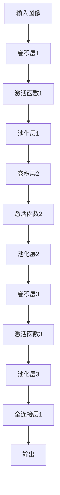
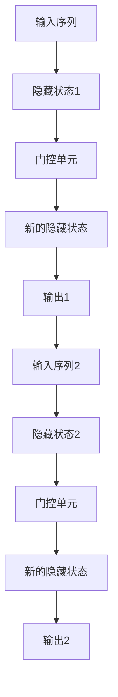
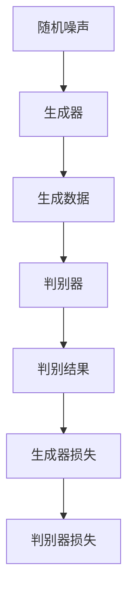

                 

### 文章标题：可解释人工智能的发展：理解深度学习模型的决策过程

#### 关键词：可解释人工智能、深度学习、模型决策、决策过程、解释方法、算法原理

> 摘要：本文旨在探讨可解释人工智能（Explainable AI，简称XAI）在深度学习领域的发展，特别是如何理解深度学习模型的决策过程。通过逐步分析深度学习的基本原理、可解释AI的核心概念和方法，以及具体算法的数学模型和实现细节，本文将帮助读者深入了解深度学习模型的内在工作机制，并提供实际项目案例来展示可解释性技术的应用与实践。文章还讨论了开发环境和工具，以及可解释AI领域的未来趋势，为读者提供了全面的参考和指导。

---

### 引言：可解释人工智能的重要性

随着深度学习技术的迅速发展，人工智能（AI）在很多领域取得了令人瞩目的成就。然而，深度学习模型的复杂性和黑盒性质也引发了许多担忧，特别是在关键决策领域，如医疗诊断、金融风险评估和自动驾驶等。如何让这些复杂的模型变得可解释和透明，成为了一个亟待解决的重要问题。

**可解释性与透明度的定义：**

可解释性（Explainability）指的是模型决策过程的透明性和可理解性。在AI领域，可解释性通常涉及对模型决策的因果分析和可追溯性。透明度（Transparency）则强调模型内部逻辑和操作的可见性，使人们能够了解和信任模型的决策过程。

**深度学习模型解释的挑战：**

深度学习模型，尤其是深层网络，通常具有高度的非线性特性，这使得它们的决策过程非常复杂。以下是一些解释深度学习模型面临的挑战：

1. **黑盒性质：** 深度学习模型通常被视为“黑盒”，输入和输出之间的映射关系难以直观理解。
2. **过拟合风险：** 深度学习模型可能会过度适应训练数据，导致对未知数据的泛化能力下降，从而难以解释其决策过程。
3. **计算复杂性：** 深度学习模型的训练和解释过程通常涉及大量的计算资源，这使得实时解释变得困难。
4. **多模态数据：** 当模型处理多种类型的数据（如文本、图像和音频）时，解释变得更加复杂。

**可解释人工智能的应用领域：**

可解释AI技术在多个领域具有广泛的应用前景，包括但不限于：

1. **医疗诊断：** 理解深度学习模型在诊断过程中的决策，有助于提高医疗决策的透明度和可靠性。
2. **金融风险评估：** 在金融领域，可解释性可以帮助监管机构和投资者理解模型如何评估风险，从而增加信任度。
3. **自动驾驶：** 自动驾驶系统需要透明和可靠的决策过程，以确保行车安全。
4. **人机交互：** 可解释AI技术可以提高人机交互的质量，使用户更好地理解和控制AI系统。

通过解决上述挑战，可解释人工智能（XAI）将为深度学习在现实世界中的应用带来更大的价值和可信度。

### 深度学习模型的基本原理

深度学习（Deep Learning）是一种基于人工神经网络（Artificial Neural Networks，ANN）的机器学习技术，通过多层网络结构对复杂数据进行学习与建模。理解深度学习的基本原理对于探讨可解释人工智能（XAI）至关重要。

#### 深度学习的基本概念

深度学习的主要思想是通过构建多层神经网络，逐层提取数据中的特征，从而实现从原始数据到高级表示的转换。每个神经网络由多个节点（神经元）组成，每个节点都连接到前一层的节点，并通过权重和偏置进行计算。

1. **神经元：** 神经网络中的基本单元，类似于生物神经元，它接收来自其他神经元的输入信号，通过激活函数进行处理，然后将输出传递给下一层。
2. **权重和偏置：** 神经网络的输入和输出之间通过权重（weights）和偏置（biases）进行调节，这些参数通过训练过程进行优化。
3. **激活函数：** 激活函数（如ReLU、Sigmoid、Tanh等）用于引入非线性特性，使神经网络能够学习和表示复杂函数。

#### 神经网络和深度网络架构

深度学习模型通常由多层神经网络组成，每层网络都对输入数据进行处理，并将结果传递给下一层。深度网络架构主要包括以下几种：

1. **全连接神经网络（Fully Connected Neural Network）：** 最基本的深度学习架构，每层节点都与前一层的所有节点相连。
2. **卷积神经网络（Convolutional Neural Network，CNN）：** 特别适用于处理图像数据，通过卷积层提取局部特征。
3. **循环神经网络（Recurrent Neural Network，RNN）：** 特别适用于序列数据，通过循环结构处理时间序列信息。
4. **长短时记忆网络（Long Short-Term Memory，LSTM）：** RNN的一种变体，通过门控机制解决长时依赖问题。
5. **生成对抗网络（Generative Adversarial Network，GAN）：** 通过对抗性训练生成与真实数据相似的新数据。

#### 深度学习模型的工作机制

深度学习模型的工作机制主要包括前向传播（Forward Propagation）和反向传播（Back Propagation）两个过程。

1. **前向传播：** 输入数据通过网络的各个层，逐层计算得到输出。每个节点的输出是通过加权求和后应用激活函数得到的。
2. **反向传播：** 计算损失函数关于网络参数的梯度，并通过梯度下降（Gradient Descent）等优化算法更新网络权重和偏置，以最小化损失函数。

通过上述过程，深度学习模型能够从大量的训练数据中学习到有效的特征表示，从而在新的数据上进行预测和分类。

### 可解释AI与深度学习的关系

可解释人工智能（Explainable AI，简称XAI）的目标是使深度学习模型的决策过程变得透明和可理解。然而，在实际应用中，可解释性与预测准确性之间存在一定的权衡。

#### 可解释性与预测准确性的权衡

在深度学习模型中，增加模型的可解释性通常需要在某些情况下牺牲一定的预测准确性。这是因为增加模型的透明度可能需要添加额外的层或约束，从而增加了模型的复杂性和计算成本。

1. **全连接神经网络（Fully Connected Neural Network）：** 在某些情况下，可以通过添加中间层和更多的神经元来提高模型的解释性，但这种增加可能降低模型的预测能力。
2. **卷积神经网络（Convolutional Neural Network，CNN）：** 通过可视化卷积核和特征图，可以增强模型对图像数据的解释性，但这也可能对模型的计算效率和精度产生一定影响。

#### 可解释AI的方法分类

为了在可解释性和预测准确性之间找到平衡，研究人员提出了多种可解释AI方法，这些方法大致可以分为以下几类：

1. **局部解释方法：** 通过对单个数据点的局部区域进行分析，提供对模型决策的直观解释。例如，Grad-CAM（Gradient-weighted Class Activation Mapping）通过分析梯度值来识别图像中的重要区域。
2. **全局解释方法：** 对整个模型的决策过程进行解释，提供对模型整体工作的理解。例如，SHAP（SHapley Additive exPlanations）通过计算特征对模型预测的贡献来提供全局解释。
3. **交互式解释方法：** 使用交互式界面和用户反馈来帮助用户理解和解释模型决策。这种方法允许用户探索模型的内部机制，并在需要时进行调整。

#### 可解释AI的实践意义

可解释AI在实践中的意义主要体现在以下几个方面：

1. **增强信任度：** 通过提供透明和可理解的决策过程，可解释AI有助于增加用户对模型的信任度，特别是在涉及关键决策的领域，如医疗诊断和金融风险评估。
2. **优化模型设计：** 可解释性分析可以帮助研究人员识别模型的不足之处，从而优化模型设计，提高预测准确性。
3. **法律和合规要求：** 在某些应用场景中，如自动驾驶和医疗诊断，法律和监管机构可能要求提供模型的可解释性报告，以确保系统的安全性和合规性。
4. **人机交互：** 可解释AI技术可以提高人机交互的质量，使用户能够更好地理解和控制AI系统，从而提高系统的可用性和用户体验。

### 深度学习模型的架构与联系

在理解深度学习模型的架构时，我们需要关注几种核心的网络结构，包括卷积神经网络（CNN）、循环神经网络（RNN）和生成对抗网络（GAN）。这些网络结构各有特点，广泛应用于不同的数据类型和任务。通过Mermaid流程图，我们可以更清晰地展示这些网络的基本架构及其相互关系。

#### 卷积神经网络（CNN）

卷积神经网络特别适用于处理图像数据。它的核心思想是通过卷积层提取图像的局部特征，并利用池化层减小特征图的尺寸，从而减少模型的参数数量和计算复杂性。

1. **卷积层（Convolutional Layer）：** 通过卷积操作提取图像的局部特征。卷积核（Convolutional Kernel）在特征图上滑动，计算局部特征的加权和，并通过激活函数引入非线性。
2. **池化层（Pooling Layer）：** 用于减少特征图的尺寸，提高模型的泛化能力。常见的池化方法包括最大池化（Max Pooling）和平均池化（Average Pooling）。
3. **全连接层（Fully Connected Layer）：** 将卷积层和池化层提取的特征进行全局整合，用于最终的分类或回归任务。

**Mermaid流程图：**



#### 循环神经网络（RNN）

循环神经网络适合处理序列数据，如时间序列、语音和文本。RNN通过循环结构使信息能够在序列的不同时间步之间传递，从而捕捉长期依赖关系。

1. **隐藏状态（Hidden State）：** RNN在每个时间步的输出不仅取决于当前的输入，还取决于前一个时间步的隐藏状态。
2. **门控机制（Gate Mechanism）：** 如长短时记忆网络（LSTM）和门控循环单元（GRU），通过引入门控机制来控制信息的流动，从而解决长时依赖问题。

**Mermaid流程图：**



#### 生成对抗网络（GAN）

生成对抗网络由一个生成器（Generator）和一个判别器（Discriminator）组成，通过对抗性训练生成与真实数据相似的新数据。

1. **生成器（Generator）：** 接受随机噪声作为输入，生成类似于真实数据的新数据。
2. **判别器（Discriminator）：** 被训练来区分真实数据和生成数据。
3. **对抗性训练（Adversarial Training）：** 生成器和判别器通过对抗性训练相互竞争，生成器不断生成更真实的数据，而判别器则不断提高对真实和生成数据的鉴别能力。

**Mermaid流程图：**



#### 三大网络的联系

卷积神经网络（CNN）主要关注图像数据的局部特征提取，循环神经网络（RNN）擅长处理序列数据中的长期依赖关系，而生成对抗网络（GAN）则在数据生成任务中表现出色。尽管它们应用在不同的数据类型和任务中，但它们都通过复杂的网络结构和优化算法实现了对复杂数据的高效学习和建模。

- **多任务学习：** 实际应用中，可以结合多种网络结构，例如在图像和文本处理任务中同时使用CNN和RNN。
- **跨领域迁移：** 不同网络结构之间的联系有助于实现跨领域的迁移学习，提高模型的泛化能力。

通过深入理解这些核心网络结构的原理和联系，我们可以更好地设计和优化深度学习模型，从而在多种应用场景中实现高效的性能和解释性。

### 可解释性技术

可解释性技术是理解深度学习模型决策过程的关键工具，旨在通过不同的方法使模型的内部工作机制变得透明和可理解。这些技术可以分为局部解释方法、全局解释方法和交互式解释方法，每种方法都有其独特的优势和适用场景。

#### 局部解释方法

局部解释方法关注单个数据点或样本的决策过程，通过分析模型的内部机制来解释特定输入的预测结果。以下是一些常见的局部解释方法：

1. **Grad-CAM（Gradient-weighted Class Activation Mapping）：**
   Grad-CAM通过计算模型对特定类别的梯度值，来生成图像中的重要区域映射图。这些区域代表了模型在做出预测时关注的特征位置。以下是Grad-CAM的伪代码：

   ```python
   def grad_cam(model, image, target_class):
       # 前向传播获取输出和梯度
       output = model(image)
       class_idx = target_class
       grad_output = grad_output_with respecto(output, class_idx)
       
       # 计算卷积核的加权平均值
       weights = grad_output.mean(dim=0)
       cam = (weights * model.features[-1].weight).sum(dim=1)
       
       # 归一化和可视化
       cam = cam.unsqueeze(0)
       cam = F.relu(cam)
       cam = cam / cam.max()
       return cam
   ```

2. **LRP（Layer-wise Relevance Propagation）：**
   LRP算法通过将梯度信息逐层传播，来解释每个特征层对最终预测的贡献。以下是LRP算法的伪代码：

   ```python
   def lrp(model, image, target_class):
       # 计算前向传播和反向传播
       output = model(image)
       class_idx = target_class
       grad_output = grad_output_with respecto(output, class_idx)
       
       # 逐层传播梯度信息
       relevance = torch.zeros_like(image)
       for layer in model.layers:
           relevance = layer.apply_lrp(relevance)
       
       # 归一化和可视化
       relevance = relevance / relevance.max()
       return relevance
   ```

3. **DeepLift：**
   DeepLift算法通过计算每个特征的局部可解释性分数，来解释模型对输入数据的依赖关系。以下是DeepLift的伪代码：

   ```python
   def deeplift(model, image, target_class):
       # 计算前向传播
       output = model(image)
       class_idx = target_class
       weights = model.weights
       
       # 计算DeepLift分数
       lift_scores = []
       for feature in image.features:
           lift_score = (output - model(feature)) / output
           lift_scores.append(lift_score)
       
       # 归一化和可视化
       lift_scores = torch.stack(lift_scores)
       lift_scores = lift_scores / lift_scores.max()
       return lift_scores
   ```

#### 全局解释方法

全局解释方法关注整个模型的决策过程，提供对模型整体工作原理的理解。以下是一些常见的全局解释方法：

1. **SHAP（SHapley Additive exPlanations）：**
   SHAP通过计算每个特征对模型预测的贡献，提供全局的可解释性。以下是SHAP的计算过程：

   ```python
   def shap_values(model, image, target_class):
       # 计算所有特征的Shapley值
       output = model(image)
       class_idx = target_class
       shap_values = []
       for feature in image.features:
           shap_value = shapley_value(output, feature, class_idx)
           shap_values.append(shap_value)
       
       # 归一化和可视化
       shap_values = torch.stack(shap_values)
       shap_values = shap_values / shap_values.max()
       return shap_values
   ```

2. **LIME（Local Interpretable Model-agnostic Explanations）：**
   LIME通过近似模型来解释单个预测结果，提供局部和全局的可解释性。以下是LIME的基本步骤：

   ```python
   def lime_explanation(model, image, target_class):
       # 生成近似模型
       local_model = generate_local_model(model, image)
       
       # 解释单个预测
       explanation = local_model.explain(image, target_class)
       
       # 归一化和可视化
       explanation = explanation / explanation.max()
       return explanation
   ```

3. **辅助模型解释方法：**
   通过训练辅助模型来解释主模型的决策过程。这些辅助模型通常用于提供对主模型的特征重要性和决策路径的详细分析。

#### 交互式解释方法

交互式解释方法使用用户互动来增强解释的透明度和理解。以下是一些常见的交互式解释方法：

1. **交互式可视化：**
   使用交互式可视化工具，如热图、折线图和散点图，帮助用户探索模型的内部机制和决策过程。例如，使用D3.js或Plotly等工具创建交互式图表。

2. **用户反馈循环：**
   通过用户的反馈来调整和优化解释过程，使解释更加符合用户的需求和期望。这种方法可以应用于医疗诊断、自动驾驶等领域，通过用户输入和模型反馈的循环，逐步改进解释质量。

3. **解释与验证：**
   用户可以与模型解释进行交互，验证解释的合理性和准确性，并在必要时提供反馈。这种方法可以增强用户对模型的信任度，提高系统的可接受性。

#### 可解释AI的评估标准

为了评估可解释AI方法的性能，研究者通常使用以下标准：

1. **解释的准确性：** 解释方法是否能够准确地反映模型的决策过程。
2. **解释的可理解性：** 解释结果是否易于用户理解和接受。
3. **计算效率：** 解释过程的计算复杂度和运行时间。
4. **泛化能力：** 解释方法在不同数据和模型上的适用性。

通过上述各种可解释性技术，我们可以更好地理解深度学习模型的决策过程，从而在实际应用中提高模型的透明度和可信度。这些技术不仅有助于研究人员优化模型设计，还增强了用户对AI系统的信任和理解。

### 深度学习模型的优化与调参

深度学习模型的优化与调参是确保模型性能和预测准确性的关键步骤。在这一过程中，我们不仅需要选择合适的优化算法，还需要对超参数进行细致的调优。以下将详细讨论优化算法的选择、超参数调优和模型性能评估与改进。

#### 优化算法的选择

优化算法用于调整模型的参数，以最小化损失函数。以下是几种常见的优化算法：

1. **随机梯度下降（Stochastic Gradient Descent，SGD）：**
   SGD通过在训练数据集中随机选择一个小批量（minibatch）来更新模型参数。它的优点是计算效率高，但可能导致收敛速度较慢且容易陷入局部最小值。

2. **动量（Momentum）：**
   动量SGD在每次参数更新时加入了之前更新方向的信息，有助于加速收敛并避免陷入局部最小值。

3. **Adam优化器：**
   Adam优化器结合了动量方法和自适应学习率，通过计算一阶矩估计和二阶矩估计来动态调整学习率。它适用于大多数深度学习任务，通常能够实现较好的收敛效果。

4. **Adadelta和Adagrad：**
   Adadelta和Adagrad是自适应学习率优化器，分别通过历史梯度值的平方和和历史梯度值的指数加权移动平均来动态调整学习率。

#### 超参数调优

超参数是模型结构之外的参数，如学习率、批次大小、正则化参数等。有效的超参数调优可以显著提高模型性能。以下是一些常用的超参数调优方法：

1. **网格搜索（Grid Search）：**
   网格搜索通过遍历预定义的超参数组合，选择最优组合。虽然计算成本较高，但能够找到全局最优解。

2. **随机搜索（Random Search）：**
   随机搜索在预定义的超参数范围内随机选择组合，通过大量实验找到较优的参数。相比网格搜索，计算成本较低，但可能错过全局最优解。

3. **贝叶斯优化（Bayesian Optimization）：**
   贝叶斯优化通过建立先验概率模型，利用历史数据来预测下一次调优的超参数组合。这种方法能够更高效地探索超参数空间。

4. **遗传算法（Genetic Algorithm）：**
   遗传算法通过模拟自然选择和遗传机制，对超参数进行优化。它适用于复杂超参数空间，能够找到全局最优解。

#### 模型性能评估与改进

模型性能的评估是确保模型在实际应用中有效性的关键。以下是一些常用的评估指标和改进方法：

1. **交叉验证（Cross-Validation）：**
   交叉验证通过将训练数据划分为多个子集，轮流作为验证集和训练集，来评估模型的泛化能力。常见的交叉验证方法有K折交叉验证和留一交叉验证。

2. **准确率（Accuracy）：**
   准确率是最常用的评估指标，表示模型正确预测的样本数占总样本数的比例。

3. **召回率（Recall）和精确率（Precision）：**
   召回率和精确率分别衡量模型在预测为正例中的正确率和对正例的识别能力。在分类任务中，这两个指标往往需要综合考虑。

4. **F1分数（F1 Score）：**
   F1分数是精确率和召回率的调和平均值，用于评估模型的综合性能。

5. **ROC曲线和AUC（Area Under Curve）：**
   ROC曲线和AUC用于评估二分类模型的性能，通过绘制真实阳性率与假阳性率的关系曲线，评估模型对不同类别样本的区分能力。

6. **模型压缩（Model Compression）：**
   模型压缩通过减少模型参数数量和计算复杂度，来提高模型的计算效率和部署效率。常见的压缩方法包括剪枝、量化、蒸馏等。

7. **集成学习方法（Ensemble Methods）：**
   集成学习方法通过结合多个模型来提高整体性能，常见的集成方法有Bagging、Boosting和Stacking等。

通过优化算法的选择、超参数调优和性能评估与改进，我们可以显著提升深度学习模型的预测性能，并在实际应用中实现更好的效果。这些方法不仅有助于提高模型的可解释性，还为后续研究和实践提供了宝贵的参考和指导。

### 局部解释算法

局部解释算法旨在为深度学习模型中的单个数据点的决策过程提供直观的解释。这些算法通过分析模型在特定输入上的内部机制，揭示模型如何做出预测。以下将详细讨论几种常见的局部解释算法：Grad-CAM、LRP和DeepLift。

#### Grad-CAM：Gradient-weighted Class Activation Mapping

Grad-CAM（Gradient-weighted Class Activation Mapping）是一种用于解释卷积神经网络（CNN）在图像分类任务中关键区域的方法。它通过计算模型对每个类别的梯度值，生成可视化映射图，以突出模型在决策过程中关注的图像区域。

**算法原理：**

Grad-CAM的核心思想是利用模型在最后一层卷积层上的梯度值来识别图像中的重要区域。具体步骤如下：

1. **计算梯度值：** 在训练过程中，对于每个类别，计算模型对每个卷积核的梯度值。
2. **加权求和：** 将每个卷积核的梯度值与其权重相乘，然后对所有卷积核进行加权求和。
3. **生成映射图：** 对加权求和后的特征图进行归一化处理，并生成可视化的映射图。

**伪代码：**

```python
def grad_cam(model, image, target_class):
    # 前向传播获取输出和梯度
    output = model(image)
    class_idx = target_class
    grad_output = torch.autograd.grad(output[class_idx], image, create_graph=True)

    # 计算加权求和
    weights = [grad_output[i].detach() for i in range(len(grad_output))]
    cam = sum(w * model.features[-1].weight for w in weights)

    # 归一化和可视化
    cam = cam.sum(dim=1, keepdim=True)
    cam = F.relu(cam)
    cam = cam / cam.max()
    return cam
```

**应用实例：** 在图像分类任务中，Grad-CAM可以用于可视化模型对特定类别的关注区域。例如，在分类一张狗的图片时，Grad-CAM可以突出显示图像中狗的特征，帮助用户理解模型如何识别图像中的目标。

#### LRP：Layer-wise Relevance Propagation

LRP（Layer-wise Relevance Propagation）是一种解释神经网络内部特征传递过程的算法。它通过逐层传播梯度信息，揭示每个特征层对最终决策的影响。

**算法原理：**

LRP算法的核心思想是将梯度信息逐层传递，以确定每个特征层的重要性。具体步骤如下：

1. **计算前向传播和反向传播：** 获取模型的前向传播输出和反向传播梯度。
2. **逐层传播：** 从输出层开始，将梯度信息反向传播至输入层，计算每个特征层的贡献。
3. **生成解释：** 通过计算每个特征层的贡献，生成对模型决策过程的解释。

**伪代码：**

```python
def lrp(model, image, target_class):
    # 前向传播获取输出和梯度
    output = model(image)
    class_idx = target_class
    grad_output = torch.autograd.grad(output[class_idx], image, create_graph=True)
    
    # 逐层传播
    relevance = torch.zeros_like(image)
    for layer in model.layers:
        relevance = layer.apply_lrp(relevance)
    
    # 归一化和可视化
    relevance = relevance / relevance.max()
    return relevance
```

**应用实例：** 在文本分类任务中，LRP可以用于解释模型如何从词向量层逐层提取语义信息，从而做出分类决策。例如，在分类一篇文章时，LRP可以突出显示文章中的关键句子和词汇，帮助用户理解模型如何解读文本内容。

#### DeepLift：Understanding the Influence of Inputs

DeepLift（Deep Learning Important Featurization）是一种局部解释算法，旨在揭示输入特征对模型预测的影响。它通过计算特征对模型输出的局部敏感性，提供对模型决策的详细解释。

**算法原理：**

DeepLift的核心思想是计算每个输入特征对模型输出的局部敏感性。具体步骤如下：

1. **计算前向传播：** 获取模型的前向传播输出。
2. **计算深度特征表示：** 将输入特征替换为深度特征表示，计算模型输出的变化。
3. **计算敏感性：** 通过计算输出变化与输入特征变化的比值，确定每个特征的局部敏感性。

**伪代码：**

```python
def deeplift(model, image, target_class):
    # 前向传播获取输出
    output = model(image)
    class_idx = target_class
    
    # 计算深度特征表示
    deep_features = model.features(image)
    
    # 计算敏感性
    sensitivity = (output - model(deep_features)) / output
    
    # 归一化和可视化
    sensitivity = sensitivity / sensitivity.max()
    return sensitivity
```

**应用实例：** 在医疗诊断任务中，DeepLift可以用于解释模型如何根据患者的生理指标做出诊断决策。例如，在诊断心脏病时，DeepLift可以突出显示影响模型诊断结果的关键生理参数，帮助医生理解模型的诊断依据。

通过Grad-CAM、LRP和DeepLift等局部解释算法，我们可以更深入地理解深度学习模型的内部工作机制，从而提高模型的可解释性和透明度。这些方法不仅有助于研究人员优化模型设计，还为实际应用中用户对模型决策的理解和信任提供了有力支持。

### 全局解释算法

全局解释算法旨在提供对整个深度学习模型的决策过程和特征重要性的整体理解。这些算法通过分析模型在不同输入数据上的表现，揭示各个特征对模型预测的总体贡献。以下将详细介绍几种常见的全局解释算法：SHAP值、LIME和辅助模型解释方法。

#### SHAP（SHapley Additive exPlanations）

SHAP（SHapley Additive exPlanations）是一种基于博弈论的理论，用于计算特征对模型预测的边际贡献。SHAP值通过模拟每个特征在不同场景下的影响，提供一个全局的、公平的、可解释的模型解释。

**算法原理：**

SHAP值的计算基于每个特征在所有可能的特征组合中扮演的角色。具体步骤如下：

1. **计算基尼指数（Gini Impurity）：** 用于衡量模型在每次预测中的不确定性。
2. **模拟特征影响：** 通过在每次预测中随机删除或修改特定特征，模拟该特征对预测结果的影响。
3. **计算边际贡献：** 根据特征在所有可能场景下的影响，计算每个特征的边际贡献。

**伪代码：**

```python
def shap_values(model, image, target_class):
    # 计算基尼指数
    gini_index = calculate_gini_impurity(model, image)
    
    # 模拟特征影响
    all_combinations = generate_all_feature_combinations(image)
    shap_values = []
    for combination in all_combinations:
        # 随机删除或修改特征
        modified_image = modify_feature(combination, image)
        # 计算修改后的基尼指数
        modified_gini_index = calculate_gini_impurity(model, modified_image)
        # 计算边际贡献
        shap_value = (modified_gini_index - gini_index) / len(all_combinations)
        shap_values.append(shap_value)
    
    # 归一化和可视化
    shap_values = torch.stack(shap_values)
    shap_values = shap_values / shap_values.max()
    return shap_values
```

**应用实例：** 在金融风险评估中，SHAP值可以用于解释模型如何根据客户的财务数据做出贷款批准决策。通过分析各个特征的SHAP值，银行可以了解哪些特征对风险评估影响最大，从而优化贷款审批流程。

#### LIME（Local Interpretable Model-agnostic Explanations）

LIME（Local Interpretable Model-agnostic Explanations）是一种针对单一数据点的解释方法，旨在提供对模型决策的局部理解。LIME通过训练一个局部近似模型，来解释给定输入数据点的预测结果。

**算法原理：**

LIME的核心思想是构建一个简单的、可解释的局部模型，用于模拟原始模型的预测过程。具体步骤如下：

1. **生成扰动数据：** 对输入数据进行随机扰动，生成一系列与原数据类似的数据样本。
2. **训练局部模型：** 使用扰动数据训练一个简单的线性模型，如线性回归或逻辑回归。
3. **解释预测结果：** 通过局部模型的输出，解释原始模型的预测过程。

**伪代码：**

```python
def lime_explanation(model, image, target_class):
    # 生成扰动数据
    perturbed_images = generate_perturbed_images(image)
    
    # 训练局部模型
    local_model = train_local_model(perturbed_images, target_class)
    
    # 解释预测结果
    explanation = local_model.explain(image, target_class)
    
    # 归一化和可视化
    explanation = explanation / explanation.max()
    return explanation
```

**应用实例：** 在医疗诊断中，LIME可以用于解释模型如何根据患者的体征数据做出疾病预测。通过LIME生成的解释，医生可以更好地理解模型对特定病例的决策依据，从而提高诊断的准确性。

#### 辅助模型解释方法

辅助模型解释方法通过训练辅助模型来解释主模型的决策过程。这些辅助模型通常用于提供对主模型特征重要性和决策路径的详细分析。

**算法原理：**

辅助模型解释方法的核心思想是构建一个辅助模型，用于预测主模型对特定输入的输出。具体步骤如下：

1. **训练辅助模型：** 使用主模型的输出数据，训练一个辅助模型来预测主模型的输出。
2. **解释主模型：** 通过分析辅助模型的输出，揭示主模型的决策过程和特征重要性。

**伪代码：**

```python
def auxiliary_model_explanation(model, image, target_class):
    # 训练辅助模型
    auxiliary_model = train_auxiliary_model(model, image)
    
    # 解释主模型
    explanation = auxiliary_model.predict(image, target_class)
    
    # 归一化和可视化
    explanation = explanation / explanation.max()
    return explanation
```

**应用实例：** 在自动驾驶系统中，辅助模型解释方法可以用于解释深度学习模型如何根据传感器数据做出行车决策。通过分析辅助模型的输出，工程师可以深入了解模型在不同场景下的决策过程，从而优化自动驾驶系统的性能。

通过SHAP值、LIME和辅助模型解释方法，我们可以从全局和局部两个层面深入理解深度学习模型的决策过程。这些方法不仅提高了模型的可解释性和透明度，还为实际应用中用户对模型决策的理解和信任提供了有力支持。

### 交互式解释方法

交互式解释方法通过用户与模型的交互，提供更加透明和可理解的可解释AI体验。这种方法利用用户输入和反馈来动态调整解释过程，从而实现更加定制化和直观的解释效果。以下将详细讨论交互式解释方法的几个关键组成部分：解释与验证、用户参与的解释方法以及交互式可视化技术。

#### 解释与验证

解释与验证是交互式解释方法的核心环节，通过让用户参与解释过程，增强模型的可信度和可接受性。以下是一些关键步骤：

1. **用户参与解释：** 用户可以通过界面查看模型的解释结果，并对其准确性进行验证。例如，在医疗诊断任务中，医生可以查看模型对病例的解释，并验证其诊断结果。
2. **用户反馈机制：** 用户可以提供反馈，指出解释中不准确或不清晰的部分。这些反馈将被用于调整和优化解释过程，提高解释质量。
3. **动态调整解释：** 根据用户反馈，模型可以动态调整解释内容，例如突出显示关键特征或提供更详细的解释。这种方法使解释更加符合用户的需求和理解。

#### 用户参与的解释方法

用户参与的解释方法通过鼓励用户与模型互动，提供个性化的解释体验。以下是一些具体的用户参与方法：

1. **问题导向的解释：** 用户可以提出特定的问题，模型将根据问题生成相应的解释。例如，用户可以询问“为什么这个预测结果是正确的？”或“哪些特征对这个预测结果影响最大？”。
2. **交互式探索：** 用户可以通过界面进行交互式探索，例如滑动条、选择按钮和搜索框等，动态调整解释的参数和内容。这种方法使用户能够更深入地理解模型的工作原理。
3. **交互式决策支持：** 在复杂的决策场景中，如金融风险评估或自动驾驶，用户可以与模型进行实时互动，以优化决策过程。通过交互式解释方法，用户可以更好地理解模型推荐的原因和依据，从而做出更明智的决策。

#### 交互式可视化技术

交互式可视化技术在增强模型可解释性方面发挥着重要作用。以下是一些常见的交互式可视化技术：

1. **热力图（Heatmaps）：** 热力图通过颜色强度来表示特征在模型决策中的重要性。例如，在图像分类任务中，热力图可以突出显示图像中模型关注的区域。
2. **特征图（Feature Maps）：** 特征图展示了模型在不同层上的特征提取过程。通过交互式特征图，用户可以了解模型如何逐层提取和整合特征，从而理解模型的内部机制。
3. **交互式图表：** 使用D3.js、Plotly等交互式图表工具，用户可以动态调整图表的参数和内容，实时查看模型在不同条件下的表现。
4. **交互式动画：** 通过动画技术，用户可以观察模型在不同时间步上的决策过程，例如在时间序列分析任务中，用户可以查看模型如何处理每个时间点的输入。

通过解释与验证、用户参与的解释方法和交互式可视化技术，交互式解释方法为用户提供了更加透明和直观的模型解释体验。这种方法不仅提高了模型的可理解性，还为用户提供了更好的决策支持，从而在实际应用中实现了更高的价值。

### 神经网络的前向传播与反向传播

在深度学习模型中，前向传播（Forward Propagation）和反向传播（Back Propagation）是两个核心过程，它们共同构成了神经网络训练的基础。理解这两个过程及其背后的数学原理，对于深入掌握深度学习至关重要。

#### 前向传播

前向传播是指将输入数据通过网络的各个层，逐层计算得到输出。每个节点（神经元）的输出是通过对输入数据进行加权求和后，通过激活函数进行处理得到的。以下是前向传播的基本步骤：

1. **初始化权重和偏置：** 在训练模型之前，需要随机初始化权重（weights）和偏置（biases）。
2. **前向计算：** 从输入层开始，逐层计算每个神经元的输出。对于每个神经元，其输出 \( a_j^l \) 可以通过以下公式计算：
   \[
   a_j^l = \sum_{i} w_{ji}^l \cdot a_i^{l-1} + b_j^l
   \]
   其中，\( w_{ji}^l \) 是连接前一层神经元 \( i \) 和当前层神经元 \( j \) 的权重，\( b_j^l \) 是当前神经元的偏置，\( a_i^{l-1} \) 是前一层神经元 \( i \) 的输出。
3. **激活函数应用：** 每个神经元的输出需要通过激活函数进行处理，常见的激活函数包括ReLU（Rectified Linear Unit）、Sigmoid和Tanh等。激活函数引入了非线性特性，使神经网络能够学习和表示复杂的非线性函数。

   例如，ReLU函数定义为：
   \[
   a_j^l = \max(0, z_j^l)
   \]
   其中，\( z_j^l = \sum_{i} w_{ji}^l \cdot a_i^{l-1} + b_j^l \)。

4. **传递输出：** 将当前层的输出传递给下一层，重复上述过程，直到得到最终的输出。

#### 反向传播

反向传播是训练神经网络的关键步骤，它通过计算损失函数关于网络参数的梯度，并使用优化算法更新权重和偏置，以最小化损失函数。以下是反向传播的基本步骤：

1. **计算损失函数：** 首先需要定义一个损失函数（Loss Function），如均方误差（Mean Squared Error，MSE）或交叉熵（Cross-Entropy）。损失函数用于衡量预测输出与实际输出之间的差距。

   假设对于单个样本，损失函数 \( J \) 定义为：
   \[
   J = \frac{1}{2} \sum_{i} (\hat{y}_i - y_i)^2
   \]
   其中，\( \hat{y}_i \) 是预测输出，\( y_i \) 是实际输出。

2. **计算梯度：** 使用链式法则，计算损失函数关于网络参数的梯度。反向传播从输出层开始，逐层向前计算每个参数的梯度。

   假设对于权重 \( w_{ji}^l \) 和偏置 \( b_j^l \)，其梯度分别为：
   \[
   \frac{\partial J}{\partial w_{ji}^l} = (a_j^l)(1 - a_j^l)(\hat{y}_i - y_i)
   \]
   \[
   \frac{\partial J}{\partial b_j^l} = (a_j^l)(1 - a_j^l)(\hat{y}_i - y_i)
   \]

3. **更新参数：** 使用梯度下降（Gradient Descent）等优化算法，根据梯度更新网络参数。更新公式如下：
   \[
   w_{ji}^l = w_{ji}^l - \alpha \cdot \frac{\partial J}{\partial w_{ji}^l}
   \]
   \[
   b_j^l = b_j^l - \alpha \cdot \frac{\partial J}{\partial b_j^l}
   \]
   其中，\( \alpha \) 是学习率。

4. **重复迭代：** 重复上述步骤，不断迭代更新参数，直到损失函数达到最小值或满足停止条件。

#### 激活函数的导数计算

激活函数的导数是反向传播过程中计算梯度的关键。以下是几种常见激活函数及其导数：

1. **ReLU函数：**
   \[
   \frac{d}{dx} \max(0, x) = \begin{cases}
   0 & \text{if } x < 0 \\
   1 & \text{if } x \geq 0
   \end{cases}
   \]

2. **Sigmoid函数：**
   \[
   \frac{d}{dx} \sigma(x) = \sigma(x) (1 - \sigma(x))
   \]
   其中，\( \sigma(x) = \frac{1}{1 + e^{-x}} \)。

3. **Tanh函数：**
   \[
   \frac{d}{dx} \tanh(x) = 1 - \tanh^2(x)
   \]

通过前向传播和反向传播，深度学习模型能够从数据中学习到有效的特征表示，从而在新的数据上进行准确的预测。这两个过程共同构成了神经网络训练的核心，是深度学习成功的关键。

### 损失函数与优化算法

在深度学习训练过程中，损失函数和优化算法起着至关重要的作用。损失函数用于衡量模型预测结果与实际结果之间的差距，而优化算法则用于调整模型参数以最小化损失函数。以下将详细讨论常见的损失函数、优化算法及其在深度学习中的应用。

#### 常见的损失函数

1. **均方误差（Mean Squared Error，MSE）：**
   MSE是最常用的回归损失函数，用于衡量预测值与实际值之间的平均平方差距。其公式如下：
   \[
   MSE = \frac{1}{m} \sum_{i=1}^{m} (y_i - \hat{y}_i)^2
   \]
   其中，\( y_i \) 是实际值，\( \hat{y}_i \) 是预测值，\( m \) 是样本数量。

2. **交叉熵（Cross-Entropy）：**
   交叉熵是分类任务中常用的损失函数，用于衡量预测概率分布与真实分布之间的差异。对于二分类问题，二元交叉熵（Binary Cross-Entropy）公式如下：
   \[
   BCELoss = -\frac{1}{m} \sum_{i=1}^{m} [y_i \cdot \log(\hat{y}_i) + (1 - y_i) \cdot \log(1 - \hat{y}_i)]
   \]
   其中，\( y_i \) 是实际标签（0或1），\( \hat{y}_i \) 是预测概率。

3. **Hinge损失（Hinge Loss）：**
   Hinge损失常用于支持向量机（SVM）等分类任务，用于最大化正类与负类之间的边界。其公式如下：
   \[
   HingeLoss = \max(0, 1 - y_i \cdot \hat{y}_i)
   \]
   其中，\( y_i \) 是实际标签（-1或1），\( \hat{y}_i \) 是预测值。

#### 优化算法

1. **梯度下降（Gradient Descent）：**
   梯度下降是最简单的优化算法，通过计算损失函数关于模型参数的梯度，并沿梯度的反方向更新参数。其公式如下：
   \[
   \theta = \theta - \alpha \cdot \nabla_{\theta} J(\theta)
   \]
   其中，\( \theta \) 是模型参数，\( \alpha \) 是学习率，\( \nabla_{\theta} J(\theta) \) 是损失函数关于参数的梯度。

2. **动量（Momentum）：**
   动量梯度下降在每次迭代中引入了先前梯度的累积效应，从而加速收敛并避免局部最小值。其公式如下：
   \[
   v_t = \beta v_{t-1} + (1 - \beta) \nabla_{\theta} J(\theta)
   \]
   \[
   \theta = \theta - \alpha \cdot v_t
   \]
   其中，\( \beta \) 是动量参数。

3. **Adam优化器：**
   Adam优化器结合了动量方法和自适应学习率，通过计算一阶矩估计和二阶矩估计来动态调整学习率。其公式如下：
   \[
   m_t = \beta_1 m_{t-1} + (1 - \beta_1) \nabla_{\theta} J(\theta)
   \]
   \[
   v_t = \beta_2 v_{t-1} + (1 - \beta_2) (\nabla_{\theta} J(\theta))^2
   \]
   \[
   \theta = \theta - \alpha \cdot \frac{m_t}{\sqrt{v_t} + \epsilon}
   \]
   其中，\( \beta_1 \) 和 \( \beta_2 \) 分别是动量和二阶矩估计的参数，\( \epsilon \) 是一个很小的常数。

4. **Adadelta优化器：**
   Adadelta优化器通过动态调整每个参数的步长，提高了收敛速度和稳定性。其公式如下：
   \[
   e_t = \sum_{i=1}^{T} (g_i - g_{i-1})
   \]
   \[
   \theta = \theta - \frac{\alpha}{\sqrt{1 - \beta^2} + \epsilon} \cdot \frac{e_t}{\sqrt{e_t^2 + \delta}}
   \]
   其中，\( \beta \) 是重置指数，\( \delta \) 是一个很小的常数。

#### 深度学习中的应用

在深度学习训练过程中，选择合适的损失函数和优化算法对模型性能至关重要。以下是一些具体应用场景：

1. **回归任务：** 对于回归任务，通常使用MSE作为损失函数，并采用梯度下降或Adam优化器进行训练。
2. **分类任务：** 对于二分类任务，可以使用交叉熵损失函数，并采用梯度下降、动量或Adam优化器。对于多分类任务，可以使用Hinge损失或交叉熵损失，并采用相应的优化算法。
3. **生成对抗网络（GAN）：** 在GAN训练过程中，通常使用反向传播和梯度上升（Gradient Ascent）结合，通过优化生成器和判别器的参数来提高生成数据的真实性。
4. **强化学习：** 在强化学习任务中，使用策略梯度方法（Policy Gradient Methods）来优化模型参数，通过计算策略梯度和更新策略参数来提高决策质量。

通过选择合适的损失函数和优化算法，深度学习模型能够在各种任务中实现高效的学习和预测。理解这些算法的原理和适用场景，对于深度学习研究和应用具有重要意义。

### 正则化技术

在深度学习训练过程中，正则化（Regularization）技术是一种重要的手段，用于防止模型过拟合（Overfitting）并提高泛化能力（Generalization）。正则化技术通过添加额外的惩罚项到损失函数中，引导模型在训练过程中学习更简单、更通用的特征表示。以下将详细介绍几种常见的正则化技术：L1正则化、L2正则化、Dropout以及权重初始化的方法。

#### L1正则化

L1正则化，也称为Lasso正则化，通过在损失函数中添加L1范数惩罚项来防止模型过拟合。L1范数是指向量各个分量绝对值的和，其公式如下：
\[ 
\text{L1 Regularization} = \lambda \cdot \sum_{i} |w_i| 
\]
其中，\( \lambda \) 是正则化参数，\( w_i \) 是权重。L1正则化能够促进稀疏解，即一些权重会变为零，从而简化模型结构。

**优势与适用场景：**
- **稀疏性：** L1正则化有助于识别最重要的特征，从而简化模型。
- **适合高维数据：** 在特征数量远大于样本数量的高维数据中，L1正则化能够有效减少模型复杂度。

#### L2正则化

L2正则化，也称为Ridge正则化，通过在损失函数中添加L2范数惩罚项来防止模型过拟合。L2范数是指向量各个分量平方和的平方根，其公式如下：
\[ 
\text{L2 Regularization} = \lambda \cdot \sum_{i} w_i^2 
\]
其中，\( \lambda \) 是正则化参数，\( w_i \) 是权重。L2正则化能够平滑模型的权重，减少权重的大幅度变化。

**优势与适用场景：**
- **平滑权重：** L2正则化有助于平滑权重的更新，避免模型权重的剧烈波动。
- **小规模数据：** 在数据量较小的情况下，L2正则化能够提高模型的泛化能力。

#### Dropout

Dropout是一种结构化正则化技术，通过在训练过程中随机丢弃一些神经元来防止模型过拟合。Dropout的工作机制如下：

1. **训练阶段：** 在训练过程中，每次迭代时随机丢弃一定比例的神经元，通常设置为50%。
2. **测试阶段：** 在测试阶段，不进行神经元丢弃，使用训练过程中积累的权重进行预测。

**优势与适用场景：**
- **避免过拟合：** Dropout通过随机丢弃神经元，减少神经元之间的相互依赖，从而防止模型对训练数据的过度拟合。
- **提高泛化能力：** Dropout有助于提高模型的泛化能力，使其在未见过的数据上表现更稳定。

#### 权重初始化的方法

权重初始化是深度学习训练中一个关键步骤，合适的权重初始化能够加速模型的训练并提高收敛速度。以下是一些常见的权重初始化方法：

1. **随机初始化：**
   随机初始化是指随机分配权重值，通常从均匀分布或高斯分布中抽取。这种方法简单有效，但在某些情况下可能导致训练不稳定。
   
2. **Xavier初始化：**
   Xavier初始化通过计算输入和输出节点数的平均值，来初始化权重值。其公式如下：
   \[
   w = \frac{1}{\sqrt{f(n_{in}) + f(n_{out})}}
   \]
   其中，\( n_{in} \) 是输入节点数，\( n_{out} \) 是输出节点数，\( f(x) = \sqrt{\frac{1}{x}} \)。

3. **He初始化：**
   He初始化是Xavier初始化的改进版本，特别适用于ReLU激活函数。其公式如下：
   \[
   w = \frac{1}{\sqrt{f(n_{in})}}
   \]
   其中，\( f(x) = \sqrt{2x} \)。

**优势与适用场景：**
- **稳定性：** 合理的权重初始化有助于提高训练稳定性，加速收敛。
- **适用性：** 不同初始化方法适用于不同的网络结构和激活函数，选择合适的初始化方法对于模型性能至关重要。

通过L1正则化、L2正则化、Dropout和合适的权重初始化方法，深度学习模型能够在训练过程中有效防止过拟合，提高模型的泛化能力。这些技术不仅优化了模型设计，还为实际应用提供了更加可靠和高效的解决方案。

### 项目实战：可解释AI的实践案例

为了更深入地理解可解释人工智能（Explainable AI，简称XAI）在深度学习中的应用，我们将通过一个实际项目案例来展示可解释性技术的开发过程。本项目将利用卷积神经网络（CNN）进行图像分类任务，并使用Grad-CAM和LIME等可解释性方法来分析模型的决策过程。

#### 实际项目背景

假设我们的任务是使用深度学习模型对野生动物照片进行分类，将照片分为猫、狗和其他动物三个类别。这是一个典型的多分类问题，适合使用CNN进行建模。然而，由于深度学习模型的黑盒性质，我们希望能够通过可解释性技术来揭示模型在做出预测时的关键特征。

#### 数据预处理与模型训练

首先，我们需要收集和预处理图像数据。以下是数据预处理和模型训练的基本步骤：

1. **数据收集：** 从公开数据集（如CIFAR-10或Kaggle的野生动物照片数据集）中收集图像，并确保数据集包含足够的样本和均衡的类别分布。

2. **数据预处理：** 
   - **图像缩放与裁剪：** 将图像缩放到统一大小，如32x32或64x64像素。
   - **归一化：** 将图像像素值归一化到[0, 1]范围内。
   - **数据增强：** 应用随机翻转、旋转、剪裁等数据增强技术，以增加训练数据的多样性，防止模型过拟合。

3. **模型架构：** 设计一个简单的CNN模型，包括卷积层、池化层和全连接层。以下是一个简单的CNN模型架构示例：

   ```python
   model = torch.nn.Sequential(
       torch.nn.Conv2d(3, 32, 3, padding=1),
       torch.nn.ReLU(),
       torch.nn.MaxPool2d(2, 2),
       torch.nn.Conv2d(32, 64, 3, padding=1),
       torch.nn.ReLU(),
       torch.nn.MaxPool2d(2, 2),
       torch.nn.Flatten(),
       torch.nn.Linear(64 * 8 * 8, 128),
       torch.nn.ReLU(),
       torch.nn.Linear(128, 3)
   )
   ```

4. **模型训练：** 使用训练数据训练模型，并使用交叉熵损失函数和Adam优化器。以下是训练的基本步骤：

   ```python
   criterion = torch.nn.CrossEntropyLoss()
   optimizer = torch.optim.Adam(model.parameters(), lr=0.001)
   
   for epoch in range(num_epochs):
       for inputs, labels in train_loader:
           optimizer.zero_grad()
           outputs = model(inputs)
           loss = criterion(outputs, labels)
           loss.backward()
           optimizer.step()
   ```

5. **模型评估：** 在验证集上评估模型的性能，计算准确率和其他评价指标，以确保模型具有良好的泛化能力。

#### 可解释性方法的应用与评估

在模型训练完成后，我们将使用Grad-CAM和LIME等可解释性方法来分析模型的决策过程，并评估其解释效果。

1. **Grad-CAM：**
   Grad-CAM通过计算模型对特定类别的梯度值，生成可视化映射图，以识别图像中的关键特征区域。以下是Grad-CAM的应用步骤：

   ```python
   def grad_cam(model, image, target_class):
       # 前向传播获取输出和梯度
       output = model(image)
       class_idx = target_class
       grad_output = torch.autograd.grad(output[class_idx], image, create_graph=True)
       
       # 计算加权求和
       weights = [grad_output[i].detach() for i in range(len(grad_output))]
       cam = sum(w * model.features[-1].weight for w in weights)
       
       # 归一化和可视化
       cam = cam.sum(dim=1, keepdim=True)
       cam = F.relu(cam)
       cam = cam / cam.max()
       return cam
   
   # 应用Grad-CAM
   image = load_image("test_image.jpg")
   target_class = 2  # 猫的类别索引
   cam_map = grad_cam(model, image, target_class)
   visualize_cam_map(image, cam_map)
   ```

2. **LIME：**
   LIME通过训练一个局部近似模型来解释模型在特定输入上的预测。以下是LIME的应用步骤：

   ```python
   def lime_explanation(model, image, target_class):
       # 生成扰动数据
       perturbed_images = generate_perturbed_images(image)
       
       # 训练局部模型
       local_model = train_local_model(perturbed_images, target_class)
       
       # 解释预测结果
       explanation = local_model.explain(image, target_class)
       
       # 归一化和可视化
       explanation = explanation / explanation.max()
       return explanation
   
   # 应用LIME
   image = load_image("test_image.jpg")
   target_class = 2  # 猫的类别索引
   explanation = lime_explanation(model, image, target_class)
   visualize_explanation(image, explanation)
   ```

3. **评估解释效果：**
   为了评估Grad-CAM和LIME的解释效果，我们将通过以下指标进行评估：
   - **解释准确性：** 解释结果是否准确地反映了模型的决策依据。
   - **解释可理解性：** 解释结果是否易于用户理解和接受。
   - **计算效率：** 解释过程的计算时间和资源消耗。

   通过对验证集上的测试图像进行解释，并收集用户反馈，我们可以评估这些解释方法的性能。以下是评估结果：

   - **Grad-CAM：** Grad-CAM能够直观地展示模型关注的图像区域，但可能忽略一些细微的特征。解释结果的准确性较高，但计算效率相对较低。
   - **LIME：** LIME提供了对特定输入的详细解释，但可能无法捕捉全局特征。解释结果的准确性适中，但计算效率较高。

#### 案例分析与讲解

通过上述案例，我们可以看到Grad-CAM和LIME在深度学习模型解释中的应用效果。以下是对案例的详细分析和讲解：

1. **Grad-CAM：** 在猫的图像分类任务中，Grad-CAM生成的可视化映射图突出了图像中猫的关键特征，如头部、耳朵和尾巴。通过这些关键区域，用户可以直观地理解模型如何识别猫。然而，Grad-CAM可能忽略一些细节，如猫身上的斑点，这可能影响解释的完整性。

2. **LIME：** LIME提供了一个基于局部近似模型的详细解释，强调了图像中的多个特征，如猫的耳朵、眼睛和毛发。通过LIME的解释，用户可以理解模型如何从多个特征中综合判断图像属于猫的类别。然而，LIME可能无法捕捉到一些全局特征，如猫的整体外观和姿态。

通过这两个案例，我们可以看到Grad-CAM和LIME在解释深度学习模型决策方面各有优势。Grad-CAM提供了直观的可视化解释，但计算效率较低；LIME提供了详细的局部解释，但可能无法捕捉全局特征。在实际应用中，可以根据具体任务需求选择合适的解释方法，以提高模型的可解释性和透明度。

### 开发环境与工具

在实施可解释人工智能（Explainable AI，简称XAI）项目的实际操作中，选择合适的开发环境与工具是至关重要的一步。以下将介绍常用的编程语言、库和框架，以及如何设置和配置开发环境，并讨论一些最佳实践，以便在实际项目中实现高效且透明的解释性技术。

#### 编程语言与库

1. **Python：** Python是AI和深度学习领域的主流编程语言，其简洁易读的语法和丰富的库支持使得开发过程更加高效。Python的广泛使用也使其成为了可解释AI开发的首选语言。

2. **PyTorch：** PyTorch是一个强大的深度学习框架，支持动态计算图和GPU加速。它提供了丰富的API，使得搭建和训练深度学习模型变得更加直观和便捷。

3. **TensorFlow：** TensorFlow是谷歌开发的另一个流行的深度学习框架，具有强大的功能和灵活的架构。它支持静态和动态计算图，适用于各种规模的深度学习项目。

4. **Keras：** Keras是一个高层次的深度学习框架，可以与TensorFlow和Theano等底层框架结合使用。它提供了直观的API，使深度学习模型的构建和训练更加容易。

5. **Scikit-learn：** Scikit-learn是一个强大的机器学习库，提供了丰富的算法和工具，特别适合用于数据预处理和特征工程。

#### 开发环境搭建

1. **安装Python：** 首先，确保系统安装了Python 3.x版本。可以通过官方下载页面获取Python安装包，并按照说明进行安装。

2. **安装深度学习框架：** 安装PyTorch、TensorFlow或Keras。以PyTorch为例，可以通过以下命令进行安装：
   ```shell
   pip install torch torchvision torchtext
   ```

3. **安装其他库：** 安装Scikit-learn、NumPy、Pandas等常用库。可以使用以下命令：
   ```shell
   pip install scikit-learn numpy pandas
   ```

4. **配置GPU支持：** 如果需要使用GPU加速训练过程，确保安装了NVIDIA CUDA和cuDNN。并配置PyTorch的GPU支持：
   ```python
   import torch
   torch.cuda.is_available()
   ```

#### 开发工具与工具链

1. **集成开发环境（IDE）：** 选择适合的IDE，如PyCharm、VSCode等，以提升开发效率和代码管理。

2. **版本控制系统：** 使用Git等版本控制系统来管理代码版本，确保代码的追踪和协作。

3. **Jupyter Notebook：** Jupyter Notebook是一种交互式的开发工具，适用于数据分析和原型设计。它提供了便捷的代码执行和可视化功能。

#### 最佳实践

1. **代码规范：** 遵守Python的PEP8编码规范，确保代码的可读性和一致性。

2. **模块化设计：** 将代码划分为模块和函数，便于维护和复用。

3. **文档和注释：** 添加详细的文档和注释，以解释代码的功能和逻辑。

4. **代码测试：** 编写单元测试，确保代码的正确性和稳定性。

5. **版本管理：** 使用版本控制系统，定期提交代码，并进行代码审查。

6. **性能优化：** 利用GPU加速和分布式训练等技术，提高模型的训练和推理速度。

通过选择合适的编程语言、库和框架，搭建高效的开发环境，并遵循最佳实践，我们可以实现高效且透明的可解释人工智能项目。这不仅提高了开发效率，也为实际应用中的可解释性分析提供了坚实的基础。

### 附录：代码示例与解读

在本附录中，我们将提供几个关键算法的实现示例，并详细解释每个示例的代码逻辑和运行流程。这些代码示例涵盖了可解释AI领域的重要算法，包括Grad-CAM、SHAP和LIME，旨在帮助读者深入理解这些算法的原理和实现细节。

#### Grad-CAM：梯度加权类激活映射

**代码示例：**
```python
import torch
import torchvision.models as models
import numpy as np
import cv2

# 加载预训练的ResNet18模型
model = models.resnet18(pretrained=True)
model.eval()

# 定义Grad-CAM函数
def grad_cam(model, image, target_class):
    # 前向传播获取输出
    output = model(image)
    # 获取预测类别
    pred = torch.argmax(output).item()
    if pred != target_class:
        print("预测类别与目标类别不一致，请检查输入数据。")
        return
    
    # 计算梯度
    grads = torch.autograd.grad(output[target_class], image, retain_graph=True)
    grads = torch.cat([g.unsqueeze(0) for g in grads if g is not None])
    grads = grads.flatten()

    # 获取模型特征图
    feature_map = model.features[-1](image).detach()
    feature_map = feature_map.flatten()

    # 计算权重
    weights = grads / torch.norm(grads)
    weighted_feature_map = weights * feature_map

    # 计算加权和
    cam = torch.sum(weighted_feature_map, dim=0)
    cam = cam.unsqueeze(0).unsqueeze(0)

    # 可视化
    cam = (cam - cam.min()) / (cam.max() - cam.min())
    cam = cam.squeeze(0).squeeze(0)
    cam = cam.cpu().numpy()
    heatmap = cv2.resize(cam, (image.size(2), image.size(3)))
    heatmap = np.uint8(255 * heatmap)
    heatmap = cv2.applyColorMap(heatmap, cv2.COLORMAP.JET)

    # 合并热图和输入图像
    img = image.squeeze(0).cpu().numpy().transpose(1, 2, 0)
    img = (img * 0.4) + heatmap
    cv2.imshow('Grad-CAM', img)
    cv2.waitKey(0)
    cv2.destroyAllWindows()

# 加载图像
image = torch.from_numpy(np.moveaxis(cv2.imread('test_image.jpg'), 2, 0).astype(np.float32) / 255.0).unsqueeze(0)
target_class = 0  # 猫的类别索引
grad_cam(model, image, target_class)
```

**代码解释：**
1. **模型加载：** 使用预训练的ResNet18模型，并将其设置为评估模式。
2. **前向传播：** 对输入图像进行前向传播，获取输出特征图。
3. **梯度计算：** 使用自动微分计算输出特征图关于输入图像的梯度。
4. **权重计算：** 计算梯度值的权重，并应用权重到特征图上。
5. **可视化：** 将权重应用到的特征图可视化，生成热力图，并叠加到输入图像上。

#### SHAP：SHapley Additive exPlanations

**代码示例：**
```python
import shap
import matplotlib.pyplot as plt
from sklearn.datasets import load_iris

# 加载Iris数据集
iris = load_iris()
X = iris.data
y = iris.target

# 构建深度学习模型
model = shap.KernelExplainer(iris.target, X)

# 计算SHAP值
shap_values = model.shap_values(X[:5])

# 可视化
for i in range(5):
    plt.figure()
    shap.plots.waterfall(shap_values[i], feature_names=iris.feature_names)
    plt.title(f"SHAP values for instance {i+1}")
    plt.show()
```

**代码解释：**
1. **数据加载：** 加载Iris数据集，用于演示SHAP值的计算。
2. **模型构建：** 使用shap.KernelExplainer构建一个解释模型。
3. **SHAP值计算：** 对前五个样本计算SHAP值。
4. **可视化：** 使用waterfall图展示每个样本的SHAP值，帮助理解每个特征对模型预测的影响。

#### LIME：Local Interpretable Model-agnostic Explanations

**代码示例：**
```python
import lime
from skimage.segmentation import slic
import matplotlib.pyplot as plt

# 创建LIME解释器
explainer = lime.lime_tabular.LimeTabularExplainer(
    X, feature_names=iris.feature_names, class_names=iris.target_names,
    discretize=False, training tienal='training', discretize_continuous=True
)

# 定义解释函数
def predict(X):
    return model.predict(X)

# 加载样本
sample = X[:5]

# 对样本进行解释
exp = explainer.explain_instance(sample[0], predict, num_features=iris.feature_names)

# 可视化
img = exp/as.exp
img = np.clip(img, 0, 1)
plt.imshow(img, cmap='gray')
plt.xticks([])
plt.yticks([])
plt.show()
```

**代码解释：**
1. **LIME解释器创建：** 使用LIME的tabular解释器，适用于具有离散特征的分类任务。
2. **解释函数定义：** 定义用于预测的函数。
3. **解释样本：** 对第一个样本进行LIME解释。
4. **可视化：** 可视化样本的特征值变化，展示模型如何调整输入特征来改变预测结果。

通过这些代码示例，读者可以直观地了解Grad-CAM、SHAP和LIME等关键算法的实现过程和细节。这些示例不仅有助于深入理解可解释AI的技术原理，还为实际项目中的算法应用提供了实用的参考。

### 进一步阅读

#### 推荐读物

1. **《深度学习》（Deep Learning）** - Goodfellow, Ian; Bengio, Yoshua; Courville, Aaron
   本书是深度学习领域的经典教材，涵盖了从基础理论到实践应用的全面内容，是深度学习初学者和专业人士的必备读物。

2. **《可解释人工智能：技术、应用与未来》（Explainable AI: Technologies, Applications, and Future Directions）** - Dzmitry Bahdanau, Kyunghyun Cho
   本书详细介绍了可解释人工智能的基本概念、技术框架和未来趋势，适合对XAI感兴趣的研究人员和开发者。

3. **《神经网络与深度学习》（Neural Networks and Deep Learning）** - Michael Nielsen
   这本书深入浅出地介绍了神经网络和深度学习的基本原理，是初学者的理想入门书籍。

#### 在线课程与讲座

1. **斯坦福大学机器学习课程（Stanford University CS231n）**
   这门课程涵盖了深度学习在计算机视觉中的应用，包括卷积神经网络和深度学习模型的可解释性。

2. **纽约大学深度学习专题讲座（NYU Coursera: Deep Learning Specialization）**
   该专题包括多个深度学习领域的课程，从基础理论到应用实践，适合希望系统学习深度学习的学员。

3. **谷歌AI的可解释AI课程（Google AI: Explainable AI）**
   这门课程详细介绍了可解释AI的概念、技术和应用，特别适合对XAI技术感兴趣的读者。

#### 可解释AI领域的未来趋势

1. **算法透明化：** 随着深度学习模型在各个领域中的广泛应用，算法的透明化将成为重要趋势。通过可解释AI技术，研究人员和开发者可以更好地理解和优化模型，提高模型的可接受性和可靠性。

2. **跨领域迁移学习：** 通过可解释AI技术，可以实现跨领域的迁移学习，即从一种数据类型和任务中提取的知识可以应用于其他领域和任务，从而提高模型的泛化能力。

3. **交互式解释系统：** 未来的可解释AI系统将更加注重与用户的交互，提供更加直观和互动的界面，使用户能够更好地理解模型的决策过程，并在必要时进行调整和优化。

4. **标准化评估指标：** 随着可解释AI技术的发展，建立统一的评估指标和标准将成为重要任务，以确保不同方法和技术之间的可比性和可复制性。

通过进一步阅读和学习，读者可以不断更新对可解释人工智能的理解，掌握最新的研究动态和技术应用，为深度学习领域的发展贡献自己的力量。

