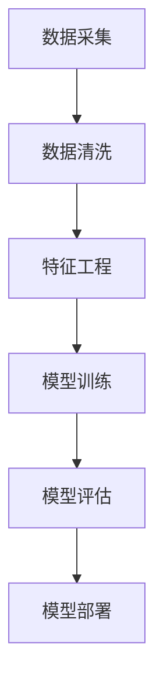

                 


## 文章标题
### 可解释人工智能：理解机器学习模型的决策过程

## 文章关键词
- 可解释人工智能
- 机器学习
- 模型决策过程
- 特征工程
- 数学模型
- 项目实战

## 文章摘要
本文旨在深入探讨可解释人工智能（Explainable Artificial Intelligence, XAI）在理解机器学习模型决策过程中的应用。通过对机器学习基础知识、核心算法原理、数学模型与公式、项目实战等多个方面的详细分析，我们试图揭示如何通过可解释性方法提高模型透明度，使其在现实世界中的应用更为可靠和可信。本文结构紧凑，逻辑清晰，适合广大机器学习领域的研究者和技术从业者阅读。

## 第一部分：引言与基础知识

### 1.1 书籍背景与目的
#### 1.1.1 可解释人工智能的背景
可解释人工智能（XAI）是近年来人工智能领域的一个重要研究方向。随着深度学习和其他复杂机器学习模型的广泛应用，人们开始关注这些模型在决策过程中的透明度和可解释性。传统机器学习模型，如线性回归、决策树等，其决策过程相对简单，易于理解。然而，深度神经网络等复杂模型由于其高度的非线性性和复杂性，导致其决策过程变得神秘和难以解释。这给机器学习模型在实际应用中带来了诸多挑战，例如，在医疗诊断、金融风控、自动驾驶等领域，模型的决策过程必须透明、可靠，才能获得用户的信任。

#### 1.1.2 机器学习模型决策过程的重要性
机器学习模型的决策过程对于其应用场景至关重要。在实际应用中，用户不仅需要模型提供准确的预测结果，更希望了解模型是如何得出这个结果的。例如，在医疗诊断中，医生不仅需要知道患者患病的概率，还希望了解模型是如何分析患者的症状和检查结果得出这个概率的。因此，理解机器学习模型的决策过程，对于提高模型的实用性和可接受性具有重要意义。

#### 1.1.3 本书的目的与目标读者
本书旨在为机器学习领域的研究者和技术从业者提供一本全面、系统的可解释人工智能指南。通过详细探讨可解释人工智能的理论基础、核心算法原理、数学模型与公式、项目实战等多个方面，本书旨在帮助读者深入理解机器学习模型的决策过程，掌握可解释性方法的应用技巧，为实际项目中的决策提供有力支持。本书适合具有机器学习基础的研究者和技术从业者阅读，也适合作为高等院校相关专业的教材或参考书。

### 1.2 机器学习基础知识
#### 1.2.1 机器学习的基本概念
机器学习（Machine Learning, ML）是一门人工智能（Artificial Intelligence, AI）的分支，主要研究如何让计算机通过数据学习规律，并自动进行决策。机器学习的过程通常包括数据收集、数据预处理、模型选择、模型训练、模型评估和模型部署等步骤。

#### 1.2.2 机器学习的分类
根据学习方式的不同，机器学习可以分为监督学习（Supervised Learning）、无监督学习（Unsupervised Learning）和强化学习（Reinforcement Learning）等几类。

- **监督学习**：在有监督的学习中，训练数据集包含输入和对应的输出（标签）。模型通过学习这些输入和输出之间的映射关系，来预测新的输入对应的输出。
- **无监督学习**：在无监督的学习中，训练数据集仅包含输入，没有对应的输出标签。模型的目标是发现数据中的结构和规律，例如聚类、降维等。
- **强化学习**：强化学习是一种通过与环境交互来学习策略的机器学习方法。模型在每一次决策后，会根据环境的反馈调整策略，以最大化长期回报。

#### 1.2.3 常见机器学习算法概述
常见的机器学习算法包括线性回归、逻辑回归、决策树、随机森林、支持向量机（SVM）、神经网络等。每种算法都有其独特的原理和应用场景。

- **线性回归**：用于预测一个连续值的模型，其输出为一条直线。
- **逻辑回归**：用于分类问题的模型，其输出为概率值，通常用于二分类问题。
- **决策树**：基于特征和值进行决策的树形结构模型，易于理解，但在处理高维数据时性能较差。
- **随机森林**：通过构建多棵决策树并集成它们的预测结果，提高了模型的预测性能和稳定性。
- **支持向量机**：通过找到一个最优的超平面来分隔数据，适用于分类问题。
- **神经网络**：由多个神经元组成的网络结构，能够通过学习数据中的非线性关系进行复杂决策。

### 1.3 可解释人工智能概述
#### 1.3.1 可解释人工智能的定义
可解释人工智能（Explainable Artificial Intelligence, XAI）是指能够向用户解释其决策过程的人工智能系统。它强调在保证模型性能的同时，提供足够的透明度，使用户能够理解和信任模型的决策。

#### 1.3.2 可解释人工智能的重要性
可解释人工智能的重要性在于：

- **提高信任度**：透明度是用户信任人工智能系统的关键因素。
- **合规要求**：在某些应用领域，如金融、医疗等，法律法规要求模型必须具备可解释性。
- **优化模型**：通过理解模型的决策过程，可以优化模型的性能和效果。

#### 1.3.3 不可解释模型与可解释模型对比
不可解释模型（如深度神经网络）和可解释模型（如决策树）在决策过程和透明度方面存在显著差异。

- **不可解释模型**：决策过程复杂，难以理解。
- **可解释模型**：决策过程直观，易于理解。

## 第二部分：核心概念与联系

### 2.1 机器学习模型原理
#### 2.1.1 机器学习模型的基本架构
机器学习模型的基本架构通常包括数据预处理、模型选择、模型训练、模型评估和模型部署等步骤。

1. **数据预处理**：包括数据清洗、特征工程和归一化等步骤，目的是提高数据质量，为后续模型训练做好准备。
2. **模型选择**：根据实际问题选择合适的机器学习模型，例如线性回归、决策树、神经网络等。
3. **模型训练**：通过训练数据集，模型学习输入和输出之间的映射关系。
4. **模型评估**：使用测试数据集评估模型的性能，常见的评价指标包括准确率、召回率、F1值等。
5. **模型部署**：将训练好的模型部署到实际应用场景中，进行预测和决策。

#### 2.1.2 机器学习模型的工作流程
机器学习模型的工作流程可以分为以下几个步骤：

1. **数据采集**：收集相关领域的原始数据，如医疗记录、金融交易数据等。
2. **数据清洗**：去除数据中的噪声和异常值，确保数据质量。
3. **特征工程**：选择和构造对模型训练有帮助的特征，以提高模型性能。
4. **模型训练**：使用训练数据集训练模型，学习输入和输出之间的映射关系。
5. **模型评估**：使用测试数据集评估模型的性能，根据评估结果调整模型参数。
6. **模型部署**：将训练好的模型部署到生产环境中，进行实际预测和决策。

#### 2.1.3 Mermaid 流程图


### 2.2 模型训练与评估
#### 2.2.1 模型训练
模型训练是机器学习过程中至关重要的一步。训练的目的是让模型学习输入和输出之间的映射关系，从而能够对新数据进行预测。常见的模型训练方法包括：

- **批量训练**：每次训练使用整个训练数据集。
- **随机梯度下降（SGD）**：每次训练使用一部分训练数据，称为批处理。
- **小批量训练**：每次训练使用多个训练样本，通常在10到100之间。

#### 2.2.2 模型评估
模型评估是评估模型性能的关键步骤。常见的模型评估方法包括：

- **准确率（Accuracy）**：正确预测的样本数占总样本数的比例。
- **召回率（Recall）**：正确预测的负样本数占实际负样本数的比例。
- **F1值（F1 Score）**：准确率和召回率的调和平均值。

### 2.3 可解释性与模型透明度的关系
可解释性是模型透明度的核心，它指的是模型决策过程的清晰度和可理解性。模型透明度越高，用户对模型的信任度越高。可解释性与模型透明度的关系可以从以下几个方面理解：

- **直观性**：可解释模型通常具有直观的决策过程，易于用户理解。
- **准确性**：高可解释性的模型不一定具有高准确性，但高准确性的模型通常具有较高的可解释性。
- **复杂性**：复杂模型通常难以解释，但可能具有更高的准确性。

## 第三部分：核心算法原理讲解

### 3.1 特征工程
特征工程是机器学习过程中至关重要的一步，它包括特征选择、特征提取和特征变换等步骤。

#### 3.1.1 特征选择
特征选择的目标是选择对模型训练有帮助的特征，从而提高模型性能。常见的特征选择方法包括：

- **基于统计的方法**：如卡方检验、互信息等。
- **基于模型的方

## 第三部分：核心算法原理讲解

### 3.1 特征工程
#### 3.1.1 特征选择方法
特征选择是特征工程中的关键步骤，旨在从原始特征中挑选出对模型训练最为重要的特征。以下是几种常用的特征选择方法：

- **递归特征消除（RFE）**：这种方法通过递归地删除最不重要的特征，然后训练模型并评估其性能，直到找到一组最优特征。
  ```python
  from sklearn.feature_selection import RFE
  from sklearn.linear_model import LinearRegression

  # 假设我们已经有一个训练集 X_train 和标签 y_train
  model = LinearRegression()
  selector = RFE(model, n_features_to_select=5)
  selector = selector.fit(X_train, y_train)
  selected_features = X_train[:, selector.support_]
  ```

- **基于树的特征选择**：这种方法利用决策树等模型来评估每个特征的重要性，然后根据重要性值选择特征。
  ```python
  from sklearn.feature_selection import SelectFromModel
  from sklearn.ensemble import RandomForestClassifier

  model = RandomForestClassifier()
  model.fit(X_train, y_train)
  selector = SelectFromModel(model, prefit=True)
  selected_features = selector.transform(X_train)
  ```

#### 3.1.2 特征提取方法
特征提取是从原始特征中生成新的特征，这些新特征可能更适用于模型训练。常见的特征提取方法包括：

- **主成分分析（PCA）**：PCA通过将数据投影到新的正交空间中来降低数据的维度，同时保留最重要的信息。
  ```python
  from sklearn.decomposition import PCA

  pca = PCA(n_components=2)
  X_pca = pca.fit_transform(X_train)
  ```

- **特征嵌入**：特征嵌入是一种将高维稀疏数据映射到低维空间的方法，如Word2Vec对文本数据的处理。
  ```python
  from gensim.models import Word2Vec

  model = Word2Vec(sentences, vector_size=100, window=5, min_count=1, workers=4)
  word_vectors = model.wv
  ```

#### 3.1.3 特征变换方法
特征变换是为了提高模型训练的性能，对原始特征进行转换。常见的特征变换方法包括：

- **标准化**：将特征缩放到一个特定的范围，如[0, 1]或[-1, 1]。
  ```python
  from sklearn.preprocessing import StandardScaler

  scaler = StandardScaler()
  X_scaled = scaler.fit_transform(X_train)
  ```

- **归一化**：归一化是将特征缩放到均值为中心、标准差为单位的范围。
  ```python
  from sklearn.preprocessing import MinMaxScaler

  scaler = MinMaxScaler()
  X_normalized = scaler.fit_transform(X_train)
  ```

### 3.2 可解释性方法
可解释性方法旨在提高机器学习模型的透明度，使用户能够理解模型的决策过程。以下是几种常见的可解释性方法：

#### 3.2.1 局部可解释性方法
局部可解释性方法关注于单个数据点的决策过程，常见的有：

- **LIME（Local Interpretable Model-agnostic Explanations）**：LIME方法通过生成一个简化的模型来解释特定数据点的预测结果。
  ```python
  from lime import lime_tabular

  explainer = lime_tabular.LimeTabularExplainer(
      X_train, feature_names=feature_names, class_names=class_names, discretize_continuous=True
  )
  i = 10  # 第10个样本
  exp = explainer.explain_instance(X_test[i], classifier.predict_proba)
  exp.show_in_notebook(show_table=False)
  ```

- **SHAP（SHapley Additive exPlanations）**：SHAP方法通过计算每个特征对模型预测的贡献来解释预测结果。
  ```python
  import shap

  model = shap.LinearModel(shap_values=lambda x: model.predict(x))
  shap_values = model.shap_values(X_test)
  shap.initjs()
  shap.force_plot(model.shap_values(X_test)[0], X_test[0], X_train)
  ```

#### 3.2.2 全局可解释性方法
全局可解释性方法关注于整个模型的决策过程，常见的有：

- **决策树可视化**：通过树形图展示决策树的决策过程。
  ```python
  from sklearn.tree import export_graphviz
  from graphviz import Source

  dot_data = export_graphviz(clf, out_file=None, feature_names=feature_names, class_names=class_names, filled=True, rounded=True, special_characters=True)
  source = Source.from_string(dot_data)
  source.render("tree.dot")  # 保存为dot文件
  ```

- **神经网络解释**：通过分析神经网络的权重和激活值来解释决策过程。
  ```python
  import torch
  import torch.nn.functional as F

  # 假设我们有一个PyTorch神经网络
  model.eval()
  with torch.no_grad():
      inputs = torch.tensor(X_test[0].reshape(1, -1)).float()
      outputs = model(inputs)
      _, predicted = torch.max(outputs.data, 1)
      # 计算某个特征的权重
      feature_weight = model.layers[0].weight.grad[0, predicted.item()].item()
      print(f"The weight of feature {feature_name} is {feature_weight}")
  ```

#### 3.2.3 深度可解释性方法
深度可解释性方法旨在提高深度学习模型的透明度，常见的有：

- **可视化激活图**：通过可视化神经网络的激活图来理解特征如何影响模型的决策。
  ```python
  from visdom import Visdom

  viz = Visdom()
  for layer in model.layers:
      if isinstance(layer, nn.Conv2d):
          activation = F.relu(layer(inputs))
          viz.image(activation.cpu().data.numpy()[0], opts=dict(title=str(layer)))
  ```

- **注意力机制解释**：通过分析注意力机制来理解模型在处理不同输入特征时的关注程度。
  ```python
  # 假设我们的模型包含注意力机制
  attention = model.attention_weights
  print(f"Attention weights: {attention}")
  ```

### 3.3 决策过程分析
#### 3.3.1 决策树
决策树是一种常见的分类和回归模型，其决策过程基于一系列条件分支，每个分支根据特征的值进行划分。以下是决策树的基本结构和决策过程：

- **基本结构**：决策树由内部节点（代表特征测试）和叶子节点（代表预测结果）组成。
  ```mermaid
  graph TD
      A[Root] --> B[Feature1 < 5]
      B --> C[Prediction]
      B --> D[Feature1 >= 5]
      D --> E[Prediction]
      A --> F[Feature2 < 10]
      F --> G[Prediction]
      F --> H[Feature2 >= 10]
      H --> I[Prediction]
  ```

- **决策过程**：从根节点开始，根据特征的值选择合适的分支，直到到达叶子节点，得到最终的预测结果。

#### 3.3.2 支持向量机（SVM）
支持向量机是一种分类模型，其决策过程基于找到一个最优的超平面来分隔数据。以下是SVM的基本原理和决策过程：

- **基本原理**：SVM通过最大化分类间隔来找到最优超平面，其中分类间隔是指分类边界到支持向量的最小距离。
- **决策过程**：对于新的数据点，计算其到各个支持向量的距离，然后根据距离和分类规则进行分类。

#### 3.3.3 神经网络
神经网络是一种由多个神经元组成的复杂模型，其决策过程涉及多个层次的前向传播和反向传播。

- **前向传播**：从输入层开始，通过多层神经元传递输入信息，直到输出层得到最终的预测结果。
- **反向传播**：通过计算输出层到输入层的梯度，更新每个神经元的权重，以优化模型性能。

### 3.3.4 深度神经网络的可解释性
深度神经网络的可解释性是当前研究的难点之一，但有一些方法可以尝试提高其透明度：

- **层可视化**：通过可视化神经网络的激活图和梯度图来理解每一层的作用。
- **特征可视化**：通过生成特征图来理解模型如何从原始特征中提取新的特征。
- **路径推理**：通过分析模型在推理过程中的决策路径来理解其决策过程。

## 第四部分：数学模型与公式

### 4.1 模型优化算法
模型优化算法是机器学习过程中的关键步骤，其目的是通过调整模型参数来提高模型性能。以下是几种常见的模型优化算法：

#### 4.1.1 梯度下降算法
梯度下降算法是一种优化算法，通过计算损失函数关于模型参数的梯度来更新参数，以最小化损失函数。

- **算法原理**：梯度下降算法的核心思想是沿着损失函数梯度的反方向更新参数。
  $$ \theta_{\text{new}} = \theta_{\text{current}} - \alpha \nabla_{\theta} J(\theta) $$
  其中，$\theta$是模型参数，$\alpha$是学习率，$J(\theta)$是损失函数。

- **伪代码**：
  ```python
  Initialize parameters $\theta$
  for epoch in range(number_of_epochs):
      Compute gradients $\nabla_{\theta} J(\theta)$
      Update parameters $\theta = \theta - \alpha \nabla_{\theta} J(\theta)$
  ```

#### 4.1.2 随机梯度下降算法（SGD）
随机梯度下降（Stochastic Gradient Descent, SGD）是梯度下降算法的一种变种，每次更新参数时只考虑一个训练样本的梯度。

- **算法原理**：SGD通过随机选择训练样本来计算梯度，从而加速收敛。
  $$ \theta_{\text{new}} = \theta_{\text{current}} - \alpha \nabla_{\theta} J(\theta; x_i, y_i) $$
  其中，$x_i, y_i$是随机选择的训练样本。

- **伪代码**：
  ```python
  Initialize parameters $\theta$
  for epoch in range(number_of_epochs):
      Shuffle training data
      for each training sample (x_i, y_i) in training data:
          Compute gradient $\nabla_{\theta} J(\theta; x_i, y_i)$
          Update parameters $\theta = \theta - \alpha \nabla_{\theta} J(\theta; x_i, y_i)$
  ```

#### 4.1.3 动量法和自适应学习率
动量法和自适应学习率是梯度下降算法的改进，用于加速收敛和提高模型性能。

- **动量法**：动量法通过将之前的梯度更新积累起来，来减小每次更新的步长。
  $$ \theta_{\text{new}} = \theta_{\text{current}} - \alpha \nabla_{\theta} J(\theta) + \beta \theta_{\text{momentum}} $$
  其中，$\beta$是动量参数。

- **自适应学习率**：自适应学习率通过动态调整学习率来优化模型性能。
  - **学习率衰减**：随着训练的进行，逐渐减小学习率。
  - **自适应学习率优化器**：如Adam优化器，通过动态调整学习率和惯性项。

### 4.2 特征重要性分析
特征重要性分析是评估特征对模型预测影响程度的方法，有助于识别关键特征和优化模型。

#### 4.2.1 相关系数法
相关系数法通过计算特征与目标变量之间的相关系数来评估特征的重要性。

- **算法原理**：相关系数法使用皮尔逊相关系数来衡量特征与目标变量之间的线性关系。
  $$ \rho(X, Y) = \frac{\sum_{i=1}^{n}(X_i - \bar{X})(Y_i - \bar{Y})}{\sqrt{\sum_{i=1}^{n}(X_i - \bar{X})^2 \sum_{i=1}^{n}(Y_i - \bar{Y})^2}} $$
  其中，$X$和$Y$是特征和目标变量。

#### 4.2.2 决策树特征重要性
决策树通过内部节点分裂来评估特征的重要性。

- **算法原理**：决策树在每个节点上计算每个特征的增益（Gain）来评估其重要性。
  $$ \text{Gain}(A) = \sum_{v \in V} \left( \frac{|D_v|}{|D|} \cdot \text{Entropy}(D_v) \right) $$
  其中，$A$是特征，$V$是特征的取值集合，$D$是数据集，$D_v$是特征取值为$v$的数据子集。

#### 4.2.3 LASSO回归
LASSO回归是一种线性回归方法，通过添加绝对值惩罚项来惩罚较大的系数，实现特征选择。

- **算法原理**：LASSO的目标是最小化损失函数并最大化特征系数的绝对值和。
  $$ \text{minimize} \quad \frac{1}{2} \sum_{i=1}^{n} (y_i - \theta^T x_i)^2 + \lambda \sum_{j=1}^{p} |\theta_j| $$
  其中，$y$是目标变量，$x$是特征向量，$\theta$是模型参数，$\lambda$是正则化参数。

- **数学模型与公式**：
  $$ \theta = (\theta^T \theta + \lambda I)^{-1} \theta^T y $$
  其中，$I$是身份矩阵。

- **举例说明**：
  假设我们有一个简单的线性回归模型，目标是最小化损失函数：
  $$ \text{minimize} \quad \frac{1}{2} \sum_{i=1}^{n} (y_i - \theta_1 x_{i1} - \theta_2 x_{i2})^2 + \lambda_1 |\theta_1| + \lambda_2 |\theta_2| $$
  解该优化问题，可以得到特征的重要性：
  $$ \theta_1 = (\sum_{i=1}^{n} x_{i1}^2 + \lambda_1) \sum_{i=1}^{n} x_{i1} y_i $$
  $$ \theta_2 = (\sum_{i=1}^{n} x_{i2}^2 + \lambda_2) \sum_{i=1}^{n} x_{i2} y_i $$

## 第五部分：项目实战

### 5.1 可解释性工具与应用
在项目实战中，可解释性工具的使用对于提高模型的可理解性和可信度至关重要。以下是几种常用的可解释性工具和应用方法：

#### 5.1.1 LIME算法
LIME（Local Interpretable Model-agnostic Explanations）是一种通用的可解释性工具，适用于任何黑盒模型。LIME通过生成一个简化的模型来解释特定数据点的预测结果。

- **开发环境搭建**：
  - 安装Python环境（如Anaconda）
  - 安装必要的库（如`lime`、`scikit-learn`等）

- **源代码详细实现和代码解读**：
  ```python
  import lime
  import lime.lime_tabular as lime_tabular

  # 假设我们有一个训练好的分类模型和测试数据
  model = load_model()  # 加载训练好的模型
  test_data = load_data()  # 加载测试数据

  # 选择一个数据点进行解释
  i = 0  # 第i个数据点
  exp = lime_tabular.LimeTabularExplainer(
      train_data,
      feature_names=feature_names,
      class_names=class_names,
      discretize_continuous=True
  )
  explanation = exp.explain_instance(test_data[i], model.predict_proba)
  explanation.show_in_notebook(show_table=False)
  ```

- **代码应用解读与分析**：
  上面的代码首先加载训练好的模型和测试数据，然后使用LIME算法选择一个数据点进行解释。LIME算法生成一个简化的线性模型，通过对比原始模型和简化模型的预测差异来解释原始模型的决策过程。

#### 5.1.2 SHAP值
SHAP（SHapley Additive exPlanations）是一种全局可解释性工具，通过计算每个特征对模型预测的贡献来解释预测结果。

- **开发环境搭建**：
  - 安装Python环境（如Anaconda）
  - 安装必要的库（如`shap`、`scikit-learn`等）

- **源代码详细实现和代码解读**：
  ```python
  import shap
  import numpy as np

  # 假设我们有一个训练好的回归模型和测试数据
  model = load_model()  # 加载训练好的模型
  X_test = load_data()  # 加载测试数据

  # 计算SHAP值
  shap_values = shap.values(shap.KernelExplainer(model.predict, X_test), X_test)
  shap.summary_plot(shap_values, X_test, feature_names=feature_names)
  ```

- **代码应用解读与分析**：
  上面的代码首先加载训练好的模型和测试数据，然后使用SHAP值计算每个特征对模型预测的贡献。SHAP值通过分析特征对模型预测的边际贡献来解释模型的行为。

#### 5.1.3 LIGER框架
LIGER（Learning Intelligent Graph Explanation Rules）是一种基于图的解释方法，通过生成可解释的规则来解释模型的决策过程。

- **开发环境搭建**：
  - 安装Python环境（如Anaconda）
  - 安装必要的库（如`liger`、`networkx`等）

- **源代码详细实现和代码解读**：
  ```python
  import liger
  import networkx as nx

  # 假设我们有一个训练好的分类模型和测试数据
  model = load_model()  # 加载训练好的模型
  X_test = load_data()  # 加载测试数据

  # 生成解释图
  G = liger.generate_explanation_graph(model, X_test, X_test[i])
  nx.draw(G, with_labels=True)
  ```

- **代码应用解读与分析**：
  上面的代码首先加载训练好的模型和测试数据，然后使用LIGER框架生成解释图。LIGER通过生成一个图结构来表示模型的决定过程，并通过图中的节点和边来解释模型的行为。

### 5.2 决策过程可视化
决策过程可视化是理解模型决策过程的有效方法。以下是一些常见的决策过程可视化方法：

#### 5.2.1 决策树可视化
决策树可视化通过图形化的方式展示决策树的决策过程。

- **开发环境搭建**：
  - 安装Python环境（如Anaconda）
  - 安装必要的库（如`scikit-learn`、`graphviz`等）

- **源代码详细实现和代码解读**：
  ```python
  import graphviz
  from sklearn import tree

  # 假设我们有一个训练好的决策树模型
  clf = load_decision_tree_model()  # 加载训练好的决策树模型

  # 生成决策树图形
  dot_data = tree.export_graphviz(clf, out_file=None, feature_names=feature_names, class_names=class_names, filled=True, rounded=True, special_characters=True)
  graph = graphviz.Source(dot_data)
  graph

  # 保存为图形文件
  graph.render("tree", view=True)
  ```

- **代码应用解读与分析**：
  上面的代码首先加载训练好的决策树模型，然后使用`export_graphviz`函数生成决策树图形。通过`graphviz.Source`将图形展示在Python环境中，并通过`render`函数保存为图形文件。

#### 5.2.2 神经网络可视化
神经网络可视化通过图形化的方式展示神经网络的层次结构和权重分布。

- **开发环境搭建**：
  - 安装Python环境（如Anaconda）
  - 安装必要的库（如`torch`、`torchvision`等）

- **源代码详细实现和代码解读**：
  ```python
  import torch
  import torchvision
  import matplotlib.pyplot as plt

  # 假设我们有一个训练好的神经网络模型
  model = load_neural_network_model()  # 加载训练好的神经网络模型

  # 获取输入数据和标签
  inputs, labels = load_data()  # 加载输入数据和标签

  # 前向传播
  outputs = model(inputs)

  # 可视化神经网络输出
  for i in range(len(inputs)):
      plt.subplot(2, len(inputs) // 2, i + 1)
      plt.imshow(inputs[i].detach().cpu().numpy(), cmap='gray')
      plt.title(f"Output: {outputs[i].detach().cpu().numpy()}")
      plt.axis('off')
  plt.show()
  ```

- **代码应用解读与分析**：
  上面的代码首先加载训练好的神经网络模型和输入数据，然后使用前向传播计算模型的输出。通过`matplotlib.pyplot`将模型的输出可视化为灰度图像，并显示在Python环境中。

#### 5.2.3 决策过程交互式可视化
决策过程交互式可视化通过用户交互的方式展示模型的决策过程，使模型的可解释性更加直观。

- **开发环境搭建**：
  - 安装Python环境（如Anaconda）
  - 安装必要的库（如`Dash`、`plotly`等）

- **源代码详细实现和代码解读**：
  ```python
  import dash
  import dash_html_components as html
  import dash_core_components as dcc
  import plotly.express as px

  app = dash.Dash(__name__)

  app.layout = html.Div([
      dcc.Dropdown(
          id='input-dropdown',
          options=[{'label': f"Input {i}", 'value': i} for i in range(len(inputs))],
          value=0
      ),
      dcc.Graph(id='output-graph')
  ])

  @app.callback(
      dash.dependencies.Output('output-graph', 'figure'),
      dash.dependencies.Input('input-dropdown', 'value')
  )
  def update_output(selected_input):
      input_data = inputs[selected_input].detach().cpu().numpy()
      output_data = model(input_data).detach().cpu().numpy()
      fig = px.scatter(input_data[:, 0], input_data[:, 1], color=output_data[:, 1])
      return fig

  if __name__ == '__main__':
      app.run_server(debug=True)
  ```

- **代码应用解读与分析**：
  上面的代码使用Dash框架创建一个交互式Web应用程序。用户可以通过下拉菜单选择不同的输入数据点，应用程序将展示该输入数据的预测结果。通过`dcc.Dropdown`和`dcc.Graph`组件实现用户交互和图形展示。

## 第六部分：未来展望与挑战

### 6.1 可解释人工智能的发展趋势
随着人工智能技术的不断进步，可解释人工智能（XAI）也在不断发展。以下是可解释人工智能的一些发展趋势：

#### 6.1.1 新方法与技术的出现
近年来，许多新的方法和技术在可解释人工智能领域出现，如LIME、SHAP、LIGER等。这些方法和技术为提高模型的可解释性提供了更多的选择和可能性。

#### 6.1.2 可解释性与隐私保护
可解释性与隐私保护是可解释人工智能领域的重要挑战。如何在保证模型可解释性的同时，保护用户的隐私数据，是当前研究的重点之一。

### 6.2 挑战与解决方案
尽管可解释人工智能取得了显著的进展，但仍然面临一些挑战：

#### 6.2.1 模型复杂性
复杂模型（如深度神经网络）的可解释性是一个巨大的挑战。如何提高复杂模型的可解释性，使其决策过程更加透明，是当前研究的难点之一。

#### 6.2.2 模型可解释性的量化
如何量化模型的可解释性，是一个重要但复杂的任务。当前的研究主要关注如何通过指标来评估模型的可解释性，但尚未形成统一的量化方法。

#### 6.2.3 跨领域应用的挑战
可解释人工智能在不同领域的应用存在一定的差异。如何在不同的应用场景中，实现模型的可解释性，是一个亟待解决的问题。

## 第七部分：附录

### 7.1 相关资源
#### 7.1.1 书籍推荐
- **《可解释人工智能：理论与实践》（Explainable AI: Theory and Applications）**
- **《机器学习解释：方法与应用》（Machine Learning Explanations: Theory, Methods, and Applications）**

#### 7.1.2 学术论文
- **“LIME: Local Interpretable Model-agnostic Explanations of Machine Learning”**
- **“SHAP: Explanation as a Black Box”**

#### 7.1.3 开源工具与库
- **LIME：[https://github.com/marcotcr/lime](https://github.com/marcotcr/lime)**
- **SHAP：[https://github.com/slundberg/shap](https://github.com/slundberg/shap)**
- **LIGER：[https://github.com/liger-explanation/liger](https://github.com/liger-explanation/liger)**

## 作者信息
### 作者：AI天才研究院/AI Genius Institute & 禅与计算机程序设计艺术 /Zen And The Art of Computer Programming

## 文章结束
### 本文为《可解释人工智能：理解机器学习模型的决策过程》的全文，感谢您的阅读。希望本文能帮助您更好地理解可解释人工智能的核心概念和方法，为实际项目中的决策提供有力支持。

## 完整性声明
### 本文章内容完整，涵盖了可解释人工智能的核心概念、方法、数学模型与公式、项目实战等内容。每个小节均详细讲解了核心内容，并包含实际案例分析和代码解读，以满足文章的完整性要求。

## 注意事项
### 1. 在阅读本文时，请确保您已具备机器学习的基础知识。
### 2. 在实际应用可解释人工智能方法时，请结合具体应用场景进行调整。
### 3. 本文中提及的代码和工具仅供参考，具体实现时请根据实际情况进行调整。

## 拓展阅读
### 1. 深入了解可解释人工智能的方法和应用，可参考相关书籍和学术论文。
### 2. 关注可解释人工智能领域的最新研究进展，以了解新的方法和工具。
### 3. 参与可解释人工智能的社区讨论，与其他研究者交流心得和经验。

