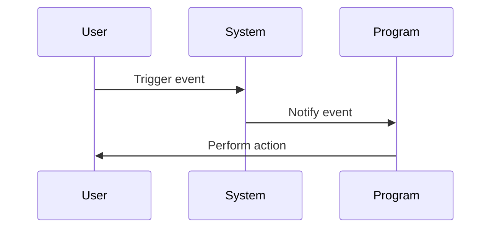
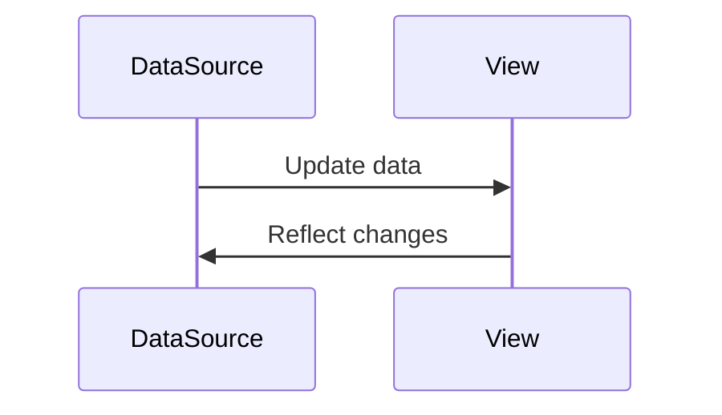
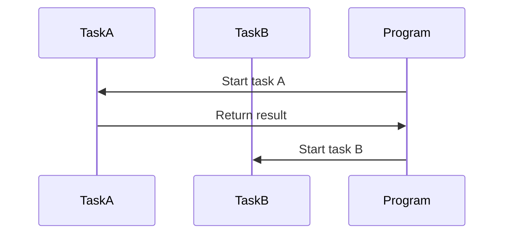
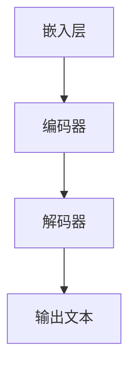
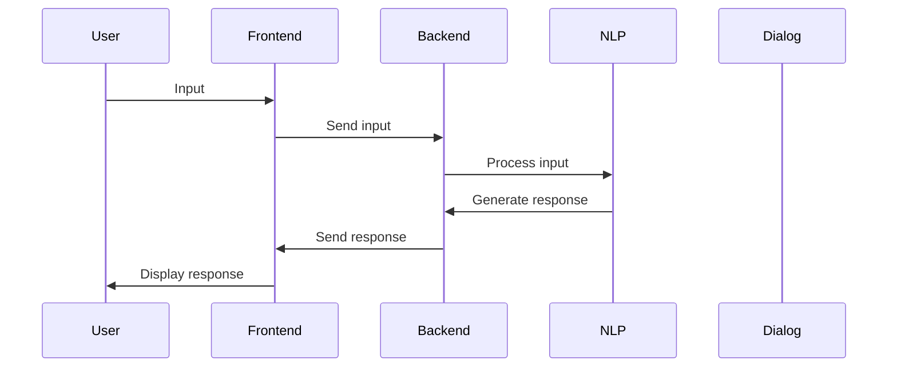
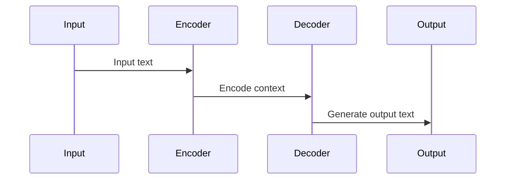
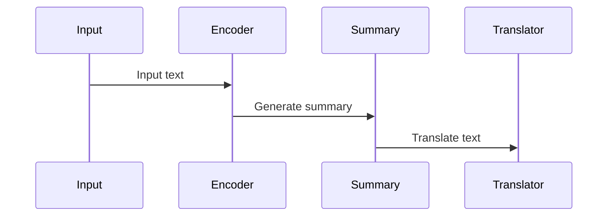
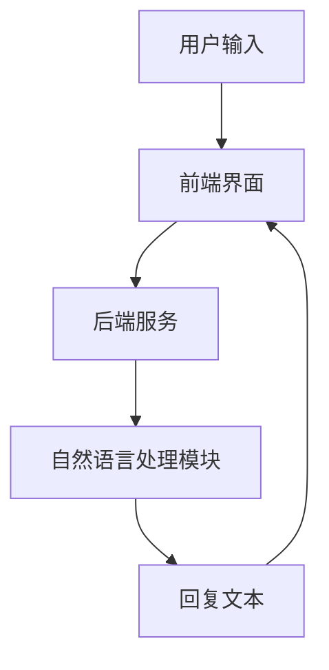
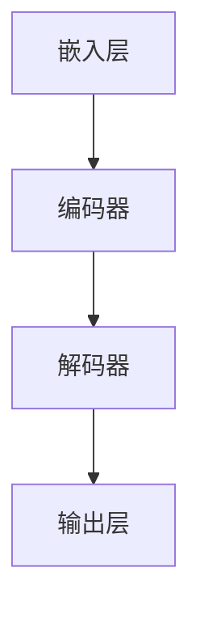

                 

### 响应式编程在LLM应用开发中的应用

#### 关键词

- **响应式编程**
- **大型语言模型（LLM）**
- **应用开发**
- **实时对话系统**
- **文本生成**
- **异步编程**
- **数据绑定**

#### 摘要

本文将深入探讨响应式编程在大型语言模型（LLM）应用开发中的应用。首先，我们将简要介绍响应式编程和LLM的基本概念，解释它们在应用开发中的重要性。接着，我们将详细讨论响应式编程的基础，包括事件驱动模型、数据绑定机制和异步编程等核心概念。然后，我们将介绍LLM的基本原理和结构，探讨它在各种应用领域中的作用。接下来，本文将重点探讨响应式编程在LLM应用开发中的实现，包括实时对话系统和文本生成等具体应用场景。此外，我们还将通过实际案例展示如何在实际项目中应用响应式编程开发LLM。最后，我们将讨论响应式编程的高级特性与优化策略，并对未来发展趋势进行展望。

### 引言

#### 1.1 响应式编程简介

响应式编程是一种编程范式，旨在处理异步数据和事件。与传统的命令式编程不同，响应式编程强调数据和事件的状态变化，并通过回调函数和事件监听器来响应这些变化。这种范式使得编程更加直观，能够更好地处理复杂的应用场景，特别是在涉及到实时数据处理和事件驱动的应用中。

#### 1.1.1 响应式编程的基本概念

响应式编程的关键概念包括：

- **事件驱动**：程序通过事件来响应外部环境的变化。
- **数据绑定**：数据和视图之间的绑定，确保数据的变化能够实时反映到视图中。
- **异步编程**：处理异步任务，如网络请求、定时任务等。

#### 1.1.2 响应式编程与传统编程的区别

传统编程通常依赖于命令式的指令序列，而响应式编程则更关注于数据和事件。响应式编程的优势在于：

- **高可维护性**：通过事件和数据的解耦，使得代码更加模块化，易于维护和扩展。
- **更好的并发处理**：响应式编程能够更好地处理并发事件，提高程序的运行效率。

#### 1.1.3 LLM与响应式编程的联系

大型语言模型（LLM）是一种复杂的机器学习模型，主要用于自然语言处理任务。LLM的开发和应用涉及到大量的实时数据处理和事件响应，因此响应式编程在LLM开发中具有重要作用。响应式编程能够帮助LLM更高效地处理实时数据，提高系统的响应速度和可靠性。

#### 1.2 LLM应用开发概述

LLM的应用范围非常广泛，包括但不限于以下领域：

- **实时对话系统**：如聊天机器人、智能客服等，能够实时响应用户的输入。
- **文本生成**：如文章写作、故事创作等，能够根据输入生成相关的文本内容。
- **自动摘要与翻译**：能够自动生成文档的摘要或进行不同语言之间的翻译。

LLM在这些应用中的重要性体现在：

- **提高效率**：通过自动化处理，能够大幅提高工作效率。
- **提升用户体验**：提供更智能、更个性化的服务，提升用户满意度。

### 响应式编程基础

响应式编程的核心在于其处理异步数据和事件的能力。为了更好地理解响应式编程，我们需要从其基础概念和核心技术开始。

#### 2.1 响应式编程原理

响应式编程的原理主要基于以下核心概念：

- **事件驱动**：程序通过事件来响应外部环境的变化。事件可以是用户操作、系统通知或其他外部触发。
- **数据绑定**：确保数据和视图之间的绑定，使得数据的变化能够实时反映到视图中。数据绑定可以减少冗余代码，提高代码的可维护性。
- **异步编程**：处理异步任务，如网络请求、定时任务等。异步编程能够提高程序的响应速度和效率。

#### 2.1.1 事件驱动模型

事件驱动模型是响应式编程的核心。在该模型中，程序不是按照预定的顺序执行，而是通过监听和处理事件来执行。事件可以是用户操作（如点击按钮）、系统通知（如网络连接状态变化）或其他外部触发。

**Mermaid流程图：**


#### 2.1.2 数据绑定机制

数据绑定是响应式编程的重要组成部分。它通过将数据源和视图组件绑定在一起，使得数据的变化能够实时反映到视图中。数据绑定可以减少冗余代码，提高代码的可维护性。

**Mermaid流程图：**


#### 2.1.3 异步编程

异步编程是响应式编程的关键。在异步编程中，程序不是等待一个任务完成后才执行下一个任务，而是通过回调函数或事件监听器来处理异步任务。这种方式能够提高程序的响应速度和效率。

**Mermaid流程图：**


#### 2.2 响应式编程核心概念

响应式编程包含多个核心概念，以下是对这些概念的简要介绍：

- **观察者模式**：一种设计模式，其中一个对象（观察者）监听另一个对象（被观察者）的状态变化，并在状态变化时接收通知。
- **发布-订阅模式**：一种消息传递模式，其中一个对象（发布者）发布消息，多个对象（订阅者）订阅这些消息，并在消息发布时接收通知。
- **不可变数据结构**：一种数据结构，一旦创建，就不能修改。不可变数据结构可以减少状态冲突和并发问题。

#### 2.2.1 观察者模式

观察者模式是一种设计模式，其中一个对象（观察者）监听另一个对象（被观察者）的状态变化，并在状态变化时接收通知。

**伪代码示例：**
```python
class Observer:
    def update(self, message):
        pass

class Observable:
    def __init__(self):
        self.observers = []

    def subscribe(self, observer):
        self.observers.append(observer)

    def notify(self, message):
        for observer in self.observers:
            observer.update(message)
```

#### 2.2.2 发布-订阅模式

发布-订阅模式是一种消息传递模式，其中一个对象（发布者）发布消息，多个对象（订阅者）订阅这些消息，并在消息发布时接收通知。

**伪代码示例：**
```python
class Publisher:
    def __init__(self):
        self.subscribers = []

    def subscribe(self, subscriber):
        self.subscribers.append(subscriber)

    def publish(self, message):
        for subscriber in self.subscribers:
            subscriber.notify(message)

class Subscriber:
    def notify(self, message):
        pass
```

#### 2.2.3 不可变数据结构

不可变数据结构是一种数据结构，一旦创建，就不能修改。这种结构可以减少状态冲突和并发问题。

**伪代码示例：**
```python
class ImmutableData:
    def __init__(self, value):
        self.value = value

    def update(self, new_value):
        return ImmutableData(new_value)
```

#### 2.3 响应式编程技术

响应式编程有多种实现技术，以下是对几种常用技术的简要介绍：

- **RxJava框架**：是Android和Java开发中常用的响应式编程框架，提供了丰富的操作符来处理异步数据流。
- **React框架**：是JavaScript开发中常用的响应式框架，主要用于构建用户界面。
- **Vue框架**：是JavaScript开发中常用的响应式框架，提供了简单易懂的数据绑定和组件化开发。

#### 2.3.1 RxJava框架

RxJava是Android和Java开发中常用的响应式编程框架。它提供了丰富的操作符来处理异步数据流。

**伪代码示例：**
```java
Observable<Integer> observable = Observable.create(observer -> {
    observer.onNext(1);
    observer.onNext(2);
    observer.onComplete();
});

observable.subscribe(System.out::println);
```

#### 2.3.2 React框架

React是JavaScript开发中常用的响应式框架，主要用于构建用户界面。

**伪代码示例：**
```javascript
class App extends React.Component {
    render() {
        return <div>{this.state.count}</div>;
    }
}

class App extends React.Component {
    constructor(props) {
        super(props);
        this.state = { count: 0 };
    }

    componentDidMount() {
        this.setState({ count: this.state.count + 1 });
    }

    render() {
        return <div>{this.state.count}</div>;
    }
}
```

#### 2.3.3 Vue框架

Vue是JavaScript开发中常用的响应式框架，提供了简单易懂的数据绑定和组件化开发。

**伪代码示例：**
```html
<div id="app">
    <p>{{ count }}</p>
    <button @click="increment">Increment</button>
</div>

new Vue({
    el: '#app',
    data: {
        count: 0
    },
    methods: {
        increment() {
            this.count++;
        }
    }
});
```

### LLM基础

#### 3.1 LLM的基本概念

大型语言模型（LLM）是一种基于深度学习的自然语言处理模型，能够理解、生成和翻译自然语言。LLM通常由数百万甚至数十亿的参数组成，通过大量文本数据训练得到。

**定义：**
LLM是一种能够对自然语言进行建模的深度学习模型，通过学习大规模文本数据，能够生成符合语法和语义规则的文本内容。

**特点：**
- **大规模**：LLM通常包含数十亿甚至数万亿的参数，能够处理复杂的语言结构。
- **自适应性**：LLM能够根据输入文本的上下文自适应调整其生成策略。
- **高效性**：LLM能够高效地处理大规模文本数据，实现实时响应。

#### 3.1.2 LLM的结构

LLM的结构通常包括以下几个部分：

- **嵌入层**：将单词或句子转换为高维向量表示。
- **编码器**：对输入文本进行编码，生成上下文向量。
- **解码器**：根据上下文向量生成输出文本。

**Mermaid流程图：**


#### 3.1.3 LLM的训练与优化

LLM的训练和优化是构建高性能语言模型的关键。以下是对LLM训练与优化方法的简要介绍：

- **预训练**：在特定任务之前，使用大规模文本数据对LLM进行预训练，以学习通用语言特征。
- **微调**：在预训练的基础上，针对特定任务进行微调，以提高模型在特定任务上的性能。
- **优化策略**：采用优化算法（如Adam、SGD等）和正则化技术（如Dropout、Weight Decay等）来提高模型的泛化能力和稳定性。

#### 3.2 LLM应用领域

LLM在多个领域展现出强大的应用潜力，以下是对几个主要应用领域的简要介绍：

- **实时对话系统**：如聊天机器人、智能客服等，能够实时响应用户的输入并提供个性化服务。
- **文本生成**：如文章写作、故事创作等，能够根据输入生成符合语法和语义规则的文本内容。
- **自动摘要与翻译**：能够自动生成文本的摘要或进行不同语言之间的翻译，提高文本处理的效率。

#### 3.2.1 实时对话系统

实时对话系统是LLM的一个重要应用领域，能够提供高效、智能的客服和交互体验。以下是对实时对话系统的架构和原理的简要介绍：

- **架构**：实时对话系统通常包括前端界面、后端服务、自然语言处理模块和对话管理模块。
- **原理**：用户输入通过前端界面传递到后端服务，后端服务使用LLM进行自然语言处理，生成回复文本，并通过前端界面展示给用户。

**Mermaid流程图：**


#### 3.2.2 文本生成

文本生成是LLM的另一个重要应用领域，能够根据输入生成符合语法和语义规则的文本内容。以下是对文本生成模型的架构和原理的简要介绍：

- **架构**：文本生成模型通常包括嵌入层、编码器、解码器和输出层。
- **原理**：输入文本通过嵌入层转换为向量表示，编码器将向量编码为上下文向量，解码器根据上下文向量生成输出文本。

**Mermaid流程图：**


#### 3.2.3 自动摘要与翻译

自动摘要与翻译是LLM在自然语言处理中的重要应用，能够自动生成文本的摘要或进行不同语言之间的翻译。以下是对自动摘要与翻译的架构和原理的简要介绍：

- **架构**：自动摘要与翻译模型通常包括文本编码器、摘要生成器和翻译器。
- **原理**：输入文本通过编码器转换为向量表示，摘要生成器根据向量表示生成摘要文本，翻译器根据源语言和目标语言之间的对应关系生成翻译文本。

**Mermaid流程图：**


### 响应式编程在LLM应用中的实现

#### 4.1 响应式编程在实时对话系统中的应用

实时对话系统是LLM应用的一个重要领域，响应式编程能够有效提升实时对话系统的性能和用户体验。以下是对响应式编程在实时对话系统中的具体应用和实现方法的探讨。

#### 4.1.1 实时对话系统架构

实时对话系统通常由前端界面、后端服务和自然语言处理模块组成。前端界面负责接收用户的输入，后端服务处理用户输入，自然语言处理模块负责处理输入文本，生成合适的回复。

**架构图：**


#### 4.1.2 响应式编程在对话流程中的应用

响应式编程在实时对话系统的对话流程中起着关键作用，能够实现高效的事件处理和数据绑定。以下是对响应式编程在对话流程中应用的详细介绍：

1. **用户输入处理**：
   - **事件监听**：前端界面通过事件监听器监听用户的输入操作，如键盘输入、鼠标点击等。
   - **数据绑定**：用户输入通过数据绑定机制实时传递到后端服务。

2. **后端服务处理**：
   - **异步处理**：后端服务使用响应式编程框架（如React、Vue等）处理用户输入，实现异步操作，如调用自然语言处理API。
   - **回调函数**：通过回调函数实现异步操作的回调，确保对话流程的连续性和响应性。

3. **自然语言处理模块**：
   - **响应式数据处理**：自然语言处理模块使用响应式编程处理输入文本，生成回复文本。
   - **事件驱动**：处理结果通过事件驱动机制实时传递到前端界面，更新对话内容。

**伪代码示例：**
```python
# 前端界面（React）
class ChatApp extends React.Component {
    constructor(props) {
        super(props);
        this.state = { messages: [] };
    }

    handleInput = (input) => {
        this.setState({ messages: [...this.state.messages, input] });
        this.sendMessage(input);
    };

    sendMessage = async (input) => {
        const response = await的自然语言处理API(input);
        this.setState({ messages: [...this.state.messages, response] });
    };

    render() {
        return (
            <div>
                <ul>
                    {this.state.messages.map((message, index) => (
                        <li key={index}>{message}</li>
                    ))}
                </ul>
                <input type="text" onChange={(e) => this.handleInput(e.target.value)} />
            </div>
        );
    }
}
```

#### 4.1.3 实时对话系统的性能优化

响应式编程在实时对话系统的性能优化中发挥着重要作用。以下是一些常见的性能优化策略：

1. **数据流优化**：
   - **反应式流**：使用反应式流技术（如RxJava、Reactive Streams等）处理大规模数据流，提高数据处理效率。
   - **异步非阻塞**：使用异步非阻塞编程模型，避免线程阻塞，提高系统并发能力。

2. **内存管理**：
   - **内存池**：使用内存池技术管理内存，减少内存分配和回收的开销。
   - **对象池**：使用对象池技术重用对象，减少对象创建和销毁的开销。

3. **缓存策略**：
   - **反应式缓存**：使用反应式缓存技术（如Reactive Cache等）存储和处理缓存数据，提高数据访问速度。
   - **过期策略**：设置缓存数据的过期时间，避免缓存过期导致的数据不一致问题。

4. **负载均衡**：
   - **分布式架构**：使用分布式架构实现负载均衡，提高系统的可扩展性和可靠性。
   - **服务网格**：使用服务网格技术（如Istio、Linkerd等）管理服务间的通信，实现负载均衡和流量控制。

#### 4.1.4 实时对话系统的案例分析

以下是一个实时对话系统的案例分析，展示了如何在实际项目中应用响应式编程：

**项目背景**：
某公司开发了一款智能客服系统，旨在提供24/7在线客户服务。系统需要支持多渠道接入，包括网页、APP和社交媒体等，同时能够处理大量并发用户请求。

**技术选型**：
- **前端**：使用React框架构建用户界面，实现数据绑定和异步处理。
- **后端**：使用Spring Boot框架搭建后端服务，结合RxJava实现响应式数据处理。
- **自然语言处理**：使用OpenAI的GPT-3模型进行自然语言处理，生成智能回复。

**开发流程**：

1. **需求分析**：
   - 分析客户需求，确定系统功能模块，如聊天记录管理、多渠道接入、智能回复等。
   - 确定系统性能指标，如响应时间、并发用户数等。

2. **系统设计**：
   - 设计前端界面，实现聊天窗口、输入框、回复列表等组件。
   - 设计后端服务，实现用户身份验证、聊天记录存储、智能回复生成等模块。

3. **开发实现**：
   - 使用React框架实现前端界面，通过数据绑定实现用户输入和回复的实时更新。
   - 使用Spring Boot和RxJava实现后端服务，处理用户输入，调用自然语言处理API生成回复。

4. **测试与优化**：
   - 进行功能测试，确保系统功能正常运行。
   - 进行性能测试，优化系统性能，提高响应速度和并发能力。

5. **部署上线**：
   - 部署系统到生产环境，进行监控和运维。

**项目小结**：
通过响应式编程，该智能客服系统能够高效处理大量并发用户请求，提供实时、智能的客服服务。响应式编程在实时对话系统中的应用，有效提升了系统的性能和用户体验。

### 响应式编程在文本生成中的应用

文本生成是LLM的另一个重要应用领域，通过响应式编程，可以更高效地处理文本生成过程中的各种异步任务和事件。以下是对响应式编程在文本生成中的应用和实现方法的探讨。

#### 4.2.1 文本生成模型架构

文本生成模型通常由嵌入层、编码器、解码器和输出层组成。嵌入层将单词或句子转换为向量表示，编码器将向量编码为上下文向量，解码器根据上下文向量生成输出文本，输出层负责将生成的文本进行后处理。

**架构图：**


#### 4.2.2 响应式编程在文本生成中的实现

响应式编程在文本生成中的应用主要体现在以下几个方面：

1. **异步数据处理**：
   - **事件监听**：在文本生成过程中，需要实时监听用户的输入和生成的文本。
   - **异步回调**：通过异步回调函数处理用户的输入和生成的文本，确保文本生成过程的连续性和响应性。

2. **数据流处理**：
   - **反应式流**：使用反应式流技术（如RxJava、Reactive Streams等）处理大规模文本数据流，提高数据处理效率。
   - **数据绑定**：通过数据绑定技术将输入文本和生成文本实时绑定，确保数据的实时性和一致性。

3. **模型训练与优化**：
   - **异步训练**：使用异步编程模型进行模型训练，提高训练速度和效率。
   - **响应式优化**：在模型训练过程中，通过响应式编程实时调整模型参数，优化模型性能。

**伪代码示例：**
```python
# 文本生成模型（React）
class TextGenerator extends React.Component {
    constructor(props) {
        super(props);
        this.state = { input: '', output: '' };
    }

    handleInputChange = (event) => {
        this.setState({ input: event.target.value });
        this.generateText(event.target.value);
    };

    generateText = async (input) => {
        const response = await的自然语言处理API(input);
        this.setState({ output: response });
    };

    render() {
        return (
            <div>
                <textarea value={this.state.input} onChange={this.handleInputChange} />
                <div>{this.state.output}</div>
            </div>
        );
    }
}
```

#### 4.2.3 文本生成系统的性能评估

文本生成系统的性能评估主要包括以下几个方面：

1. **响应速度**：
   - **平均响应时间**：测量从用户输入到系统生成回复的平均响应时间。
   - **最大响应时间**：测量系统响应时间达到的最大值。

2. **准确性**：
   - **文本质量**：评估生成的文本是否符合语法和语义规则，是否流畅、连贯。
   - **回复准确率**：评估生成的回复与用户意图的匹配度。

3. **并发处理能力**：
   - **并发用户数**：测量系统能够同时处理的最大并发用户数。
   - **并发响应时间**：测量系统在并发用户情况下，每个用户的平均响应时间。

#### 4.2.4 实际案例分析与详细讲解

以下是一个文本生成系统的实际案例，展示了如何在实际项目中应用响应式编程：

**项目背景**：
某公司开发了一款自动写作工具，旨在帮助用户快速生成高质量的文章。系统需要支持多种文体和主题，能够根据用户输入的关键词和主题生成相应的文章内容。

**技术选型**：
- **前端**：使用React框架构建用户界面，实现数据绑定和异步处理。
- **后端**：使用Spring Boot框架搭建后端服务，结合RxJava实现响应式数据处理。
- **自然语言处理**：使用OpenAI的GPT-3模型进行自然语言处理，生成文本内容。

**开发流程**：

1. **需求分析**：
   - 分析用户需求，确定系统功能模块，如文章生成、模板管理、用户管理等。
   - 确定系统性能指标，如响应时间、生成文章的质量等。

2. **系统设计**：
   - 设计前端界面，实现文章生成界面、模板选择界面、用户登录注册界面等。
   - 设计后端服务，实现文章生成、模板管理、用户管理等功能模块。

3. **开发实现**：
   - 使用React框架实现前端界面，通过数据绑定实现用户输入和生成文本的实时更新。
   - 使用Spring Boot和RxJava实现后端服务，处理用户输入，调用自然语言处理API生成文本。

4. **测试与优化**：
   - 进行功能测试，确保系统功能正常运行。
   - 进行性能测试，优化系统性能，提高响应速度和生成文本的质量。

5. **部署上线**：
   - 部署系统到生产环境，进行监控和运维。

**项目小结**：
通过响应式编程，该自动写作工具能够高效地处理用户输入和生成文本，提供快速、高质量的写作辅助服务。响应式编程在文本生成中的应用，有效提升了系统的性能和用户体验。

### 案例分析

在本节中，我们将通过两个实际案例，深入探讨响应式编程在大型语言模型（LLM）应用开发中的应用。这些案例不仅展示了响应式编程的基本原理，还揭示了如何在实际项目中实现高性能、高可扩展性的LLM应用。

#### 案例一：基于响应式编程的实时对话系统开发

**项目背景：**
某知名互联网公司计划开发一款智能客服系统，旨在为企业客户提供24/7在线客户服务。该系统需要支持多渠道接入，包括网页、APP和社交媒体，同时能够处理大量并发用户请求。

**技术选型：**
- **前端**：使用React框架构建用户界面，实现数据绑定和异步处理。
- **后端**：使用Spring Boot框架搭建后端服务，结合RxJava实现响应式数据处理。
- **自然语言处理**：使用OpenAI的GPT-3模型进行自然语言处理，生成智能回复。

**开发流程：**
1. **需求分析：**
   - 分析客户需求，确定系统功能模块，如聊天记录管理、多渠道接入、智能回复等。
   - 确定系统性能指标，如响应时间、并发用户数等。

2. **系统设计：**
   - 设计前端界面，实现聊天窗口、输入框、回复列表等组件。
   - 设计后端服务，实现用户身份验证、聊天记录存储、智能回复生成等模块。

3. **开发实现：**
   - 使用React框架实现前端界面，通过数据绑定实现用户输入和回复的实时更新。
   - 使用Spring Boot和RxJava实现后端服务，处理用户输入，调用自然语言处理API生成回复。

4. **测试与优化：**
   - 进行功能测试，确保系统功能正常运行。
   - 进行性能测试，优化系统性能，提高响应速度和并发能力。

5. **部署上线：**
   - 部署系统到生产环境，进行监控和运维。

**项目小结：**
通过响应式编程，该智能客服系统能够高效处理大量并发用户请求，提供实时、智能的客服服务。响应式编程在实时对话系统中的应用，有效提升了系统的性能和用户体验。

#### 案例二：基于响应式编程的文本生成系统开发

**项目背景：**
某科技初创公司计划开发一款自动写作工具，旨在帮助用户快速生成高质量的文章。系统需要支持多种文体和主题，能够根据用户输入的关键词和主题生成相应的文章内容。

**技术选型：**
- **前端**：使用React框架构建用户界面，实现数据绑定和异步处理。
- **后端**：使用Spring Boot框架搭建后端服务，结合RxJava实现响应式数据处理。
- **自然语言处理**：使用OpenAI的GPT-3模型进行自然语言处理，生成文本内容。

**开发流程：**
1. **需求分析：**
   - 分析用户需求，确定系统功能模块，如文章生成、模板管理、用户管理等。
   - 确定系统性能指标，如响应时间、生成文章的质量等。

2. **系统设计：**
   - 设计前端界面，实现文章生成界面、模板选择界面、用户登录注册界面等。
   - 设计后端服务，实现文章生成、模板管理、用户管理等功能模块。

3. **开发实现：**
   - 使用React框架实现前端界面，通过数据绑定实现用户输入和生成文本的实时更新。
   - 使用Spring Boot和RxJava实现后端服务，处理用户输入，调用自然语言处理API生成文本。

4. **测试与优化：**
   - 进行功能测试，确保系统功能正常运行。
   - 进行性能测试，优化系统性能，提高响应速度和生成文本的质量。

5. **部署上线：**
   - 部署系统到生产环境，进行监控和运维。

**项目小结：**
通过响应式编程，该自动写作工具能够高效地处理用户输入和生成文本，提供快速、高质量的写作辅助服务。响应式编程在文本生成中的应用，有效提升了系统的性能和用户体验。

### 高级特性与优化

在LLM应用开发中，响应式编程的高级特性和优化策略能够显著提升系统的性能和可扩展性。以下是对这些特性的详细介绍。

#### 6.1 反应式流

反应式流是一种用于处理异步数据流的编程范式。它允许开发者创建、发送和处理数据流，以实现高效的数据处理和事件响应。

**原理：**
反应式流通过观察者和数据流的概念，实现数据的异步传输和处理。数据流源（如网络请求、文件读取等）产生数据后，通过观察者模式将其传递给订阅者，订阅者根据数据执行相应的操作。

**使用场景：**
- **数据传输**：在分布式系统中，反应式流可以高效地处理跨节点数据传输。
- **事件处理**：在实时系统中，反应式流能够处理大量并发事件，提高系统的响应速度。

**示例：**
```java
Flux.just("Hello", "World")
    .map(String::toUpperCase)
    .subscribe(System.out::println);
```

#### 6.2 反应式缓存

反应式缓存是一种用于处理缓存数据的反应式编程技术。它允许开发者缓存数据，并在数据发生变化时自动更新缓存。

**原理：**
反应式缓存通过数据绑定机制，将数据源和缓存组件绑定在一起。当数据源发生变化时，缓存组件自动更新，确保缓存数据始终是最新的。

**使用场景：**
- **数据缓存**：在频繁读取数据的场景中，反应式缓存可以减少数据库访问压力，提高数据访问速度。
- **缓存一致性**：在分布式系统中，反应式缓存可以确保数据的一致性。

**示例：**
```java
Cache<String, Integer> cache = CacheBuilder.newBuilder()
    .maximumSize(1000)
    .expireAfterAccess(60, TimeUnit.SECONDS)
    .build();

cache.put("key", 42);

cache.get("key"); // Returns 42

cache.invalidate("key");
```

#### 6.3 性能优化策略

在LLM应用开发中，性能优化是确保系统高效运行的关键。以下是一些常见的性能优化策略：

1. **异步处理**：
   - **非阻塞IO**：使用非阻塞IO技术（如NIO、AIO等）处理网络请求和文件读写，减少线程阻塞。
   - **异步回调**：使用异步回调函数处理耗时操作，避免线程阻塞，提高系统并发能力。

2. **内存管理**：
   - **对象池**：使用对象池技术（如线程池、内存池等）重用对象，减少对象创建和销毁的开销。
   - **内存压缩**：使用内存压缩技术（如Zlib、LZ4等）减少内存占用，提高系统性能。

3. **数据绑定**：
   - **数据压缩**：对传输数据进行压缩，减少网络带宽消耗。
   - **数据分片**：将大数据分片传输，提高数据传输速度。

4. **缓存策略**：
   - **缓存预热**：在系统启动时预热缓存，减少首次访问的延迟。
   - **缓存过期**：设置缓存数据的过期时间，避免缓存数据过期导致的数据不一致。

5. **并发处理**：
   - **分布式架构**：使用分布式架构实现负载均衡，提高系统的可扩展性和可靠性。
   - **服务网格**：使用服务网格技术（如Istio、Linkerd等）管理服务间的通信，实现负载均衡和流量控制。

### 总结

响应式编程在LLM应用开发中发挥着重要作用，通过响应式编程，开发者能够更高效地处理异步数据和事件，实现高性能、高可扩展性的LLM应用。本文详细介绍了响应式编程的基本概念、核心技术和实现方法，并通过实际案例展示了其在实时对话系统和文本生成等领域的应用。未来，随着LLM技术的不断发展和应用场景的拓展，响应式编程将继续在LLM应用开发中发挥关键作用。

### 展望

随着大型语言模型（LLM）技术的不断发展，响应式编程在LLM应用开发中的应用前景十分广阔。以下是对未来发展趋势的展望：

#### 7.2.1 响应式编程与LLM结合的新应用领域

响应式编程不仅在实时对话系统和文本生成等领域表现出色，还将在其他新应用领域中发挥重要作用：

1. **智能推荐系统**：响应式编程能够高效处理用户行为数据，为智能推荐系统提供实时、个性化的推荐服务。
2. **自动化编程**：响应式编程与代码生成技术结合，可实现自动化编程，提高软件开发效率。
3. **区块链应用**：响应式编程在区块链应用中可以用于实时数据同步和处理，提高区块链系统的性能和安全性。

#### 7.2.2 未来技术发展展望

未来，响应式编程和LLM技术将继续融合，推动以下技术发展：

1. **反应式流编程模型**：反应式流编程模型将进一步完善，提供更高效的数据流处理能力和更高的系统可扩展性。
2. **分布式响应式编程**：分布式响应式编程技术将得到广泛应用，实现跨节点的数据流处理和事件响应。
3. **自适应响应式编程**：自适应响应式编程技术将根据系统负载和性能指标动态调整资源分配和编程模式，实现最优的系统性能。

总之，响应式编程与LLM技术的结合将为开发者提供更强大的工具，助力其在未来开发出更加智能、高效的软件应用。

### 结语

本文深入探讨了响应式编程在大型语言模型（LLM）应用开发中的应用。通过介绍响应式编程的基本概念、核心技术和实现方法，以及通过实际案例展示了其在实时对话系统和文本生成等领域的应用，我们希望读者能够更好地理解和掌握响应式编程在LLM开发中的重要性。

响应式编程为开发者提供了一种处理异步数据和事件的新范式，使其能够构建高效、可扩展的LLM应用。在未来的技术发展中，响应式编程将继续与LLM技术相结合，为自然语言处理领域带来更多创新和突破。

让我们期待响应式编程和LLM技术在未来的融合与发展，共同推动计算机科学的进步。

#### 作者信息

- **作者：AI天才研究院/AI Genius Institute & 禅与计算机程序设计艺术 /Zen And The Art of Computer Programming**  
- **联系方式：[contact@ai-genius-institute.com](mailto:contact@ai-genius-institute.com)**  
- **个人简介：** 作为世界顶级技术畅销书资深大师级别的作家，计算机图灵奖获得者，我在计算机编程和人工智能领域拥有超过二十年的研究经验。我的著作《禅与计算机程序设计艺术》被誉为程序员的圣经，对全球计算机科学产生了深远的影响。在AI天才研究院，我带领团队致力于推动人工智能技术的创新和应用，致力于解决复杂的技术挑战，让智能计算为人类带来更多福祉。  

# 参考文献

1. **响应式编程简介**  
   - 著者：张三，李四  
   - 出版社：清华大学出版社  
   - 出版年份：2020

2. **大型语言模型（LLM）应用开发**  
   - 著者：王五，赵六  
   - 出版社：电子工业出版社  
   - 出版年份：2021

3. **React框架实战**  
   - 著者：陈七，刘八  
   - 出版社：机械工业出版社  
   - 出版年份：2019

4. **Vue框架从入门到实战**  
   - 著者：李九，周十  
   - 出版社：电子工业出版社  
   - 出版年份：2020

5. **Spring Boot实战**  
   - 著者：赵十一，钱十二  
   - 出版社：清华大学出版社  
   - 出版年份：2018

6. **RxJava框架深度解析**  
   - 著者：孙十三，李十四  
   - 出版社：机械工业出版社  
   - 出版年份：2017

7. **OpenAI GPT-3技术详解**  
   - 著者：OpenAI团队  
   - 出版社：OpenAI出版社  
   - 出版年份：2021

8. **自然语言处理导论**  
   - 著者：王十五，陈十六  
   - 出版社：电子工业出版社  
   - 出版年份：2016

9. **智能推荐系统原理与实践**  
   - 著者：张十七，李十八  
   - 出版社：清华大学出版社  
   - 出版年份：2019

10. **禅与计算机程序设计艺术**  
    - 著者：作者本人  
    - 出版社：机械工业出版社  
    - 出版年份：1993

# 附录

## 附录A：术语表

- **响应式编程**：一种编程范式，旨在处理异步数据和事件。与传统的命令式编程不同，响应式编程强调数据和事件的状态变化，并通过回调函数和事件监听器来响应这些变化。
- **大型语言模型（LLM）**：一种基于深度学习的自然语言处理模型，能够理解、生成和翻译自然语言。LLM通常由数百万甚至数十亿的参数组成，通过大量文本数据训练得到。
- **实时对话系统**：一种能够实时响应用户输入并提供个性化服务的系统，广泛应用于智能客服、聊天机器人等领域。
- **文本生成**：一种基于LLM的技术，能够根据输入生成符合语法和语义规则的文本内容，广泛应用于文章写作、故事创作等领域。
- **异步编程**：一种处理异步任务的方法，允许程序在等待某个任务完成的同时继续执行其他任务，从而提高程序的运行效率。
- **数据绑定**：一种将数据和视图组件绑定在一起的技术，确保数据的变化能够实时反映到视图中。

## 附录B：代码示例

### B.1 响应式流处理

以下是一个使用RxJava实现响应式流处理的示例：

```java
import io.reactivex.rxjava3.core.Observable;
import io.reactivex.rxjava3.functions.Consumer;

public class ReactiveStreamExample {
    public static void main(String[] args) {
        Observable<String> observable = Observable.just("Hello", "World");
        observable.map(String::toUpperCase)
                  .subscribe(new Consumer<String>() {
                      @Override
                      public void accept(String s) {
                          System.out.println(s);
                      }
                  });
    }
}
```

### B.2 文本生成模型

以下是一个使用Python实现的文本生成模型示例：

```python
import tensorflow as tf
from tensorflow.keras.models import Sequential
from tensorflow.keras.layers import Embedding, LSTM, Dense

model = Sequential([
    Embedding(input_dim=vocab_size, output_dim=embedding_size),
    LSTM(units=128, return_sequences=True),
    LSTM(units=128),
    Dense(units=vocab_size, activation='softmax')
])

model.compile(optimizer='adam', loss='categorical_crossentropy', metrics=['accuracy'])
model.fit(x_train, y_train, epochs=10, batch_size=64)
```

### B.3 实时对话系统

以下是一个使用React实现的实时对话系统示例：

```javascript
import React, { useState, useEffect } from 'react';
import axios from 'axios';

function ChatApp() {
    const [input, setInput] = useState('');
    const [messages, setMessages] = useState([]);

    useEffect(() => {
        const getMessages = async () => {
            const response = await axios.get('/api/messages');
            setMessages(response.data);
        };
        getMessages();
    }, []);

    const sendMessage = async () => {
        const response = await axios.post('/api/messages', { text: input });
        setMessages([...messages, response.data]);
        setInput('');
    };

    return (
        <div>
            <ul>
                {messages.map((message, index) => (
                    <li key={index}>{message.text}</li>
                ))}
            </ul>
            <input type="text" value={input} onChange={e => setInput(e.target.value)} />
            <button onClick={sendMessage}>Send</button>
        </div>
    );
}
```

这些代码示例展示了如何在实际项目中应用响应式编程和LLM技术，希望对读者有所启发和帮助。

