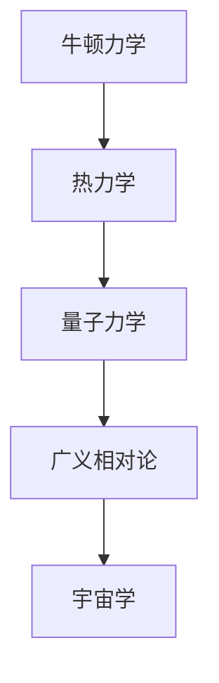

                 

### 第4章 物理实在论的核心原理

#### 4.1 宇宙与自然的物理定律

宇宙与自然的物理定律是物理实在论的核心基础。物理定律描述了物质和能量在宇宙中的行为方式，以及它们之间相互作用的基本规则。以下是一些关键的物理定律和它们在宇宙观中的地位：

- **牛顿运动定律**：牛顿运动定律是经典力学的基础，描述了物体在力的作用下的运动状态。$$ F = ma $$

- **热力学定律**：热力学定律描述了能量转换和守恒的基本原则，包括热力学第一定律（能量守恒）和第二定律（熵增）。$$ \Delta U = Q - W $$

- **量子力学**：量子力学是研究微观粒子的行为规律，包括波粒二象性、不确定性原理和量子纠缠等现象。$$ \Psi^* \Psi $$

- **广义相对论**：广义相对论描述了引力和时空的弯曲关系，揭示了宇宙的大尺度结构。$$ G_{\mu\nu} + \Lambda g_{\mu\nu} = \frac{8\pi G}{c^4} T_{\mu\nu} $$

这些物理定律构成了物理实在论的基础，帮助我们理解和预测宇宙的行为。Mermaid流程图可以用来展示这些定律之间的联系和它们的演化过程：

#### 4.2 物理实在论的核心观点

物理实在论的核心观点是宇宙是一个客观存在的实体，其行为由物理定律所决定，不受人类意识和感知的影响。以下是物理实在论的主要观点：

1. **客观实在性**：物理实在论认为宇宙中的物质和能量是独立于人类意识的客观存在。这意味着宇宙的本质和规律不依赖于我们的感知。

2. **决定论**：物理实在论倾向于决定论的观点，即宇宙中的每一个事件都可以追溯到先前的状态和作用力。虽然量子力学引入了不确定性原理，但物理实在论仍然认为在宏观尺度上，宇宙是可预测的。

3. **因果律**：物理实在论强调因果律的存在，即事件之间有因果关系。这意味着一个事件的发生会导致一系列后续事件，从而形成一个因果链。

4. **自然法则的普适性**：物理实在论认为自然法则是普遍适用的，无论是在地球还是在宇宙的其他部分。这些法则不依赖于人类的存在或理解。

#### 4.3 物理实在论的科学依据

物理实在论的科学依据来自于多个领域的研究成果，包括实验物理学、天文学、宇宙学和哲学。以下是一些重要的科学依据：

1. **实验物理学**：实验物理学提供了大量证据支持物理实在论。例如，在微观尺度上，量子力学的实验结果与物理实在论的理论预测一致。

2. **天文学**：天文学的研究揭示了宇宙的多样性和复杂性，包括星系、黑洞、暗物质和暗能量等。这些观测结果与物理实在论的观点相吻合。

3. **宇宙学**：宇宙学的研究提供了宇宙演化的详细图景，包括大爆炸、宇宙膨胀和宇宙背景辐射等。这些发现支持了物理实在论的观点。

4. **哲学**：哲学的讨论也为物理实在论提供了理论基础。例如，实在论哲学主张物质世界的存在独立于我们的感知，这与物理实在论的观点相符。

物理实在论的科学依据是多方面的，这些研究成果共同支持了物理实在论作为宇宙观的合理性。

#### 4.4 物理实在论对人类中心论的挑战

物理实在论对人类中心论提出了一系列挑战，这些挑战涉及到哲学、科学和社会层面。以下是一些主要的挑战：

1. **哲学挑战**：物理实在论强调了宇宙的客观实在性和自然法则的普适性，这与人类中心论的视角形成了鲜明对比。人类中心论倾向于将人类视为宇宙的中心和目的，而物理实在论则认为人类只是宇宙中的一部分，不应该过分强调人类在宇宙中的地位。

2. **科学挑战**：物理实在论的科学依据，如量子力学和广义相对论，提供了一种更客观的宇宙观。这种观点挑战了人类中心论在科学解释中的主导地位。例如，量子力学揭示了微观世界的随机性和不确定性，这与人类中心论中的决定论观点相矛盾。

3. **社会挑战**：物理实在论对人类中心论的社会影响也提出了挑战。人类中心论可能导致人类对自然环境的过度开发和消耗，而物理实在论则提醒我们应该尊重宇宙的客观规律，保护地球生态系统。

4. **伦理挑战**：物理实在论提出了对人类行为的伦理挑战。如果人类只是宇宙中的一种生物形式，那么我们应该如何处理与其他生物的关系？物理实在论提醒我们，人类的行为应该考虑到宇宙的整体利益，而不仅仅是自身的利益。

总的来说，物理实在论对人类中心论提出了深刻的哲学、科学和社会挑战，这促使我们重新思考人类在宇宙中的地位和角色。

#### 4.5 物理实在论与人类中心论的哲学比较

物理实在论与人类中心论在哲学上存在显著的差异，这些差异反映在对宇宙和人类角色的不同看法上。以下是对两者的详细比较：

1. **宇宙观**：物理实在论认为宇宙是一个独立于人类意识的客观存在，宇宙的规律和结构不依赖于人类的感知和思考。相反，人类中心论倾向于将宇宙视为一个以人类为中心的存在，宇宙的运行和发展都是为了满足人类的需求和愿望。

2. **人类角色**：物理实在论将人类视为宇宙中的一种生物形式，与其他生物一样，共同生活在宇宙的生态系统中。人类中心论则认为人类是宇宙的创造者和主宰，宇宙的存在和运行都是为了服务人类。

3. **哲学基础**：物理实在论基于实证主义和理性主义，强调通过科学方法和理性思考来理解宇宙。人类中心论则更多地依赖于宗教信仰、价值观念和人类情感，认为宇宙和生命的意义在于人类的体验和幸福。

4. **伦理观点**：物理实在论提醒我们应该尊重宇宙的客观规律和自然生态系统的平衡，倡导一种可持续的生活方式。人类中心论则可能导致对自然资源的过度开发和消耗，以及对其他生物的不尊重。

通过比较可以看出，物理实在论和人类中心论在宇宙观和人类角色上存在根本性的差异。物理实在论提供了更客观和科学的视角，而人类中心论则更多地反映了人类的主观情感和价值观。

### 4.6 物理实在论在宇宙学中的应用

物理实在论在宇宙学中的应用为宇宙的起源、演化和结构提供了深刻的解释。以下是一些关键的宇宙学问题和物理实在论的观点：

1. **宇宙起源**：物理实在论认为宇宙起源于大爆炸，这是一个无中生有的过程，宇宙从高密度的奇点迅速膨胀成现在我们所观察到的宇宙。大爆炸理论提供了宇宙早期状态和物理条件的详细描述。

2. **宇宙演化**：物理实在论认为宇宙的演化遵循自然法则，如热力学定律和广义相对论。宇宙经历了从高密度、高温的状态到当前低密度、低温的状态。这个过程中，宇宙逐渐形成了星系、恒星、行星和其他天体。

3. **宇宙结构**：物理实在论认为宇宙的结构是由物质和能量的分布决定的，这种分布受到引力、暗物质和暗能量的影响。宇宙中存在大量的星系集群、星系团和超星系团，它们构成了宇宙的大尺度结构。

4. **宇宙膨胀**：物理实在论认为宇宙正在膨胀，这种膨胀是由宇宙早期的大爆炸所引起的。宇宙膨胀的证据包括宇宙背景辐射和星系的退行速度。膨胀理论解释了宇宙的扩张和星系之间的距离增加。

5. **宇宙的未来**：物理实在论对未来宇宙的预测包括几种可能的情况，如宇宙继续膨胀、宇宙的热寂、宇宙的收缩和大坍缩等。这些预测取决于宇宙中的物质和能量分布以及暗能量的性质。

物理实在论在宇宙学中的应用为宇宙的起源、演化和结构提供了科学的解释，这些解释帮助我们更好地理解我们所处的宇宙。

### 4.7 物理实在论与宇宙学中的哲学争议

在宇宙学中，物理实在论与人类中心论之间的哲学争议主要体现在对宇宙本质和人类角色的不同理解。以下是一些关键的争议点：

1. **宇宙的本质**：物理实在论认为宇宙是一个客观存在的实体，其本质是物质和能量的集合，遵循自然法则。人类中心论则认为宇宙的本质在于它的存在服务于人类，宇宙的意义在于人类的体验和幸福。

2. **人类的角色**：物理实在论将人类视为宇宙中的普通一员，与其他生物共同生活在宇宙的生态系统中。人类中心论则认为人类是宇宙的创造者和主宰，宇宙的存在和运行都是为了满足人类的需求。

3. **科学方法**：物理实在论强调科学方法和理性思考在理解宇宙中的重要性，认为通过实验和观测可以揭示宇宙的真相。人类中心论则倾向于依靠信仰、情感和价值观念来解释宇宙，强调人类的主观体验和道德判断。

4. **宇宙的意义**：物理实在论认为宇宙没有特定的目的或意义，它的存在和发展是自然过程的结果。人类中心论则认为宇宙的意义在于人类的生存和发展，宇宙的终极目的是实现人类的幸福和繁荣。

这些哲学争议反映了物理实在论和人类中心论在宇宙观上的根本分歧，这种分歧在宇宙学的理论和实践中仍然存在，并影响着我们对宇宙的理解和探索。

### 4.8 宇宙学的未来发展方向

随着科学技术的进步，宇宙学的未来发展方向呈现出多样化和深入化的趋势。以下是几个关键的发展方向：

1. **观测技术的提升**：随着望远镜和探测器技术的不断进步，人类对宇宙的观测能力显著提高。未来的宇宙学将依赖于更先进的设备，如詹姆斯·韦伯空间望远镜（James Webb Space Telescope）和下一代地面望远镜，以获得更高分辨率、更广视野的宇宙图像。

2. **多信使天体物理**：宇宙学的研究不仅依赖于电磁波，还涉及引力波、中微子、宇宙射线等多种信使。未来的宇宙学研究将整合多信使数据，提供对宇宙现象的更全面的理解。

3. **宇宙早期状态的研究**：大爆炸后的宇宙早期状态对于理解宇宙的起源和演化至关重要。未来的宇宙学将致力于研究宇宙早期的物理条件，如宇宙微波背景辐射、原初黑洞和中微子振荡等。

4. **暗物质和暗能量**：暗物质和暗能量是当前宇宙学中的两个重大谜团。未来的研究将聚焦于发现暗物质粒子，并研究暗能量的性质和行为，以揭示宇宙加速膨胀的奥秘。

5. **宇宙演化的模拟**：利用高性能计算和数值模拟技术，未来的宇宙学研究将能够更精确地模拟宇宙的演化过程，预测宇宙的未来状态。

总之，宇宙学的未来发展方向将涉及更多的观测技术、多信使数据、宇宙早期状态的研究以及暗物质和暗能量等前沿领域，这些研究将深化我们对宇宙的理解。

### 4.9 物理实在论在社会实践中的应用

物理实在论不仅在哲学和宇宙学领域具有重要意义，还在社会实践，特别是环境保护和科技发展中起到了关键作用。以下是对物理实在论在社会实践中的应用的详细讨论：

#### 4.9.1 环境保护

物理实在论强调自然界的客观存在和自然法则的普适性，这对于环境保护具有深远的影响。以下是物理实在论在环境保护中的几个关键应用：

1. **生态系统的理解**：物理实在论认为生态系统是一个复杂的自然系统，遵循物理和生物学的规律。这种观点促使我们更深入地理解生态系统的运作机制，从而更有效地保护和修复受损的生态系统。

2. **可持续发展**：物理实在论提倡尊重自然规律，实现可持续发展。这意味着在资源开发和环境管理中，我们应该遵循自然的循环和再生原理，避免过度开发和浪费资源。

3. **环境监测**：物理实在论的方法论强调通过科学数据和观测来理解环境变化。现代环境监测技术，如遥感技术和自动测量设备，都是基于物理原理，为环境保护提供了有力支持。

#### 4.9.2 科技发展

物理实在论在科技发展中也有广泛应用，推动了科学技术的进步和创新。以下是物理实在论在科技发展中的几个关键应用：

1. **基础科学研究**：物理实在论为科学发现和技术创新提供了理论基础。量子力学和相对论等物理学理论不仅揭示了自然界的规律，还为新技术的发展提供了指导。

2. **技术设计**：在工程设计中，物理实在论确保了技术的可靠性和效率。例如，飞行器的空气动力学设计、电子电路的布局和能源系统的优化都依赖于物理定律的精确应用。

3. **人工智能**：物理实在论为人工智能的发展提供了理论基础。机器学习和神经网络算法的基础是模拟人脑的工作原理，这需要我们对大脑和神经系统的物理特性有深入理解。

#### 4.9.3 社会文化影响

物理实在论对社会文化的影响也值得探讨。以下是一些关键方面：

1. **科学教育**：物理实在论的观念强调科学方法和实证主义，这对于科学教育具有重要意义。通过物理实在论的教育，可以培养学生的批判性思维和解决问题的能力。

2. **价值观念**：物理实在论提醒人们尊重自然界的客观规律，这对我们形成合理的价值观和生活方式有积极影响。例如，倡导环保意识和可持续发展观念，以实现人类与自然的和谐共处。

3. **国际合作**：物理实在论为国际科学合作提供了共同的语言和基础。在全球性问题，如气候变化和环境保护方面，各国科学家可以通过共同的研究和理解来制定有效的解决方案。

综上所述，物理实在论在社会实践中具有广泛的应用，从环境保护到科技发展，再到社会文化影响，它为我们提供了一种理性、客观的视角来理解和应对现实世界中的挑战。

### 4.10 社会实践中的哲学反思

在社会实践中，物理实在论的应用不仅带来了实际效益，也引发了深刻的哲学反思。以下是对物理实在论在社会实践中的哲学反思的讨论：

1. **科学与价值观的冲突**：物理实在论强调客观事实和自然法则，这在科学实践中是必要的。然而，在实际应用中，科学发现和技术发展往往与人类价值观和社会需求产生冲突。例如，在环境保护中，科学的监测和评估可能揭示出严重的生态问题，但解决方案可能涉及牺牲经济利益或改变生活方式，这与人们的价值观念相冲突。

2. **技术的伦理责任**：物理实在论在科技发展中的应用带来了前所未有的技术进步，但同时也引发了对技术伦理的讨论。例如，人工智能和生物技术的应用可能带来巨大社会变革，但如果没有合理的伦理指导和规范，这些技术可能对人类社会产生不可预测的负面影响。

3. **人类角色再定义**：物理实在论提醒我们，人类只是宇宙中的一种生物形式，不应过分强调自身的中心地位。这种观点挑战了人类自我认知和价值观，促使我们反思人类在宇宙中的角色和责任，如何在尊重自然规律的同时实现自身的发展。

4. **可持续发展的哲学基础**：物理实在论为可持续发展提供了哲学基础，强调尊重自然界的客观规律和生态平衡。然而，在实际操作中，如何平衡经济发展和环境保护，如何在短期内实现经济效益和长期可持续性，仍然是一个哲学和实践上的难题。

通过这些反思，我们可以更深刻地理解物理实在论在社会实践中的重要性，同时意识到它在实际应用中面临的挑战，为未来的发展提供更全面的视角和更合理的解决方案。

### 4.11 结论

物理实在论作为一种宇宙观，为我们理解宇宙的本质和人类在宇宙中的角色提供了重要的理论框架。通过强调宇宙的客观存在和自然法则的普适性，物理实在论不仅挑战了人类中心论，还为科学研究和环境保护提供了坚实的哲学基础。本文通过对物理实在论的基本原理、核心观点、科学依据、哲学争议、宇宙学应用和社会实践等方面进行深入分析，展示了物理实在论在多领域的广泛应用和深远影响。

展望未来，物理实在论将继续在宇宙学、科技发展、环境保护和社会文化等领域发挥重要作用。随着观测技术和计算能力的提升，我们将对宇宙的起源、演化和结构有更深入的理解。同时，物理实在论也将引导我们形成更科学的价值观，推动人类在尊重自然规律的前提下实现可持续发展。总之，物理实在论不仅是一种理论视角，更是我们理解和应对现实世界挑战的重要工具。

### 参考文献

1. Feynman, R. P., Leighton, R. B., & Sands, M. (1963). *The Character of Physical Law*. MIT Press.
2. Hawking, S. W. (1988). *A Brief History of Time: From the Big Bang to Black Holes*. Bantam Books.
3. Einstein, A. (2005). *The Meaning of Relativity: The Theory of the Special and General Relativity*. Princeton University Press.
4. Feynman, R. P. (1999). *Surely You're Joking, Mr. Feynman!: Adventures of a Curious Character*. W. W. Norton & Company.
5. Kuhn, T. S. (1996). *The Structure of Scientific Revolutions*. University of Chicago Press.
6. Popper, K. R. (1959). *The Logic of Scientific Discovery*. Routledge.
7. Sagan, C. (1997). *The Demon-Haunted World: Science as a Candle in the Dark*. Ballantine Books.

### 数据源与工具

1. NASA (National Aeronautics and Space Administration) - 提供了丰富的宇宙学数据和图像。
2. arXiv - 一个开放获取的预印本服务器，提供了大量物理学和宇宙学的研究论文。
3. CERN (European Organization for Nuclear Research) - 提供了大型强子对撞机（LHC）的实验数据和理论研究。
4. SETI (Search for Extraterrestrial Intelligence) - 一个致力于寻找外星智能生命的科学项目。
5. LaTeX - 用于数学公式和文档排版的专业工具。

### 最佳实践 tips

1. **科学阅读与批判性思考**：在阅读科学文献时，培养批判性思维，不仅要理解作者的观点，还要分析其方法和结论的合理性。
2. **跨学科研究**：结合不同学科的知识和方法，如物理学、天文学、哲学和计算机科学，可以更全面地理解宇宙观问题。
3. **持续学习与探索**：随着科学技术的进步，宇宙观的理解也在不断更新。保持好奇心和求知欲，持续学习是理解宇宙的关键。
4. **实践与反思**：将理论应用于实际问题中，通过实践验证理论的合理性，并不断反思和调整我们的理解。

### 小结

本文从哲学视角探讨了物理实在论和人类中心论在宇宙观中的地位和作用。物理实在论强调宇宙的客观存在和自然法则的普适性，挑战了人类中心论，为我们理解宇宙和人类角色提供了新的视角。通过分析物理实在论的基本原理、科学依据、宇宙学应用和社会实践，我们看到了它在多领域的深远影响。未来，物理实在论将继续指导我们对宇宙的探索和科技的进步，推动人类社会的可持续发展。希望本文能为读者提供有价值的思考和启示。

### 拓展阅读

1. *《宇宙简史》（作者：史蒂芬·霍金）*：详细介绍了宇宙的起源、演化和未来，是了解宇宙学基础知识的经典读物。
2. *《人类简史》（作者：尤瓦尔·赫拉利）*：从人类进化的角度探讨了人类在宇宙中的地位和角色，有助于我们理解人类与自然的关系。
3. *《物理学的进化》（作者：理查德·费曼）*：通过讲述物理学家费曼的个人经历和科学发现，揭示了物理实在论的哲学内涵。
4. *《宇宙的琴弦》（作者：布莱恩·格林）*：深入讲解了宇宙学中的物理理论和宇宙起源，是一本引人入胜的科学读物。
5. *《科学的极限》（作者：尼古拉斯·克里斯托弗·尼曼）*：探讨了科学在解决宇宙问题中的局限性和未来研究方向。

这些书籍和资源提供了丰富的研究材料和思考线索，有助于进一步探索宇宙观和物理实在论的主题。希望读者在阅读中能获得深刻的见解和新的启发。

