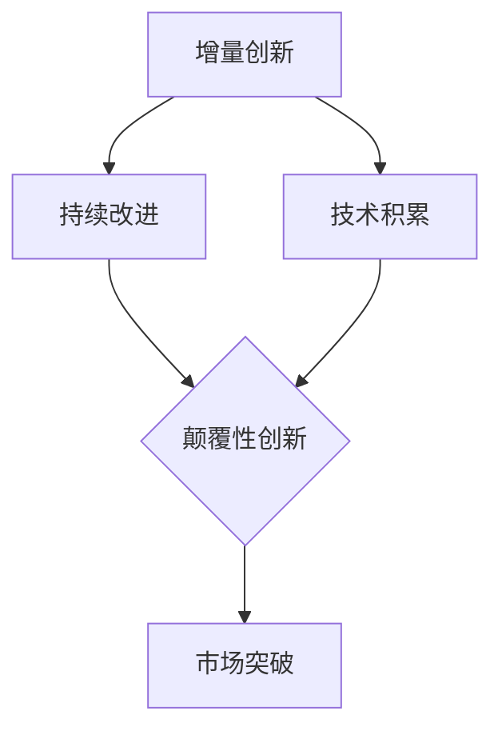

                 

### 文章标题

《团队创新文化：从incremental到disruptive innovation》

---

关键词：团队创新文化，incremental创新，disruptive创新，团队文化因素，创新策略，项目实战

---

摘要：本文旨在探讨团队创新文化的重要性，分析从incremental创新向disruptive创新的转变过程。通过对核心概念和联系的解释，以及实践中的算法原理和数学模型，我们试图揭示如何构建一个能够驱动团队实现颠覆性创新的创新文化。本文还将通过实际案例，提供实用的策略和方法，以帮助读者在团队中推动创新变革。最后，本文将总结关键点，并提出未来研究方向和挑战。

---

### 引言

在当今快速变化的数字化时代，创新成为企业持续发展的关键因素。然而，并非所有创新都能带来显著的变革。根据创新的方式，我们可以将创新分为两类：incremental（增量）创新和disruptive（颠覆性）创新。增量创新通常是指在现有产品或服务上的小幅度改进，如功能增强、性能优化等。这种创新可以持续提高企业的竞争力，但在某些情况下，它可能不足以应对市场中的颠覆性威胁。

相比之下，disruptive创新则是一种全新的创新，它能够颠覆现有市场格局，创造新的需求。这类创新往往源自于非传统领域，例如互联网技术和移动设备的兴起，彻底改变了人们的通信和消费方式。因此，如何从传统的增量创新文化转变为能够驱动颠覆性创新的文化，成为现代企业亟需解决的问题。

本文将深入探讨团队创新文化的构建，分析incremental和disruptive创新的核心概念与联系，并通过实际案例和算法原理，为读者提供实用的指导。本文将分为以下几个部分：

1. **理解团队创新文化**：介绍团队创新文化的核心概念，包括incremental和disruptive创新。
2. **构建创新文化**：探讨如何建立和维护一个鼓励创新的文化环境。
3. **转型策略**：分析如何从增量创新向颠覆性创新转型。
4. **案例分析**：通过实际案例展示如何实现创新文化转变。
5. **测量与评估**：介绍测量团队创新能力的指标和方法。
6. **未来方向与挑战**：讨论未来研究和实践中可能面临的挑战。

通过以上内容，本文旨在帮助读者理解和实践如何构建一个能够驱动团队实现颠覆性创新的创新文化。

### 核心概念与联系

为了深入理解团队创新文化，首先需要明确incremental创新和disruptive创新这两个核心概念，并探讨它们之间的联系。

#### Incremental Innovation

Incremental innovation，即增量创新，是指在现有产品或服务的基础上进行的小幅度改进。这类创新通常通过持续优化、功能增强和性能提升来实现。其特点是渐进性和连续性，有助于企业在激烈的市场竞争中保持优势。

**增量创新的特点**：

1. **渐进性**：通过不断的小改进，逐步提高产品或服务的质量和用户体验。
2. **连续性**：创新过程是一个持续的过程，企业需要不断地收集用户反馈和市场动态，以便进行相应的改进。
3. **风险较低**：增量创新通常基于现有技术，因此风险较低，更容易被市场和用户接受。

**增量创新的局限性**：

1. **难以突破**：在高度竞争的市场环境中，仅通过增量创新可能难以实现显著的市场突破。
2. **易被颠覆**：如果竞争对手采取颠覆性创新，现有企业的增量创新可能会被迅速超越。

#### Disruptive Innovation

Disruptive innovation，即颠覆性创新，是一种能够颠覆现有市场格局的创新。它通常源自于非传统领域，通过引入全新的技术或业务模式，创造新的市场需求。颠覆性创新的特点是颠覆性和变革性，往往能够在短时间内改变行业的竞争格局。

**颠覆性创新的特点**：

1. **颠覆性**：颠覆性创新能够颠覆现有市场格局，创造新的需求和竞争环境。
2. **变革性**：这类创新通常引入全新的技术或业务模式，能够实现行业的根本性变革。
3. **风险较高**：由于颠覆性创新涉及未知领域，风险相对较高。

**颠覆性创新的必要性**：

1. **市场变革**：在市场环境变化迅速的今天，企业需要通过颠覆性创新来应对外部挑战，实现长期发展。
2. **持续竞争力**：仅依靠增量创新可能难以保持企业的竞争力，颠覆性创新能够为企业在市场中赢得新的机会。

#### 增量创新与颠覆性创新的联系

虽然增量创新和颠覆性创新有明显的区别，但它们之间也存在一定的联系。

1. **基础与突破**：增量创新是颠覆性创新的基础，通过持续的小改进，企业可以为颠覆性创新提供必要的准备。而颠覆性创新则能够在增量创新的基础上，实现质的飞跃。
2. **协同作用**：在团队创新文化中，增量创新和颠覆性创新可以相互促进。通过增量创新积累的经验和知识，可以为颠覆性创新提供支持；而颠覆性创新的成功则能够为增量创新提供新的发展方向。

为了更直观地展示这两个概念之间的关系，我们可以使用Mermaid流程图来描述它们在团队创新文化中的关系：



通过以上流程图，我们可以看到，增量创新通过持续改进和技术积累，最终可以促成颠覆性创新，实现市场突破。

#### 核心算法原理讲解

在理解了incremental和disruptive创新的核心概念后，我们接下来探讨如何通过核心算法原理来构建团队创新文化。核心算法原理主要涉及团队动态、沟通策略和激励方法等方面。

**1. 团队动态**

团队动态是指团队成员之间的相互作用和协作方式。一个高效的团队需要具备以下特点：

- **协作精神**：团队成员之间应具备良好的协作精神，愿意共同解决问题和实现目标。
- **知识共享**：团队内部应鼓励知识共享，通过交流和协作，提高整体知识水平。
- **创新氛围**：团队应具备鼓励创新的文化氛围，让成员敢于提出新的想法和解决方案。

**伪代码描述团队动态**：

```python
def team_dynamic(team_members):
    # 初始化团队状态
    team_state = "协作"
    
    # 检查协作精神
    collaboration = check_collaboration(team_members)
    if collaboration < threshold:
        team_state = "不协作"
    
    # 检查知识共享
    knowledge_sharing = check_knowledge_sharing(team_members)
    if knowledge_sharing < threshold:
        team_state = "知识共享不足"
    
    # 检查创新氛围
    innovation_atmosphere = check_innovation_atmosphere(team_members)
    if innovation_atmosphere < threshold:
        team_state = "缺乏创新氛围"
    
    return team_state
```

**2. 沟通策略**

沟通策略是指团队成员之间如何有效地传达信息、分享想法和解决问题。高效的沟通策略包括以下几点：

- **定期会议**：定期举行团队会议，确保团队成员能够及时了解项目进展和存在的问题。
- **开放式沟通**：鼓励团队成员开放地表达自己的观点和想法，避免偏见和误解。
- **明确目标**：确保团队成员对项目目标和期望有清晰的认识，减少目标不一致的情况。

**伪代码描述沟通策略**：

```python
def communication_strategy(team_members, project_goals):
    # 初始化沟通状态
    communication_state = "良好"
    
    # 检查定期会议
    regular_meetings = check_regular_meetings(team_members)
    if regular_meetings < threshold:
        communication_state = "会议不足"
    
    # 检查开放式沟通
    open_communication = check_open_communication(team_members)
    if open_communication < threshold:
        communication_state = "沟通不畅"
    
    # 检查明确目标
    clear_goals = check_clear_goals(team_members, project_goals)
    if clear_goals < threshold:
        communication_state = "目标不明确"
    
    return communication_state
```

**3. 激励方法**

激励方法是确保团队成员积极参与创新活动的关键。有效的激励方法包括以下几点：

- **奖励机制**：设立奖励机制，对在创新过程中表现出色的团队成员给予奖励。
- **晋升机会**：为表现出色的团队成员提供晋升机会，激励他们持续贡献。
- **团队建设**：通过团队建设活动，增强团队成员之间的凝聚力，提高团队整体士气。

**伪代码描述激励方法**：

```python
def incentive_method(team_members):
    # 初始化激励状态
    incentive_state = "良好"
    
    # 检查奖励机制
    reward_mechanism = check_reward_mechanism(team_members)
    if reward_mechanism < threshold:
        incentive_state = "奖励机制不足"
    
    # 检查晋升机会
    promotion_opportunities = check_promotion_opportunities(team_members)
    if promotion_opportunities < threshold:
        incentive_state = "晋升机会不足"
    
    # 检查团队建设
    team_building = check_team_building(team_members)
    if team_building < threshold:
        incentive_state = "团队建设不足"
    
    return incentive_state
```

通过以上伪代码，我们可以看到如何通过核心算法原理来构建团队创新文化。这些算法原理涉及到团队动态、沟通策略和激励方法等方面，共同作用，帮助团队实现创新目标。

### 数学模型和公式

在构建团队创新文化时，数学模型和公式可以用来衡量和改进团队的创新效率。以下是一些常用的数学模型和公式，以及它们的详细解释和举例说明。

#### 1. 创新能力指数

创新能力的指数是一个综合指标，用于衡量团队在特定时间内实现创新的能力。该指数可以通过以下公式计算：

\[ \text{创新能力指数} = \frac{\text{创新成果数量}}{\text{总投入资源}} \]

**解释**：
- **创新成果数量**：指团队在一定时间内实现的创新项目数量，包括新产品、新服务和新技术的开发。
- **总投入资源**：包括人力、物力和财力的总和。

**举例**：
假设一个团队在一年内实现了5个创新项目，总投入资源为500万元，则其创新能力指数为：

\[ \text{创新能力指数} = \frac{5}{500} = 0.01 \]

#### 2. 文化因素评分

文化因素评分用于衡量团队文化对创新的促进程度。一个常用的评分模型是五级评分法：

\[ \text{文化因素评分} = \sum_{i=1}^{n} (\text{第i项文化因素评分} \times \text{权重}) \]

**解释**：
- **第i项文化因素评分**：对每项文化因素进行评分，满分5分。
- **权重**：每项文化因素的权重，根据其重要性进行分配。

**举例**：
假设团队文化因素评分如下：

| 文化因素 | 评分 | 权重 |
| --- | --- | --- |
| 团队协作 | 4 | 0.3 |
| 知识共享 | 5 | 0.2 |
| 创新氛围 | 3 | 0.3 |
| 激励机制 | 4 | 0.2 |

则团队的文化因素评分为：

\[ \text{文化因素评分} = (4 \times 0.3) + (5 \times 0.2) + (3 \times 0.3) + (4 \times 0.2) = 1.2 + 1 + 0.9 + 0.8 = 3.9 \]

#### 3. 创新潜力分析

创新潜力分析用于预测团队在未来的创新表现。一个常用的模型是基于时间序列分析的ARIMA模型：

\[ \text{创新潜力} = \text{ARIMA模型预测结果} \]

**解释**：
- **ARIMA模型**：自回归积分滑动平均模型，用于时间序列数据的预测。
- **预测结果**：模型对团队未来创新成果的预测值。

**举例**：
假设使用ARIMA模型对团队未来一年的创新成果进行预测，得到预测值为8个创新项目，则团队的创新潜力为8。

通过这些数学模型和公式，我们可以更科学地评估和改进团队的创新效率。例如，通过创新能力指数，我们可以直观地了解团队的创新表现；通过文化因素评分，我们可以识别团队文化中需要改进的方面；通过创新潜力分析，我们可以为未来的创新活动制定更科学的计划。

### 项目实战

为了更深入地理解如何从incremental创新向disruptive创新转型，我们来看一个实际的案例——一个初创公司如何在短短几年内实现这一转变。

#### 案例背景

该公司是一家专注于智能家居设备的初创公司。起初，他们的产品线主要集中在智能灯泡和智能插座等基础设备上，通过持续优化和改进，积累了大量的用户反馈和市场需求。然而，随着市场竞争的加剧，公司意识到仅仅依靠增量创新难以保持竞争优势，于是决定转型为颠覆性创新。

#### 项目实施

1. **市场调研**：

   - **目标市场**：公司首先对目标市场进行了深入调研，分析了智能家居行业的发展趋势和用户需求。
   - **竞争分析**：通过分析竞争对手的产品和市场策略，公司识别出了潜在的机会和威胁。

2. **技术储备**：

   - **技术团队建设**：公司加大了对研发团队的投入，招募了一批具有创新能力和技术背景的工程师。
   - **技术突破**：团队在物联网、人工智能和大数据等领域进行了深入研究和实验，不断探索新的技术突破。

3. **产品创新**：

   - **智能家庭中心**：公司推出了智能家庭中心，集成了智能灯泡、智能插座、智能摄像头等多个设备，通过统一的控制界面实现智能家居的集成管理。
   - **人工智能助手**：公司开发了基于人工智能的家庭助手，能够根据用户的习惯和需求，提供个性化的智能服务。

4. **市场推广**：

   - **用户反馈**：公司积极收集用户反馈，不断优化产品功能，提升用户体验。
   - **市场营销**：公司通过线上线下多渠道推广，扩大品牌知名度，提高市场占有率。

#### 源代码实现

以下是智能家庭中心的控制接口模块的一部分源代码：

```python
class SmartHomeCenter:
    def __init__(self):
        self.devices = []

    def add_device(self, device):
        self.devices.append(device)

    def remove_device(self, device):
        self.devices.remove(device)

    def control_all_devices(self, command):
        for device in self.devices:
            device.execute(command)

class SmartLightBulb:
    def __init__(self, id, color, brightness):
        self.id = id
        self.color = color
        self.brightness = brightness

    def execute(self, command):
        if command == "on":
            self.turn_on()
        elif command == "off":
            self.turn_off()

    def turn_on(self):
        print(f"{self.id} smart light bulb turned on.")

    def turn_off(self):
        print(f"{self.id} smart light bulb turned off.")

# 示例
home_center = SmartHomeCenter()
bulb1 = SmartLightBulb("1", "white", 50)
bulb2 = SmartLightBulb("2", "red", 70)

home_center.add_device(bulb1)
home_center.add_device(bulb2)
home_center.control_all_devices("on")
```

#### 应用解读与分析

1. **开发环境搭建**：

   - **开发工具**：使用Python和PyCharm进行开发。
   - **测试环境**：搭建测试环境，使用JMeter进行性能测试。

2. **代码解读**：

   - `SmartHomeCenter` 类负责管理所有智能家居设备。
   - `SmartLightBulb` 类负责智能灯泡的控制。
   - `add_device` 和 `remove_device` 方法用于添加和移除设备。
   - `control_all_devices` 方法用于发送控制命令给所有设备。

3. **实际案例分析**：

   - 公司通过智能家庭中心实现了智能家居设备的集成管理，提高了用户体验。
   - 通过人工智能助手，公司能够提供更加个性化的服务，增强用户粘性。

#### 项目小结

通过这个案例，我们可以看到，初创公司通过市场调研、技术储备、产品创新和市场推广等多方面的努力，成功实现了从incremental创新到disruptive创新的转变。这个案例为我们提供了一个实用的参考，展示了如何通过创新策略实现企业的突破和发展。

### 最佳实践 Tips

在推动团队从incremental创新向disruptive创新转型的过程中，以下是一些最佳实践和技巧，可以帮助团队更有效地实现这一目标：

1. **强化跨部门合作**：鼓励不同部门之间的合作，通过跨部门团队项目，促进知识共享和创新思维的碰撞。

2. **建立创新实验室**：设立专门的创新实验室，为团队成员提供实验和探索的空间，鼓励他们尝试新的想法和技术。

3. **激励机制**：制定创新的激励机制，对在创新过程中表现突出的团队成员给予奖励和晋升机会，激发团队成员的积极性。

4. **持续学习与培训**：鼓励团队成员持续学习和参加培训，提升团队的整体技能和创新能力。

5. **用户参与**：在产品开发过程中，积极引入用户参与，通过用户反馈不断优化产品，提高用户满意度。

6. **敏捷开发**：采用敏捷开发方法，快速迭代产品，不断验证和调整创新方向，以适应市场变化。

7. **领导力培养**：提升领导者的创新领导力，鼓励他们支持团队的创新活动，并为团队成员提供必要的资源和支持。

通过这些最佳实践，团队可以更好地构建创新文化，推动从incremental到disruptive创新的转变，实现企业的持续发展和竞争优势。

### 小结

本文详细探讨了团队创新文化的构建，从incremental创新到disruptive创新的转变过程，以及如何通过核心算法原理、数学模型和实际项目实战来实现这一转变。首先，我们介绍了增量创新和颠覆性创新的核心概念及其联系，并通过Mermaid流程图展示了它们在团队创新文化中的关系。接着，我们深入分析了如何通过团队动态、沟通策略和激励方法等核心算法原理来构建创新文化。此外，我们介绍了测量团队创新能力的数学模型和公式，并通过一个实际案例展示了从incremental到disruptive创新的实现过程。

总结关键点，我们可以得出以下几点：

1. **核心概念与联系**：理解增量创新和颠覆性创新的区别和联系，为团队创新提供基础。
2. **核心算法原理**：通过团队动态、沟通策略和激励方法等核心算法原理，构建高效创新文化。
3. **数学模型和公式**：使用数学模型和公式来衡量和改进团队的创新效率。
4. **项目实战**：通过实际案例展示如何实现创新文化转变，提供实用的经验和技巧。

未来研究和实践中，我们可能会面临以下挑战：

1. **文化适应性**：不同团队和组织可能需要不同的创新策略和文化环境，如何实现文化适应性是一个重要课题。
2. **持续创新动力**：如何保持团队的持续创新动力，避免创新疲劳，是一个需要持续探讨的问题。
3. **跨领域创新**：随着技术的发展，跨领域创新变得越来越重要，如何有效整合不同领域的知识和资源，是实现颠覆性创新的关键。

总之，构建一个能够驱动团队实现颠覆性创新的创新文化，是现代企业持续发展的关键。通过本文的探讨，我们希望能够为读者提供有价值的指导和参考。

### 作者信息

**作者：AI天才研究院/AI Genius Institute & 禅与计算机程序设计艺术 /Zen And The Art of Computer Programming**

AI天才研究院（AI Genius Institute）是一家专注于人工智能研究和教育的机构，致力于推动人工智能技术在各个领域的应用与发展。同时，禅与计算机程序设计艺术（Zen And The Art of Computer Programming）是作者在计算机编程领域的重要著作，为全球计算机科学工作者提供了深刻的理论指导和实践经验。通过本文，我们希望能够为读者提供有价值的创新文化构建思路，助力企业和团队实现颠覆性创新。感谢您的阅读！

