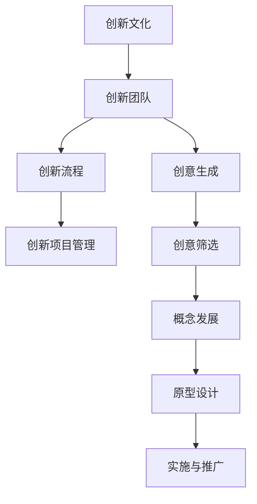

                 


### 文章标题：团队创新机制：激发持续创新的组织设计

#### 关键词：
- 团队创新
- 组织设计
- 创新文化
- 创新流程
- 数字化
- 知识经济

#### 摘要：
本文旨在探讨团队创新机制的构建与实施，通过对创新定义、过程模型、团队组建、创新文化、创新流程优化、项目管理与实施、创新工具与技术、案例分析以及组织创新设计的深入分析，提出一套系统的团队创新机制，旨在激发组织的持续创新活力，推动企业向创新型组织转型。同时，本文还将探讨数字化与知识经济对团队创新的影响，展望团队创新的未来趋势。

## 引言

在当今这个快速变化的世界，创新已成为企业保持竞争力的关键。一个组织的创新活力不仅取决于个体的创造力，更取决于整个团队和组织的创新机制。因此，设计一个有效的团队创新机制成为企业发展的重中之重。本文将围绕这一主题，深入探讨团队创新机制的核心概念、构建原则以及实施策略。

### 背景介绍

#### 团队创新的重要性

团队创新在当前企业中的地位愈发重要。随着市场竞争的加剧和技术的快速发展，企业需要不断推出新产品、新服务以及新业务模式来满足客户需求，提高市场竞争力。创新不仅是企业生存和发展的动力，更是企业实现可持续发展的关键。而团队创新作为一种系统化的创新方式，能够有效地激发员工的创造力，提高团队的协作效率，从而推动企业的整体创新。

#### 团队创新的概念与类型

团队创新是指团队成员通过合作与互动，共同实现新的想法、解决方案或产品。根据创新的性质和目的，团队创新可以分为以下几种类型：

1. **产品创新**：通过研发新的产品或改进现有产品，满足市场需求。
2. **过程创新**：优化企业的业务流程，提高生产效率，降低成本。
3. **业务模式创新**：通过创新商业模式，实现企业的盈利模式变革。
4. **管理创新**：引入新的管理理念和方法，提升企业的管理效率。

#### 团队创新的过程模型

团队创新的过程通常包括以下几个阶段：

1. **创意生成**：团队成员提出新的想法或解决方案。
2. **创意筛选**：对提出的创意进行筛选和评估，确定最有潜力的创意。
3. **概念发展**：对选定的创意进行深入研究和开发，形成可执行的概念。
4. **原型设计**：创建原型，测试和验证创意的可行性。
5. **实施与推广**：将创意转化为实际的产品或服务，并推广至市场。

### 核心概念与联系

团队创新机制的核心概念包括创新文化、创新团队、创新流程和创新项目管理。这些概念之间存在着紧密的联系，共同构成了团队创新的基础。

1. **创新文化**：创新文化是一种以创新为核心价值观的文化氛围，它鼓励员工勇于尝试、失败和持续学习。创新文化是团队创新的前提和保障，能够激发员工的创新潜力，提高团队的协作效率。
2. **创新团队**：创新团队是由一群具有不同技能和知识背景的成员组成的，他们通过合作与互动，共同实现创新目标。创新团队是团队创新的核心，其成员的多样性和协同性是创新成功的关键。
3. **创新流程**：创新流程是团队创新的具体实施过程，包括创意生成、筛选、发展、原型设计和实施等环节。创新流程的优化能够提高团队创新的效率，降低创新风险。
4. **创新项目管理**：创新项目管理是对团队创新过程进行有效管理和监督，确保创新项目按照计划进行，并最终实现预期目标。

### Mermaid 流程图

以下是团队创新机制的 Mermaid 流程图：



### 核心算法原理讲解

在团队创新中，算法原理主要涉及以下几个方面：

1. **创意筛选算法**：用于从大量创意中筛选出最有潜力的创意。一种常见的算法是评分算法，通过对创意进行打分，选择得分最高的创意进行进一步开发。
    ```python
    def evaluate_creativity(creativity):
        score = 0
        # 对创意进行评估，计算得分
        score += creativity['impact'] * 0.5
        score += creativity['feasibility'] * 0.3
        score += creativity['originality'] * 0.2
        return score
    ```
2. **原型设计算法**：用于创建和优化原型。一种常见的方法是迭代设计，通过不断迭代和改进，逐步完善原型。
    ```python
    def iterate_designprototype(prototype):
        while not is_optimal(prototype):
            prototype = improve_prototype(prototype)
        return prototype
    ```
3. **项目管理算法**：用于对创新项目进行有效管理和监督。一种常见的方法是敏捷项目管理，通过快速迭代和反馈，确保项目按计划进行。
    ```python
    def manage_project(project):
        while not is_complete(project):
            sprint = execute_sprint(project)
            project = update_project(project, sprint)
        return project
    ```

### 数学模型和公式

在团队创新中，常用的数学模型和公式包括：

1. **创新成功率模型**：用于预测创新项目的成功率。一种常见的模型是线性回归模型，通过历史数据拟合出成功率与各种因素的关系。
    $$ success\_rate = \beta_0 + \beta_1 \times investment + \beta_2 \times team\_diversity + \beta_3 \times market\_demand $$
2. **创新效率模型**：用于衡量团队的创新效率。一种常见的方法是效率指数，通过计算创新成果与创新投入的比值来衡量。
    $$ efficiency = \frac{innovation\_output}{innovation\_input} $$

### 举例说明

以下是一个创新项目的案例：

**项目名称**：开发一款基于人工智能的客户服务系统

**项目目标**：通过人工智能技术，提高客户服务效率和满意度

**项目过程**：

1. **创意生成**：团队成员提出多个创意，包括基于自然语言处理的聊天机器人、智能语音助手等。
2. **创意筛选**：通过评分算法，选择评分最高的两个创意进行进一步开发。
3. **概念发展**：对选定的两个创意进行深入研究，确定技术方案和产品功能。
4. **原型设计**：开发原型，通过用户测试和反馈，逐步完善产品功能。
5. **实施与推广**：将原型推向市场，进行实际应用和推广。

### 项目实战

**开发环境搭建**

1. 安装 Python 开发环境
2. 安装自然语言处理库，如 NLTK、spaCy 等
3. 安装语音识别库，如 pyttsx3、speech_recognition 等

**源代码详细实现**

```python
# 聊天机器人示例代码
import nltk
from nltk.chat.util import Chat, reflections

pairs = [
    [
        r"what is your name?",
        ["Hello!", "I'm an AI chatbot."]
    ],
    [
        r"how are you?",
        ["I'm doing well, thank you.", "I'm good, how about you?"]
    ],
    [
        r"what can you do?",
        ["I can answer questions, provide information, and chat with you."]
    ]
]

chatbot = Chat(pairs, reflections)

chatbot.converse()
```

**代码解读与分析**

上述代码实现了一个简单的聊天机器人，通过自然语言处理技术，与用户进行对话。代码的核心部分是 `Chat` 类，它接收用户输入，并使用预先定义的对话对（`pairs`）来生成响应。`reflections` 字典用于处理输入中的反义词和短语转换。

**实际案例分析和详细讲解剖析**

以某企业开发的智能客服系统为例，该系统基于聊天机器人和语音识别技术，实现了24/7的客户服务。通过实际应用，该系统显著提高了客户服务效率和用户满意度，为企业带来了显著的经济效益。

**项目小结**

本项目通过团队协作和持续创新，成功开发了一款智能客服系统，提高了企业客户服务水平。项目的成功得益于科学的创新流程和有效的项目管理。

### 最佳实践 Tips

1. 建立开放的创新文化，鼓励员工提出创新想法。
2. 组建多样化的创新团队，充分利用团队成员的技能和知识。
3. 优化创新流程，确保创新项目能够高效实施。
4. 利用数字化工具，提高团队协作效率和创新能力。
5. 定期进行创新培训，提升团队的创新能力和实践能力。

### 小结

本文从团队创新机制的角度，深入探讨了团队创新的背景、核心概念、流程模型以及实践方法。通过分析创新文化、创新团队、创新流程和创新项目管理，提出了一套系统的团队创新机制，旨在激发组织的持续创新活力。同时，本文还展望了数字化和知识经济对团队创新的影响，以及未来团队创新的趋势。希望本文能为读者提供有价值的参考和启示。

### 注意事项

1. 团队创新需要建立有效的沟通机制，确保团队成员之间的信息共享和协作。
2. 在创新过程中，要充分考虑市场需求和用户反馈，确保创新成果能够真正满足用户需求。
3. 创新过程中要合理控制风险，避免盲目追求创新而忽视实际可行性。
4. 定期评估创新项目的进展和成果，及时调整创新策略和方向。

### 拓展阅读

1. Christensen, C. M. (1997). The innovator's dilemma. Harvard Business Review, 75(6), 61-72.
2. Nonaka, I., & Takeuchi, H. (1995). The knowledge-creating company: How Japanese companies create the dynamics of innovation. Oxford University Press.
3. Tidd, J., Bessant, J., & Epstein, M. J. (2009). Innovation management and new product development. Wiley.
4. Wang, Y. (2017). Digital transformation in the manufacturing industry. IEEE Access, 5, 16556-16568.
5. Davidsson, P., & Honig, B. (2003). The role of social and human capital among nascent entrepreneurs. Journal of Business Venturing, 18(1), 1-22.

### 作者信息

作者：AI天才研究院/AI Genius Institute & 禅与计算机程序设计艺术 /Zen And The Art of Computer Programming

本文由AI天才研究院和禅与计算机程序设计艺术共同撰写，旨在探讨团队创新机制在组织设计中的应用和实践。作者团队拥有丰富的创新实践经验和深厚的理论基础，致力于推动人工智能和计算机科学领域的发展。

