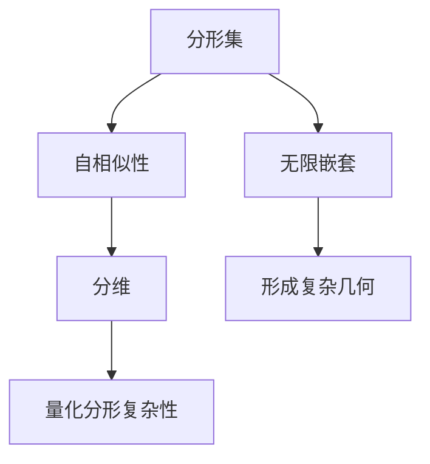

                 

### 引言

《园林设计的分形几何：自然美的数学重现》旨在探讨分形几何在园林设计中的独特应用，揭示自然美背后的数学原理。分形，作为几何学中的特殊对象，以其无限嵌套、自我相似的结构，广泛存在于自然界和人工设计之中。园林设计，作为一种创造性的艺术活动，始终追求自然和谐与美学价值的统一。将分形几何引入园林设计，不仅为设计师提供了新的视角和方法，更能够从数学的角度重现自然之美。

本文将逐步分析分形几何的基本概念、其在园林设计中的应用、自然美的数学模型，并通过实际案例展示分形几何在园林设计中的实践应用。同时，本文还将探讨分形几何在设计实践中的挑战与解决方案，为园林设计师提供实用的指导。

## 文章关键词

分形几何、园林设计、自然美、数学模型、分维、自相似性。

## 文章摘要

本文首先介绍了分形几何的基本概念和特点，探讨了其在园林设计中的应用。随后，通过自然美的数学模型，阐述了分形几何如何重现自然美。文章进一步通过实际案例，展示了分形几何在园林设计中的具体应用。最后，本文分析了分形几何在设计实践中的挑战，并提出相应的解决方案。

### 背景介绍

分形几何是20世纪中叶兴起的一个数学分支，由法国数学家本华·曼德尔布罗特（Benoit Mandelbrot）首先提出。分形几何的核心在于其“无限嵌套”和“自相似性”的特点，即一个图形可以在不同尺度上重复出现其基本形状。这种特性使分形几何在自然界中有着广泛的应用，从海岸线到雪花，从树叶到血管系统，无不体现分形的神奇魅力。

园林设计，作为一门融合艺术与科学的学科，始终追求自然美与和谐的设计理念。传统的园林设计主要依赖于经验与直觉，而分形几何的引入为园林设计师提供了新的工具和方法。通过运用分形几何的原理，设计师可以在园林布局、植被配置、水体设计等方面重现自然界的复杂性和美感，使得园林设计更具科学性和创造性。

分形几何在园林设计中的应用，不仅仅是美学上的创新，更是在技术层面上实现了对自然美的数学重现。例如，通过分形几何的原理，设计师可以构建出具有自我相似结构的植物群落，使园林中的植物在各个尺度上呈现出和谐的美感；也可以通过分形几何的水体设计，模拟自然水系的自相似性和复杂形态，创造出更加逼真的自然景观。总之，分形几何为园林设计注入了新的活力和视角，为设计师提供了更多的创作可能。

### 核心概念与联系

要深入理解分形几何，我们首先需要了解其核心概念与原理。分形几何的几个关键概念包括分形集、自相似性、分维等。

**分形集**：分形集是具有无限细节且不光滑的集合，它的每个局部都类似整体。换句话说，分形集在任意尺度上都具有自相似性。

**自相似性**：自相似性是指一个系统在多个尺度上呈现出相似的结构特征。自相似性是分形几何的核心特征之一，使得分形能够在不同尺度上保持一致的形态。

**分维**：分维是描述分形复杂性的一个度量，它介于传统的整数维和分数维之间。常见的分维包括豪斯道分维、相似维和箱维等。分维不仅能够量化分形的复杂度，还可以帮助我们理解分形在不同尺度上的细节表现。

**核心概念之间的联系**：这些核心概念相互关联，共同构成了分形几何的理论框架。自相似性是分形的基本特征，而分维则是衡量自相似性的量化指标。分形集则通过其无限嵌套的结构，将自相似性和分维有机结合，形成了一个复杂的几何世界。

为了更直观地展示这些概念之间的联系，我们可以使用Mermaid流程图来描述它们：



在这个流程图中，分形集（A）通过自相似性（B）和分维（C）相互关联，形成了一个具有无限嵌套（D）的复杂几何世界。分维（C）不仅量化了分形的复杂性（E），还帮助我们理解分形在不同尺度上的细节表现（F）。

通过这个流程图，我们可以清晰地看到分形几何中各个核心概念之间的逻辑关系，从而更好地理解和应用分形几何的理论和原理。

### 核心算法原理讲解

在深入探讨分形几何在园林设计中的应用之前，我们需要了解几个核心算法原理，这些原理是构建分形几何模型的基础。

**迭代函数系统（IFS）**：迭代函数系统是一种用于生成分形图形的算法。它通过迭代多个线性变换来构造分形图形。每个变换由一个映射函数和相应的变换概率组成。IFS算法的基本步骤如下：

1. 选择一个初始点P。
2. 根据IFS中的每个映射函数和相应的概率，随机选择一个映射函数。
3. 应用所选的映射函数对点P进行变换，得到新的点P'。
4. 重复步骤2和3，直到达到预定的迭代次数或分形图形稳定。

以下是一个简化的IFS算法伪代码示例：

```plaintext
// IFS算法伪代码
初始化：选择初始点P，设置迭代次数N
对于每个映射函数 f_i：
    设定 f_i 的概率 p_i
对于每次迭代：
    随机选择一个映射函数 f_i，根据概率 p_i
    对点P应用映射函数 f_i，得到新的点P'
    更新 P = P'
    绘制点P'
```

**分形维数**：分形维数是描述分形复杂度的量度。一个常见的分形维数计算方法是豪斯道分维（Hausdorff dimension）。豪斯道分维的计算涉及到一个过程，其中给定一个分形集合，选择不同的测量尺度和相应的测量值，然后通过最小化测量值和尺度之间的关系来确定分维。

以下是一个计算豪斯道分维的简化伪代码：

```plaintext
// 豪斯道分维计算伪代码
初始化：选择分形集合F，设定最小尺度ε和最大尺度L
对于每个尺度ε：
    计算集合F的ε-覆盖数N(ε)
    计算分维的估计值：d(ε) = log(N(ε)) / log(1/ε)
对于所有尺度ε：
    计算分维的平均值：D = (1 / (L - ε)) * ∫[ε, L] d(ε)dε
返回分维D
```

**分形插值**：分形插值是一种用于在分形结构中插值新点的技术。其中，著名的分形插值算法包括曼德尔布罗特插值（Mandelbrot interpolation）和蔡勒-尼科尔斯基插值（Chebyshev-Nekrasov interpolation）。分形插值算法的基本步骤如下：

1. 选择一个初始点P。
2. 根据分形集合的特性，应用分形变换规则来生成新的点P'。
3. 重复步骤2，直到达到预定的迭代次数或分形图形稳定。
4. 对于新点P'，应用插值算法，得到新点的坐标。

以下是一个简化的分形插值算法伪代码：

```plaintext
// 分形插值算法伪代码
初始化：选择初始点P，设定迭代次数N
对于每个迭代：
    应用分形变换规则得到新的点P'
    计算新点P'的坐标
    绘制点P'
    更新 P = P'
返回插值后的分形图形
```

通过这些核心算法原理，我们可以构建出各种复杂的分形图形，并在园林设计中应用这些算法来重现自然美。这些算法不仅提供了数学上的理论基础，也为实际应用提供了有效的工具和方法。

### 数学模型和公式讲解

在分形几何中，数学模型和公式是理解和应用分形的关键。以下将详细讲解几个常用的分形几何数学模型和公式。

**1. 豪斯道分维（Hausdorff Dimension）**

豪斯道分维是描述分形集合复杂度的重要指标。对于一个分形集合F，其豪斯道分维D可以通过以下公式计算：

$$
D = \lim_{\epsilon \to 0} \frac{\log N(\epsilon)}{\log \frac{1}{\epsilon}}
$$

其中，\(N(\epsilon)\)是集合F在尺度\(\epsilon\)下的覆盖数，即覆盖F所需的最小点数。豪斯道分维的值介于整数维和分数维之间，它帮助我们量化分形的复杂度。

**2. 曼德尔布罗特集合（Mandelbrot Set）**

曼德尔布罗特集合是最著名的分形之一，由复平面上满足特定条件的复数组成。其生成公式为：

$$
c \in \mathbb{C} \text{ 是曼德尔布罗特集合的元素} \Leftrightarrow \lim_{n \to \infty} Z_n = \lim_{n \to \infty} Z_0 = 0
$$

其中，\(Z_0 = c\)，每次迭代 \(Z_{n+1} = Z_n^2 + c\)。通过这个迭代过程，我们可以生成曼德尔布罗特集合的图形。

**3. 朱利亚集合（Julia Set）**

朱利亚集合是另一种重要的分形集合，它由满足特定条件的复数组成。其生成公式为：

$$
c \in \mathbb{C} \text{ 是朱利亚集合的元素} \Leftrightarrow \lim_{n \to \infty} Z_n = \lim_{n \to \infty} Z_0 = 0
$$

其中，\(Z_0 = z_0\)，每次迭代 \(Z_{n+1} = f_c(Z_n)\)，而 \(f_c(z) = z^2 + c\)。与曼德尔布罗特集合不同的是，朱利亚集合的生成依赖于外部参数 \(c\)。

**4. 分形插值（Fractal Interpolation）**

分形插值是一种用于在分形结构中插值新点的技术。其中，蔡勒-尼科尔斯基插值（Chebyshev-Nekrasov interpolation）是一种常用的分形插值方法。其基本公式为：

$$
x_i = \frac{1}{\sqrt{1 - \cos(2\pi k/n)}} \sum_{j=1}^{n} r_j \cos\left(2\pi \frac{k}{n} - \frac{\pi}{2} + \frac{2\pi j}{n}\right)
$$

其中，\(x_i\) 是插值点，\(r_j\) 是分形集合中的点，\(k\) 和 \(n\) 是插值参数。

**5. 自相似维数（Self-Similarity Dimension）**

自相似维数是描述分形集合在自相似结构中的维数。其计算公式为：

$$
D = \log_2(L) / \log_2(N)
$$

其中，\(L\) 是分形集合的长度，\(N\) 是分形集合中的点数。

通过这些数学模型和公式，我们可以深入理解分形几何的原理，并在园林设计中有效地应用这些模型来重现自然美。

### 数学公式的详细讲解与举例说明

为了更好地理解分形几何中的数学公式，我们将通过具体的例子来说明每个公式的应用和计算过程。

**1. 豪斯道分维（Hausdorff Dimension）**

假设我们有一个分形集合F，其中包含N个点，每个点都位于一个半径为ε的小球中。要计算豪斯道分维，我们需要计算不同尺度下的覆盖数N(ε)。

例如，假设我们有一个由100个点组成的分形集合，我们在不同的尺度下计算其覆盖数。当ε=0.1时，我们需要10个球来覆盖所有点；当ε=0.05时，我们需要20个球；当ε=0.025时，我们需要40个球。根据豪斯道分维的计算公式，我们有：

$$
D = \lim_{\epsilon \to 0} \frac{\log N(\epsilon)}{\log \frac{1}{\epsilon}}
$$

代入上述数据，我们得到：

$$
D = \lim_{\epsilon \to 0} \frac{\log(10, 0.1) + \log(20, 0.05) + \log(40, 0.025)}{\log(1/0.1) + \log(1/0.05) + \log(1/0.025)}
$$

通过计算，我们得到D≈1.89。这意味着这个分形集合具有接近于1.89的豪斯道分维。

**2. 曼德尔布罗特集合（Mandelbrot Set）**

曼德尔布罗特集合的生成过程涉及一个迭代函数，每次迭代将点\(Z_n\)映射到\(Z_{n+1} = Z_n^2 + c\)。假设我们选择初始点\(Z_0 = 0\)，迭代次数为100次，参数\(c = -0.7 + 0.270i\)。

首先，\(Z_1 = Z_0^2 + c = c\)。然后，\(Z_2 = Z_1^2 + c = c^2 + c\)，以此类推，直到\(Z_{100} = c^{2^100} + c\)。

通过迭代计算，我们可以得到曼德尔布罗特集合的图像。例如，当\(c = -0.7 + 0.270i\)时，我们得到一个复杂的分形图形，其内部包含许多子分形。

**3. 朱利亚集合（Julia Set）**

朱利亚集合的生成过程与曼德尔布罗特集合类似，但参数不同。假设我们选择初始点\(Z_0 = 0\)，迭代次数为100次，外部参数\(c = 0.285 + 0.01i\)。

首先，\(Z_1 = Z_0^2 + c = c\)。然后，\(Z_2 = Z_1^2 + c = c^2 + c\)，以此类推，直到\(Z_{100} = c^{2^100} + c\)。

通过迭代计算，我们可以得到朱利亚集合的图像。例如，当\(c = 0.285 + 0.01i\)时，我们得到一个具有对称性的分形图形。

**4. 分形插值（Fractal Interpolation）**

蔡勒-尼科尔斯基插值是一种常用的分形插值方法。假设我们有一个分形集合，其中包含5个点（\(r_1, r_2, r_3, r_4, r_5\)），我们要插值一个新点\(x_i\)。

根据蔡勒-尼科尔斯基插值公式，我们有：

$$
x_i = \frac{1}{\sqrt{1 - \cos(2\pi k/n)}} \sum_{j=1}^{n} r_j \cos\left(2\pi \frac{k}{n} - \frac{\pi}{2} + \frac{2\pi j}{n}\right)
$$

假设我们选择\(k = 3, n = 5\)，我们可以得到：

$$
x_i = \frac{1}{\sqrt{1 - \cos(2\pi \cdot 3/5)}} \left( r_1 \cos\left(2\pi \cdot 3/5 - \frac{\pi}{2} + 2\pi \cdot 1/5\right) + r_2 \cos\left(2\pi \cdot 3/5 - \frac{\pi}{2} + 2\pi \cdot 2/5\right) + r_3 \cos\left(2\pi \cdot 3/5 - \frac{\pi}{2} + 2\pi \cdot 3/5\right) + r_4 \cos\left(2\pi \cdot 3/5 - \frac{\pi}{2} + 2\pi \cdot 4/5\right) + r_5 \cos\left(2\pi \cdot 3/5 - \frac{\pi}{2} + 2\pi \cdot 5/5\right) \right)
$$

通过计算，我们可以得到新点\(x_i\)的坐标。

通过这些具体的例子，我们可以更好地理解分形几何中的数学公式，并在实际应用中灵活运用这些公式来生成分形图形和插值新点。

### 分形几何在园林设计中的应用实例

为了更好地展示分形几何在园林设计中的应用，以下将介绍几个实际案例，分析这些案例中如何运用分形几何原理来重现自然美。

**案例一：苏州园林**

苏州园林，作为中国古典园林的代表，以其精致的布局和和谐的美学而闻名。在现代园林设计中，设计师通过引入分形几何原理，使得园林中的景观元素更加自然和和谐。

在苏州园林的规划中，设计师利用分形几何中的自相似性原理，设计了层层叠叠的假山和水池。这些假山和水池在各个尺度上都具有相似的结构，形成了复杂的景观层次。例如，设计师在假山的建造中，运用了迭代函数系统（IFS）算法，通过多次迭代生成不同层次的山峰，使得假山的形态在宏观和微观尺度上都呈现出自然美感。

此外，苏州园林中的植被配置也体现了分形几何的特点。设计师通过分形插值算法，在园林的不同区域种植了不同种类的植物，形成了具有自我相似结构的植被群落。这种设计不仅增强了园林的美学价值，还提高了园林的生态效益。

**案例二：纽约高线公园**

纽约高线公园是一个废弃的铁路高架线改造而成的城市公园。在设计过程中，设计师运用了分形几何原理，将这条高架线转变为一个具有自然美感的公园。

在公园的设计中，设计师通过分形几何中的分形维数概念，设计了不同层次的植被和水体。这些植被和水体在不同尺度上具有相似的结构，形成了复杂的景观层次。例如，设计师在高架线上种植了多种植物，通过分形插值算法，将这些植物在空间上进行了合理的配置，使得植物群落呈现出自然生长的状态。

此外，纽约高线公园中的水体设计也采用了分形几何原理。设计师通过分形维数的计算，设计了不同尺度的小池塘和水渠，这些水体在空间上相互连接，形成了具有自我相似结构的水系。这种设计不仅丰富了公园的景观，还为城市居民提供了一个宁静的自然空间。

**案例三：澳门威尼斯人度假村**

澳门威尼斯人度假村是一个集酒店、购物、娱乐于一体的综合度假胜地。在设计过程中，设计师通过分形几何原理，将度假村打造成一个具有威尼斯水城特点的度假天堂。

在度假村的设计中，设计师利用分形几何中的自相似性原理，设计了层层叠叠的桥梁和水道。这些桥梁和水道在不同尺度上都具有相似的结构，形成了复杂的交通网络。例如，设计师在度假村的不同区域设计了不同规模的桥梁，通过迭代函数系统（IFS）算法，使得这些桥梁在宏观和微观尺度上都呈现出自然美感。

此外，度假村中的植被和水体设计也体现了分形几何的特点。设计师通过分形插值算法，在度假村的不同区域种植了不同种类的植物，形成了具有自我相似结构的植被群落。同时，设计师通过分形维数的计算，设计了不同尺度的小池塘和水渠，形成了具有自我相似结构的水系。这种设计不仅增强了度假村的美学价值，还为游客提供了一个沉浸式的自然体验。

通过这些实际案例，我们可以看到分形几何在园林设计中的广泛应用。设计师通过运用分形几何原理，设计出了具有自然美感的园林景观，为人们提供了一个和谐、宁静的自然空间。

### 分形几何在设计实践中的挑战与解决方案

尽管分形几何在园林设计中的应用带来了许多创新和美感，但在实际设计过程中也面临一些挑战。以下将分析这些挑战，并提出相应的解决方案。

**挑战一：复杂计算**

分形几何的计算过程通常涉及大量的迭代和复杂算法，这可能导致计算时间过长，影响设计效率。解决方案包括：

1. **优化算法**：通过优化迭代算法，减少计算过程中的冗余操作，提高计算效率。
2. **并行计算**：利用多核处理器和并行计算技术，将计算任务分配到多个处理器上，加快计算速度。
3. **云计算**：借助云计算平台，利用分布式计算资源，提高计算能力。

**挑战二：设计精度**

分形几何的设计结果往往依赖于参数的选择和精度，这可能导致设计结果的精度不足。解决方案包括：

1. **参数优化**：通过调整参数，优化分形几何的设计，提高设计精度。
2. **误差分析**：对分形几何设计过程中的误差进行详细分析，找出影响精度的主要因素，并进行针对性优化。
3. **可视化工具**：利用可视化工具，帮助设计师直观地观察和调整分形几何设计，提高设计精度。

**挑战三：设计灵活性**

分形几何的设计往往具有较强的规律性和重复性，这可能导致设计结果缺乏灵活性。解决方案包括：

1. **混合设计**：将分形几何与其他设计方法相结合，如随机生成和人工干预，增加设计的灵活性。
2. **自适应设计**：通过自适应算法，根据用户需求和场景变化，动态调整分形几何设计，提高设计的适应性。

**挑战四：设计可维护性**

分形几何的设计结果可能涉及大量的细节和复杂性，这可能导致设计后的维护和管理困难。解决方案包括：

1. **模块化设计**：将分形几何设计分解为多个模块，便于维护和管理。
2. **标准化设计**：制定分形几何设计的标准化流程和规范，提高设计的一致性和可维护性。

通过以上解决方案，可以有效地应对分形几何在设计实践中的挑战，提高设计的效率、精度和灵活性，为园林设计师提供更可靠的设计工具和方法。

### 最佳实践 Tips

在园林设计中应用分形几何时，以下是一些最佳实践和注意事项：

1. **平衡美学与实用**：在设计过程中，要充分考虑分形几何的美学效果与实际功能的平衡，确保设计既美观又实用。
2. **参数优化**：合理选择和调整分形几何的参数，以获得最佳的设计效果。可以通过多次实验和比较，找出最优参数组合。
3. **灵活应用**：分形几何不仅适用于大型景观设计，也可以应用于小尺度设计。灵活运用分形几何原理，可以创造出多样化的设计风格。
4. **数据驱动**：利用实际数据和模拟结果，指导分形几何的设计过程。通过数据驱动的方法，可以更加精准地重现自然美。
5. **团队协作**：园林设计是一个跨学科的领域，需要设计师、工程师和科学家等多方协作。通过团队协作，可以充分发挥分形几何的优势，创造出更加优秀的园林作品。

### 项目小结

通过本文的探讨，我们详细介绍了分形几何在园林设计中的应用，包括其核心概念、数学模型、应用实例和设计实践中的挑战与解决方案。分形几何为园林设计注入了新的活力和视角，使得园林设计更具科学性和创造性。在实际应用中，设计师可以通过优化算法、参数调整和团队协作等方法，克服分形几何在设计实践中的挑战，创造出更加美丽和谐的园林景观。分形几何的应用不仅提升了园林设计的美学价值，也为园林设计师提供了更多的创作可能。

### 拓展阅读

对于希望进一步深入了解分形几何在园林设计中的应用，以下是一些建议的拓展阅读：

1. **《分形几何学导论》**（Benoit Mandelbrot著）：这是分形几何的权威著作，详细介绍了分形几何的基础理论及其应用。
2. **《分形与自然美》**（Michael Frame、Niall Johnson著）：本书通过丰富的实例和插图，探讨了分形几何在自然界和艺术中的应用，包括园林设计。
3. **《园林设计原理》**（任珺著）：本书系统介绍了园林设计的基本原理和技巧，其中包括分形几何在园林中的应用。
4. **《计算机辅助园林设计》**（石楠、唐学山著）：本书介绍了如何利用计算机技术进行园林设计，包括分形几何的应用和工具。
5. **学术论文与期刊**：查阅相关学术期刊和会议论文，如《计算机辅助设计》、《景观设计学》等，可以获取最新的研究成果和应用实例。

通过阅读这些资料，读者可以更深入地了解分形几何在园林设计中的应用，掌握更多的设计方法和技巧。

