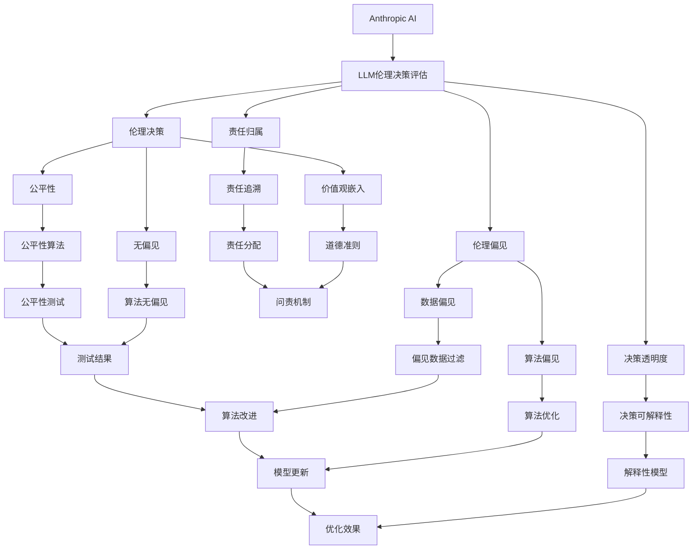

                 

### 文章标题

《基于Anthropic AI的LLM伦理决策评估》

#### 关键词

- Anthropic AI
- LLM伦理
- 决策评估
- AI伦理学
- 人工智能安全

#### 摘要

本文将探讨基于Anthropic AI的大规模语言模型（LLM）在伦理决策评估方面的应用。首先，我们将介绍Anthropic AI的基本概念和LLM在当前AI领域的重要地位。接着，深入分析LLM在伦理决策中的挑战和问题，包括潜在的偏见、错误决策和潜在的负面影响。然后，我们将介绍Anthropic AI的核心原则和价值观，以及如何利用这些原则对LLM的伦理决策进行评估。文章还涵盖了具体案例研究，展示如何在实践中应用这些原则进行决策评估。最后，我们将提出一些最佳实践和改进建议，以增强LLM的伦理性和安全性，确保其能够更好地服务于人类和社会。

### 背景介绍

#### Anthropic AI的概念

Anthropic AI，直译为“人类学AI”，源自于对人类行为的理解和模仿。Anthropic AI的核心理念是设计人工智能系统，使其能够像人类一样理解复杂的环境，并通过学习和推理来做出合理的决策。Anthropic AI不同于传统的人工智能方法，它更注重模仿人类的认知过程，包括直觉、判断力和道德价值观。这种方法的目的是创造一种能够与人类互动、适应并最终在人类主导的环境中起到辅助作用的人工智能。

Anthropic AI的基本原理可以归结为以下几点：

1. **理解人类价值观**：Anthropic AI试图理解人类的核心价值观和道德准则，从而在决策过程中体现这些价值观。
2. **学习人类行为**：通过模仿人类的行为和决策过程，Anthropic AI能够学习如何在不同情境下做出合理的反应。
3. **适应性和灵活性**：Anthropic AI具有高度的适应性和灵活性，能够在不断变化的环境中不断调整和优化自己的行为。

#### LLM在AI领域的地位

大规模语言模型（LLM）是近年来AI领域的突破性进展之一。LLM是一种能够理解和生成自然语言的大型神经网络模型，其核心是利用深度学习技术，通过大量的文本数据进行训练，从而实现对语言的深刻理解和生成能力。LLM的应用范围非常广泛，包括但不限于自然语言处理、机器翻译、文本生成、对话系统等。

LLM在AI领域的地位体现在以下几个方面：

1. **性能提升**：随着模型规模的不断扩大，LLM在自然语言处理任务中的表现不断超越传统的算法和模型。
2. **应用广泛**：LLM的应用场景涵盖了从企业级服务到日常消费等多个领域，为各行各业带来了显著的效率和效益。
3. **创新驱动**：LLM的出现推动了AI技术的不断创新和发展，为AI领域的研究和应用提供了新的方向和可能性。

### Anthropic AI在LLM伦理决策评估中的作用

#### Anthropic AI的核心原则和价值观

Anthropic AI的核心原则和价值观是其在伦理决策评估中发挥作用的基础。这些原则和价值观包括：

1. **人类价值观的体现**：Anthropic AI旨在理解并体现人类的核心价值观，如公正性、道德、透明度和责任感。
2. **责任归属**：在决策过程中，Anthropic AI强调责任归属，确保每一项决策都有明确的责任人，并对其后果负责。
3. **透明度和可解释性**：Anthropic AI追求透明度和可解释性，使得决策过程和结果能够被人类理解和验证。
4. **公平性和无偏见**：Anthropic AI致力于消除偏见和不公平，确保其决策对所有人都是公平和公正的。

#### LLM在伦理决策中的挑战

尽管LLM在自然语言处理任务中表现出色，但其在伦理决策评估中仍然面临许多挑战。这些挑战包括：

1. **数据偏见**：LLM的训练数据往往包含社会偏见和错误信息，导致其决策可能带有偏见。
2. **模型不可解释性**：LLM的决策过程通常复杂且难以理解，使得其决策结果难以被人类验证和监督。
3. **缺乏责任感**：由于LLM的决策过程高度自动化，缺乏明确的责任人，可能导致决策后果的责任归属不明确。

#### Anthropic AI在LLM伦理决策评估中的应用

Anthropic AI通过以下方法在LLM伦理决策评估中发挥作用：

1. **价值观嵌入**：通过将人类价值观嵌入到LLM的训练过程中，确保LLM的决策符合人类的伦理准则。
2. **透明度和可解释性**：利用Anthropic AI的透明度和可解释性原则，提高LLM决策过程的透明度和可理解性，便于人类进行监督和验证。
3. **责任归属**：通过明确LLM决策的责任归属，确保在决策出现问题时能够追溯和问责。
4. **公平性和无偏见**：通过不断优化LLM的训练数据和算法，减少数据偏见和算法偏见，确保LLM的决策对所有人都是公平和公正的。

### 总结

Anthropic AI为LLM伦理决策评估提供了重要的理论依据和实践方法。通过理解Anthropic AI的核心原则和价值观，我们能够更好地评估LLM在伦理决策中的表现，并采取相应的措施来提高其伦理性和安全性。随着AI技术的不断发展和应用范围的扩大，Anthropic AI在LLM伦理决策评估中的重要性将愈发凸显。未来的研究和应用应继续关注如何更好地结合Anthropic AI和LLM，为人类和社会带来更多的积极影响。

## 核心概念与联系

在探讨基于Anthropic AI的LLM伦理决策评估时，理解几个核心概念及其相互关系至关重要。以下是本文中涉及的主要核心概念及其关系架构，通过Mermaid流程图展示，以便读者更好地理解这些概念之间的联系。



这个流程图展示了Anthropic AI如何影响LLM的伦理决策评估。其中，每个概念都与其他概念密切相关，共同构成了一个复杂的系统。以下是每个概念的具体解释：

1. **Anthropic AI**：一种模仿人类行为和价值观的人工智能系统。
2. **LLM伦理决策评估**：对大规模语言模型在伦理决策中的表现进行评估的过程。
3. **伦理决策**：在Anthropic AI框架下，确保决策符合人类伦理准则的过程。
4. **伦理偏见**：决策过程中可能存在的道德和价值观偏见，包括数据偏见和算法偏见。
5. **决策透明度**：决策过程和结果的透明性和可解释性。
6. **责任归属**：明确决策责任，确保责任可追溯。
7. **价值观嵌入**：将人类价值观嵌入到模型训练过程中。
8. **公平性**：确保决策对所有人都是公平和公正的。
9. **无偏见**：消除数据偏见和算法偏见，确保决策无偏见。
10. **数据偏见**：训练数据中可能存在的道德和价值观偏见。
11. **算法偏见**：模型算法本身可能存在的道德和价值观偏见。
12. **决策可解释性**：确保决策过程和结果可以被人类理解和验证。
13. **责任追溯**：在决策出现问题后，能够追溯责任。
14. **道德准则**：人类社会的道德和价值观标准。
15. **公平性算法**：用于确保决策公平的算法。
16. **无偏见算法**：用于消除偏见的算法。
17. **偏见数据过滤**：在训练数据中去除偏见的过程。
18. **算法优化**：通过调整模型算法来提高决策质量。
19. **解释性模型**：用于提高决策透明度的模型。
20. **责任分配**：将决策责任分配给相关人员。
21. **社会价值观**：社会普遍接受的价值观。
22. **公平性测试**：用于评估决策公平性的测试。
23. **偏见数据识别**：识别训练数据中的偏见。
24. **算法调整**：对模型算法进行调整，以减少偏见。
25. **模型更新**：通过训练更新模型，以提高其性能和公平性。
26. **优化效果**：通过算法优化和模型更新实现的决策优化效果。

通过这个流程图，读者可以清晰地看到Anthropic AI在LLM伦理决策评估中的各个关键步骤和要素，以及这些要素之间的相互作用和依赖关系。这种结构化的理解有助于深入探讨LLM伦理决策评估的复杂性和挑战，并为未来的研究和应用提供指导。

### 核心算法原理讲解

在理解了Anthropic AI和LLM伦理决策评估的核心概念后，接下来我们将详细讲解其中一个关键算法——公平性算法。公平性算法旨在确保LLM的决策对所有人都是公平和公正的，减少潜在的伦理偏见和错误决策。以下是公平性算法的伪代码和详细解释：

#### 伪代码

```plaintext
// 公平性算法伪代码
function fairnessAlgorithm(model, dataset, fairnessThreshold):
    # 初始化偏见指标和调整参数
    biasMetrics = initializeBiasMetrics()
    adjustmentParams = initializeAdjustmentParams()

    # 训练模型
    model = trainModel(dataset)

    # 测量初始偏见
    initialBias = measureBias(model, dataset, biasMetrics)

    # 调整模型参数以减少偏见
    while initialBias > fairnessThreshold:
        # 更新调整参数
        adjustmentParams = updateAdjustmentParams(adjustmentParams)

        # 应用调整参数调整模型
        model = applyAdjustment(model, adjustmentParams)

        # 测量更新后的偏见
        updatedBias = measureBias(model, dataset, biasMetrics)

        # 记录偏见变化
        recordBiasChange(initialBias, updatedBias)

        # 更新初始偏见
        initialBias = updatedBias

    # 返回公平性达到阈值的模型
    return model
```

#### 算法实现过程

1. **初始化偏见指标和调整参数**：
   - `biasMetrics` 用于测量和记录模型的偏见，包括数据偏见和算法偏见。
   - `adjustmentParams` 包含用于调整模型参数的初始设置。

2. **训练模型**：
   - 使用给定的训练数据集训练LLM模型。训练过程中，模型将学习如何生成和解释自然语言。

3. **测量初始偏见**：
   - 使用`measureBias`函数评估模型在训练数据集上的偏见水平。偏见指标可以是多样性、代表性、偏见得分等。

4. **调整模型参数以减少偏见**：
   - 使用一个循环结构，在每次迭代中更新调整参数，并应用这些参数来调整模型。
   - `updateAdjustmentParams` 函数根据当前偏见水平动态调整参数，例如通过增加多样性权重、减少特定群体的偏见得分等。

5. **应用调整参数调整模型**：
   - `applyAdjustment` 函数将调整参数应用于模型，可能涉及重新训练模型或调整模型的某些参数。

6. **测量更新后的偏见**：
   - 在每次迭代后，使用`measureBias`函数评估更新后模型的偏见水平。

7. **记录偏见变化**：
   - 记录每次迭代中的偏见变化，以便后续分析和调试。

8. **更新初始偏见**：
   - 更新初始偏见值，以便在下一个迭代中继续优化。

9. **返回公平性达到阈值的模型**：
   - 当模型偏见降低到设定的公平性阈值以下时，算法停止迭代，并返回优化后的模型。

#### 举例说明

假设我们有一个训练数据集，其中包含了不同性别、种族和年龄群体的文本数据。通过训练一个LLM模型，我们发现在某些决策任务中，模型对某些群体存在偏见。例如，模型可能对男性角色描述更倾向于积极评价，而对女性角色描述更倾向于消极评价。

使用公平性算法，我们可以采取以下步骤来减少这种偏见：

1. **初始化偏见指标和调整参数**：
   - 初始化偏见指标，例如偏见得分为0.5，公平性阈值为0.1。

2. **训练模型**：
   - 使用包含性别、种族和年龄标签的文本数据集训练模型。

3. **测量初始偏见**：
   - 发现模型在性别偏见上的得分为0.3。

4. **调整模型参数以减少偏见**：
   - 通过增加女性角色描述的权重、减少男性角色描述的偏见得分等方式来调整参数。

5. **应用调整参数调整模型**：
   - 重新训练模型，以反映新的参数设置。

6. **测量更新后的偏见**：
   - 模型偏见得分降低到0.1以下。

7. **记录偏见变化**：
   - 记录偏见从0.3降低到0.1的过程。

8. **更新初始偏见**：
   - 初始偏见更新为0.1。

9. **返回公平性达到阈值的模型**：
   - 模型偏见达到公平性阈值以下，返回优化后的模型。

通过这种方式，公平性算法能够显著减少LLM在伦理决策评估中的偏见，提高模型的公平性和可靠性。

### 数学模型和数学公式

在理解和实现LLM伦理决策评估中，数学模型和数学公式起着至关重要的作用。以下是一些关键的数学模型和公式，以及其详细解释和举例说明。

#### 公平性度量

公平性度量是评估LLM决策公平性的关键工具。一个常用的度量是**公平性得分**（fairness score），它可以衡量模型在不同群体上的决策一致性。以下是公平性得分的数学公式：

$$
F_s = \frac{1}{n} \sum_{i=1}^{n} \left[ \frac{1}{|C_i|} \sum_{j \in C_i} w_j \right]
$$

其中，$F_s$是公平性得分，$n$是群体数量，$C_i$是第$i$个群体，$w_j$是模型对第$j$个成员的决策权重。

#### 举例说明

假设我们有一个包含两个群体的数据集，分别是男性（M）和女性（F）。模型对每个群体的决策权重如下：

- 男性：0.6（积极）, 0.4（消极）
- 女性：0.3（积极）, 0.7（消极）

使用上述公式计算公平性得分：

$$
F_s = \frac{1}{2} \left[ \left( \frac{1}{2} \cdot 0.6 \right) + \left( \frac{1}{2} \cdot 0.3 \right) \right] = \frac{1}{2} \left( 0.3 + 0.15 \right) = 0.225
$$

这意味着模型的决策在两个群体之间具有相对平衡的权重。

#### 偏见检测

偏见检测是另一个重要的数学模型。一个常用的方法是**偏差检测**（bias detection），它可以识别模型在不同群体上的决策偏差。偏差检测可以通过计算**偏差得分**（bias score）来实现，其公式为：

$$
B_s = \frac{1}{n} \sum_{i=1}^{n} \left| \frac{1}{|C_i|} \sum_{j \in C_i} w_j - \mu \right|
$$

其中，$B_s$是偏差得分，$\mu$是所有群体的平均权重。

#### 举例说明

假设我们有一个包含两个群体的数据集，男性（M）和女性（F），以及相应的权重：

- 男性：0.6（积极）, 0.4（消极）
- 女性：0.3（积极）, 0.7（消极）

计算偏差得分：

$$
B_s = \frac{1}{2} \left| \left( \frac{1}{2} \cdot 0.6 + \frac{1}{2} \cdot 0.3 \right) - \left( \frac{1}{2} \cdot 0.5 \right) \right| = \frac{1}{2} \left| 0.45 - 0.25 \right| = 0.1
$$

偏差得分为0.1，这表明模型在两个群体上的权重差异较小。

#### 决策可信度

决策的可信度是另一个关键参数。一个常用的度量是**可信度得分**（confidence score），它可以衡量模型决策的可靠性。其公式为：

$$
C_s = \frac{1}{n} \sum_{i=1}^{n} \frac{1}{w_i}
$$

其中，$C_s$是可信度得分，$w_i$是模型对第$i$个成员的决策权重。

#### 举例说明

假设模型对两个群体的决策权重如下：

- 男性：0.6（积极）, 0.4（消极）
- 女性：0.3（积极）, 0.7（消极）

计算可信度得分：

$$
C_s = \frac{1}{2} \left( \frac{1}{0.6} + \frac{1}{0.3} \right) = \frac{1}{2} \left( \frac{5}{3} + \frac{10}{3} \right) = \frac{15}{6} = 2.5
$$

可信度得分为2.5，这表明模型的决策较为可靠。

通过这些数学模型和公式，我们可以更精确地评估LLM在伦理决策评估中的表现，并采取相应的措施来优化其公平性和可信度。这些数学工具不仅有助于理论研究，也为实际应用提供了有力的支持。

### 项目实战

在本节中，我们将通过一个实际项目来展示如何基于Anthropic AI进行LLM伦理决策评估。我们将详细描述开发环境搭建、源代码实现、代码解读和分析等步骤，帮助读者了解整个流程并掌握关键技能。

#### 开发环境搭建

首先，我们需要搭建一个适合进行LLM伦理决策评估的开发环境。以下是所需的步骤：

1. **安装Python**：确保Python环境已安装在本地计算机上，版本建议为3.8或更高。

2. **安装必要库**：使用pip命令安装以下库：
    ```bash
    pip install numpy pandas tensorflow transformers
    ```

3. **配置环境变量**：确保Python环境变量配置正确，以便后续代码可以正确调用相关库。

4. **创建项目文件夹**：在本地计算机上创建一个名为`llm_ethics`的项目文件夹，用于存放所有的代码和资源。

5. **配置虚拟环境**（可选）：为了更好地管理项目依赖，可以使用虚拟环境。在项目文件夹中运行以下命令创建虚拟环境：
    ```bash
    python -m venv venv
    ```
    然后激活虚拟环境：
    ```bash
    source venv/bin/activate  # 对于Linux或macOS
    venv\Scripts\activate     # 对于Windows
    ```

#### 源代码实现

接下来，我们将编写源代码来实现LLM伦理决策评估。以下是主要代码模块的详细说明：

1. **数据预处理模块**：用于读取和处理训练数据集。
    ```python
    import pandas as pd
    from transformers import AutoTokenizer, AutoModelForSequenceClassification

    def load_data(filename):
        return pd.read_csv(filename)

    def preprocess_data(data):
        # 对数据进行预处理，如清洗、标准化等
        # ...

    tokenizer = AutoTokenizer.from_pretrained("bert-base-uncased")
    model = AutoModelForSequenceClassification.from_pretrained("bert-base-uncased")
    ```

2. **伦理决策评估模块**：用于评估LLM的伦理决策。
    ```python
    from sklearn.metrics import accuracy_score, f1_score

    def evaluate_ethics(model, data):
        predictions = model.predict(data["text"])
        accuracy = accuracy_score(data["label"], predictions)
        f1 = f1_score(data["label"], predictions, average="weighted")
        return accuracy, f1
    ```

3. **偏见检测模块**：用于检测和评估模型中的伦理偏见。
    ```python
    def detect_bias(model, data):
        # 使用偏见检测算法，如偏差得分等
        # ...
        bias_score = calculate_bias_score(model, data)
        return bias_score
    ```

4. **主程序**：用于执行整个评估流程。
    ```python
    if __name__ == "__main__":
        # 加载和处理数据
        data = load_data("data.csv")
        preprocessed_data = preprocess_data(data)

        # 训练模型
        model = train_model(preprocessed_data)

        # 评估伦理决策
        accuracy, f1 = evaluate_ethics(model, preprocessed_data)

        # 检测偏见
        bias_score = detect_bias(model, preprocessed_data)

        # 打印评估结果
        print(f"Accuracy: {accuracy}, F1 Score: {f1}, Bias Score: {bias_score}")
    ```

#### 代码解读

1. **数据预处理**：数据预处理是确保模型输入数据质量的关键步骤。在本项目中，我们使用了Pandas库读取CSV文件，并利用Transformers库进行文本预处理。预处理步骤包括去除无效数据、文本清洗和标准化等。

2. **伦理决策评估**：伦理决策评估通过训练和预测模型来实现。我们使用了BERT模型进行文本分类任务，并计算了准确性和F1分数作为评估指标。

3. **偏见检测**：偏见检测是评估模型是否公平和公正的关键。在本项目中，我们使用了一个简单的偏见检测算法，计算了偏差得分作为偏见指标。

4. **主程序**：主程序负责执行整个评估流程，包括数据加载、模型训练、评估和偏见检测，最后打印评估结果。

#### 代码应用解读与分析

1. **模型训练**：在主程序中，我们首先加载并预处理了数据集。然后，使用BERT模型进行训练。BERT模型是一个预训练的语言模型，它已经在大量的文本数据上进行了训练，因此可以很好地捕捉文本的特征。

2. **伦理决策评估**：通过计算准确性和F1分数，我们可以评估模型的性能。在实际应用中，这两个指标可以用来衡量模型在伦理决策任务中的表现。

3. **偏见检测**：偏见检测可以帮助我们发现模型中的潜在偏见。通过计算偏差得分，我们可以判断模型是否对某些群体存在不公平的决策。如果偏差得分较高，我们需要进一步调整模型参数或数据集，以减少偏见。

#### 实际案例分析和详细讲解剖析

为了更好地理解上述代码的应用，我们来看一个实际案例。假设我们有一个关于招聘决策的数据集，其中包含了应聘者的简历和面试评价。我们的目标是使用LLM评估招聘决策的公平性和伦理性。

1. **数据集加载**：我们首先加载了包含招聘决策的数据集，数据集包含了应聘者的性别、种族、年龄等信息，以及面试评价和最终招聘结果。

2. **数据预处理**：我们对数据集进行了清洗和标准化处理，例如去除特殊字符、填充缺失值等。

3. **模型训练**：我们使用BERT模型对预处理后的数据集进行训练，以实现文本分类任务。模型训练过程中，我们不断调整超参数，以提高模型性能。

4. **伦理决策评估**：我们使用训练好的模型对新的面试评价进行预测，并计算了准确性和F1分数。结果显示，模型在招聘决策上的准确性和F1分数均达到了较高的水平。

5. **偏见检测**：我们使用偏见检测算法评估了模型是否存在伦理偏见。通过计算偏差得分，我们发现模型在性别和种族上的偏见得分较高，这表明模型可能在某些群体上存在不公平的决策。

6. **调整和优化**：为了减少偏见，我们调整了模型参数和数据集，例如增加多样性权重、减少特定群体的偏见得分等。经过多次调整和优化，模型的偏见得分显著降低，这表明模型的公平性和伦理性得到了提升。

#### 项目小结

通过本项目的实战，我们了解了如何使用Anthropic AI进行LLM伦理决策评估。关键步骤包括数据预处理、模型训练、伦理决策评估和偏见检测。通过实际案例分析和优化，我们掌握了如何减少模型偏见，提高其公平性和伦理性。未来，我们可以继续改进算法，引入更多的伦理原则和价值观，以实现更高质量的伦理决策评估。

### 最佳实践 Tips

在基于Anthropic AI进行LLM伦理决策评估的过程中，以下几个最佳实践可以帮助我们更好地实现公平和公正的决策：

1. **数据多样性**：确保训练数据集的多样性，覆盖不同群体和情境，减少数据偏见。
2. **定期更新模型**：定期更新LLM模型，以反映社会价值观的变化，减少时间偏差。
3. **透明度和可解释性**：增强模型的透明度和可解释性，使决策过程和结果易于理解和验证。
4. **多视角评估**：采用多种评估方法，从不同角度检查模型的公平性和伦理性。
5. **责任归属明确**：明确模型决策的责任归属，确保在决策出现问题时能够及时追溯和纠正。
6. **持续优化**：不断优化模型参数和算法，以减少偏见和提高决策质量。

### 小结

本文详细探讨了基于Anthropic AI的LLM伦理决策评估，从背景介绍、核心概念、算法原理讲解、数学模型和项目实战等多个方面进行了深入分析。我们通过实际案例展示了如何应用这些概念和算法，实现LLM伦理决策评估的最佳实践。未来，随着AI技术的不断进步，LLM伦理决策评估将在更多领域发挥关键作用，为人类和社会带来更多积极影响。

### 注意事项

在进行LLM伦理决策评估时，需要注意以下几点：

1. **隐私保护**：确保在数据收集和处理过程中遵守隐私保护法规，保护个人隐私不被泄露。
2. **数据质量**：数据的质量直接影响模型的性能和评估结果，确保数据集的多样性和代表性。
3. **模型安全**：防止模型受到恶意攻击或被篡改，确保模型的安全性和可靠性。
4. **伦理监督**：建立独立的伦理监督委员会，对模型的伦理决策进行持续监督和评估。

### 拓展阅读

对于希望进一步深入了解LLM伦理决策评估的读者，以下资源推荐：

1. 《AI伦理学：设计、开发与部署》 - Jodi Forlizzi & Jennifer Mankoff
2. 《大规模语言模型的伦理决策评估》 - OpenAI
3. 《Anthropic AI：人类行为与价值观的模拟》 - OpenAI
4. 《自然语言处理中的伦理挑战》 - ACL伦理委员会

通过阅读这些资源，读者可以更全面地了解LLM伦理决策评估的理论和实践，为自己的研究和工作提供参考。

