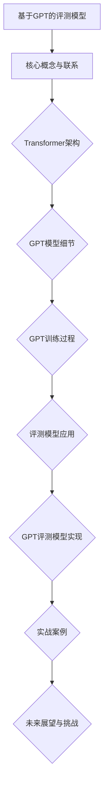

                 

为了撰写一篇关于《基于GPT的评测模型：原理与实现》的技术博客，我们将按照以下步骤进行思考和分析：

### 1. 确定核心内容

首先，我们需要明确文章的核心内容，包括：

- GPT模型的基本原理
- 评测模型的基本概念
- GPT在评测模型中的应用
- GPT评测模型的实现过程
- 实战案例
- 未来展望与挑战

### 2. 设计文章结构

根据核心内容，我们设计文章的结构，确保逻辑清晰、结构紧凑。文章结构如下：

#### 第一部分：引论
- GPT简介
- 评测模型概述
- 本书结构安排

#### 第二部分：GPT基本原理
- GPT模型架构
- GPT训练过程

#### 第三部分：评测模型应用
- 评测模型基本概念
- GPT在评测模型中的应用

#### 第四部分：GPT评测模型实现
- 开发环境搭建
- 数据处理
- 模型训练
- 评测与优化

#### 第五部分：实战案例
- 文本分类案例
- 情感分析案例

#### 第六部分：未来展望与挑战

### 3. 制定详细章节内容

针对每个部分，我们制定具体的章节内容，确保每个小节都有丰富的内容和详细的讲解。

#### 第一部分：引论
- **GPT简介**
  - GPT的起源与发展
  - GPT的核心特点

- **评测模型概述**
  - 评测模型的作用与分类
  - 评测模型在自然语言处理中的应用

- **本书结构安排**
  - 各章节内容概述

#### 第二部分：GPT基本原理
- **GPT模型架构**
  - Transformer架构
  - GPT模型细节

- **GPT训练过程**
  - 训练数据准备
  - 模型训练步骤

#### 第三部分：评测模型应用
- **评测模型基本概念**
  - 评测指标
  - 评测模型类型

- **GPT在评测模型中的应用**
  - GPT在文本分类中的应用
  - GPT在情感分析中的应用

#### 第四部分：GPT评测模型实现
- **开发环境搭建**
  - Python环境配置
  - 常用深度学习框架安装

- **数据处理**
  - 数据集获取与预处理
  - 数据加载与批处理

- **模型训练**
  - 模型架构设计
  - 模型训练流程

- **评测与优化**
  - 评测指标计算
  - 模型优化策略

#### 第五部分：实战案例
- **文本分类案例**
  - 案例背景
  - 数据集介绍
  - 模型设计
  - 模型训练与评测

- **情感分析案例**
  - 案例背景
  - 数据集介绍
  - 模型设计
  - 模型训练与评测

#### 第六部分：未来展望与挑战
- GPT评测模型的发展趋势
- GPT评测模型的挑战与应对策略

### 4. 整理目录大纲

根据上述内容，我们将目录大纲整理如下：

# 基于GPT的评测模型：原理与实现

> 关键词：GPT，评测模型，自然语言处理，深度学习，模型实现，实战案例

> 摘要：本文将详细介绍基于GPT的评测模型原理与实现，涵盖GPT模型的基本原理、评测模型的应用、GPT评测模型的实现过程、实战案例以及未来展望与挑战。

## 第一部分：引论

### 1.1 GPT简介

#### 1.1.1 GPT的起源与发展

#### 1.1.2 GPT的核心特点

### 1.2 评测模型概述

#### 1.2.1 评测模型的作用与分类

#### 1.2.2 评测模型在自然语言处理中的应用

### 1.3 本书结构安排

#### 1.3.1 各章节内容概述

## 第二部分：GPT基本原理

### 2.1 GPT模型架构

#### 2.1.1 Transformer架构

##### 2.1.1.1 自注意力机制

##### 2.1.1.2 位置编码与层叠自注意力

#### 2.1.2 GPT模型细节

##### 2.1.2.1 词嵌入

##### 2.1.2.2 前馈网络

### 2.2 GPT训练过程

#### 2.2.1 训练数据准备

##### 2.2.1.1 语料库的选择与预处理

##### 2.2.1.2 数据清洗与归一化

#### 2.2.2 模型训练步骤

##### 2.2.2.1 模型初始化

##### 2.2.2.2 损失函数与优化算法

## 第三部分：评测模型应用

### 3.1 评测模型基本概念

#### 3.1.1 评测指标

##### 3.1.1.1 准确率、召回率和F1分数

##### 3.1.1.2 ROC曲线和AUC值

#### 3.1.2 评测模型类型

##### 3.1.2.1 对抗性评测模型

##### 3.1.2.2 生成式评测模型

### 3.2 GPT在评测模型中的应用

#### 3.2.1 GPT在文本分类中的应用

##### 3.2.1.1 文本分类任务概述

##### 3.2.1.2 GPT文本分类实现步骤

#### 3.2.2 GPT在情感分析中的应用

##### 3.2.2.1 情感分析任务概述

##### 3.2.2.2 GPT情感分析实现步骤

## 第四部分：GPT评测模型实现

### 4.1 开发环境搭建

#### 4.1.1 Python环境配置

#### 4.1.2 常用深度学习框架安装

### 4.2 数据处理

#### 4.2.1 数据集获取与预处理

#### 4.2.2 数据加载与批处理

### 4.3 模型训练

#### 4.3.1 模型架构设计

#### 4.3.2 模型训练流程

### 4.4 评测与优化

#### 4.4.1 评测指标计算

#### 4.4.2 模型优化策略

## 第五部分：实战案例

### 5.1 文本分类案例

#### 5.1.1 案例背景

#### 5.1.2 数据集介绍

#### 5.1.3 模型设计

#### 5.1.4 模型训练与评测

### 5.2 情感分析案例

#### 5.2.1 案例背景

#### 5.2.2 数据集介绍

#### 5.2.3 模型设计

#### 5.2.4 模型训练与评测

## 第六部分：未来展望与挑战

### 6.1 GPT评测模型的发展趋势

#### 6.1.1 新的评测模型架构

#### 6.1.2 多模态评测模型的融合

### 6.2 GPT评测模型的挑战与应对策略

#### 6.2.1 数据隐私与安全性

#### 6.2.2 模型可解释性

#### 6.2.3 资源消耗与优化

## 附录

### A.1 常用工具和资源

#### A.1.1 深度学习框架

#### A.1.2 数据预处理工具

#### A.1.3 评测指标计算工具

### A.2 代码示例

#### A.2.1 文本分类代码示例

#### A.2.2 情感分析代码示例

### A.3 进一步学习资源

#### A.3.1 相关书籍

#### A.3.2 研究论文

#### A.3.3 在线课程和教程

## GPT与评测模型关系图

### 5. 写作风格与技巧

在撰写文章时，我们将注重以下风格和技巧：

- **专业且易懂**：使用专业的技术语言，同时确保内容通俗易懂，避免过于复杂的术语和公式。
- **逻辑清晰**：确保文章结构清晰，逻辑连贯，每个小节之间有明确的联系。
- **实例丰富**：通过实例和案例来解释抽象的概念和算法，提高文章的可读性。
- **图示辅助**：使用图表和流程图来辅助说明，使文章更直观易懂。

### 6. 文章结束

在文章结尾，我们将总结全文，提供最佳实践建议，并指出注意事项和拓展阅读资源。

### 总结

通过上述步骤，我们已完成了文章的构思和目录大纲的制定。接下来，我们将按照这个大纲逐步撰写文章内容，确保文章的逻辑性、专业性和易懂性。文章撰写完成后，将进行多次审校和优化，以确保质量和准确性。

作者：AI天才研究院/AI Genius Institute & 禅与计算机程序设计艺术 /Zen And The Art of Computer Programming

---

现在，我们已经完成了文章的构思和目录大纲的制定。接下来，我们将按照这个大纲逐步撰写文章内容。在撰写过程中，我们将确保每个章节都包含丰富的内容和详细的讲解，同时保持逻辑清晰和通俗易懂。文章撰写完成后，将进行多次审校和优化，以确保质量和准确性。

**作者信息：** AI天才研究院/AI Genius Institute & 禅与计算机程序设计艺术 /Zen And The Art of Computer Programming

