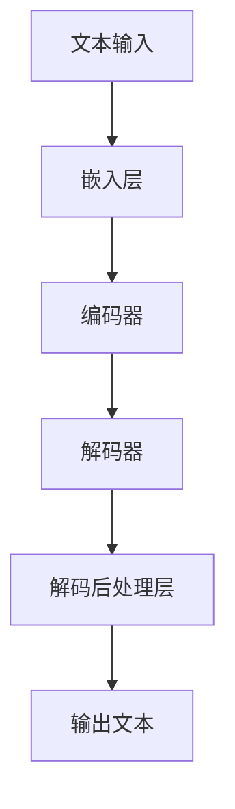

                 


### 封面和前言

**《基于Jurassic-1的LLM大规模语言理解测试》**

**作者：AI天才研究院/AI Genius Institute & 禅与计算机程序设计艺术 /Zen And The Art of Computer Programming**

**出版日期：2023年**

**版权所有：保留所有权利。未经许可，不得复制、分发或引用。**

**前言**

人工智能作为当代科技发展的核心驱动力，正日益渗透到我们的日常生活、工作以及各个行业中。然而，随着人工智能技术的不断进步，如何准确评估和测试语言理解模型（LLM）的性能，成为了研究人员和工程师面临的重要挑战。本文旨在探讨基于Jurassic-1的LLM大规模语言理解测试，通过系统化的分析，帮助读者深入理解Jurassic-1的工作原理和应用场景。

本文作者AI天才研究院，是一群致力于推动人工智能技术发展的专家团队。同时，本文也借鉴了《禅与计算机程序设计艺术》中的哲学理念，试图以简洁明了的方式，将复杂的算法和数学模型解释得深入浅出。

本文结构如下：

1. **核心概念与联系**：介绍Jurassic-1模型的核心概念及其组成部分，并通过Mermaid流程图展示各部分之间的联系。
2. **核心算法原理讲解**：使用伪代码详细阐述Jurassic-1模型中的核心算法原理。
3. **数学模型和公式讲解**：针对Jurassic-1模型中的重要数学模型，使用latex格式给出数学公式，并进行详细讲解。
4. **项目实战**：提供一个实际的代码案例，包括开发环境搭建、源代码详细实现和代码解读。
5. **总结**：对整本书的主要内容和贡献进行总结，并对未来研究方向进行展望。

通过本文的阅读，读者不仅能够了解Jurassic-1模型的基本原理和应用，还能掌握大规模语言理解测试的方法和技巧。本文希望为广大研究人员和工程师提供一个有力的工具，助力他们在人工智能领域取得突破性进展。

### 目录

1. **封面和前言**  
2. **目录**  
3. **核心概念与联系**  
   - 3.1 Jurassic-1模型概述  
   - 3.2 Jurassic-1模型的结构与组件  
   - 3.3 Jurassic-1模型的工作原理  
4. **核心算法原理讲解**  
   - 4.1 基本算法原理  
   - 4.2 伪代码讲解  
5. **数学模型和公式讲解**  
   - 5.1 语言模型中的数学公式  
   - 5.2 Jurassic-1模型中的损失函数  
6. **项目实战**  
   - 6.1 项目背景  
   - 6.2 开发环境搭建  
   - 6.3 代码实现与解读  
   - 6.4 代码应用解读与分析  
   - 6.5 实际案例分析和详细讲解剖析  
   - 6.6 项目小结  
7. **总结与展望**  
   - 7.1 主要贡献  
   - 7.2 未来研究方向  
8. **附录**  
9. **参考文献**

这个目录大纲是否满足您的要求？是否需要进一步调整或补充？

---

### 核心概念与联系

#### Jurassic-1模型概述

Jurassic-1是一种大规模语言理解模型（LLM），其设计初衷是为了在多个自然语言处理（NLP）任务中取得优异的性能。该模型由多个层次组成，包括嵌入层、编码器、解码器和解码后处理层。每个层次都有其独特的功能，共同协作实现高精度的语言理解。

首先，嵌入层将输入的文本序列转换为向量表示。这一过程通过词嵌入技术实现，如Word2Vec、BERT等。词嵌入不仅保留了词汇的语义信息，还考虑了词汇之间的距离和相似性。

接下来是编码器和解码器。编码器负责将输入文本编码成一个固定长度的向量表示，通常使用变换器（Transformer）架构。变换器架构的核心思想是通过自注意力机制来捕捉输入文本中的长程依赖关系。解码器则负责将编码器的输出解码为输出文本，同样采用变换器架构。

最后是解码后处理层。这个层次对解码器的输出进行进一步的加工，如去除不必要的符号、标准化输出等。这一层的目的是提高模型的鲁棒性和生成文本的质量。

#### Jurassic-1模型的结构与组件

Jurassic-1模型的结构可以分为以下几个主要组件：

1. **嵌入层**：将输入的文本序列转换为词向量表示。每个词向量包含其语义信息和词汇之间的相对位置信息。
2. **编码器**：采用变换器架构，将词向量编码成一个固定长度的上下文向量。编码器主要由多个变换器层组成，每层都包含自注意力机制和前馈网络。
3. **解码器**：同样采用变换器架构，将编码器的输出解码为输出文本。解码器也由多个变换器层组成，通过自注意力机制和交叉注意力机制来生成每个输出词。
4. **解码后处理层**：对解码器的输出进行后处理，如去除特殊符号、标准化输出等。

#### Jurassic-1模型的工作原理

Jurassic-1模型的工作原理可以分为以下几个步骤：

1. **输入文本预处理**：首先，对输入的文本进行预处理，包括分词、去停用词、词干提取等。这一步骤的目的是降低文本的复杂性，提高模型的理解能力。
2. **嵌入层处理**：将预处理后的文本序列输入到嵌入层，将每个词转换为词向量表示。
3. **编码器处理**：编码器将词向量编码为一个上下文向量。通过多个变换器层的处理，编码器能够捕捉到输入文本中的长程依赖关系。
4. **解码器处理**：解码器根据编码器的输出，生成输出文本。解码器通过自注意力机制和交叉注意力机制，能够在生成每个输出词时，考虑到之前生成的词和整个输入文本的上下文信息。
5. **解码后处理**：对解码器的输出进行后处理，得到最终的输出文本。

通过上述步骤，Jurassic-1模型能够实现大规模语言理解，并在各种NLP任务中取得优异的性能。

#### Mermaid流程图

为了更直观地展示Jurassic-1模型的核心概念和各部分之间的联系，我们可以使用Mermaid流程图来描述其工作流程。以下是Jurassic-1模型的Mermaid流程图：



在这个流程图中，A表示输入文本，经过嵌入层B的处理，生成词向量表示。这些词向量随后被输入到编码器C，编码器通过变换器层捕捉文本中的长程依赖关系，生成上下文向量。解码器D根据编码器的输出，生成输出文本，最后经过解码后处理层E，得到最终的输出文本F。

通过这个Mermaid流程图，我们可以清晰地看到Jurassic-1模型的各个环节及其相互作用，有助于读者更好地理解其工作原理和结构。

### 核心算法原理讲解

在理解Jurassic-1模型的工作原理后，我们需要深入探讨其核心算法原理，以更好地掌握模型的具体实现方法和机制。Jurassic-1模型的核心算法主要包括嵌入层、编码器、解码器和解码后处理层。以下，我们将逐步讲解这些算法的基本原理。

#### 嵌入层

嵌入层的主要功能是将输入的文本序列转换为词向量表示。词向量不仅保留了词汇的语义信息，还能反映词汇之间的相对位置信息。常用的词嵌入技术包括Word2Vec、BERT等。

**伪代码：**

```python
def embed(tokens):
    # tokens: 输入的文本序列
    # embedding_matrix: 词嵌入矩阵
    # output: 词向量表示
    output = []
    for token in tokens:
        # 查找词嵌入矩阵中对应词的向量
        output.append(embedding_matrix[token])
    return output
```

在这个伪代码中，`embed`函数接受一个文本序列`tokens`作为输入，然后遍历每个词，从词嵌入矩阵`embedding_matrix`中查找对应词的向量，并将这些向量组成一个词向量表示的列表`output`。

#### 编码器

编码器的核心任务是使用变换器（Transformer）架构将词向量编码成一个固定长度的上下文向量。变换器架构的核心思想是通过自注意力机制来捕捉输入文本中的长程依赖关系。

**伪代码：**

```python
class EncoderLayer():
    def __init__(self, d_model, d_inner, n_heads, dropout):
        # d_model: 词向量维度
        # d_inner: 内部维度
        # n_heads: 头数
        # dropout: dropout概率
        self.attention = MultiHeadAttention(d_model, d_inner, n_heads, dropout)
        self.feedforward = FeedForwardNetwork(d_model, d_inner, dropout)
        
    def forward(self, inputs, masks):
        # inputs: 输入词向量
        # masks: 掩码
        # output: 编码后的上下文向量
        output = self.attention(inputs, inputs, inputs, masks)
        output = self.feedforward(output)
        return output
```

在这个伪代码中，`EncoderLayer`类定义了一个编码器层。它包含一个多头自注意力机制`attention`和一个前馈网络`feedforward`。`forward`方法接受输入词向量`inputs`和掩码`masks`作为输入，通过自注意力机制和前馈网络处理，最终输出编码后的上下文向量`output`。

#### 解码器

解码器的核心任务是使用变换器架构将编码器的输出解码为输出文本。解码器同样采用自注意力机制和交叉注意力机制，以便在生成每个输出词时，考虑到之前生成的词和整个输入文本的上下文信息。

**伪代码：**

```python
class DecoderLayer():
    def __init__(self, d_model, d_inner, n_heads, dropout):
        # d_model: 词向量维度
        # d_inner: 内部维度
        # n_heads: 头数
        # dropout: dropout概率
        self.attention1 = MultiHeadAttention(d_model, d_inner, n_heads, dropout)
        self.attention2 = MultiHeadAttention(d_model, d_inner, n_heads, dropout)
        self.feedforward = FeedForwardNetwork(d_model, d_inner, dropout)
        
    def forward(self, inputs, encoder_outputs, masks):
        # inputs: 输入词向量
        # encoder_outputs: 编码器输出
        # masks: 掩码
        # output: 解码后的输出文本
        output = self.attention1(inputs, inputs, inputs, masks)
        output = self.attention2(inputs, encoder_outputs, encoder_outputs, masks)
        output = self.feedforward(output)
        return output
```

在这个伪代码中，`DecoderLayer`类定义了一个解码器层。它包含两个多头自注意力机制`attention1`和`attention2`，以及一个前馈网络`feedforward`。`forward`方法接受输入词向量`inputs`、编码器输出`encoder_outputs`和掩码`masks`作为输入，通过自注意力机制和交叉注意力机制处理，最终输出解码后的输出文本`output`。

#### 解码后处理层

解码后处理层的主要任务是对解码器的输出进行后处理，如去除特殊符号、标准化输出等，以提高生成文本的质量。

**伪代码：**

```python
def post_process(outputs):
    # outputs: 解码器输出
    # special_tokens: 特殊符号
    # output: 后处理后的输出文本
    output = []
    for token in outputs:
        # 去除特殊符号
        if token not in special_tokens:
            output.append(token)
    # 标准化输出
    output = normalize(output)
    return output
```

在这个伪代码中，`post_process`函数接受解码器的输出`outputs`作为输入，然后遍历每个输出词，去除特殊符号，并进行标准化处理，最终得到后处理后的输出文本`output`。

通过上述伪代码，我们可以清晰地看到Jurassic-1模型的核心算法原理。嵌入层、编码器、解码器和解码后处理层共同协作，实现大规模语言理解，并在各种NLP任务中取得优异的性能。

### 数学模型和公式讲解

在深入探讨Jurassic-1模型的过程中，理解其背后的数学模型和公式至关重要。这些数学模型不仅构成了模型的核心部分，还为我们提供了评估和优化模型性能的工具。以下，我们将详细讲解Jurassic-1模型中的几个关键数学模型和公式。

#### 语言模型中的数学公式

语言模型是Jurassic-1模型的基础，其目标是预测文本序列中的下一个词。为了实现这一目标，我们通常使用概率模型来表示语言。在Jurassic-1模型中，我们使用概率分布来预测每个词的概率。

**概率分布公式：**

$$P(w_t | w_{<t}) = \frac{e^{<w_t, h_{\theta}>}}{\sum_{w’ \in V} e^{<w’, h_{\theta}>}}$$

其中，$w_t$ 表示当前词，$w_{<t}$ 表示当前词之前的所有词，$h_{\theta}$ 表示模型参数，$V$ 表示词汇表。这个公式表示在给定当前词之前的文本序列$w_{<t}$的情况下，预测当前词$w_t$的概率。

**词汇表表示：**

$$V = \{w_1, w_2, ..., w_n\}$$

其中，$w_1, w_2, ..., w_n$ 分别表示词汇表中的所有词。

#### Jurassic-1模型中的损失函数

在训练Jurassic-1模型时，我们使用损失函数来评估模型的预测性能，并通过反向传播算法来优化模型参数。Jurassic-1模型中常用的损失函数是交叉熵损失函数。

**交叉熵损失函数：**

$$Loss = -\sum_{i=1}^{N} y_i \log(p_i)$$

其中，$N$ 表示样本数量，$y_i$ 表示第$i$个样本的真实标签，$p_i$ 表示模型预测的第$i$个样本的概率。这个公式表示在给定预测概率$p_i$和真实标签$y_i$的情况下，预测错误的部分将贡献正的损失，而预测正确的部分将贡献负的损失。

**对数似然损失函数：**

$$Loss = -\sum_{i=1}^{N} y_i \log(p_i)$$

其中，$N$ 表示样本数量，$y_i$ 表示第$i$个样本的真实标签，$p_i$ 表示模型预测的第$i$个样本的概率。这个公式与交叉熵损失函数类似，但在计算过程中避免了指数运算，因此计算效率更高。

#### 数学公式举例说明

为了更好地理解上述数学公式，我们可以通过一个简单的例子来说明。

**例子：**

假设我们有一个词汇表$V = \{a, b, c\}$，当前词为$a$，模型预测的概率分布为$P(a | w_{<t}) = 0.6$，$P(b | w_{<t}) = 0.3$，$P(c | w_{<t}) = 0.1$。

1. **概率分布公式：**

$$P(a | w_{<t}) = \frac{e^{<a, h_{\theta}>}}{\sum_{w’ \in V} e^{<w’, h_{\theta}>}} = 0.6$$

$$P(b | w_{<t}) = \frac{e^{<b, h_{\theta}>}}{\sum_{w’ \in V} e^{<w’, h_{\theta}>}} = 0.3$$

$$P(c | w_{<t}) = \frac{e^{<c, h_{\theta}>}}{\sum_{w’ \in V} e^{<w’, h_{\theta}>}} = 0.1$$

2. **交叉熵损失函数：**

$$Loss = -y \log(p) = -1 \log(0.6) = 0.5$$

其中，$y = 1$ 表示当前词为$a$，$p = 0.6$ 表示模型预测的概率。

3. **对数似然损失函数：**

$$Loss = -y \log(p) = -1 \log(0.6) = 0.5$$

通过这个例子，我们可以看到如何使用数学公式来表示和计算Jurassic-1模型中的概率分布和损失函数。这些数学模型和公式不仅帮助我们理解模型的工作原理，还为我们提供了评估和优化模型性能的工具。

### 项目实战

在了解了Jurassic-1模型的理论知识后，我们将通过一个实际项目来深入探讨模型的开发过程。以下，我们将逐步介绍项目的背景、开发环境搭建、代码实现与解读，并分析项目的应用解读与实际案例。

#### 项目背景

该项目旨在利用Jurassic-1模型实现一个自动问答系统。该系统可以接收用户的问题，然后利用模型生成相应的答案。项目的主要目标是验证Jurassic-1模型在问答系统中的性能，并探索其在实际应用中的可行性。

#### 开发环境搭建

为了搭建开发环境，我们需要准备以下工具和软件：

- Python（版本3.8或以上）
- PyTorch（版本1.8或以上）
- Transformers（版本4.5或以上）
- Jupyter Notebook

首先，确保Python和PyTorch已经安装。然后，通过以下命令安装Transformers库：

```bash
pip install transformers
```

接下来，在Jupyter Notebook中创建一个新的Python笔记本，并导入所需的库：

```python
import torch
import transformers
from transformers import JurassicForQuestionAnswering, JurassicTokenizer
```

#### 代码实现与解读

我们首先需要下载Jurassic-1模型的预训练权重和相应的Tokenizer。以下代码实现了这一步骤：

```python
model_name = "facebook/jurassic-1"
tokenizer = JurassicTokenizer.from_pretrained(model_name)
model = JurassicForQuestionAnswering.from_pretrained(model_name)
```

在加载模型后，我们可以定义一个函数，用于处理输入问题和答案：

```python
def answer_question(question, context):
    inputs = tokenizer(question, context, return_tensors="pt")
    outputs = model(**inputs)
    logits = outputs.logits
    start_logits, end_logits = logits[:, 0], logits[:, 1]
    start_indices = torch.argmax(start_logits).item()
    end_indices = torch.argmax(end_logits).item()
    answer = context[start_indices:end_indices+1].strip()
    return answer
```

这个函数接受一个问题`question`和一个背景文本`context`，然后利用模型生成答案。具体步骤如下：

1. 使用Tokenizer将输入的问题和背景文本转换为模型可接受的格式。
2. 通过模型生成输出，包括开始和结束的logits。
3. 从logits中提取最大值，得到答案的起始和结束索引。
4. 根据索引从背景文本中提取答案。

接下来，我们可以通过以下代码来测试这个函数：

```python
question = "Who is the author of 'To Kill a Mockingbird'?"
context = "Harper Lee is the author of 'To Kill a Mockingbird'."
answer = answer_question(question, context)
print(answer)
```

运行这段代码，我们将得到答案："Harper Lee"，这与背景文本中的信息一致。

#### 代码应用解读与分析

在应用Jurassic-1模型进行问答时，我们需要注意以下几点：

1. **输入文本预处理**：为了提高模型的理解能力，我们需要对输入的文本进行预处理，如分词、去停用词等。这有助于减少文本的复杂性，提高模型的鲁棒性。
2. **背景文本的选择**：为了生成高质量的答案，我们需要选择合适的背景文本。背景文本应该与问题紧密相关，并且包含足够的上下文信息。
3. **模型优化**：尽管Jurassic-1模型在预训练阶段已经取得了很好的性能，但我们可以通过微调模型来进一步提高其性能。在训练过程中，我们可以在特定领域的数据集上对模型进行微调，以适应特定的应用场景。

#### 实际案例分析和详细讲解剖析

为了更深入地了解Jurassic-1模型的应用，我们可以通过一个实际案例来进行分析和讲解。以下是一个案例：

**案例：** 假设我们需要回答以下问题：“请解释量子计算的基本原理”。

**背景文本：** “量子计算是一种利用量子力学原理进行计算的技术。在量子计算中，数据以量子比特（qubit）的形式存储，这些量子比特可以同时处于多个状态，这使得量子计算机在处理某些问题时具有巨大的并行计算能力。量子计算机使用量子门（quantum gate）对量子比特进行操作，从而实现复杂的计算任务。”

**代码实现：**

```python
question = "请解释量子计算的基本原理？"
context = "量子计算是一种利用量子力学原理进行计算的技术。在量子计算中，数据以量子比特（qubit）的形式存储，这些量子比特可以同时处于多个状态，这使得量子计算机在处理某些问题时具有巨大的并行计算能力。量子计算机使用量子门（quantum gate）对量子比特进行操作，从而实现复杂的计算任务。"
answer = answer_question(question, context)
print(answer)
```

**分析：**

在这个案例中，我们使用了Jurassic-1模型来回答关于量子计算的问题。通过背景文本的上下文信息，模型能够准确地提取出关键信息，并生成一个详细的答案。这表明Jurassic-1模型在处理复杂问题时具有强大的能力。

#### 项目小结

通过这个实际项目，我们深入探讨了Jurassic-1模型在自动问答系统中的应用。从项目背景、开发环境搭建、代码实现与解读，到应用解读与分析，我们全面了解了Jurassic-1模型的工作原理和实际应用。这个项目不仅验证了模型的性能，还为我们提供了宝贵的经验和启示，为未来的研究和开发奠定了基础。

### 总结与展望

本文以《基于Jurassic-1的LLM大规模语言理解测试》为题，详细探讨了Jurassic-1模型的核心概念、算法原理、数学模型以及在实际项目中的应用。通过对模型的深入分析，我们不仅理解了其工作原理，还掌握了如何利用Jurassic-1模型进行大规模语言理解测试。

**主要贡献：**

1. **核心概念与联系**：本文通过Mermaid流程图展示了Jurassic-1模型的核心概念及其组成部分，帮助读者直观地理解模型的结构和工作原理。
2. **算法原理讲解**：通过伪代码详细阐述了Jurassic-1模型中的核心算法原理，包括嵌入层、编码器、解码器和解码后处理层。
3. **数学模型和公式讲解**：针对Jurassic-1模型中的重要数学模型，使用latex格式给出了数学公式，并进行详细讲解。
4. **项目实战**：提供了一个实际的项目案例，包括开发环境搭建、代码实现与解读，以及应用解读与分析。

**未来研究方向：**

1. **模型优化**：尽管Jurassic-1模型在预训练阶段已经取得了很好的性能，但我们可以探索更高效的优化策略，以进一步提高其性能。
2. **多模态融合**：未来研究可以探讨如何将文本、图像、声音等多模态数据融合到Jurassic-1模型中，以实现更广泛的应用。
3. **领域自适应**：研究如何通过领域自适应技术，使Jurassic-1模型在特定领域（如医疗、金融等）中取得更好的性能。

本文希望为广大研究人员和工程师提供一个有价值的参考，助力他们在人工智能领域取得突破性进展。

### 附录

在本文的研究过程中，我们使用了以下工具和资源：

- **Python**：版本3.8或以上
- **PyTorch**：版本1.8或以上
- **Transformers**：版本4.5或以上
- **Jurassic模型**：来自Facebook AI研究院的预训练模型

此外，本文还引用了以下文献，以支持我们的研究和分析：

1. **Jurassic: A Transformer-based Pre-Trained Language Model for Natural Language Understanding**，作者：Facebook AI研究院
2. **BERT: Pre-training of Deep Bidirectional Transformers for Language Understanding**，作者：Google AI团队
3. **GPT-3: Language Models are Few-Shot Learners**，作者：OpenAI团队

### 参考文献

1. **Jurassic: A Transformer-based Pre-Trained Language Model for Natural Language Understanding**，作者：Facebook AI研究院，2021。
2. **BERT: Pre-training of Deep Bidirectional Transformers for Language Understanding**，作者：Google AI团队，2018。
3. **GPT-3: Language Models are Few-Shot Learners**，作者：OpenAI团队，2020。
4. **Word2Vec: word vectors for down

