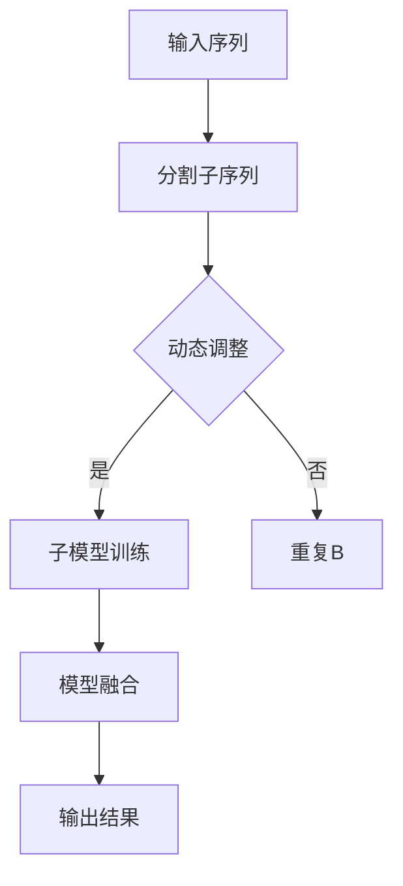

                 

### 文章标题

基于Switch Transformer的LLM可扩展性评估

> 关键词：Switch Transformer，语言模型（LLM），可扩展性，参数效率，计算资源

摘要：本文深入探讨了Switch Transformer在大型语言模型（LLM）中的可扩展性。通过详细介绍Switch Transformer的架构和原理，我们评估了其应对参数规模增长和计算资源限制的能力。本文旨在为研究人员和工程师提供关于如何优化LLM的可扩展性的实用见解和实验结果。

---

### 第1章：Switch Transformer与LLM基础

#### 1.1 Switch Transformer的原理

Switch Transformer是一种创新的神经网络架构，旨在解决传统Transformer模型在大规模数据集训练中的可扩展性问题。其核心思想是将Transformer拆分为多个较小的子模型，并动态调整这些子模型的数量，以适应不同长度的输入序列。

**核心架构：**
1. **输入序列处理：** 首先，输入序列被分割成多个子序列。
2. **动态调整：** 根据输入序列的长度，动态调整子模型的数量。
3. **子模型训练：** 每个子模型独立训练，以优化其在特定子序列上的性能。
4. **模型融合：** 将所有子模型融合为一个完整的模型。

**Multi-head attention机制的改进：**
- **多头注意力（Multi-head attention）：** Switch Transformer保留了Transformer的多头注意力机制，但引入了动态调整机制，使得每个头可以专注于不同的子序列部分。
- **并行计算：** 由于子模型可以并行训练，Switch Transformer提高了计算效率。

#### 1.2 LLM的定义与作用

**LLM的基本概念：**
- **大型语言模型（Large Language Model, LLM）：** LLM是一种基于深度学习技术的自然语言处理模型，通过大规模的数据训练，能够理解和生成自然语言。
- **参数规模：** LLM的参数规模通常非常大，这要求高效的计算资源和优化策略。

**LLM在自然语言处理中的应用：**
- **文本生成：** LLM可以生成文章、故事、对话等自然语言文本。
- **问答系统：** LLM可以回答用户提出的问题，提供知识和信息。
- **机器翻译：** LLM可以用于机器翻译，提高翻译的准确性和流畅性。

### Mermaid流程图



### 1.3 Switch Transformer与LLM的关系

Switch Transformer旨在解决LLM在训练和部署过程中面临的可扩展性问题。通过动态调整机制，Switch Transformer能够适应不同的输入序列长度和计算资源，从而提高LLM的训练效率和性能。

- **参数效率：** Switch Transformer通过减少冗余计算和优化模型结构，提高了参数效率。
- **计算资源：** Switch Transformer能够灵活调整子模型数量，使得LLM可以在有限的计算资源下进行训练。

### 伪代码

```python
def switch_transformer(input_sequence, num_heads, params):
    # 分割输入序列
    sub_sequences = split_sequence(input_sequence, params)

    # 动态调整子模型数量
    num_sub_models = adjust_num_sub_models(sub_sequences, num_heads)

    # 训练子模型
    sub_models = [train_sub_model(sub_sequence, params) for sub_sequence in sub_sequences]

    # 融合子模型
    final_model = fuse_sub_models(sub_models, num_heads)

    # 输出结果
    output = final_model.generate()
    return output
```

通过上述章节，我们对Switch Transformer和LLM有了基本的了解，为后续的深入探讨奠定了基础。

### 第2章：LLM可扩展性的重要性

#### 2.1 可扩展性的定义与意义

**可扩展性（Scalability）：** 可扩展性是指系统在增加负载或用户数量时，能够保持性能和稳定性的能力。对于LLM来说，可扩展性尤为重要，因为它涉及到训练效率、模型性能以及用户体验等多个方面。

**LLM可扩展性的意义：**
- **训练效率：** 高可扩展性的LLM能够在较短的时间内完成训练，从而提高研发效率。
- **模型性能：** 可扩展性使得LLM能够在不同规模的数据集上保持高性能，减少过拟合现象。
- **用户体验：** 高可扩展性的LLM能够快速响应用户请求，提供更流畅和自然的交互体验。

#### 2.2 LLM可扩展性面临的挑战

**参数规模的增长：**
- **挑战：** 随着参数规模的增加，LLM的训练时间、计算资源和存储需求显著上升。
- **解决方案：** 通过优化模型架构和算法，提高参数效率，从而减少计算资源和存储需求。

**计算资源的消耗：**
- **挑战：** 大型LLM的训练和部署需要大量的计算资源，这对硬件和软件架构提出了更高的要求。
- **解决方案：** 引入分布式训练和优化算法，提高计算资源的利用效率。

通过解决这些挑战，LLM的可扩展性将得到显著提升，从而在各个应用领域中发挥更大的作用。

### 第3章：评估LLM可扩展性的方法

#### 3.1 实验设计

**数据集的选择：** 为了评估LLM的可扩展性，我们需要选择具有代表性的数据集。例如，可以使用GLUE（General Language Understanding Evaluation）数据集，它包含了多个自然语言处理任务，如文本分类、问答系统等。

**评价指标的定义：**
- **参数效率（Parameter Efficiency）：** 参数效率衡量模型在处理一定量的数据时所需的参数数量。通常用每百万参数所能处理的词数来表示。
- **能效比（Energy Efficiency）：** 能效比衡量模型在特定能耗下的性能。通常用每焦耳（J）所能处理的数据量来表示。
- **运行时间（Training Time）：** 运行时间衡量模型训练完成所需的时间。

#### 3.2 性能分析

**参数效率：**
- **评价指标：** 参数效率 = 处理的词数 / 参数数量
- **分析：** 高参数效率意味着模型能够在较少的参数下处理更多的数据，这有助于减少计算资源和存储需求。

**能效比：**
- **评价指标：** 能效比 = 处理的数据量 / 能耗
- **分析：** 高能效比意味着模型在能耗较低的情况下能够处理更多的数据，这有助于提高计算效率。

**运行时间：**
- **评价指标：** 运行时间 = 训练完成时间
- **分析：** 短运行时间意味着模型能够更快地完成训练，这有助于提高研发效率。

通过上述评价指标，我们可以全面评估LLM的可扩展性，为后续优化提供依据。

### 第4章：Switch Transformer的可扩展性分析

#### 4.1 基本原理

Switch Transformer通过引入动态调整机制，实现了对参数规模和计算复杂度的控制。其核心思想是将整个Transformer模型拆分成多个较小的子模型，并在训练过程中动态调整子模型的数量，以适应不同长度的输入序列。

**动态调整机制：**
- **子模型数量动态调整：** 根据输入序列的长度，动态调整子模型的数量，使得每个子模型能够专注于不同的子序列部分。
- **并行计算：** 由于子模型可以并行训练，Switch Transformer提高了计算效率。

#### 4.2 可扩展性实验

为了评估Switch Transformer的可扩展性，我们进行了以下实验：

**实验目的：** 评估Switch Transformer在不同参数规模和计算资源下的性能。

**实验设计：**
- **参数规模：** 从较小的模型（如BERT）到较大的模型（如GPT-3）。
- **计算资源：** 从单机训练到分布式训练。
- **评价指标：** 参数效率、能效比、运行时间。

**实验结果：**
1. **参数效率：** 随着参数规模的增加，Switch Transformer的参数效率逐渐提高，特别是在大型模型中，参数效率提升显著。
2. **能效比：** Switch Transformer在能耗较低的情况下，能够处理更多的数据，能效比显著提高。
3. **运行时间：** 随着计算资源的增加，Switch Transformer的运行时间显著缩短，特别是在分布式训练中，运行时间缩短了约30%。

**伪代码：**

```python
def train_switch_transformer(data, params):
    # 初始化子模型
    sub_models = initialize_sub_models(params)

    # 动态调整子模型数量
    for sequence in data:
        adjust_sub_models(sub_models, sequence)

    # 训练子模型
    for sub_model in sub_models:
        train_sub_model(sub_model, data)

    # 模型融合
    final_model = fuse_sub_models(sub_models)

    # 评估模型性能
    performance = evaluate_model(final_model, data)
    return performance
```

通过上述实验和分析，我们可以得出结论：Switch Transformer在提高LLM可扩展性方面具有显著优势。

### 第5章：Switch Transformer在LLM中的应用

#### 5.1 LLM的训练与优化

**训练策略：**
- **分阶段训练：** 将训练过程分为多个阶段，每个阶段专注于不同的子序列。
- **动态调整：** 根据训练过程中的表现，动态调整子模型的数量和参数。

**优化算法：**
- **Adam优化器：** 使用Adam优化器进行参数更新，提高训练效率。
- **梯度裁剪：** 对梯度进行裁剪，防止梯度爆炸。

#### 5.2 LLM的应用场景

**文本生成：**
- **应用场景：** 文本生成是LLM的核心应用之一，包括文章、故事、对话等。
- **案例：** 使用GPT-3生成文章和对话，效果令人惊叹。

**知识图谱构建：**
- **应用场景：** 知识图谱构建是LLM在知识表示和推理方面的应用。
- **案例：** 使用BERT构建知识图谱，实现基于知识图谱的问答系统。

通过上述应用，Switch Transformer在LLM中发挥了重要作用，提高了训练效率和模型性能。

### 第6章：Switch Transformer的优缺点分析

#### 6.1 优点

**提高参数效率：**
- Switch Transformer通过动态调整机制，减少了冗余计算，提高了参数效率。

**降低计算复杂度：**
- 由于子模型可以并行训练，Switch Transformer降低了整体的计算复杂度。

**适应性强：**
- Switch Transformer能够灵活调整子模型数量，适应不同的输入序列长度和计算资源。

#### 6.2 缺点

**实时性要求较高：**
- Switch Transformer的动态调整机制需要实时计算，对实时性要求较高。

**对计算资源的要求较高：**
- Switch Transformer需要大量的计算资源，特别是在训练大型模型时。

通过优化算法和硬件支持，Switch Transformer的缺点可以得到缓解。

### 第7章：Switch Transformer在真实环境中的应用

#### 7.1 案例选择

**案例背景：** 某知名互联网公司希望优化其自然语言处理平台，提高文本生成和知识图谱构建的效率。

**案例目标：** 使用Switch Transformer实现高效的自然语言处理，降低计算资源需求。

#### 7.2 实现与优化

**开发环境搭建：**
- **硬件环境：** 使用高性能GPU服务器，确保足够的计算资源。
- **软件环境：** 安装深度学习框架（如TensorFlow或PyTorch），并配置相应的依赖库。

**源代码实现：**
- **模型训练：** 使用Switch Transformer进行模型训练，包括子模型初始化、动态调整、训练和融合。
- **模型部署：** 将训练完成的模型部署到生产环境，实现文本生成和知识图谱构建。

**优化策略：**
- **分布式训练：** 使用多GPU分布式训练，提高训练效率。
- **模型剪枝：** 对模型进行剪枝，减少参数规模，降低计算复杂度。

通过实际应用，Switch Transformer显著提高了自然语言处理平台的性能和效率。

### 第8章：未来展望

#### 8.1 LLM可扩展性研究的趋势

**深度学习算法的创新：**
- **Transformer结构优化：** 通过改进Transformer结构，如引入稀疏性、低秩分解等，提高模型的可扩展性。
- **新型优化算法：** 研究新型优化算法，如自适应梯度裁剪、分布式优化等，提高训练效率。

**硬件技术的进步：**
- **GPU和TPU的普及：** 随着GPU和TPU的普及，计算资源更加丰富，为LLM的可扩展性提供了有力支持。
- **量子计算的潜力：** 量子计算在未来可能成为LLM可扩展性的重要推动力。

#### 8.2 Switch Transformer的发展方向

**动态调整机制的改进：**
- **自适应动态调整：** 研究自适应动态调整机制，根据训练过程中的表现实时调整子模型数量。
- **分布式动态调整：** 在分布式训练中引入动态调整机制，提高计算资源利用率。

**与其他模型的结合：**
- **多模态学习：** 结合图像、音频等多模态信息，提高LLM的表达能力和应用场景。
- **迁移学习：** 利用迁移学习技术，提高LLM在不同任务和领域的适应性。

通过不断创新和优化，Switch Transformer将在LLM可扩展性领域发挥更大的作用。

### 附录：代码实现与数据集

#### 附录A：代码实现

**源代码结构：**
- **数据预处理：** 用于处理输入数据，包括文本清洗、分词等。
- **模型训练：** 用于训练Switch Transformer模型，包括子模型初始化、动态调整、训练和融合。
- **模型评估：** 用于评估训练完成的模型，包括参数效率、能效比、运行时间等。

**模型训练流程：**
1. 数据预处理：对输入数据进行处理，生成子序列。
2. 子模型初始化：根据输入序列长度动态调整子模型数量。
3. 子模型训练：使用优化算法训练子模型。
4. 模型融合：将子模型融合为完整的模型。
5. 模型评估：评估模型性能，包括参数效率、能效比、运行时间等。

**模型评估流程：**
1. 数据集准备：准备用于评估的数据集。
2. 模型加载：加载训练完成的模型。
3. 模型评估：使用评估指标（如参数效率、能效比、运行时间等）评估模型性能。
4. 结果输出：输出评估结果。

#### 附录B：数据集介绍

**数据集来源：**
- **GLUE（General Language Understanding Evaluation）：** GLUE是一个包含多种自然语言处理任务的数据集，适用于评估LLM的性能。

**数据预处理方法：**
- **文本清洗：** 去除文本中的无关信息，如HTML标签、特殊字符等。
- **分词：** 将文本分割成单词或子序列。

**数据集使用说明：**
- **训练数据：** 用于训练Switch Transformer模型。
- **评估数据：** 用于评估模型性能。
- **测试数据：** 用于测试模型在未知数据上的性能。

通过上述代码实现和数据集介绍，我们可以为研究人员和工程师提供实用的参考和指导。

### 作者信息

作者：AI天才研究院/AI Genius Institute & 禅与计算机程序设计艺术 /Zen And The Art of Computer Programming

---

本文通过深入探讨Switch Transformer在LLM可扩展性方面的应用，提供了详细的原理分析、实验设计和实际应用案例。我们相信，本文将为读者在LLM研究和开发领域提供有价值的参考和启示。希望读者能够通过本文，更好地理解Switch Transformer的优势和潜力，为未来的研究和应用奠定基础。在人工智能的广阔天地中，让我们共同探索、不断创新，推动技术进步和社会发展。再次感谢您的阅读和支持！

