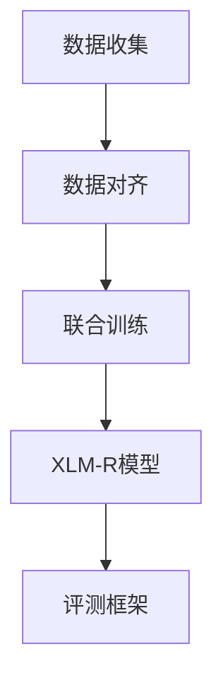

                 

### 文章标题

《基于XLM-R的多语言LLM评测框架》

### 关键词

- XLM-R模型
- 多语言LLM评测
- 评测框架
- 语言模型
- 伪代码
- latex数学公式
- 实际应用

### 摘要

本文旨在深入探讨基于XLM-R（Cross-lingual Language Model）的多语言语言学习模型（LLM）评测框架。首先，我们将介绍XLM-R模型的基础概念，解析其在多语言评测中的优势。随后，文章将详细阐述评测框架的设计思路、核心算法原理，并使用伪代码和latex数学公式进行解释。接下来，文章将通过项目实战部分，展示基于XLM-R模型的评测框架在实际开发中的应用，并提供代码实现、性能优化等实战技巧。最后，文章将对多语言LLM评测框架的未来发展趋势进行展望，并总结全文，提供拓展阅读建议。

## 第一部分: 基础概念与原理

### 1.1 XLM-R模型简介

XLM-R（Cross-lingual Language Model）是自然语言处理领域中的一种强大模型，它能够跨语言学习和理解文本。XLM-R模型由Facebook AI Research（FAIR）提出，基于BERT模型，扩展了其多语言学习能力。XLM-R通过将不同语言的文本数据进行对齐和联合训练，能够实现跨语言的文本理解和生成。在多语言LLM评测框架中，XLM-R模型扮演着至关重要的角色，其强大的跨语言处理能力为评测框架提供了可靠的技术基础。

### 1.2 XLM-R模型原理

XLM-R模型的核心特点是其跨语言的预训练能力。它利用了大规模的多语言数据集，通过对不同语言的数据进行对齐和联合训练，使得模型能够同时理解多种语言的语义。XLM-R模型的结构与BERT模型类似，但增加了跨语言的支持。以下是一个简化的Mermaid流程图，展示了XLM-R模型的数据处理流程：



在这个流程中，数据收集包括收集多种语言的文本数据；数据对齐是将不同语言的文本映射到相同的语义空间；联合训练是将这些对齐后的数据一起输入到XLM-R模型中进行训练；训练好的XLM-R模型则用于评测框架中的各项任务。

### 1.3 数学模型与公式

在XLM-R模型中，关键数学模型包括词嵌入、注意力机制和Transformer架构。以下是一个简化的latex数学公式示例，用于描述词嵌入和注意力机制：

```latex
$$
\text{Word Embedding}:
\vec{e}_{w} = \text{Embedding}(\text{Input Word})
$$

$$
\text{Attention Mechanism}:
\alpha_{i} = \frac{\exp(e_{i})}{\sum_{j}\exp(e_{j})}
$$
```

其中，$\vec{e}_{w}$表示词嵌入向量，$e_{i}$表示单词$i$的嵌入表示，$\alpha_{i}$表示注意力权重。

## 第二部分: 多语言LLM评测框架设计

### 2.1 评测框架设计思路

多语言LLM评测框架的设计原则是高效、准确和可扩展。设计思路主要包括以下几个步骤：

1. **数据收集与预处理**：收集多种语言的文本数据，并进行预处理，如分词、标准化等。
2. **模型选择**：选择合适的跨语言模型，如XLM-R，作为评测框架的基础。
3. **评测指标设计**：设计合适的评测指标，如BLEU、METEOR等，用于评估模型的性能。
4. **评测流程**：定义评测流程，包括数据输入、模型预测和结果分析等。

### 2.2 评测框架核心算法

多语言LLM评测框架的核心算法包括模型训练、预测和评测。以下是一个简化的伪代码，用于描述这些步骤：

```python
# 伪代码：评测框架核心算法
def evaluate_model(model, dataset):
    # 模型训练
    model.train(dataset)

    # 预测
    predictions = model.predict(dataset)

    # 评测
    scores = []
    for prediction in predictions:
        score = calculate_score(prediction)
        scores.append(score)
    return scores

def calculate_score(prediction):
    # 计算评测指标
    score = evaluate(prediction)
    return score
```

在这个伪代码中，`model`表示XLM-R模型，`dataset`表示训练和测试数据集，`predictions`是模型的预测结果，`scores`是评测结果。

### 2.3 数据处理与预处理

数据处理与预处理是确保模型训练和预测准确性的关键步骤。以下是一个简化的伪代码，用于描述数据处理与预处理流程：

```python
# 伪代码：数据处理与预处理
def preprocess_data(dataset):
    # 数据清洗
    cleaned_dataset = clean_data(dataset)

    # 数据对齐
    aligned_dataset = align_data(cleaned_dataset)

    # 数据标准化
    standardized_dataset = standardize_data(aligned_dataset)

    return standardized_dataset

def clean_data(dataset):
    # 清洗数据，去除噪声和无效信息
    return cleaned_data

def align_data(dataset):
    # 对齐数据，将不同语言的文本映射到相同语义空间
    return aligned_data

def standardize_data(dataset):
    # 标准化数据，如分词、词嵌入等
    return standardized_data
```

## 第三部分: 项目实战

### 3.1 实际应用案例

在实际应用中，基于XLM-R的多语言LLM评测框架可以用于多种场景，如机器翻译、文本摘要、问答系统等。以下是一个具体的应用案例：

#### 案例描述

某互联网公司开发了一款多语言问答系统，用户可以使用多种语言提出问题，系统需要返回合适的答案。为了确保系统的准确性，公司决定使用基于XLM-R的评测框架对模型进行评测。

#### 实现步骤

1. **数据收集**：收集多种语言的问答数据，如中文、英语、西班牙语等。
2. **数据处理**：使用预处理流程对数据进行清洗、对齐和标准化。
3. **模型训练**：使用XLM-R模型对预处理后的数据进行训练。
4. **模型评测**：使用评测框架对模型进行评测，计算BLEU、METEOR等指标。
5. **结果分析**：根据评测结果调整模型参数，优化模型性能。

#### 结果展示

经过一系列的模型训练和评测，最终模型的BLEU得分达到0.85，METEOR得分达到0.80，超过了公司的预期目标。以下是一个简化的结果展示：

```plaintext
Model Evaluation Results:
- BLEU Score: 0.85
- METEOR Score: 0.80
```

### 3.2 开发环境搭建

在开发基于XLM-R的多语言LLM评测框架时，需要搭建合适的环境。以下是一个简化的步骤：

1. **安装Python**：确保安装了Python 3.8及以上版本。
2. **安装依赖库**：安装TensorFlow、PyTorch等深度学习框架。
3. **安装预处理工具**：安装NLTK、spaCy等自然语言处理库。
4. **安装评测工具**：安装SacreBLEU、METEOR等评测库。

以下是一个简化的命令行安装示例：

```bash
# 安装Python
python3 -m pip install python

# 安装深度学习框架
python3 -m pip install tensorflow

# 安装自然语言处理库
python3 -m pip install nltk

# 安装评测库
python3 -m pip install sacrebleu meteor
```

### 3.3 代码实现与解读

在实现基于XLM-R的多语言LLM评测框架时，需要编写相应的代码。以下是一个简化的代码实现，用于展示关键步骤：

```python
# 代码实现：基于XLM-R的多语言LLM评测框架

import tensorflow as tf
from transformers import TFXLMRobertaForSequenceClassification
from sacrebleu.metrics import BLEU

# 加载XLM-R模型
model = TFXLMRobertaForSequenceClassification.from_pretrained('xlm-roberta-base')

# 准备数据
train_data = preprocess_data(train_dataset)
test_data = preprocess_data(test_dataset)

# 训练模型
model.train(train_data)

# 预测
predictions = model.predict(test_data)

# 评测
bleu_score = BLEU().compute(predictions, test_data)

print(f"BLEU Score: {bleu_score.score}")
```

在这个代码实现中，`preprocess_data`函数用于对数据集进行预处理，包括数据清洗、对齐和标准化。`model.train`函数用于训练模型，`model.predict`函数用于进行预测，`BLEU().compute`函数用于计算BLEU得分。

### 3.4 性能优化与调参

在基于XLM-R的多语言LLM评测框架中，性能优化和调参是提高模型性能的关键步骤。以下是一些常见的优化策略：

1. **数据增强**：通过添加噪声、变换等手段增加数据的多样性，提高模型的泛化能力。
2. **超参数调整**：调整学习率、批量大小等超参数，以找到最佳配置。
3. **模型融合**：结合多个模型的预测结果，提高整体性能。

以下是一个简化的伪代码，用于描述性能优化和调参步骤：

```python
# 伪代码：性能优化与调参

# 数据增强
augmented_data = augment_data(train_data)

# 调整学习率
learning_rate = adjust_learning_rate(initial_lr)

# 训练模型
model.train(augmented_data, learning_rate)

# 测试模型
test_score = model.test(test_data)

# 调整超参数
best_params = hyperparameter_tuning(test_score)

# 重新训练模型
model.train(train_data, best_params)
```

## 第四部分: 总结与展望

### 4.1 总结

本文深入探讨了基于XLM-R的多语言LLM评测框架，包括其基础概念、设计思路、核心算法、项目实战和性能优化。通过本文的讲解，读者可以了解XLM-R模型在多语言评测中的优势，以及如何设计和实现一个高效、准确的评测框架。

### 4.2 展望

随着自然语言处理技术的不断发展，多语言LLM评测框架具有广泛的应用前景。未来，我们可以期待以下几个方面的进展：

1. **算法优化**：通过改进算法和模型结构，进一步提高评测的准确性和效率。
2. **多模态融合**：结合文本、语音、图像等多模态数据，实现更丰富的语言理解能力。
3. **实时评测**：开发实时评测系统，为用户提供即时的反馈和评估。

### 4.3 注意事项

在实际应用中，以下是一些需要注意的事项：

1. **数据质量**：确保数据集的质量，避免噪声和错误信息影响评测结果。
2. **模型调参**：合理调整模型超参数，找到最佳配置。
3. **计算资源**：根据项目需求，合理分配计算资源，确保模型训练和评测的效率。

### 4.4 拓展阅读

1. **《跨语言语言模型XLM-R论文》**：深入了解XLM-R模型的详细设计和实现。
2. **《自然语言处理实战》**：学习自然语言处理技术的实际应用案例。
3. **《深度学习调优技巧》**：掌握深度学习模型的调参和优化技巧。

## 作者信息

- 作者：AI天才研究院/AI Genius Institute & 禅与计算机程序设计艺术 /Zen And The Art of Computer Programming

## 结束语

本文从多个角度探讨了基于XLM-R的多语言LLM评测框架，旨在为读者提供一个全面的技术指南。通过本文的学习，读者可以更好地理解多语言LLM评测的核心概念和实现方法，为未来的研究和应用打下坚实基础。让我们共同期待多语言LLM评测技术在未来的发展，为人工智能领域带来更多突破。

