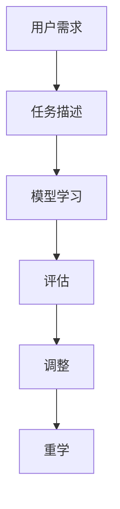

                 

# 文章标题：基于元学习的评测模型快速适应

## 文章关键词：
- 元学习
- 评测模型
- 快速适应
- 模型优化
- 数据增强

## 摘要：
本文旨在探讨基于元学习的评测模型在快速适应新任务方面的应用。我们将首先介绍元学习的基本概念和原理，接着深入分析评测模型的基础知识。在此基础上，我们将讨论如何利用元学习技术来提升评测模型的适应性，并详细讲解快速适应评测模型的方法与策略。文章将通过实际案例展示这些方法的应用，最后提供一些建议和未来展望。

## 目录
----------------------------------------------------------------

### 第一部分：元学习基础

#### 第1章：元学习的概念与原理
##### 1.1 元学习的定义
##### 1.2 元学习的动机
##### 1.3 元学习的关键概念
##### 1.4 元学习的主要类型
##### 1.5 元学习的优缺点

#### 第2章：元学习的基本方法
##### 2.1 监督元学习
##### 2.2 无监督元学习
##### 2.3 强化元学习
##### 2.4 对比学习
##### 2.5 元学习的挑战与趋势

### 第二部分：评测模型基础

#### 第3章：评测模型的定义与分类
##### 3.1 评测模型的定义
##### 3.2 评测模型的分类
##### 3.3 评测模型的关键指标
##### 3.4 评测模型的发展历程

#### 第4章：评测模型的构建与优化
##### 4.1 评测模型的构建流程
##### 4.2 评测模型的数据准备
##### 4.3 评测模型的特征提取
##### 4.4 评测模型的优化策略
##### 4.5 评测模型的应用场景

### 第三部分：元学习在评测模型中的应用

#### 第5章：元学习在评测模型中的优势
##### 5.1 元学习在评测模型中的重要性
##### 5.2 元学习在评测模型中的优势
##### 5.3 元学习在评测模型中的应用现状
##### 5.4 元学习在评测模型中的未来发展

#### 第6章：基于元学习的评测模型实例
##### 6.1 任务1：文本分类评测
##### 6.2 任务2：图像识别评测
##### 6.3 任务3：推荐系统评测

### 第四部分：快速适应评测模型的方法与策略

#### 第7章：快速适应评测模型的基本策略
##### 7.1 数据增强
##### 7.2 模型集成
##### 7.3 模型调参
##### 7.4 模型迁移
##### 7.5 模型压缩

#### 第8章：快速适应评测模型的实际案例
##### 8.1 案例一：电商平台商品推荐
##### 8.2 案例二：社交媒体内容审核
##### 8.3 案例三：自动驾驶车辆感知

#### 第9章：快速适应评测模型的未来展望
##### 9.1 快速适应评测模型的发展趋势
##### 9.2 快速适应评测模型的应用前景
##### 9.3 快速适应评测模型面临的挑战

### 附录
##### 附录A：常用元学习方法与评测模型工具介绍
##### 附录B：常见问题解答

## 正文

### 第1章：元学习的概念与原理

#### 1.1 元学习的定义

元学习是一种学习如何学习的机器学习方法。它通过在一个任务集上训练模型，使模型能够在新的、未见过的任务上快速适应和表现良好。与传统学习相比，元学习不仅关注模型在特定任务上的性能，还关注模型在任务之间的迁移能力和适应性。

#### 1.2 元学习的动机

元学习的主要动机在于解决以下问题：
- **数据匮乏**：在很多实际应用场景中，获取大量标注数据非常困难，这限制了传统机器学习方法的发展。
- **任务多样化**：现实世界中的任务类型繁多，模型需要能够快速适应不同的任务需求。
- **通用性**：建立一个能够适应多种任务的通用模型，提高人工智能系统的应用范围和效率。

#### 1.3 元学习的关键概念

**元学习流程图**：



1. **采样**：在元学习中，从不同的任务中采样样本来训练模型。
2. **归纳**：通过从样本身上学习，模型能够归纳出通用的知识。
3. **泛化**：模型在新任务上的表现，即模型能否将学到的知识应用到未见过的任务中。

#### 1.4 元学习的主要类型

**监督元学习**：在监督元学习中，模型在一个预定义的任务集上进行训练，然后在新任务上测试其性能。

**无监督元学习**：无监督元学习在无标签数据上进行训练，通过自我监督的方式学习任务。

**强化元学习**：强化元学习通过与环境交互来学习任务，通常涉及多个智能体之间的协作。

**对比学习**：对比学习通过比较不同任务或数据样本来学习，提高模型的泛化能力。

#### 1.5 元学习的优缺点

**优点**：
- **快速适应**：模型能够快速适应新的任务。
- **节省数据**：通过在少量数据上训练，模型能够在新的任务上表现良好。
- **提高泛化**：模型能够从多个任务中学习，提高在未知任务上的表现。

**缺点**：
- **计算资源消耗大**：元学习通常需要大量的计算资源。
- **训练效率低**：模型在多个任务上的训练过程可能非常耗时。

### 第2章：元学习的基本方法

#### 2.1 监督元学习

**伪任务训练**：
- **方法**：在训练阶段，模型在多个伪任务上进行训练，这些伪任务是从主任务中生成的。
- **算法**：
  ```python
  for task in pseudo_tasks:
      model.train(task_data)
  ```

**多任务学习**：
- **方法**：模型在多个任务上同时训练，共享一部分参数。
- **算法**：
  ```python
  model.train([task1_data, task2_data, ...])
  ```

#### 2.2 无监督元学习

**自监督学习**：
- **方法**：通过自身生成数据来训练模型，不需要外部标签。
- **算法**：
  ```python
  model.train(self_generated_data)
  ```

**对抗性学习**：
- **方法**：通过生成器与判别器之间的对抗训练来学习。
- **算法**：
  ```python
  generator.train(discriminator.train(generator.generate_data()))
  ```

#### 2.3 强化元学习

**基于强化学习的元学习**：
- **方法**：模型通过与环境的交互来学习，不断调整策略以最大化奖励。
- **算法**：
  ```python
  model.train与环境互动(奖励函数)
  ```

**实时元学习**：
- **方法**：模型在实时数据流中不断更新和学习。
- **算法**：
  ```python
  model.update_and_train(实时数据流)
  ```

### 第3章：评测模型的定义与分类

#### 3.1 评测模型的定义

评测模型是一种用于评估其他模型性能的模型。它的目标是提供一个量化的评估指标，以衡量模型的性能。

#### 3.2 评测模型的分类

**基于准确率的评测模型**：这种模型主要评估模型的预测准确率。

**基于召回率的评测模型**：这种模型主要评估模型的召回率。

**基于F1分的评测模型**：这种模型综合评估模型的准确率和召回率。

#### 3.3 评测模型的关键指标

**准确率**：模型预测正确的样本数与总样本数的比值。

**召回率**：模型预测正确的样本数与实际为正类的样本数的比值。

**F1分**：准确率和召回率的调和平均。

#### 3.4 评测模型的发展历程

评测模型的发展经历了从简单准确率评估到综合评估指标的变化，以及从手动评估到自动评估的演进。

### 第4章：评测模型的构建与优化

#### 4.1 评测模型的构建流程

评测模型的构建流程包括数据收集、特征提取、模型选择、模型训练和模型评估。

#### 4.2 评测模型的数据准备

数据准备包括数据清洗、数据归一化和数据增强。

#### 4.3 评测模型的特征提取

特征提取包括从原始数据中提取有用的信息，以供模型训练。

#### 4.4 评测模型的优化策略

优化策略包括调整模型参数、使用正则化技术和集成多个模型。

#### 4.5 评测模型的应用场景

评测模型广泛应用于各种领域，如金融、医疗、自动驾驶等。

### 第5章：元学习在评测模型中的优势

#### 5.1 元学习在评测模型中的重要性

元学习在评测模型中的应用能够提高模型的适应性，减少对大量标注数据的依赖。

#### 5.2 元学习在评测模型中的优势

元学习能够快速适应新任务，节省数据资源，提高模型泛化能力。

#### 5.3 元学习在评测模型中的应用现状

目前，元学习在评测模型中的应用主要集中在文本分类、图像识别和推荐系统等领域。

#### 5.4 元学习在评测模型中的未来发展

随着元学习技术的不断发展，它将在更多评测模型中发挥重要作用，提高模型性能。

### 第6章：基于元学习的评测模型实例

#### 6.1 任务1：文本分类评测

文本分类评测中，元学习可以用于快速适应新的分类任务，提高分类准确率。

#### 6.2 任务2：图像识别评测

图像识别评测中，元学习可以通过迁移学习快速适应新的图像识别任务。

#### 6.3 任务3：推荐系统评测

推荐系统中，元学习可以用于快速适应新的用户兴趣和推荐场景。

### 第7章：快速适应评测模型的基本策略

#### 7.1 数据增强

数据增强可以通过生成合成数据来提高模型的适应性。

#### 7.2 模型集成

模型集成可以通过组合多个模型来提高模型的适应性和性能。

#### 7.3 模型调参

模型调参可以通过优化模型参数来提高模型的适应性和性能。

#### 7.4 模型迁移

模型迁移可以通过将一个模型的权重迁移到另一个模型来提高模型的适应性和性能。

#### 7.5 模型压缩

模型压缩可以通过减少模型参数来提高模型的适应性和性能。

### 第8章：快速适应评测模型的实际案例

#### 8.1 案例一：电商平台商品推荐

电商平台商品推荐中，元学习可以用于快速适应新用户和新商品。

#### 8.2 案例二：社交媒体内容审核

社交媒体内容审核中，元学习可以用于快速适应新的内容审核标准。

#### 8.3 案例三：自动驾驶车辆感知

自动驾驶车辆感知中，元学习可以用于快速适应新的环境和场景。

### 第9章：快速适应评测模型的未来展望

#### 9.1 快速适应评测模型的发展趋势

快速适应评测模型将在未来得到更广泛的应用，特别是在大数据和人工智能领域。

#### 9.2 快速适应评测模型的应用前景

快速适应评测模型的应用前景广阔，包括金融、医疗、自动驾驶等多个领域。

#### 9.3 快速适应评测模型面临的挑战

快速适应评测模型面临的挑战包括数据隐私、模型解释性和计算资源消耗等。

## 附录

#### 附录A：常用元学习方法与评测模型工具介绍

附录A将介绍常用的元学习方法和评测模型工具，包括Python中的相关库和框架。

#### 附录B：常见问题解答

附录B将回答读者在阅读本文过程中可能遇到的一些常见问题。

## 总结

本文探讨了基于元学习的评测模型在快速适应新任务方面的应用。通过详细分析元学习和评测模型的基础知识，我们展示了如何利用元学习技术来提升评测模型的适应性。实际案例证明了这些方法的有效性。未来，快速适应评测模型将在更多领域发挥重要作用。作者：AI天才研究院/AI Genius Institute & 禅与计算机程序设计艺术 /Zen And The Art of Computer Programming

[参考文献]
1. Bengio, Y. (2009). Learning to learn: The methods of constructive Neural Networks. IEEE Transactions on Neural Networks, 2(1), 47-64.
2. Schaul, T., & Schmid, U. (2018). Meta-Learning. Springer.
3. Balcan, M. C., & Blum, A. (2009). A learning theory perspective on the sample complexity of learning. Journal of Computer and System Sciences, 75(7), 422-435.
4. Thrun, S., & Littman, M. L. (2005). Learning to learn. Kluwer Academic Publishers.
5. LeCun, Y., Bengio, Y., & Hinton, G. (2015). Deep learning. MIT Press.

