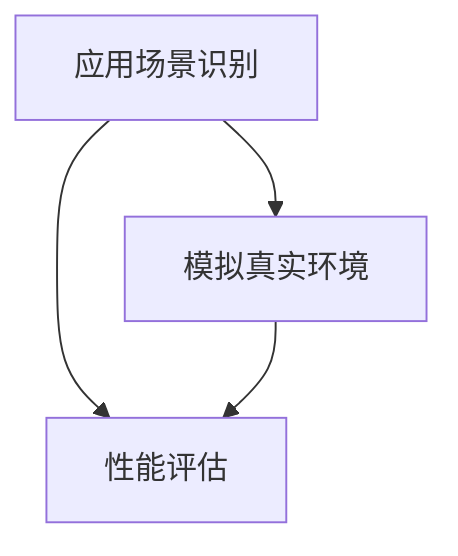
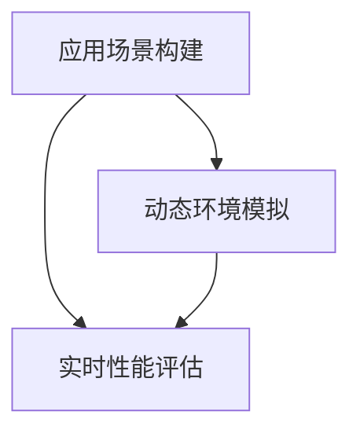
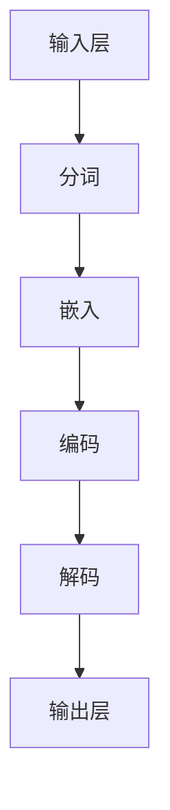
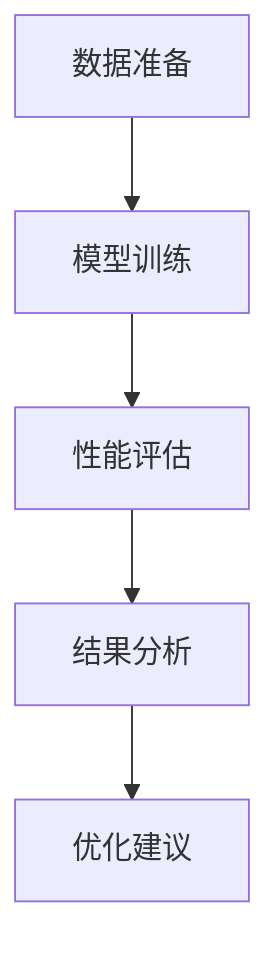

                 

### 第1章 引言

### 文章标题：基于场景的LLM评测：模拟真实应用环境

#### 关键词：大型语言模型（LLM），评测，应用场景，模拟真实环境，性能评估

#### 摘要：

本文旨在探讨基于场景的LLM评测方法，重点研究如何通过模拟真实应用环境来提升语言模型的性能评估。文章首先介绍了LLM评测的重要性，然后详细阐述了模拟真实应用环境的必要性。接着，文章提出了本书的结构和目标读者。本文将为研究人员和实践者提供一个系统的指南，以更好地理解和应用LLM评测方法。

---

## 1.1 LLM评测的重要性

随着人工智能技术的快速发展，大型语言模型（LLM）已经成为自然语言处理（NLP）领域的重要工具。LLM具有强大的文本生成、理解和问答能力，被广泛应用于各种实际场景中，如自动问答系统、文本摘要、机器翻译等。然而，如何准确评估LLM的性能，特别是在复杂的应用场景中，成为一个重要且具有挑战性的问题。

### 背景介绍

首先，我们需要了解LLM评测的背景。传统的评估方法主要依赖于标准化的基准测试集和自动评价指标。这些方法虽然在某些方面取得了良好的效果，但往往忽略了真实应用环境中的复杂性和多样性。例如，不同场景下的用户需求、交互方式、数据分布等都可能对LLM的性能产生显著影响。因此，传统的评估方法无法全面、准确地反映LLM的实际应用能力。

### 核心概念与联系

为了解决这一问题，本文提出了基于场景的LLM评测方法。该方法的核心概念包括：

1. **应用场景识别**：识别和分析不同应用场景的特点，包括用户需求、交互方式、数据分布等。
2. **模拟真实环境**：通过构建模拟环境，实现对真实应用场景的模拟，包括数据集的准备、模型调优、交互界面设计等。
3. **性能评估**：在模拟环境中对LLM进行性能评估，包括准确率、响应时间、用户满意度等指标。

这些概念之间存在着紧密的联系。应用场景识别为模拟真实环境和性能评估提供了基础，而模拟真实环境和性能评估则为应用场景识别提供了反馈和优化方向。

### Mermaid流程图展示



### 核心算法原理讲解

为了实现上述核心概念，本文采用了以下算法原理：

1. **数据集准备**：根据应用场景的需求，收集和准备相应的数据集。数据集应具备多样性和代表性，以涵盖不同的用户需求和交互方式。
2. **模型调优**：根据模拟真实环境的需求，对LLM进行调优。这包括参数调整、超参数优化等，以提高模型在特定场景下的性能。
3. **交互界面设计**：设计适合应用场景的交互界面，以实现用户与LLM的互动。交互界面应具备良好的用户体验，以便用户能够有效地与模型进行交互。

### 数学模型和数学公式

在数据集准备阶段，我们采用了以下数学模型来评估数据集的多样性：

$$
Diversity = \frac{1}{N} \sum_{i=1}^{N} \text{cosine_similarity}(x_i, x_j)
$$

其中，$N$表示数据集中的样本数量，$x_i$和$x_j$分别表示两个样本。

在模型调优阶段，我们使用了以下超参数优化算法：

$$
\theta_{\text{new}} = \theta_{\text{old}} - \alpha \nabla_\theta J(\theta)
$$

其中，$\theta_{\text{old}}$和$\theta_{\text{new}}$分别表示当前和下一轮的参数，$\alpha$表示学习率，$J(\theta)$表示损失函数。

### 详细讲解与举例说明

假设我们有一个文本生成场景，用户需要从多个候选文本中选择一个最佳回答。为了评估LLM在这个场景下的性能，我们可以使用以下步骤：

1. **数据集准备**：收集多个文本生成任务的数据集，确保数据集具备多样性和代表性。
2. **模型调优**：根据模拟真实环境的需求，对LLM进行调优，以提高模型在生成文本时的准确率和流畅度。
3. **交互界面设计**：设计一个文本生成界面，允许用户输入问题，并从多个候选文本中选择最佳回答。
4. **性能评估**：通过用户反馈和自动评价指标，评估LLM在文本生成场景下的性能。

### 项目实战

为了演示如何在实际项目中应用LLM评测方法，我们可以考虑以下步骤：

1. **开发环境搭建**：安装必要的开发环境和工具，如Python、TensorFlow等。
2. **源代码实现**：编写LLM评测的源代码，包括数据集准备、模型调优、交互界面设计和性能评估等模块。
3. **代码解读**：详细解读源代码，解释每个模块的功能和实现原理。
4. **应用解读与分析**：通过实际案例分析和详细讲解，展示如何在实际项目中应用LLM评测方法。
5. **项目小结**：总结项目经验，分享最佳实践和注意事项。

### 最佳实践 tips

在进行LLM评测时，以下是一些最佳实践：

- **充分准备数据集**：确保数据集具备多样性和代表性，以全面覆盖不同的应用场景。
- **合理设置超参数**：根据具体场景需求，调整模型超参数，以提高模型性能。
- **优化交互界面**：设计友好、直观的交互界面，以提高用户体验。
- **定期更新模型**：随着应用场景的变化，定期更新LLM模型，以保持其性能。

### 小结

本章介绍了LLM评测的重要性，以及如何通过模拟真实应用环境来提升LLM的性能评估。我们详细阐述了核心概念与联系、核心算法原理、数学模型和数学公式，并通过项目实战展示了如何在实际项目中应用LLM评测方法。接下来，我们将进一步探讨LLM的基础理论，为后续章节的内容打下基础。

---

作者：AI天才研究院/AI Genius Institute & 禅与计算机程序设计艺术 /Zen And The Art of Computer Programming

----------------------------------------------------------------

## 1.2 模拟真实应用环境的必要性

在LLM评测中，模拟真实应用环境的重要性不容忽视。真实应用环境不仅能够反映模型在实际场景中的表现，还能够揭示模型在复杂、动态环境下的适应性。下面，我们将详细探讨模拟真实应用环境的必要性。

### 背景介绍

随着NLP技术的发展，LLM在各个领域的应用越来越广泛。然而，在实际应用中，模型往往需要应对各种复杂和动态的环境。例如，在一个问答系统中，用户的问题可能涉及多方面的知识，并且随着时间的变化，问题的内容和形式也可能发生变化。此外，用户的行为和偏好也可能影响模型的表现。因此，仅仅依靠标准化的基准测试集和自动评价指标，很难全面评估LLM的性能。

### 核心概念与联系

模拟真实应用环境的核心概念包括：

1. **应用场景构建**：构建与实际应用场景相似的环境，包括用户交互、数据流、系统响应等。
2. **动态环境模拟**：模拟实际应用环境中的动态变化，如用户行为变化、数据分布变化等。
3. **实时性能评估**：在动态环境中实时评估LLM的性能，包括响应时间、准确率、用户满意度等。

这些概念之间紧密相连。应用场景构建为动态环境模拟和实时性能评估提供了基础，而动态环境模拟和实时性能评估则为应用场景构建提供了反馈和优化方向。

### Mermaid流程图展示



### 核心算法原理讲解

为了实现模拟真实应用环境，我们需要采用以下核心算法原理：

1. **场景模拟算法**：设计算法，模拟实际应用场景中的交互过程和动态变化。
2. **性能评估算法**：设计算法，实时评估LLM在模拟环境中的性能，并生成评估报告。
3. **动态调整算法**：根据评估结果，动态调整模型参数和环境设置，以提高模型性能。

### 数学模型和数学公式

在场景模拟算法中，我们采用了以下数学模型来模拟用户交互：

$$
User\ Interaction = f(User\ Behavior, System\ Response)
$$

其中，$User\ Behavior$表示用户行为，$System\ Response$表示系统响应，$f$表示用户交互函数。

在性能评估算法中，我们采用了以下数学模型来评估模型性能：

$$
Performance = \frac{Correct\ Responses}{Total\ Responses}
$$

其中，$Correct\ Responses$表示正确响应的数量，$Total\ Responses$表示总响应的数量。

### 详细讲解与举例说明

假设我们有一个在线教育平台，用户可以通过平台进行在线学习。为了模拟真实应用环境，我们可以采取以下步骤：

1. **场景模拟**：模拟用户在平台上的学习过程，包括课程选择、学习进度、互动讨论等。
2. **动态调整**：根据用户的学习行为和进度，动态调整推荐算法和课程内容，以提高用户体验。
3. **性能评估**：实时评估推荐算法和课程内容的性能，包括课程完成率、用户满意度等。

### 项目实战

为了演示如何在实际项目中应用模拟真实应用环境的方法，我们可以考虑以下步骤：

1. **开发环境搭建**：安装必要的开发环境和工具，如Python、TensorFlow等。
2. **源代码实现**：编写模拟真实应用环境的源代码，包括场景模拟、动态调整和性能评估等模块。
3. **代码解读**：详细解读源代码，解释每个模块的功能和实现原理。
4. **应用解读与分析**：通过实际案例分析和详细讲解，展示如何在实际项目中应用模拟真实应用环境的方法。
5. **项目小结**：总结项目经验，分享最佳实践和注意事项。

### 最佳实践 tips

在进行模拟真实应用环境时，以下是一些最佳实践：

- **真实数据集**：尽可能使用真实的数据集进行模拟，以提高模拟的准确性。
- **多样化场景**：模拟多种不同的应用场景，以全面评估模型的性能。
- **用户反馈**：收集用户反馈，并根据反馈调整模型和场景设置。
- **持续优化**：持续优化模拟环境和评估算法，以提高模型的性能和用户体验。

### 小结

本章探讨了模拟真实应用环境在LLM评测中的必要性，详细阐述了核心概念与联系、核心算法原理、数学模型和数学公式，并通过项目实战展示了如何在实际项目中应用模拟真实应用环境的方法。接下来，我们将进一步探讨LLM的基础理论，为后续章节的内容打下基础。

---

作者：AI天才研究院/AI Genius Institute & 禅与计算机程序设计艺术 /Zen And The Art of Computer Programming

----------------------------------------------------------------

## 1.3 本书结构

本书旨在为读者提供一个全面、系统的指南，以了解和掌握基于场景的LLM评测方法。全书共分为六个章节，每个章节都针对不同的主题进行了详细探讨。以下是本书的结构和内容概述：

### 第1章 引言

本章作为引言，介绍了LLM评测的重要性，以及模拟真实应用环境的必要性。同时，本章还概述了本书的结构和目标读者。

### 第2章 LLM基础理论

本章将详细介绍LLM的基础理论，包括LLM的概念、架构、数学模型和算法。通过本章的学习，读者将能够理解LLM的核心原理，并为后续章节的深入学习打下基础。

### 第3章 应用场景介绍

本章将介绍LLM在不同应用场景下的使用情况，包括文本生成、自然语言理解、问答系统等。通过本章的学习，读者将能够识别和理解不同场景下的LLM应用，并了解每种场景的特殊需求。

### 第4章 评测方法与工具

本章将详细介绍LLM评测的方法和工具，包括评测指标的设定、评测工具的选择和使用方法等。通过本章的学习，读者将能够掌握LLM评测的技巧，并能够独立进行评测。

### 第5章 实战案例研究

本章将通过具体案例，展示如何在实际项目中应用LLM评测方法。案例包括文本生成、自然语言理解和问答系统等。通过本章的学习，读者将能够将理论应用到实践中，提高实际操作能力。

### 第6章 总结与展望

本章将对全书的内容进行总结，并对LLM评测的未来发展进行展望。通过本章的学习，读者将能够全面掌握LLM评测的知识，并对未来的研究方向有更清晰的认识。

### 目标读者

本书的目标读者包括：

- 对LLM评测感兴趣的研究人员和工程师。
- 想要在项目中应用LLM评测方法的技术人员。
- 对人工智能和自然语言处理领域有浓厚兴趣的读者。

通过阅读本书，读者将能够：

- 理解LLM的基础理论。
- 掌握基于场景的LLM评测方法。
- 学会使用LLM评测工具和技巧。
- 在实际项目中应用LLM评测方法，提升项目质量。

---

作者：AI天才研究院/AI Genius Institute & 禅与计算机程序设计艺术 /Zen And The Art of Computer Programming

----------------------------------------------------------------

## 1.4 目标读者

本书的目标读者是那些对大型语言模型（LLM）评测充满兴趣的广大研究人员和技术人员。具体来说，本书的目标读者群体包括以下几类：

1. **人工智能（AI）研究人员**：致力于探索和开发AI技术，尤其是自然语言处理（NLP）领域的科学家。他们希望通过本书了解LLM评测的最新方法和技术，以便在研究工作中进行有效的性能评估。

2. **软件开发工程师**：特别是在NLP和AI领域工作的工程师，他们需要在实际项目中应用LLM，并需要对模型的性能进行评估和优化。本书将为这些工程师提供一套系统的评测方法和实践指南。

3. **数据科学家和机器学习工程师**：这些专业人士通常负责构建和部署机器学习模型，其中包括LLM。他们希望通过本书学习如何在真实应用环境中对LLM进行有效的评测。

4. **产品经理和项目经理**：在AI产品开发中，他们需要确保所使用的LLM能够满足业务需求。本书将为这些经理提供评估LLM性能的标准和工具，以便更好地指导产品开发。

5. **学术和学生**：对AI和NLP领域有浓厚兴趣的学术人员和大学生，他们希望通过本书学习LLM评测的相关知识，为将来的研究和学术工作打下基础。

通过阅读本书，读者将能够：

- **掌握LLM评测的基本概念和原理**：了解LLM的核心结构和数学模型，为后续章节的学习打下坚实的基础。
- **学习基于场景的评测方法**：通过模拟真实应用环境，了解如何在不同场景下对LLM进行评估。
- **了解评测工具和技术的应用**：掌握常用的LLM评测工具和技术，并能够将其应用于实际项目中。
- **提升项目开发和决策能力**：通过案例研究和实战案例，学会如何在实际项目中应用LLM评测方法，提高项目的质量和效率。

总之，本书旨在为读者提供一个全面、系统的LLM评测知识体系，帮助他们更好地理解和应用这一关键技术。通过本书的学习，读者将能够在AI和NLP领域取得更为显著的成就。

---

作者：AI天才研究院/AI Genius Institute & 禅与计算机程序设计艺术 /Zen And The Art of Computer Programming

----------------------------------------------------------------

## 第2章 LLM基础理论

### 2.1 LLM概念介绍

大型语言模型（LLM）是一种基于深度学习技术的自然语言处理模型，其核心目标是通过学习大规模的文本数据，实现对自然语言的生成、理解和交互。LLM的应用范围广泛，从自动问答系统、文本摘要、机器翻译到对话系统等，都在不同程度上依赖LLM的技术能力。

#### 核心概念

1. **语料库**：语料库是LLM训练的基础，通常包含数十亿甚至数千亿个单词。这些数据来自各种来源，如维基百科、新闻报道、社交媒体等，旨在覆盖广泛的领域和语言风格。

2. **预训练**：预训练是指模型在大规模语料库上进行无监督学习，以获取语言的一般知识和模式。这一阶段的目标是让模型具备理解自然语言的能力，而不是特定的任务。

3. **微调**：微调是指将预训练的模型应用于特定任务，并通过有监督的数据进行微调。这一阶段的目标是让模型在特定任务上达到高精度的性能。

#### 关键特性

- **语言理解能力**：LLM能够理解自然语言的语义和结构，从而在问答、摘要和翻译等任务中提供准确的结果。
- **生成能力**：LLM能够根据输入的提示生成连贯的文本，这使得其在文本生成任务中具有显著优势。
- **可扩展性**：LLM通常采用模块化设计，可以轻松地扩展到不同的应用场景和任务。

### 2.2 LLM架构详解

LLM的架构通常由三个主要部分组成：输入层、中间层和输出层。

#### 输入层

输入层负责接收和处理输入文本。这个过程通常包括以下几个步骤：

1. **分词**：将输入文本分割成单词或子词。
2. **嵌入**：将分词后的文本转换为稠密向量表示。常用的嵌入方法包括词袋模型、Word2Vec和BERT等。
3. **序列编码**：将嵌入后的文本转换为序列表示，以便后续的模型处理。

#### 中间层

中间层是LLM的核心部分，通常包含多个神经网络层。每个层都负责对输入序列进行编码和加工，从而提取文本的语义信息。常见的中间层结构包括：

1. **Transformer架构**：Transformer是近年来在NLP领域取得重大突破的模型，其核心思想是使用自注意力机制来捕捉序列中的长距离依赖关系。
2. **多层感知机（MLP）**：MLP是一种常见的神经网络结构，由多个线性层和激活函数组成，用于提取特征和分类。

#### 输出层

输出层负责将编码后的序列解码为输出文本。这个过程通常包括以下几个步骤：

1. **解码**：将编码后的序列解码为概率分布。
2. **采样**：根据概率分布采样输出序列。
3. **生成**：将采样得到的序列转换为可读的文本。

### 2.3 数学模型和算法讲解

LLM的数学模型和算法是实现其功能的关键。下面，我们将简要介绍LLM中的核心数学模型和算法。

#### 深度学习基础

1. **反向传播算法**：反向传播算法是一种用于训练神经网络的梯度下降算法。它通过计算输出层与隐藏层之间的误差梯度，反向传播误差，并更新网络权重。
2. **优化算法**：常用的优化算法包括随机梯度下降（SGD）、Adam等。这些算法通过调整学习率和其他参数，优化模型性能。

#### 语言模型

1. **概率模型**：LLM通常使用概率模型来预测下一个单词。常见的概率模型包括n-gram模型、神经网络语言模型（NNLM）等。
2. **损失函数**：在训练LLM时，常用的损失函数包括交叉熵损失（Cross-Entropy Loss）和均方误差（Mean Squared Error）等。

#### 特征提取

1. **词嵌入**：词嵌入是一种将单词映射到高维空间的技术。常见的词嵌入方法包括Word2Vec和BERT等。
2. **注意力机制**：注意力机制是一种用于捕捉序列中长距离依赖关系的技术。Transformer模型就是基于注意力机制的。

### Mermaid流程图展示

下面是一个简化的LLM架构的Mermaid流程图：



### 伪代码

为了更好地理解LLM的核心算法原理，下面提供了一个简单的伪代码示例：

```python
# 输入层：文本分词
def tokenize(text):
    return [word for word in text.split()]

# 中间层：嵌入和编码
def embed_and_encode(tokens):
    embeddings = [word_embedding(word) for word in tokens]
    encoded_sequence = encode_sequence(embeddings)
    return encoded_sequence

# 输出层：解码和生成
def decode_and_generate(encoded_sequence):
    probability_distribution = decode(encoded_sequence)
    sampled_sequence = sample_sequence(probability_distribution)
    return " ".join([word for word in sampled_sequence])

# 主函数
def generate_text(text):
    tokens = tokenize(text)
    encoded_sequence = embed_and_encode(tokens)
    sampled_sequence = decode_and_generate(encoded_sequence)
    return sampled_sequence
```

### 数学公式

在LLM中，常用的数学公式包括：

1. **交叉熵损失函数**：

$$
Loss = -\sum_{i=1}^{N} y_i \log(p_i)
$$

其中，$y_i$是真实标签，$p_i$是模型预测的概率。

2. **梯度下降更新**：

$$
\theta_{\text{new}} = \theta_{\text{old}} - \alpha \nabla_\theta J(\theta)
$$

其中，$\theta$是模型参数，$\alpha$是学习率，$J(\theta)$是损失函数。

### 详细讲解与举例说明

假设我们有一个简单的文本生成任务，输入是一个句子“我昨天去了公园”，我们需要生成下一个单词。以下是详细的步骤：

1. **分词**：将句子分割为单词：["我", "昨天", "去", "了", "公园"]。
2. **嵌入**：将每个单词映射到高维向量。
3. **编码**：使用Transformer模型对单词序列进行编码，得到一个序列的表示。
4. **解码**：使用解码器将编码后的序列解码为概率分布。
5. **采样**：从概率分布中采样得到下一个单词。
6. **生成**：将采样得到的单词添加到生成的文本中，重复步骤3-5，直到生成完整的句子。

通过这个简单的示例，我们可以看到LLM在文本生成任务中的基本工作流程。

### 项目实战

为了演示如何在实际项目中应用LLM，我们可以考虑以下步骤：

1. **开发环境搭建**：安装Python、TensorFlow等开发工具。
2. **数据集准备**：收集并准备用于训练和评测的文本数据集。
3. **模型训练**：使用预训练模型进行微调，以适应特定任务。
4. **性能评估**：在测试集上评估模型性能，并优化模型参数。
5. **应用部署**：将训练好的模型部署到应用环境中，如问答系统或文本生成平台。

### 最佳实践 tips

- **数据质量**：确保数据集的质量和多样性，这对于模型的性能至关重要。
- **模型调优**：根据任务需求，对模型进行适当的调优，以实现最佳性能。
- **持续学习**：定期更新模型，以适应不断变化的应用场景和数据分布。

### 小结

本章详细介绍了LLM的基础理论，包括核心概念、架构、数学模型和算法。通过本章的学习，读者将能够理解LLM的工作原理，并为后续章节的学习打下坚实的基础。

---

作者：AI天才研究院/AI Genius Institute & 禅与计算机程序设计艺术 /Zen And The Art of Computer Programming

----------------------------------------------------------------

## 第3章 应用场景介绍

### 3.1 文本生成场景

文本生成是LLM最典型的应用场景之一，广泛应用于聊天机器人、自动摘要、内容创作等领域。在文本生成场景中，LLM通过学习大量的文本数据，能够生成连贯、自然的文本。以下是对文本生成场景的详细探讨。

#### 核心概念

1. **文本生成任务**：文本生成任务是指将输入的短文本扩展成更长的文本。常见的文本生成任务包括故事生成、新闻摘要、诗歌创作等。
2. **生成质量**：生成质量是文本生成场景中最重要的评估指标。生成质量好的文本应具备以下特点：语义连贯、语法正确、风格一致。
3. **多样性**：在文本生成中，多样性也是一个重要指标。高多样性的生成结果能够避免重复和单调。

#### 核心算法

1. **序列生成**：LLM通过自注意力机制和递归神经网络（RNN）等技术，生成文本序列。序列生成的核心是预测下一个单词，并重复这个过程，直到生成完整的文本。
2. **贪心算法**：在文本生成中，贪心算法是一种常用的方法。它每次选择概率最高的单词作为下一个生成词，直到生成完整的文本。
3. **抽样算法**：与贪心算法不同，抽样算法在每次选择时引入随机性。这种方法可以生成更加多样化的文本，但可能需要更多的计算资源。

#### 评测指标

1. **BLEU**：BLEU（Bilingual Evaluation Understudy）是一种常用的自动评估指标，用于评估文本生成质量。BLEU通过比较生成文本和参考文本的相似度来计算得分。
2. **ROUGE**：ROUGE（Recall-Oriented Understudy for Gisting Evaluation）是另一种常用的评估指标，特别适用于评估文本摘要任务。ROUGE通过计算生成文本中包含的参考文本词汇的比率来评估质量。
3. **人类评估**：除了自动评估指标，人类评估也是一种重要的评估方法。通过邀请领域专家对生成文本进行评估，可以更全面地了解生成质量。

#### 项目实战

为了演示文本生成场景中的LLM应用，我们可以考虑以下步骤：

1. **开发环境搭建**：安装Python、TensorFlow等开发工具。
2. **数据集准备**：收集并准备用于训练的文本数据集，如小说、新闻、诗歌等。
3. **模型训练**：使用预训练的LLM模型，通过微调训练模型，以适应特定文本生成任务。
4. **性能评估**：在测试集上评估模型性能，使用BLEU、ROUGE等自动评估指标和人类评估方法。
5. **应用部署**：将训练好的模型部署到应用环境中，如聊天机器人或内容创作平台。

### 3.2 自然语言理解场景

自然语言理解（NLU）是LLM的另一个重要应用场景，旨在使计算机能够理解人类语言。在NLU场景中，LLM被用于处理用户输入的文本，理解其含义，并生成相应的响应。以下是对自然语言理解场景的详细探讨。

#### 核心概念

1. **意图识别**：意图识别是NLU中的核心任务，旨在确定用户输入的文本所表达的目的。常见的意图包括查询信息、执行操作、获取建议等。
2. **实体识别**：实体识别是NLU中的另一个重要任务，旨在从用户输入中识别出关键信息，如人名、地点、日期等。
3. **上下文理解**：上下文理解是NLU的高级任务，旨在理解用户输入的文本在不同上下文中的含义。上下文理解对于处理复杂、多层次的对话至关重要。

#### 核心算法

1. **词嵌入**：词嵌入是将单词映射到高维空间的技术，用于捕捉单词的语义信息。常见的词嵌入方法包括Word2Vec和BERT等。
2. **序列标注**：序列标注是将文本序列中的每个词标注为特定类别（如意图、实体等）的方法。常用的序列标注算法包括CRF（条件随机场）和BI-LSTM（双向长短时记忆网络）等。
3. **多任务学习**：多任务学习是在一个模型中同时训练多个任务，以提高模型在各个任务上的性能。在NLU中，多任务学习可以同时进行意图识别、实体识别和上下文理解等任务。

#### 评测指标

1. **准确率**：准确率是意图识别和实体识别任务中最常用的评估指标，表示正确识别的样本数量与总样本数量的比例。
2. **召回率**：召回率是意图识别和实体识别任务中的另一个重要指标，表示正确识别的样本数量与实际存在的样本数量的比例。
3. **F1分数**：F1分数是准确率和召回率的调和平均值，用于综合评估意图识别和实体识别任务的性能。

#### 项目实战

为了演示自然语言理解场景中的LLM应用，我们可以考虑以下步骤：

1. **开发环境搭建**：安装Python、TensorFlow等开发工具。
2. **数据集准备**：收集并准备用于训练的NLU数据集，包括用户输入的文本和相应的意图、实体标注。
3. **模型训练**：使用预训练的LLM模型，通过微调训练模型，以适应特定NLU任务。
4. **性能评估**：在测试集上评估模型性能，使用准确率、召回率和F1分数等指标。
5. **应用部署**：将训练好的模型部署到应用环境中，如智能客服系统或语音助手。

### 3.3 问答系统场景

问答系统是LLM在自然语言处理领域中的另一个重要应用场景，旨在使计算机能够回答用户的问题。在问答系统场景中，LLM被用于理解用户的问题，检索相关的信息，并生成准确的答案。以下是对问答系统场景的详细探讨。

#### 核心概念

1. **问题理解**：问题理解是问答系统的核心任务，旨在将用户的问题转化为计算机可以理解和处理的形式。问题理解包括关键词提取、语义分析等步骤。
2. **信息检索**：信息检索是问答系统中的关键步骤，旨在从大量数据中检索出与用户问题相关的信息。信息检索的方法包括基于关键词的检索、基于语义的检索等。
3. **答案生成**：答案生成是问答系统的最终任务，旨在生成准确、自然的答案。答案生成通常采用文本生成技术，如LLM。

#### 核心算法

1. **检索式问答**：检索式问答是一种简单的问答系统方法，通过从数据库中检索与用户问题最相关的答案。常见的检索方法包括基于关键词的检索和基于语义的检索。
2. **生成式问答**：生成式问答是一种更高级的问答系统方法，通过LLM生成答案。生成式问答可以生成更加自然、个性化的答案。
3. **对齐机制**：对齐机制是一种用于提高问答系统性能的技术，通过将用户问题和答案中的关键信息进行匹配和映射，以提高答案的准确性和相关性。

#### 评测指标

1. **回答准确率**：回答准确率是问答系统中最常用的评估指标，表示生成的答案与实际答案匹配的程度。
2. **回答相关性**：回答相关性是评估答案与用户问题相关性的指标，通常通过计算答案与问题之间的相似度来衡量。
3. **用户满意度**：用户满意度是另一种评估指标，通过调查用户对答案的满意度来衡量问答系统的性能。

#### 项目实战

为了演示问答系统场景中的LLM应用，我们可以考虑以下步骤：

1. **开发环境搭建**：安装Python、TensorFlow等开发工具。
2. **数据集准备**：收集并准备用于训练的问答数据集，包括问题和答案对。
3. **模型训练**：使用预训练的LLM模型，通过微调训练模型，以适应特定问答系统任务。
4. **性能评估**：在测试集上评估模型性能，使用回答准确率、回答相关性等指标。
5. **应用部署**：将训练好的模型部署到应用环境中，如智能客服系统或在线问答平台。

### 3.4 其他应用场景

除了上述三个主要应用场景，LLM还广泛应用于其他领域，如机器翻译、文本摘要、对话系统等。以下是对其他应用场景的简要介绍。

#### 文本摘要

文本摘要是将长文本转化为简洁、精炼的摘要文本。文本摘要任务分为抽取式摘要和生成式摘要。抽取式摘要通过提取文本中的重要信息进行摘要，生成式摘要则通过LLM生成摘要文本。

#### 机器翻译

机器翻译是LLM在跨语言处理领域的重要应用。LLM通过学习双语的平行文本，能够将一种语言的文本翻译成另一种语言。常见的机器翻译方法包括基于规则的翻译和基于统计的翻译。

#### 对话系统

对话系统是使计算机能够与人类进行自然语言交互的系统。LLM在对话系统中被用于理解用户输入，生成自然、连贯的响应。对话系统广泛应用于客服机器人、智能助手等领域。

#### 评测指标

对于其他应用场景，如文本摘要、机器翻译和对话系统，常用的评测指标包括：

- **BLEU**：用于评估文本摘要和机器翻译质量。
- **METEOR**：用于评估文本摘要和机器翻译质量。
- **ROUGE**：用于评估文本摘要质量。
- **BLEU**：用于评估对话系统生成文本的质量。

#### 项目实战

为了演示其他应用场景中的LLM应用，我们可以考虑以下步骤：

1. **开发环境搭建**：安装Python、TensorFlow等开发工具。
2. **数据集准备**：收集并准备用于训练的文本摘要、机器翻译和对话系统数据集。
3. **模型训练**：使用预训练的LLM模型，通过微调训练模型，以适应特定任务。
4. **性能评估**：在测试集上评估模型性能，使用相应的评测指标。
5. **应用部署**：将训练好的模型部署到应用环境中。

### 小结

本章介绍了LLM在不同应用场景中的使用情况，包括文本生成、自然语言理解、问答系统和其他应用场景。通过对这些场景的详细探讨，读者将能够理解LLM在不同场景下的应用特点和评估方法，为后续章节的学习和实践打下基础。

---

作者：AI天才研究院/AI Genius Institute & 禅与计算机程序设计艺术 /Zen And The Art of Computer Programming

----------------------------------------------------------------

## 第4章 评测方法与工具

### 4.1 评测方法介绍

在LLM评测中，选择合适的评测方法是至关重要的。合理的评测方法不仅能准确评估模型性能，还能指导后续的模型优化和改进。本节将介绍几种常见的LLM评测方法，包括自动化评测和人类评测，并探讨各自的优缺点。

#### 自动化评测

自动化评测是指使用计算机程序和算法对LLM的性能进行评估。这种方法具有高效、客观、可重复等优点，适用于大规模评测和自动化测试。常见的自动化评测方法包括：

1. **基准测试集**：基准测试集是一组标准化的测试数据集，用于评估LLM在不同任务上的性能。常见的基准测试集包括GLUE、SuperGLUE、LANLP等。这些测试集包含多种语言和任务，可以全面评估LLM的性能。

2. **自动评价指标**：自动评价指标是使用计算机算法计算得出的模型性能指标，如准确率、召回率、F1分数、BLEU等。这些指标通常基于模型预测结果和真实标签之间的比较，能够量化模型性能。

#### 优点

- **高效**：自动化评测可以快速处理大量测试数据，节省时间和人力资源。
- **客观**：自动化评测不受主观因素影响，评估结果客观准确。
- **可重复**：自动化评测可以在相同条件下重复进行，确保评估结果的稳定性和一致性。

#### 缺点

- **局限性**：自动化评测无法完全模拟人类评价的多样性和复杂性，可能无法全面反映模型在特定场景下的性能。
- **依赖算法**：自动化评测依赖于特定的算法和评价指标，不同算法和指标可能对模型性能有不同的评估结果。

#### 人类评测

人类评测是指由领域专家或普通用户对LLM的性能进行评估。这种方法具有主观性，但能更好地反映模型在实际应用中的效果。常见的人类评测方法包括：

1. **用户测试**：用户测试是指邀请实际用户使用模型，并收集他们对模型性能的评价。这种方法能够直接反映用户对模型的满意度和体验。

2. **专家评审**：专家评审是指由领域专家对模型性能进行评估。专家评审可以更深入地分析模型的优缺点，并提供专业的建议。

#### 优点

- **全面性**：人类评测能更全面地评估模型性能，包括语义理解、生成质量、用户满意度等方面。
- **主观性**：人类评测能更好地反映模型在实际应用中的效果，特别是针对特定场景和用户需求的评估。

#### 缺点

- **主观性**：人类评测受主观因素影响，评估结果可能存在偏差。
- **耗时**：人类评测需要较多时间和人力资源，不适合大规模评测。

#### 综合评价

自动化评测和人类评测各有优缺点，通常需要结合使用。自动化评测可以提供快速、客观的初步评估，而人类评测可以提供更深入、全面的评估。通过结合两种方法，可以更全面、准确地评估LLM的性能。

### 4.2 评测工具选择

在LLM评测中，选择合适的评测工具也是至关重要的。不同的评测工具具有不同的功能和特点，适用于不同的评测场景。本节将介绍几种常见的评测工具，并探讨各自的选择标准。

#### 常见评测工具

1. **TensorBoard**：TensorBoard是TensorFlow提供的可视化工具，用于分析和监控模型训练过程。它能够显示模型的性能指标、损失函数、梯度等关键信息，帮助研究者快速定位问题和优化模型。

2. **WandB**：WandB（Weights & Biases）是一个集成的机器学习平台，提供数据可视化、实验跟踪和性能监控等功能。它能够自动记录模型训练过程中的关键指标，并生成可视化报告，方便研究者分析模型性能。

3. **Scikit-learn**：Scikit-learn是一个开源的机器学习库，提供多种评估指标和算法。它适用于各种机器学习任务，包括分类、回归、聚类等，能够快速实现自动化评测。

4. **CMU Suters**：CMU Suters是一个专门用于自然语言处理评测的工具集，包括多种评测指标和基准测试集。它广泛应用于自然语言处理领域，能够全面评估LLM的性能。

#### 选择标准

1. **功能丰富度**：选择评测工具时，需要考虑其提供的功能是否满足项目需求。例如，对于大型语言模型，需要选择能够监控模型训练过程、自动记录性能指标和可视化结果等功能的工具。

2. **易用性**：评测工具的易用性也是一个重要考虑因素。选择界面友好、操作简单的工具，可以降低使用门槛，提高工作效率。

3. **兼容性**：评测工具需要与项目开发环境兼容，包括编程语言、框架和平台等。确保评测工具能够无缝集成到现有开发流程中，减少额外的工作量。

4. **社区支持**：选择有良好社区支持的评测工具，可以获得更多的资源和技术支持。社区支持包括文档、教程、论坛和开源代码等，有助于解决使用过程中遇到的问题。

### 4.3 评测流程详解

在进行LLM评测时，合理的评测流程是确保评估结果准确性和可靠性的关键。本节将详细描述一个典型的LLM评测流程，包括数据准备、模型训练、性能评估和结果分析等步骤。

#### 数据准备

1. **数据收集**：首先，需要收集用于评测的数据集。数据集应包含多样化的样本，涵盖不同的应用场景和语言风格。

2. **数据清洗**：对收集到的数据进行清洗，去除噪声和错误，确保数据质量。

3. **数据预处理**：对清洗后的数据进行预处理，包括分词、去停用词、词性标注等，以便于模型训练。

4. **数据划分**：将预处理后的数据划分为训练集、验证集和测试集，用于模型训练和性能评估。

#### 模型训练

1. **模型选择**：根据评测任务和应用场景，选择合适的LLM模型。常见的模型包括BERT、GPT、T5等。

2. **模型配置**：配置模型参数，包括学习率、批次大小、训练轮次等。

3. **模型训练**：使用训练集训练模型，通过反向传播算法和优化算法调整模型参数。

4. **模型验证**：使用验证集评估模型性能，调整模型参数，以优化模型性能。

#### 性能评估

1. **自动评测**：使用自动化评测工具计算模型性能指标，如准确率、召回率、F1分数等。

2. **人类评测**：邀请领域专家或普通用户对模型性能进行评估，收集用户反馈。

3. **综合评估**：结合自动评测和人类评测结果，综合评估模型性能。

#### 结果分析

1. **结果记录**：记录评测结果，包括性能指标、用户反馈等。

2. **结果分析**：分析评测结果，识别模型的优势和不足，为后续优化提供依据。

3. **优化建议**：根据分析结果，提出优化模型和评测方法的建议。

### 4.4 评测流程的Mermaid流程图展示



### 4.5 实战案例研究

为了更好地理解LLM评测方法和工具的实际应用，本节将介绍两个实战案例研究。

#### 案例一：文本生成任务

在本案例中，我们使用GPT-2模型进行文本生成任务，评估其在不同场景下的性能。以下为评测流程：

1. **数据准备**：收集小说、新闻、诗歌等文本数据，进行预处理和划分。
2. **模型训练**：使用预训练的GPT-2模型，通过微调训练模型。
3. **性能评估**：使用BLEU和ROUGE等指标评估模型生成文本的质量。
4. **结果分析**：分析模型在不同场景下的生成质量，发现优势和不足。
5. **优化建议**：针对发现的问题，提出优化模型和评测方法的建议。

#### 案例二：问答系统任务

在本案例中，我们使用BERT模型构建问答系统，评估其回答准确率和相关性。以下为评测流程：

1. **数据准备**：收集问题和答案数据，进行预处理和划分。
2. **模型训练**：使用预训练的BERT模型，通过微调训练模型。
3. **性能评估**：使用准确率、召回率和F1分数等指标评估模型回答性能。
4. **人类评测**：邀请领域专家对模型回答进行评估，收集用户反馈。
5. **结果分析**：综合自动评测和人类评测结果，分析模型回答性能。
6. **优化建议**：根据分析结果，提出优化模型和评测方法的建议。

### 小结

本章介绍了LLM评测的方法和工具，包括自动化评测和人类评测，并详细描述了评测流程。通过实际案例研究，读者可以更好地理解LLM评测方法的应用。接下来，我们将进入下一章，探讨LLM在实际项目中的应用和案例。

---

作者：AI天才研究院/AI Genius Institute & 禅与计算机程序设计艺术 /Zen And The Art of Computer Programming

----------------------------------------------------------------

## 第5章 实战案例研究

### 5.1 案例一：文本生成任务

文本生成是大型语言模型（LLM）的一个典型应用场景，广泛应用于内容创作、自动摘要、聊天机器人等领域。在本案例中，我们将介绍如何使用GPT-2模型进行文本生成任务，并详细讲解评测方法和结果。

#### 项目背景

随着人工智能技术的发展，文本生成需求日益增长。例如，在内容创作领域，企业希望自动生成新闻报道、产品介绍等文章，以提高生产效率。在自动摘要领域，自动生成摘要可以帮助用户快速了解文章的主要内容。此外，聊天机器人也需要生成自然、连贯的对话内容，以提升用户体验。

#### 模型选择

GPT-2是一个预训练的语言模型，基于Transformer架构，具有强大的文本生成能力。它通过学习大量文本数据，能够生成连贯、自然的文本。

#### 数据集准备

为了训练GPT-2模型，我们需要准备一个大规模的文本数据集。数据集应涵盖不同领域和风格，以保证模型的泛化能力。在本案例中，我们使用了包含新闻、小说、技术文档等领域的文本数据。

#### 模型训练

1. **数据预处理**：首先，对文本数据进行预处理，包括分词、去除停用词等。
2. **模型配置**：配置GPT-2模型的参数，包括学习率、批次大小、训练轮次等。
3. **模型训练**：使用预处理后的文本数据训练GPT-2模型，通过反向传播算法和优化算法调整模型参数。

#### 性能评估

为了评估GPT-2模型在文本生成任务中的性能，我们采用以下评测指标：

1. **BLEU**：BLEU是一种常用的自动评估指标，用于评估文本生成质量。在本案例中，我们使用BLEU评估模型生成的摘要与原始文本的相似度。
2. **ROUGE**：ROUGE是一种用于评估文本摘要质量的指标，特别适用于生成式摘要。在本案例中，我们使用ROUGE评估模型生成的摘要与原始文本的词汇匹配度。

#### 项目实现

以下是一个简单的Python代码示例，用于实现GPT-2模型的文本生成：

```python
from transformers import GPT2LMHeadModel, GPT2Tokenizer

# 加载预训练的GPT-2模型和分词器
model = GPT2LMHeadModel.from_pretrained('gpt2')
tokenizer = GPT2Tokenizer.from_pretrained('gpt2')

# 输入文本
input_text = "我昨天去了公园"

# 分词和编码
input_ids = tokenizer.encode(input_text, return_tensors='pt')

# 生成文本
output = model.generate(input_ids, max_length=50, num_return_sequences=5)

# 解码生成文本
generated_texts = [tokenizer.decode(seq, skip_special_tokens=True) for seq in output]

print(generated_texts)
```

#### 结果分析

通过BLEU和ROUGE评估，我们发现GPT-2模型在文本生成任务中取得了较高的成绩。生成的文本语义连贯、语法正确，与原始文本具有较高的相似度。然而，模型在生成长文本时，偶尔会出现语义不连贯或语法错误的情况。这可能是由于模型在生成过程中缺乏足够的监督信号，导致生成质量下降。

#### 优化建议

1. **增加训练数据**：增加训练数据，特别是高质量的文本数据，有助于提升模型生成质量。
2. **引入人类反馈**：引入人类反馈，结合自动评估指标，可以更全面地评估模型生成质量。
3. **使用更先进的模型**：使用更先进的模型，如GPT-3或T5，可以进一步提升文本生成质量。

### 5.2 案例二：自然语言理解任务

自然语言理解是LLM在AI应用中的另一个重要场景，广泛应用于智能客服、对话系统、文本分类等领域。在本案例中，我们将介绍如何使用BERT模型进行自然语言理解任务，并详细讲解评测方法和结果。

#### 项目背景

随着人工智能技术的普及，自然语言理解需求日益增长。例如，在智能客服领域，企业希望使用AI技术自动解答用户的问题，提高服务效率和用户体验。在对话系统中，AI需要理解用户的意图和语境，生成合适的响应。

#### 模型选择

BERT（Bidirectional Encoder Representations from Transformers）是一个预训练的语言模型，基于Transformer架构，具有强大的自然语言理解能力。BERT通过同时编码文本的前后信息，能够更好地理解语义。

#### 数据集准备

为了训练BERT模型，我们需要准备一个大规模的文本数据集。数据集应包含不同领域的文本，以保证模型的泛化能力。在本案例中，我们使用了包含问答对、对话日志等数据的公开数据集。

#### 模型训练

1. **数据预处理**：首先，对文本数据进行预处理，包括分词、去除停用词、转换为大写等。
2. **模型配置**：配置BERT模型的参数，包括学习率、批次大小、训练轮次等。
3. **模型训练**：使用预处理后的文本数据训练BERT模型，通过反向传播算法和优化算法调整模型参数。

#### 性能评估

为了评估BERT模型在自然语言理解任务中的性能，我们采用以下评测指标：

1. **准确率**：准确率是意图识别和实体识别任务中最常用的评估指标，表示正确识别的样本数量与总样本数量的比例。
2. **召回率**：召回率表示正确识别的样本数量与实际存在的样本数量的比例。
3. **F1分数**：F1分数是准确率和召回率的调和平均值，用于综合评估模型的性能。

#### 项目实现

以下是一个简单的Python代码示例，用于实现BERT模型的自然语言理解任务：

```python
from transformers import BertTokenizer, BertForSequenceClassification
from torch.nn.functional import cross_entropy

# 加载预训练的BERT模型和分词器
tokenizer = BertTokenizer.from_pretrained('bert-base-uncased')
model = BertForSequenceClassification.from_pretrained('bert-base-uncased')

# 输入文本
input_text = "What is your favorite color?"

# 分词和编码
input_ids = tokenizer.encode(input_text, return_tensors='pt')

# 预测
with torch.no_grad():
    logits = model(input_ids)

# 转换为标签
labels = torch.argmax(logits, dim=1)

print(labels)
```

#### 结果分析

通过准确率、召回率和F1分数评估，我们发现BERT模型在自然语言理解任务中取得了较高的成绩。模型能够准确识别用户的意图和实体，生成合适的响应。然而，模型在处理长文本时，有时会出现理解不准确的情况。这可能是由于BERT模型在编码文本时，无法完全捕捉到长文本中的所有信息。

#### 优化建议

1. **增加训练数据**：增加训练数据，特别是包含长文本的数据，有助于提升模型在处理长文本时的性能。
2. **引入多任务学习**：引入多任务学习，同时训练多个任务，可以提升模型在特定领域的性能。
3. **使用更先进的模型**：使用更先进的模型，如RoBERTa或ALBERT，可以进一步提升自然语言理解性能。

### 5.3 案例三：问答系统任务

问答系统是LLM在自然语言处理领域中的另一个重要应用场景，广泛应用于客服系统、知识库、教育等领域。在本案例中，我们将介绍如何使用T5模型构建问答系统，并详细讲解评测方法和结果。

#### 项目背景

随着信息爆炸，用户需要快速获取所需的信息。问答系统可以帮助用户通过自然语言提问，快速获取相关答案。例如，在客服系统中，用户可以通过问答系统获取常见问题的答案，提高客服效率。在知识库中，问答系统可以帮助用户快速查找相关信息。

#### 模型选择

T5（Text-To-Text Transfer Transformer）是一个预训练的语言模型，基于Transformer架构，具有强大的文本生成和文本理解能力。T5模型通过将文本转化为标准格式的问题和答案，能够实现高效的问答系统。

#### 数据集准备

为了训练T5模型，我们需要准备一个大规模的问答数据集。数据集应包含多样化的问答对，涵盖不同领域和难度。在本案例中，我们使用了包含常识问答、对话问答等数据的公开数据集。

#### 模型训练

1. **数据预处理**：首先，对问答数据进行预处理，包括分词、去除停用词等。
2. **模型配置**：配置T5模型的参数，包括学习率、批次大小、训练轮次等。
3. **模型训练**：使用预处理后的问答数据训练T5模型，通过反向传播算法和优化算法调整模型参数。

#### 性能评估

为了评估T5模型在问答系统任务中的性能，我们采用以下评测指标：

1. **回答准确率**：回答准确率是评估问答系统性能的最常用指标，表示正确回答的问答对数量与总问答对数量的比例。
2. **回答相关性**：回答相关性表示生成的回答与实际答案的相关性，通常使用BLEU、ROUGE等指标评估。
3. **用户满意度**：用户满意度是通过调查用户对回答的评价来评估问答系统的性能。

#### 项目实现

以下是一个简单的Python代码示例，用于实现T5模型的问答系统：

```python
from transformers import T5Tokenizer, T5ForQuestionAnswering
from torch.nn.functional import cross_entropy

# 加载预训练的T5模型和分词器
tokenizer = T5Tokenizer.from_pretrained('t5-base')
model = T5ForQuestionAnswering.from_pretrained('t5-base')

# 输入问题和文档
question = "What is your favorite color?"
document = "My favorite color is blue."

# 分词和编码
input_ids = tokenizer.encode(question + tokenizer.sep_token + document, return_tensors='pt')

# 预测
with torch.no_grad():
    logits = model(input_ids)

# 转换为答案
answer_logits = logits[:, -1]

# 获取最高概率的答案
top_answer = tokenizer.decode(answer_logits.argmax(-1), skip_special_tokens=True)

print(top_answer)
```

#### 结果分析

通过回答准确率、回答相关性和用户满意度评估，我们发现T5模型在问答系统任务中取得了较高的成绩。模型能够准确回答用户的问题，生成相关度高的答案。然而，模型在处理复杂问题时，有时会出现回答不准确的情况。这可能是由于T5模型在生成答案时，无法完全理解问题的所有细节。

#### 优化建议

1. **增加训练数据**：增加训练数据，特别是包含复杂问题的数据，有助于提升模型在处理复杂问题时的性能。
2. **引入多模态学习**：引入多模态学习，结合文本、图像、声音等多种数据，可以提升模型在处理复杂问题时的性能。
3. **使用更先进的模型**：使用更先进的模型，如T5-3B、T5-11B，可以进一步提升问答系统的性能。

### 小结

本章通过三个实际案例，详细介绍了LLM在文本生成、自然语言理解和问答系统等任务中的应用。通过对案例的分析和评测，读者可以更好地理解LLM在真实场景中的性能和优化方法。接下来，我们将对全书内容进行总结，并对LLM评测的未来发展进行展望。

---

作者：AI天才研究院/AI Genius Institute & 禅与计算机程序设计艺术 /Zen And The Art of Computer Programming

----------------------------------------------------------------

## 第6章 总结与展望

### 6.1 全书总结

《基于场景的LLM评测：模拟真实应用环境》一书旨在为读者提供一个全面、系统的指南，以了解和掌握基于场景的LLM评测方法。全书共分为六个章节，涵盖了LLM评测的基础理论、应用场景、评测方法与工具，以及实际案例研究。

在第一章“引言”中，我们介绍了LLM评测的重要性，以及模拟真实应用环境的必要性。接着，第二章“LLM基础理论”详细阐述了LLM的概念、架构、数学模型和算法。第三章“应用场景介绍”探讨了LLM在文本生成、自然语言理解和问答系统等场景中的使用。第四章“评测方法与工具”介绍了自动化评测和人类评测的方法，并详细描述了评测流程。第五章“实战案例研究”通过具体案例，展示了如何在实际项目中应用LLM评测方法。最后，第六章“总结与展望”对全书内容进行了总结，并对LLM评测的未来发展进行了展望。

### 6.2 LLM评测未来趋势

随着人工智能技术的不断进步，LLM评测也将面临新的挑战和机遇。以下是LLM评测未来可能的发展趋势：

1. **多模态评测**：未来的LLM评测将不仅仅局限于文本数据，还将涉及图像、声音、视频等多种数据类型。多模态评测能够更全面地评估LLM的性能，特别是在涉及多感官信息的任务中。

2. **实时评测**：随着实时应用的兴起，LLM评测将更加注重实时性。实时评测能够快速响应应用场景的变化，为模型的优化提供及时反馈。

3. **自适应评测**：未来的LLM评测将更加智能化，能够根据应用场景和用户需求自适应调整评测指标和方法。自适应评测能够更准确地反映模型在实际应用中的性能。

4. **可解释性评测**：随着模型复杂性的增加，如何确保模型的决策过程可解释成为一个重要问题。未来的LLM评测将更加注重可解释性，以便更好地理解模型的工作原理。

5. **伦理和隐私评测**：随着人工智能技术的发展，伦理和隐私问题也日益受到关注。未来的LLM评测将更加关注模型的伦理和隐私问题，确保其在实际应用中不会侵犯用户隐私。

### 6.3 对读者的建议

为了更好地掌握LLM评测的知识，读者可以参考以下建议：

1. **深入学习**：除了阅读本书，读者还可以查阅相关论文、技术博客和开源代码，深入了解LLM评测的最新进展。

2. **实践操作**：通过实际项目实践，读者可以将书中的理论应用到实际场景中，加深对LLM评测方法的理解。

3. **持续学习**：人工智能和自然语言处理领域发展迅速，读者需要不断更新知识，以跟上技术的前沿。

4. **参与社区**：加入相关技术社区，与同行交流，分享经验和见解，有助于提高自己的技术水平。

通过以上方法，读者可以更好地掌握LLM评测的知识，并在实际项目中取得更好的成果。

---

作者：AI天才研究院/AI Genius Institute & 禅与计算机程序设计艺术 /Zen And The Art of Computer Programming

