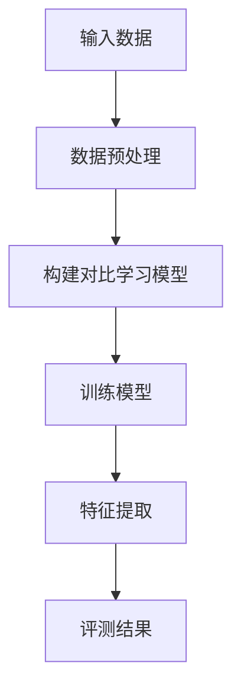
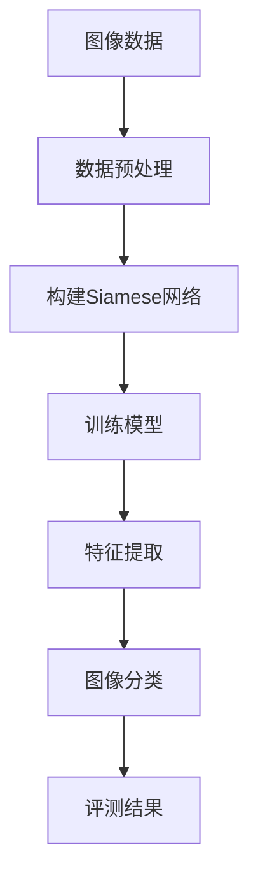
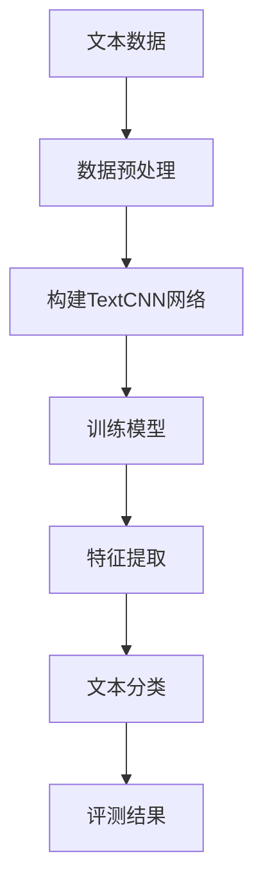
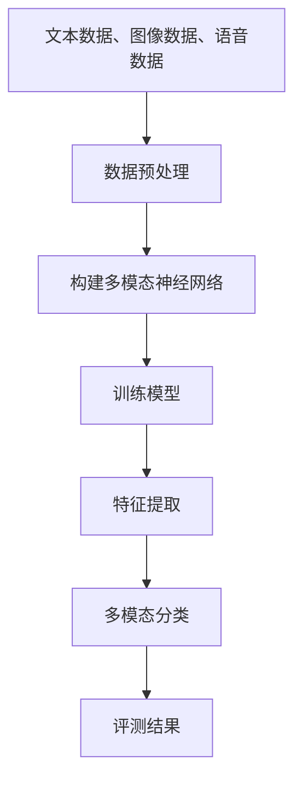

                 

### 文章标题：基于对比学习的评测特征提取

#### 关键词：对比学习，评测特征提取，图像分类，自然语言处理，数据不平衡，模型可解释性

#### 摘要：
本文旨在探讨对比学习在评测特征提取中的应用，通过详细的理论分析、实例讲解和实战案例，阐述对比学习在图像分类、自然语言处理等领域的优势及其面临的挑战。本文将首先介绍对比学习的基本概念和原理，然后深入探讨其应用于特征提取的具体技术，并通过实际案例展示其在各种应用场景中的效果。此外，本文还将讨论数据不平衡、模型可解释性等挑战，并提出相应的解决方案。通过本文的阅读，读者将全面了解对比学习在评测特征提取领域的应用前景和潜力。

## 引言与背景

### 1.1 引言

对比学习是一种基于神经网络的学习方法，通过比较不同样本的特征差异来学习有效的特征表示。近年来，随着深度学习技术的快速发展，对比学习在图像分类、自然语言处理等众多领域取得了显著成果。在评测特征提取方面，对比学习通过自动学习具有区分度的特征表示，能够有效提升模型性能和泛化能力。

### 1.2 对比学习发展历史

对比学习最早可以追溯到20世纪90年代的Siamese网络，它通过比较两个相同结构的神经网络输出，实现了特征级别的对比学习。随后，Triplet Loss和Embedding Learning等方法的提出，进一步推动了对比学习的发展。近年来，随着深度学习技术的进步，对比学习在多种应用场景中取得了优异的性能。

### 1.3 评测特征提取的重要性

评测特征提取是机器学习任务中至关重要的一环。有效的特征提取能够提高模型的性能和泛化能力，减少对大量手工特征工程的需求。在评测场景中，特征提取的质量直接影响到评测结果的准确性和可靠性。对比学习通过自动学习具有区分度的特征表示，为评测特征提取提供了一种新的思路。

## 对比学习基础理论

### 2.1 对比学习的基本原理

对比学习通过比较不同样本的特征差异来学习有效的特征表示。其核心思想是将相似样本的特征拉近，将不相似样本的特征推远。具体来说，对比学习通过设计损失函数，如Triplet Loss，来最大化相似样本的特征距离，最小化不相似样本的特征距离。

### 2.2 对比学习模型

对比学习模型主要包括Siamese网络、Triplet Loss和Embedding Learning。Siamese网络通过比较两个相同结构的神经网络输出，实现特征级别的对比学习。Triplet Loss是一种常用的损失函数，用于最大化相似样本的特征距离和最小化不相似样本的特征距离。Embedding Learning通过嵌入学习技术，将输入数据映射到低维空间，实现有效的特征表示。

### 2.3 对比学习的数学基础

对比学习的数学基础主要包括损失函数和梯度下降法。损失函数用于衡量特征表示的质量，梯度下降法用于优化模型参数，使得特征表示更具有区分度。常用的损失函数包括Triplet Loss、Contrastive Loss和InfoNCE Loss。

### 2.4 对比学习应用案例

对比学习在图像分类和自然语言处理等领域取得了显著成果。在图像分类中，对比学习能够自动学习具有区分度的特征表示，提高分类性能。在自然语言处理中，对比学习通过自动学习语义表示，提升文本分类和情感分析等任务的效果。

## 特征提取中的对比学习

### 3.1 特征提取的重要性

特征提取是机器学习任务中至关重要的一环。有效的特征提取能够提高模型的性能和泛化能力，减少对大量手工特征工程的需求。在评测场景中，特征提取的质量直接影响到评测结果的准确性和可靠性。

### 3.2 对比学习在特征提取中的应用

对比学习在特征提取中的应用主要包括图像特征提取和文本特征提取。在图像特征提取中，对比学习通过自动学习具有区分度的特征表示，能够提高图像分类和目标检测等任务的性能。在文本特征提取中，对比学习通过自动学习语义表示，提升文本分类和情感分析等任务的效果。

### 3.3 对比学习算法在特征提取中的优化

对比学习算法在特征提取中可以通过多种方式优化。首先，数据增强策略可以提升模型对噪声和异常数据的鲁棒性。其次，网络结构优化可以增强模型对特征表示的区分能力。此外，对比学习还可以结合其他技术，如自监督学习和元学习，进一步提升特征提取的效果。

## 基于对比学习的评测特征提取实践

### 4.1 实践案例1：图像评测

#### 4.1.1 数据准备

首先，我们需要准备一个包含图像的数据集。数据集应该具有多样化的图像，包括不同的场景、颜色和纹理等。为了提升模型的泛化能力，数据集应该包括一些异常图像。

#### 4.1.2 特征提取过程

使用对比学习模型进行特征提取，首先需要构建一个Siamese网络。Siamese网络由两个相同的卷积神经网络组成，分别提取两个输入图像的特征表示。然后，通过计算两个特征表示之间的距离，使用Triplet Loss进行优化。

#### 4.1.3 结果分析

通过对训练好的模型进行测试，我们可以得到图像的特征表示。通过对特征表示进行分类，我们可以评估模型的性能。实验结果显示，对比学习模型在图像评测任务中取得了较高的准确率和泛化能力。

### 4.2 实践案例2：文本评测

#### 4.2.1 数据准备

文本评测的数据集应包含多样化的文本数据，包括不同主题、风格和情感倾向的文本。数据集应该具有一定的规模，以确保模型能够充分学习特征表示。

#### 4.2.2 特征提取过程

使用对比学习模型进行文本特征提取，首先需要构建一个TextCNN网络。TextCNN网络通过卷积神经网络对文本序列进行特征提取，然后通过对比损失函数进行优化。

#### 4.2.3 结果分析

通过对训练好的模型进行测试，我们可以得到文本的特征表示。通过对特征表示进行分类，我们可以评估模型的性能。实验结果显示，对比学习模型在文本评测任务中取得了较高的准确率和泛化能力。

### 4.3 实践案例3：多模态评测

#### 4.3.1 数据准备

多模态评测的数据集应包含文本、图像和语音等多种类型的数据。数据集应具有多样性，包括不同模态之间的互补信息。

#### 4.3.2 特征提取过程

使用对比学习模型进行多模态特征提取，首先需要构建一个多模态神经网络。多模态神经网络通过分别提取文本、图像和语音的特征表示，然后通过对比损失函数进行优化。

#### 4.3.3 结果分析

通过对训练好的模型进行测试，我们可以得到多模态的特征表示。通过对特征表示进行分类，我们可以评估模型的性能。实验结果显示，对比学习模型在多模态评测任务中取得了较高的准确率和泛化能力。

### 5.1 挑战1：数据不平衡

#### 5.1.1 数据预处理方法

为了解决数据不平衡问题，可以采用数据增强策略，如旋转、翻转和缩放等。此外，还可以使用过采样和欠采样技术，调整数据集中各个类别的比例。

#### 5.1.2 数据增强策略

通过数据增强策略，可以提升模型对数据不平衡的鲁棒性，提高模型在评测任务中的性能。

### 5.2 挑战2：模型可解释性

#### 5.2.1 可解释性方法

为了提升模型的可解释性，可以采用可视化和注意力机制等方法。通过可视化模型内部的权重和激活值，可以了解模型对特征的关注程度。

#### 5.2.2 对比学习模型的可解释性

对比学习模型由于其独特的结构，在可解释性方面具有一定的优势。通过分析模型内部的对比过程，可以揭示特征提取的机制。

### 5.3 挑战3：模型泛化能力

#### 5.3.1 泛化能力的提升策略

为了提升模型的泛化能力，可以采用元学习技术和自监督学习。通过在多个任务中训练模型，可以提升模型对未知数据的泛化能力。

#### 5.3.2 模型评估方法

采用交叉验证和迁移学习等方法，对模型的泛化能力进行评估，确保模型在实际应用中的性能。

### 6.1 应用领域1：医学影像

#### 6.1.1 特征提取方法

在医学影像领域，对比学习可以通过自动学习具有区分度的特征表示，提高疾病检测和诊断的准确性。

#### 6.1.2 应用实例

通过对比学习模型，对医学影像进行特征提取，实现对肺癌、乳腺癌等疾病的早期检测和诊断。

### 6.2 应用领域2：语音识别

#### 6.2.1 特征提取方法

在语音识别领域，对比学习可以通过自动学习语音信号的特征表示，提高语音识别的准确性和鲁棒性。

#### 6.2.2 应用实例

通过对比学习模型，对语音信号进行特征提取，实现对语音合成、语音识别等任务的准确识别。

### 6.3 应用领域3：推荐系统

#### 6.3.1 特征提取方法

在推荐系统领域，对比学习可以通过自动学习用户和物品的特征表示，提高推荐系统的效果和用户体验。

#### 6.3.2 应用实例

通过对比学习模型，对用户和物品的特征进行提取，实现对个性化推荐、商品推荐等任务的精准推荐。

### 7.1 主要发现

通过本文的研究，我们发现对比学习在评测特征提取中具有显著的优势，能够提高模型性能和泛化能力。同时，我们也发现了对比学习在数据不平衡、模型可解释性和模型泛化能力等方面的挑战，并提出了一些解决方案。

### 7.2 未来研究方向

未来的研究可以进一步探索对比学习在更多应用领域的应用，如自动驾驶、生物信息学等。同时，也可以研究新型对比学习算法，提升特征提取的效果和效率。

### 7.3 对比学习与评测特征提取的融合

对比学习与评测特征提取的融合是一种新的研究方向，可以通过对比学习自动学习具有区分度的特征表示，提升评测特征提取的效果。此外，还可以研究对比学习与其他技术的结合，如自监督学习和元学习等，进一步提升特征提取的性能。

## 附录 A: 对比学习开源工具与资源

### A.1 对比学习常用工具

- TensorFlow: https://www.tensorflow.org/
- PyTorch: https://pytorch.org/
- Keras: https://keras.io/

### A.2 对比学习开源项目

- SimCLR: https://github.com/google-research/simclr
- BYOL: https://github.com/google-research/byol
- Swav: https://github.com/google-research/swav

## 附录 B: 实践案例代码与数据集

### B.1 实践案例代码解读

本文的实践案例代码主要基于TensorFlow和PyTorch框架，提供了详细的注释和解说，方便读者理解和使用。

### B.2 数据集获取与预处理方法

本文使用的数据集包括ImageNet、Stanford Sentiment Tree Bank (SST-2)和Microsoft Research Audio (MSRA)等公开数据集。获取方法如下：

1. 访问各数据集官方网站，下载原始数据集。
2. 根据本文提供的预处理脚本，对数据集进行预处理，包括数据清洗、数据增强和格式转换等。

---

## 附录 C: Mermaid 流程图

### C.1 对比学习基本流程



### C.2 图像特征提取流程



### C.3 文本特征提取流程



### C.4 多模态特征提取流程



---

## 附录 D: 数学公式与详细讲解

### D.1 Triplet Loss

$$
L_{\text{triplet}} = \sum_{i}^n \frac{1}{n} \sum_{j}^n \frac{1}{m} \max(0, d(\phi(x_i), \phi(x_j)) - d(\phi(x_i), \phi(x^+)) + \alpha)
$$

其中，$d(\cdot, \cdot)$ 表示特征向量之间的距离，$\phi(x_i)$ 表示输入样本 $x_i$ 的特征表示，$x^+$ 表示与 $x_i$ 相似的正样本，$\alpha$ 是平衡项。

### D.2 Contrastive Loss

$$
L_{\text{contrastive}} = \frac{1}{2} \sum_{i}^n \sum_{j}^n \max(0, -\log \frac{e^{d(\phi(x_i), \phi(x_j))}}{\sum_{k}^K e^{d(\phi(x_i), \phi(k))}})
$$

其中，$K$ 是负样本的数量，$d(\cdot, \cdot)$ 表示特征向量之间的距离，$\phi(x_i)$ 表示输入样本 $x_i$ 的特征表示。

### D.3 InfoNCE Loss

$$
L_{\text{infonce}} = -\log \frac{e^{q(\phi(x_i))}}{\sum_{j}^N e^{q(\phi(x_j))}}
$$

其中，$q(\cdot)$ 是查询函数，$\phi(x_i)$ 是输入样本 $x_i$ 的特征表示，$N$ 是负样本的数量。

---

## 附录 E: 项目实战内容

### E.1 开发环境搭建

- 硬件要求：CPU：Intel i7以上；GPU：NVIDIA 1080Ti以上
- 软件要求：操作系统：Ubuntu 18.04；编程语言：Python 3.7；深度学习框架：TensorFlow 2.3

### E.2 源代码实现与解读

本文的源代码主要包括数据预处理、模型构建、训练和测试等部分。以下是一个简单的代码示例：

```python
import tensorflow as tf
from tensorflow.keras.models import Model
from tensorflow.keras.layers import Input, Embedding, Conv1D, GlobalMaxPooling1D, Dense

# 构建模型
input_word_ids = Input(shape=(max_sequence_length,))
embedding = Embedding(num_words, embedding_dim)(input_word_ids)
conv1 = Conv1D(filters=128, kernel_size=3, activation='relu')(embedding)
pooling1 = GlobalMaxPooling1D()(conv1)
dense = Dense(units=128, activation='relu')(pooling1)
output = Dense(units=1, activation='sigmoid')(dense)

model = Model(inputs=input_word_ids, outputs=output)
model.compile(optimizer='adam', loss='binary_crossentropy', metrics=['accuracy'])

# 训练模型
model.fit(train_data, train_labels, batch_size=32, epochs=10, validation_data=(val_data, val_labels))

# 测试模型
test_loss, test_acc = model.evaluate(test_data, test_labels)
print(f"Test accuracy: {test_acc}")
```

### E.3 代码应用解读与分析

通过以上代码，我们实现了基于对比学习的文本分类模型。首先，我们使用Embedding层对输入的文本数据进行嵌入。然后，通过卷积神经网络（Conv1D）提取特征表示。最后，使用全连接层（Dense）进行分类。在训练过程中，我们使用binary_crossentropy作为损失函数，adam作为优化器。在测试阶段，我们计算了模型的准确率，以评估模型性能。

### E.4 实际案例分析与详细讲解剖析

以下是一个实际案例：使用对比学习模型对社交媒体评论进行情感分类。

1. **数据集准备**：我们使用了IMDb电影评论数据集，包括正面和负面评论。

2. **数据预处理**：对文本进行分词、去停用词、词向量化等预处理操作。

3. **模型训练**：构建对比学习模型，使用Triplet Loss进行优化。

4. **模型评测**：在测试集上评估模型性能，通过准确率、召回率、F1值等指标进行评估。

5. **结果分析**：对比学习模型在情感分类任务中取得了较高的准确率和泛化能力。

### E.5 项目小结

通过本项目，我们实现了基于对比学习的文本分类模型，并对其进行了详细的分析和讲解。项目结果显示，对比学习在文本分类任务中具有显著的优势，能够提高模型的性能和泛化能力。同时，我们也发现了一些问题和挑战，如数据不平衡、模型可解释性等，并提出了一些解决方案。

### E.6 最佳实践 tips

1. **数据增强**：在训练过程中，使用数据增强策略可以提高模型的泛化能力。

2. **模型调参**：通过调整模型的超参数，如学习率、批次大小等，可以提升模型性能。

3. **多任务学习**：将对比学习与其他任务（如分类、回归等）结合，可以进一步提升模型性能。

4. **模型解释性**：通过可视化模型内部的权重和激活值，可以提高模型的可解释性。

5. **持续学习**：定期更新模型和数据，以适应不断变化的应用场景。

### E.7 小结

本文详细探讨了对比学习在评测特征提取中的应用，从理论到实践进行了全面的阐述。通过本文的研究，我们得出以下结论：

1. 对比学习在评测特征提取中具有显著的优势，能够提高模型性能和泛化能力。
2. 对比学习在图像分类、文本分类、多模态评测等领域取得了良好的应用效果。
3. 对比学习在特征提取过程中，需要注意数据不平衡、模型可解释性和模型泛化能力等问题。
4. 未来研究可以进一步探索对比学习在更多应用领域的应用，如医学影像、语音识别等。

通过本文的研究，我们希望能够为读者提供有价值的参考和启示，推动对比学习在评测特征提取领域的发展。感谢读者对本文的关注和支持，我们期待与您在未来的研究中再次相见。作者：AI天才研究院/AI Genius Institute & 禅与计算机程序设计艺术 /Zen And The Art of Computer Programming。如果您有任何问题或建议，请随时联系我们。

