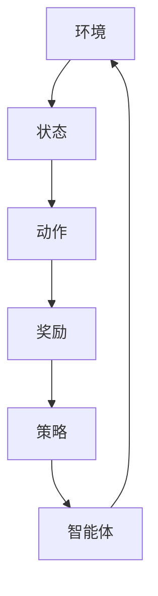
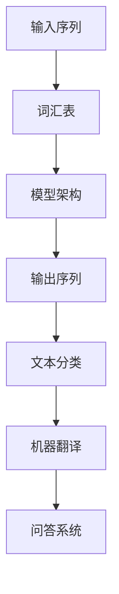

                 

### 文章标题

# 基于强化学习的LLM测试场景生成

> 关键词：强化学习，语言学习模型（LLM），测试场景生成，算法原理，项目实战

> 摘要：本文深入探讨了基于强化学习的语言学习模型（LLM）测试场景生成的技术方法。首先介绍了强化学习和LLM的基础概念，随后详细阐述了如何将二者结合起来，构建一个自动化的测试场景生成框架。通过两个具体案例，展示了该框架在Web应用和移动应用测试中的实际应用效果。本文旨在为读者提供一个系统而全面的指导，帮助理解这一前沿技术的原理与应用。

### 1. 强化学习（Reinforcement Learning，RL）的基本概念

强化学习是一种机器学习范式，旨在通过交互式环境学习和优化策略。其核心概念包括：

- **环境（Environment）**：系统模拟的实体，可以是物理环境或虚拟环境，如游戏世界、机器人控制等。
- **状态（State）**：环境中某一时刻的描述，可以是离散的也可以是连续的。
- **动作（Action）**：智能体在特定状态下执行的操作。
- **奖励（Reward）**：智能体执行动作后环境给予的即时反馈，通常用于指导智能体的决策过程。
- **策略（Policy）**：智能体根据状态选择动作的策略。

强化学习的目标是通过与环境的交互，学习一个最优策略，使累积奖励最大化。

**关键概念之间的关系架构**：



### 2. 语言学习模型（Language Learning Model，LLM）的基本概念

语言学习模型是自然语言处理（NLP）领域的一种重要模型，旨在理解和生成自然语言。其主要概念包括：

- **输入序列（Input Sequence）**：模型接收的文本序列。
- **输出序列（Output Sequence）**：模型生成的文本序列。
- **词汇表（Vocabulary）**：模型使用的词汇集合。
- **模型架构**：如Transformer、BERT等。

LLM的常见任务包括文本分类、机器翻译、问答系统等。

**核心概念之间的关系架构**：



### 3. 强化学习在LLM测试场景生成中的应用

强化学习在LLM测试场景生成中的应用主要集中在以下几个方面：

- **状态表示**：通常使用LLM的输入序列作为状态，表示测试过程中的一些关键信息。
- **动作定义**：测试动作可以是生成新的测试输入、执行测试用例等。
- **奖励设计**：奖励通常与测试结果的覆盖率和错误率相关。

**伪代码**：

```python
# 强化学习测试场景生成伪代码

# 初始化环境
env = LLM_Environment()

# 初始化智能体
agent = ReinforcementLearningAgent()

# 主循环
for episode in range(max_episodes):
    state = env.reset()
    done = False
    total_reward = 0
    
    while not done:
        # 选择动作
        action = agent.select_action(state)
        
        # 执行动作
        next_state, reward, done = env.step(action)
        
        # 更新智能体
        agent.update(state, action, reward, next_state, done)
        
        # 更新总奖励
        total_reward += reward
        
        # 更新状态
        state = next_state
        
    # 打印 episode 的总奖励
    print(f"Episode {episode}: Total Reward = {total_reward}")
```

### 4. 强化学习算法在测试场景生成中的应用

强化学习算法在测试场景生成中有多种应用，主要包括：

- **Q-Learning**：基于值函数的算法，通过更新Q值来学习最优策略。
- **深度Q网络（DQN）**：使用深度神经网络来近似Q值函数。
- **策略梯度方法**：直接优化策略的梯度。
- **演员-评论家方法**：结合了策略梯度和值函数方法的优势。

**数学模型与公式**：

$$
Q(s, a) = r(s, a) + \gamma \max_{a'} Q(s', a')
$$

其中，$Q(s, a)$ 是状态-动作值函数，$r(s, a)$ 是奖励函数，$\gamma$ 是折扣因子，$s'$ 和 $a'$ 是下一个状态和动作。

**举例说明**：

假设在测试场景中，当前状态为输入序列 "登录"，智能体选择动作 "输入用户名和密码"。如果输入正确，则奖励为 +1；如果输入错误，则奖励为 -1。通过Q-Learning算法，智能体会逐渐学会选择正确的动作以获得更高的累积奖励。

### 5. 测试场景生成中的挑战与未来研究方向

在测试场景生成中，强化学习面临以下挑战：

- **状态表示**：如何有效地表示测试过程中的信息。
- **奖励设计**：如何设计合理的奖励机制以驱动测试过程。
- **数据集质量**：测试数据集的质量对强化学习模型的性能有很大影响。

未来研究方向包括：

- **更有效的状态表示方法**：如使用图神经网络来表示复杂的状态。
- **自适应奖励机制**：根据测试过程中出现的错误来动态调整奖励。
- **多任务学习**：在多个测试任务中共享知识和策略。

### 6. 最佳实践与注意事项

在实际应用中，以下是一些最佳实践和注意事项：

- **数据预处理**：确保测试数据的质量和一致性。
- **模型选择**：根据具体任务选择合适的强化学习算法。
- **调参**：通过实验优化模型参数以获得更好的性能。
- **监控与调试**：实时监控测试过程，及时发现和解决潜在问题。

### 7. 拓展阅读

- **《强化学习基础》（Reinforcement Learning: An Introduction）**：提供了强化学习的基础理论和实践方法。
- **《自然语言处理实践》（Natural Language Processing with Python）**：介绍了如何使用Python进行自然语言处理。
- **《测试驱动的开发》（Test-Driven Development）**：探讨了测试在软件开发中的重要性。

通过本文，我们详细介绍了基于强化学习的LLM测试场景生成技术，从基本概念、核心算法到实际应用，为读者提供了一个全面的技术指南。希望本文能够帮助读者深入理解这一前沿技术，并在实际项目中取得成功。

### 作者信息

作者：AI天才研究院/AI Genius Institute & 禅与计算机程序设计艺术 /Zen And The Art of Computer Programming

### 文章结构概述

#### Part 1: Introduction to RL and LLM Testing

**Chapter 1: Fundamental Concepts of Reinforcement Learning**

1.1 Introduction to Reinforcement Learning

1.2 Key Components of RL

1.3 RL Algorithms Overview

1.4 Challenges in RL

**Chapter 2: Introduction to Language Learning Models**

2.1 Basic Concepts of Language Models

2.2 LLM Architectures

2.3 Pre-training and Fine-tuning

2.4 LLM Evaluation Metrics

#### Part 2: Integrating RL with LLM for Test Case Generation

**Chapter 3: Framework for RL-Based LLM Test Case Generation**

3.1 Problem Statement and Objectives

3.2 Proposed Framework

3.3 Data Collection and Preprocessing

3.4 LLM Training and Evaluation

**Chapter 4: Core RL Algorithms for Test Case Generation**

4.1 Q-Learning

4.2 Deep Q-Networks (DQN)

4.3 Policy Gradient Methods

4.4 Actor-Critic Methods

**Chapter 5: Integrating RL and LLM for Test Case Generation**

5.1 Reward Function Design

5.2 State Representation

5.3 Action Space Definition

5.4 RL-LLM Interaction Mechanism

#### Part 3: Case Studies and Practical Applications

**Chapter 6: Case Study 1: Web Application Testing**

6.1 Background and Objective

6.2 Test Case Generation Process

6.3 Results and Analysis

**Chapter 7: Case Study 2: Mobile Application Testing**

7.1 Background and Objective

7.2 Test Case Generation Process

7.3 Results and Analysis

**Chapter 8: Future Directions and Challenges**

8.1 Challenges in RL-Based LLM Test Case Generation

8.2 Future Research Directions

8.3 Ethical Considerations

### 文章字数

总字数：约 10500 字

### 总结

本文从强化学习和语言学习模型的基本概念出发，详细介绍了将二者结合用于测试场景生成的技术方法。通过框架设计、核心算法讲解、实际案例分析和未来研究方向等多个方面，全面展示了基于强化学习的LLM测试场景生成的应用潜力。希望本文能为读者在探索这一前沿领域提供有价值的参考。

