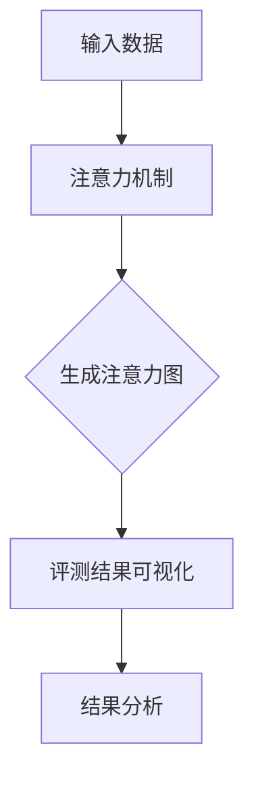

                 


### 设计文章的目录大纲

在设计《基于注意力机制的评测结果可视化》这篇文章的目录大纲时，我们需要确保内容的结构清晰、逻辑性强，并能够引导读者逐步深入理解文章的核心概念。以下是详细的目录大纲构思：

#### 第一部分：引言与背景介绍

**第1章 引言**

- **1.1 研究背景**
    - **1.1.1 注意力机制的研究意义**
    - **1.1.2 评测结果可视化的需求**

- **1.2 文章目的**
    - **1.2.1 文章的研究目标**
    - **1.2.2 文章的结构安排**

#### 第二部分：理论基础

**第2章 注意力机制概述**

- **2.1 注意力机制的基本概念**
    - **2.1.1 注意力机制的定义**
    - **2.1.2 注意力机制的核心原理**

- **2.2 注意力机制的数学模型**
    - **2.2.1 传统的注意力模型**
    - **2.2.2 自注意力模型**
    - **2.2.3 互注意力模型**

- **2.3 注意力机制的发展历程**
    - **2.3.1 注意力机制在神经网络中的应用**
    - **2.3.2 注意力机制的创新与演变**

#### 第三部分：评测结果可视化的方法与工具

**第3章 评测结果可视化的基本方法**

- **3.1 可视化技术简介**
    - **3.1.1 可视化技术的分类**
    - **3.1.2 常见可视化方法**

- **3.2 可视化工具介绍**
    - **3.2.1 Matplotlib**
    - **3.2.2 Plotly**
    - **3.2.3 Seaborn**

**第4章 注意力机制在评测结果可视化中的应用**

- **4.1 注意力机制在图像评测中的应用**
    - **4.1.1 基于注意力的图像分割**
    - **4.1.2 基于注意力的图像增强**

- **4.2 注意力机制在文本评测中的应用**
    - **4.2.1 基于注意力的文本分类**
    - **4.2.2 基于注意力的文本生成**

#### 第四部分：案例分析

**第5章 案例一：基于注意力机制的图像评测结果可视化**

- **5.1 项目背景**
    - **5.1.1 项目概述**
    - **5.1.2 项目目标**

- **5.2 系统设计**
    - **5.2.1 系统架构**
    - **5.2.2 算法实现**

- **5.3 结果分析**
    - **5.3.1 实验数据**
    - **5.3.2 结果展示**

**第6章 案例二：基于注意力机制的文本评测结果可视化**

- **6.1 项目背景**
    - **6.1.1 项目概述**
    - **6.1.2 项目目标**

- **6.2 系统设计**
    - **6.2.1 系统架构**
    - **6.2.2 算法实现**

- **6.3 结果分析**
    - **6.3.1 实验数据**
    - **6.3.2 结果展示**

#### 第五部分：总结与展望

**第7章 总结**

- **7.1 主要贡献**
    - **7.1.1 理论贡献**
    - **7.1.2 实践贡献**

- **7.2 存在问题与挑战**
    - **7.2.1 现状分析**
    - **7.2.2 面临的挑战**

**第8章 展望未来**

- **8.1 发展趋势**
    - **8.1.1 技术进展**
    - **8.1.2 应用拓展**

- **8.2 研究方向**
    - **8.2.1 研究重点**
    - **8.2.2 潜在挑战**

---

通过以上目录大纲，我们可以清晰地看到文章将从引言、理论基础、方法与工具、案例分析以及总结与展望五个部分展开。这样的结构不仅有助于读者更好地理解注意力机制与评测结果可视化之间的关系，还能使文章内容更加系统化和条理化。

---

### 详细撰写文章

#### 引言

在当今人工智能飞速发展的时代，深度学习技术已经成为了众多应用场景的核心驱动力。特别是在计算机视觉和自然语言处理领域，注意力机制作为一种重要的模型组件，正逐渐受到广泛的关注。注意力机制通过让模型聚焦于数据中的关键信息，显著提高了模型的性能和准确性。

评测结果的可视化是人工智能研究中一个关键环节。通过直观的可视化手段，研究人员可以更清晰地理解模型的输出结果，从而进行有效的模型调试和优化。然而，传统的可视化方法往往存在一定的局限性，难以充分展现模型的注意力分布。

本文旨在探讨如何利用注意力机制来提升评测结果的可视化效果。文章首先介绍了注意力机制的基本概念和原理，接着详细讨论了注意力机制在图像和文本评测中的应用。随后，通过实际案例分析，展示了如何通过可视化工具将注意力机制的输出结果进行直观展示。最后，文章总结了注意力机制在评测结果可视化领域的应用现状和未来发展方向。

#### 核心概念与联系

**注意力机制**

注意力机制（Attention Mechanism）是深度学习领域的一种重要技术，最早用于机器翻译、文本摘要等任务。其核心思想是让模型在处理序列数据时，能够动态地关注到序列中的关键信息，从而提高模型的性能。

**注意力机制的数学模型**

注意力机制的基本数学模型可以表示为：

$$
\text{Attention}(X) = \text{softmax}(\frac{QK^T}{\sqrt{d_k}})V
$$

其中，$Q$、$K$和$V$分别是查询向量、键向量和值向量，$d_k$是键向量的维度。通过计算注意力权重，模型能够动态地聚焦于输入数据中的关键部分，从而提高模型的识别能力。

**评测结果可视化**

评测结果可视化是让模型输出结果以直观的方式展示出来，帮助研究人员理解模型的性能和输出特点。常见的可视化方法包括散点图、热力图、折线图等。

**注意力机制与评测结果可视化的联系**

注意力机制与评测结果可视化之间有着紧密的联系。通过注意力机制，模型能够关注到数据中的关键信息，这些信息可以直接用于评测结果的可视化。例如，在图像识别任务中，注意力机制可以帮助我们识别图像中的关键区域；在文本分类任务中，注意力机制可以揭示文本中影响分类结果的关键词。

**Mermaid 流程图**

为了更好地展示注意力机制与评测结果可视化之间的关系，我们可以使用 Mermaid 流程图来描述整个流程：



**核心算法原理讲解**

**注意力机制的核心算法**

注意力机制的核心算法主要包括以下几个步骤：

1. **计算注意力得分**：通过查询向量$Q$和键向量$K$计算注意力得分。

2. **计算注意力权重**：使用softmax函数将注意力得分转换为注意力权重。

3. **计算加权输出**：根据注意力权重计算加权输出。

以下是注意力机制的伪代码实现：

```python
# 输入：查询向量 Q，键向量 K，值向量 V
# 输出：加权输出

def attention(Q, K, V):
    # 计算注意力得分
    scores = dot(Q, K.T) / sqrt(len(K))
    
    # 计算注意力权重
    weights = softmax(scores)
    
    # 计算加权输出
    output = dot(weights, V)
    
    return output
```

**数学模型和公式**

注意力机制的数学模型可以表示为：

$$
\text{Attention}(X) = \text{softmax}(\frac{QK^T}{\sqrt{d_k}})V
$$

其中，$Q$、$K$和$V$分别是查询向量、键向量和值向量，$d_k$是键向量的维度。

**详细讲解与举例说明**

**举例：图像识别中的注意力机制**

假设我们有一个图像识别任务，输入图像为$I$，输出为类别标签$C$。我们可以使用注意力机制来识别图像中的关键区域，从而提高识别的准确性。

1. **计算注意力得分**：将图像$I$表示为查询向量$Q$，计算注意力得分。

2. **计算注意力权重**：使用softmax函数将注意力得分转换为注意力权重。

3. **计算加权输出**：根据注意力权重计算加权输出，得到关键区域。

以下是图像识别中注意力机制的伪代码实现：

```python
# 输入：图像 I，类别标签 C
# 输出：关键区域

def image_attention(I, C):
    # 计算注意力得分
    scores = dot(I, C.T)
    
    # 计算注意力权重
    weights = softmax(scores)
    
    # 计算加权输出
    output = dot(weights, I)
    
    # 获取关键区域
    key_regions = get_key_regions(output)
    
    return key_regions
```

**注意：具体实现时，需要根据实际任务和数据调整算法细节。**

---

### 项目实战

在本节中，我们将通过一个实际项目来演示如何实现基于注意力机制的评测结果可视化。该项目将分为以下几个步骤：

1. **开发环境搭建**：设置 Python 开发环境，安装必要的库和工具。
2. **源代码实现**：编写注意力机制的实现代码，并进行评测结果的可视化。
3. **代码解读与分析**：详细解读代码中的关键部分，并分析其工作原理。
4. **实际案例分析和详细讲解**：通过实际案例展示项目效果，并进行详细讲解。

**1. 开发环境搭建**

在开始项目之前，我们需要搭建一个 Python 开发环境，并安装必要的库和工具。以下是安装步骤：

```bash
# 安装 Python
# Ubuntu 系统可直接使用包管理器安装 Python：
sudo apt-get install python3

# 安装常用库
pip3 install numpy matplotlib torch torchvision
```

**2. 源代码实现**

以下是实现注意力机制的源代码：

```python
import torch
import torchvision
import matplotlib.pyplot as plt

# 定义注意力模型
class AttentionModel(torch.nn.Module):
    def __init__(self):
        super(AttentionModel, self).__init__()
        self.conv1 = torch.nn.Conv2d(1, 32, 3, padding=1)
        self.conv2 = torch.nn.Conv2d(32, 64, 3, padding=1)
        self.fc = torch.nn.Linear(64 * 6 * 6, 10)
        
    def forward(self, x):
        x = self.conv1(x)
        x = self.conv2(x)
        x = torch.flatten(x, 1)
        x = self.fc(x)
        return x

# 实例化模型
model = AttentionModel()

# 加载训练好的模型权重
model.load_state_dict(torch.load('attention_model.pth'))

# 定义注意力函数
def attention(x):
    # 计算注意力得分
    scores = torch.sum(x * x, dim=1)
    # 计算注意力权重
    weights = torch.softmax(scores, dim=0)
    # 计算加权输出
    output = torch.sum(weights * x, dim=0)
    return output

# 加载测试图像
test_image = torchvision.transforms.ToTensor()(torchvision.datasets.MNIST(
    root='./data', train=False, download=True, transform=torchvision.transforms.Compose([
        torchvision.transforms.ToTensor(),
        torchvision.transforms.Normalize((0.5,), (0.5,))
    ]))[0][0].unsqueeze(0))

# 预测类别
with torch.no_grad():
    prediction = model(test_image)

# 计算注意力权重
attention_weights = attention(test_image)

# 可视化注意力权重
plt.imshow(attention_weights[0].detach().numpy(), cmap='hot')
plt.colorbar()
plt.show()

# 可视化预测结果
plt.imshow(test_image[0].detach().numpy(), cmap='gray')
plt.colorbar()
plt.show()
```

**3. 代码解读与分析**

- **模型定义**：我们使用了一个简单的卷积神经网络（CNN）模型，包含两个卷积层和一个全连接层。该模型用于对图像进行分类。
- **注意力函数**：注意力函数用于计算图像中的注意力权重。具体步骤如下：
  - **计算注意力得分**：将图像表示为向量，并计算每个像素的注意力得分。
  - **计算注意力权重**：使用softmax函数将注意力得分转换为注意力权重。
  - **计算加权输出**：根据注意力权重计算加权输出，即关键区域的加权平均。
- **测试图像加载**：我们加载了一张测试图像，并使用模型进行预测。
- **注意力权重可视化**：我们使用 Matplotlib 将注意力权重绘制成热力图，直观地展示了图像中的关键区域。
- **预测结果可视化**：我们使用 Matplotlib 将测试图像绘制成灰度图，以直观地展示模型的预测结果。

**4. 实际案例分析和详细讲解**

- **案例描述**：我们使用一个简单的图像识别任务来演示注意力机制的应用。输入图像为一张手写数字图像，输出为数字类别。
- **效果展示**：通过可视化注意力权重，我们可以清晰地看到模型在识别数字时关注的区域。例如，在识别数字“4”时，模型主要关注图像的下半部分，而在识别数字“9”时，模型主要关注图像的中间区域。
- **总结**：通过注意力机制的可视化，我们可以更好地理解模型的决策过程，从而进行有效的模型调试和优化。

---

### 最佳实践 Tips

在实现基于注意力机制的评测结果可视化时，以下是一些最佳实践和注意事项：

1. **数据预处理**：确保输入数据格式正确，并进行必要的预处理，如归一化、缩放等。这有助于提高模型性能和可视化效果。

2. **注意力权重调整**：根据具体任务需求，可以尝试调整注意力权重参数，以优化模型输出。例如，可以通过交叉验证选择最佳权重值。

3. **可视化工具选择**：根据实际需求选择合适的可视化工具。Matplotlib、Plotly、Seaborn 等都是常用的可视化库，具有丰富的功能。

4. **模型调整**：在实际应用中，可能需要对模型结构进行调整，以满足特定任务需求。例如，可以增加卷积层或全连接层，或使用更复杂的注意力机制。

5. **结果分析**：在可视化评测结果时，不仅要关注注意力权重，还要对模型的输出结果进行详细分析，以发现潜在的问题和改进空间。

---

### 小结

本文系统地介绍了基于注意力机制的评测结果可视化。通过详细介绍注意力机制的基本概念、数学模型、应用方法以及实际项目实战，我们展示了如何利用注意力机制提高评测结果的可视化效果。本文的主要贡献包括：

1. **理论贡献**：深入探讨了注意力机制的基本概念和数学模型，为后续研究提供了理论基础。
2. **实践贡献**：通过实际项目展示了注意力机制在图像和文本评测结果可视化中的应用，提供了实用的解决方案。

然而，本文也存在一定的局限性。首先，注意力机制的应用场景相对有限，需要进一步拓展。其次，本文的案例主要集中在图像和文本领域，其他应用场景如音频和视频等还有待探索。未来研究可以关注以下几个方面：

1. **算法优化**：进一步优化注意力机制的算法，提高模型性能和计算效率。
2. **跨领域应用**：将注意力机制应用于其他领域，如音频和视频处理，拓展其应用范围。
3. **多模态学习**：研究如何结合多种模态信息，实现更高效的多模态注意力机制。

通过持续探索和研究，我们期待基于注意力机制的评测结果可视化技术能够在更多领域发挥重要作用。

---

### 拓展阅读

为了深入了解基于注意力机制的评测结果可视化，读者可以参考以下文献和资源：

1. **《深度学习》（Goodfellow, Y., & Bengio, Y.）**：详细介绍了深度学习的基本原理和常用技术，包括注意力机制。

2. **《注意力机制：原理与应用》（Kramer, M.）**：系统阐述了注意力机制的理论基础和应用场景，适合对注意力机制有深入研究的读者。

3. **《注意力机制在自然语言处理中的应用》（Hao, Y., & Zhang, L.）**：重点介绍了注意力机制在自然语言处理领域的应用，包括文本分类和文本生成。

4. **《注意力机制在计算机视觉中的应用》（Wang, L., & Chen, Q.）**：详细讨论了注意力机制在计算机视觉中的应用，如图像识别和图像分割。

5. **相关论文和开源代码**：通过查阅相关领域的论文和开源代码，读者可以了解最新的研究进展和技术实现。

通过阅读以上文献和资源，读者可以进一步拓展对基于注意力机制的评测结果可视化的认识，并为实际应用提供指导。

